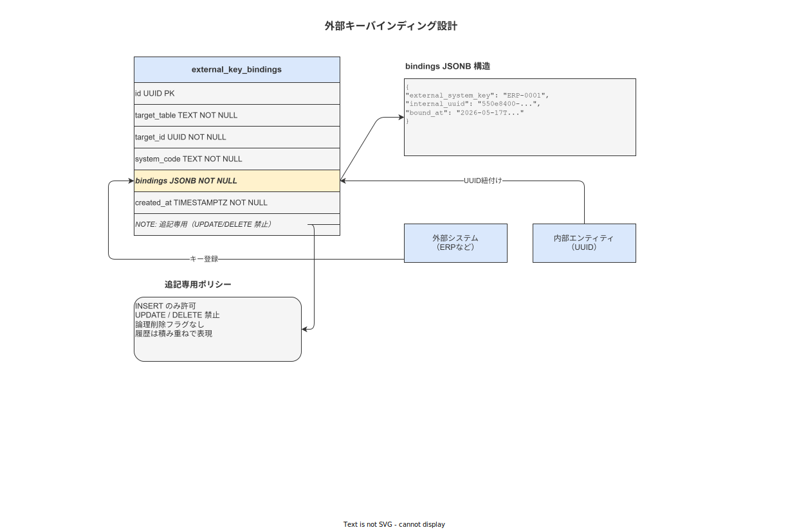

# 10 マスタコード体系と外部キーマッピング

本章の責務は、子機モードで使用する外部システム（親機 ERP/MES）との外部一意キーマッピング設計と、社内マスタコード体系（process_code・operation_code 等）の命名規約を確定することである。計画 12 章（外部システム連携アーキテクチャ）・計画 06 章（データモデル中核設計）の external_key_binding 設計を物理テーブルレベルに落とす。

**図 1: 外部キーマッピング概念図**



> 原本: [`img/fig_des_db_external_key_mapping.drawio`](img/fig_des_db_external_key_mapping.drawio)

---

## 1. 社内マスタコード体系

### 1-1. コード命名規約

| マスタ | コード列 | 形式 | 例 |
|---|---|---|---|
| Process | process_code | `{英大文字 2-4 字}-{連番 3 桁}` | `ASS-001`（組立プロセス）|
| Operation | operation_code | `{process_code}-{連番 3 桁}` | `ASS-001-003`（サブ工程）|
| Product | product_code | 外部システムに合わせた任意形式 | `P-A001-REV2` |
| SOP | sop_code | `{operation_code}-SOP-{連番 3 桁}` | `ASS-001-003-SOP-001` |
| Skill | skill_code | `{カテゴリ英字}-{連番 3 桁}` | `WLD-001`（溶接技能）|

### 1-2. コードの一意性制約

- 全コードは PostgreSQL の `UNIQUE` 制約で保護する
- コードは変更しない（変更不可の公開識別子）
- コードによる外部参照を許可する（`WHERE process_code = $1` 形式のクエリを許可）

---

## 2. 外部キーマッピング設計（TBL-027 external_key_bindings）

### 2-1. 子機モードでの識別子解決フロー

親機 ERP からマスタ同期する際、親機の識別子（ロット番号・製品コード等）を本アプリの内部 UUID（work_pattern_id）にマッピングする。

```
[親機 ERP]                    [本アプリ PostgreSQL]
lot_id="L001"                ←→ work_pattern_id={UUID}
product_code="P-A001-REV2"   ←→ sop_id={UUID}
                              ←→ external_key_binding テーブルで解決
```

### 2-2. 外部キー解決の具体手順

1. 親機から `{"lot_id": "L001", "product_code": "P-A001-REV2"}` を受信
2. TBL-027 の `external_key` JSONB 列で `@> '{"lot_id": "L001"}'::jsonb` 条件検索
3. `valid_from <= CURRENT_DATE AND (valid_to IS NULL OR valid_to >= CURRENT_DATE)` で有効なマッピングを取得
4. `work_pattern_id` を返す（複数マッピングが有効な場合は CONFLICT として `sync_status = 'CONFLICT'` に更新し、UI でオペレーターに確認を求める）

### 2-3. マッピング競合の処理

`sync_status = 'CONFLICT'` になったレコードは:
1. SCR-MC-007（Outbox/DLQ 監視画面）に警告表示
2. マスタ管理者が UI で正しいマッピングを選択（FR-SY-003 の差分処理内）
3. 選択後: 誤マッピングの `valid_to` を CURRENT_DATE-1 に設定 + 正しいマッピングを新規 INSERT

自動解決は禁止（計画 12 章の仕様）。

### 2-4. バインディングの追加・変更手順

```
新マッピング追加（旧マッピングを上書きしない）:
1. 旧レコードの valid_to = 新マッピング effective_date - 1 に UPDATE
2. 新レコードを INSERT（新 binding_id・valid_from = effective_date）
※ 変更は Append-only: 旧レコードを DELETE しない
```

---

## 3. work_patterns テーブル（TBL-028）の役割

`external_key_bindings` の解決先となる `work_patterns` は、外部 ID と SOP の中間エンティティである。

| 列名 | 型 | 説明 |
|---|---|---|
| work_pattern_id | UUID | PK |
| sop_id | UUID FK | 対応 SOP |
| operation_id | UUID FK | 対応オペレーション |
| pattern_name | JSONB | `{"ja": "...", "en": "..."}` |
| is_active | BOOLEAN | — |
| factory_id | UUID | （ver1.0.0 は定数値）|

---

## 4. 外部キーの JSONB 検索インデックス

TBL-027 の `external_key` 列（JSONB）に対して GIN インデックスを追加する。

```sql
-- 付録/99 にて IDX-017 として採番予定
CREATE INDEX idx_external_key_bindings_key_gin
  ON external_key_bindings USING GIN (external_key);
```

---

**本節で確定した方針**
- **社内マスタコードは `process_code → operation_code → sop_code` の階層形式を採用し、変更不可の公開識別子として PostgreSQL の UNIQUE 制約で保護する。**
- **外部キーマッピング（TBL-027）は Append-only で管理し、変更時は旧 `valid_to` 設定 + 新 INSERT の 2 件操作を必須とする。競合検出時は自動解決を禁止し、UI でオペレーターの確認を求める。**
- **`external_key` 列（JSONB）に GIN インデックスを設定し、親機からの多様なキー形式による検索を効率化する。**

---

## 参照業界分析

### 必須
- [`90_業界分析/17_サプライチェーンと作業依存性.md`](../../90_業界分析/17_サプライチェーンと作業依存性.md)

### 関連
- [`90_業界分析/29_競合製品と作業ナビ・MES・eBR市場.md`](../../90_業界分析/29_競合製品と作業ナビ・MES・eBR市場.md)
- [`90_業界分析/27_オフライン同期とデータ整合性.md`](../../90_業界分析/27_オフライン同期とデータ整合性.md)
