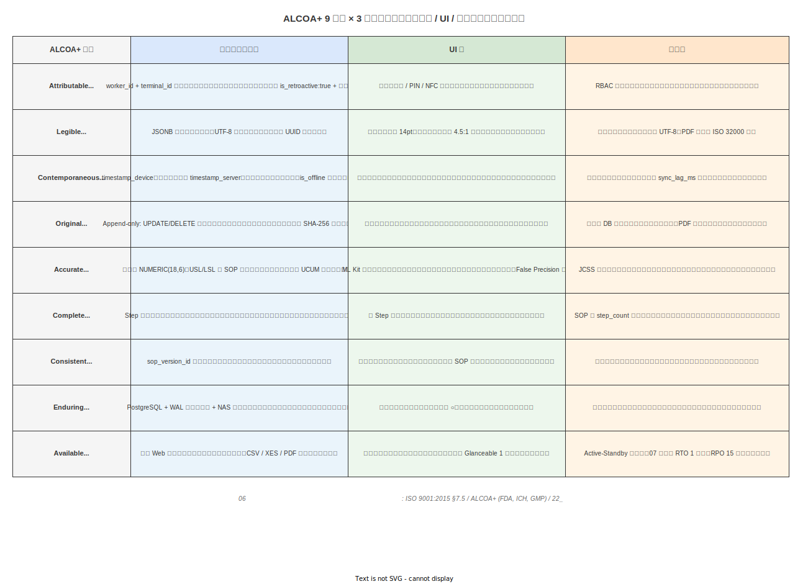

# 05 品質特性別アーキテクチャ戦略総覧

本章の責務は、要件定義フェーズが確定した非機能要件（NFR 全カテゴリ）を概要設計の各サブがどのように実現するかを、品質特性カテゴリ別のアーキテクチャ戦略として一覧化することである。本章は「どの NFR がどのサブで具体化されるか」の全体見取り図として機能し、各サブの詳細設計の前提を確定する。

---

## 1. NFR × 設計サブ マッピング概観

| NFR カテゴリ | 主担当サブ | 副担当サブ | 主要設計 ID 種 |
|---|---|---|---|
| NFR-AVL（可用性） | 01_システム方式設計 | 08_運用方式設計 | NODE/SUB/BAT/MET |
| NFR-PRF（性能・拡張性） | 04_データ設計 | 05_外部IF設計・01_システム | IDX/VW/API/MET |
| NFR-SEC（セキュリティ） | 07_セキュリティ方式設計 | 04_データ設計・05_外部IF | KEY/PRM/ERR/LOG |
| NFR-MNT（運用・保守性） | 08_運用方式設計 | 10_テスト方式設計 | LOG/BAT/MET |
| NFR-PRT（移植性） | 01_システム方式設計 | 02_ソフトウェア方式設計 | SUB/MOD |
| NFR-ETH（倫理品質） | 07_セキュリティ方式設計 | 03_画面設計・06_帳票設計 | PRM/ERR |
| NFR-OPS（運用要件） | 08_運用方式設計 | 01_システム方式設計 | BAT/JOB/MET/LOG |
| NFR-QUA（品質特性） | 02_ソフトウェア方式設計 | 10_テスト方式設計 | MOD/TLVL |
| NFR-DQ（データ品質/ALCOA+） | 04_データ設計 | 07_セキュリティ方式設計 | TBL/IDX/LOG |
| NFR-UX（ユーザビリティ/A11y） | 03_画面設計 | 02_ソフトウェア方式設計 | CMP/CFG |
| NFR-ENV（システム環境） | 01_システム方式設計 | — | NODE/ENV-ITEM |

---

## 2. 可用性（NFR-AVL）のアーキテクチャ戦略

**要件**: 稼働率 99.5%（業務時間内）、RTO 1h、RPO 15 分、Offline-First 縮退の 3 段階

| 設計決定 | 担当サブ | 根拠 NFR |
|---|---|---|
| Active-Standby 二重化（同一建屋内・手動切替） | 01_システム方式設計 §03 | NFR-AVL-011 |
| PostgreSQL WAL ストリーミング（5 分間隔）＋ PITR | 01_システム方式設計 §08 | NFR-AVL-015 |
| 日次 pg_dump 7 世代・週次オフサイト AES-256 暗号化 | 08_運用方式設計 §04 | NFR-AVL-016/017 |
| Offline-First 縮退（端末 SQLite が一次記録メモリ） | 02_ソフトウェア方式設計 §09 | NFR-AVL-020 |
| 3 段縮退（オフライン稼働→ローカルバッファ→紙フォールバック） | 08_運用方式設計 §07 | OPS-067〜082 |
| 地理冗長・クラウド・ホットスタンバイ | **対象外と判断する**（中小製造業・コスト・IT 担当 1 名制約）| NFR-AVL-010 |
| 2 プロセス分離による障害ドメイン分割（terminal-api / master-api）| 02_ソフトウェア方式設計 §01 | NFR-AVL |

> 補足（障害ドメイン）: terminal-api（8080）と master-api（8081）は独立した障害ドメインである。terminal-api が障害でもマスタ編集（master-api）は継続可能であり、master-api が障害でも現場作業記録（terminal-api）は継続可能である。

---

## 3. 性能・拡張性（NFR-PRF）のアーキテクチャ戦略

**要件**: 同時 500 名・Step 完了 P95 200ms・画面遷移 P95 500ms・Outbox 150,000 evt/日・5 年 1.5TB 以下

| 設計決定 | 担当サブ | 根拠 NFR |
|---|---|---|
| work_events の月次レンジパーティション | 04_データ設計 §06 | NFR-PRF-015 |
| (case_id, timestamp_server) B-Tree インデックス（最優先） | 04_データ設計 §06 | NFR-PRF-001 |
| outbox_events の Partial インデックス（status='PENDING'） | 04_データ設計 §06 | NFR-PRF-010 |
| Rust + tokio の async/await による非同期 I/O | 02_ソフトウェア方式設計 §01 | NFR-PRF-002 |
| Outbox Consumer の指数バックオフ（1s/4s/16s 最大 3 回） | 02_ソフトウェア方式設計 §10 | NFR-PRF-010 |
| 管理クエリ P95 3 秒: 読み取り専用ロール + 実体化ビュー | 04_データ設計 §03（VW） | NFR-PRF-004 |
| 水平スケールアウト | **対象外と判断する**（IIS + Docker Compose・垂直スケールで対応）| NFR-PRF-020 |

---

## 4. セキュリティ（NFR-SEC）のアーキテクチャ戦略

**要件**: JWT RS256・RBAC 6 ロール・TLS 1.3・SHA-256 ハッシュチェーン・ALCOA+ 全原則・OWASP Top 10 A01/A02/A03

| 設計決定 | 担当サブ | 根拠 NFR |
|---|---|---|
| JWT RS256（RSA 4096bit・有効期限 8h・90 日ローテーション） | 07_セキュリティ §03 | NFR-SEC-010〜015 |
| RBAC: 6 ロール × 35 SCR × 86 FR の PRM マトリクス | 07_セキュリティ §02 | NFR-SEC-020〜030 |
| TLS 1.3 必須（HTTP 禁止）| 05_外部IF設計 §11 | NFR-SEC-005 |
| SQLite at-rest: SQLCipher（端末 Keystore/Keychain で鍵管理） | 04_データ設計 §12 | NFR-SEC-040 |
| DB ロール分離: INSERT 専用ロール（app_event）・管理ロール | 04_データ設計 §05 | NFR-SEC-040 |
| SHA-256 ハッシュチェーン（week 次バッチ検証） | 04_データ設計 §05 | NFR-SEC-050 |
| PII 匿名化バッチ（退職 60 日以内）| 08_運用方式設計 §05 | NFR-SEC-035 |
| MFA（多要素認証） | **対象外と判断する**（社内 LAN 完結・中小製造業 IT 担当 1 名制約）| NFR-SEC（明示）|

---

## 5. 運用・保守性（NFR-MNT）のアーキテクチャ戦略

**要件**: IT 担当 1 名で全運用可・週次ヘルスチェック 30 分以内・JSON 構造化ログ・CVSS 9.0+ 3 日パッチ

| 設計決定 | 担当サブ | 根拠 NFR |
|---|---|---|
| 構造化ログ（JSON 形式）・日次ローテ・30 日保全 | 08_運用方式設計 §02 | NFR-MNT（OPS-038）|
| Pull 型監視メトリクス（Prometheus 互換）| 08_運用方式設計 §03 | NFR-MNT（OPS-025）|
| cargo audit・npm audit 週次実行バッチ | 08_運用方式設計 §05 | NFR-MNT（OPS-011）|
| GUI 初期構築ウィザード（IT 担当 1 名適合） | 08_運用方式設計 §10 | NFR-MNT（OPS-001）|
| プッシュ型自動アラート（外部 Webhook・Slack 等） | **対象外と判断する**（ver1.0.0 スコープ外）| OPS-025 |

---

## 6. 倫理品質（NFR-ETH）のアーキテクチャ戦略

**要件**: 用途三限定（品質保証/工程改善/教育設計）・個人別ランキング禁止・データ最小化・Just Culture

| 設計決定 | 担当サブ | 根拠 |
|---|---|---|
| 倫理ガード: 個人別集計 API エンドポイントを設計上排除 | 07_セキュリティ §08 | BR-BUS-029・NFR-ETH |
| 帳票: 個人別集計レポートレイアウトを定義しない | 06_帳票設計 §08・99 | BR-BUS-029 |
| 運用ダッシュボード: `GROUP BY worker_id` を含む集計ビューを作成しない | 08_運用方式設計 §08 | BR-BUS-029 |
| RBAC: supervisor ロールの worker 個人行動閲覧権限を付与しない | 07_セキュリティ §02 | BR-BUS-028 |
| 退職者の PII 匿名化（worker_id → UUID 置換）| 04_データ設計 §09 | NFR-ETH・NFR-SEC |
| 位置情報・生体情報（顔写真除く）の収集 | **対象外と判断する**（構想 04 章 倫理スタンス）| NFR-ETH |

---

## 7. データ品質 ALCOA+（NFR-DQ）のアーキテクチャ戦略

**要件**: ALCOA+ 9 原則（Attributable/Legible/Contemporaneous/Original/Accurate/Complete/Consistent/Enduring/Available）

| ALCOA+ 原則 | 設計での実現手段 | 担当サブ |
|---|---|---|
| **Attributable（帰属可能）** | WorkEvent 8 必須属性の worker_id・terminal_id 必須記録。RBAC で記録者 = 実施者 | 04_データ設計・07_セキュリティ |
| **Legible（可読）** | 多言語表示（FR-UI-001）・instruction_text の JSONB 多言語対応・PDF/A-3 出力 | 03_画面設計・06_帳票設計 |
| **Contemporaneous（同時記録）** | timestamp_client（端末時刻）＋ timestamp_server（サーバー受信時刻）の二重タイムスタンプ | 04_データ設計 §05 |
| **Original（原本性）** | 証拠ファイルの SHA-256 ハッシュ保存・端末タイムスタンプを申告時刻として固定 | 04_データ設計 §05 |
| **Accurate（正確性）** | 数値入力の UCUM 単位・USL/LSL バリデーション（BR-BUS-030）・スキーマバリデーション | 02_ソフトウェア方式設計 §07 |
| **Complete（完全性）** | ロックステップ進行（BR-BUS-001）・必須証拠ゲート（BR-BUS-003）・スキップ記録（step_skipped） | 04_データ設計 §05 |
| **Consistent（一貫性）** | SHA-256 ハッシュチェーン（prev_hash）・週次バッチ検証 | 04_データ設計 §05 |
| **Enduring（永続性）** | 7 年以上保存・Append-only（UPDATE/DELETE 禁止）・PDF/A-3 帳票保管 | 04_データ設計 §09・06_帳票 |
| **Available（利用可能）** | Offline-First 縮退・年次復旧テスト・マルチ形式エクスポート（SQL/CSV/JSON） | 01_システム・08_運用 |

**図 1: ALCOA+ 原則マッピング（企画/計画 原本継承）**

> 原本: [`../02_企画/システム化計画/img/fig_alcoa_mapping.drawio`](../02_企画/システム化計画/img/fig_alcoa_mapping.drawio)

---

## 8. ユーザビリティ・アクセシビリティ（NFR-UX）のアーキテクチャ戦略

**要件**: JIS X 8341-3（WCAG 2.1）AA 準拠・タッチターゲット 44dp 必須/72dp 推奨・夜勤ダークモード・多言語・やさしい日本語

| 設計決定 | 担当サブ | 根拠 NFR |
|---|---|---|
| タッチターゲット 72dp 推奨（CFG-013 で configurable） | 03_画面設計 §05 | NFR-UX-009 |
| 夜勤ダークモード自動切替（20:00-6:00、CFG 定義）| 03_画面設計 §05 | NFR-UX-005 |
| 色覚多様性対応（色+記号の併用・P/D/T 型テスト） | 03_画面設計 §10 | NFR-UX-008 |
| 1 画面 = 1 Step 原則 | 03_画面設計 §06 | NFR-UX |
| コントラスト比 4.5:1 以上（drawio-authoring 規約でも適用） | 03_画面設計 §10 | NFR-UX-007 |

---

## 9. システム環境・エコロジー（NFR-ENV）のアーキテクチャ戦略

**要件**: タブレット IP54/MIL-STD-810H・サーバー 4C/16GB/SSD 1TB RAID1・動作温度 0〜50℃

| 設計決定 | 担当サブ | 根拠 NFR |
|---|---|---|
| タブレット選定: IP54/MIL-STD-810H・8 型・400nits 以上 | 01_システム方式設計 §09 | NFR-ENV |
| サーバーサイジング: 4C/16GB/1TB RAID1（250W 目標） | 01_システム方式設計 §06 | NFR-ENV |
| OSS ライセンス方針: MIT/Apache 2.0 許可、GPL 禁止 | 01_システム方式設計 §10 | NFR-ENV（ライセンス） |

---

## 10. 品質特性（NFR-QUA・ISO/IEC 25010 補助）のアーキテクチャ戦略

**要件**: 機能完全性 E2E 通過・OpenAPI 3.1 仕様管理・Offline-First 障害許容性・レイヤードアーキテクチャ

| 設計決定 | 担当サブ | 根拠 NFR |
|---|---|---|
| レイヤードアーキテクチャ（Presentation/Application/Domain/Infrastructure） | 02_ソフトウェア方式設計 §02 | NFR-QUA |
| OpenAPI 3.1 でエンドポイント仕様管理 | 05_外部IF設計 §02 | NFR-QUA |
| cargo test（単体・結合）+ Detox（E2E） | 10_テスト方式設計 §02 | NFR-QUA |
| スキーマ移行: sqlx migrate（15 分以内が品質目標） | 04_データ設計 §11 | NFR-QUA |

---

**本節で確定した方針**
- **NFR 全 11 カテゴリのアーキテクチャ戦略を確定し、各カテゴリが担当サブとどう対応するかを明示した。「対象外と判断する」事項には根拠を付記し、下流設計での再検討を禁止する。**
- **ALCOA+ 9 原則のアーキテクチャ展開（8 原則 × 担当サブ）を確定し、設計フェーズでの ALCOA+ 実現の責務を具体的なサブと設計 ID に配布した。**
- **倫理ガード（個人別ランキング・監視の技術的拒否）を 07_セキュリティ §08 に集約し、03_画面・06_帳票・08_運用でも 99 章に再宣言することで多層的に保護する。**

---

## 参照業界分析

### 必須
- [`90_業界分析/06_品質管理とトレーサビリティ.md`](../90_業界分析/06_品質管理とトレーサビリティ.md)
- [`90_業界分析/24_作業者プライバシー・データ倫理と労務監視.md`](../90_業界分析/24_作業者プライバシー・データ倫理と労務監視.md)

### 関連
- [`90_業界分析/27_オフライン同期とデータ整合性.md`](../90_業界分析/27_オフライン同期とデータ整合性.md)
- [`90_業界分析/18_現場HCIと作業者インターフェース.md`](../90_業界分析/18_現場HCIと作業者インターフェース.md)
