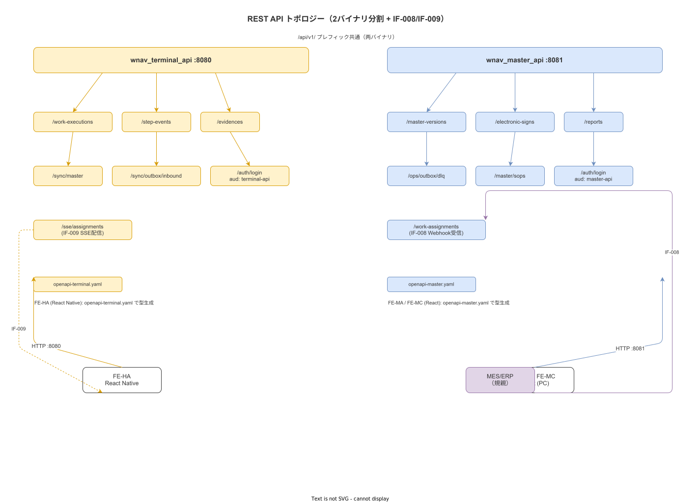

# 01 外部 IF 総覧（IF-001〜007 継承）

本章の責務は、要件定義フェーズで確定した 7 外部インタフェース（IF-001〜007）を概要設計レベルで再確認し、各 IF の方式・認証・担当章・設計 ID を一元化することである。

**図 1: 外部 IF トポロジー図（IF-001〜007 全体）**

> 原本: [`img/fig_des_api_topology.drawio`](img/fig_des_api_topology.drawio)

---

## 1. 外部 IF 総覧

| IF-ID | 名称 | 方向 | プロトコル | 認証 | 担当章 | 対応設計 ID |
|---|---|---|---|---|---|---|
| IF-001 | 親機 ⇔ 子機 マスタ同期 | バックエンド ← 親機（Pull）| HTTPS/REST/JSON | JWT RS256 | §04 | API-sync-001 |
| IF-002 | 子機 → 親機 Outbox 実績送信 | バックエンド → 親機（Push）| HTTPS/REST/JSON + HMAC-SHA256 | JWT RS256 + Idempotency-Key | §05 | API-sync-002 |
| IF-003 | 認証連携（LDAP/AD）| バックエンド ← LDAP | LDAPS（636）| LDAP Bind | §06 | — |
| IF-004 | プリンタ印刷 | バックエンド → プリンタ | LAN/IPP（任意）| プリンタ側設定 | §07 | — |
| IF-005 | バーコード/QR スキャナ | 端末 ← スキャナ | USB HID / Bluetooth HID | 機器ペアリング | §08 | — |
| IF-006 | IoT 計測器（ノギス・温度計等）| 端末 ← 計測器 | Bluetooth GATT / USB CDC-ACM | 機器ペアリング | §08 | — |
| IF-007 | カメラ（端末内蔵）| 端末 ← OS Camera API | OS API（Android/iOS/Windows）| OS パーミッション | §09 | — |

---

## 2. 全 IF の共通要件

| 要件 | 内容 |
|---|---|
| 通信プロトコル | HTTPS（IF-001〜003）/ OS API（IF-004〜007）|
| TLS バージョン | TLS 1.3 必須（IF-001〜003）|
| 文字コード | UTF-8 |
| 時刻フォーマット | ISO 8601・UTC で記録・JST 表示は UI 層で変換 |
| API スタイル | REST + JSON（IF-001/002）|
| 仕様管理 | OpenAPI 3.1（IF-001/002）|

---

## 3. 子機モード固有の IF 設計方針

子機モードの連携方式は計画 12 章で 3 形態に確定した。本 IF 設計はその物理設計への落とし込みである。

| 連携モード | IF-001 の動作 | IF-002 の動作 |
|---|---|---|
| 単独動作 | 使用しない | 使用しない |
| 子機モード READ-ONLY | 親機からマスタ受信のみ | 使用しない |
| 子機モード 双方向 | 親機からマスタ受信 | 親機へ実績送信 |

連携モードは設定ファイル（CFG-007 = `integration.mode`）で切替え。再デプロイ不要。

---

**本節で確定した方針**
- **IF-001〜007 全 7 件の方式・認証・担当章・設計 ID を確定し、要件定義の外部 IF 要件を概要設計レベルで完全に引き継いだ。**
- **子機モード 3 形態（単独/READ-ONLY/双方向）は設定ファイルで切替え可能とし、再デプロイ不要な設計を確定した。**

---

## 参照業界分析

### 必須
- [`90_業界分析/27_オフライン同期とデータ整合性.md`](../../90_業界分析/27_オフライン同期とデータ整合性.md)

### 関連
- [`90_業界分析/29_競合製品と作業ナビ・MES・eBR市場.md`](../../90_業界分析/29_競合製品と作業ナビ・MES・eBR市場.md)
