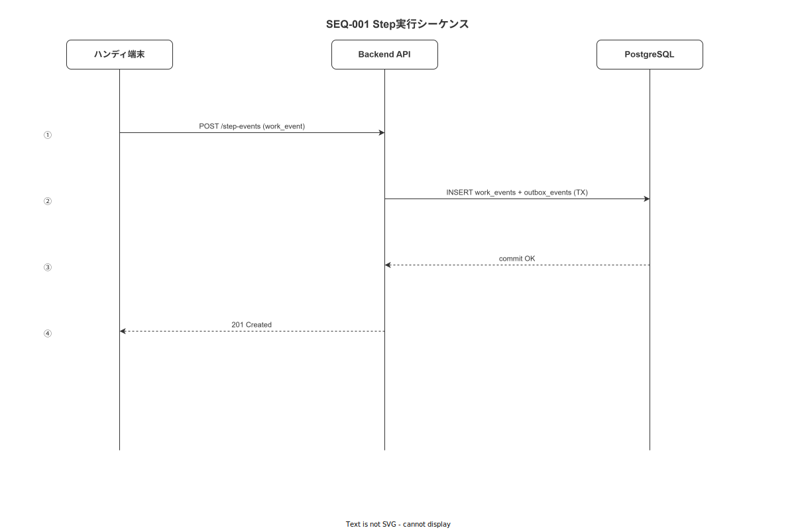
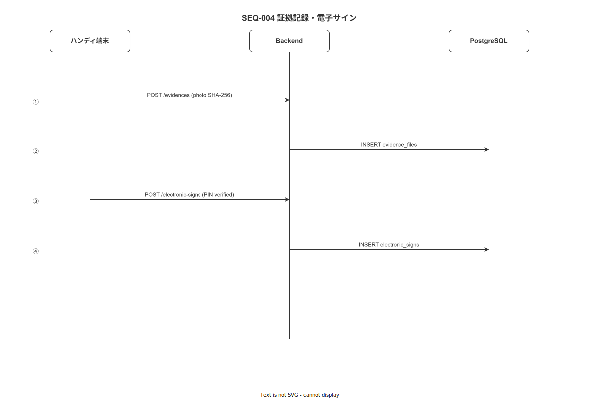
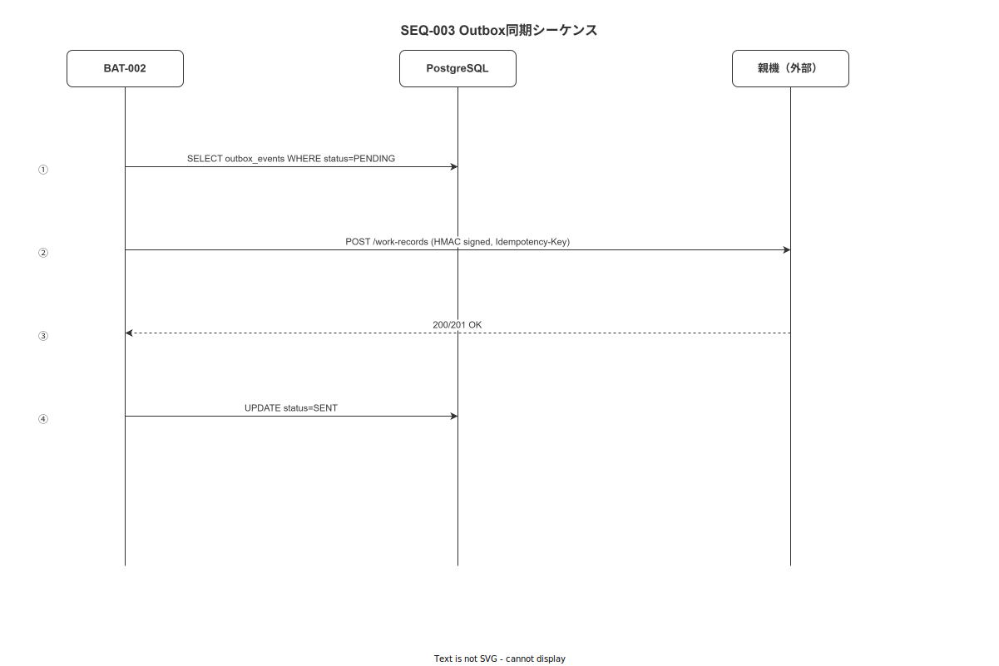
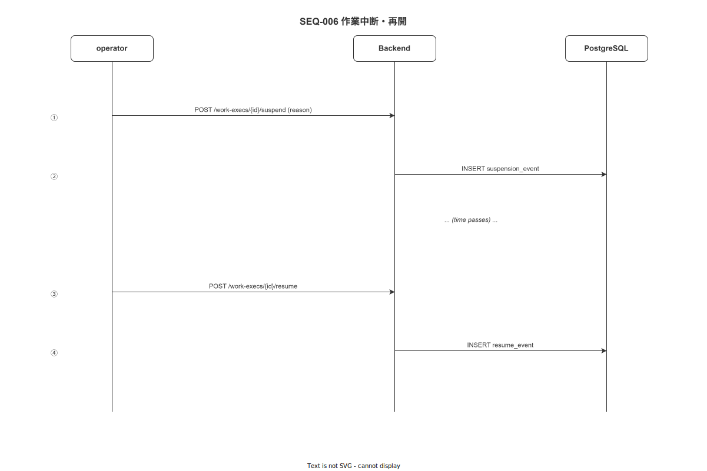
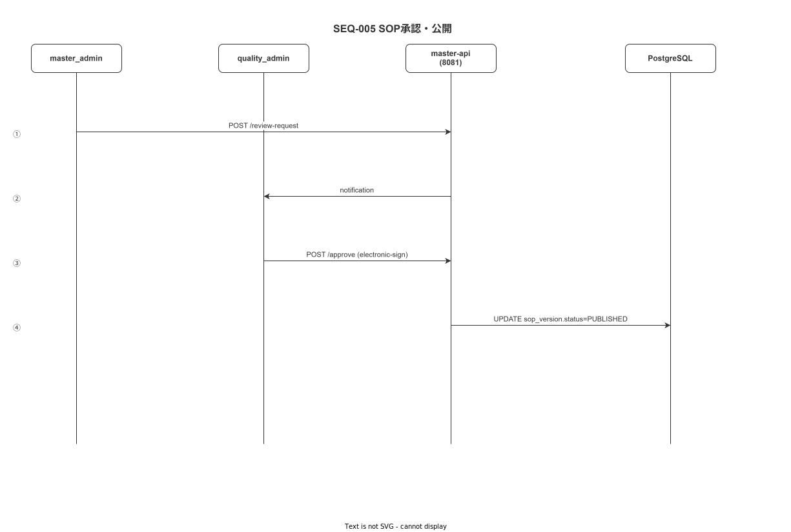
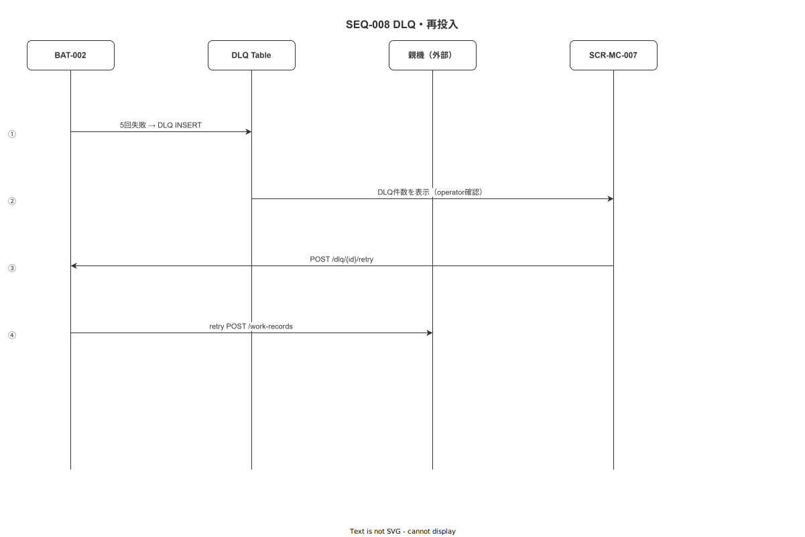
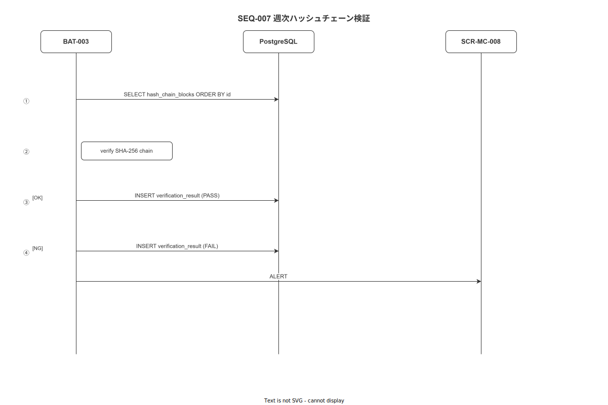
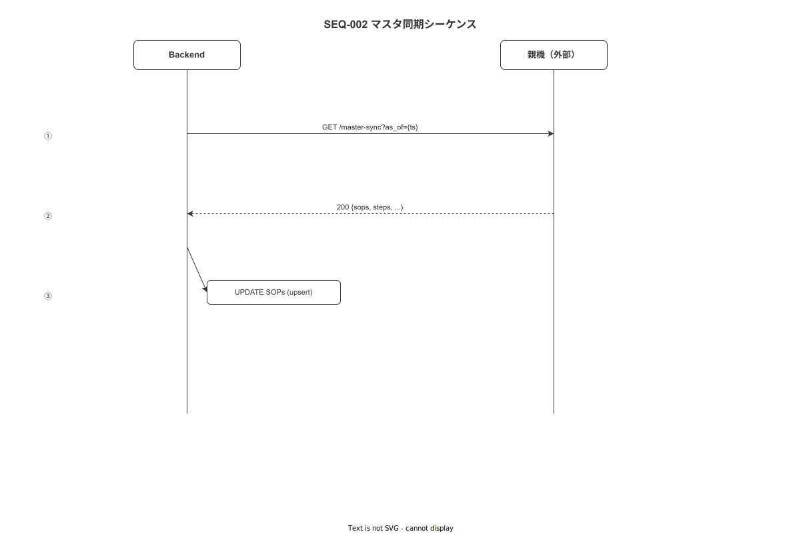

# 10 シーケンス図集（主要フロー）

本章の責務は、SEQ-001〜008 の全シーケンスを文章で記述し、drawio 図（`img/` 配下）の作成指示を確定することである。

---

## SEQ-001: 作業開始〜Step 実行〜完了（UC-001/002）

**図 1: 作業開始〜Step 実行〜完了シーケンス（SEQ-001）**



> 原本: [`img/fig_des_seq_step_execution.drawio`](img/fig_des_seq_step_execution.drawio)

```
参加者: Operator（端末）、StepEngine（FE-HA）、LocalDB（SQLite）、terminal-api（wnav_terminal_api:8080）、PostgreSQL

1. Operator: QR スキャンまたはリスト選択
2. FE-HA → terminal-api: GET /api/v1/work-orders?sop_code={code}
3. terminal-api → FE-HA: SOP 情報・Step 一覧（マスタキャッシュが新しければ LocalDB から取得）
4. FE-HA → terminal-api: POST /api/v1/work-executions（Idempotency-Key 付き）
5. terminal-api → PostgreSQL: work_executions INSERT
6. terminal-api → FE-HA: 201 Created（work_execution_id）

[Step 実行ループ]
7. Operator: Step 内容を確認・入力（boolean_check / numeric_input 等）
8. StepEngine: ロックステップ検証（BR-BUS-001/003）
9. StepEngine → LocalDB: work_events INSERT（SQLite・Offline-First）
10. StepEngine → LocalDB: outbox_events INSERT（PENDING）
11. OutboxWorker（バックグラウンド）→ terminal-api: POST /api/v1/work-executions/{id}/events
12. terminal-api: Idempotency Key 確認 → HashChainService で prev_hash 取得・content_hash 計算
13. terminal-api → PostgreSQL: work_events INSERT（Append-only）+ outbox_events INSERT（同一 TX）
14. terminal-api → LocalDB（OutboxWorker 経由）: status = SENT
15. FE-HA: 次 Step へ進行 or 完了

[作業完了]
16. FE-HA → terminal-api: POST /api/v1/work-executions/{id}/complete
17. terminal-api → PostgreSQL: work_executions.status = COMPLETED
```

---

## SEQ-002: 証拠記録と電子サイン（UC-006/009）

**図 2: 証拠記録と電子サインシーケンス（SEQ-002）**



> 原本: [`img/fig_des_seq_evidence_sign.drawio`](img/fig_des_seq_evidence_sign.drawio)

```
参加者: Operator（端末）、StepEngine（FE-HA）、terminal-api（wnav_terminal_api:8080）、PostgreSQL

1. Step で evidence_required = TRUE のタイプに到達
2. StepEngine: カメラ起動（FR-EV-002）
3. Operator: 写真撮影
4. FE-HA: Exif 削除 → JPEG 圧縮 → SHA-256 計算
5. FE-HA → terminal-api: POST /api/v1/evidences（multipart）
6. terminal-api: SHA-256 突合 → NAS ファイル書き込み → TBL-009 INSERT
7. terminal-api → FE-HA: evidence_id 返却
8. FE-HA: evidence_id を Step 完了 payload に含める

[電子サイン（sign_required = TRUE のStep 等）]
9. FE-HA: 電子サインパッド表示（CMP-HA-007）
10. Operator: PIN 入力（本人認証再入力 BR-BUS-011）
11. FE-HA → terminal-api: POST /api/v1/electronic-signs（signer_id + timestamp + meaning + content_hash）
12. terminal-api → PostgreSQL: electronic_signs INSERT（Append-only）
13. terminal-api → FE-HA: sign_id 返却
```

---

## SEQ-003: Outbox 同期と Idempotency（UC-020/021）

**図 3: Outbox 同期と Idempotency シーケンス（SEQ-003）**



> 原本: [`img/fig_des_seq_outbox_sync.drawio`](img/fig_des_seq_outbox_sync.drawio)

```
参加者: BAT-002（wnav_terminal_api 内 OutboxWorker）、PostgreSQL、親機（外部）

[Outbox Consumer ループ（BAT-002 @ wnav_terminal_api）]
1. BAT-002: TBL-003 から status = PENDING の行を N 件取得
2. BAT-002: status → SENDING（楽観ロック付き UPDATE）
3. BAT-002 → 親機: POST {親機}/api/v1/sync/outbox/inbound（IF-002）
   または: BAT-002 → terminal-api 内部: POST /api/v1/work-executions/{id}/events
4. 送信成功: status → SENT、sent_at = NOW()
5. 送信失敗（4xx/5xx）: retry_count++、next_retry_at = NOW() + backoff
   → retry_count >= 5: status → DLQ、MET-005 increment

[Idempotency 確認（受信側）]
6. 受信 API: TBL-035（idempotency_keys）に Idempotency-Key を確認
7. 存在する場合: 前回の 200 OK レスポンスをそのまま返す
8. 存在しない場合: 通常処理 → TBL-035 に INSERT（24h TTL）
```

---

## SEQ-004: 中断・再開（UC-010/011）

**図 4: 中断・再開シーケンス（SEQ-004）**



> 原本: [`img/fig_des_seq_suspend_resume.drawio`](img/fig_des_seq_suspend_resume.drawio)

```
参加者: Operator（端末）、FE-HA、terminal-api（wnav_terminal_api:8080）、PostgreSQL

[中断]
1. Operator: 中断ボタン押下（SCR-HA-011）
2. FE-HA: 中断理由カテゴリ選択（FR-ST-001）
3. FE-HA → terminal-api: POST /api/v1/work-executions/{id}/suspend
4. terminal-api → PostgreSQL: suspensions INSERT（Append-only）+ work_executions.status = SUSPENDED
5. FE-HA: 電子サイン要求（FR-ST-003）→ POST /api/v1/electronic-signs（→ terminal-api）

[再開]
6. 別の Operator: SCR-HA-012 で再開可能作業を選択
7. FE-HA → terminal-api: POST /api/v1/work-executions/{id}/resume
8. terminal-api: 再開可否判定（FR-ST-006）・本人認証確認
9. terminal-api → PostgreSQL: work_executions.status = IN_PROGRESS、current_step_index 復元
10. FE-HA: チェックポイント表示（FR-ST-005）→ Step 実行再開
```

---

## SEQ-005: マスタ Publish 承認フロー（UC-014/016）

**図 5: マスタ Publish 承認フローシーケンス（SEQ-005）**



> 原本: [`img/fig_des_seq_master_publish.drawio`](img/fig_des_seq_master_publish.drawio)

```
参加者: MasterAdmin（FE-MA）、QualityAdmin（FE-MA）、master-api（wnav_master_api:8081）、PostgreSQL

1. MasterAdmin: SOP ドラフト作成（POST /api/v1/master-versions/draft → master-api:8081）
2. MasterAdmin: レビュー依頼（POST /api/v1/master-versions/{id}/submit → master-api:8081）
3. QualityAdmin: 差分確認（GET /api/v1/master-versions/{id} → master-api:8081）
4. QualityAdmin: dry-run で影響確認（POST /api/v1/master-versions/{id}/dry-run → master-api:8081）
5. QualityAdmin: 電子サインで承認（POST /api/v1/electronic-signs + POST /api/v1/master-versions/{id}/approve → master-api:8081）
6. master-api: sign_id 確認 → master_versions.status = PUBLISHED
7. master-api → MSG-004（internal.master_published）: tokio channel で配信
8. BAT-003（master_sync_puller @ wnav_terminal_api）: 次回同期で端末に差分配信
```

---

## SEQ-006: Webhook 配信失敗 → DLQ → 再送（UC-020）

**図 6: Webhook 配信失敗 → DLQ → 再送シーケンス（SEQ-006）**



> 原本: [`img/fig_des_seq_webhook_dlq.drawio`](img/fig_des_seq_webhook_dlq.drawio)

```
参加者: BAT-002（wnav_terminal_api 内 OutboxWorker）、DLQ Table（PostgreSQL）、親機（外部）、SCR-MC-007（管理コンソール @ master-api）

1. BAT-002（wnav_terminal_api 内）: 親機 API に POST 送信
2. 親機 API: 503 Service Unavailable を返す
3. BAT-002: retry_count++、次 retry_at を計算
4. [3 回リトライ後も失敗]
5. BAT-002: status → DLQ、LOG-008 記録、MET-005 increment
6. SCR-MC-007（OutboxMonitor @ master-api 経由）: DLQ カウントをダッシュボードに表示
7. IT 担当: API-ops-002（POST /ops/outbox/{id}/requeue @ terminal-api）で手動再投入
8. BAT-002: 再投入された PENDING 行を次ループで処理
```

---

## SEQ-007: ハッシュチェーン検証ジョブ（BAT-001）

**図 7: ハッシュチェーン検証ジョブシーケンス（SEQ-007）**



> 原本: [`img/fig_des_seq_hash_chain_verify.drawio`](img/fig_des_seq_hash_chain_verify.drawio)

```
1. BAT-001（週次 cron）起動
2. PostgreSQL: 最新 HashChainBlock（TBL-031）の last_content_hash を取得
3. 対象期間の work_events を timestamp_server 昇順で全件取得
4. 各 work_event に対して: 
   prev_hash が直前 work_event の content_hash と一致するか検証
5. 一致しない行を発見 → ERR-DB-003 + LOG-007（SECURITY）記録 + MET-006 increment
6. 全件一致 → 新 HashChainBlock を TBL-031 に INSERT
7. MET-006（hash_chain.break_count）: 0 のまま
```

---

## SEQ-008: 親機マスタ同期（UC-019）

**図 8: 親機マスタ同期シーケンス（SEQ-008）**



> 原本: [`img/fig_des_seq_master_pull.drawio`](img/fig_des_seq_master_pull.drawio)

```
参加者: BAT-003（wnav_terminal_api 内 master_sync_puller）、terminal-api（wnav_terminal_api:8080）、親機（外部）

1. BAT-003（60 分 cron @ wnav_terminal_api）またはユーザー手動トリガ
2. terminal-api → 親機: GET {親機}/api/v1/sync/master?as_of={last_sync_ts}
3. 親機: 差分データ（SOP・Step 等）を JSON で返す
4. terminal-api: 差分を PostgreSQL（マスタテーブル）に UPSERT
5. terminal-api: device_sync_states を更新
6. 次回ハンディ APP の同期時（API-sync-001）に端末へ差分配信
```

---

**本節で確定した方針**
- **SEQ-001〜008 の全シーケンスを文章で確定し、各シーケンスに対応する drawio 図ファイル名（fig_des_seq_{name}）を指定した。**
- **ハンディ端末 → バックエンド のフロー（StepEngine, Outbox, Evidence, 中断・再開, マスタ同期）はバックエンド参加者名を「terminal-api（wnav_terminal_api:8080）」に統一した。**
- **管理コンソール / マスタメンテ → バックエンド のフロー（SOP 承認・Publish）はバックエンド参加者名を「master-api（wnav_master_api:8081）」に統一した。**
- **認証フロー（/auth/login）はアクセス元に応じて「terminal-api（ハンディ端末向け・aud: terminal-api）」または「master-api（Web 向け・aud: master-api）」に分けて記述することを確定した。**
- **全シーケンスで Idempotency-Key・Append-only・二重タイムスタンプ（timestamp_client/server）・電子サイン 4 要素が適切に組み込まれていることを確認した。**

---

## 参照業界分析

### 必須
- [`90_業界分析/06_品質管理とトレーサビリティ.md`](../../90_業界分析/06_品質管理とトレーサビリティ.md)
- [`90_業界分析/27_オフライン同期とデータ整合性.md`](../../90_業界分析/27_オフライン同期とデータ整合性.md)

### 関連
- [`90_業界分析/22_規制別トレーサビリティ要件詳論.md`](../../90_業界分析/22_規制別トレーサビリティ要件詳論.md)
- [`90_業界分析/21_作業ログ分析とプロセスマイニング.md`](../../90_業界分析/21_作業ログ分析とプロセスマイニング.md)
