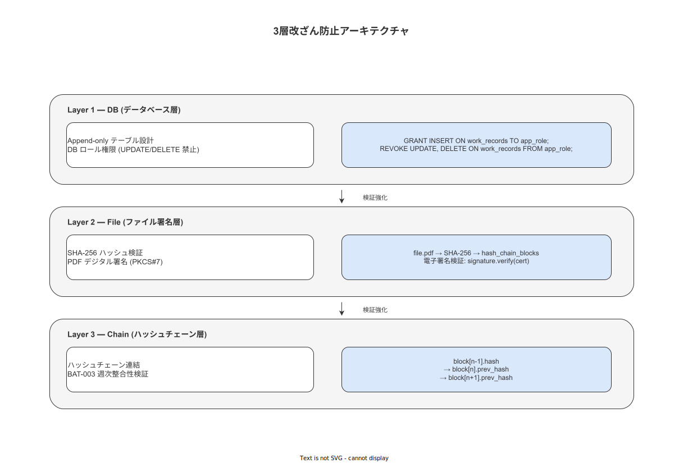

# 09 帳票改ざん防止技術設計

本章の責務は、6 件の帳票（RP-001〜006）の改ざん防止を技術的に保証する方式を確定することである。NFR-SEC-007〜009（帳票完全性）・NFR-ALC-003（原本性）・NFR-ALC-008（永続性）・BR-BUS-016（完了済 Step の修正禁止）を本章で担保する。

---

## 1. 改ざん防止の 3 層アーキテクチャ

帳票の改ざん防止は以下の 3 層で実装する。

| 層 | 方式 | 実装箇所 |
|---|---|---|
| 第 1 層: データソース完全性 | Append-only テーブル + DB ロール権限 | PostgreSQL（`04_データ設計/05_イベントストア設計`）|
| 第 2 層: 帳票ファイル完全性 | SHA-256 ハッシュ + PDF デジタル署名 | 帳票生成パイプライン（BAT-006〜010）|
| 第 3 層: ハッシュチェーン連結 | 連鎖 SHA-256 ハッシュ検証 | hash_chain_blocks テーブル + BAT-003 |

**図 1: 帳票改ざん防止 3 層アーキテクチャ**



> 原本: [`img/fig_des_report_tamper_proof.drawio`](img/fig_des_report_tamper_proof.drawio)

---

## 2. SHA-256 ハッシュ計算方式

### 2-1. 帳票ハッシュの算出対象

各帳票ファイルの SHA-256 は以下の順序で連結したバイト列から算出する。

```
document_hash = SHA-256(
  report_type         ||  # "RP-001" 等の固定文字列
  report_id           ||  # UUID v7
  template_version    ||  # "TPL-001:1.2.3" 形式
  generated_at_utc    ||  # ISO 8601 UTC タイムスタンプ
  pdf_binary_content      # PDF/A-3 バイナリ全体（署名前）
)
```

### 2-2. ハッシュの格納先

| 格納先 | 格納形式 | 目的 |
|---|---|---|
| PDF/A-3 XMP メタデータ (`dc:description`) | Base64 エンコード SHA-256 | PDF 単体での完全性確認 |
| `hash_chain_blocks` テーブル (`content_hash` カラム）| hex 文字列 | ハッシュチェーン連結 |
| `report_metadata` テーブル (`document_hash` カラム）| hex 文字列 | 個別帳票の検索・照合 |

---

## 3. PDF デジタル署名方式

### 3-1. 署名方式

| 項目 | 仕様 |
|---|---|
| 署名規格 | PKCS#7 / CAdES-B（RFC 5652 準拠）|
| 署名アルゴリズム | RSA-4096 + SHA-256 |
| 署名者 | システム署名（サーバー自己署名証明書 KEY-007）|
| 電子サイン紐付け | `sign_id`（TBL-002 電子サイン ID）を署名属性に埋め込む |
| タイムスタンプ | RFC 3161 タイムスタンプトークン（外部 TSA 利用）|

### 3-2. 署名後の不変性保証

PDF/A-3 に署名した後は追記不可とする。修正が必要な場合は訂正事象（Correction Event）として新規帳票を生成し、元帳票に `corrected_by: {new_report_id}` のメタデータを付加する。元帳票を削除・上書きしない（NFR-ALC-003 原本性）。

---

## 4. ハッシュチェーン連結設計

### 4-1. hash_chain_blocks テーブル（TBL-031）への帳票登録

帳票生成時に以下のレコードを `hash_chain_blocks` に INSERT する（Append-only、更新・削除禁止）:

| カラム | 値 |
|---|---|
| `block_id` | UUID v7（生成順序が埋め込まれた識別子）|
| `block_type` | `'REPORT'`（WorkEvent は `'WORK_EVENT'`）|
| `ref_id` | 帳票 ID（`report_id`）|
| `content_hash` | SHA-256（帳票バイナリ）|
| `prev_hash` | 直前ブロックの `content_hash`（genesis ブロックは `'0' × 64`）|
| `chain_hash` | SHA-256（`prev_hash || content_hash`）|
| `created_at` | UTC タイムスタンプ（DB サーバー時刻）|

### 4-2. 週次ハッシュチェーン検証（BAT-003）

BAT-003 は毎週月曜 03:00 に全 `hash_chain_blocks` レコードを順次再計算し、`chain_hash` の整合性を検証する。破断を検知した場合は SCR-MC-008（ハッシュチェーン検証画面）にアラートを表示し、`hash_chain_verification_results` テーブルにエラー記録を INSERT する（LOG-009）。

---

## 5. PDF/A-3 フォーマットの採用根拠

| 要件 | PDF/A-3 による対応 |
|---|---|
| 長期保管（7 年以上）| ISO 19005-3 準拠。自己完結型フォーマット（フォント埋め込み必須）|
| 電子署名との共存 | PDF/A-3 は PDF デジタル署名（ISO 32000-2）と共存可能 |
| 添付ファイル | XML ソースデータ（XES/JSON）を PDF 内に添付可能（part 3 の特徴）|
| フォント指定 | Noto Sans JP / Noto Sans を埋め込む（ビットマップフォント禁止）|

---

## 6. テンプレート完全性の保護

帳票テンプレートファイル（TPL-001〜006）の改ざんを防止するため、以下の方式を採用する。

| 方式 | 実装 |
|---|---|
| テンプレートハッシュ事前登録 | 起動時に `config_snapshots` テーブルのテンプレートハッシュ値と現在ファイルの SHA-256 を比較（不一致は ERR-SYS-004 で起動拒否）|
| git バージョン管理 | テンプレートファイルは専用リポジトリブランチ `config/templates` で管理 |
| 変更承認プロセス | テンプレート変更は master_admin + quality_admin の二段階承認（同一 SOP 承認フロー）|

---

**本節で確定した方針**
- **データソース完全性（Append-only DB）・帳票ファイル完全性（SHA-256 + PDF デジタル署名）・ハッシュチェーン連結（hash_chain_blocks）の 3 層改ざん防止アーキテクチャを確定した。**
- **PDF/A-3 + PKCS#7 デジタル署名 + RFC 3161 タイムスタンプを採用し、電子サイン ID（sign_id）との紐付けによって帳票の帰属可能性と原本性を保証する方式を確定した。**
- **テンプレートファイル（TPL-001〜006）の起動時ハッシュ検証と二段階承認変更プロセスを確定し、テンプレート自体の改ざんを防止する設計を確定した。**

---

## 参照業界分析

### 必須
- [`90_業界分析/21_電子記録の法規制とALCOA+.md`](../../90_業界分析/21_電子記録の法規制とALCOA+.md)
- [`90_業界分析/06_品質管理とトレーサビリティ.md`](../../90_業界分析/06_品質管理とトレーサビリティ.md)

### 関連
- [`90_業界分析/17_ブロックチェーンと分散台帳の製造業応用.md`](../../90_業界分析/17_ブロックチェーンと分散台帳の製造業応用.md)
