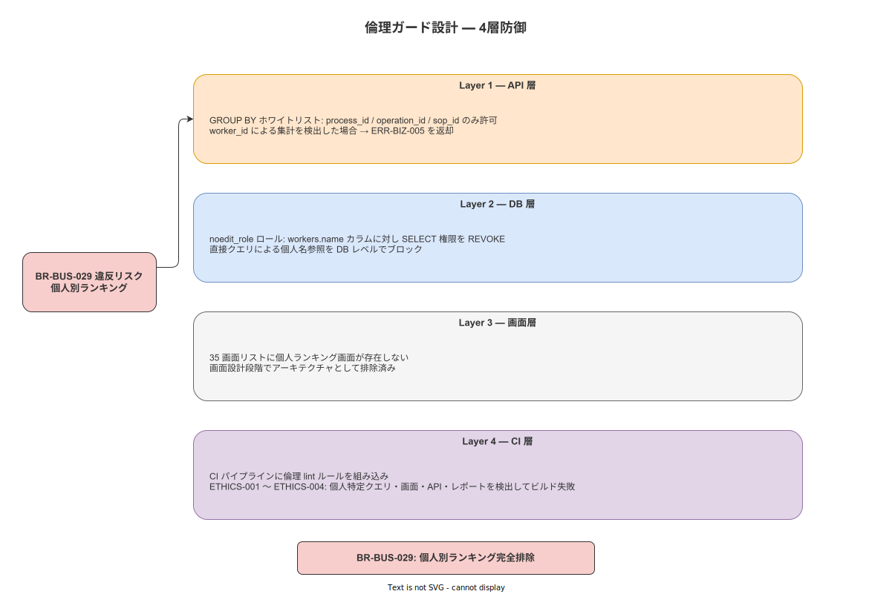

# 08 倫理ガード設計（用途三限定の実装的担保）

本章は本ドキュメントの中で最も重要な章である。技術的な脆弱性対策と異なり、本章が扱う脅威は「正規の権限を持った開発者・管理者が、意図的または無意識にシステムを用途外目的で改変・悪用する」リスクである。本システムは製造業の作業者を支援するシステムであり、作業者を監視・評価・格付けするシステムではない。この設計哲学を技術的な機構として実装し、後から逸脱できない形で担保する。

対象業務要件:
- **BR-BUS-028**: 用途三限定（作業ナビゲーション / トレサビ記録 / 品質報告のみ）
- **BR-BUS-029**: 個人別生産性ランキング禁止

**図 1: 倫理ガード実装全体図（用途三限定の技術的担保）**



> 原本: [`img/fig_des_sec_ethics_guard.drawio`](img/fig_des_sec_ethics_guard.drawio)

---

## 1. 用途三限定の定義と違反パターン

### 1-1. 許可される用途（三限定）

| 用途 | 内容 | 技術的実現手段 |
|---|---|---|
| 作業ナビゲーション | SOP に基づく手順表示・ステップガイダンス・アンドン発報 | SCR-HA-* 画面群・FR-WN-001〜010 |
| トレサビ記録 | 作業実績・エビデンス写真・工程完了の記録 | TBL-031 work_events・ハッシュチェーン |
| 品質報告 | プロセス・オペレーション単位の品質指標集計・PDF 帳票出力 | RP-001〜006・TPL-001〜006 |

### 1-2. 明示的に禁止される用途

| 禁止用途 | 具体例 | 違反検出ポイント |
|---|---|---|
| 個人別生産性監視 | 「作業者 A の 1 時間あたり完了ステップ数ランキング」表示 | API レイヤー・DB レイヤー・CI |
| 個人別パフォーマンス管理 | 「作業者別エラー率一覧」「遅延ワーカーリスト」 | 同上 |
| 監視カメラ・行動追跡 | カメラ映像ストリーミング・位置情報トラッキング | IF リスト・API エンドポイント非実装 |
| 行動分析・AI による評価 | ML モデルによる作業者の疲労度・意欲推定 | API 非実装・SBOM でライブラリ禁止 |
| 第三者への個人データ提供 | 作業者氏名・生産性データの親会社への送信 | IF-001〜007 の設計制約 |

---

## 2. API レイヤーの倫理ガード

### 2-1. 統計エンドポイントの group_by ホワイトリスト

`GET /api/v1/stats` エンドポイントは `group_by` パラメーターに対してホワイトリスト検証を実施する。

| group_by 値 | 許可 / 拒否 | 理由 |
|---|---|---|
| `process_id` | 許可 | プロセス単位集計（用途三限定内） |
| `operation_id` | 許可 | オペレーション単位集計（用途三限定内） |
| `sop_id` | 許可 | SOP 単位集計（用途三限定内） |
| `worker_id` | 拒否（ERR-BIZ-005） | 個人別生産性ランキング禁止（BR-BUS-029） |
| `user_id` | 拒否（ERR-BIZ-005） | 同上 |
| `operator_id` | 拒否（ERR-BIZ-005） | 同上 |
| その他 | 拒否（ERR-BIZ-006） | ホワイトリスト外 |

Rust axum ハンドラーにおける実装イメージ（概要設計レベル）:

```rust
// statsハンドラー（概念的な実装）
// 詳細設計フェーズで型・エラー処理を確定する
async fn get_stats(
    Query(params): Query<StatsQueryParams>,
    // ...
) -> Result<Json<StatsResponse>, AppError> {
    // ホワイトリスト検証
    let allowed_group_by = ["process_id", "operation_id", "sop_id"];
    if !allowed_group_by.contains(&params.group_by.as_str()) {
        return Err(AppError::BusinessRule("ERR-BIZ-005"));
    }
    // ...
}
```

### 2-2. 個人レベルエンドポイントの非実装

以下のエンドポイントパターンは実装しない。

| 禁止エンドポイントパターン | 禁止理由 |
|---|---|
| `GET /api/v1/workers/{id}/performance` | 個人パフォーマンス取得 |
| `GET /api/v1/workers/{id}/ranking` | 個人ランキング取得 |
| `GET /api/v1/stats?group_by=worker_id` | 個人別集計（§2-1 で ERR-BIZ-005） |
| `GET /api/v1/camera/*` | カメラストリーミング |
| `GET /api/v1/stream/*` | 任意ストリーミング |
| `GET /api/v1/location/*` | 位置情報取得 |

これらのエンドポイントは「存在しない」状態を設計レベルで確定する。将来の機能追加時にこれらのパターンを実装しようとした場合、後述の CI チェックが検出してブロックする。

### 2-3. ERR-BIZ-005 レスポンス仕様

```json
{
  "error_code": "ERR-BIZ-005",
  "message": "個人識別子（worker_id / user_id）による集計は業務ルールにより禁止されています",
  "detail": "group_by パラメーターに指定可能な値: process_id, operation_id, sop_id",
  "trace_id": "01HX..."
}
```

---

## 3. DB レイヤーの倫理ガード

### 3-1. noedit_role の SELECT 制限

帳票生成に使用するサービスアカウント（`noedit_role`）は `workers` テーブルの個人識別カラムへの SELECT を REVOKE する。

| カラム | noedit_role の SELECT権限 | 理由 |
|---|---|---|
| `workers.id`（UUID） | 付与 | UUID は外部キー結合に必要 |
| `workers.name` | REVOKE（禁止） | 帳票に個人名を直接出力しない |
| `workers.employee_id` | REVOKE（禁止） | 社員番号による個人特定を防ぐ |
| `workers.login_pin_hash` | REVOKE（禁止） | PIN ハッシュは認証サービスのみ |
| `workers.email` | REVOKE（禁止） | PII |

### 3-2. workers.id の SHA-256 ハッシュ化

作業記録（TBL-031 work_events）に格納される作業者識別子は、`workers.id`（UUID）を直接格納せず、`SHA-256(workers.id || system_salt)` のハッシュ値を格納する。この設計により、work_events テーブルを単独で分析しても個人の作業履歴を同定できない。

| 項目 | 内容 |
|---|---|
| ハッシュアルゴリズム | SHA-256 |
| salt | システム固定 salt（KEY-009 とは別。詳細設計で確定） |
| 格納カラム | `work_events.worker_hash`（CHAR(64)）|
| 名寄せ制限 | `workers.id` → `worker_hash` の逆引きは system_admin のみ可能。操作を LOG-007 に記録 |

---

## 4. 画面レイヤーの倫理ガード

### 4-1. 35 画面リストの設計制約

SCR-MC-001（管理コンソールダッシュボード）は SLI メトリクス（API レイテンシ・可用性・同期率）のみを表示する。個人別データは一切含まない。

| SCR 識別子 | 画面名 | 表示データ | 個人別データの有無 |
|---|---|---|---|
| SCR-MC-001 | 管理コンソール ダッシュボード | API レイテンシ P50/P99・可用性・同期率 | なし |
| SCR-MC-002 | アンドン管理画面 | 工程別・ライン別アンドン発報状況 | なし（工程単位） |
| SCR-RP-001〜006 | 帳票プレビュー画面 | RP-001〜006 に準拠した集計データ | なし（プロセス/SOP 単位） |

35 画面リスト全体において「個人別生産性ランキング」「作業者別エラー率」「個人別遅延一覧」に相当するデータを表示する画面は存在しない。これは画面設計（03_画面設計）において確定済みである。

### 4-2. 画面追加時の審査プロセス

新規画面（SCR-*）を追加する場合、設計レビューにおいて以下のチェックリストを適用する。

| チェック項目 | 判定基準 |
|---|---|
| 個人識別データの表示 | `workers.name` / `workers.employee_id` を直接表示しないこと |
| 個人別集計データの表示 | `GROUP BY worker_id / user_id / operator_id` の結果を表示しないこと |
| 用途三限定の該当性 | 作業ナビゲーション / トレサビ記録 / 品質報告のいずれかに該当すること |

---

## 5. 帳票レイヤーの倫理ガード

### 5-1. RP-001〜006 の集計粒度制約

すべての帳票テンプレート（TPL-001〜006）は `GROUP BY process_id / operation_id / sop_id` のみを使用する。

| 帳票識別子 | 集計粒度 | worker_id 集計 |
|---|---|---|
| RP-001 | プロセス別 | 禁止 |
| RP-002 | オペレーション別 | 禁止 |
| RP-003 | SOP バージョン別 | 禁止 |
| RP-004 | 日次工程サマリー | 禁止 |
| RP-005 | 品質トレンド | 禁止 |
| RP-006 | 異常・アンドン発報サマリー | 禁止 |

### 5-2. クエリテンプレートの変更管理

TPL-001〜006 の SQL クエリテンプレートは、変更時に以下の二重承認フローを適用する。

| ステップ | 担当者 | 確認内容 |
|---|---|---|
| 変更提案 | 開発者（system_admin） | PR 作成。`worker_id` 集計禁止ルールの遵守を確認 |
| 一次承認 | quality_admin | 帳票内容が品質管理目的に合致するか確認 |
| 二次承認 | system_admin（別担当）または executive | 用途三限定への適合性を最終確認 |
| 変更記録 | — | LOG-006（MASTER_APPROVE イベント）として自動記録 |

---

## 6. コードレビュー・CI レイヤーの倫理ガード

### 6-1. カスタム CI ルール

以下のルールを CI に組み込み、倫理違反につながるコードの混入を自動検出する。

| ルール ID | 対象 | 検出条件 | CI 結果 |
|---|---|---|---|
| ETHICS-001 | Rust / SQL（sqlx） | `GROUP BY worker_id` / `GROUP BY user_id` / `GROUP BY operator_id` を含む `query!` マクロ | ビルド失敗 |
| ETHICS-002 | TypeScript / React | `SELECT`・`GROUP BY` に `worker_id` / `user_id` を含む SQL 文字列リテラル | ESLint エラー |
| ETHICS-003 | Rust / axum | `/camera/`・`/stream/`・`/location/` のルートパスを定義するコード | カスタム clippy lint エラー |
| ETHICS-004 | OpenAPI spec | `worker_id` / `user_id` を response body に含む `GET` エンドポイント | openapi-lint エラー |

### 6-2. Pre-commit フック

ローカル開発環境でも倫理ガードルールを早期に検出するため、`.githooks/pre-commit` に以下を含める。

```bash
#!/usr/bin/env bash
# 倫理ガードルールの事前検査
set -euo pipefail

# ETHICS-001: SQL GROUP BY 禁止パターン検査
if grep -rE "GROUP BY (worker_id|user_id|operator_id)" src/ --include="*.rs" --include="*.sql"; then
    echo "ETHICS-001: worker_id / user_id / operator_id による GROUP BY は禁止です（BR-BUS-029）"
    exit 1
fi

# ETHICS-003: 禁止エンドポイントパターン検査
if grep -rE '\.route\("/api/v1/(camera|stream|location)/' src/ --include="*.rs"; then
    echo "ETHICS-003: カメラ・ストリーミング・位置情報エンドポイントは禁止です（BR-BUS-028）"
    exit 1
fi
```

---

## 7. 監視カメラ禁止の実装的担保

BR-BUS-028 の下位規定として、システムは監視カメラ・映像ストリーミングを技術的に実装しないことを保証する。

| 担保層 | 内容 |
|---|---|
| IF リスト | IF-001〜007 はすべて文書化済み。カメラストリーミング用 IF は含まれない |
| エビデンス写真（IF-007） | デバイスからのプッシュ（端末 → サーバー）のみ許可。サーバーからのプル（カメラ制御）は非実装 |
| API エンドポイント | `GET /api/v1/camera/*`・`GET /api/v1/stream/*` は非実装かつ ETHICS-003 ルールで追加禁止 |
| ライブラリ制限 | SBOM に `librtsp`・`gstreamer`・WebRTC 関連ライブラリが含まれる場合 CI 警告（詳細設計フェーズで禁止リスト整備） |

---

**本節で確定した方針**
- **API レイヤーで `group_by` ホワイトリスト（process_id / operation_id / sop_id のみ）を強制し、`worker_id` / `user_id` / `operator_id` による集計を ERR-BIZ-005 として即拒否する。カメラ・ストリーミング・位置情報エンドポイントは非実装とし、CI の ETHICS-003 ルールで将来の追加も自動ブロックする。**
- **DB レイヤーで `noedit_role` の `workers.name` / `workers.employee_id` への SELECT を REVOKE し、work_events の作業者識別子を SHA-256 ハッシュ化して格納することで、帳票生成プロセスが個人名に直接アクセスできない構造を保証する。**
- **帳票テンプレート（TPL-001〜006）の変更には quality_admin + system_admin による二重承認を必須とし、CI の ETHICS-001 ルールが `GROUP BY worker_id` を含む SQL を自動検出・ブロックすることで、コードレベルでの倫理違反混入を防止する。**

---

## 参照業界分析

### 必須
- [`90_業界分析/09_セキュリティとアクセス制御.md`](../../90_業界分析/09_セキュリティとアクセス制御.md)

### 関連
- [`90_業界分析/11_電子署名と本人確認.md`](../../90_業界分析/11_電子署名と本人確認.md)
- [`90_業界分析/21_電子記録の法規制とALCOA+.md`](../../90_業界分析/21_電子記録の法規制とALCOA+.md)
