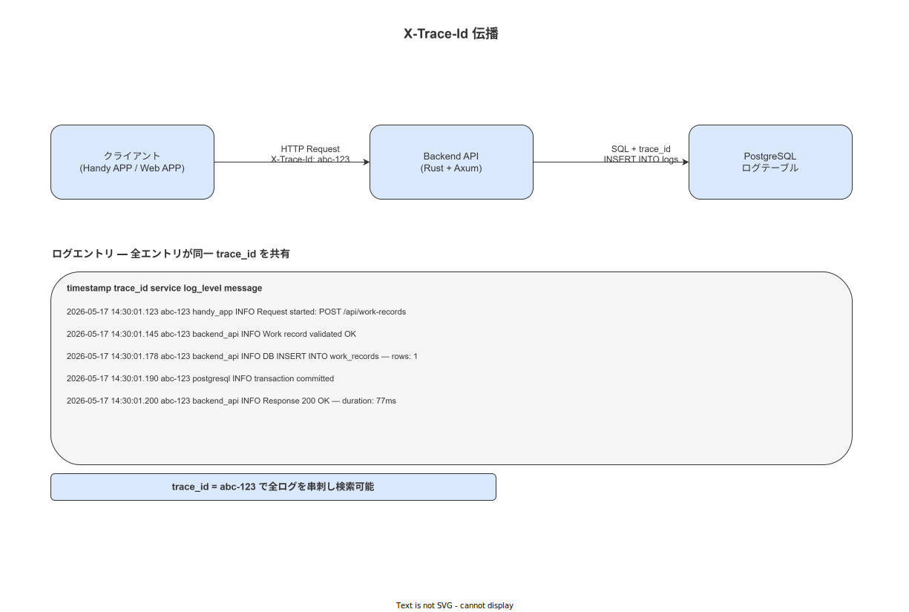

# 02 ロギング方式と保管

本章の責務は、Rust axum バックエンド・React Native ハンディ APP・React マスタメンテナンス SPA の 3 コンポーネントにわたるロギング方式を確定し、LOG-001〜010 全イベントのカタログ・X-Trace-Id 相関方式・Docker コンテナログから Windows Event Log への転送経路・7 年保全方針・PII 禁止ルールを設計命題として確定することである。上流の NFR-OPS-036〜038・NFR-OPS-035 を受けて確定する。

---

## 1. ロギング基本方針

### 1-1. 構造化 JSON ログの採用

本システムは全コンポーネントで構造化 JSON ログを採用する。テキストフォーマットログ（非構造化）は禁止する。根拠は以下のとおりである。

- Windows Event Log への転送時に nxlog がフィールド単位でパースできる
- X-Trace-Id 相関を JSON フィールドとして持つことで、分散トレーシングと同等の追跡が可能になる
- Grafana Loki 等の将来的なログ集約基盤への移行コストが最小化される

### 1-2. ロギングライブラリの確定

| コンポーネント | ライブラリ | 理由 |
|---|---|---|
| Rust axum（バックエンド） | `tracing` + `tracing-subscriber` （JSON フォーマッタ）| axum・tokio と統合されたエコシステム標準。`tracing-opentelemetry` による将来拡張も可能 |
| React Native（ハンディ APP） | `pino`（ブラウザ/React Native 互換）| 最小オーバーヘッド・JSON ネイティブ出力・ハンディ端末での軽量動作 |
| React SPA（マスタ・管理コンソール）| `pino`（ブラウザ版）| ハンディ APP と統一ライブラリ・開発者学習コストの最小化 |

### 1-3. ログレベル定義

| ログレベル | 用途 | 本番デフォルト | 設定変更 |
|---|---|---|---|
| ERROR | 復旧不可能なエラー・サービス停止に繋がる障害 | 出力する | CFG-014 で変更可 |
| WARN | 異常ではないが注意が必要な事象（リトライ成功・閾値接近等） | 出力する | CFG-014 で変更可 |
| INFO | 正常な業務イベント・システムイベント（LOG カタログ対象）| 出力する（デフォルト）| CFG-014 で変更可 |
| DEBUG | 開発・デバッグ用の詳細情報 | 出力しない（本番 INFO 以上）| CFG-014 で `debug` に変更可 |

本番環境のデフォルトログレベルは `INFO` とする（CFG-014: `logging.level.default = info`）。デバッグ調査時は system_admin が CFG-014 を `debug` に変更し、調査完了後に `info` に戻すことを運用手順（OPS-PROC-001）に含める。

---

## 2. LOG-001〜010 イベントカタログ

### 2-1. カタログ定義

LOG カタログは 5 ドメイン（AUTH / WORK / MASTER / REPORT / SYSTEM）で構成する。

| LOG-ID | イベント名 | ドメイン | ログレベル | 発生コンポーネント | PII 含有 | PII 処理方針 | 保管期間 | 関連 NFR |
|---|---|---|---|---|---|---|---|---|
| LOG-001 | api.request.received | SYSTEM | INFO | Rust axum | なし | — | 90 日 | NFR-OPS-038 |
| LOG-002 | api.request.completed | SYSTEM | INFO | Rust axum | なし | — | 90 日 | NFR-OPS-038 |
| LOG-003 | auth.login.success | AUTH | INFO | Rust axum | あり（worker_id）| ハッシュ ID のみ記録（SHA-256(worker_id)）| 90 日 | NFR-OPS-036 |
| LOG-004 | auth.login.failure | AUTH | SECURITY | Rust axum | あり（worker_id）| ハッシュ ID のみ記録 | 1 年 | NFR-OPS-036 |
| LOG-005 | rbac.denied | AUTH | SECURITY | Rust axum | あり（worker_id）| ハッシュ ID のみ記録 | 1 年 | NFR-OPS-036 |
| LOG-006 | master.published | MASTER | INFO | Rust axum | なし | — | 7 年 | NFR-OPS-035 |
| LOG-007 | hash_chain.broken | SYSTEM | SECURITY | Rust axum（BAT-001）| なし | — | 永続 | NFR-OPS-037 |
| LOG-008 | outbox.dlq.moved | SYSTEM | ERROR | Rust axum（BAT-002）| なし | — | 1 年 | NFR-OPS-047 |
| LOG-009 | pii.anonymized | SYSTEM | INFO | Rust axum（BAT-004）| なし | — | 永続 | NFR-OPS-038 |
| LOG-010 | report.generated | REPORT | INFO | Rust axum | あり（reporter_id）| ハッシュ ID のみ記録 | 7 年 | NFR-OPS-035 |

### 2-2. JSON ログフィールド定義（共通フィールド）

全 LOG イベントに以下のフィールドを必須とする。

| フィールド名 | 型 | 必須 | 説明 |
|---|---|---|---|
| `timestamp` | ISO 8601 (UTC) | 必須 | ログ生成時刻（UTC）。JST への変換は閲覧ツール側で行う |
| `level` | string | 必須 | `ERROR` / `WARN` / `INFO` / `DEBUG` / `SECURITY` |
| `trace_id` | string (UUID v4) | 必須 | X-Trace-Id ヘッダーの値。コンポーネント内で生成・伝播する |
| `log_id` | string | 必須 | LOG-NNN 識別子（例: `LOG-003`）|
| `event` | string | 必須 | LOG カタログのイベント名（例: `auth.login.success`）|
| `component` | string | 必須 | `api` / `handy` / `master` / `console` |
| `worker_id_hash` | string (hex) | 条件付き | PII あり LOG のみ。`SHA-256(worker_id)` の 16 進数表現 |
| `message` | string | 任意 | 人間可読な補足メッセージ |

### 2-3. JSON ログサンプル

LOG-004（auth.login.failure）の出力例：

```json
{
  "timestamp": "2026-05-17T01:23:45.678Z",
  "level": "SECURITY",
  "trace_id": "a1b2c3d4-e5f6-7890-abcd-ef1234567890",
  "log_id": "LOG-004",
  "event": "auth.login.failure",
  "component": "api",
  "worker_id_hash": "e3b0c44298fc1c149afbf4c8996fb92427ae41e4649b934ca495991b7852b855",
  "reason": "invalid_pin",
  "attempt_count": 2
}
```

---

## 3. X-Trace-Id 相関方式

### 3-1. 相関 ID の伝播規則

X-Trace-Id は全コンポーネント間でリクエストを追跡するための相関識別子である。

| ルール | 内容 |
|---|---|
| 生成 | ハンディ APP / SPA がリクエスト送信時に UUID v4 を生成し、`X-Trace-Id` HTTP ヘッダーに付与する |
| 伝播 | Rust axum が受信したヘッダー値を `trace_id` フィールドとして全ログに記録する。DB クエリログにも `/* trace_id=... */` コメントとして付与する |
| 不在時 | X-Trace-Id ヘッダーが不在の場合、axum ミドルウェアが新規 UUID v4 を生成して補完する |
| ログ検索 | nxlog 経由で Windows Event Log に転送後、`trace_id` フィールドでフィルタリングすることで、1 リクエストの全ログを横断検索できる |

**図 1: Trace ID 伝播フロー（リクエスト相関全体図）**



> 原本: [`img/fig_des_ops_trace_id_propagation.drawio`](img/fig_des_ops_trace_id_propagation.drawio)

---

## 4. ログ出力経路と保管

### 4-1. Docker コンテナログから Windows Event Log への転送

本システムのログ出力経路を以下に確定する。

| ステップ | 処理内容 | 実装手段 |
|---|---|---|
| 1. コンテナ標準出力 | Rust axum / BAT ジョブが JSON ログを stdout/stderr に出力 | `tracing-subscriber` の JSON フォーマッタ |
| 2. Docker ログドライバ | Docker が stdout/stderr をホスト上の JSON ファイルに記録 | `json-file` ドライバ（Docker Compose デフォルト）|
| 3. ログローテーション | Docker のログローテーション設定で 100MB × 10 ファイル = 最大 1GB を保持 | `max-size: 100m` / `max-file: 10`（docker-compose.yml）|
| 4. nxlog 転送 | Windows 上の nxlog が Docker ログファイルを監視し、Windows Event Log へ転送 | nxlog Community Edition（Windows Server 2022 対応）|
| 5. Windows Event Log | nxlog が転送したログを Windows Event Log の「Application」ログに記録 | — |
| 6. 長期保管ファイル | nxlog が同時にローカルファイル（`C:\Logs\wnav\`）にも出力。7 年保全対象 | nxlog の `om_file` モジュール |

### 4-2. ログローテーション設定

| 対象 | ローテーション方式 | 保持サイズ | 保持期間 |
|---|---|---|---|
| Docker コンテナログ（稼働ログ） | サイズ基準（100MB × 10 ファイル） | 最大 1GB | 直近 10 ファイル分 |
| アプリケーションログファイル（nxlog 出力） | 日次 | 無制限（7 年分を保持） | 7 年（LOG-006/010 対象：作業実績・帳票）|
| 認証ログファイル（AUTH ドメイン） | 日次 | 無制限 | 1 年（LOG-003/004/005 対象）|
| セキュリティログファイル（SECURITY レベル） | 日次 | 無制限 | 永続（LOG-007 対象：hash_chain.broken）|

### 4-3. 7 年保全の法的根拠

| 対象ログ | 保全期間 | 根拠 |
|---|---|---|
| 作業実績ログ（WORK ドメイン・WorkEvent）| 7 年以上 | NFR-OPS-035・製造業の品質記録保全慣行・ISO 9001 管理記録 |
| 帳票生成ログ（LOG-010）| 7 年 | RP-001〜006（帳票）の保全期間と整合（NFR-OPS-035）|
| マスタ公開ログ（LOG-006）| 7 年 | SOP・マスタの改訂履歴として監査証跡の一部を構成 |
| SECURITY レベルログ（LOG-007）| 永続 | ハッシュチェーン破損は改ざん証拠であり時効なし |

---

## 5. 機密データの取り扱い禁止規則

### 5-1. ログへの PII 記録禁止

本システムのログには以下の情報を記録することを禁止する。

| 禁止情報 | 説明 | 代替措置 |
|---|---|---|
| 氏名・社員番号（生値） | `worker_id` の生値・氏名フィールド | `SHA-256(worker_id)` のハッシュ値のみを `worker_id_hash` フィールドに記録する |
| ピン（PIN）・パスワード | 認証情報 | 記録を一切禁止する（ログに残してはならない）|
| 電子サイン原本 | 署名データ・HMAC 値 | 記録を一切禁止する |
| 個人特定可能な不適合内容 | 作業員が記録したフリーテキスト（不適合報告等）| ログには記録せず、DB（TBL-NNN）に保管する |

### 5-2. PII 禁止の実装方式

Rust axum の `tracing` では `%` フォーマットを使用する場合に PII フィールドが混入する可能性がある。以下の実装規則を確定する。

- `worker_id` を直接 tracing イベントに渡す実装を禁止する
- PII フィールドが必要な場合は `worker_id_hash` を計算した後に tracing イベントへ渡す
- コードレビューチェックリストに「ログへの PII 混入確認」を必須項目として追加する（ADR で管理）

---

**本節で確定した方針**
- **全コンポーネント（Rust tracing + pino）の構造化 JSON ログ方式を確定し、LOG-001〜010 全 10 件のイベントカタログ・PII 処理方針・保管期間を確定した。**
- **X-Trace-Id を HTTP ヘッダーから全ログの `trace_id` フィールドへ伝播するリクエスト相関方式を確定し、Docker → nxlog → Windows Event Log / ローカルファイルの 4 ステップ転送経路を確定した。**
- **作業実績ログ・帳票ログの 7 年保全（NFR-OPS-035 準拠）と、SECURITY レベルログの永続保全を確定し、ログへの生 worker_id・PIN・電子サイン記録を全面禁止とした。**

---

## 参照業界分析

### 必須

（本章は技術的なロギング方式設計であり、必須業界分析への直接依存なし）

### 関連

[`90_業界分析/03_工場ネットワークとOT-ITインテグレーション.md`](../../../90_業界分析/03_工場ネットワークとOT-ITインテグレーション.md)

[`90_業界分析/01_製造業IT化の動向と中小製造業.md`](../../../90_業界分析/01_製造業IT化の動向と中小製造業.md)
