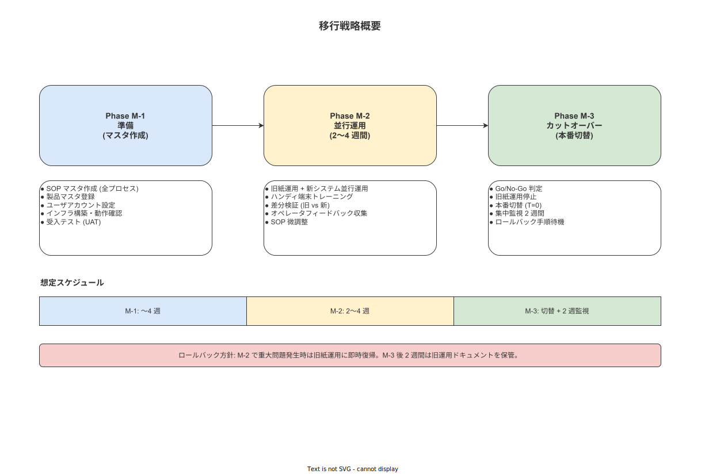

# 01 移行戦略の概要設計版

本章の責務は、紙・Excel ベースの作業指示運用から本システムへの移行戦略を概要設計レベルで確定することである。上流の移行要件（MIG-001〜009）が定めた「並行運用→カットオーバー」の方針を受けて、具体的なフェーズ定義・リスク対策・設計命題（DES-MIG-001〜020）を確定する。一斉切替（ビッグバン）方式は採用しない。

---

## 1. 移行の前提と移行元・移行先の対比

### 1-1. 移行元（現状）

現在の工場では以下の紙・Excel ベースの運用が行われている。

| 運用領域 | 現状の手段 | 課題 |
|---|---|---|
| 作業指示書（SOP） | 紙の手順書・Excel ファイル（個人 PC 保管） | バージョン管理なし・改訂の周知遅延・紛失リスク |
| 作業証跡記録 | 紙の記録票・押印 | 検索不可・改ざん検知不能・保管場所の属人化 |
| スキル・資格管理 | Excel 台帳（担当者管理） | 最新性の保証なし・システム連携なし |
| 工程・設備マスタ | 紙台帳 | 更新反映に時間差が発生 |

### 1-2. 移行先（本システム）

| 運用領域 | 本システムでの手段 |
|---|---|
| 作業指示書（SOP） | PostgreSQL SOP テーブル群（電子承認付き・バージョン管理付き） |
| 作業証跡記録 | work_events テーブル（SHA-256 ハッシュチェーン・ALCOA+ 準拠） |
| スキル・資格管理 | user_skills テーブル（有効期限アラート付き） |
| 工程・設備マスタ | processes / equipment / instruments テーブル |

### 1-3. 移行スコープ

**DES-MIG-001**: 移行スコープを以下の 2 領域に分類して確定する。

| スコープ分類 | 対象 | 移行必須/任意 |
|---|---|---|
| スコープ 1（必須） | マスタデータ（工程・作業・製品・SOP・ユーザー） | 必須 |
| スコープ 2（任意） | 過去 1 年分の作業記録（ロット履歴・紙記録） | 顧客判断による任意 |

---

## 2. 移行方式の確定（並行運用方式）

### 2-1. 採用方式の確定

**DES-MIG-002**: 移行方式として「並行運用（2〜4 週間）→ カットオーバー」方式を採用する。一斉切替（ビッグバン）方式および段階切替（機能単位）方式は採用しない。

| 比較軸 | 並行運用方式（採用） | 一斉切替方式（不採用） | 段階切替方式（不採用） |
|---|---|---|---|
| 業務継続リスク | 低い（紙運用を保持） | 高い（切替失敗で業務停止） | 中程度 |
| 移行コスト | 中（二重運用コスト） | 低 | 高（段階管理が複雑） |
| 単一工場への適合性 | 高（工場全体で統一した並行期間を設定可能） | 適合しない | 過剰に複雑 |
| ロールバック容易性 | 高（紙運用に即時復帰可能） | 低 | 中 |

### 2-2. 並行運用期間の設計

**DES-MIG-003**: 並行運用期間は最短 2 週間・最長 4 週間とする。期間の確定は質担当・IT 担当の協議で決定し、以下の条件を両方充足した時点でカットオーバー判断を行う。

| 条件 | 基準 |
|---|---|
| システム側の作業完了率 | 並行期間中の全作業件数のうち 95% 以上をシステムで完了 |
| エラー発生率 | システム操作エラー（作業員によるスキップ・強制終了）が全作業件数の 2% 未満 |
| 未解決の重大バグ | 0 件 |

---

## 3. 移行フェーズ定義

**DES-MIG-004**: 移行を以下の 3 フェーズに分割する。各フェーズの移行は前フェーズの完了条件を quality_admin が確認した上で実施する。

**図 1: 移行フェーズ全体戦略図（並行運用〜カットオーバー）**

> 原本: [`img/fig_des_mig_strategy.drawio`](img/fig_des_mig_strategy.drawio)

### 3-1. Phase M-1（移行準備フェーズ）

| 属性 | 内容 |
|---|---|
| フェーズ名 | Phase M-1：移行準備 |
| 主要タスク | マスタデータ作成・検証・GUI ウィザード操作・WiFi 環境整備・デバイス調達・ユーザーアカウント作成 |
| 実施期間の目安 | カットオーバー予定日の 8〜4 週前 |
| 完了条件 | 全マスタデータの投入完了・品質担当の書面承認・デバイス登録完了 |
| 主担当者 | quality_admin（マスタ作成）・system_admin（インフラ・デバイス） |

Phase M-1 の移行タスク識別子：

| タスク ID | タスク名 |
|---|---|
| MIG-T-001 | 移行計画書の確定（quality_admin 承認） |
| MIG-T-002 | 工程・作業マスタの Excel テンプレート作成 |
| MIG-T-003 | 製品・SOP マスタの Excel テンプレート作成 |
| MIG-T-004 | ユーザーマスタ・ロール/スキル情報の整備 |
| MIG-T-005 | GUI ウィザードによる全マスタの投入実行 |
| MIG-T-006 | 投入後品質チェック（自動 + 目視サンプリング） |
| MIG-T-007 | quality_admin による全 SOP の電子承認付与 |
| MIG-T-008 | WiFi AP 設置・ネットワーク疎通確認 |
| MIG-T-009 | ハンディ端末・管理 PC のシステム登録 |
| MIG-T-010 | 操作訓練（質担当・IT 担当・現場監督） |

### 3-2. Phase M-2（並行運用フェーズ）

| 属性 | 内容 |
|---|---|
| フェーズ名 | Phase M-2：並行運用 |
| 主要タスク | 紙運用とシステム運用の同時実施・問題収集・エラーログ監視 |
| 実施期間 | 2〜4 週間（DES-MIG-003 の条件充足まで） |
| 完了条件 | DES-MIG-003 の 3 条件をすべて充足 |
| 主担当者 | system_admin（監視・問題対応）・quality_admin（品質判断） |

Phase M-2 の移行タスク識別子：

| タスク ID | タスク名 |
|---|---|
| MIG-T-011 | 並行運用開始宣言（quality_admin 署名） |
| MIG-T-012 | 毎日のエラーログ確認（system_admin） |
| MIG-T-013 | 週次の作業完了率・エラー率の集計と報告 |
| MIG-T-014 | 問題発生時のロールバック判断（quality_admin） |
| MIG-T-015 | 並行運用終了条件の確認と Go/No-Go 判断 |

### 3-3. Phase M-3（カットオーバーフェーズ）

| 属性 | 内容 |
|---|---|
| フェーズ名 | Phase M-3：カットオーバー |
| 主要タスク | 旧運用（紙）の凍結・カットオーバーチェックリスト実行・本番移行宣言 |
| 実施期間 | 週末または計画停止時間（所要時間 2〜4 時間） |
| 完了条件 | カットオーバーチェックリスト全 10 項目の確認完了・quality_admin の本番移行宣言 |
| 主担当者 | quality_admin（Go/No-Go 判断）・system_admin（技術作業） |

Phase M-3 の移行タスク識別子：

| タスク ID | タスク名 |
|---|---|
| MIG-T-016 | カットオーバー前バックアップの取得 |
| MIG-T-017 | ハッシュチェーン初期ブロックの生成 |
| MIG-T-018 | 旧運用（紙）の凍結宣言（quality_admin 署名） |
| MIG-T-019 | 全作業員への本番移行アナウンス |
| MIG-T-020 | 本番移行宣言（quality_admin 署名） |

---

## 4. 移行リスクと対策

**DES-MIG-005**: 以下の 3 大リスクを移行計画の最優先管理対象として確定する。

| リスク ID | リスク名 | 影響度 | 発生可能性 | 対策 |
|---|---|---|---|---|
| RISK-MIG-001 | SOP 電子化の品質不足（master_admin のスキル依存） | 高 | 中 | 投入前品質チェック（05 章参照）・quality_admin の全 SOP 目視確認を義務付ける |
| RISK-MIG-002 | デバイス調達の遅延（WiFi インフラ・ハンディ端末） | 高 | 中 | Phase M-1 開始と同時にデバイス発注・WiFi 設置工事を着手する |
| RISK-MIG-003 | 並行運用期間中のオペレーター混乱（二重記録の煩雑さ） | 中 | 高 | 並行期間は最長 4 週間に制限・操作訓練（MIG-T-010）を並行開始前に完了させる |

---

**本節で確定した方針**
- 移行方式として「並行運用（2〜4 週間）→ カットオーバー」を採用し、一斉切替（ビッグバン）方式は採用しないことを確定する。
- 移行を Phase M-1（準備）→ Phase M-2（並行運用）→ Phase M-3（カットオーバー）の 3 フェーズに分割し、MIG-T-001〜020 のタスク識別子で管理することを確定する。
- 移行リスクの最優先管理対象を SOP 電子化品質・デバイス調達・オペレーター混乱の 3 点として確定する。

---

## 参照業界分析

| 分類 | ドキュメント | 参照理由 |
|---|---|---|
| 必須 | `90_業界分析/25_作業指示書とSOPの構造化・表現論.md` | SOP 電子化の品質基準・構造化要件の根拠 |
| 関連 | `90_業界分析/06_品質管理とトレーサビリティ.md` | 並行運用期間中の証跡完全性確保の根拠 |
