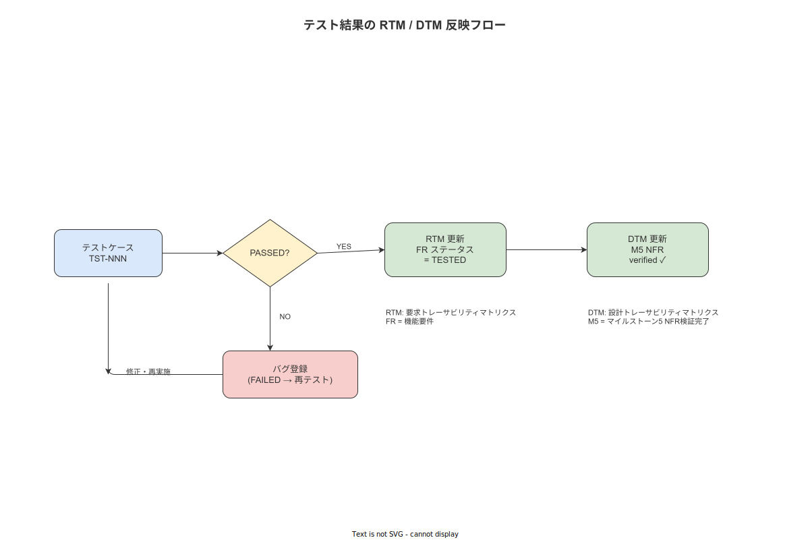

# 08 テスト結果の RTM/DTM 反映方式

本章の責務は、テストの実行結果を RTM（要件トレーサビリティマトリクス）および DTM（設計トレーサビリティマトリクス）に反映する方式を確定することである。テスト結果の反映が省略されると、要件のカバレッジが見えなくなり、リリース判断の根拠が失われる。本章で確定する反映方式により、TST-NNN の PASS/FAIL 状態が RTM 列 10（状態）と DTM M5/M6 に一元的に追跡される。

---

## 1. RTM/DTM との連携構造

### 1-1. 連携の全体構造

テスト結果の反映は以下の経路で行う。

```
テスト実行結果（PASS/FAIL）
       ↓
TST-NNN ステータス更新（DTM M5 テスト列）
       ↓
対象 FR/NFR/BR-BUS のカバレッジ確認
       ↓
RTM 列 10（状態）の更新：TESTED / FAILED / UNTESTED
       ↓
品質ゲート確認（04 章基準との照合）
```

**図 1: テスト結果 RTM/DTM 反映フロー図**



> 原本: [`img/fig_des_tst_rtm_flow.drawio`](img/fig_des_tst_rtm_flow.drawio)

---

## 2. TST-NNN ステータス管理

### 2-1. ステータス定義

各 TST-NNN は以下のステータスライフサイクルを持つ。

| ステータス | 定義 | 次の遷移 |
|---|---|---|
| DEFINED | テストケースが定義済みだが未実行 | → RUNNING |
| RUNNING | テスト実行中 | → PASSED / FAILED |
| PASSED | テストが合格（最後の実行で PASS） | → RUNNING（再実行時）/ REGRESSION（回帰失敗時） |
| FAILED | テストが不合格 | → RUNNING（修正後再実行）|
| REGRESSION | 一度 PASSED したが、後のコード変更で FAILED に転じた | → 即時調査・RUNNING（修正後）|
| SKIPPED | 意図的にスキップ（詳細設計フェーズ未着手等） | → DEFINED（着手時）|

### 2-2. ステータス更新タイミング

| トリガ | 更新内容 |
|---|---|
| CI パイプライン実行 | cargo test・Jest・Playwright・Detox の結果が自動記録される（将来の CI 統合で自動化） |
| 手動テスト実行（UAT 等） | 実施者がテスト結果を手動で更新する |
| 回帰失敗検出 | 以前 PASSED だったテストが FAILED に転じた場合に REGRESSION フラグを設定する |

---

## 3. RTM 列 10（状態）の更新方式

### 3-1. 状態遷移ルール

RTM の列 10（状態）は以下のルールで更新する。

| RTM 状態 | 条件 |
|---|---|
| DEFINED | 要件が定義済みだが設計未着手 |
| DESIGNED | 要件に対応する設計識別子が DTM に登録済み |
| IMPLEMENTED | 設計に対応する実装が完了（コード存在） |
| TESTED | 対応するすべての TST-NNN が PASSED 状態 |
| FAILED | いずれかの TST-NNN が FAILED または REGRESSION 状態 |
| ACCEPTED | UAT で合格（受入テスト完了） |

### 3-2. FR 状態更新フロー

| ステップ | 作業 | 担当 |
|---|---|---|
| 1 | TST-NNN の PASS 確認 | CI 自動 or 開発者 |
| 2 | 対象 FR の全 TST-NNN が PASSED であることを確認 | 開発者 |
| 3 | RTM 列 10 を IMPLEMENTED → TESTED に更新 | 開発者 |
| 4 | UAT で該当 UC のゴールデンパスを確認 | quality_admin |
| 5 | RTM 列 10 を TESTED → ACCEPTED に更新 | quality_admin |

---

## 4. DTM M5 完全性の自動検証

### 4-1. M5 完全性スクリプト

DTM M5（NFR × 設計章）に全 NFR が登録されていることを確認するスクリプトを `scripts/check-dtm-m5.sh` として提供する。

```bash
# scripts/check-dtm-m5.sh（概要）
# 1. 03_要件定義/非機能要件/ から全 NFR-{カテゴリ}-NNN を抽出
# 2. 04_概要設計/付録/01_DTM.md の M5 セクションを参照
# 3. M5 に出現しない NFR-ID を「未対応」としてリストアップ
# 4. 未対応件数が 0 なら exit 0、1 以上なら exit 1
```

| 検証条件（V-05） | 目標値 | 実行タイミング |
|---|---|---|
| M5 未対応 NFR 件数 | 0 件 | 概要設計フェーズ完了時・リリース前 |

### 4-2. M6 完全性スクリプト

DTM M6（BR-BUS × API/ERR）に全 45 BR-BUS が登録されていることを確認するスクリプトを `scripts/check-dtm-m6.sh` として提供する。

```bash
# scripts/check-dtm-m6.sh（概要）
# 1. 03_要件定義/機能要件/10_業務ルール から全 BR-BUS-NNN を抽出
# 2. 04_概要設計/付録/01_DTM.md の M6 セクションを参照
# 3. M6 に出現しない BR-BUS-ID を「未対応」としてリストアップ
# 4. 未対応件数が 0 なら exit 0、1 以上なら exit 1
```

| 検証条件（V-06） | 目標値 | 実行タイミング |
|---|---|---|
| M6 未対応 BR-BUS 件数 | 0 件 | 概要設計フェーズ完了時・リリース前 |

---

## 5. カバレッジとの整合検証

### 5-1. FR × テストカバレッジの整合

DTM M1（FR × API）のカバレッジとテスト実行結果のカバレッジが整合していることを確認する。

| 確認項目 | 方法 | 頻度 |
|---|---|---|
| FR 未テスト件数 | RTM 列 10 が DESIGNED のまま TESTED になっていない FR を抽出 | リリース前に実施 |
| API 未テスト件数 | M1 に登録されている API-{resource}-NNN のうち統合テストが存在しないものを抽出 | リリース前に実施 |
| UC 未テスト件数 | M3（UC × SCR）に登録されている UC のうち E2E テストが存在しないものを抽出 | リリース前に実施 |

---

## 6. 回帰テストの管理

### 6-1. 回帰失敗の対応プロセス

| ステップ | 内容 | 対応期限 |
|---|---|---|
| 1 | CI で REGRESSION フラグを検出 | 即時 |
| 2 | REGRESSION が発生した TST-NNN の親 FR/NFR/BR-BUS を特定 | 即時 |
| 3 | 回帰原因のコード変更コミットを `git bisect` で特定 | 24 時間以内 |
| 4 | 修正コミットを作成して再テスト | 72 時間以内 |
| 5 | 修正後の全テストスイートが PASSED になることを確認 | 修正コミット後 |
| 6 | RTM 列 10 を FAILED → TESTED に戻す | テスト PASS 確認後 |

回帰テスト失敗はバックログへの後回しを禁止する。即時調査・修正を原則とする。

---

## 7. テストケースのトレーサビリティ規約

### 7-1. docstring 規約

各テスト関数（Rust の `#[test]` / TypeScript の `it()`）には以下の形式で上流要件への参照を記述する。

```rust
/// TST-063: O（Original）元データ検証 - UPDATE 拒否テスト
///
/// # 検証要件
/// - NFR-DQ-004（データの原本性）
/// - BR-BUS-015（Append-only 保護）
///
/// # 期待動作
/// アプリロールが WorkEvent の UPDATE を試みた場合、
/// PostgreSQL PermissionError が発生し HTTP 403 が返る
#[sqlx::test(migrations = "./migrations")]
async fn test_work_event_update_denied(pool: PgPool) -> sqlx::Result<()> {
    // ...
}
```

```typescript
/**
 * TST-060: A（Attributable）帰属可能性検証 - worker_id NOT NULL 制約
 *
 * @requirements NFR-DQ-001, FR-AU-001
 * @expected worker_id が null の WorkEvent INSERT で HTTP 422 が返る
 */
it('should reject WorkEvent with null worker_id', async () => {
    // ...
});
```

| docstring 必須項目 | 内容 |
|---|---|
| TST-ID | 対応するテストケース群 ID |
| 検証要件 | FR-NNN / NFR-NNN / BR-BUS-NNN（複数可） |
| 期待動作 | テストが検証する具体的な期待結果の 1〜3 行説明 |

---

**本節で確定した方針**
- TST-NNN のステータスライフサイクル（DEFINED/RUNNING/PASSED/FAILED/REGRESSION/SKIPPED）を確定し、回帰失敗時は即時調査・72 時間以内修正を原則として確定した。
- DTM M5/M6 完全性を確認する `scripts/check-dtm-m5.sh` / `scripts/check-dtm-m6.sh` スクリプトの概要を確定し、リリース前に必ず実行することを品質ゲートの一環とした。
- テスト関数の docstring に TST-ID・FR-NNN/NFR-NNN/BR-BUS-NNN・期待動作の 3 要素を必須記述する規約を確定した。

---

## 参照業界分析

### 必須

[`90_業界分析/06_品質管理とトレーサビリティ.md`](../../../90_業界分析/06_品質管理とトレーサビリティ.md)

### 関連

[`90_業界分析/22_規制別トレーサビリティ要件詳論.md`](../../../90_業界分析/22_規制別トレーサビリティ要件詳論.md)
