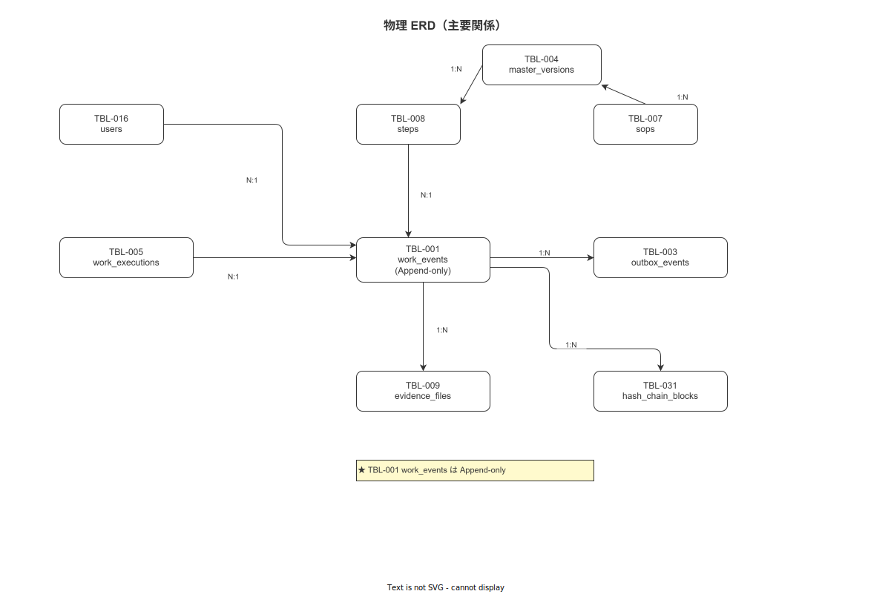

# 00 本書の位置づけと識別子規約

本章の責務は、`01_データベース詳細設計/` サブが IPA 2.5.3「ソフトウェアコンポーネントデータの詳細設計」のどのタスクを担当するかを宣言し、本サブ内で使用する識別子（DDL-NNN / IDX-NNN / VW-NNN）の命名規則と採番台帳を確定することである。

**図 1: 全テーブル ER 図（フル）**



> 原本: [`img/fig_dd_db_erd_full.drawio`](img/fig_dd_db_erd_full.drawio)

---

## 1. IPA 2.5.3 カバレッジ

### 1-1. IPA 2.5.3 タスクと本サブの対応

IPA 共通フレーム 2013「2.5 ソフトウェア詳細設計プロセス」のうち、2.5.3「ソフトウェアコンポーネントデータの詳細設計」は以下を要求する。

| IPA 要求事項 | 本サブでの実現手段 | 掲載ファイル |
|---|---|---|
| データコンポーネントの詳細な構造・型・制約の定義 | CREATE TABLE 全文（DDL-NNN）| 01・02 |
| データアクセスパスと格納構造の設計 | CREATE INDEX 全文（IDX-NNN）| 03 |
| データアクセス層の外部インターフェース定義 | CREATE VIEW / MATERIALIZED VIEW（VW-NNN）| 04 |
| データコンポーネントの詳細データ構造定義 | JSON Schema（JSONB 列定義）| 05 |
| データの格納・保存・移動方式 | パーティション・アーカイブ設計 | 06 |
| データ移行手順 | sqlx migrate 設計 | 07 |
| PG ↔ SQLite スキーマ同期戦略 | ミラー対象テーブル・型変換規約・CI ドリフト検出 | 07a |
| テストデータ定義 | シード・フィクスチャ設計 | 08 |

### 1-2. 上流からの入力

本サブは以下の上流成果物を固定入力として受け取る。変更は行わない。

| 入力成果物 | 参照先 | 内容 |
|---|---|---|
| TBL カタログ（TBL-001〜035）| `04_概要設計/04_データ設計/02_物理テーブル一覧（TBLカタログ）.md` | 全 35 テーブルの論理エンティティ・種別・推定行数 |
| マスタ系列定義 | `04_概要設計/04_データ設計/03_テーブル詳細定義（マスタ系）.md` | 列名・型・制約・既定値 |
| トランザクション系列定義 | `04_概要設計/04_データ設計/04_テーブル詳細定義（トランザクション系）.md` | 列名・型・制約・既定値 |
| イベントストア設計 | `04_概要設計/04_データ設計/05_イベントストア設計とハッシュチェーン.md` | ハッシュチェーン・XES 互換・ロール設計 |
| インデックス・パーティション方針 | `04_概要設計/04_データ設計/06_インデックス・パーティション・アーカイブ方式.md` | IDX カタログ・パーティション命名規則 |

---

## 2. 識別子規約

### 2-1. DDL 識別子（DDL-NNN）

DDL 識別子は TBL-NNN と 1:1 に対応する。DDL-NNN は TBL-NNN の CREATE TABLE 定義を一意に参照する番号である。

```
DDL-NNN  形式: DDL-{3桁ゼロ埋め}
例: DDL-001 = TBL-001 work_events の CREATE TABLE 定義
    DDL-016 = TBL-016 users の CREATE TABLE 定義
```

| DDL-NNN | TBL-NNN | テーブル名 |
|---|---|---|
| DDL-001 | TBL-001 | work_events |
| DDL-002 | TBL-002 | electronic_signs |
| DDL-003 | TBL-003 | outbox_events |
| DDL-004 | TBL-004 | master_versions |
| DDL-005 | TBL-005 | work_executions |
| DDL-006 | TBL-006 | work_orders |
| DDL-007 | TBL-007 | sops |
| DDL-008 | TBL-008 | steps |
| DDL-009 | TBL-009 | evidence_files |
| DDL-010 | TBL-010 | measurements |
| DDL-011 | TBL-011 | suspensions |
| DDL-012 | TBL-012 | andon_alerts |
| DDL-013 | TBL-013 | nonconformities |
| DDL-014 | TBL-014 | capas |
| DDL-015 | TBL-015 | kaizen_proposals |
| DDL-016 | TBL-016 | users |
| DDL-017 | TBL-017 | roles |
| DDL-018 | TBL-018 | skills |
| DDL-019 | TBL-019 | user_roles |
| DDL-020 | TBL-020 | user_skills |
| DDL-021 | TBL-021 | processes |
| DDL-022 | TBL-022 | operations |
| DDL-023 | TBL-023 | products |
| DDL-024 | TBL-024 | lots |
| DDL-025 | TBL-025 | equipments |
| DDL-026 | TBL-026 | instruments |
| DDL-027 | TBL-027 | external_key_bindings |
| DDL-028 | TBL-028 | work_patterns |
| DDL-029 | TBL-029 | step_type_definitions |
| DDL-030 | TBL-030 | step_flow_rules |
| DDL-031 | TBL-031 | hash_chain_blocks |
| DDL-032 | TBL-032 | auth_logs |
| DDL-033 | TBL-033 | devices |
| DDL-034 | TBL-034 | device_sync_states |
| DDL-035 | TBL-035 | idempotency_keys |

次採番値: **DDL-036**（TBL の追加時に採番）

### 2-2. インデックス識別子（IDX-NNN）

IDX 識別子は `05_詳細設計/01_詳細設計の識別子規約と採番台帳.md` §2 で確定した。本サブは IDX-001〜020 の全 CREATE INDEX 文を `03_インデックス詳細設計（IDXカタログ）.md` で定義する。

```
IDX-NNN  形式: IDX-{3桁ゼロ埋め}
例: IDX-001 = work_events.case_id インデックス
    IDX-011 = users.login_id UNIQUE インデックス
```

次採番値: **IDX-021**

### 2-3. ビュー識別子（VW-NNN）

VW 識別子は `05_詳細設計/01_詳細設計の識別子規約と採番台帳.md` §3 で確定した。本サブは VW-001〜008 の全 CREATE VIEW / CREATE MATERIALIZED VIEW 文を `04_ビュー・マテリアライズドビュー設計（VWカタログ）.md` で定義する。

```
VW-NNN  形式: VW-{3桁ゼロ埋め}
例: VW-001 = v_active_work_executions VIEW
    VW-006 = mv_daily_work_summary MATERIALIZED VIEW
```

次採番値: **VW-009**

---

## 3. PostgreSQL 共通設計方針

本サブの全 DDL に共通して適用する方針を以下に確定する。

### 3-1. バージョン

- PostgreSQL 16 を対象とする
- UUID 生成: `gen_random_uuid()`（PostgreSQL 13+ 組み込み関数、UUID v4 生成）
- UUID v7（時系列順）が必要な列は uuid-ossp 拡張または Rust 側で生成し DB に渡す

### 3-2. タイムスタンプ

- 全タイムスタンプ列は `TIMESTAMPTZ`（タイムゾーン付き）を使用する
- `DATE` は日付のみ意味を持つ列（effective_date・calibration_due_date 等）に限定する
- サーバー側デフォルト: `DEFAULT NOW()`

### 3-3. テキスト

- 最大長が業務的に確定している列: `VARCHAR(N)` を使用する
- 最大長が不定または大量テキストの列: `TEXT` を使用する
- 多言語名称: `JSONB` を使用する（`{"ja": "...", "en": "..."}`）

### 3-4. 論理削除

- マスタ系テーブル全てで `is_active BOOLEAN NOT NULL DEFAULT TRUE` による論理削除を採用する
- 物理 DELETE は禁止する（idempotency_keys を除く）

### 3-5. Append-only 保証

- Append-only テーブルへの UPDATE/DELETE 権限を PostgreSQL ロールで剥奪する
- 対象テーブル: TBL-001・TBL-002・TBL-009・TBL-010・TBL-011・TBL-027・TBL-031・TBL-032
- outbox_events（TBL-003）は status 列の UPDATE のみ許可する

### 3-6. コメント

- 全テーブルに `COMMENT ON TABLE` を付与する
- 意味が自明でない全列に `COMMENT ON COLUMN` を付与する

---

## 4. TBL カバレッジ表

| TBL-ID | テーブル名 | 種別 | 掲載 DDL ファイル | 採番 DDL-NNN |
|---|---|---|---|---|
| TBL-001 | work_events | Append-only | 02 | DDL-001 |
| TBL-002 | electronic_signs | Append-only | 02 | DDL-002 |
| TBL-003 | outbox_events | Append-only + status 更新 | 02 | DDL-003 |
| TBL-004 | master_versions | 更新可（状態のみ）| 01 | DDL-004 |
| TBL-005 | work_executions | 更新可 | 02 | DDL-005 |
| TBL-006 | work_orders | マスタ | 02 | DDL-006 |
| TBL-007 | sops | マスタ（版管理）| 01 | DDL-007 |
| TBL-008 | steps | マスタ（版管理）| 01 | DDL-008 |
| TBL-009 | evidence_files | Append-only | 02 | DDL-009 |
| TBL-010 | measurements | Append-only | 02 | DDL-010 |
| TBL-011 | suspensions | Append-only | 02 | DDL-011 |
| TBL-012 | andon_alerts | 更新可 | 02 | DDL-012 |
| TBL-013 | nonconformities | 更新可 | 02 | DDL-013 |
| TBL-014 | capas | 更新可 | 02 | DDL-014 |
| TBL-015 | kaizen_proposals | 更新可 | 02 | DDL-015 |
| TBL-016 | users | マスタ | 01 | DDL-016 |
| TBL-017 | roles | マスタ（固定 6 種）| 01 | DDL-017 |
| TBL-018 | skills | マスタ | 01 | DDL-018 |
| TBL-019 | user_roles | N:M 中間 | 01 | DDL-019 |
| TBL-020 | user_skills | N:M 中間 | 01 | DDL-020 |
| TBL-021 | processes | マスタ | 01 | DDL-021 |
| TBL-022 | operations | マスタ | 01 | DDL-022 |
| TBL-023 | products | マスタ | 01 | DDL-023 |
| TBL-024 | lots | マスタ | 01 | DDL-024 |
| TBL-025 | equipments | マスタ | 01 | DDL-025 |
| TBL-026 | instruments | マスタ | 01 | DDL-026 |
| TBL-027 | external_key_bindings | Append-only（有効期間）| 02 | DDL-027 |
| TBL-028 | work_patterns | マスタ | 01 | DDL-028 |
| TBL-029 | step_type_definitions | マスタ（版管理）| 01 | DDL-029 |
| TBL-030 | step_flow_rules | マスタ（版管理）| 01 | DDL-030 |
| TBL-031 | hash_chain_blocks | Append-only | 02 | DDL-031 |
| TBL-032 | auth_logs | Append-only | 02 | DDL-032 |
| TBL-033 | devices | マスタ | 01 | DDL-033 |
| TBL-034 | device_sync_states | 更新可 | 01 | DDL-034 |
| TBL-035 | idempotency_keys | 制御（TTL 24h）| 02 | DDL-035 |

---

**本節で確定した方針**
- **DDL-001〜035（TBL と 1:1）・IDX-001〜016・VW-001〜008 を本サブの識別子体系として確定し、欠番・重複なく全件採番する。**
- **PostgreSQL 16・gen_random_uuid()・TIMESTAMPTZ・COMMENT ON TABLE/COLUMN を全 DDL の共通基準として確定し、実装時の手戻りを排除する。**
- **Append-only テーブル 8 件のロール制御方針（app_event_writer への UPDATE/DELETE 権限不付与）を本章で明示し、02 の DDL に NOTE として記載する。**

---

## 参照業界分析

### 必須
- [`90_業界分析/06_品質管理とトレーサビリティ.md`](../../../90_業界分析/06_品質管理とトレーサビリティ.md)
- [`90_業界分析/21_電子記録の法規制とALCOA+.md`](../../../90_業界分析/21_電子記録の法規制とALCOA+.md)

### 関連
- [`04_概要設計/04_データ設計/00_本書の位置づけと識別子規約.md`](../../../04_概要設計/04_データ設計/00_本書の位置づけと識別子規約.md)
- [`05_詳細設計/01_詳細設計の識別子規約と採番台帳.md`](../01_詳細設計の識別子規約と採番台帳.md)
