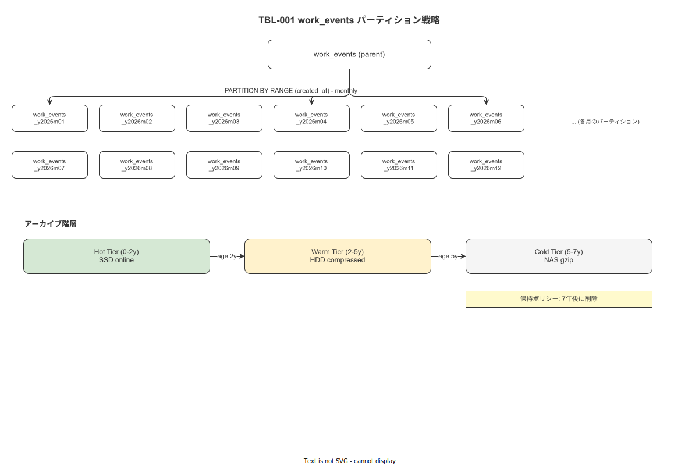
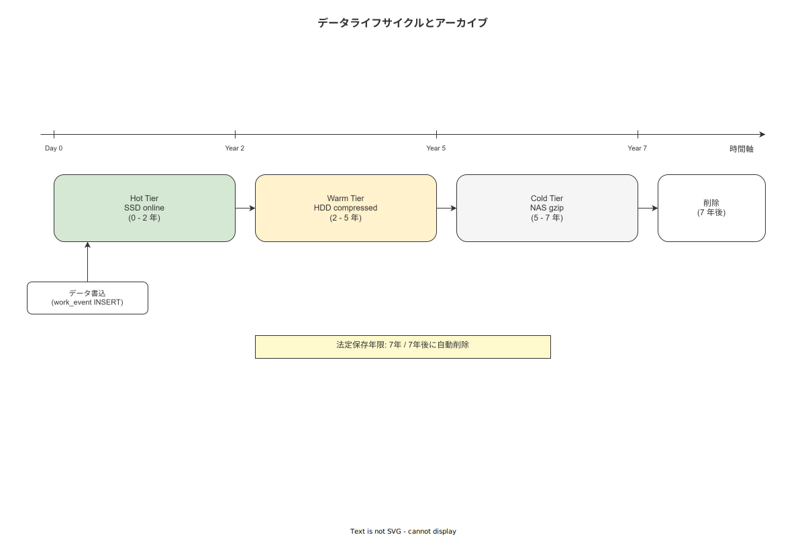

# 06 パーティション・アーカイブ詳細設計

本章の責務は、TBL-001 work_events の月次 RANGE パーティション管理の詳細手順・パーティション作成自動化・アーカイブ階層（ホット / ウォーム / コールド）の運用仕様を確定することである。`04_概要設計/04_データ設計/06_インデックス・パーティション・アーカイブ方式.md` の方針を runnable な SQL と運用手順に落とす。

---

## 1. work_events 月次 RANGE パーティション詳細

**図 1: パーティション戦略概要**



> 原本: [`img/fig_dd_db_partition_strategy.drawio`](img/fig_dd_db_partition_strategy.drawio)

### 1-1. パーティション方式の決定

| 検討方式 | 採否 | 理由 |
|---|---|---|
| pg_partman による自動管理 | **不採用** | ver1.0.0 では外部拡張依存を最小化する。pg_partman はインストール・設定の複雑さを伴う。 |
| 手動 SQL + BAT-004 自動作成 | **採用** | 毎月1日に BAT-004 が翌月パーティションを CREATE する。シンプルで運用可視性が高い。 |

pg_partman を使用しないため、パーティション管理は全て `02_トランザクション系テーブルDDL.md` §1-1 で定義した親テーブルと、BAT-004 が毎月作成する子テーブルで構成する。

### 1-2. パーティション命名規約

```
形式: work_events_y{YYYY}m{MM}
例:   work_events_y2026m01  (2026年1月分)
      work_events_y2026m12  (2026年12月分)
      work_events_y2027m01  (2027年1月分)
```

### 1-3. パーティション境界定義

各パーティションは UTC 月初 00:00:00 から翌月 UTC 月初 00:00:00 の半開区間 `[from, to)` を使用する。

```sql
-- パーティション境界のテンプレート（BAT-004 が毎月実行する）
-- 変数: target_year INTEGER, target_month INTEGER

CREATE TABLE IF NOT EXISTS work_events_y{YYYY}m{MM}
    PARTITION OF work_events
    FOR VALUES FROM ('{YYYY}-{MM}-01 00:00:00+00')
               TO   ('{YYYY+1/MM+1}-01 00:00:00+00');
```

### 1-4. 初期パーティション（2026年分）

`02_トランザクション系テーブルDDL.md` §1-1 で定義済み（work_events_y2026m01〜12）。

---

## 2. BAT-004: 月次パーティション自動作成手順

### 2-1. 実行スケジュール

```
実行タイミング: 毎月 25 日 02:00（JST）= UTC 16:00 前月
目的: 翌月のパーティションを月末までに事前作成し、月初の INSERT 欠落を防止する
```

### 2-2. Rust 実装疑似コード

```rust
/// BAT-004: 翌月の work_events パーティションを作成する
/// 毎月 25 日に実行する
async fn create_next_month_partition(pool: &PgPool) -> Result<(), AppError> {
    // 翌月の年月を計算
    let now = Utc::now();
    let next_month = now + Duration::days(45); // 翌月確実取得
    let year = next_month.year();
    let month = next_month.month();

    // パーティション名
    let partition_name = format!("work_events_y{:04}m{:02}", year, month);

    // パーティション FROM/TO の計算
    let from_ts = format!("{:04}-{:02}-01 00:00:00+00", year, month);
    let (to_year, to_month) = if month == 12 { (year + 1, 1) } else { (year, month + 1) };
    let to_ts = format!("{:04}-{:02}-01 00:00:00+00", to_year, to_month);

    let sql = format!(
        "CREATE TABLE IF NOT EXISTS {name} \
         PARTITION OF work_events \
         FOR VALUES FROM ('{from}') TO ('{to}')",
        name = partition_name,
        from = from_ts,
        to   = to_ts,
    );

    sqlx::query(&sql).execute(pool).await?;

    tracing::info!(
        partition = %partition_name,
        "created next month partition for work_events"
    );
    Ok(())
}
```

### 2-3. 異常時の手動実行 SQL

BAT-004 が失敗した場合（ログ監視 MON-001 が検知）、DBA が手動で以下を実行する。

```sql
-- 手動実行例: 2027年1月のパーティションを作成する
CREATE TABLE IF NOT EXISTS work_events_y2027m01
    PARTITION OF work_events
    FOR VALUES FROM ('2027-01-01 00:00:00+00')
               TO   ('2027-02-01 00:00:00+00');

-- 確認
SELECT
    inhrelid::regclass    AS partition_name,
    pg_get_expr(relpartbound, inhrelid) AS partition_bound
FROM pg_inherits
    JOIN pg_class parent ON parent.oid = inhparent
WHERE parent.relname = 'work_events'
ORDER BY partition_name;
```

---

## 3. アーカイブ階層設計

**図 2: アーカイブ階層（ライフサイクル）**



> 原本: [`img/fig_dd_db_archive_tiers.drawio`](img/fig_dd_db_archive_tiers.drawio)

### 3-1. 3 段階保存ポリシー

| 階層 | 期間 | ストレージ | TableSpace | 検索方法 | 圧縮 |
|---|---|---|---|---|---|
| ホット（Hot）| 作成後 0〜24 か月 | SSD PostgreSQL | `pg_default` | 即時 SQL 検索 | なし |
| ウォーム（Warm）| 25〜60 か月 | HDD 別 TableSpace | `warm_ts` | SQL 検索（レスポンス数秒）| PostgreSQL 圧縮（TOAST）|
| コールド（Cold）| 61〜84 か月 | NAS gzip ダンプ | — | ダンプからリストア後に検索 | gzip |
| オフサイト（Offsite）| 85 か月〜 | テープ/クラウド | — | 手動リストア（数日）| AES-256 暗号化 |

保存期間の起算: `timestamp_server` の月。

### 3-2. ウォーム移行手順（BAT-005 連携）

対象パーティションが 24 か月を超えた時点で年次レビュー時に実施する。

```sql
-- ステップ1: warm_ts テーブルスペースを作成する（DBA 初回実行）
-- warm_ts は HDD マウントポイント /data/warm/ に作成済みであること
CREATE TABLESPACE warm_ts LOCATION '/data/warm/postgresql';

-- ステップ2: 対象パーティションをウォーム TableSpace に移動する
-- 例: 2024年1月分（24か月超）を移行する
ALTER TABLE work_events_y2024m01 SET TABLESPACE warm_ts;

-- ステップ3: 移行後の確認
SELECT
    relname,
    spcname AS tablespace
FROM pg_class c
    JOIN pg_tablespace t ON t.oid = c.reltablespace
WHERE relname LIKE 'work_events_%'
ORDER BY relname;
```

### 3-3. コールド移行手順（BAT-005 pg_dump）

対象パーティションが 60 か月を超えた時点で BAT-005 が実施する。

```bash
#!/bin/bash
# BAT-005 コールドアーカイブスクリプト（概要）
# 引数: YEAR MONTH （例: 2021 01）

YEAR=$1
MONTH=$2
PARTITION="work_events_y${YEAR}m$(printf '%02d' $MONTH)"
DUMP_PATH="/backups/postgresql/cold/${PARTITION}.dump.gz"

# pg_dump でパーティション単体をダンプ
pg_dump \
    --host="${PGHOST}" \
    --username="${PGUSER}" \
    --dbname="${PGDATABASE}" \
    --table="${PARTITION}" \
    --format=custom \
    --compress=9 \
    --file="${DUMP_PATH}"

# ダンプ成功確認後、パーティションを親テーブルから切り離す
psql -c "ALTER TABLE work_events DETACH PARTITION ${PARTITION} CONCURRENTLY;"

# 切り離し後、パーティション本体をドロップする（ダンプが確認済みの場合のみ）
# psql -c "DROP TABLE ${PARTITION};"  # ← 必ず手動確認後に実行すること

echo "Cold archive completed: ${DUMP_PATH}"
```

### 3-4. コールドアーカイブのリストア手順

法令・監査要件でコールドアーカイブ期間のデータが必要になった場合の手順。

```bash
# 1. NAS からダンプを取得する
# 2. リストア先のステージングスキーマを作成する
psql -c "CREATE SCHEMA IF NOT EXISTS archive_restore;"

# 3. pg_restore でリストアする
pg_restore \
    --host="${PGHOST}" \
    --username="${PGUSER}" \
    --dbname="${PGDATABASE}" \
    --schema-only \
    --table="work_events_y2021m01" \
    "${DUMP_PATH}"

pg_restore \
    --host="${PGHOST}" \
    --username="${PGUSER}" \
    --dbname="${PGDATABASE}" \
    --data-only \
    --table="work_events_y2021m01" \
    "${DUMP_PATH}"
```

---

## 4. パーティション一覧管理クエリ

### 4-1. 現在のパーティション一覧確認

```sql
-- 現在の全 work_events パーティション一覧（ホット/ウォーム別）
SELECT
    c.relname                                   AS partition_name,
    t.spcname                                   AS tablespace,
    pg_size_pretty(pg_relation_size(c.oid))     AS table_size,
    pg_size_pretty(pg_indexes_size(c.oid))      AS indexes_size,
    pg_get_expr(c.relpartbound, c.oid, TRUE)    AS partition_bound,
    CASE
        WHEN t.spcname = 'warm_ts' THEN 'WARM'
        ELSE 'HOT'
    END AS tier
FROM pg_class c
    JOIN pg_inherits i ON i.inhrelid = c.oid
    JOIN pg_class parent ON parent.oid = i.inhparent
    LEFT JOIN pg_tablespace t ON t.oid = c.reltablespace
WHERE parent.relname = 'work_events'
ORDER BY c.relname;
```

### 4-2. 移行対象パーティションの確認（24 か月超）

```sql
-- ウォーム移行候補（24 か月を超えたホットパーティション）
SELECT
    c.relname                               AS partition_name,
    pg_size_pretty(pg_relation_size(c.oid)) AS size,
    -- パーティション名から年月を抽出して経過月数を計算
    (EXTRACT(YEAR FROM AGE(NOW(),
        TO_DATE(
            regexp_replace(c.relname, 'work_events_y(\d{4})m(\d{2})', '\1-\2-01'),
            'YYYY-MM-DD'
        )
    )) * 12 +
     EXTRACT(MONTH FROM AGE(NOW(),
        TO_DATE(
            regexp_replace(c.relname, 'work_events_y(\d{4})m(\d{2})', '\1-\2-01'),
            'YYYY-MM-DD'
        )
    )))::INTEGER AS age_months
FROM pg_class c
    JOIN pg_inherits i ON i.inhrelid = c.oid
    JOIN pg_class parent ON parent.oid = i.inhparent
    LEFT JOIN pg_tablespace t ON t.oid = c.reltablespace
WHERE parent.relname = 'work_events'
  AND (t.spcname IS NULL OR t.spcname = 'pg_default')  -- ホット層のみ
  AND c.relname ~ '^work_events_y\d{4}m\d{2}$'
HAVING (EXTRACT(YEAR FROM AGE(NOW(),
    TO_DATE(
        regexp_replace(c.relname, 'work_events_y(\d{4})m(\d{2})', '\1-\2-01'),
        'YYYY-MM-DD'
    )
)) * 12 + EXTRACT(MONTH FROM AGE(NOW(),
    TO_DATE(
        regexp_replace(c.relname, 'work_events_y(\d{4})m(\d{2})', '\1-\2-01'),
        'YYYY-MM-DD'
    )
)))::INTEGER > 24
ORDER BY c.relname;
```

---

**本節で確定した方針**
- **pg_partman を不採用とし、BAT-004 による毎月 25 日の手動 CREATE TABLE IF NOT EXISTS で月次パーティションを管理する。シンプルさと運用可視性を優先し、外部拡張依存を排除する。**
- **アーカイブ階層をホット（0〜24 か月 SSD）・ウォーム（25〜60 か月 HDD warm_ts）・コールド（61〜84 か月 NAS gzip ダンプ）・オフサイト（85 か月〜 AES-256）の 4 段階とし、NFR-OPS-035（7 年以上保存）を全段階でカバーする。**
- **コールド移行は `ALTER TABLE DETACH PARTITION CONCURRENTLY` で運用停止なしに実行し、ダンプ確認後に `DROP TABLE` を手動実行する 2 ステップ安全手順を確定した。**

---

## 参照業界分析

### 必須
- [`90_業界分析/06_品質管理とトレーサビリティ.md`](../../../90_業界分析/06_品質管理とトレーサビリティ.md)
- [`90_業界分析/21_電子記録の法規制とALCOA+.md`](../../../90_業界分析/21_電子記録の法規制とALCOA+.md)

### 関連
- [`90_業界分析/27_オフライン同期とデータ整合性.md`](../../../90_業界分析/27_オフライン同期とデータ整合性.md)
