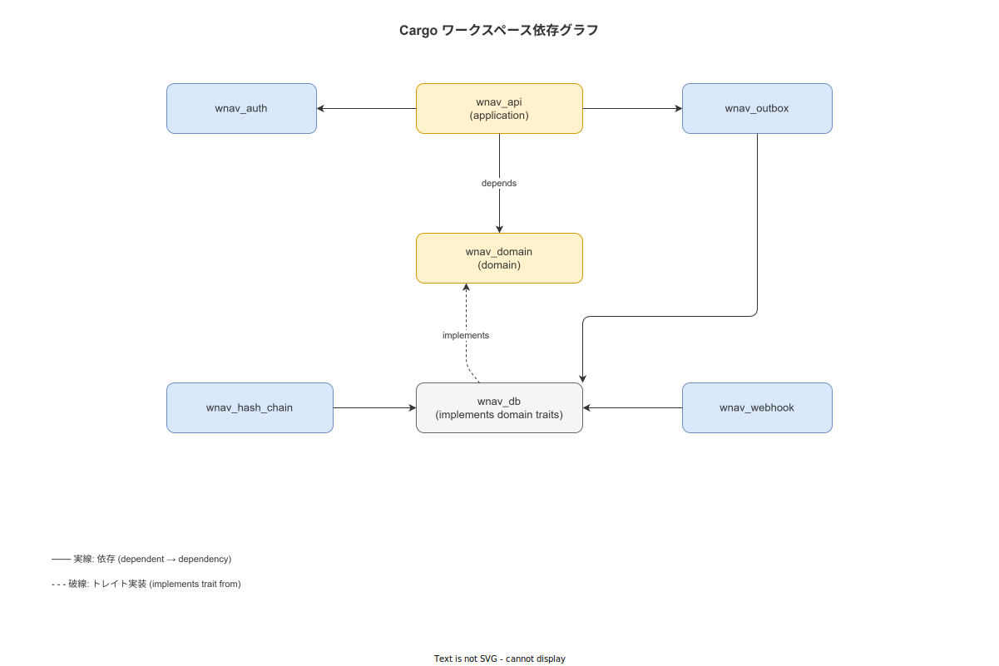

# 00 本書の位置づけと識別子規約

本章は `05_詳細設計/02_バックエンド詳細設計` サブの位置づけ・IPA 2.5.1 タスクとの対応・Cargo ワークスペース構成・FNC-BE-NNN 識別子採番規約・MOD-BE 対章カバレッジ表を確定する。バックエンドは `wnav_terminal_api`（ハンディ端末向け, ポート 8080）と `wnav_master_api`（マスタメンテ・管理コンソール向け, ポート 8081）の 2 バイナリ構成とする。

---

## 1. IPA 2.5.1 タスクカバレッジ

IPA 共通フレーム 2013 の「2.5.1 ソフトウェアコンポーネント詳細設計」が要求するタスクと、本サブの各章との対応を以下に示す。

| IPA 2.5.1 要求タスク | 担当章 | 備考 |
|---|---|---|
| コンポーネントの責務・依存関係の確定 | 本章（§2）| Cargo ワークスペース構成と依存グラフ |
| 関数・メソッドシグネチャの定義 | `01_`〜`09_` | FNC-BE-NNN でトレース |
| データ構造の完全定義 | `03_`・`04_` | struct / enum の全フィールド |
| アルゴリズムの疑似コード/実装仕様 | `06_`・`07_`・`08_` | ハッシュチェーン・Outbox・Webhook |
| エラー処理の詳細設計 | `10_` | ERR-NNN × AppError × HTTP ステータス |
| 設定パラメータの定義 | `01_`・`02_`・`04_`・`05_`・`07_` | DbConfig・OutboxConfig 等 |

---

## 2. Cargo ワークスペース構成

バックエンドは単一 Cargo ワークスペース配下の 8 クレートで構成する。`wnav_terminal_api` と `wnav_master_api` の 2 バイナリが独立プロセスとして起動し、それぞれポート 8080・8081 でリッスンする。

**図 1: クレート依存グラフ**



> 原本: [`img/fig_dd_be_crate_deps.drawio`](img/fig_dd_be_crate_deps.drawio)

```toml
# Cargo.toml（ワークスペースルート）
[workspace]
resolver = "2"
members = [
    "crates/wnav_terminal_api",
    "crates/wnav_master_api",
    "crates/wnav_domain",
    "crates/wnav_db",
    "crates/wnav_auth",
    "crates/wnav_hash_chain",
    "crates/wnav_outbox",
    "crates/wnav_webhook",
]

[workspace.package]
edition = "2024"
rust-version = "1.82"
authors = ["RyuheiKiso"]

[workspace.dependencies]
tokio       = { version = "1", features = ["full"] }
axum        = { version = "0.8", features = ["macros"] }
sqlx        = { version = "0.8", features = ["postgres", "uuid", "chrono", "runtime-tokio-native-tls"] }
serde       = { version = "1", features = ["derive"] }
serde_json  = "1"
uuid        = { version = "1", features = ["v7", "serde"] }
chrono      = { version = "0.4", features = ["serde"] }
thiserror   = "1"
tracing     = "0.1"
tracing-subscriber = { version = "0.3", features = ["env-filter", "json"] }
sha2        = "0.10"
hmac        = "0.12"
hex         = "0.4"
jsonwebtoken = "9"
tower       = "0.5"
tower-http  = { version = "0.6", features = ["cors", "trace"] }
utoipa      = { version = "4", features = ["axum_extras"] }
reqwest     = { version = "0.12", features = ["json", "rustls-tls"] }
```

### 2-1. クレート間依存グラフ

依存方向は上流から下流への一方向とし、循環依存を禁止する。

```
wnav_terminal_api（ポート 8080）
  ├── wnav_domain
  │     └── (外部クレートに依存しない)
  ├── wnav_auth    ──→ wnav_domain
  ├── wnav_outbox  ──→ wnav_domain, wnav_db
  └── wnav_db      ──→ wnav_domain

wnav_master_api（ポート 8081）
  ├── wnav_domain
  ├── wnav_auth    ──→ wnav_domain
  ├── wnav_hash_chain ──→ wnav_domain
  ├── wnav_webhook ──→ wnav_db
  └── wnav_db      ──→ wnav_domain
```

- `wnav_domain` は axum・sqlx 等の外部クレートに依存しない（依存逆転の原則を厳守）
- `wnav_db` が `wnav_domain` のリポジトリ Trait を実装する

---

## 3. FNC-BE-NNN 識別子採番規約

### 3-1. 採番対象

FNC-BE-NNN は以下の要素に対して採番する。採番は重要度の高いもの（ドメインサービスのユースケースメソッド・状態遷移ガード・ハッシュチェーン計算・Outbox ディスパッチ）に限定し、全 pub fn の網羅は求めない。

| 採番対象 | 例 |
|---|---|
| ドメインサービス trait メソッド | `WorkExecutionService::start_work` |
| リポジトリ trait メソッド | `WorkExecutionRepository::find_by_id` |
| 状態遷移ガード | `WorkExecutionStatus::can_transition_to` |
| ハッシュチェーン計算 | `compute_content_hash`・`compute_chain_hash` |
| Outbox ディスパッチ | `OutboxConsumer::dispatch_pending` |
| JWT 検証 | `AuthMiddleware::verify_jwt` |
| RBAC 評価 | `RequireRole::evaluate` |

### 3-2. 識別子フォーマット

```
FNC-BE-NNN
例: FNC-BE-001, FNC-BE-042
```

### 3-3. 採番台帳（初期値）

| FNC-ID | クレート | 関数・メソッド名 | 担当章 |
|---|---|---|---|
| FNC-BE-001 | wnav_domain | `WorkExecutionService::start_work` | `03_` |
| FNC-BE-002 | wnav_domain | `WorkExecutionService::complete_step` | `03_` |
| FNC-BE-003 | wnav_domain | `WorkExecutionService::suspend` | `03_` |
| FNC-BE-004 | wnav_domain | `WorkExecutionService::resume` | `03_` |
| FNC-BE-005 | wnav_domain | `WorkExecutionStatus::can_transition_to` | `03_` |
| FNC-BE-006 | wnav_db | `PgWorkExecutionRepository::find_by_id` | `04_` |
| FNC-BE-007 | wnav_db | `PgWorkExecutionRepository::create` | `04_` |
| FNC-BE-008 | wnav_db | `record_step_completed_tx` | `04_` |
| FNC-BE-009 | wnav_hash_chain | `compute_content_hash` | `06_` |
| FNC-BE-010 | wnav_hash_chain | `compute_chain_hash` | `06_` |
| FNC-BE-011 | wnav_hash_chain | `HashChainService::verify_chain` | `06_` |
| FNC-BE-012 | wnav_outbox | `OutboxConsumer::dispatch_pending` | `07_` |
| FNC-BE-013 | wnav_webhook | `sign_payload` | `08_` |
| FNC-BE-014 | wnav_auth | `verify_jwt` | `05_` |
| FNC-BE-015 | wnav_auth | `RequireRole::evaluate` | `05_` |
| FNC-BE-016 | wnav_terminal_api | `create_router` | `01_` |
| FNC-BE-017 | wnav_master_api | `create_router` | `02_` |

次採番値: **FNC-BE-018**

---

## 4. MOD-BE × 担当章カバレッジ表

| MOD-ID | クレート名 | 担当章 | カバーする主要 FR |
|---|---|---|---|
| MOD-BE-001 | wnav_terminal_api | `01_wnav_terminal_api詳細設計.md` | ハンディ端末向け API エンドポイント（イベント・証拠・同期・IQC 検査・手直し実行・認証）|
| MOD-BE-002 | wnav_domain | `03_wnav_domain詳細設計.md` | 全 FR |
| MOD-BE-003 | wnav_hash_chain | `06_wnav_hash_chain詳細設計.md` | FR-EV-001/002 |
| MOD-BE-004 | wnav_db | `04_wnav_db詳細設計.md` | 全 TBL |
| MOD-BE-005 | wnav_auth | `05_wnav_auth詳細設計.md` | FR-AU-001〜006 |
| MOD-BE-006 | wnav_outbox | `07_wnav_outbox詳細設計.md` | FR-SY-002/005 |
| MOD-BE-007 | wnav_webhook | `08_wnav_webhook詳細設計.md` | IF-002 |
| MOD-BE-010 | wnav_master_api | `02_wnav_master_api詳細設計.md` | 管理系 API エンドポイント（SOP・マスタ・承認・ユーザー・監査・帳票・運用・トレース・アラート・CAPA・改善提案・IQC 判定/特採・手直し指示・廃棄・返品・認証）|
| MOD-SH-001〜004 | 共通 | `09_共通ライブラリ詳細設計.md` | FR-UI-001〜003・全 API |

---

## 5. 上流設計との対応

本サブの各章は以下の上流ドキュメントを入力とし、変更を行わない。

| 上流ドキュメント | 本サブへの制約 |
|---|---|
| `04_概要設計/02_ソフトウェア方式設計/11_モジュール一覧.md` | MOD-BE-001〜007・MOD-BE-010 の責務は変更不可 |
| `04_概要設計/02_ソフトウェア方式設計/02_レイヤー構成とパッケージ分割.md` | 4 層依存方向（Presentation → Application → Domain ← Infrastructure）は変更不可 |
| `04_概要設計/02_ソフトウェア方式設計/07_例外・エラーハンドリング統一方式.md` | ERR-NNN 識別子・HTTP ステータスマッピングは変更不可 |
| `04_概要設計/05_外部インターフェース設計/03_認証認可方式.md` | JWT RS256・RBAC 6 ロール定義は変更不可 |
| `04_概要設計/付録/99_設計識別子採番台帳.md` | TBL-001〜035 は継承・変更不可 |

---

**本節で確定した方針**
- **IPA 2.5.1 の全要求タスクを本サブの 12 章に割付け、カバレッジに漏れがないことを確認した。**
- **バックエンドを `wnav_terminal_api`（ポート 8080）と `wnav_master_api`（ポート 8081）の 2 バイナリに分割し、Cargo ワークスペース 8 クレート構成を確定した。**
- **`wnav_domain` が外部クレートに依存しない依存逆転の原則を本サブ全体に適用する。**
- **FNC-BE-001〜017 を初期採番し、次採番値 FNC-BE-018 を確定した。**
- **MOD-BE-010（wnav_master_api）を追加し、MOD-BE カバレッジ表を 8 クレート対応に更新した。**

---

## 参照業界分析

### 必須
- [`90_業界分析/09_セキュリティとアクセス制御.md`](../../90_業界分析/09_セキュリティとアクセス制御.md)

### 関連
- [`90_業界分析/06_品質管理とトレーサビリティ.md`](../../90_業界分析/06_品質管理とトレーサビリティ.md)
