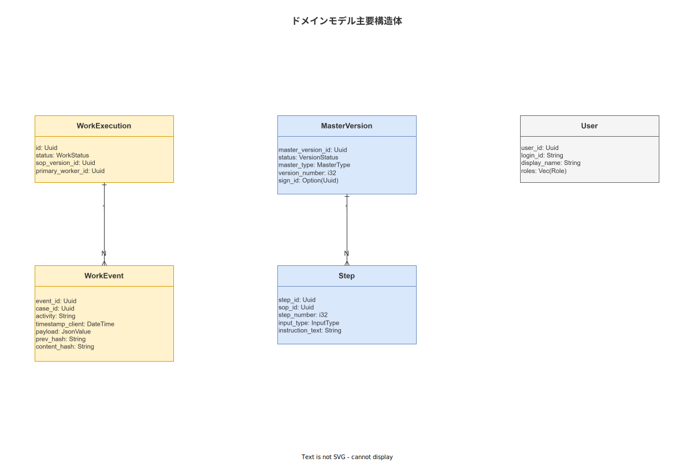

# 02 wnav_domain 詳細設計（MOD-BE-002）

本章は `crates/wnav_domain/` のドメインモデル・サービス Trait・リポジトリ Trait・ドメインイベントの詳細設計を確定する。本クレートは Domain 層の唯一の実装であり、外部クレート（axum・sqlx 等）への依存を持たない。

**図 1: ドメインモデル構造**



> 原本: [`img/fig_dd_be_domain_model.drawio`](img/fig_dd_be_domain_model.drawio)

---

## 1. コアドメイン構造体

### 1-1. WorkExecution（EN-011）

```rust
// crates/wnav_domain/src/model/work_execution.rs

use chrono::{DateTime, Utc};
use uuid::Uuid;

/// 作業実行セッション。1 件の WorkExecution が 1 件の実作業に対応する。
/// TBL-005 work_executions に永続化される。
#[derive(Debug, Clone, PartialEq)]
pub struct WorkExecution {
    /// 作業実行 ID（UUID v7）
    pub work_execution_id: Uuid,
    /// 対象 SOP バージョン ID
    pub sop_version_id: Uuid,
    /// 主担当作業員 ID
    pub primary_worker_id: Uuid,
    /// 補助担当作業員 ID（任意）
    pub secondary_worker_id: Option<Uuid>,
    /// 端末 ID
    pub terminal_id: Uuid,
    /// 生産対象 ID（ロット・シリアル等）
    pub production_target_id: Option<String>,
    /// 現在ステータス
    pub status: WorkExecutionStatus,
    /// 現在の進行 Step 番号（0 基準）
    pub current_step_index: u32,
    /// 開始日時（UTC）
    pub started_at: Option<DateTime<Utc>>,
    /// 完了日時（UTC）
    pub completed_at: Option<DateTime<Utc>>,
    /// 楽観ロック用最終更新日時
    pub updated_at: DateTime<Utc>,
}
```

### 1-2. WorkExecutionStatus（状態機械）

```rust
// crates/wnav_domain/src/model/work_execution.rs

/// 作業実行の状態機械。
/// 合法な遷移: NotStarted→InProgress, InProgress→{Suspended,Completed,Cancelled}, Suspended→InProgress
#[derive(Debug, Clone, PartialEq, serde::Serialize, serde::Deserialize)]
#[serde(rename_all = "SCREAMING_SNAKE_CASE")]
pub enum WorkExecutionStatus {
    NotStarted,
    InProgress,
    Suspended,
    Completed,
    Cancelled,
}

impl WorkExecutionStatus {
    /// (FNC-BE-005) 現在状態から次状態への遷移が合法かどうかを返す。
    pub fn can_transition_to(&self, next: &Self) -> bool {
        matches!(
            (self, next),
            (Self::NotStarted, Self::InProgress)
                | (Self::InProgress, Self::Suspended)
                | (Self::InProgress, Self::Completed)
                | (Self::InProgress, Self::Cancelled)
                | (Self::Suspended, Self::InProgress)
        )
    }
}
```

### 1-3. WorkEvent（EN-012）

```rust
// crates/wnav_domain/src/model/work_event.rs

use chrono::{DateTime, Utc};
use uuid::Uuid;
use serde_json::Value;

/// 作業イベント。Append-only のイベントストア（TBL-001 work_events）に記録される。
/// 一度 INSERT されたレコードは UPDATE・DELETE しない。
#[derive(Debug, Clone)]
pub struct WorkEvent {
    /// イベント ID（UUID v7、Idempotency Key と同一値）
    pub event_id: Uuid,
    /// 作業実行 ID（XES での case_id）
    pub case_id: Uuid,
    /// XES アクティビティ名（例: "step.completed"・"work.started"）
    pub activity: String,
    /// Step 番号（任意。Step 関連イベントのみ設定）
    pub step_id: Option<Uuid>,
    /// クライアント記録日時
    pub timestamp_client: DateTime<Utc>,
    /// サーバー受信日時
    pub timestamp_server: DateTime<Utc>,
    /// 作業員 ID（XES での resource）
    pub resource: Uuid,
    /// 使用 SOP バージョン ID（時点参照）
    pub sop_version_id: Uuid,
    /// 端末 ID
    pub terminal_id: Uuid,
    /// イベント固有データ（JSONB）
    pub payload: Value,
    /// 前イベントのコンテンツハッシュ（SHA-256 hex、genesis は "0"×64）
    pub prev_hash: String,
    /// 本イベントのコンテンツハッシュ（SHA-256 hex）
    pub content_hash: String,
}

/// ドメインイベント: WorkEvent に追加するコマンドの種類を定義する値オブジェクト
#[derive(Debug, Clone, PartialEq)]
pub enum WorkEventActivity {
    WorkStarted,
    StepCompleted,
    StepSkipped,
    EvidenceRecorded,
    ElectronicSigned,
    WorkSuspended,
    WorkResumed,
    WorkCompleted,
    WorkCancelled,
    AndonTriggered,
}

impl WorkEventActivity {
    pub fn as_str(&self) -> &'static str {
        match self {
            Self::WorkStarted      => "work.started",
            Self::StepCompleted    => "step.completed",
            Self::StepSkipped      => "step.skipped",
            Self::EvidenceRecorded => "evidence.recorded",
            Self::ElectronicSigned => "electronic_sign.recorded",
            Self::WorkSuspended    => "work.suspended",
            Self::WorkResumed      => "work.resumed",
            Self::WorkCompleted    => "work.completed",
            Self::WorkCancelled    => "work.cancelled",
            Self::AndonTriggered   => "andon.triggered",
        }
    }
}
```

### 1-4. MasterVersion（EN-006）

```rust
// crates/wnav_domain/src/model/master_version.rs

use chrono::{DateTime, Utc};
use uuid::Uuid;

/// SOP のバージョン管理エンティティ。
/// `Published` への遷移には電子サイン + quality_admin ロールが必須（BR-BUS-012）
#[derive(Debug, Clone)]
pub struct MasterVersion {
    pub master_version_id: Uuid,
    pub sop_id: Uuid,
    pub version_number: String,
    pub status: MasterVersionStatus,
    pub approved_by: Option<Uuid>,
    pub approved_at: Option<DateTime<Utc>>,
    pub published_at: Option<DateTime<Utc>>,
    pub created_by: Uuid,
    pub created_at: DateTime<Utc>,
    pub updated_at: DateTime<Utc>,
}

#[derive(Debug, Clone, PartialEq, serde::Serialize, serde::Deserialize)]
#[serde(rename_all = "SCREAMING_SNAKE_CASE")]
pub enum MasterVersionStatus {
    Draft,
    UnderReview,
    Published,
    Archived,
}

impl MasterVersionStatus {
    pub fn can_transition_to(&self, next: &Self) -> bool {
        matches!(
            (self, next),
            (Self::Draft, Self::UnderReview)
                | (Self::UnderReview, Self::Draft)
                | (Self::UnderReview, Self::Published)
                | (Self::Published, Self::Archived)
        )
    }
}
```

### 1-5. Step（EN-008）

```rust
// crates/wnav_domain/src/model/step.rs

use uuid::Uuid;
use serde_json::Value;

/// SOP 内の単一手順ステップ。
/// ロックステップ強制（BR-BUS-001）の適用対象。
#[derive(Debug, Clone)]
pub struct Step {
    pub step_id: Uuid,
    pub sop_id: Uuid,
    /// 1 基準のステップ番号（表示順）
    pub step_number: u32,
    /// ステップタイトル
    pub title: String,
    /// 作業指示テキスト（Markdown 可）
    pub instruction: String,
    /// JSON Logic 条件式（スキップ条件・分岐条件）
    pub condition_dsl: Option<Value>,
    /// 証拠記録が必須かどうか（BR-BUS-003）
    pub evidence_required: bool,
    /// 電子サインが必須かどうか（BR-BUS-004）
    pub sign_required: bool,
    /// スキップ可能かどうか
    pub skippable: bool,
    /// 推定作業時間（秒）
    pub estimated_duration_secs: Option<u32>,
}
```

### 1-6. User（EN-001）

```rust
// crates/wnav_domain/src/model/user.rs

use uuid::Uuid;

/// システムユーザー。全コンテキストで参照される横断エンティティ（Shared Kernel）
#[derive(Debug, Clone)]
pub struct User {
    pub user_id: Uuid,
    pub login_id: String,
    /// bcrypt ハッシュ化済みパスワード（LDAP 不可時のローカル認証用）
    pub password_hash: String,
    pub display_name: String,
    pub email: Option<String>,
    pub factory_id: Uuid,
    pub roles: Vec<RoleId>,
    pub skill_level: u8,
    pub is_active: bool,
}

#[derive(Debug, Clone, PartialEq, serde::Serialize, serde::Deserialize)]
#[serde(rename_all = "snake_case")]
pub enum RoleId {
    Operator,
    Supervisor,
    MasterAdmin,
    QualityAdmin,
    SystemAdmin,
    Executive,
}
```

---

## 2. リポジトリ Trait

```rust
// crates/wnav_domain/src/repository/work_execution_repo.rs

use async_trait::async_trait;
use uuid::Uuid;
use crate::model::work_execution::{WorkExecution, WorkExecutionStatus};
use crate::error::DomainError;

/// 作業実行リポジトリ Trait。
/// 実装は `crates/wnav_db/` の PgWorkExecutionRepository が担う。
#[async_trait]
pub trait WorkExecutionRepository: Send + Sync {
    /// (FNC-BE-006) ID で単一の作業実行を検索する。
    async fn find_by_id(&self, id: Uuid) -> Result<Option<WorkExecution>, DomainError>;

    /// 作業実行の一覧を取得する（作業員 ID・ステータスでフィルタ可）
    async fn list(
        &self,
        filter: WorkExecutionFilter,
        page: Pagination,
    ) -> Result<Page<WorkExecution>, DomainError>;

    /// (FNC-BE-007) 新規作業実行を INSERT する。
    async fn create(&self, cmd: CreateWorkExecutionCmd) -> Result<WorkExecution, DomainError>;

    /// 楽観ロック付きステータス更新。変更された行数を返す（0 なら競合）。
    async fn update_status_if_unchanged(
        &self,
        id: Uuid,
        new_status: WorkExecutionStatus,
        expected_updated_at: chrono::DateTime<chrono::Utc>,
    ) -> Result<u64, DomainError>;
}

#[derive(Debug, Default)]
pub struct WorkExecutionFilter {
    pub worker_id: Option<Uuid>,
    pub status: Option<WorkExecutionStatus>,
    pub sop_version_id: Option<Uuid>,
}

#[derive(Debug)]
pub struct CreateWorkExecutionCmd {
    pub work_execution_id: Uuid,
    pub sop_version_id: Uuid,
    pub primary_worker_id: Uuid,
    pub secondary_worker_id: Option<Uuid>,
    pub terminal_id: Uuid,
    pub production_target_id: Option<String>,
}
```

```rust
// crates/wnav_domain/src/repository/work_event_repo.rs

use async_trait::async_trait;
use uuid::Uuid;
use crate::model::work_event::WorkEvent;
use crate::error::DomainError;

/// WorkEvent リポジトリ Trait（Append-only）
#[async_trait]
pub trait WorkEventRepository: Send + Sync {
    /// 単一の WorkEvent を INSERT する。
    /// UPDATE・DELETE は提供しない（Append-only 設計）。
    async fn insert(&self, event: WorkEvent) -> Result<(), DomainError>;

    /// 指定 case_id の最新ハッシュ（content_hash）を取得する。
    /// genesis（初回）は "0000...0000"（64 桁）を返す。
    async fn latest_hash(&self, case_id: Uuid) -> Result<String, DomainError>;

    /// case_id に紐づく全 WorkEvent を時系列順に取得する。
    async fn list_by_case(&self, case_id: Uuid) -> Result<Vec<WorkEvent>, DomainError>;
}
```

---

## 3. サービス Trait と実装

### 3-1. WorkExecutionService

```rust
// crates/wnav_domain/src/service/work_execution_service.rs

use async_trait::async_trait;
use uuid::Uuid;
use crate::{
    model::work_execution::WorkExecution,
    model::work_event::WorkEvent,
    error::AppError,
};

/// 作業実行ユースケースのサービス Trait（Application 層インターフェース）
#[async_trait]
pub trait WorkExecutionService: Send + Sync {
    /// (FNC-BE-001) 作業を開始し、WorkExecution を作成して WorkEvent(work.started) を記録する。
    /// スキルゲート（BR-BUS-002/041）を検証する。
    async fn start_work(&self, cmd: StartWorkCmd) -> Result<WorkExecution, AppError>;

    /// (FNC-BE-002) Step を完了し、WorkEvent(step.completed) を記録する。
    /// ロックステップ強制（BR-BUS-001）・証拠必須検証（BR-BUS-003）を行う。
    async fn complete_step(&self, cmd: CompleteStepCmd) -> Result<WorkEvent, AppError>;

    /// (FNC-BE-003) 作業を中断し、WorkEvent(work.suspended) を記録する。
    async fn suspend(&self, cmd: SuspendCmd) -> Result<Suspension, AppError>;

    /// (FNC-BE-004) 中断された作業を再開し、WorkEvent(work.resumed) を記録する。
    async fn resume(&self, cmd: ResumeCmd) -> Result<WorkExecution, AppError>;

    /// 作業を完了し、WorkEvent(work.completed) を記録する。
    /// 全 Step が完了していることを検証する。
    async fn complete_work(&self, cmd: CompleteWorkCmd) -> Result<WorkExecution, AppError>;
}

#[derive(Debug)]
pub struct StartWorkCmd {
    pub work_execution_id: Uuid,
    pub sop_version_id: Uuid,
    pub primary_worker_id: Uuid,
    pub secondary_worker_id: Option<Uuid>,
    pub terminal_id: Uuid,
    pub production_target_id: Option<String>,
    pub idempotency_key: Uuid,
    pub client_timestamp: chrono::DateTime<chrono::Utc>,
}

#[derive(Debug)]
pub struct CompleteStepCmd {
    pub work_execution_id: Uuid,
    pub step_id: Uuid,
    pub worker_id: Uuid,
    pub evidence_ids: Vec<Uuid>,
    pub sign_id: Option<Uuid>,
    pub measurement_value: Option<serde_json::Value>,
    pub idempotency_key: Uuid,
    pub client_timestamp: chrono::DateTime<chrono::Utc>,
}

#[derive(Debug)]
pub struct SuspendCmd {
    pub work_execution_id: Uuid,
    pub worker_id: Uuid,
    pub reason_code: String,
    pub reason_text: Option<String>,
    pub expected_updated_at: chrono::DateTime<chrono::Utc>,
    pub idempotency_key: Uuid,
    pub client_timestamp: chrono::DateTime<chrono::Utc>,
}

#[derive(Debug)]
pub struct ResumeCmd {
    pub work_execution_id: Uuid,
    pub worker_id: Uuid,
    pub expected_updated_at: chrono::DateTime<chrono::Utc>,
    pub idempotency_key: Uuid,
    pub client_timestamp: chrono::DateTime<chrono::Utc>,
}

#[derive(Debug)]
pub struct CompleteWorkCmd {
    pub work_execution_id: Uuid,
    pub worker_id: Uuid,
    pub expected_updated_at: chrono::DateTime<chrono::Utc>,
    pub idempotency_key: Uuid,
    pub client_timestamp: chrono::DateTime<chrono::Utc>,
}

#[derive(Debug)]
pub struct Suspension {
    pub suspension_id: Uuid,
    pub work_execution_id: Uuid,
    pub suspended_at: chrono::DateTime<chrono::Utc>,
    pub reason_code: String,
}
```

### 3-2. WorkExecutionService 実装（Application 層）

```rust
// crates/wnav_domain/src/service/work_execution_service_impl.rs

use std::sync::Arc;
use crate::{
    repository::{WorkExecutionRepository, WorkEventRepository, OutboxRepository},
    service::WorkExecutionService,
    error::AppError,
};
use wnav_hash_chain::HashChainService;

pub struct WorkExecutionServiceImpl {
    pub work_execution_repo: Arc<dyn WorkExecutionRepository>,
    pub work_event_repo: Arc<dyn WorkEventRepository>,
    pub outbox_repo: Arc<dyn OutboxRepository>,
    pub hash_chain_svc: Arc<HashChainService>,
    pub clock: Arc<dyn crate::shared::Clock>,
}

#[async_trait::async_trait]
impl WorkExecutionService for WorkExecutionServiceImpl {
    async fn start_work(&self, cmd: StartWorkCmd) -> Result<WorkExecution, AppError> {
        // 1. スキルゲート検証（BR-BUS-002/041）
        self.validate_skill_gate(cmd.primary_worker_id, cmd.sop_version_id).await?;

        // 2. SOP バージョンが Published であることを確認
        self.validate_sop_published(cmd.sop_version_id).await?;

        // 3. WorkExecution INSERT
        let work_execution = self.work_execution_repo.create(CreateWorkExecutionCmd {
            work_execution_id: cmd.work_execution_id,
            sop_version_id: cmd.sop_version_id,
            primary_worker_id: cmd.primary_worker_id,
            secondary_worker_id: cmd.secondary_worker_id,
            terminal_id: cmd.terminal_id,
            production_target_id: cmd.production_target_id,
        }).await?;

        // 4. WorkEvent(work.started) + OutboxEvent を同一 TX で記録
        self.record_event_with_outbox(
            WorkEventActivity::WorkStarted,
            cmd.work_execution_id,
            None,
            cmd.primary_worker_id,
            cmd.sop_version_id,
            cmd.terminal_id,
            serde_json::json!({}),
            cmd.idempotency_key,
            cmd.client_timestamp,
        ).await?;

        Ok(work_execution)
    }

    async fn complete_step(&self, cmd: CompleteStepCmd) -> Result<WorkEvent, AppError> {
        let execution = self.work_execution_repo
            .find_by_id(cmd.work_execution_id)
            .await?
            .ok_or(AppError::NotFound)?;

        // ロックステップ強制（BR-BUS-001）
        let step = self.get_step(cmd.step_id).await?;
        if step.step_number != execution.current_step_index + 1 {
            return Err(AppError::StepSequenceViolation {
                current_step: execution.current_step_index,
                attempted_step: step.step_number,
            });
        }

        // 証拠必須検証（BR-BUS-003）
        if step.evidence_required && cmd.evidence_ids.is_empty() {
            return Err(AppError::EvidenceRequired);
        }

        // 電子サイン必須検証（BR-BUS-004）
        if step.sign_required && cmd.sign_id.is_none() {
            return Err(AppError::SignRequired);
        }

        // WorkEvent(step.completed) + OutboxEvent を同一 TX で記録
        let event = self.record_event_with_outbox(
            WorkEventActivity::StepCompleted,
            cmd.work_execution_id,
            Some(cmd.step_id),
            cmd.worker_id,
            execution.sop_version_id,
            execution.terminal_id,
            serde_json::json!({
                "evidence_ids": cmd.evidence_ids,
                "sign_id": cmd.sign_id,
                "measurement_value": cmd.measurement_value,
            }),
            cmd.idempotency_key,
            cmd.client_timestamp,
        ).await?;

        Ok(event)
    }

    // suspend / resume / complete_work は同パターンで実装（省略）
    async fn suspend(&self, cmd: SuspendCmd) -> Result<Suspension, AppError> {
        todo!("suspend implementation")
    }

    async fn resume(&self, cmd: ResumeCmd) -> Result<WorkExecution, AppError> {
        todo!("resume implementation")
    }

    async fn complete_work(&self, cmd: CompleteWorkCmd) -> Result<WorkExecution, AppError> {
        todo!("complete_work implementation")
    }
}
```

---

## 4. ドメインイベント

```rust
// crates/wnav_domain/src/events.rs

use chrono::{DateTime, Utc};
use uuid::Uuid;

/// コンテキスト間疎結合のための内部ドメインイベント。
/// tokio broadcast channel（容量 100）で配信される。
#[derive(Debug, Clone)]
pub enum DomainEvent {
    /// Execution → Integration: Outbox 登録トリガ
    WorkStarted {
        work_execution_id: Uuid,
        sop_version_id: Uuid,
        primary_worker_id: Uuid,
        occurred_at: DateTime<Utc>,
    },
    /// Execution → Integration: Outbox 登録トリガ
    StepCompleted {
        work_execution_id: Uuid,
        step_id: Uuid,
        worker_id: Uuid,
        evidence_ids: Vec<Uuid>,
        occurred_at: DateTime<Utc>,
    },
    /// Execution → Integration: Outbox 登録トリガ
    WorkCompleted {
        work_execution_id: Uuid,
        completed_by: Uuid,
        occurred_at: DateTime<Utc>,
    },
    /// Execution → Quality: アンドン連動
    WorkSuspended {
        work_execution_id: Uuid,
        suspended_by: Uuid,
        reason_code: String,
        occurred_at: DateTime<Utc>,
    },
    /// Authoring → Integration: 端末配信トリガ（MSG-004）
    MasterVersionPublished {
        master_version_id: Uuid,
        sop_id: Uuid,
        published_by: Uuid,
        occurred_at: DateTime<Utc>,
    },
    /// Evidence → Integration: Outbox 登録トリガ
    EvidenceRecorded {
        evidence_id: Uuid,
        work_execution_id: Uuid,
        recorded_by: Uuid,
        occurred_at: DateTime<Utc>,
    },
}
```

---

**本節で確定した方針**
- **WorkExecution・WorkEvent・MasterVersion・Step・User の 5 つのコアドメイン構造体を確定し、全フィールドに型・制約・上流テーブルとの対応を明記した。**
- **全 Repository Trait メソッドに `async_trait` を適用し、Domain 層が sqlx・axum 等の外部クレートに依存しない設計を厳守する。**
- **ドメインイベント 6 種（WorkStarted/StepCompleted/WorkCompleted/WorkSuspended/MasterVersionPublished/EvidenceRecorded）を確定し、tokio broadcast channel で配信する設計を確定した。**

---

## 参照業界分析

### 必須
- [`90_業界分析/09_セキュリティとアクセス制御.md`](../../90_業界分析/09_セキュリティとアクセス制御.md)

### 関連
- [`90_業界分析/06_品質管理とトレーサビリティ.md`](../../90_業界分析/06_品質管理とトレーサビリティ.md)
