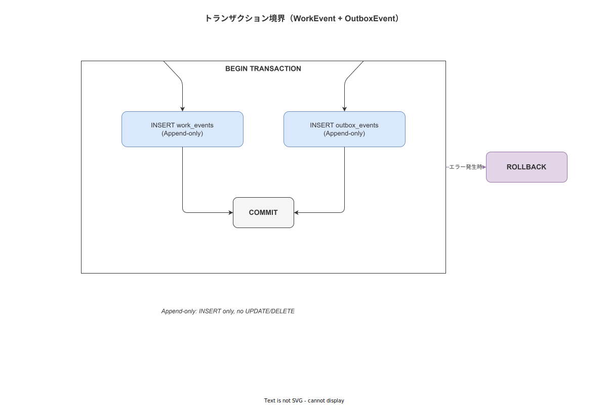

# 03 wnav_db 詳細設計（MOD-BE-004）

本章は `crates/wnav_db/` の sqlx リポジトリ実装・コネクションプール設定・トランザクション境界・Append-only 強制の詳細設計を確定する。本クレートは Infrastructure 層の唯一の実装であり、`wnav_domain` の Repository Trait を実装して依存逆転の原則を達成する。

---

## 1. コネクションプール設定

```rust
// crates/wnav_db/src/pool.rs

use sqlx::{postgres::PgPoolOptions, PgPool};
use std::time::Duration;

/// DB 接続設定。wnav_config クレートが YAML + figment で読み込んだ値を受け取る（ADR-IMPL-001）。
/// DatabaseConfig は src/infra/config/config.base.yml の `database.*` セクションに対応する。
#[derive(Debug, serde::Deserialize, Clone)]
pub struct DbConfig {
    /// 最大コネクション数（config.yml `database.max_connections`、デフォルト 20）
    pub max_connections: u32,
    /// 最小アイドルコネクション数（`database.min_connections`）
    pub min_connections: u32,
    /// コネクション取得タイムアウト秒（`database.acquire_timeout_sec`）
    pub acquire_timeout_secs: u64,
    /// アイドルタイムアウト秒（`database.idle_timeout_sec`）
    pub idle_timeout_secs: u64,
    /// コネクション最大ライフタイム秒（`database.max_lifetime_sec`）
    pub max_lifetime_secs: u64,
}

impl Default for DbConfig {
    fn default() -> Self {
        Self {
            max_connections: 20,
            min_connections: 2,
            acquire_timeout_secs: 10,
            idle_timeout_secs: 600,
            max_lifetime_secs: 3600,
        }
    }
}

/// コネクションプールを生成して返す。
pub async fn connect(database_url: &str, cfg: &DbConfig) -> Result<PgPool, sqlx::Error> {
    PgPoolOptions::new()
        .max_connections(cfg.max_connections)
        .min_connections(cfg.min_connections)
        .acquire_timeout(Duration::from_secs(cfg.acquire_timeout_secs))
        .idle_timeout(Duration::from_secs(cfg.idle_timeout_secs))
        .max_lifetime(Duration::from_secs(cfg.max_lifetime_secs))
        .connect(database_url)
        .await
}
```

---

## 2. PgWorkExecutionRepository（TBL-005）

```rust
// crates/wnav_db/src/repository/work_execution_repo.rs

use async_trait::async_trait;
use chrono::{DateTime, Utc};
use sqlx::{PgPool, postgres::PgQueryResult};
use uuid::Uuid;
use wnav_domain::{
    model::work_execution::{WorkExecution, WorkExecutionStatus},
    repository::{
        WorkExecutionRepository, CreateWorkExecutionCmd, WorkExecutionFilter, Pagination, Page,
    },
    error::DomainError,
};

pub struct PgWorkExecutionRepository {
    pool: PgPool,
}

impl PgWorkExecutionRepository {
    pub fn new(pool: PgPool) -> Self {
        Self { pool }
    }
}

#[async_trait]
impl WorkExecutionRepository for PgWorkExecutionRepository {
    /// (FNC-BE-006) work_executions テーブルから ID 検索する。
    async fn find_by_id(&self, id: Uuid) -> Result<Option<WorkExecution>, DomainError> {
        let row = sqlx::query_as!(
            WorkExecutionRow,
            r#"
            SELECT
                work_execution_id,
                sop_version_id,
                primary_worker_id,
                secondary_worker_id,
                terminal_id,
                production_target_id,
                status AS "status: String",
                current_step_index,
                started_at,
                completed_at,
                updated_at
            FROM work_executions
            WHERE work_execution_id = $1
            "#,
            id
        )
        .fetch_optional(&self.pool)
        .await
        .map_err(DomainError::from)?;

        Ok(row.map(WorkExecution::from))
    }

    async fn list(
        &self,
        filter: WorkExecutionFilter,
        page: Pagination,
    ) -> Result<Page<WorkExecution>, DomainError> {
        let rows = sqlx::query_as!(
            WorkExecutionRow,
            r#"
            SELECT
                work_execution_id,
                sop_version_id,
                primary_worker_id,
                secondary_worker_id,
                terminal_id,
                production_target_id,
                status AS "status: String",
                current_step_index,
                started_at,
                completed_at,
                updated_at
            FROM work_executions
            WHERE
                ($1::uuid IS NULL OR primary_worker_id = $1)
                AND ($2::text IS NULL OR status = $2)
            ORDER BY started_at DESC
            LIMIT $3 OFFSET $4
            "#,
            filter.worker_id,
            filter.status.as_ref().map(|s| s.as_str()),
            page.limit as i64,
            page.offset as i64,
        )
        .fetch_all(&self.pool)
        .await
        .map_err(DomainError::from)?;

        Ok(Page {
            items: rows.into_iter().map(WorkExecution::from).collect(),
        })
    }

    /// (FNC-BE-007) 新規 WorkExecution を INSERT する。
    async fn create(&self, cmd: CreateWorkExecutionCmd) -> Result<WorkExecution, DomainError> {
        let row = sqlx::query_as!(
            WorkExecutionRow,
            r#"
            INSERT INTO work_executions (
                work_execution_id,
                sop_version_id,
                primary_worker_id,
                secondary_worker_id,
                terminal_id,
                production_target_id,
                status,
                current_step_index,
                updated_at
            )
            VALUES ($1, $2, $3, $4, $5, $6, 'NOT_STARTED', 0, NOW())
            RETURNING
                work_execution_id,
                sop_version_id,
                primary_worker_id,
                secondary_worker_id,
                terminal_id,
                production_target_id,
                status AS "status: String",
                current_step_index,
                started_at,
                completed_at,
                updated_at
            "#,
            cmd.work_execution_id,
            cmd.sop_version_id,
            cmd.primary_worker_id,
            cmd.secondary_worker_id,
            cmd.terminal_id,
            cmd.production_target_id,
        )
        .fetch_one(&self.pool)
        .await
        .map_err(DomainError::from)?;

        Ok(WorkExecution::from(row))
    }

    async fn update_status_if_unchanged(
        &self,
        id: Uuid,
        new_status: WorkExecutionStatus,
        expected_updated_at: DateTime<Utc>,
    ) -> Result<u64, DomainError> {
        let result: PgQueryResult = sqlx::query!(
            r#"
            UPDATE work_executions
            SET status = $1, updated_at = NOW()
            WHERE work_execution_id = $2
              AND updated_at = $3
            "#,
            new_status.as_str(),
            id,
            expected_updated_at,
        )
        .execute(&self.pool)
        .await
        .map_err(DomainError::from)?;

        Ok(result.rows_affected())
    }
}
```

---

## 3. トランザクション境界設計

**図 1: トランザクション境界**



> 原本: [`img/fig_dd_be_transaction_boundary.drawio`](img/fig_dd_be_transaction_boundary.drawio)

WorkEvent と OutboxEvent は必ず同一 PostgreSQL トランザクションに含める。この設計により「WorkEvent は記録されたが OutboxEvent が記録されなかった」という非整合状態を排除する。

```rust
// crates/wnav_db/src/transaction.rs

use sqlx::{PgPool, Transaction, Postgres};
use uuid::Uuid;
use chrono::{DateTime, Utc};
use wnav_domain::{model::work_event::WorkEvent, error::DomainError};

/// (FNC-BE-008) WorkEvent + OutboxEvent を同一トランザクションで記録する。
/// ハッシュチェーンの prev_hash 取得も同一 TX 内で行い、並行 INSERT による競合を防ぐ。
pub async fn record_step_completed_tx(
    pool: &PgPool,
    event: WorkEvent,
    idempotency_key: Uuid,
    endpoint: &str,
) -> Result<(), DomainError> {
    let mut tx: Transaction<'_, Postgres> = pool.begin().await.map_err(DomainError::from)?;

    // 1. Idempotency Key を TBL-035 に INSERT（重複なら CONFLICT → 冪等応答）
    let conflict = sqlx::query!(
        r#"
        INSERT INTO idempotency_keys (idempotency_key, endpoint, created_at, expires_at)
        VALUES ($1, $2, NOW(), NOW() + INTERVAL '86400 seconds')
        ON CONFLICT (idempotency_key) DO NOTHING
        "#,
        idempotency_key,
        endpoint,
    )
    .execute(&mut *tx)
    .await
    .map_err(DomainError::from)?;

    if conflict.rows_affected() == 0 {
        // 既存の Idempotency Key → ERR-DB-001
        tx.rollback().await.ok();
        return Err(DomainError::idempotency_replay_conflict(idempotency_key));
    }

    // 2. 前イベントの content_hash を取得（FOR UPDATE でロック）
    let prev_hash: String = sqlx::query_scalar!(
        r#"
        SELECT COALESCE(
            (SELECT content_hash
             FROM work_events
             WHERE case_id = $1
             ORDER BY event_id DESC
             LIMIT 1
             FOR UPDATE),
            $2
        )
        "#,
        event.case_id,
        "0000000000000000000000000000000000000000000000000000000000000000",
    )
    .fetch_one(&mut *tx)
    .await
    .map_err(DomainError::from)?
    .unwrap_or_default();

    // 3. content_hash 計算（wnav_hash_chain に委譲）
    let content_hash = wnav_hash_chain::compute_content_hash_for_event(&event, &prev_hash);

    // 4. WorkEvent INSERT（TBL-001、Append-only）
    sqlx::query!(
        r#"
        INSERT INTO work_events (
            event_id, case_id, activity, step_id,
            timestamp_client, timestamp_server, resource,
            sop_version_id, terminal_id, payload,
            prev_hash, content_hash
        )
        VALUES ($1, $2, $3, $4, $5, NOW(), $6, $7, $8, $9, $10, $11)
        "#,
        event.event_id,
        event.case_id,
        event.activity,
        event.step_id,
        event.timestamp_client,
        event.resource,
        event.sop_version_id,
        event.terminal_id,
        event.payload,
        prev_hash,
        content_hash,
    )
    .execute(&mut *tx)
    .await
    .map_err(DomainError::from)?;

    // 5. OutboxEvent INSERT（TBL-003、MSG-001）
    sqlx::query!(
        r#"
        INSERT INTO outbox_events (
            outbox_id, event_type, event_id, payload,
            status, retry_count, created_at
        )
        VALUES ($1, 'outbox.work_event', $2, $3, 'PENDING', 0, NOW())
        "#,
        Uuid::now_v7(),
        event.event_id,
        serde_json::to_value(&event).map_err(|e| DomainError::serialization(e.to_string()))?,
    )
    .execute(&mut *tx)
    .await
    .map_err(DomainError::from)?;

    tx.commit().await.map_err(DomainError::from)?;
    Ok(())
}
```

---

## 4. Append-only 強制方針

TBL-001（work_events）と TBL-003（outbox_events の履歴）は Append-only テーブルである。以下のルールを本クレート全体に適用する。

| ルール | 内容 |
|---|---|
| UPDATE マクロ禁止 | `sqlx::query!` で work_events に対する UPDATE 文を含むコードは書かない |
| DELETE マクロ禁止 | work_events に対する DELETE 文を含むコードは書かない |
| PostgreSQL Row Level Security | TBL-001 に `app_event_writer` ロール（INSERT のみ許可）を適用（MOD-IN-001）|
| Soft Delete | Append-only テーブルでのキャンセルは「キャンセルイベントの追加」で表現する |

---

## 5. UUID v7 生成方針

UUID v7 はサーバーサイド（Rust）で生成する。DB の DEFAULT 句は使用しない。

```rust
// 正しい使用例
let event_id = uuid::Uuid::now_v7(); // Rust で生成

// 禁止: sqlx::query!() 内の DEFAULT による UUID 生成
// -- uuid_generate_v4() は利用しない（バージョン不整合）
```

UUID v7 はタイムスタンプ単調増加を保証するため、ORDER BY event_id DESC のインデックス効率が高い。

---

**本節で確定した方針**
- **コネクションプール設定（DbConfig）を確定し、CFG-001（max_connections=20）を環境変数から型安全にロードする設計を確定した。**
- **WorkEvent + OutboxEvent の同一トランザクション記録を `record_step_completed_tx` として確定し、Idempotency Key チェック・prev_hash 取得・WorkEvent INSERT・OutboxEvent INSERT の 5 ステップを 1 TX に束ねることを確定した。**
- **Append-only テーブル（work_events）に対する UPDATE/DELETE は本クレートで提供せず、PostgreSQL RLS（app_event_writer ロール）で DB レベルでも強制することを確定した。**

---

## 参照業界分析

### 必須
- [`90_業界分析/09_セキュリティとアクセス制御.md`](../../90_業界分析/09_セキュリティとアクセス制御.md)

### 関連
- [`90_業界分析/06_品質管理とトレーサビリティ.md`](../../90_業界分析/06_品質管理とトレーサビリティ.md)
