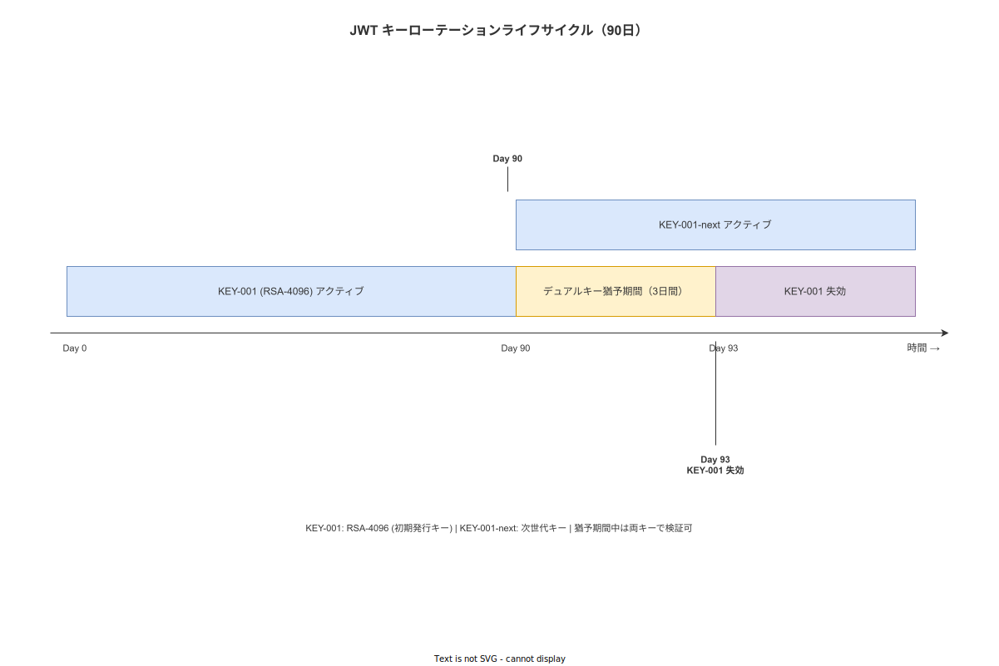
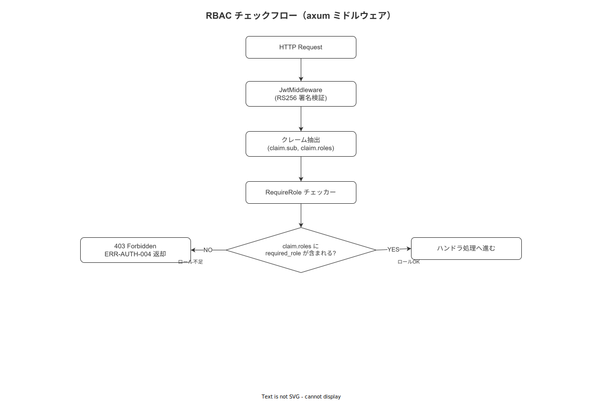

# 04 wnav_auth 詳細設計（MOD-BE-005）

> **配置**: 本クレートは `wnav_terminal_api`（ポート 8080）と `wnav_master_api`（ポート 8081）の**両バイナリで共有される crate** である。
> `aud` クレームによるバイナリ種別判定の詳細は §1-1 を参照。

本章は `crates/wnav_auth/` の JWT RS256 検証・RBAC ミドルウェア・RSA-4096 鍵ロード・90 日鍵ローテーション手順・LDAP/LDAPS BIND 認証・オフライン JWT キャッシュ戦略の詳細設計を確定する。

---

## 1. JWT Claims 構造体

### 1-1. aud クレームによるバイナリ種別判定

`wnav_auth` crate は `wnav_terminal_api` と `wnav_master_api` の両バイナリで共有される。
各バイナリは起動時に `expected_audience` を渡して `JwtKeyStore` を初期化することで、自バイナリ宛て以外のトークンを拒否する。

| バイナリ | ポート | aud クレーム値 | expected_audience |
|---|---|---|---|
| `wnav_terminal_api` | 8080 | `"terminal-api"` | `"terminal-api"` |
| `wnav_master_api` | 8081 | `"master-api"` | `"master-api"` |

- `terminal-api` で発行されたトークンは `wnav_master_api` で検証すると `InvalidAudience` エラーになる。
- `master-api` で発行されたトークンは `wnav_terminal_api` で検証すると同様に拒否される。
- ロール定義（`RoleId`）は共通のため、`require_role!` マクロはそのまま両バイナリで動作する。

### 1-2. /api/v1/auth/login エンドポイントについて

`/api/v1/auth/login` は `wnav_terminal_api`・`wnav_master_api` の**両バイナリに存在する**。
発行されるトークンの `aud` は各バイナリの `expected_audience` と一致した値に設定される。

```rust
// crates/wnav_auth/src/claims.rs

use serde::{Deserialize, Serialize};
use uuid::Uuid;

/// JWT ペイロードの Rust 表現。
/// アルゴリズム: RS256（RSA 4096bit）、KEY-001
/// 有効期限: 8 時間（CFG-005）
#[derive(Debug, Clone, Serialize, Deserialize)]
pub struct JwtClaims {
    /// Subject: user_id（UUID）
    pub sub: Uuid,
    /// Issuer: "wnav.factory.example"
    pub iss: String,
    /// Audience: バイナリ種別を示す文字列（§1-1 の対応表参照）。
    pub aud: String,
    /// Issued At（Unix 秒）
    pub iat: i64,
    /// Expiration（Unix 秒、iat + 28800）
    pub exp: i64,
    /// ロール名リスト（例: ["operator"]）
    pub roles: Vec<String>,
    /// 工場 ID
    pub factory_id: Uuid,
    /// 端末 ID（任意）
    pub device_id: Option<Uuid>,
    /// JWT ID: 失効チェック用の一意識別子（UUID v7）
    pub jti: Uuid,
    /// 鍵 ID（ローテーション識別用。例: "2026-Q2"）
    pub kid: String,
}

/// JWT の発行に使用する入力
#[derive(Debug)]
pub struct JwtIssueCmd {
    pub user_id: Uuid,
    pub roles: Vec<String>,
    pub factory_id: Uuid,
    pub device_id: Option<Uuid>,
    pub kid: String,
    /// 発行先バイナリを示す audience 文字列（§1-1 の対応表参照）。
    pub audience: String,
}
```

---

## 2. RSA-4096 鍵ロードと JWT 検証

**図 1: JWT ライフサイクル**



> 原本: [`img/fig_dd_be_jwt_lifecycle.drawio`](img/fig_dd_be_jwt_lifecycle.drawio)

```rust
// crates/wnav_auth/src/jwt.rs

use jsonwebtoken::{
    decode, encode, Algorithm, DecodingKey, EncodingKey,
    Header, TokenData, Validation,
};
use crate::{claims::JwtClaims, error::AuthError};

/// (FNC-BE-014) JWT を検証し、Claims を返す。
/// 失敗理由: 署名不正・期限切れ・発行者不一致・aud ミスマッチ（§1-1 参照）
///
/// `expected_audience`: 自バイナリの audience 文字列（§1-1 の対応表参照）。
pub fn verify_jwt(
    token: &str,
    public_key_pem: &str,
    expected_audience: &str,
) -> Result<JwtClaims, AuthError> {
    let decoding_key = DecodingKey::from_rsa_pem(public_key_pem.as_bytes())
        .map_err(|_| AuthError::InvalidPublicKey)?;

    let mut validation = Validation::new(Algorithm::RS256);
    validation.set_issuer(&["wnav.factory.example"]);
    validation.set_audience(&[expected_audience]);
    validation.validate_exp = true;

    let token_data: TokenData<JwtClaims> =
        decode(token, &decoding_key, &validation)
            .map_err(|e| match e.kind() {
                jsonwebtoken::errors::ErrorKind::ExpiredSignature => AuthError::JwtExpired,
                jsonwebtoken::errors::ErrorKind::InvalidSignature => AuthError::InvalidSignature,
                jsonwebtoken::errors::ErrorKind::InvalidAudience  => AuthError::InvalidAudience,
                _ => AuthError::InvalidToken(e.to_string()),
            })?;

    Ok(token_data.claims)
}

/// JWT を発行する（ログインハンドラから呼び出し）。
/// 発行するトークンの `aud` は `cmd.audience` で指定する（§1-1 参照）。
pub fn issue_jwt(cmd: JwtIssueCmd, private_key_pem: &str) -> Result<String, AuthError> {
    let encoding_key = EncodingKey::from_rsa_pem(private_key_pem.as_bytes())
        .map_err(|_| AuthError::InvalidPrivateKey)?;

    let now = chrono::Utc::now().timestamp();
    let jti = uuid::Uuid::now_v7();

    let claims = JwtClaims {
        sub: cmd.user_id,
        iss: "wnav.factory.example".to_string(),
        aud: cmd.audience,
        iat: now,
        exp: now + 28800, // 8 時間（CFG-005）
        roles: cmd.roles,
        factory_id: cmd.factory_id,
        device_id: cmd.device_id,
        jti,
        kid: cmd.kid,
    };

    let header = Header {
        alg: Algorithm::RS256,
        kid: Some(claims.kid.clone()),
        ..Default::default()
    };

    encode(&header, &claims, &encoding_key)
        .map_err(|e| AuthError::JwtEncodeError(e.to_string()))
}
```

---

## 3. RBAC ミドルウェア

**図 2: RBAC 権限チェックフロー**



> 原本: [`img/fig_dd_be_rbac_check.drawio`](img/fig_dd_be_rbac_check.drawio)

```rust
// crates/wnav_auth/src/rbac.rs

use axum::{
    extract::FromRequestParts,
    http::request::Parts,
    response::IntoResponse,
};
use crate::CurrentUser;
use wnav_domain::model::user::RoleId;

/// ロール要件をルート単位で宣言するための Extractor。
/// 使用例: `async fn handler(RequireRole(vec![RoleId::QualityAdmin]): RequireRole)`
pub struct RequireRole(pub Vec<RoleId>);

#[async_trait::async_trait]
impl<S> FromRequestParts<S> for RequireRole
where
    S: Send + Sync,
{
    type Rejection = crate::error::AuthError;

    async fn from_request_parts(
        parts: &mut Parts,
        _state: &S,
    ) -> Result<Self, Self::Rejection> {
        let current_user = parts
            .extensions
            .get::<CurrentUser>()
            .ok_or(crate::error::AuthError::Unauthorized)?;

        Ok(RequireRole(
            current_user.roles.iter()
                .filter_map(|r| RoleId::from_str(r).ok())
                .collect()
        ))
    }
}

/// (FNC-BE-015) ユーザーが要求ロールを少なくとも 1 つ持つか評価する。
pub fn evaluate_roles(
    current_roles: &[RoleId],
    required_roles: &[RoleId],
) -> bool {
    required_roles.iter().any(|req| current_roles.contains(req))
}

/// ロール階層（上位ロールは下位ロールの全権限を包含する）
/// SystemAdmin > QualityAdmin > Supervisor > Operator
pub fn effective_roles(role: &RoleId) -> Vec<RoleId> {
    match role {
        RoleId::SystemAdmin => vec![
            RoleId::SystemAdmin, RoleId::QualityAdmin,
            RoleId::MasterAdmin, RoleId::Supervisor,
            RoleId::Operator, RoleId::Executive,
        ],
        RoleId::QualityAdmin => vec![
            RoleId::QualityAdmin, RoleId::Supervisor, RoleId::Operator,
        ],
        RoleId::MasterAdmin => vec![
            RoleId::MasterAdmin, RoleId::Supervisor, RoleId::Operator,
        ],
        RoleId::Supervisor => vec![
            RoleId::Supervisor, RoleId::Operator,
        ],
        RoleId::Operator => vec![RoleId::Operator],
        RoleId::Executive => vec![RoleId::Executive],
    }
}
```

```rust
// crates/wnav_auth/src/current_user.rs

use uuid::Uuid;

/// AuthMiddleware が JWT 検証後に Request Extension に追加するユーザー情報。
/// 全ハンドラから `Extension<CurrentUser>` で取得可能。
#[derive(Debug, Clone)]
pub struct CurrentUser {
    pub user_id: Uuid,
    pub roles: Vec<String>,
    pub factory_id: Uuid,
    pub device_id: Option<Uuid>,
}
```

---

## 4. LDAP/LDAPS BIND 認証（IF-003）

```rust
// crates/wnav_auth/src/ldap.rs

use ldap3::{LdapConnAsync, Scope, SearchEntry};

/// LDAP 認証設定
#[derive(Debug, Clone, serde::Deserialize)]
pub struct LdapConfig {
    /// LDAP サーバー URL（ldap:// または ldaps://）
    pub url: String,
    /// ベース DN（例: "dc=factory,dc=example,dc=com"）
    pub base_dn: String,
    /// ユーザー検索フィルタ（例: "(uid={login_id})"）
    pub user_filter_template: String,
    /// 接続タイムアウト秒
    pub timeout_secs: u64,
}

/// LDAP BIND でユーザー認証を試みる。
/// 成功時は true、失敗時は false を返す。
/// LDAP 接続自体が失敗した場合は Err を返す（ローカル認証フォールバック用）。
pub async fn ldap_bind_auth(
    config: &LdapConfig,
    login_id: &str,
    password: &str,
) -> Result<bool, LdapAuthError> {
    let (conn, mut ldap) = LdapConnAsync::new(&config.url)
        .await
        .map_err(LdapAuthError::ConnectionFailed)?;
    ldap3::drive!(conn);

    // 1. LDAP でユーザー DN を検索
    let filter = config.user_filter_template.replace("{login_id}", login_id);
    let (entries, _) = ldap
        .search(&config.base_dn, Scope::Subtree, &filter, vec!["dn"])
        .await
        .map_err(LdapAuthError::SearchFailed)?
        .success()
        .map_err(LdapAuthError::SearchFailed)?;

    let entry = entries
        .into_iter()
        .next()
        .map(SearchEntry::construct)
        .ok_or(LdapAuthError::UserNotFound)?;

    let user_dn = entry.dn;

    // 2. ユーザー DN で BIND（パスワード検証）
    let result = ldap
        .simple_bind(&user_dn, password)
        .await
        .map_err(LdapAuthError::BindFailed)?;

    Ok(result.rc == 0)
}

#[derive(Debug, thiserror::Error)]
pub enum LdapAuthError {
    #[error("LDAP connection failed: {0}")]
    ConnectionFailed(ldap3::LdapError),
    #[error("LDAP search failed: {0}")]
    SearchFailed(ldap3::LdapError),
    #[error("LDAP bind failed: {0}")]
    BindFailed(ldap3::LdapError),
    #[error("User not found in LDAP")]
    UserNotFound,
}
```

---

## 5. ローカル認証フォールバック

```rust
// crates/wnav_auth/src/local_auth.rs

use bcrypt::verify;
use wnav_domain::model::user::User;

/// LDAP 不可時のローカル認証（BR-BUS: LDAP フォールバック）
/// TBL-016 users の password_hash（bcrypt）と照合する。
pub fn verify_local_password(user: &User, password: &str) -> bool {
    verify(password, &user.password_hash).unwrap_or(false)
}
```

---

## 6. 90 日鍵ローテーション手順

### 6-1. デュアルキー並行稼働方式

90 日ごとに RSA-4096 鍵ペアを新しく生成し、24 時間の grace period 中は旧鍵・新鍵の両方で JWT を検証できる。

| フェーズ | 期間 | 鍵の状態 |
|---|---|---|
| 通常運用 | 0〜89 日目 | current キー（kid: 例 "2026-Q2"）のみ有効 |
| ローテーション開始（BAT-010）| 90 日目 | next キー（kid: "2026-Q3"）を公開鍵ストアに追加 |
| Grace Period | 90〜91 日目 | current + next の両方で検証可能 |
| 旧鍵無効化 | 91 日目 | current キー（"2026-Q2"）を公開鍵ストアから削除 |

```rust
// crates/wnav_auth/src/key_store.rs

use std::collections::HashMap;
use tokio::sync::RwLock;

/// JWT 公開鍵ストア。kid をキーに DecodingKey を管理する。
/// Grace Period 中は 2 つのキーが格納される。
pub struct JwtKeyStore {
    keys: RwLock<HashMap<String, String>>, // kid → PEM
}

impl JwtKeyStore {
    pub fn new() -> Self {
        Self {
            keys: RwLock::new(HashMap::new()),
        }
    }

    pub async fn add_key(&self, kid: String, public_key_pem: String) {
        self.keys.write().await.insert(kid, public_key_pem);
    }

    pub async fn remove_key(&self, kid: &str) {
        self.keys.write().await.remove(kid);
    }

    /// JWT ヘッダの kid で鍵を検索して検証する。
    /// `expected_audience` は自バイナリの audience 文字列（§1-1 の対応表参照）。
    pub async fn verify(
        &self,
        token: &str,
        expected_audience: &str,
    ) -> Result<crate::claims::JwtClaims, crate::error::AuthError> {
        let header = jsonwebtoken::decode_header(token)
            .map_err(|_| crate::error::AuthError::InvalidToken("invalid header".to_string()))?;

        let kid = header.kid.ok_or(crate::error::AuthError::MissingKid)?;
        let keys = self.keys.read().await;
        let pem = keys.get(&kid).ok_or(crate::error::AuthError::UnknownKid(kid))?;

        crate::jwt::verify_jwt(token, pem, expected_audience)
    }
}
```

---

## 7. オフライン JWT キャッシュ戦略

ハンディ APP はオフライン時にも認証状態を維持するため、最後に検証済みの JWT と CurrentUser 情報を端末ローカル（SQLite、TBL-SQ-008 相当）にキャッシュする。

| 項目 | 設定 |
|---|---|
| キャッシュ対象 | JWT 文字列・CurrentUser（roles・factory_id）|
| キャッシュ有効期間 | JWT の exp と同一（8 時間）|
| ネットワーク復帰時 | 新しい JWT を取得してキャッシュを更新 |
| キャッシュ失効時 | 操作は続行可能（Offline-First）。次回ネットワーク接続時に再認証を促す |

サーバーサイドでは、オフライン期間中は JWT ブラックリスト確認をスキップする。

---

**本節で確定した方針**
- **JWT RS256（RSA-4096 bit）・8 時間 TTL・JwtClaims 全フィールドを確定し、`jsonwebtoken` crate で検証する実装を確定した。**
- **aud クレームによりバイナリ種別を判定する設計を確定した。`terminal-api` 宛てトークンは `wnav_master_api` で拒否され、`master-api` 宛てトークンは `wnav_terminal_api` で拒否される。**
- **RBAC は RequireRole Extractor + evaluate_roles で実装し、ロール階層（SystemAdmin が全権限包含）を effective_roles 関数で表現することを確定した。ロール定義は両バイナリで共通のため、`require_role!` マクロはそのまま両バイナリで動作する。**
- **90 日鍵ローテーションはデュアルキー並行稼働（24h grace period）で安全に行い、JwtKeyStore の RwLock で複数鍵の並行検証を提供することを確定した。**

---

## 参照業界分析

### 必須
- [`90_業界分析/09_セキュリティとアクセス制御.md`](../../90_業界分析/09_セキュリティとアクセス制御.md)

### 関連
- [`90_業界分析/06_品質管理とトレーサビリティ.md`](../../90_業界分析/06_品質管理とトレーサビリティ.md)
