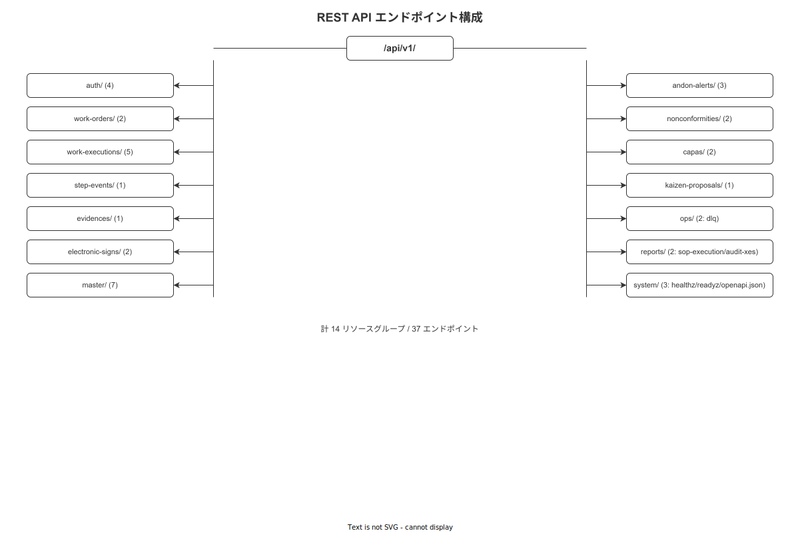

# 01 OpenAPI 共通仕様と設計原則

本章は全 39 エンドポイントに共通して適用される OpenAPI 3.1 規約を確定する。Base URL・Content-Type・認証ヘッダ・冪等性・レスポンスエンベロープ・エラー形式・ページング・レート制限の各仕様をコーディングで直接参照できる精度で記述する。

---

## 1. Base URL と Content-Type

### 1-1. Base URL

```
https://wnav-server.factory.local/api/v1
```

| 環境 | Base URL |
|---|---|
| 本番（工場内 LAN）| `https://wnav-server.factory.local/api/v1` |
| ステージング | `https://wnav-staging.factory.local/api/v1` |
| ローカル開発 | `http://localhost:8080/api/v1` |

TLS は KEY-007（RSA/ECDSA 2048+ / 13 ヶ月更新）で保護する。HTTP（非 TLS）は本番・ステージングで受け付けない。

### 1-2. Content-Type

| 用途 | Content-Type |
|---|---|
| 通常 API リクエスト / レスポンス | `application/json` |
| ファイルアップロード（evidences）| `multipart/form-data` |
| エラーレスポンス（RFC 9457）| `application/problem+json` |
| OpenAPI 仕様取得 | `application/json` |

---

## 2. 共通リクエストヘッダ

全エンドポイントに適用される必須・任意ヘッダを定義する。

| ヘッダ名 | 必須 / 任意 | 値の形式 | 適用対象 | 説明 |
|---|---|---|---|---|
| `Authorization` | 必須（認証不要 EP を除く）| `Bearer {JWT}` | 全認証要 EP | JWT RS256 トークン（KEY-001）|
| `Content-Type` | 必須（ボディがある場合）| 上記 1-2 参照 | POST / PATCH / PUT | — |
| `Idempotency-Key` | 必須 | UUID v7 形式 | 全 POST / PATCH | 重複リクエスト防止（TBL-035）|
| `Accept` | 任意 | `application/json` | 全 EP | 省略時 `application/json` とみなす |
| `Accept-Language` | 任意 | `ja` / `en` | 全 EP | エラー detail の言語切替 |

### 2-1. Idempotency-Key 詳細

```http
POST /api/v1/work-executions
Content-Type: application/json
Authorization: Bearer eyJhbGci...
Idempotency-Key: 019682ab-7c1f-7000-a1b2-3c4d5e6f7890

{
  "work_order_id": "019682ab-7c1f-7000-0000-000000000001",
  "operator_id": "019682ab-7c1f-7000-0000-000000000002"
}
```

- UUID v7 形式（時刻ソート可能）。クライアントが生成する。
- 同じ Idempotency-Key で同じ Body → 前回レスポンスをキャッシュから返却（DB 再書き込みなし）。
- 同じ Idempotency-Key で異なる Body → ERR-DB-001（idempotency_replay_conflict）、HTTP 409。
- キャッシュ保持期間: 24 時間（CFG で変更可）。
- GET・DELETE（使用禁止）には Idempotency-Key を送付しない。

---

## 3. レスポンスエンベロープ

### 3-1. 成功レスポンス

```json
{
  "data": {
    "id": "019682ab-7c1f-7000-a1b2-3c4d5e6f7890",
    "status": "in_progress",
    "...": "..."
  },
  "meta": {
    "request_id": "019682ab-7c1f-7001-a1b2-3c4d5e6f7890",
    "server_time": "2026-05-17T10:30:00.000Z",
    "api_version": "v1"
  }
}
```

| フィールド | 型 | 必須 | 説明 |
|---|---|---|---|
| `data` | object / array | 必須 | エンドポイント固有のペイロード |
| `meta.request_id` | string (UUID v7) | 必須 | サーバーが採番したリクエスト追跡 ID |
| `meta.server_time` | string (ISO 8601 UTC) | 必須 | サーバー処理完了時刻 |
| `meta.api_version` | string | 必須 | 常に `"v1"` |

一覧取得（GET コレクション）の場合は `meta` にページング情報を追加する（§ 5 参照）。

HTTP 204 No Content を返すエンドポイント（logout 等）はボディを返さない。

### 3-2. エラーレスポンス（RFC 9457 Problem Details）

```json
{
  "type": "https://errors.wnav.example.com/ERR-BIZ-001",
  "title": "lock_step_violation",
  "status": 409,
  "detail": "直前のステップが完了していません。ステップ番号 3 を完了してください。",
  "instance": "/api/v1/work-executions/019682ab-7c1f-7000-a1b2-3c4d5e6f7890/events",
  "error_id": "ERR-BIZ-001"
}
```

Content-Type: `application/problem+json`（RFC 9457 準拠）

| フィールド | 型 | 説明 |
|---|---|---|
| `type` | URI | エラーコード別ドキュメント URI |
| `title` | string | エラー名（機械可読キー）|
| `status` | integer | HTTP ステータスコード |
| `detail` | string | 人間可読の説明（i18n 対応）|
| `instance` | URI | エラーが発生したリクエストの URI |
| `error_id` | string | ERR-NNN 識別子 |

バリデーションエラー（ERR-VAL-*）では `violations` 配列を追加する。

```json
{
  "type": "https://errors.wnav.example.com/ERR-VAL-001",
  "title": "required_field_missing",
  "status": 422,
  "detail": "必須フィールドが不足しています。",
  "instance": "/api/v1/work-executions",
  "error_id": "ERR-VAL-001",
  "violations": [
    {
      "field": "work_order_id",
      "message": "work_order_id は必須です。"
    }
  ]
}
```

---

## 4. ページング

### 4-1. クエリパラメータ

一覧取得エンドポイント（GET コレクション）は以下のクエリパラメータでページングを制御する。

| パラメータ | 型 | デフォルト | 最大値 | 説明 |
|---|---|---|---|---|
| `page` | integer | 1 | — | 取得するページ番号（1 始まり）|
| `per_page` | integer | 50 | 200 | 1 ページあたりの件数 |

### 4-2. ページングメタ

```json
{
  "data": [...],
  "meta": {
    "request_id": "019682ab-7c1f-7001-a1b2-3c4d5e6f7890",
    "server_time": "2026-05-17T10:30:00.000Z",
    "api_version": "v1",
    "total": 142,
    "page": 2,
    "per_page": 50,
    "total_pages": 3
  }
}
```

| フィールド | 型 | 説明 |
|---|---|---|
| `meta.total` | integer | フィルタ後の全件数 |
| `meta.page` | integer | 現在のページ番号 |
| `meta.per_page` | integer | 1 ページあたりの件数 |
| `meta.total_pages` | integer | 総ページ数（`ceil(total / per_page)`）|

---

## 5. バージョニング

### 5-1. URL バージョニング

`/api/v{major}/` で major バージョンのみ URL に含める。現在のバージョンは `v1`。

Breaking Change（フィールド削除・HTTP メソッド変更・URL 構造変更）が発生した場合のみ `v2` に移行する。旧バージョンは最低 6 ヶ月の deprecated 期間後に削除する。

非 Breaking Change（フィールド追加・バグ修正・パフォーマンス改善）は `v1` のまま対応する。

---

## 6. レート制限ヘッダ

### 6-1. レスポンスヘッダ

全レスポンスにレート制限情報を付与する。

| ヘッダ名 | 型 | 説明 |
|---|---|---|
| `X-RateLimit-Limit` | integer | 時間窓あたりの上限リクエスト数 |
| `X-RateLimit-Remaining` | integer | 現在の時間窓で残余のリクエスト数 |
| `X-RateLimit-Reset` | integer | レート制限リセット時刻（Unix timestamp）|

```http
HTTP/1.1 200 OK
Content-Type: application/json
X-RateLimit-Limit: 1000
X-RateLimit-Remaining: 873
X-RateLimit-Reset: 1747475460
```

### 6-2. カテゴリ別上限

rate_limit_key = `{factory_id}:{endpoint_category}` で計算する。

| カテゴリ | 上限 | 時間窓 |
|---|---|---|
| 読み取り（GET）| 1000 req | 60 秒 |
| 書き込み（POST / PATCH）| 500 req | 60 秒 |
| 認証（POST /auth/*）| 10 req | 60 秒 |
| 同期（GET / POST /sync/*）| 60 req | 60 秒 |

上限超過時: ERR-SYS-002（HTTP 429）+ `Retry-After: {seconds}` ヘッダ。

---

## 7. utoipa による OpenAPI 3.1 自動生成

**図 1: OpenAPI 仕様構造（utoipa 自動生成・エンドポイント/スキーマ/セキュリティ構成）**



> 原本: [`img/fig_dd_api_openapi_structure.drawio`](img/fig_dd_api_openapi_structure.drawio)

Rust バックエンドは `utoipa` crate（Apache 2.0）を使用して OpenAPI 3.1 仕様を自動生成する。全エンドポイントのハンドラ関数に `#[utoipa::path(...)]` を付与し、`GET /api/v1/openapi.json`（API-system-003）でクライアントに配信する。

```rust
#[utoipa::path(
    post,
    path = "/api/v1/work-executions/{id}/events",
    operation_id = "postStepEvent",
    params(
        ("id" = Uuid, Path, description = "作業実行 ID")
    ),
    request_body = PostStepEventRequest,
    responses(
        (status = 201, description = "イベント記録成功", body = StepEventResponse),
        (status = 409, description = "ステップ順序違反", body = ProblemDetails),
        (status = 422, description = "バリデーションエラー", body = ProblemDetails),
    ),
    security(("bearer_auth" = [])),
    tag = "step-events",
)]
pub async fn post_step_event(
    State(app_state): State<AppState>,
    Path(id): Path<Uuid>,
    TypedHeader(auth): TypedHeader<Authorization<Bearer>>,
    TypedHeader(idempotency_key): TypedHeader<IdempotencyKey>,
    Json(body): Json<PostStepEventRequest>,
) -> Result<(StatusCode, Json<StepEventResponse>), AppError> { ... }
```

フロントエンドは `openapi-typescript-codegen` で TypeScript クライアントを自動生成する。

---

**本節で確定した方針**
- **Base URL `https://wnav-server.factory.local/api/v1`・Content-Type `application/json`・Idempotency-Key ヘッダ（全 POST/PATCH 必須）・RFC 9457 エラーエンベロープ・ページング仕様を全 API の共通規約として確定した。**
- **レート制限は `{factory_id}:{endpoint_category}` キーのトークンバケット方式とし、`X-RateLimit-*` ヘッダを全レスポンスに付与することを確定した。**
- **utoipa による OpenAPI 3.1 自動生成を全エンドポイントの実装義務とし、GET /api/v1/openapi.json での配信を確定した。**

---

## 参照業界分析

### 必須
- [`90_業界分析/09_セキュリティとアクセス制御.md`](../../../90_業界分析/09_セキュリティとアクセス制御.md)

### 関連
- [`90_業界分析/06_品質管理とトレーサビリティ.md`](../../../90_業界分析/06_品質管理とトレーサビリティ.md)
