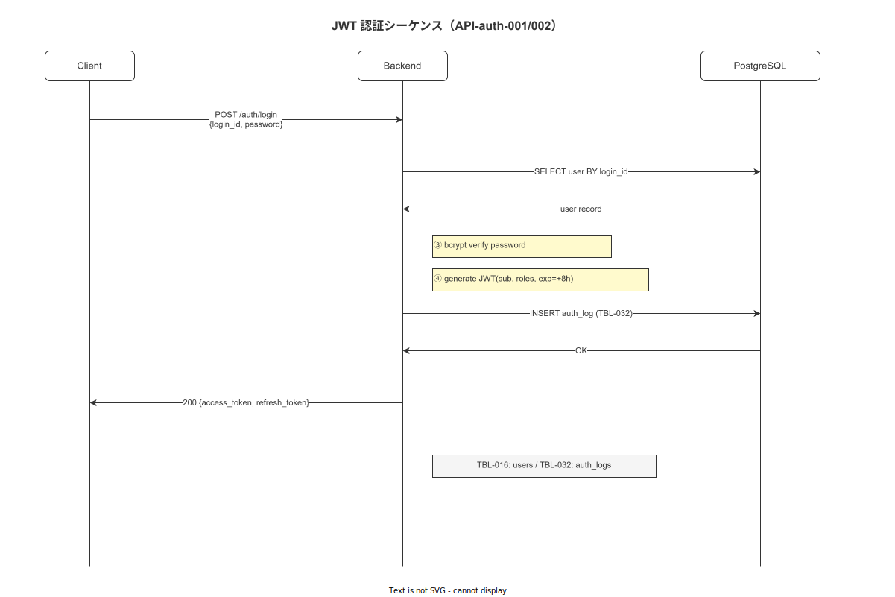

# 02 認証・認可 API 仕様

本章は API-auth-001〜004（login / refresh / logout / keys）の全フィールド・型・制約・エラーコード・RBAC 要件・冪等性挙動をコーディング直前精度で確定する。JWT RS256・LDAP フォールバック・ブルートフォース防止の全挙動を網羅する。

> **担当バイナリ方針**: `/api/v1/auth/login`・`/api/v1/auth/refresh`・`/api/v1/auth/logout` は **terminal-api と master-api の両バイナリに存在する**。terminal-api の `/auth/login` は `aud: "terminal-api"` を含む JWT を返し、master-api の `/auth/login` は `aud: "master-api"` を含む JWT を返す。鍵ローテーション（`/auth/keys/rotate`）は管理操作であるため **master-api のみ** に存在する。

---

## 1. API-auth-001: POST /api/v1/auth/login

### 1-1. 概要

| 項目 | 値 |
|---|---|
| API-ID | API-auth-001 |
| HTTP メソッド | POST |
| URL | `/api/v1/auth/login` |
| 担当バイナリ | terminal-api + master-api（両方） |
| 認証要否 | 不要（認証前エンドポイント）|
| Idempotency-Key | 必須 |
| レート制限カテゴリ | 認証（10 req / 60s）|
| 関連 FR | FR-AU-001 |

### 1-2. リクエストスキーマ

```json
{
  "login_id": "operator01",
  "password": "P@ssw0rd!",
  "device_id": "019682ab-7c1f-7000-0000-000000000010",
  "factory_id": "019682ab-7c1f-7000-0000-000000000001"
}
```

| フィールド | 型 | 必須 | 制約 | 説明 |
|---|---|---|---|---|
| `login_id` | string | 必須 | 1〜64 文字、英数字・アンダースコア・ハイフン | LDAP uid / ローカルユーザー名 |
| `password` | string | 必須 | 8〜128 文字 | プレーンテキスト（TLS 上での送信のみ許可）|
| `device_id` | string (UUID v7) | 必須 | UUID v7 形式 | ハンディ端末 ID（TBL-033）|
| `factory_id` | string (UUID v7) | 必須 | UUID v7 形式 | 工場 ID |

### 1-3. レスポンススキーマ（HTTP 200）

```json
{
  "data": {
    "access_token": "eyJhbGciOiJSUzI1NiIsInR5cCI6IkpXVCIsImtpZCI6IjIwMjYtUTIifQ...",
    "refresh_token": "019682ab-7c1f-7002-a1b2-3c4d5e6f7890",
    "token_type": "Bearer",
    "expires_in": 28800,
    "refresh_expires_in": 604800,
    "roles": ["operator"],
    "user_id": "019682ab-7c1f-7000-0000-000000000002",
    "factory_id": "019682ab-7c1f-7000-0000-000000000001"
  },
  "meta": {
    "request_id": "019682ab-7c1f-7003-a1b2-3c4d5e6f7890",
    "server_time": "2026-05-17T10:30:00.000Z",
    "api_version": "v1"
  }
}
```

| フィールド | 型 | 説明 |
|---|---|---|
| `data.access_token` | string (JWT) | RS256 署名済み JWT（有効期限 8 時間 / CFG-005）。terminal-api が発行した JWT には `aud: "terminal-api"` が含まれ、master-api が発行した JWT には `aud: "master-api"` が含まれる。 |
| `data.refresh_token` | string (UUID v7) | リフレッシュトークン（有効期限 7 日）|
| `data.token_type` | string | 常に `"Bearer"` |
| `data.expires_in` | integer | アクセストークン有効秒数（28800 = 8h）|
| `data.refresh_expires_in` | integer | リフレッシュトークン有効秒数（604800 = 7d）|
| `data.roles` | array of string | ログインユーザーの RBAC ロール一覧 |
| `data.user_id` | string (UUID v7) | ログインユーザーの ID（TBL-016）|
| `data.factory_id` | string (UUID v7) | 認証された工場 ID |

### 1-4. 認証フロー詳細

**図 1: 認証シーケンス（JWT RS256・LDAPフォールバック・ブルートフォース防止）**



> 原本: [`img/fig_dd_api_auth_sequence.drawio`](img/fig_dd_api_auth_sequence.drawio)

1. TBL-016 users で `login_id` の存在確認。存在しない場合: ERR-AUTH-001（401）。
2. `failed_login_count >= 5` かつ `locked_until > NOW()`: ERR-AUTH-003（423）。
3. LDAP（IF-003）で BIND 認証を試みる。
4. LDAP 接続不可（ERR-EXT-002）: TBL-016 の `password_hash`（bcrypt）でローカル認証にフォールバック。
5. パスワード検証失敗: `failed_login_count` を +1。5 回失敗でアカウントロック（30 分）。ERR-AUTH-002（401）。
6. 認証成功: JWT を発行し `failed_login_count` をリセット。TBL-032 に LOG-003 を記録。
7. 認証失敗: TBL-032 に LOG-004 を記録。

### 1-5. RBAC 要件

認証不要エンドポイント。全ロールがアクセス可能。

### 1-6. 冪等性挙動

同じ `Idempotency-Key` で再送された場合、前回発行した `access_token` / `refresh_token` をそのまま返す。前回トークンが既に失効していた場合でも同じ応答を返す（クライアントは新規ログインを行うこと）。

### 1-7. エラーコード

| ERR-CODE | HTTP | 発生条件 |
|---|---|---|
| ERR-AUTH-001 | 401 | login_id が存在しない、またはパスワード不一致 |
| ERR-AUTH-002 | 401 | PIN 検証失敗（パスワード不一致）|
| ERR-AUTH-003 | 423 | アカウントロック中 |
| ERR-VAL-001 | 422 | 必須フィールド不足 |
| ERR-VAL-003 | 422 | login_id / device_id / factory_id の形式不正 |
| ERR-VAL-004 | 422 | password が 128 文字超 |
| ERR-EXT-002 | 503 | LDAP 完全不可かつローカル認証も失敗 |

---

## 2. API-auth-002: POST /api/v1/auth/refresh

### 2-1. 概要

| 項目 | 値 |
|---|---|
| API-ID | API-auth-002 |
| HTTP メソッド | POST |
| URL | `/api/v1/auth/refresh` |
| 担当バイナリ | terminal-api + master-api（両方） |
| 認証要否 | 不要（refresh_token を本体で送付）|
| Idempotency-Key | 必須 |
| レート制限カテゴリ | 認証（10 req / 60s）|
| 関連 FR | FR-AU-005 |

### 2-2. リクエストスキーマ

```json
{
  "refresh_token": "019682ab-7c1f-7002-a1b2-3c4d5e6f7890"
}
```

| フィールド | 型 | 必須 | 制約 | 説明 |
|---|---|---|---|---|
| `refresh_token` | string (UUID v7) | 必須 | UUID v7 形式 | API-auth-001 で発行されたリフレッシュトークン |

### 2-3. レスポンススキーマ（HTTP 200）

```json
{
  "data": {
    "access_token": "eyJhbGciOiJSUzI1NiIsInR5cCI6IkpXVCIsImtpZCI6IjIwMjYtUTIifQ...",
    "token_type": "Bearer",
    "expires_in": 28800
  },
  "meta": {
    "request_id": "019682ab-7c1f-7004-a1b2-3c4d5e6f7890",
    "server_time": "2026-05-17T18:30:00.000Z",
    "api_version": "v1"
  }
}
```

| フィールド | 型 | 説明 |
|---|---|---|
| `data.access_token` | string (JWT) | 新規発行 JWT（有効期限 8 時間）|
| `data.token_type` | string | 常に `"Bearer"` |
| `data.expires_in` | integer | アクセストークン有効秒数（28800）|

### 2-4. エラーコード

| ERR-CODE | HTTP | 発生条件 |
|---|---|---|
| ERR-AUTH-001 | 401 | refresh_token が存在しない、または失効済み |
| ERR-AUTH-003 | 423 | アカウントロック中（refresh 中にロックが入った場合）|
| ERR-VAL-001 | 422 | refresh_token フィールド不足 |
| ERR-VAL-003 | 422 | UUID v7 形式不正 |

---

## 3. API-auth-003: POST /api/v1/auth/logout

### 3-1. 概要

| 項目 | 値 |
|---|---|
| API-ID | API-auth-003 |
| HTTP メソッド | POST |
| URL | `/api/v1/auth/logout` |
| 担当バイナリ | terminal-api + master-api（両方） |
| 認証要否 | 必須（Authorization: Bearer {JWT}）|
| Idempotency-Key | 必須 |
| レート制限カテゴリ | 認証（10 req / 60s）|
| 関連 FR | FR-AU-005 |

### 3-2. リクエストスキーマ

```http
POST /api/v1/auth/logout
Authorization: Bearer eyJhbGci...
Idempotency-Key: 019682ab-7c1f-7005-a1b2-3c4d5e6f7890
Content-Type: application/json

{}
```

ボディは空オブジェクト `{}` を送付する。ログアウト対象トークンは `Authorization` ヘッダから取得する。

### 3-3. レスポンス

HTTP 204 No Content（ボディなし）。

### 3-4. ログアウト処理詳細

1. JWT を検証（署名・有効期限）。
2. JWT の `jti`（JWT ID）を TBL-032 のログアウトレコードに記録する（ブラックリスト相当）。
3. 以降は同 JWT でのリクエストを ERR-AUTH-001 として拒否する。
4. 関連する refresh_token を無効化する。

### 3-5. RBAC 要件

全ロール（自分自身のトークンのみログアウト可能）。

### 3-6. エラーコード

| ERR-CODE | HTTP | 発生条件 |
|---|---|---|
| ERR-AUTH-001 | 401 | Authorization ヘッダ不足、JWT 不正または既失効 |

---

## 4. API-auth-004: POST /api/v1/auth/keys/rotate

### 4-1. 概要

採番台帳の API-auth-004 は `POST /api/v1/auth/keys/rotate`（FR-AU-006: JWT 署名鍵ローテーション）である。指示書の `GET /api/v1/auth/keys`（JWKS 公開鍵取得）は採番台帳に存在しないため、本章では採番台帳の正式エンドポイントを仕様化し、JWKS 取得は補足として記述する。

| 項目 | 値 |
|---|---|
| API-ID | API-auth-004 |
| HTTP メソッド | POST |
| URL | `/api/v1/auth/keys/rotate` |
| 担当バイナリ | master-api（管理操作であるため terminal-api には存在しない）|
| 認証要否 | 必須（system_admin ロール専用）|
| Idempotency-Key | 必須 |
| レート制限カテゴリ | 認証（10 req / 60s）|
| 関連 FR | FR-AU-006 |

### 4-2. リクエストスキーマ

```json
{
  "reason": "scheduled_rotation",
  "grace_period_hours": 24
}
```

| フィールド | 型 | 必須 | 制約 | 説明 |
|---|---|---|---|---|
| `reason` | string | 必須 | 1〜128 文字 | ローテーション理由（`scheduled_rotation` / `emergency` / `compromise_suspected`）|
| `grace_period_hours` | integer | 任意 | 1〜168（デフォルト 24）| 旧鍵の並行稼働期間（CFG-006）|

### 4-3. レスポンススキーマ（HTTP 200）

```json
{
  "data": {
    "new_kid": "2026-Q3",
    "old_kid": "2026-Q2",
    "rotation_at": "2026-05-17T10:30:00.000Z",
    "old_key_expires_at": "2026-05-18T10:30:00.000Z"
  },
  "meta": {
    "request_id": "019682ab-7c1f-7006-a1b2-3c4d5e6f7890",
    "server_time": "2026-05-17T10:30:00.000Z",
    "api_version": "v1"
  }
}
```

| フィールド | 型 | 説明 |
|---|---|---|
| `data.new_kid` | string | 新鍵の kid |
| `data.old_kid` | string | 旧鍵の kid（grace_period_hours 後に無効化）|
| `data.rotation_at` | string (ISO 8601) | 鍵ローテーション実行時刻 |
| `data.old_key_expires_at` | string (ISO 8601) | 旧鍵無効化予定時刻 |

### 4-4. RBAC 要件

`system_admin` ロールのみ実行可能。

### 4-5. JWKS 公開鍵取得（補足仕様）

クライアントが JWT 署名検証のために公開鍵を取得するエンドポイント。採番台帳未収録のため補足として定義する。

```
GET /api/v1/auth/jwks
```

レスポンス例:

```json
{
  "keys": [
    {
      "kty": "RSA",
      "use": "sig",
      "kid": "2026-Q2",
      "alg": "RS256",
      "n": "sKr...",
      "e": "AQAB"
    },
    {
      "kty": "RSA",
      "use": "sig",
      "kid": "2026-Q3",
      "alg": "RS256",
      "n": "tLs...",
      "e": "AQAB"
    }
  ]
}
```

grace period 中は旧鍵・新鍵の両方を返す。認証不要・キャッシュ可（`Cache-Control: public, max-age=3600`）。

### 4-6. エラーコード

| ERR-CODE | HTTP | 発生条件 |
|---|---|---|
| ERR-AUTH-004 | 403 | system_admin 以外がアクセス |
| ERR-VAL-001 | 422 | reason フィールド不足 |
| ERR-VAL-002 | 422 | grace_period_hours が範囲外（1〜168）|

---

## 5. RBAC 認可マトリクス（auth 系）

| API-ID | operator | supervisor | master_admin | quality_admin | system_admin | executive |
|---|---|---|---|---|---|---|
| API-auth-001 login | ✅ | ✅ | ✅ | ✅ | ✅ | ✅ |
| API-auth-002 refresh | ✅ | ✅ | ✅ | ✅ | ✅ | ✅ |
| API-auth-003 logout | ✅ | ✅ | ✅ | ✅ | ✅ | ✅ |
| API-auth-004 keys/rotate | — | — | — | — | ✅ | — |

---

**本節で確定した方針**
- **`/api/v1/auth/login`・`/api/v1/auth/refresh`・`/api/v1/auth/logout` は terminal-api と master-api の両バイナリに存在する。terminal-api が発行する JWT には `aud: "terminal-api"` が含まれ、master-api が発行する JWT には `aud: "master-api"` が含まれる。各バイナリは受信した JWT の `aud` を検証し、不一致の場合は ERR-AUTH-001 で拒否する。**
- **API-auth-001 は LDAP 認証→ローカル bcrypt フォールバック→JWT 発行の順序で処理し、5 回失敗でアカウントロック（30 分）する挙動を確定した。**
- **API-auth-003 ログアウトは JWT の jti を TBL-032 に記録してブラックリスト方式で失効させ、refresh_token も同時に無効化することを確定した。**
- **API-auth-004 鍵ローテーションは master-api 専用（system_admin ロール必須）とし、grace_period_hours（デフォルト 24h）の並行稼働期間中は旧鍵・新鍵の両方を JWKS エンドポイントで返すことを確定した。**

---

## 参照業界分析

### 必須
- [`90_業界分析/09_セキュリティとアクセス制御.md`](../../../90_業界分析/09_セキュリティとアクセス制御.md)

### 関連
- [`90_業界分析/06_品質管理とトレーサビリティ.md`](../../../90_業界分析/06_品質管理とトレーサビリティ.md)
