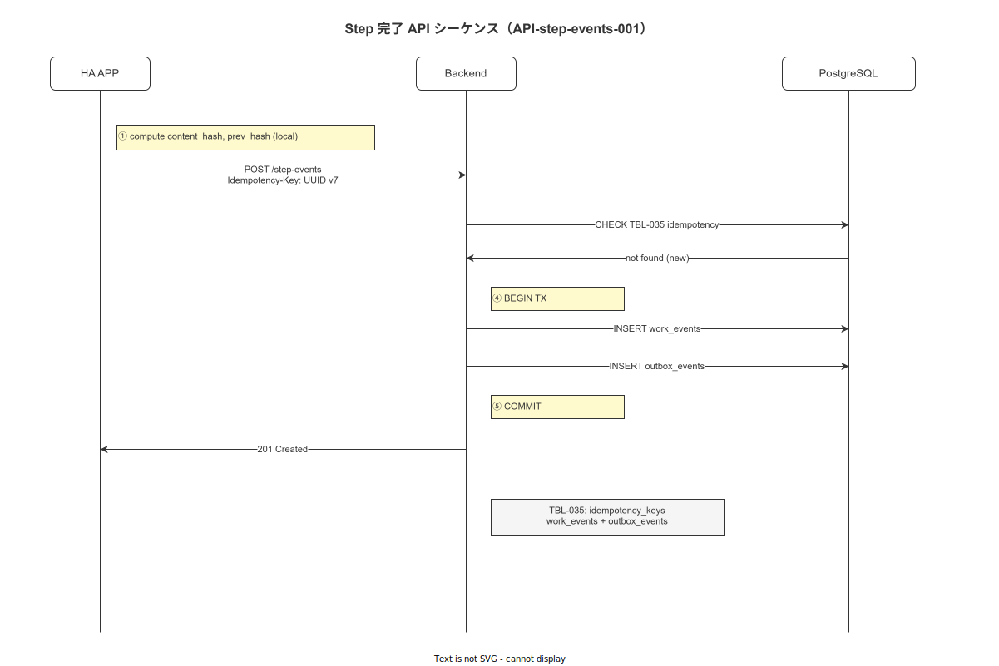

# 03 作業実行 API 仕様

本章は作業指示（API-work-orders）・作業実行（API-work-execs）・ステップイベント（API-step-events）の全エンドポイントを確定する。各エンドポイントのリクエスト / レスポンス全フィールド・型・制約・エラーコード・RBAC 要件を記述する。

> **担当バイナリ**: 本章の全エンドポイントは **`wnav_terminal_api`（ポート 8080）** が担当する。現場端末からの作業実施系 API であり、`wnav_master_api` には存在しない。

---

## 1. API-work-orders-001: GET /api/v1/work-orders

### 1-1. 概要

| 項目 | 値 |
|---|---|
| API-ID | API-work-orders-001 |
| HTTP メソッド | GET |
| URL | `/api/v1/work-orders` |
| 担当バイナリ | terminal-api |
| 認証要否 | 必須 |
| Idempotency-Key | 不要（GET）|
| レート制限カテゴリ | 読み取り（1000 req / 60s）|
| 関連 FR | FR-NV-001 |

### 1-2. クエリパラメータ

| パラメータ | 型 | 必須 | 説明 |
|---|---|---|---|
| `status` | string | 任意 | フィルタ: `open` / `in_progress` / `completed` / `cancelled` |
| `process_id` | string (UUID v7) | 任意 | 工程 ID でフィルタ |
| `lot_id` | string (UUID v7) | 任意 | ロット ID でフィルタ |
| `assigned_to` | string (UUID v7) | 任意 | 担当オペレータ ID でフィルタ |
| `scheduled_date` | string (ISO 8601 date) | 任意 | 予定日でフィルタ（例: `2026-05-17`）|
| `page` | integer | 任意 | ページ番号（デフォルト 1）|
| `per_page` | integer | 任意 | 件数（デフォルト 50 / 最大 200）|

### 1-3. レスポンススキーマ（HTTP 200）

```json
{
  "data": [
    {
      "id": "019682ab-7c1f-7000-0000-000000000101",
      "work_order_number": "WO-2026-0001",
      "status": "open",
      "process_id": "019682ab-7c1f-7000-0000-000000000201",
      "process_name": "溶接工程A",
      "sop_id": "019682ab-7c1f-7000-0000-000000000301",
      "sop_version": "3.2.0",
      "lot_id": "019682ab-7c1f-7000-0000-000000000401",
      "lot_number": "LOT-2026-0042",
      "product_id": "019682ab-7c1f-7000-0000-000000000501",
      "product_name": "部品A",
      "scheduled_start": "2026-05-17T08:00:00.000Z",
      "scheduled_end": "2026-05-17T12:00:00.000Z",
      "assigned_to": "019682ab-7c1f-7000-0000-000000000002",
      "created_at": "2026-05-16T15:00:00.000Z",
      "updated_at": "2026-05-16T15:00:00.000Z"
    }
  ],
  "meta": {
    "request_id": "019682ab-7c1f-7010-a1b2-3c4d5e6f7890",
    "server_time": "2026-05-17T10:30:00.000Z",
    "api_version": "v1",
    "total": 15,
    "page": 1,
    "per_page": 50,
    "total_pages": 1
  }
}
```

| フィールド | 型 | 説明 |
|---|---|---|
| `id` | string (UUID v7) | 作業指示 ID（TBL-006）|
| `work_order_number` | string | 作業指示番号（人間可読）|
| `status` | string | `open` / `in_progress` / `completed` / `cancelled` |
| `process_id` | string (UUID v7) | 工程 ID（TBL-021）|
| `process_name` | string | 工程名 |
| `sop_id` | string (UUID v7) | SOP ID（TBL-007）|
| `sop_version` | string | SOP バージョン（semver 形式）|
| `lot_id` | string (UUID v7) | ロット ID（TBL-024）|
| `lot_number` | string | ロット番号（人間可読）|
| `product_id` | string (UUID v7) | 製品 ID（TBL-023）|
| `product_name` | string | 製品名 |
| `scheduled_start` | string (ISO 8601 UTC) | 予定開始時刻 |
| `scheduled_end` | string (ISO 8601 UTC) | 予定終了時刻 |
| `assigned_to` | string (UUID v7) / null | 担当オペレータ ID |
| `created_at` | string (ISO 8601 UTC) | 作成時刻 |
| `updated_at` | string (ISO 8601 UTC) | 最終更新時刻 |

### 1-4. RBAC

| ロール | アクセス |
|---|---|
| operator | 自工場の work-orders のみ参照可 |
| supervisor | 自工場の全 work-orders 参照可 |
| master_admin | 参照可 |
| quality_admin | 参照可 |
| system_admin | 全工場参照可 |
| executive | 参照可 |

### 1-5. エラーコード

| ERR-CODE | HTTP | 発生条件 |
|---|---|---|
| ERR-AUTH-001 | 401 | Authorization ヘッダ不足または JWT 無効 |
| ERR-AUTH-004 | 403 | ロール権限不足 |
| ERR-VAL-003 | 422 | クエリパラメータの形式不正（UUID 形式等）|

---

## 2. API-work-orders-002: POST /api/v1/work-orders

### 2-1. 概要

| 項目 | 値 |
|---|---|
| API-ID | API-work-orders-002 |
| HTTP メソッド | POST |
| URL | `/api/v1/work-orders` |
| 担当バイナリ | terminal-api |
| 認証要否 | 必須 |
| Idempotency-Key | 必須 |
| レート制限カテゴリ | 書き込み（500 req / 60s）|
| 関連 FR | FR-NV-001 |

### 2-2. リクエストスキーマ

```json
{
  "work_order_number": "WO-2026-0001",
  "process_id": "019682ab-7c1f-7000-0000-000000000201",
  "sop_id": "019682ab-7c1f-7000-0000-000000000301",
  "lot_id": "019682ab-7c1f-7000-0000-000000000401",
  "product_id": "019682ab-7c1f-7000-0000-000000000501",
  "scheduled_start": "2026-05-17T08:00:00.000Z",
  "scheduled_end": "2026-05-17T12:00:00.000Z",
  "assigned_to": "019682ab-7c1f-7000-0000-000000000002"
}
```

| フィールド | 型 | 必須 | 制約 | 説明 |
|---|---|---|---|---|
| `work_order_number` | string | 必須 | 1〜32 文字、英数字・ハイフン | 作業指示番号（工場内一意）|
| `process_id` | string (UUID v7) | 必須 | TBL-021 に存在すること | 工程 ID |
| `sop_id` | string (UUID v7) | 必須 | TBL-007 に Published バージョンが存在すること | SOP ID |
| `lot_id` | string (UUID v7) | 必須 | TBL-024 に存在すること | ロット ID |
| `product_id` | string (UUID v7) | 必須 | TBL-023 に存在すること | 製品 ID |
| `scheduled_start` | string (ISO 8601) | 必須 | 未来時刻 | 予定開始時刻 |
| `scheduled_end` | string (ISO 8601) | 必須 | `scheduled_start` より後 | 予定終了時刻 |
| `assigned_to` | string (UUID v7) | 任意 | TBL-016 に存在すること | 担当オペレータ ID |

### 2-3. レスポンススキーマ（HTTP 201）

`data` は作成された work-order オブジェクト（§ 1-3 の単件形式）。

### 2-4. RBAC

`supervisor` / `master_admin` / `system_admin` のみ作成可。`operator` は不可。

### 2-5. エラーコード

| ERR-CODE | HTTP | 発生条件 |
|---|---|---|
| ERR-AUTH-004 | 403 | operator ロールでアクセス |
| ERR-BIZ-003 | 409 | sop_id に Published バージョンが存在しない |
| ERR-DB-002 | 409 | work_order_number が既存レコードと重複 |
| ERR-VAL-001 | 422 | 必須フィールド不足 |
| ERR-VAL-003 | 422 | UUID 形式不正 |

---

## 3. API-work-execs-001: POST /api/v1/work-executions

### 3-1. 概要

| 項目 | 値 |
|---|---|
| API-ID | API-work-execs-001 |
| HTTP メソッド | POST |
| URL | `/api/v1/work-executions` |
| 担当バイナリ | terminal-api |
| 認証要否 | 必須 |
| Idempotency-Key | 必須 |
| レート制限カテゴリ | 書き込み（500 req / 60s）|
| 関連 FR | FR-NV-001 |

### 3-2. リクエストスキーマ

```json
{
  "work_order_id": "019682ab-7c1f-7000-0000-000000000101",
  "operator_id": "019682ab-7c1f-7000-0000-000000000002",
  "device_id": "019682ab-7c1f-7000-0000-000000000010",
  "start_timestamp_client": "2026-05-17T08:00:05.123Z"
}
```

| フィールド | 型 | 必須 | 制約 | 説明 |
|---|---|---|---|---|
| `work_order_id` | string (UUID v7) | 必須 | TBL-006 に `open` ステータスで存在すること | 対象作業指示 ID |
| `operator_id` | string (UUID v7) | 必須 | TBL-016 に存在し、必要スキルを保有すること | 実行オペレータ ID |
| `device_id` | string (UUID v7) | 必須 | TBL-033 に存在すること | 実行端末 ID |
| `start_timestamp_client` | string (ISO 8601) | 必須 | — | クライアント側の開始時刻（監査用）|

### 3-3. レスポンススキーマ（HTTP 201）

```json
{
  "data": {
    "id": "019682ab-7c1f-7000-b1c2-3d4e5f6a7b8c",
    "work_order_id": "019682ab-7c1f-7000-0000-000000000101",
    "operator_id": "019682ab-7c1f-7000-0000-000000000002",
    "device_id": "019682ab-7c1f-7000-0000-000000000010",
    "status": "in_progress",
    "current_step_id": "019682ab-7c1f-7000-0000-000000000601",
    "sop_version_snapshot": {
      "sop_id": "019682ab-7c1f-7000-0000-000000000301",
      "version": "3.2.0",
      "snapshot_hash": "sha256:abc123..."
    },
    "started_at": "2026-05-17T08:00:05.000Z",
    "created_at": "2026-05-17T08:00:05.000Z"
  },
  "meta": {
    "request_id": "019682ab-7c1f-7011-a1b2-3c4d5e6f7890",
    "server_time": "2026-05-17T08:00:05.000Z",
    "api_version": "v1"
  }
}
```

| フィールド | 型 | 説明 |
|---|---|---|
| `id` | string (UUID v7) | 作業実行 ID（TBL-005）|
| `status` | string | `in_progress` |
| `current_step_id` | string (UUID v7) | 最初のステップ ID（TBL-008）|
| `sop_version_snapshot.version` | string | 実行時に固定された SOP バージョン |
| `sop_version_snapshot.snapshot_hash` | string | SOP コンテンツの SHA-256 ハッシュ |
| `started_at` | string (ISO 8601 UTC) | サーバー側の開始時刻 |

### 3-4. RBAC

`operator` / `supervisor` が実行可。

### 3-5. エラーコード

| ERR-CODE | HTTP | 発生条件 |
|---|---|---|
| ERR-AUTH-004 | 403 | 権限不足 |
| ERR-BIZ-003 | 409 | SOP に Published バージョンが存在しない |
| ERR-BIZ-006 | 403 | operator のスキルレベルが SOP 要件を満たさない（CFG-011）|
| ERR-BIZ-007 | 409 | 同一 work_order の実行が既に `in_progress` で存在する |
| ERR-VAL-001 | 422 | 必須フィールド不足 |

---

## 4. API-work-execs-002: GET /api/v1/work-executions/{id}

### 4-1. 概要

| 項目 | 値 |
|---|---|
| API-ID | API-work-execs-002 |
| HTTP メソッド | GET |
| URL | `/api/v1/work-executions/{id}` |
| 担当バイナリ | terminal-api |
| 認証要否 | 必須 |
| Idempotency-Key | 不要（GET）|
| 関連 FR | FR-NV-013 |

### 4-2. パスパラメータ

| パラメータ | 型 | 必須 | 説明 |
|---|---|---|---|
| `id` | string (UUID v7) | 必須 | 作業実行 ID（TBL-005）|

### 4-3. レスポンススキーマ（HTTP 200）

```json
{
  "data": {
    "id": "019682ab-7c1f-7000-b1c2-3d4e5f6a7b8c",
    "work_order_id": "019682ab-7c1f-7000-0000-000000000101",
    "operator_id": "019682ab-7c1f-7000-0000-000000000002",
    "device_id": "019682ab-7c1f-7000-0000-000000000010",
    "status": "in_progress",
    "current_step_id": "019682ab-7c1f-7000-0000-000000000602",
    "completed_step_count": 3,
    "total_step_count": 12,
    "sop_version_snapshot": {
      "sop_id": "019682ab-7c1f-7000-0000-000000000301",
      "version": "3.2.0",
      "snapshot_hash": "sha256:abc123..."
    },
    "started_at": "2026-05-17T08:00:05.000Z",
    "last_event_at": "2026-05-17T09:15:00.000Z",
    "events": [
      {
        "event_id": "019682ab-7c1f-7000-c1d2-3e4f5a6b7c8d",
        "activity": "step_completed",
        "step_id": "019682ab-7c1f-7000-0000-000000000601",
        "step_number": 1,
        "timestamp_server": "2026-05-17T08:05:00.000Z"
      }
    ]
  },
  "meta": {
    "request_id": "019682ab-7c1f-7012-a1b2-3c4d5e6f7890",
    "server_time": "2026-05-17T09:15:30.000Z",
    "api_version": "v1"
  }
}
```

### 4-4. エラーコード

| ERR-CODE | HTTP | 発生条件 |
|---|---|---|
| ERR-AUTH-001 | 401 | JWT 無効 |
| ERR-AUTH-004 | 403 | 他工場のデータへのアクセス |
| ERR-VAL-003 | 422 | id が UUID v7 形式でない |
| `404 Not Found` | 404 | id が存在しない |

---

## 5. API-work-execs-003: POST /api/v1/work-executions/{id}/suspend

### 5-1. 概要

| 項目 | 値 |
|---|---|
| API-ID | API-work-execs-003 |
| HTTP メソッド | POST |
| URL | `/api/v1/work-executions/{id}/suspend` |
| 担当バイナリ | terminal-api |
| 認証要否 | 必須 |
| Idempotency-Key | 必須 |
| 関連 FR | FR-ST-001 |

### 5-2. リクエストスキーマ

```json
{
  "reason_code": "equipment_breakdown",
  "reason_detail": "溶接機の電源が落ちた",
  "timestamp_client": "2026-05-17T09:30:00.123Z"
}
```

| フィールド | 型 | 必須 | 制約 | 説明 |
|---|---|---|---|---|
| `reason_code` | string | 必須 | `equipment_breakdown` / `material_shortage` / `quality_issue` / `emergency` / `other` | 中断理由コード |
| `reason_detail` | string | 任意 | 最大 500 文字 | 補足説明 |
| `timestamp_client` | string (ISO 8601) | 必須 | — | クライアント側の中断時刻 |

### 5-3. レスポンススキーマ（HTTP 200）

```json
{
  "data": {
    "id": "019682ab-7c1f-7000-b1c2-3d4e5f6a7b8c",
    "status": "suspended",
    "suspension_id": "019682ab-7c1f-7000-d1e2-3f4a5b6c7d8e",
    "suspended_at": "2026-05-17T09:30:00.000Z"
  },
  "meta": {
    "request_id": "019682ab-7c1f-7013-a1b2-3c4d5e6f7890",
    "server_time": "2026-05-17T09:30:00.000Z",
    "api_version": "v1"
  }
}
```

TBL-011（suspensions）に中断レコードを記録する。

### 5-4. エラーコード

| ERR-CODE | HTTP | 発生条件 |
|---|---|---|
| ERR-BIZ-001 | 409 | 対象実行が `in_progress` 以外のステータス |
| ERR-AUTH-004 | 403 | 実行者以外（supervisor 以上は可）|
| ERR-VAL-001 | 422 | reason_code 不足 |

---

## 6. API-work-execs-004: POST /api/v1/work-executions/{id}/resume

### 6-1. リクエストスキーマ

```json
{
  "resumed_by": "019682ab-7c1f-7000-0000-000000000002",
  "timestamp_client": "2026-05-17T10:00:00.123Z"
}
```

| フィールド | 型 | 必須 | 制約 | 説明 |
|---|---|---|---|---|
| `resumed_by` | string (UUID v7) | 必須 | TBL-016 に存在すること | 再開実行者 ID |
| `timestamp_client` | string (ISO 8601) | 必須 | — | クライアント側の再開時刻 |

### 6-2. レスポンススキーマ（HTTP 200）

```json
{
  "data": {
    "id": "019682ab-7c1f-7000-b1c2-3d4e5f6a7b8c",
    "status": "in_progress",
    "resumed_at": "2026-05-17T10:00:00.000Z",
    "current_step_id": "019682ab-7c1f-7000-0000-000000000602"
  },
  "meta": {
    "request_id": "019682ab-7c1f-7014-a1b2-3c4d5e6f7890",
    "server_time": "2026-05-17T10:00:00.000Z",
    "api_version": "v1"
  }
}
```

---

## 7. API-work-execs-005: POST /api/v1/work-executions/{id}/complete

### 7-1. リクエストスキーマ

```json
{
  "completed_by": "019682ab-7c1f-7000-0000-000000000002",
  "timestamp_client": "2026-05-17T12:00:00.123Z",
  "final_remarks": "全ステップ完了。異常なし。"
}
```

| フィールド | 型 | 必須 | 制約 | 説明 |
|---|---|---|---|---|
| `completed_by` | string (UUID v7) | 必須 | TBL-016 に存在すること | 完了実行者 ID |
| `timestamp_client` | string (ISO 8601) | 必須 | — | クライアント側の完了時刻 |
| `final_remarks` | string | 任意 | 最大 1000 文字 | 最終備考 |

### 7-2. レスポンススキーマ（HTTP 200）

```json
{
  "data": {
    "id": "019682ab-7c1f-7000-b1c2-3d4e5f6a7b8c",
    "status": "completed",
    "completed_at": "2026-05-17T12:00:00.000Z",
    "hash_chain_block_id": "019682ab-7c1f-7000-e1f2-3a4b5c6d7e8f",
    "hash_chain_value": "sha256:def456..."
  },
  "meta": {
    "request_id": "019682ab-7c1f-7015-a1b2-3c4d5e6f7890",
    "server_time": "2026-05-17T12:00:00.000Z",
    "api_version": "v1"
  }
}
```

完了時に TBL-031（hash_chain_blocks）にブロックを追記し、TBL-003（outbox_events）に MSG-001 を挿入する。

### 7-3. エラーコード

| ERR-CODE | HTTP | 発生条件 |
|---|---|---|
| ERR-BIZ-001 | 409 | 未完了ステップが残っている（必須ステップ）|
| ERR-BIZ-002 | 409 | 必須エビデンスが未添付 |
| ERR-DB-003 | 500 | ハッシュチェーン整合性エラー |

---

## 8. API-step-events-001: POST /api/v1/work-executions/{id}/events

### 8-1. 概要

| 項目 | 値 |
|---|---|
| API-ID | API-step-events-001 |
| HTTP メソッド | POST |
| URL | `/api/v1/work-executions/{id}/events` |
| 担当バイナリ | terminal-api（Idempotency-Key 必須は terminal-api のみ適用）|
| 認証要否 | 必須 |
| Idempotency-Key | 必須 |
| レート制限カテゴリ | 書き込み（500 req / 60s）|
| 関連 FR | FR-EV-001 |

### 8-2. activity 別リクエストスキーマ

#### 8-2-1. step_completed（ステップ完了）

```json
{
  "activity": "step_completed",
  "step_id": "019682ab-7c1f-7000-0000-000000000602",
  "step_number": 2,
  "timestamp_client": "2026-05-17T08:15:00.123Z",
  "duration_seconds": 600,
  "remarks": "標準通り実施"
}
```

| フィールド | 型 | 必須 | 制約 | 説明 |
|---|---|---|---|---|
| `activity` | string | 必須 | `"step_completed"` | activity タイプ |
| `step_id` | string (UUID v7) | 必須 | current_step と一致すること | 完了ステップ ID |
| `step_number` | integer | 必須 | 1 以上 | ステップ番号（順序検証用）|
| `timestamp_client` | string (ISO 8601) | 必須 | — | クライアント側の完了時刻 |
| `duration_seconds` | integer | 任意 | 0 以上 | ステップ実施時間（秒）|
| `remarks` | string | 任意 | 最大 500 文字 | 備考 |

#### 8-2-2. step_skipped（ステップスキップ）

```json
{
  "activity": "step_skipped",
  "step_id": "019682ab-7c1f-7000-0000-000000000603",
  "step_number": 3,
  "timestamp_client": "2026-05-17T08:16:00.123Z",
  "skip_reason": "not_applicable",
  "skip_reason_detail": "該当製品には本ステップ不適用"
}
```

| フィールド | 型 | 必須 | 制約 | 説明 |
|---|---|---|---|---|
| `activity` | string | 必須 | `"step_skipped"` | — |
| `step_id` | string (UUID v7) | 必須 | — | スキップ対象ステップ ID |
| `step_number` | integer | 必須 | 1 以上 | ステップ番号 |
| `timestamp_client` | string (ISO 8601) | 必須 | — | — |
| `skip_reason` | string | 必須 | `not_applicable` / `supervisor_approved` | スキップ理由コード |
| `skip_reason_detail` | string | 任意 | 最大 500 文字 | 補足 |

スキップは `supervisor` 以上が実行可能。`operator` 単独スキップは ERR-AUTH-004。

#### 8-2-3. evidence_attached（エビデンス添付）

```json
{
  "activity": "evidence_attached",
  "step_id": "019682ab-7c1f-7000-0000-000000000602",
  "timestamp_client": "2026-05-17T08:14:00.123Z",
  "evidence_id": "019682ab-7c1f-7000-f1a2-3b4c5d6e7f8a"
}
```

| フィールド | 型 | 必須 | 制約 | 説明 |
|---|---|---|---|---|
| `activity` | string | 必須 | `"evidence_attached"` | — |
| `step_id` | string (UUID v7) | 必須 | — | 対象ステップ ID |
| `timestamp_client` | string (ISO 8601) | 必須 | — | — |
| `evidence_id` | string (UUID v7) | 必須 | TBL-009 に存在すること | 添付エビデンス ID（事前アップロード済み）|

#### 8-2-4. sign_applied（電子サイン適用）

```json
{
  "activity": "sign_applied",
  "step_id": "019682ab-7c1f-7000-0000-000000000602",
  "timestamp_client": "2026-05-17T08:14:30.123Z",
  "electronic_sign_id": "019682ab-7c1f-7000-a1b2-3c4d5e6f7890"
}
```

| フィールド | 型 | 必須 | 制約 | 説明 |
|---|---|---|---|---|
| `activity` | string | 必須 | `"sign_applied"` | — |
| `step_id` | string (UUID v7) | 必須 | — | 対象ステップ ID |
| `timestamp_client` | string (ISO 8601) | 必須 | — | — |
| `electronic_sign_id` | string (UUID v7) | 必須 | TBL-002 に存在すること | 電子サイン ID（事前作成済み）|

#### 8-2-5. measurement_recorded（計測値記録）

```json
{
  "activity": "measurement_recorded",
  "step_id": "019682ab-7c1f-7000-0000-000000000604",
  "timestamp_client": "2026-05-17T08:30:00.123Z",
  "measurement_item_id": "019682ab-7c1f-7000-0000-000000000701",
  "value": 24.7,
  "unit": "°C",
  "instrument_id": "019682ab-7c1f-7000-0000-000000000801"
}
```

| フィールド | 型 | 必須 | 制約 | 説明 |
|---|---|---|---|---|
| `activity` | string | 必須 | `"measurement_recorded"` | — |
| `step_id` | string (UUID v7) | 必須 | — | 対象ステップ ID |
| `timestamp_client` | string (ISO 8601) | 必須 | — | — |
| `measurement_item_id` | string (UUID v7) | 必須 | TBL-029 の定義と一致すること | 計測項目 ID |
| `value` | number | 必須 | 有限数 | 計測値 |
| `unit` | string | 必須 | 1〜20 文字 | 単位 |
| `instrument_id` | string (UUID v7) | 任意 | TBL-026 に存在すること。校正期限確認対象 | 使用計測器 ID |

`instrument_id` が指定された場合、TBL-026 の校正期限（`calibration_due`）を確認する。期限切れの場合: ERR-BIZ-004（CFG-012 の設定に従い hard / soft）。

### 8-3. 共通レスポンススキーマ（HTTP 201）

```json
{
  "data": {
    "event_id": "019682ab-7c1f-7000-c1d2-3e4f5a6b7c8d",
    "work_execution_id": "019682ab-7c1f-7000-b1c2-3d4e5f6a7b8c",
    "activity": "step_completed",
    "step_id": "019682ab-7c1f-7000-0000-000000000602",
    "timestamp_server": "2026-05-17T08:15:00.000Z",
    "hash_chain_prev": "sha256:aaa111...",
    "hash_chain_current": "sha256:bbb222...",
    "next_step_id": "019682ab-7c1f-7000-0000-000000000603"
  },
  "meta": {
    "request_id": "019682ab-7c1f-7016-a1b2-3c4d5e6f7890",
    "server_time": "2026-05-17T08:15:00.000Z",
    "api_version": "v1"
  }
}
```

| フィールド | 型 | 説明 |
|---|---|---|
| `event_id` | string (UUID v7) | 記録されたイベント ID（TBL-001）|
| `timestamp_server` | string (ISO 8601 UTC) | サーバー側のタイムスタンプ |
| `hash_chain_prev` | string | 前ブロックのハッシュ値 |
| `hash_chain_current` | string | 今回ブロックのハッシュ値 |
| `next_step_id` | string (UUID v7) / null | 次のステップ ID（完了後は null）|

### 8-4. RBAC

**図 1: ステップイベント実行シーケンス（activity タイプ別フロー・ハッシュチェーン生成）**



> 原本: [`img/fig_dd_api_step_event_sequence.drawio`](img/fig_dd_api_step_event_sequence.drawio)

| ロール | アクセス |
|---|---|
| operator | step_completed / evidence_attached / sign_applied / measurement_recorded |
| supervisor | 全 activity（step_skipped を含む）|

### 8-5. エラーコード

| ERR-CODE | HTTP | 発生条件 |
|---|---|---|
| ERR-BIZ-001 | 409 | step_id が current_step と一致しない（順序違反）|
| ERR-BIZ-002 | 409 | 必須エビデンスゲートが未解放（ステップ完了前にエビデンス必須）|
| ERR-BIZ-004 | 409 | 計測器の校正期限切れ（CFG-012: hard モード）|
| ERR-BIZ-006 | 403 | オペレータのスキルレベル不足 |
| ERR-DB-001 | 409 | Idempotency-Key の重複衝突 |
| ERR-DB-003 | 500 | ハッシュチェーン整合性エラー |
| ERR-VAL-001 | 422 | 必須フィールド不足 |
| ERR-VAL-003 | 422 | 形式不正 |

---

**本節で確定した方針**
- **本章の全エンドポイント（API-work-orders-001〜002、API-work-execs-001〜005、API-step-events-001）は `wnav_terminal_api`（ポート 8080）が担当し、`wnav_master_api` には存在しないことを確定した。**
- **API-step-events-001 は activity タイプ別（step_completed / step_skipped / evidence_attached / sign_applied / measurement_recorded）のリクエストスキーマを持ち、全イベントを TBL-001 に Append-only 記録しハッシュチェーンブロックを生成することを確定した。**
- **作業完了（API-work-execs-005）時に TBL-031 ハッシュチェーンブロックを追記し、TBL-003 Outbox に MSG-001 を挿入してトレーサビリティ記録を確定した。**
- **ステップスキップは supervisor 以上に限定し、計測器校正期限切れ時の挙動は CFG-012 の hard / soft 設定に従うことを確定した。**

---

## 参照業界分析

### 必須
- [`90_業界分析/09_セキュリティとアクセス制御.md`](../../../90_業界分析/09_セキュリティとアクセス制御.md)

### 関連
- [`90_業界分析/06_品質管理とトレーサビリティ.md`](../../../90_業界分析/06_品質管理とトレーサビリティ.md)
