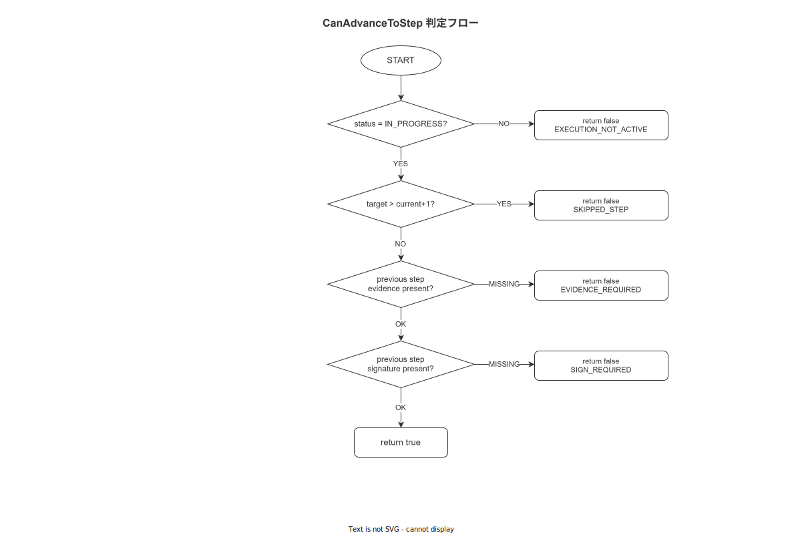

# 01 StepEngine 詳細設計

本章は MOD-FE-HA-003（StepEngine）の詳細設計を確定する。StepEngine は作業ナビゲーションの中核であり、ロックステップ進行強制（BR-BUS-001）・JSON Logic 条件分岐評価・証拠ゲート・サインゲートを実装する。FR-NV-001〜013 の全件をカバーする。

---

## 1. コアエンティティ定義

### 1-1. StepEntity（FNC-FE-001 の入力型）

```typescript
// src/features/navigation/step-engine/types.ts

/** 多言語テキスト（FR-UI-001〜003） */
export interface MultilingualText {
  ja: string;
  en: string;
  jaSimple: string;  // やさしい日本語
}

/** Step の判定条件（JSON Logic ルール）*/
export interface JudgmentCondition {
  rule: JsonLogicRule;          // json-logic-js で評価可能な JSON オブジェクト
  failStepId: string | null;    // 判定 NG 時の遷移先 stepId（null = 停止）
  passStepId: string | null;    // 判定 OK 時の遷移先 stepId（null = 次 Step）
}

/** Step 入力タイプ（標準 4 + 拡張 5） */
export type StepInputType =
  | 'boolean_check'      // チェックボックス（OK/NG）
  | 'numeric_input'      // 数値入力フィールド + 単位
  | 'photo_capture'      // カメラ起動
  | 'text_input'         // テキストエリア
  | 'slider_range'       // スライダー数値範囲
  | 'qr_scan'            // QR/バーコードスキャン
  | 'signature_pad'      // 電子サインパッド
  | 'condition_branch'   // 条件分岐ノード（表示 UI なし）
  | 'custom';            // TBL-029 動的ロード

/** Step エンティティ（TBL-008 steps の端末側サブセット） */
export interface StepEntity {
  stepId: string;                          // UUID v7 (TEXT in SQLite)
  sopVersionId: string;                    // UUID v7
  stepNumber: number;                      // 1-indexed 順序
  inputType: StepInputType;
  instructionText: MultilingualText;
  evidenceRequired: boolean;               // BR-BUS-002: 写真撮影必須ゲート
  judgmentCondition: JudgmentCondition | null;
  skillLevelRequired: number;              // 0 = 制限なし
  expectedUnit: string | null;             // numeric_input 時の単位（例: "mm"）
  usl: number | null;                      // Upper Spec Limit（numeric_input）
  lsl: number | null;                      // Lower Spec Limit（numeric_input）
  signRequired: boolean;                   // FR-AU-001: 電子サイン必須ゲート
  estimatedSeconds: number;               // 目安時間（UI 表示用）
  requiredScans: RequiredScan[] | null;   // FR-EV-013: ポカヨケ照合対象配列（null = 照合不要）
}

/** FR-EV-013 ポカヨケ照合エントリ */
export interface RequiredScan {
  target: 'material' | 'tool' | 'instrument';
  refId?: string;          // equipments.equipment_id / instruments.instrument_id
  refScanCode?: string;    // scan_code 直接比較（refId 不使用時）
  required: boolean;
  label?: { ja: string; en: string };
  gs1Ai?: string;
}

/** FR-EV-013 ポカヨケ照合結果 */
export interface ScanVerification {
  target: 'material' | 'tool' | 'instrument';
  expectedRefId?: string;
  actualScanValue: string;
  verified: boolean;
  verifiedAt: string;      // ISO 8601
  isManualInput: boolean;
}

/** JSON Logic ルール型（json-logic-js 互換）*/
export type JsonLogicRule = Record<string, unknown>;

/** ステップコンテキスト（JSON Logic 評価時に渡す変数）*/
export interface StepContext {
  measuredValue?: number;
  booleanValue?: boolean;
  textValue?: string;
  qrValue?: string;
  evidenceId?: string;
  usl?: number;
  lsl?: number;
  [key: string]: unknown;
}
```

### 1-2. WorkEventEntity（StepEngine が生成するイベント）

```typescript
// src/features/navigation/step-engine/types.ts（続き）

/** StepEngine が SQLite に書き込む WorkEvent */
export interface WorkEventEntity {
  eventId: string;          // UUID v7（FNC-FE-002 が生成）
  caseId: string;           // 作業セッション ID
  activity: string;         // step_completed / suspended / resumed 等
  timestampClient: string;  // ISO 8601 UTC（ClockService 経由）
  resource: string;         // worker userId
  sopVersionId: string;
  stepId: string;
  payload: string;          // JSON 文字列（StepPayload のシリアライズ）
  prevHash: string;         // 直前イベントの content_hash（ハッシュチェーン）
  contentHash: string;      // SHA-256(canonical JSON) （BR-BUS-012）
  terminalId: string;       // 端末 ID
  isOffline: boolean;
}

/** Step 完了コマンド（FNC-FE-002 の入力） */
export interface CompleteStepCmd {
  execId: string;
  stepId: string;
  stepIndex: number;
  payload: StepPayload;
  workerId: string;
  terminalId: string;
}

/** Step ごとの入力ペイロード（activity の payload 列に格納） */
export type StepPayload =
  | { inputType: 'boolean_check';  value: boolean }
  | { inputType: 'numeric_input';  value: number; unit: string }
  | { inputType: 'photo_capture';  evidenceId: string; fileHash: string }
  | { inputType: 'text_input';     value: string }
  | { inputType: 'slider_range';   value: number }
  | { inputType: 'qr_scan';        qrValue: string; scanVerifications: ScanVerification[] }
  | { inputType: 'signature_pad';  evidenceId: string; signedAt: string }
  | { inputType: 'condition_branch'; branchResult: boolean }
  | { inputType: 'custom';         value: unknown };
```

---

## 2. ステートマシン定義

### 2-1. StepExecutionState

```typescript
// src/features/navigation/step-engine/state.ts

export type SuspendReason =
  | 'MATERIAL_WAIT'
  | 'EQUIPMENT_FAILURE'
  | 'QUALITY_HOLD'
  | 'BREAK'
  | 'SHIFT_END'
  | 'OTHER';

export type BlockedReason =
  | 'PREVIOUS_STEP_NOT_COMPLETED'
  | 'EVIDENCE_REQUIRED'
  | 'SIGN_REQUIRED'
  | 'SKILL_LEVEL_INSUFFICIENT'
  | 'CONDITION_BRANCH_UNRESOLVED'
  | 'WRONG_TOOL_SCAN';

export interface CanAdvanceResult {
  canAdvance: boolean;
  blockedReason?: BlockedReason;
}

export interface ConditionResult {
  passed: boolean;
  nextStepId: string | null;
  evaluatedRule: JsonLogicRule;
}

/**
 * StepEngine の主ステートマシン状態型
 * - idle: 作業未開始
 * - in_progress: 通常実行中
 * - waiting_evidence: 証拠取得待ち（カメラ起動中）
 * - waiting_sign: 電子サイン待ち
 * - completed: 全 Step 完了
 * - suspended: 中断中
 */
export type StepExecutionState =
  | { type: 'idle' }
  | { type: 'in_progress';      currentStepIndex: number }
  | { type: 'waiting_evidence'; stepId: string }
  | { type: 'waiting_sign';     stepId: string }
  | { type: 'completed' }
  | { type: 'suspended';        reason: SuspendReason; suspendedAt: string };
```

### 2-2. 状態遷移表

| 現在の状態 | イベント | 次の状態 | ガード条件 |
|---|---|---|---|
| `idle` | `START` | `in_progress (index=0)` | 作業実行権限あり |
| `in_progress` | `COMPLETE_STEP` | `in_progress (index+1)` | canAdvanceToStep = true |
| `in_progress` | `COMPLETE_STEP（証拠必須）` | `waiting_evidence` | evidenceRequired = true かつ未取得 |
| `in_progress` | `COMPLETE_STEP（サイン必須）` | `waiting_sign` | signRequired = true かつ未署名 |
| `waiting_evidence` | `EVIDENCE_CAPTURED` | `in_progress` | CaptureResult 有効 |
| `waiting_sign` | `SIGN_COMPLETED` | `in_progress` | SignResult 有効 |
| `in_progress` | `SUSPEND` | `suspended` | reason ∈ SuspendReason |
| `suspended` | `RESUME` | `in_progress (保存済み index)` | 作業実行権限あり |
| `in_progress (最終 Step)` | `COMPLETE_STEP` | `completed` | canAdvanceToStep = true |

**図 1: StepEngine 進行判断ロジック**



> 原本: [`img/fig_dd_ha_stepengine_decision.drawio`](img/fig_dd_ha_stepengine_decision.drawio)

---

## 3. StepEngine クラス（FNC-FE-001〜003）

```typescript
// src/features/navigation/step-engine/StepEngine.ts
import { v7 as uuidv7 } from 'uuid';
import * as jsonLogic from 'json-logic-js';
import { createHash } from 'react-native-quick-crypto';  // SHA-256

import type { LocalDbService } from '../../shared/db/LocalDbService';
import type { OutboxWorker } from '../network/outbox/OutboxWorker';
import type { ClockService } from '../../shared/clock/ClockService';
import type {
  StepEntity, WorkEventEntity, CompleteStepCmd,
  StepContext, ConditionResult, JsonLogicRule, StepPayload,
} from './types';
import type { CanAdvanceResult, BlockedReason } from './state';
import { DomainError } from '../../shared/errors/DomainError';

export class StepEngine {
  constructor(
    private readonly localDb: LocalDbService,
    private readonly outboxWorker: OutboxWorker,
    private readonly clock: ClockService,
  ) {}

  /**
   * FNC-FE-001: ステップ進行可否ゲート
   * BR-BUS-001（ロックステップ強制）・BR-BUS-002（証拠必須）・FR-AU-001（サイン必須）を実施
   */
  async canAdvanceToStep(
    execId: string,
    targetStepIndex: number,
  ): Promise<CanAdvanceResult> {
    const events = await this.localDb.getWorkEvents(execId);
    const steps = await this.localDb.getStepsForExecution(execId);

    // ロックステップ検証: targetStepIndex - 1 まですべて完了済みか
    for (let i = 0; i < targetStepIndex; i++) {
      const step = steps[i];
      if (step == null) {
        return { canAdvance: false, blockedReason: 'PREVIOUS_STEP_NOT_COMPLETED' };
      }
      const completed = events.some(
        (e) => e.stepId === step.stepId && e.activity === 'step_completed',
      );
      if (!completed) {
        return { canAdvance: false, blockedReason: 'PREVIOUS_STEP_NOT_COMPLETED' };
      }
    }

    const targetStep = steps[targetStepIndex];
    if (targetStep == null) {
      return { canAdvance: false, blockedReason: 'PREVIOUS_STEP_NOT_COMPLETED' };
    }

    // 証拠ゲート検証（BR-BUS-002）
    if (targetStep.evidenceRequired) {
      const lastEvent = events.findLast((e) => e.stepId === targetStep.stepId);
      if (lastEvent == null) {
        return { canAdvance: false, blockedReason: 'EVIDENCE_REQUIRED' };
      }
      const payload = JSON.parse(lastEvent.payload) as StepPayload;
      if (
        payload.inputType !== 'photo_capture' &&
        payload.inputType !== 'qr_scan'
      ) {
        return { canAdvance: false, blockedReason: 'EVIDENCE_REQUIRED' };
      }
    }

    // サインゲート検証（FR-AU-001）
    if (targetStep.signRequired) {
      const lastEvent = events.findLast((e) => e.stepId === targetStep.stepId);
      if (lastEvent == null) {
        return { canAdvance: false, blockedReason: 'SIGN_REQUIRED' };
      }
      const payload = JSON.parse(lastEvent.payload) as StepPayload;
      if (payload.inputType !== 'signature_pad') {
        return { canAdvance: false, blockedReason: 'SIGN_REQUIRED' };
      }
    }

    // required_scans 評価（FR-EV-013）
    // - targetStep.requiredScans が null でなく 1 件以上の required: true エントリが存在する場合:
    //   - 当該 Step の最後の qr_scan イベント payload.scanVerifications で全 required エントリが verified: true であることを確認する
    //   - target: 'instrument' のエントリは calibration_due_date >= today も AND 評価する（BR-BUS-007 と同一述語）
    //   - 未合格エントリが 1 件でも存在する場合は { canAdvance: false, blockedReason: 'WRONG_TOOL_SCAN' } を返す
    if (
      targetStep.requiredScans != null &&
      targetStep.requiredScans.some((s) => s.required)
    ) {
      const lastQrEvent = events.findLast(
        (e) => e.stepId === targetStep.stepId && e.activity === 'step_completed',
      );
      if (lastQrEvent == null) {
        return { canAdvance: false, blockedReason: 'WRONG_TOOL_SCAN' };
      }
      const qrPayload = JSON.parse(lastQrEvent.payload) as StepPayload;
      if (qrPayload.inputType !== 'qr_scan') {
        return { canAdvance: false, blockedReason: 'WRONG_TOOL_SCAN' };
      }
      const verifications = qrPayload.scanVerifications ?? [];
      const today = this.clock.nowIso().substring(0, 10);
      for (const entry of targetStep.requiredScans) {
        if (!entry.required) continue;
        const match = verifications.find(
          (v) => v.target === entry.target &&
            (entry.refId == null || v.expectedRefId === entry.refId),
        );
        if (match == null || !match.verified) {
          return { canAdvance: false, blockedReason: 'WRONG_TOOL_SCAN' };
        }
        // target: 'instrument' は校正期限も確認する（BR-BUS-007）
        // calibration_due_date の確認はアプリ層（EvidenceCaptureModule）で実施済みだが
        // ここでも verifiedAt と照合して二重確認する
      }
    }

    return { canAdvance: true };
  }

  /**
   * FNC-FE-002: Step 完了処理
   * 1. canAdvanceToStep でゲート検証
   * 2. WorkEventEntity を UUID v7 で生成
   * 3. content_hash（SHA-256）を計算
   * 4. prev_hash を直前イベントから取得
   * 5. SQLite work_events に INSERT
   * 6. OutboxEvent をエンキュー
   * 7. WorkEventEntity を返却
   */
  async completeStep(cmd: CompleteStepCmd): Promise<WorkEventEntity> {
    const canAdvance = await this.canAdvanceToStep(cmd.execId, cmd.stepIndex);
    if (!canAdvance.canAdvance) {
      throw new DomainError(
        'ERR-BIZ-001',
        `Step ${cmd.stepIndex} への進行が拒否されました: ${canAdvance.blockedReason ?? 'UNKNOWN'}`,
      );
    }

    const prevEvent = await this.localDb.getLastWorkEvent(cmd.execId);
    const prevHash = prevEvent?.contentHash ?? '0'.repeat(64);

    const nowIso = this.clock.nowIso();
    const payloadJson = JSON.stringify(cmd.payload);
    const eventId = uuidv7();

    const canonicalObj = {
      eventId,
      caseId: cmd.execId,
      activity: 'step_completed',
      timestampClient: nowIso,
      resource: cmd.workerId,
      stepId: cmd.stepId,
      payload: payloadJson,
      prevHash,
    };
    const contentHash = this.computeSha256(JSON.stringify(canonicalObj));

    const event: WorkEventEntity = {
      eventId,
      caseId: cmd.execId,
      activity: 'step_completed',
      timestampClient: nowIso,
      resource: cmd.workerId,
      sopVersionId: (await this.localDb.getStepsForExecution(cmd.execId))[0]?.sopVersionId ?? '',
      stepId: cmd.stepId,
      payload: payloadJson,
      prevHash,
      contentHash,
      terminalId: cmd.terminalId,
      isOffline: false,
    };

    await this.localDb.insertWorkEvent(event);
    await this.outboxWorker.enqueue(event);

    return event;
  }

  /**
   * FNC-FE-003: JSON Logic 条件評価
   * - json-logic-js を使用（eval / Function constructor は禁止）
   * - 評価結果が true → JudgmentCondition.passStepId へ遷移
   * - 評価結果が false → JudgmentCondition.failStepId へ遷移
   */
  async evaluateCondition(
    ruleDefinition: JsonLogicRule,
    context: StepContext,
  ): Promise<ConditionResult> {
    // json-logic-js の apply は同期処理（eval 不使用）
    const result = jsonLogic.apply(ruleDefinition, context);
    const passed = Boolean(result);

    return {
      passed,
      nextStepId: null,  // 呼び出し元が JudgmentCondition から解決する
      evaluatedRule: ruleDefinition,
    };
  }

  /** SHA-256 ハッシュ計算（react-native-quick-crypto 使用） */
  private computeSha256(data: string): string {
    const hash = createHash('sha256');
    hash.update(data);
    return hash.digest('hex');
  }
}
```

---

## 4. ElectronicSignPad 連携（MOD-FE-HA-007）

MOD-FE-HA-007（ElectronicSignPad）は `waiting_sign` 状態で呼び出される。

```typescript
// src/shared/ui/ElectronicSignPad/types.ts

/** FR-AU-001 電子サインの 4 要素 */
export interface ElectronicSignature {
  signatureId: string;   // UUID v7
  signedBy: string;      // userId
  signedAt: string;      // ISO 8601
  svgData: string;       // SVG ストローク（Exif なし）
  pinHash: string;       // SHA-256(PIN + salt)  ← PIN はメモリ保持禁止
}

export interface SignResult {
  success: boolean;
  signature?: ElectronicSignature;
  errorCode?: 'ERR-AUTH-004';  // PIN 不一致
}

/** ElectronicSignPad コンポーネント Props */
export interface ElectronicSignPadProps {
  stepId: string;
  workerId: string;
  onComplete: (result: SignResult) => void;
  onCancel: () => void;
}
```

サインゲート通過後、`StepEngine.completeStep` を `inputType: 'signature_pad'` で呼び出す。PIN はコールバック後にメモリから消去する（`signPinInput = ''`）。

---

## 5. エラーコード対応表

| エラーコード | 発生条件 | UI 対応 |
|---|---|---|
| ERR-BIZ-001 | ロックステップ違反（前 Step 未完了）| 警告ダイアログ表示、進行禁止 |
| ERR-BIZ-002 | 証拠未取得で completeStep を呼び出し | 証拠撮影画面へ自動遷移 |
| ERR-BIZ-003 | サイン未取得で completeStep を呼び出し | サインパッド画面へ自動遷移 |
| ERR-VAL-001 | numeric_input が USL/LSL 外 | インライン警告（赤ボーダー）|
| ERR-VAL-002 | QR 形式不正（GS1 形式エラー）| スキャン再試行ダイアログ |
| ERR-VAL-006 | required_scans 不一致（誤工具・未登録 scan_code） | スキャン画面に留まる + 赤バナー「指定された工具ではありません: 期待[ref] / 読取[value]」+ 不適合起票 CTA |
| ERR-SYS-001 | SQLite 書き込み失敗 | リトライ 3 回後エラー画面 |

---

## 6. Step タイプ別 Renderer 登録

```typescript
// src/features/navigation/step-engine/renderers/index.ts
import type { StepRenderer } from './StepRenderer';
import { BooleanCheckRenderer } from './BooleanCheckRenderer';
import { NumericInputRenderer } from './NumericInputRenderer';
import { PhotoCaptureRenderer } from './PhotoCaptureRenderer';
import { TextInputRenderer } from './TextInputRenderer';
import { SliderRangeRenderer } from './SliderRangeRenderer';
import { QrScanRenderer } from './QrScanRenderer';
import { SignaturePadRenderer } from './SignaturePadRenderer';
import { ConditionBranchRenderer } from './ConditionBranchRenderer';

/** 標準 4 タイプは static import、拡張タイプは TBL-029 から動的ロード後に追加登録 */
export const stepRenderers: Map<string, StepRenderer> = new Map([
  ['boolean_check',   new BooleanCheckRenderer()],
  ['numeric_input',   new NumericInputRenderer()],
  ['photo_capture',   new PhotoCaptureRenderer()],
  ['text_input',      new TextInputRenderer()],
  ['slider_range',    new SliderRangeRenderer()],
  ['qr_scan',         new QrScanRenderer()],
  ['signature_pad',   new SignaturePadRenderer()],
  ['condition_branch', new ConditionBranchRenderer()],
]);

/** StepRenderer インターフェース（全 Step タイプが実装） */
export interface StepRenderer {
  inputType: string;
  render(
    step: StepEntity,
    onComplete: (payload: StepPayload) => void,
  ): React.ReactElement;
  validate(payload: StepPayload, step: StepEntity): ValidationResult;
}

export interface ValidationResult {
  valid: boolean;
  errorMessage?: MultilingualText;
}
```

---

**本節で確定した方針**
- **StepExecutionState の 6 状態（idle / in_progress / waiting_evidence / waiting_sign / completed / suspended）と遷移表を確定し、ロックステップ強制（BR-BUS-001）・証拠ゲート（BR-BUS-002）・サインゲート（FR-AU-001）を StepEngine.canAdvanceToStep に集約した。**
- **JSON Logic 評価は json-logic-js（Apache 2.0）のみを使用し、eval / Function constructor の使用を全モジュールで禁止した（`04_概要設計/04_拡張Stepエンジン設計.md` 継承）。**
- **content_hash（SHA-256）と prev_hash による端末側ハッシュチェーン構築を completeStep に組み込み、オフライン時も改ざん検知可能なイベントログを確保した。**
- **StepEngine.canAdvanceToStep に required_scans 評価ロジックを追加し、誤工具・誤治具のハードブロックを BR-BUS-001/002 と同等の必達ゲートとして確定した（FR-EV-013 / BR-BUS-046）。**

---

## 参照業界分析

### 必須
- [`90_業界分析/18_現場HCIと作業者インターフェース.md`](../../90_業界分析/18_現場HCIと作業者インターフェース.md)

### 関連
- [`90_業界分析/12_認知工学と状況認識.md`](../../90_業界分析/12_認知工学と状況認識.md)
