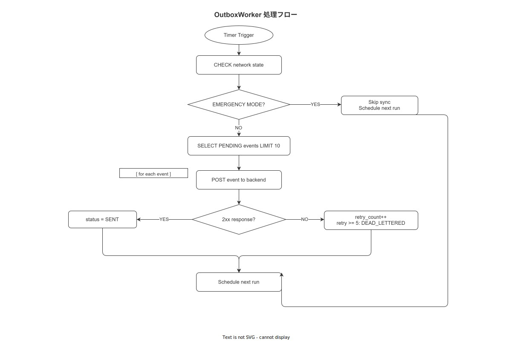

# 05 OutboxWorker 詳細設計

本章は MOD-FE-HA-002（OutboxWorker）の詳細設計を確定する。端末 SQLite の outbox_events テーブルを読み出してバックエンド API に POST し、同期状態を管理するトランザクショナルアウトボックスパターンの実装仕様を定める。FR-SY-005（Outbox 送信）・FR-SY-006（DLQ）をカバーする。

**図 1: OutboxWorker 処理フロー**



> 原本: [`img/fig_dd_ha_outbox_worker_flow.drawio`](img/fig_dd_ha_outbox_worker_flow.drawio)

---

## 1. OutboxEvent 型定義

```typescript
// src/features/network/outbox/types.ts

export type OutboxEventType =
  | 'STEP_COMPLETED'
  | 'WORK_STARTED'
  | 'WORK_COMPLETED'
  | 'SUSPENDED'
  | 'RESUMED'
  | 'ANDON_RAISED'
  | 'ANDON_RESOLVED'
  | 'NONCONFORMITY_REGISTERED'
  | 'EVIDENCE_UPLOADED';

export type OutboxEventStatus =
  | 'PENDING'        // 未送信
  | 'SENDING'        // 送信中（端末クラッシュ対応: SENDING のまま残ったら PENDING に戻す）
  | 'SENT'           // 送信成功
  | 'DEAD_LETTERED'; // リトライ上限超過

export interface LocalOutboxEvent {
  outboxEventId: string;    // UUID v7（TEXT in SQLite）
  eventType: OutboxEventType;
  payload: string;          // JSON 文字列
  createdAt: string;        // ISO 8601
  status: OutboxEventStatus;
  retryCount: number;       // デフォルト 0
  lastAttemptAt: string | null;
  errorMessage: string | null;
}

export interface ProcessResult {
  processed: number;  // 試行件数
  succeeded: number;  // 成功件数
  failed: number;     // 失敗件数
  deadLettered: number;  // DLQ 送り件数
}
```

---

## 2. OutboxWorker クラス（FNC-FE-011）

```typescript
// src/features/network/outbox/OutboxWorker.ts
import BackgroundFetch from 'react-native-background-fetch';

import type { LocalDbService } from '../../../shared/db/LocalDbService';
import type { ApiClient } from '../../../shared/api/ApiClient';
import type { ClockService } from '../../../shared/clock/ClockService';
import type { LocalOutboxEvent, ProcessResult } from './types';
import type { NetworkState } from '../types';

/** CFG-OBX-001: 処理間隔（ミリ秒）デフォルト 30,000 ms */
const DEFAULT_INTERVAL_MS = 30_000;

/** CFG-OBX-002: 1 回の処理バッチサイズ（件） */
const BATCH_SIZE = 10;

/** CFG-OBX-003: 最大リトライ回数 */
const MAX_RETRY_COUNT = 5;

/** CFG-OBX-004: リトライ間隔の底（指数バックオフ: base^retryCount 秒） */
const RETRY_BASE_SECONDS = 2;

/** CFG-OBX-005: Emergency Mode 閾値（ミリ秒）デフォルト 300,000 ms = 5 分 */
export const EMERGENCY_THRESHOLD_MS = 5 * 60 * 1_000;

export type NetworkState = 'CONNECTED' | 'DEGRADED' | 'DISCONNECTED' | 'EMERGENCY_MODE';

export class OutboxWorker {
  private intervalId: ReturnType<typeof setInterval> | null = null;
  private readonly intervalMs: number;  // CFG-OBX-001

  constructor(
    private readonly localDb: LocalDbService,
    private readonly apiClient: ApiClient,
    private readonly clock: ClockService,
    intervalMs: number = DEFAULT_INTERVAL_MS,
  ) {
    this.intervalMs = intervalMs;
  }

  /** OutboxWorker を起動（アプリ起動時に一度だけ呼ぶ） */
  start(): void {
    if (this.intervalId != null) return;
    this.intervalId = setInterval(() => {
      void this.processQueue();
    }, this.intervalMs);

    // react-native-background-fetch による OS バックグラウンドタスク登録
    BackgroundFetch.configure(
      {
        minimumFetchInterval: 15,  // iOS: 最小 15 分
        stopOnTerminate: false,
        startOnBoot: true,
      },
      async (taskId: string) => {
        await this.processQueue();
        BackgroundFetch.finish(taskId);
      },
      (taskId: string) => {
        BackgroundFetch.finish(taskId);
      },
    );
  }

  /** OutboxWorker を停止 */
  stop(): void {
    if (this.intervalId != null) {
      clearInterval(this.intervalId);
      this.intervalId = null;
    }
  }

  /**
   * FNC-FE-011: Outbox キュー処理
   * 1. outbox_events から PENDING を最大 BATCH_SIZE 件取得
   * 2. ネットワーク状態を確認（DISCONNECTED / EMERGENCY_MODE は送信スキップ）
   * 3. 各イベントを POST /api/v1/events/ingest
   * 4. 成功: status = 'SENT'
   * 5. 失敗（4xx 以外）: retryCount++ + 指数バックオフ
   * 6. retryCount > MAX_RETRY_COUNT: status = 'DEAD_LETTERED'
   */
  async processQueue(): Promise<ProcessResult> {
    const result: ProcessResult = {
      processed: 0,
      succeeded: 0,
      failed: 0,
      deadLettered: 0,
    };

    // ネットワーク状態確認
    const networkState = await this.localDb.getNetworkState();
    if (networkState === 'DISCONNECTED' || networkState === 'EMERGENCY_MODE') {
      return result;  // オフライン時は送信スキップ
    }

    // SENDING のまま残ったイベントを PENDING に戻す（クラッシュリカバリ）
    await this.localDb.resetStaleOutboxEvents();

    // PENDING イベントをバッチ取得
    const events = await this.localDb.getPendingOutboxEvents(BATCH_SIZE);

    for (const event of events) {
      result.processed++;

      // リトライ待機時間チェック（指数バックオフ）
      if (!this.isRetryReady(event)) {
        continue;
      }

      // status を SENDING に更新（クラッシュ保護）
      await this.localDb.updateOutboxEventStatus(event.outboxEventId, 'SENDING');

      try {
        await this.apiClient.postEvent(event);
        await this.localDb.updateOutboxEventStatus(event.outboxEventId, 'SENT');
        result.succeeded++;
      } catch (error) {
        const retryCount = event.retryCount + 1;

        if (retryCount > MAX_RETRY_COUNT) {
          // DLQ 送り
          await this.localDb.updateOutboxEventDeadLettered(
            event.outboxEventId,
            String(error),
          );
          result.deadLettered++;
        } else {
          // リトライ可能: PENDING に戻す + retryCount++
          await this.localDb.updateOutboxEventForRetry(
            event.outboxEventId,
            retryCount,
            this.clock.nowIso(),
            String(error),
          );
          result.failed++;
        }
      }
    }

    return result;
  }

  /**
   * 新規イベントを Outbox キューに追加
   * completeStep / suspend / raiseAndon 等から呼ばれる
   */
  async enqueue(workEvent: WorkEventEntity): Promise<void> {
    const outboxEvent: LocalOutboxEvent = {
      outboxEventId: uuidv7(),
      eventType: this.resolveEventType(workEvent.activity),
      payload: JSON.stringify(workEvent),
      createdAt: this.clock.nowIso(),
      status: 'PENDING',
      retryCount: 0,
      lastAttemptAt: null,
      errorMessage: null,
    };
    await this.localDb.insertOutboxEvent(outboxEvent);
  }

  /** 指数バックオフによるリトライ待機時間の確認 */
  private isRetryReady(event: LocalOutboxEvent): boolean {
    if (event.retryCount === 0) return true;
    if (event.lastAttemptAt == null) return true;

    const waitMs = Math.pow(RETRY_BASE_SECONDS, event.retryCount) * 1_000;
    const lastAttempt = new Date(event.lastAttemptAt).getTime();
    const now = new Date(this.clock.nowIso()).getTime();
    return now - lastAttempt >= waitMs;
  }

  private resolveEventType(activity: string): OutboxEventType {
    const map: Record<string, OutboxEventType> = {
      step_completed: 'STEP_COMPLETED',
      work_started: 'WORK_STARTED',
      work_completed: 'WORK_COMPLETED',
      suspended: 'SUSPENDED',
      resumed: 'RESUMED',
      andon_raised: 'ANDON_RAISED',
      andon_resolved: 'ANDON_RESOLVED',
      nonconformity_registered: 'NONCONFORMITY_REGISTERED',
      evidence_uploaded: 'EVIDENCE_UPLOADED',
    };
    return map[activity] ?? 'STEP_COMPLETED';
  }
}
```

---

## 3. ネットワーク状態と Outbox 挙動

| NetworkState | Outbox 送信 | UI 表示 |
|---|---|---|
| CONNECTED | 即時送信（intervalMs ごとにバッチ）| 通常表示 |
| DEGRADED | 送信継続（タイムアウト延長）| 遅延インジケーター表示 |
| DISCONNECTED | 送信スキップ・蓄積継続 | OFFLINE バナー表示 |
| EMERGENCY_MODE | 送信スキップ・蓄積継続 | フルスクリーン警告 + 最終同期時刻 |

### 3-1. Emergency Mode への遷移

```typescript
// src/features/network/NetworkProvider.tsx（概要）

const EMERGENCY_THRESHOLD_MS = 5 * 60 * 1_000;  // CFG-OBX-005

function computeNetworkState(
  isConnected: boolean,
  disconnectedSinceMs: number,
): NetworkState {
  if (isConnected) return 'CONNECTED';
  if (disconnectedSinceMs >= EMERGENCY_THRESHOLD_MS) return 'EMERGENCY_MODE';
  return 'DISCONNECTED';
}
```

---

## 4. DLQ 監視（FR-SY-006）

```typescript
// src/features/network/outbox/DLQMonitor.ts

export interface DLQSummary {
  totalDeadLettered: number;
  oldestDeadLetteredAt: string | null;
  events: Array<{
    outboxEventId: string;
    eventType: OutboxEventType;
    errorMessage: string | null;
    createdAt: string;
  }>;
}

/** DLQ 状態取得（SCR-HA-015 設定画面で表示） */
export async function getDLQSummary(localDb: LocalDbService): Promise<DLQSummary> {
  return localDb.getDLQSummary();
}

/** DLQ イベントの手動再投入（端末側） */
export async function reprocessDLQEvent(
  outboxEventId: string,
  localDb: LocalDbService,
): Promise<void> {
  await localDb.updateOutboxEventStatus(outboxEventId, 'PENDING');
  await localDb.resetOutboxEventRetryCount(outboxEventId);
}
```

---

## 5. 設定パラメータ一覧

| CFG-ID | パラメータ名 | デフォルト値 | 変更可否 |
|---|---|---|---|
| CFG-OBX-001 | outbox.interval_ms | 30,000 | LocalAppSettings 経由で変更可 |
| CFG-OBX-002 | outbox.batch_size | 10 | LocalAppSettings 経由で変更可 |
| CFG-OBX-003 | outbox.max_retry_count | 5 | 変更不可（ハードコード）|
| CFG-OBX-004 | outbox.retry_base_seconds | 2 | 変更不可（ハードコード）|
| CFG-OBX-005 | network.emergency_threshold_ms | 300,000 | LocalAppSettings 経由で変更可 |
| CFG-OBX-006 | outbox.sent_retention_days | 7 | LocalAppSettings 経由で変更可 |

---

## 6. エラーコード対応表

| エラーコード | 発生条件 | 対応 |
|---|---|---|
| ERR-SYS-004 | SQLite outbox_events の READ 失敗 | processQueue をスキップ、次回インターバルで再試行 |
| ERR-SYS-005 | POST /api/v1/events/ingest が 5xx | retryCount++ + 指数バックオフ |
| ERR-SYS-006 | POST が 4xx（クライアントエラー）| 即 DEAD_LETTERED（リトライ不要）|

---

**本節で確定した方針**
- **OutboxWorker はトランザクショナルアウトボックスパターンで実装し、PENDING → SENDING → SENT / DEAD_LETTERED の状態遷移を SQLite の原子的な UPDATE で管理することで端末クラッシュ時の二重送信を防止した。**
- **ネットワーク状態（CONNECTED / DEGRADED / DISCONNECTED / EMERGENCY_MODE）に基づいて送信の有無を制御し、P1（Offline-First）原則を OutboxWorker レベルで完全遵守した。**
- **指数バックオフ（2^retryCount 秒）と最大リトライ 5 回の DLQ 機能により、一時的なバックエンド障害では自動回復し、恒久的なエラーは DEAD_LETTERED として分離した。**

---

## 参照業界分析

### 必須
- [`90_業界分析/18_現場HCIと作業者インターフェース.md`](../../90_業界分析/18_現場HCIと作業者インターフェース.md)

### 関連
- [`90_業界分析/12_認知工学と状況認識.md`](../../90_業界分析/12_認知工学と状況認識.md)
