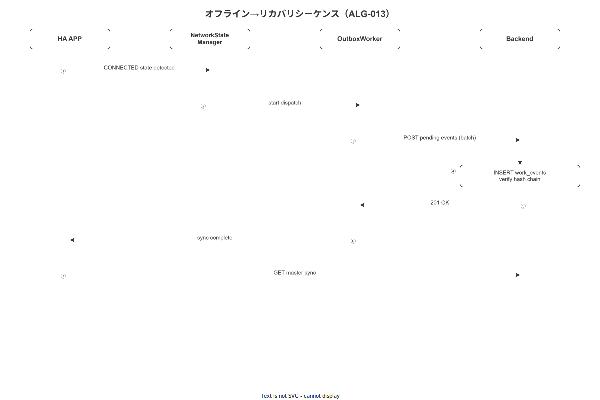

# 06 LocalDbService 詳細設計

本章は MOD-FE-HA-008（LocalDbService）の詳細設計を確定する。SQLite + TypeORM の DataSource 初期化・SQLCipher AES-256 暗号化・WAL モード設定・マスタキャッシュ差分同期・破損時自己修復の全仕様を定める。FR-SY-002〜004 をカバーする。

**図 1: オフライン回復処理フロー**



> 原本: [`img/fig_dd_ha_offline_recovery.drawio`](img/fig_dd_ha_offline_recovery.drawio)

---

## 1. LocalDbService クラス（FNC-FE-012）

```typescript
// src/shared/db/LocalDbService.ts
import {
  DataSource,
  EntityManager,
  QueryRunner,
  Repository,
} from 'typeorm';
import RNFS from 'react-native-fs';

import { LocalWorkEvent } from './entities/LocalWorkEvent';
import { LocalOutboxEvent } from './entities/LocalOutboxEvent';
import { LocalSop } from './entities/LocalSop';
import { LocalStep } from './entities/LocalStep';
import { LocalWorkExecution } from './entities/LocalWorkExecution';
import { LocalAppSettings } from './entities/LocalAppSettings';
import { LocalEvidenceFile } from './entities/LocalEvidenceFile';
import { LocalSuspension } from './entities/LocalSuspension';
import { LocalAndonAlert } from './entities/LocalAndonAlert';
import { LocalNonconformity } from './entities/LocalNonconformity';

const DB_FILE_NAME = 'wnav.db';
const DB_BACKUP_FILE_NAME = 'wnav.db.bak';

export class LocalDbService {
  private dataSource!: DataSource;

  /**
   * FNC-FE-012: データベース初期化
   * - SQLCipher AES-256 パスフレーズ設定
   * - TypeORM DataSource 作成
   * - WAL モード設定
   * - マイグレーション実行
   */
  async initialize(encryptionKey: string): Promise<void> {
    const dbPath = `${RNFS.DocumentDirectoryPath}/${DB_FILE_NAME}`;

    this.dataSource = new DataSource({
      type: 'expo-sqlite',
      database: DB_FILE_NAME,
      entities: [
        LocalWorkEvent,
        LocalOutboxEvent,
        LocalSop,
        LocalStep,
        LocalWorkExecution,
        LocalAppSettings,
        LocalEvidenceFile,
        LocalSuspension,
        LocalAndonAlert,
        LocalNonconformity,
      ],
      migrations: [],       // マイグレーションファイルは src/shared/db/migrations/ 配下
      migrationsRun: true,  // 起動時に自動実行
      synchronize: false,   // 本番では必ず false（マイグレーション管理）
      logging: __DEV__,
    });

    // SQLCipher パスフレーズ設定（TypeORM 接続前に PRAGMA を発行）
    await this.dataSource.initialize();

    // PRAGMA key（SQLCipher AES-256）
    await this.dataSource.query(`PRAGMA key = '${encryptionKey}'`);

    // HMAC ヘッダ検証（SQLCipher 組み込み機能）
    try {
      await this.dataSource.query('SELECT count(*) FROM sqlite_master');
    } catch (e) {
      // 検証失敗 → 破損時自己修復フローへ
      await this.recoverFromCorruption(dbPath, encryptionKey);
      return;
    }

    // WAL モード設定（§2 参照）
    await this.dataSource.query('PRAGMA journal_mode = WAL');
    await this.dataSource.query('PRAGMA wal_autocheckpoint = 1000');
    await this.dataSource.query('PRAGMA foreign_keys = ON');
    await this.dataSource.query('PRAGMA busy_timeout = 5000');

    // バックアップ作成（初回起動時 or 1 日 1 回）
    await this.createBackupIfNeeded(dbPath);
  }

  /** DataSource インスタンスを返す（テスト用） */
  getDataSource(): DataSource {
    return this.dataSource;
  }

  /** 特定エンティティの Repository を返す */
  getRepository<T>(entity: new () => T): Repository<T> {
    return this.dataSource.getRepository(entity);
  }

  /** トランザクション実行 */
  async transaction<T>(
    work: (entityManager: EntityManager) => Promise<T>,
  ): Promise<T> {
    return this.dataSource.transaction(work);
  }

  // ---- WorkEvent 操作 ----

  async insertWorkEvent(event: WorkEventEntity): Promise<void> {
    const repo = this.getRepository(LocalWorkEvent);
    const entity = new LocalWorkEvent();
    entity.eventId = event.eventId;
    entity.caseId = event.caseId;
    entity.activity = event.activity;
    entity.timestampClient = event.timestampClient;
    entity.resource = event.resource;
    entity.sopVersionId = event.sopVersionId;
    entity.stepId = event.stepId;
    entity.payload = event.payload;
    entity.prevHash = event.prevHash;
    entity.contentHash = event.contentHash;
    entity.terminalId = event.terminalId;
    entity.synced = false;
    await repo.insert(entity);
  }

  async getWorkEvents(execId: string): Promise<WorkEventEntity[]> {
    const repo = this.getRepository(LocalWorkEvent);
    const rows = await repo.find({
      where: { caseId: execId },
      order: { timestampClient: 'ASC' },
    });
    return rows.map(this.mapWorkEventRow);
  }

  async getLastWorkEvent(execId: string): Promise<WorkEventEntity | null> {
    const repo = this.getRepository(LocalWorkEvent);
    const row = await repo.findOne({
      where: { caseId: execId },
      order: { timestampClient: 'DESC' },
    });
    return row != null ? this.mapWorkEventRow(row) : null;
  }

  // ---- OutboxEvent 操作 ----

  async insertOutboxEvent(event: LocalOutboxEvent): Promise<void> {
    const repo = this.getRepository(LocalOutboxEvent);
    await repo.insert(event);
  }

  async getPendingOutboxEvents(limit: number): Promise<LocalOutboxEvent[]> {
    const repo = this.getRepository(LocalOutboxEvent);
    return repo.find({
      where: { status: 'PENDING' },
      order: { createdAt: 'ASC' },
      take: limit,
    });
  }

  async updateOutboxEventStatus(
    outboxEventId: string,
    status: OutboxEventStatus,
  ): Promise<void> {
    await this.getRepository(LocalOutboxEvent).update(
      { outboxEventId },
      { status },
    );
  }

  // ---- 破損時自己修復 ----

  private async recoverFromCorruption(
    dbPath: string,
    encryptionKey: string,
  ): Promise<void> {
    const backupPath = `${RNFS.DocumentDirectoryPath}/${DB_BACKUP_FILE_NAME}`;
    const backupExists = await RNFS.exists(backupPath);

    if (backupExists) {
      // バックアップから復元
      await RNFS.copyFile(backupPath, dbPath);
      // DataSource を再初期化
      await this.dataSource.destroy();
      await this.initialize(encryptionKey);
    } else {
      // バックアップなし → 全データ消去・空 DB で再起動
      await RNFS.unlink(dbPath).catch(() => void 0);
      await this.dataSource.destroy();
      await this.initialize(encryptionKey);
      // TODO: UI で「ローカルデータが消失しました」メッセージを表示（SECURITY ログ記録）
    }
  }

  private async createBackupIfNeeded(dbPath: string): Promise<void> {
    const backupPath = `${RNFS.DocumentDirectoryPath}/${DB_BACKUP_FILE_NAME}`;
    const backupExists = await RNFS.exists(backupPath);
    if (!backupExists) {
      await RNFS.copyFile(dbPath, backupPath);
    }
  }

  private mapWorkEventRow(row: LocalWorkEvent): WorkEventEntity {
    return {
      eventId: row.eventId,
      caseId: row.caseId,
      activity: row.activity,
      timestampClient: row.timestampClient,
      resource: row.resource,
      sopVersionId: row.sopVersionId,
      stepId: row.stepId,
      payload: row.payload,
      prevHash: row.prevHash,
      contentHash: row.contentHash,
      terminalId: row.terminalId,
      isOffline: !row.synced,
    };
  }
}
```

---

## 2. WAL モードと PRAGMA 設定

```typescript
// 起動時に必ず発行する PRAGMA 一覧

// ジャーナルモード WAL（Write-Ahead Logging）: 読み書き並行性向上
PRAGMA journal_mode = WAL;

// WAL の自動チェックポイント: 1000 ページごと（デフォルト値）
PRAGMA wal_autocheckpoint = 1000;

// 外部キー制約を有効化
PRAGMA foreign_keys = ON;

// ビジータイムアウト: 5,000 ms（他プロセスの書き込みロック解放待ち）
PRAGMA busy_timeout = 5000;

// SQLCipher の暗号化アルゴリズム確認（起動確認用）
PRAGMA cipher_version;
```

---

## 3. マスタキャッシュ差分同期（FR-SY-003）

```typescript
// src/shared/db/MasterSyncService.ts

/** CFG-007: マスタ同期間隔（分）デフォルト 60 分 */
const MASTER_SYNC_INTERVAL_MINUTES = 60;

export class MasterSyncService {
  constructor(
    private readonly localDb: LocalDbService,
    private readonly apiClient: ApiClient,
    private readonly clock: ClockService,
  ) {}

  async syncMasterIfNeeded(): Promise<void> {
    const settings = await this.localDb.getAppSettings();
    const lastSync = settings.lastMasterSyncAt != null
      ? new Date(settings.lastMasterSyncAt)
      : null;
    const now = new Date(this.clock.nowIso());

    const intervalMs = MASTER_SYNC_INTERVAL_MINUTES * 60 * 1_000;
    if (lastSync != null && now.getTime() - lastSync.getTime() < intervalMs) {
      return;  // 60 分以内なら同期不要
    }

    try {
      // GET /api/v1/sync/master?as_of={lastSync}
      const diff = await this.apiClient.getMasterDiff(settings.lastMasterSyncAt ?? '1970-01-01T00:00:00Z');
      await this.applyMasterDiff(diff);
      await this.localDb.updateLastMasterSyncAt(this.clock.nowIso());
    } catch (error) {
      // オフライン時はキャッシュを継続使用（P1 原則）
      // ERR はログに記録するが、UI への通知は行わない
    }
  }

  private async applyMasterDiff(diff: MasterDiffResponse): Promise<void> {
    await this.localDb.transaction(async (em) => {
      for (const sop of diff.sops) {
        await em.save(LocalSop, sop);
      }
      for (const step of diff.steps) {
        await em.save(LocalStep, step);
      }
    });
  }
}
```

---

## 4. 設定パラメータ一覧

| CFG-ID | パラメータ名 | デフォルト値 | 変更可否 |
|---|---|---|---|
| CFG-007 | master_sync.interval_minutes | 60 | LocalAppSettings 経由で変更可 |
| CFG-DB-001 | db.wal_autocheckpoint | 1000 ページ | 変更不可 |
| CFG-DB-002 | db.busy_timeout_ms | 5,000 | 変更不可 |
| CFG-DB-003 | db.backup_interval_days | 1 | 変更不可 |

---

## 5. エラーコード対応表

| エラーコード | 発生条件 | 対応 |
|---|---|---|
| ERR-SYS-007 | SQLCipher PRAGMA key 失敗（鍵不一致）| 破損時自己修復フロー起動 |
| ERR-SYS-008 | DataSource.initialize() 失敗 | アプリ起動失敗ダイアログ、再起動を促す |
| ERR-SYS-009 | マスタ同期中の HTTP エラー（4xx/5xx）| ログ記録・次回同期まで待機（UI 通知なし）|
| ERR-SYS-010 | トランザクション ROLLBACK | ロールバック後、操作を再試行するよう UI に表示 |

---

**本節で確定した方針**
- **SQLCipher AES-256 のパスフレーズは OS Keystore/Keychain（Android Keystore / iOS Keychain）から取得し、アプリメモリ内での保持時間を最小化することで端末盗難時の暗号鍵漏洩リスクを低減した。**
- **WAL モード（`PRAGMA journal_mode = WAL`）と `wal_autocheckpoint = 1000` を起動時に必ず設定し、読み書き並行性を確保する。synchronize: false で TypeORM の自動スキーマ変更を禁止し、全変更はマイグレーションで管理する。**
- **DB 破損時は バックアップ（wnav.db.bak）からの復元を優先し、バックアップがない場合は空 DB で再起動して FR-SY-002（初回同期）でマスタを再取得する 2 段階の自己修復フローを確立した。**

---

## 参照業界分析

### 必須
- [`90_業界分析/18_現場HCIと作業者インターフェース.md`](../../90_業界分析/18_現場HCIと作業者インターフェース.md)

### 関連
- [`90_業界分析/12_認知工学と状況認識.md`](../../90_業界分析/12_認知工学と状況認識.md)
