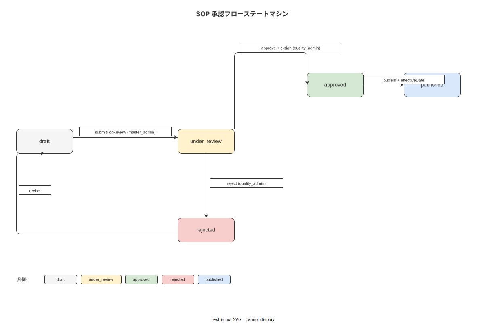
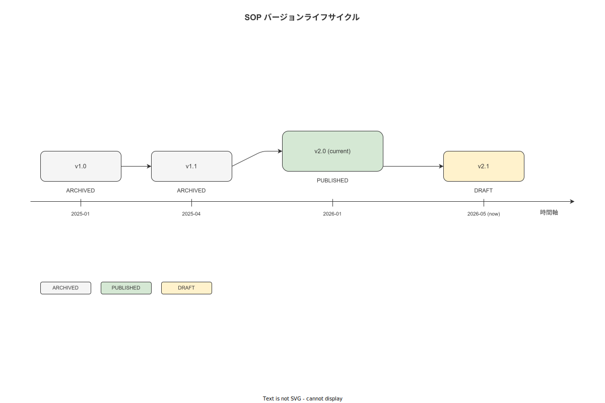

# 03 ApprovalWorkflow 詳細設計

本章は MOD-FE-MA-003（ApprovalWorkflow）の TypeScript インターフェース・承認フローステートマシン定義・遷移イベント一覧・react-query Mutation フック・電子サイン連携仕様を確定する。ApprovalWorkflow は FR-MA-008〜010 で要求されるレビュー・承認・公開フローを担い、SCR-MA-007/008/009 の UI ロジックを中核で支える。

**図 1: SOP 承認フロー**



> 原本: [`img/fig_dd_wa_sop_approval_flow.drawio`](img/fig_dd_wa_sop_approval_flow.drawio)

**図 2: SOP バージョン状態遷移図**



> 原本: [`img/fig_dd_wa_sop_version_states.drawio`](img/fig_dd_wa_sop_version_states.drawio)

---

## 1. モジュール概要

| 項目 | 内容 |
|---|---|
| MOD-ID | MOD-FE-MA-003 |
| 物理名 | ApprovalWorkflow |
| ファイルパス | `src/features/approval/` |
| 関連 FR | FR-MA-008（レビュー依頼）・FR-MA-009（承認サイン）・FR-MA-010（公開設定）|
| 関連 SCR | SCR-MA-007（レビュー依頼）・SCR-MA-008（承認サイン）・SCR-MA-009（公開設定）|
| アクセスロール | master_admin（レビュー依頼・公開依頼）・quality_admin（承認・却下・公開実行）|

---

## 2. 承認フロー状態定義

承認フローは discriminated union による型安全なステートマシンで表現する。

```typescript
// 承認フロー状態（5 状態の discriminated union）
export type ApprovalState =
  | { status: 'draft' }
  | {
      status: 'under_review';
      reviewRequestedAt: Date;
      requestedBy: string;  // user UUID
    }
  | {
      status: 'approved';
      approvedAt: Date;
      approvedBy: string;  // user UUID（quality_admin）
      /** 電子サイン ID（TBL-002 signatures.id）*/
      signId: string;
    }
  | {
      status: 'rejected';
      rejectedAt: Date;
      rejectedBy: string;  // user UUID（quality_admin）
      reason: string;
    }
  | {
      status: 'published';
      publishedAt: Date;
      /** null = 即時有効、Date = 指定日付から有効 */
      effectiveDate: Date | null;
    };
```

### 2-1. 状態遷移表

| 現状態 | イベント | 次状態 | 実行ロール |
|---|---|---|---|
| draft | submitForReview | under_review | master_admin |
| under_review | approve | approved | quality_admin |
| under_review | reject | rejected | quality_admin |
| approved | publish | published | quality_admin |
| rejected | resubmit | under_review | master_admin |
| rejected | backToDraft | draft | master_admin |

禁止遷移:

| 現状態 | 禁止イベント | 理由 |
|---|---|---|
| published | すべての遷移イベント | 公開済みバージョンは不変（BR-BUS-015）|
| under_review | submitForReview | 二重送信防止 |
| draft | approve / reject / publish | 不正遷移（ERR-BIZ-006）|

---

## 3. コンポーネント Props 定義

```typescript
// ApprovalWorkflow コンポーネント
export interface ApprovalWorkflowProps {
  versionId: string;
  currentState: ApprovalState;
  /** SCR-MA-007: master_admin がレビュー依頼を送付する */
  onSubmitForReview: (comment: string) => Promise<void>;
  /** SCR-MA-008: quality_admin が電子サイン付きで承認する */
  onApprove: (signId: string) => Promise<void>;
  /** SCR-MA-008: quality_admin が却下理由を入力して却下する */
  onReject: (reason: string) => Promise<void>;
  /** SCR-MA-009: quality_admin が有効化日付（null = 即時）を指定して公開する */
  onPublish: (effectiveDate: Date | null) => Promise<void>;
}
```

---

## 4. ステートマシンフック（FNC-FE-006）

```typescript
import type { ApprovalState } from './types';

/**
 * FNC-FE-006: 承認フロー状態機械フック
 *
 * @param versionId - SOP バージョン UUID
 * @returns 現在の ApprovalState と、状態に応じた許可イベント一覧
 */
export declare function useApprovalStateMachine(versionId: string): {
  state: ApprovalState;
  /** 現状態で実行可能なイベント名の配列 */
  allowedEvents: ApprovalEvent[];
  isLoading: boolean;
  error: Error | null;
};

export type ApprovalEvent =
  | 'submitForReview'
  | 'approve'
  | 'reject'
  | 'publish'
  | 'resubmit'
  | 'backToDraft';
```

### 4-1. 状態遷移 Mutation フック（FNC-FE-007）

```typescript
import { useMutation, UseMutationResult } from '@tanstack/react-query';

/**
 * FNC-FE-007: 承認フロー状態遷移 Mutation フック
 * 遷移成功後に useApprovalStateMachine のクエリキャッシュを無効化する
 */
export declare function useApprovalMutation(versionId: string): {
  submitForReview: UseMutationResult<void, Error, { comment: string }>;
  approve: UseMutationResult<void, Error, { signId: string }>;
  reject: UseMutationResult<void, Error, { reason: string }>;
  publish: UseMutationResult<void, Error, { effectiveDate: Date | null }>;
};
```

---

## 5. 電子サイン連携仕様（SCR-MA-008）

承認操作（approve イベント）は電子サイン（MOD-FE-HA-007 ElectronicSignPad）の取得後に実行する。

```typescript
// 電子サイン取得フロー
export interface ApprovalSignFlow {
  /** 1. サインパッド UI を開く */
  openSignPad: () => void;
  /** 2. サイン完了時に signId を取得し onApprove に渡す */
  onSignComplete: (signId: string) => Promise<void>;
  /** 3. サインキャンセル時は承認フローを中断する */
  onSignCancel: () => void;
}

// サイン検証（API-NNN 経由でバックエンド署名検証を行う）
export interface SignVerificationResult {
  signId: string;
  isValid: boolean;
  signedAt: Date;
  signerUserId: string;
}
```

---

## 6. コンポーネントツリー

```
ApprovalWorkflow (MOD-FE-MA-003)
  ApprovalStateIndicator（現状態バッジ・タイムスタンプ表示）
  ApprovalActionPanel（状態に応じて表示するアクションボタン）
    [draft 時]     SubmitForReviewButton → ReviewCommentDialog
    [under_review 時 / quality_admin]
                   ApproveButton → SignPadModal → useApprovalMutation.approve
                   RejectButton → RejectReasonDialog → useApprovalMutation.reject
    [under_review 時 / master_admin]
                   （読み取り専用・レビュー中バナー）
    [approved 時]  PublishButton → EffectiveDatePicker → useApprovalMutation.publish
    [rejected 時]  ResubmitButton → ReviewCommentDialog
                   BackToDraftButton
    [published 時] （すべてのボタン非表示・公開済みバナー）
  ApprovalHistoryTimeline（遷移履歴の時系列表示）
```

---

## 7. エラーハンドリング

| エラーコード | 発生条件 | UI 対応 |
|---|---|---|
| ERR-BIZ-006 | 禁止遷移の試行 | アクションボタン非活性・エラートースト |
| ERR-BIZ-007 | 電子サイン検証失敗 | SignPadModal にエラーメッセージ・再試行 |
| ERR-AUTH-003 | RBAC 不足（ロール不一致）| アクションボタン非表示（role 条件付きレンダリング）|
| ERR-VAL-012 | rejectReason が空文字 | フィールドバリデーション・送信ブロック |
| ERR-VAL-013 | effectiveDate が過去日付 | 日付ピッカーバリデーション・送信ブロック |

---

**本節で確定した方針**
- **承認フロー状態を discriminated union（5 状態）で定義し、TypeScript の型ナロウイングにより各状態で存在するフィールドのみにアクセス可能とすることを確定した。**
- **published 状態からのいかなる遷移も禁止し（BR-BUS-015）、useApprovalStateMachine が allowedEvents に空配列を返すことで UI レベルでもすべてのボタンを非表示にすることを確定した。**
- **承認操作（approve イベント）は電子サイン signId の取得を前提とし、SignPadModal での検証成功なしには Mutation が呼ばれない実装フローを確定した。**

---

## 参照業界分析

### 必須
- [`90_業界分析/25_作業指示書とSOPの構造化・表現論.md`](../../90_業界分析/25_作業指示書とSOPの構造化・表現論.md)

### 関連
- [`90_業界分析/18_現場HCIと作業者インターフェース.md`](../../90_業界分析/18_現場HCIと作業者インターフェース.md)
