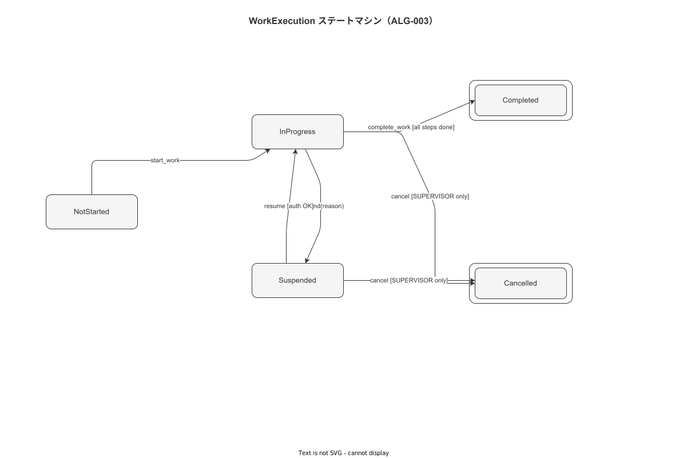

# 01 StepEngine アルゴリズム詳細

本章は製造作業ナビゲーションシステムの中核アルゴリズムである StepEngine（FNC-FE-001〜004, FNC-BE-001〜005）のロックステップ進行制御・CompleteStep 処理・WorkExecution ステートマシン遷移の全仕様を確定する。対応する機能要件は FR-NV-001〜006、業務ルールは BR-BUS-001/003 である。

---

## 1. CanAdvanceToStep アルゴリズム（ALG-001, FNC-FE-001）

CanAdvanceToStep はハンディ APP の StepEngine が次ステップへの遷移可否を判定するアルゴリズムである。BR-BUS-001（ステップスキップ禁止）・BR-BUS-003（証拠添付必須）を強制する中心的ガード関数として機能する。

```
ALGORITHM CanAdvanceToStep(execId, targetStepIndex):
  INPUT:
    execId          : UUID       -- 作業実行セッション ID
    targetStepIndex : Int        -- 遷移先ステップのインデックス（0-based）
  OUTPUT:
    { canAdvance: Boolean, reason?: AdvanceBlockReason }

  STEP 1: 作業セッションの存在確認
    execution ← LOAD work_executions WHERE id = execId
    IF execution IS NULL:
      RETURN { canAdvance: false, reason: EXECUTION_NOT_FOUND }

  STEP 2: 作業セッション状態確認
    IF execution.status ≠ IN_PROGRESS:
      RETURN { canAdvance: false, reason: EXECUTION_NOT_ACTIVE }
      -- ステータスが SUSPENDED / COMPLETED / CANCELLED の場合は操作不可

  STEP 3: 完了済みステップへの後退禁止
    IF targetStepIndex ≤ execution.current_step_index:
      RETURN { canAdvance: false, reason: STEP_ALREADY_COMPLETED }

  STEP 4: スキップ禁止（BR-BUS-001）
    IF targetStepIndex > execution.current_step_index + 1:
      RETURN { canAdvance: false, reason: SKIPPED_STEP }
      -- エラーコード ERR-BIZ-001 に対応

  STEP 5: 直前ステップの証拠確認（BR-BUS-003）
    prevStepIndex ← targetStepIndex - 1
    IF prevStepIndex ≥ 0:
      prevStep ← execution.steps[prevStepIndex]
      IF prevStep.evidence_required = TRUE:
        evidenceCount ← COUNT(work_events
          WHERE case_id    = execId
            AND activity   = 'evidence_attached'
            AND step_id    = prevStep.id)
        IF evidenceCount = 0:
          RETURN { canAdvance: false, reason: EVIDENCE_REQUIRED }
          -- エラーコード ERR-BIZ-003 に対応

  STEP 6: 直前ステップの署名確認
    IF prevStep.sign_required = TRUE:
      signEvent ← FIND(work_events
        WHERE case_id  = execId
          AND activity = 'sign_applied'
          AND step_id  = prevStep.id)
      IF signEvent IS NULL:
        RETURN { canAdvance: false, reason: SIGN_REQUIRED }

  STEP 7: 全ガード通過
    RETURN { canAdvance: true }
```

### 1-1. TypeScript 型定義

```typescript
type AdvanceBlockReason =
  | 'EXECUTION_NOT_FOUND'
  | 'EXECUTION_NOT_ACTIVE'
  | 'STEP_ALREADY_COMPLETED'
  | 'SKIPPED_STEP'           // BR-BUS-001
  | 'EVIDENCE_REQUIRED'      // BR-BUS-003
  | 'SIGN_REQUIRED';

interface CanAdvanceResult {
  canAdvance: boolean;
  reason?: AdvanceBlockReason;
}

// FNC-FE-001
async function canAdvanceToStep(
  execId: string,
  targetStepIndex: number,
  db: SQLiteDatabase,
): Promise<CanAdvanceResult>
```

---

## 2. CompleteStep アルゴリズム（ALG-002, FNC-FE-002 / FNC-BE-002）

CompleteStep はステップ完了イベントをローカル SQLite（ハンディ APP）および PostgreSQL（バックエンド）にアトミックに記録し、ハッシュチェーンブロックを生成する。

```
ALGORITHM CompleteStep(cmd):
  INPUT:
    execId         : UUID     -- 作業実行セッション ID
    stepId         : UUID     -- 完了するステップ ID
    input          : StepInput -- 入力値（数値・文字列・選択肢）
    eventId        : UUID v7  -- クライアント事前生成のイベント ID（冪等性キー）

  PRECONDITION:
    CanAdvanceToStep(execId, targetStepIndex) = { canAdvance: true }
    -- 不成立の場合は AppError を RAISE し処理を中断する

  STEP 1: 入力バリデーション
    ValidateStepInput(input, stepDefinition)
    -- range check → ERR-VAL-002
    -- required check → ERR-VAL-001

  STEP 2: 冪等性チェック（バックエンド側）
    IF EXISTS(idempotency_keys WHERE idempotency_key = eventId):
      RETURN cached_response  -- 同一 eventId の二重実行を無視

  STEP 3: イベントコンテンツの正規化
    content ← canonicalJson({
      event_id         : eventId,
      case_id          : execId,
      activity         : 'step_completed',
      step_id          : stepId,
      input            : input,
      timestamp_client : now(),
    })
    content_hash ← SHA-256(UTF-8(content))

  STEP 4: 直前ハッシュの取得
    prevBlock ← LAST(hash_chain_blocks
      WHERE case_id = execId
      ORDER BY block_id ASC)
    IF prevBlock IS NULL:
      prev_hash ← 0x0000...00  -- ジェネシスブロック（64 桁ゼロ）
    ELSE:
      prev_hash ← prevBlock.chain_hash

  STEP 5: トランザクション記録（アトミック）
    BEGIN TRANSACTION:
      INSERT INTO work_events (
        id, case_id, activity, step_id, payload,
        timestamp_client, timestamp_server, resource
      ) VALUES (eventId, execId, 'step_completed', stepId,
                input, cmd.timestamp_client, NOW(), cmd.worker_id)

      INSERT INTO hash_chain_blocks (
        block_id, case_id, content_hash, prev_hash,
        chain_hash, created_at
      ) VALUES (
        eventId, execId, content_hash, prev_hash,
        SHA-256(prev_hash || content_hash), NOW()
      )

      INSERT INTO outbox_events (
        id, ref_id, payload, status, created_at
      ) VALUES (
        newUuidV7(), eventId, content, 'PENDING', NOW()
      )

      UPDATE work_executions
        SET current_step_index = current_step_index + 1,
            updated_at         = NOW()
        WHERE id = execId
    COMMIT

  STEP 6: 後処理
    -- Outbox Worker を起動してバックグラウンド配信を開始
    OutboxWorker.notifyPending()

  OUTPUT:
    { eventId, contentHash: content_hash, stepIndex: newIndex }
```

### 2-1. Rust シグネチャ（バックエンド側）

```rust
/// FNC-BE-002: CompleteStep ユースケース
pub async fn complete_step(
    &self,
    cmd: CompleteStepCommand,
) -> Result<CompleteStepResult, AppError>
where
    CompleteStepCommand: {
        exec_id          : Uuid,
        step_id          : Uuid,
        input            : StepInput,
        event_id         : Uuid,   // UUID v7 (client pre-generated)
        worker_id        : Uuid,
        timestamp_client : DateTime<Utc>,
    }
```

---

## 3. WorkExecution ステートマシン（ALG-003, FNC-BE-001〜005）

WorkExecution の状態遷移は 5 状態・6 トランジションで構成される。全遷移は `can_transition_to`（FNC-BE-005）のガード関数を経由し、不正遷移を強制的に拒否する。

**図 1: WorkExecution ステートマシン状態遷移図**



> 原本: [`img/fig_dd_alg_stepengine_states.drawio`](img/fig_dd_alg_stepengine_states.drawio)

### 3-1. 状態定義

| 状態 | 説明 | 継続可能操作 |
|---|---|---|
| `NotStarted` | 作業割付済み・未着手 | start_work |
| `InProgress` | 作業実行中 | complete_step, suspend, cancel |
| `Suspended` | 中断（休憩・引継ぎ）| resume |
| `Completed` | 全ステップ完了 | なし（終端）|
| `Cancelled` | 監督者による中止 | なし（終端）|

### 3-2. 遷移テーブル

| 遷移元 | イベント | 遷移先 | ガード条件 |
|---|---|---|---|
| NotStarted | start_work | InProgress | 作業者のスキルが要求スキルを満たす |
| InProgress | complete_step（全ステップ完了）| Completed | CanAdvanceToStep = true かつ最終ステップ |
| InProgress | suspend | Suspended | なし |
| InProgress | cancel | Cancelled | 呼び出し者の role が SUPERVISOR 以上 |
| Suspended | resume | InProgress | なし |
| Suspended | cancel | Cancelled | 呼び出し者の role が SUPERVISOR 以上 |

### 3-3. can_transition_to 擬似コード

```
ALGORITHM can_transition_to(current, target, actor_role):
  VALID_TRANSITIONS ← {
    (NotStarted,  InProgress) : always,
    (InProgress,  Completed)  : always,
    (InProgress,  Suspended)  : always,
    (InProgress,  Cancelled)  : role ∈ {SUPERVISOR, ADMIN, SYSTEM_ADMIN},
    (Suspended,   InProgress) : always,
    (Suspended,   Cancelled)  : role ∈ {SUPERVISOR, ADMIN, SYSTEM_ADMIN},
  }

  IF (current, target) NOT IN VALID_TRANSITIONS:
    RETURN Err(AppError::InvalidStateTransition { from: current, to: target })

  guard ← VALID_TRANSITIONS[(current, target)]
  IF guard requires role AND actor_role NOT IN guard.roles:
    RETURN Err(AppError::Forbidden)

  RETURN Ok(())
```

### 3-4. Rust 型定義

```rust
#[derive(Debug, Clone, PartialEq, Eq, sqlx::Type, serde::Serialize, serde::Deserialize)]
#[sqlx(type_name = "work_execution_status", rename_all = "SCREAMING_SNAKE_CASE")]
pub enum WorkExecutionStatus {
    NotStarted,
    InProgress,
    Suspended,
    Completed,
    Cancelled,
}

impl WorkExecutionStatus {
    /// FNC-BE-005: 状態遷移ガード
    pub fn can_transition_to(
        &self,
        target: &WorkExecutionStatus,
        actor_role: &Role,
    ) -> Result<(), AppError>
}
```

---

## 4. ステップ入力バリデーション仕様

各ステップの入力種別に応じて ValidateStepInput が適用するバリデーションルールを以下に定義する。

| 入力種別 | バリデーション | エラーコード |
|---|---|---|
| `Numeric { value, unit }` | min ≤ value ≤ max（step_definition.range より）| ERR-VAL-002 |
| `Text { value }` | max_length ≤ 500 文字 | ERR-VAL-001 |
| `Selection { index }` | 0 ≤ index < options.len() | ERR-VAL-001 |
| `Checkbox { checked }` | required = true の場合 checked = true 必須 | ERR-VAL-001 |
| `Signature { sign_id }` | sign_id が sign_records に存在する | ERR-BIZ-002 |

---

**本節で確定した方針**
- **CanAdvanceToStep（ALG-001）は 6 段階のガード（EXECUTION_NOT_ACTIVE/STEP_ALREADY_COMPLETED/SKIPPED_STEP/EVIDENCE_REQUIRED/SIGN_REQUIRED）をこの順で評価し、BR-BUS-001/003 を強制することを確定した。**
- **CompleteStep（ALG-002）はイベント記録・ハッシュチェーンブロック生成・Outbox 挿入の 3 操作を単一トランザクションでアトミックに実行し、UUID v7 を冪等性キーとして二重実行を防止することを確定した。**
- **WorkExecution ステートマシン（ALG-003）は 5 状態・6 遷移を can_transition_to ガードで制御し、CANCEL 操作を SUPERVISOR 以上のロールに限定することを確定した。**

---

## 参照業界分析

### 必須
- [`90_業界分析/06_品質管理とトレーサビリティ.md`](../../90_業界分析/06_品質管理とトレーサビリティ.md)

### 関連
- [`90_業界分析/21_電子記録の法規制とALCOA+.md`](../../90_業界分析/21_電子記録の法規制とALCOA+.md)
