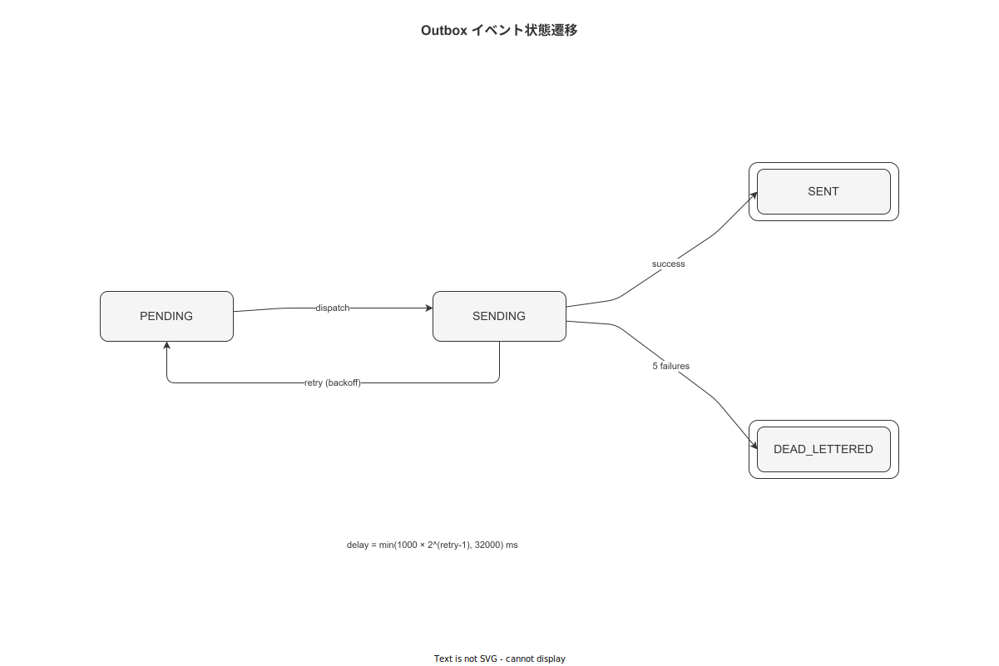

# 04 Outbox リトライ・バックオフアルゴリズム

本章はバックエンドの Outbox Consumer（FNC-BE-012）とハンディ APP の OutboxWorker（FNC-FE-009/010）が使用する指数バックオフアルゴリズム（ALG-009）・デバイス Outbox 同期（ALG-010）・DLQ 遷移の完全仕様を確定する。対応する機能要件は FR-SY-002（親システム連携）・FR-SY-005（配信保証）、モジュール識別子は MOD-BE-006（wnav_outbox）・MOD-FE-HA-002 である。

---

## 1. 指数バックオフアルゴリズム（ALG-009）

リトライ間隔は指数関数的に増加し、最大遅延時間でキャップする。これにより、障害時のバックエンドへの集中アクセスを防止する。

**図 1: Outbox リトライ状態遷移図**



> 原本: [`img/fig_dd_alg_outbox_retry_states.drawio`](img/fig_dd_alg_outbox_retry_states.drawio)

```
ALGORITHM ExponentialBackoff:
  INPUT:
    attempt_number : Int  -- 1-based（1 回目の失敗後が attempt_number = 1）
    initial_delay_ms : Int  -- CFG デフォルト: 1000
    max_delay_ms     : Int  -- CFG デフォルト: 32000
  OUTPUT:
    delay_ms : Int

  delay_ms ← MIN(initial_delay_ms × 2^(attempt_number - 1), max_delay_ms)
  RETURN delay_ms
```

### 1-1. リトライ遅延計算表

| attempt_number | 計算式 | delay_ms |
|---|---|---|
| 1 | 1000 × 2^0 | 1,000 ms |
| 2 | 1000 × 2^1 | 2,000 ms |
| 3 | 1000 × 2^2 | 4,000 ms |
| 4 | 1000 × 2^3 | 8,000 ms |
| 5 | 1000 × 2^4 | 16,000 ms |
| ≥6 | MIN(1000 × 2^n, 32000) | 32,000 ms（キャップ）|

attempt_number が `MAX_RETRY_COUNT`（デフォルト: 5）に達した場合、ステータスを `DEAD_LETTERED` に遷移させ以降のリトライを行わない。

### 1-2. TypeScript 実装（FNC-FE-010）

```typescript
const OUTBOX_CONFIG = {
  initialDelayMs : 1000,
  maxDelayMs     : 32000,
  maxRetryCount  : 5,
} as const;

/**
 * FNC-FE-010: バックオフ遅延計算
 */
function computeBackoffDelay(
  attemptNumber: number,
  config = OUTBOX_CONFIG,
): number {
  const delay = config.initialDelayMs * Math.pow(2, attemptNumber - 1);
  return Math.min(delay, config.maxDelayMs);
}
```

### 1-3. Rust 実装（バックエンド）

```rust
/// バックオフ遅延計算（ミリ秒）
fn compute_backoff_delay_ms(attempt_number: u32, config: &OutboxConfig) -> u64 {
    let delay = config.initial_delay_ms as u64
        * 2u64.saturating_pow(attempt_number.saturating_sub(1));
    delay.min(config.max_delay_ms as u64)
}
```

---

## 2. バックエンド Outbox Consumer アルゴリズム（FNC-BE-012, BAT-002）

バックエンドの Outbox Consumer は **wnav_terminal_api バイナリ内の常駐 tokio task**（BAT-002）として動作し、5 秒間隔で PENDING イベントをポーリングして親システムへ POST する。悲観的ロック（`FOR UPDATE SKIP LOCKED`）により複数インスタンスでの二重配信を防止する。

> **インスタンス数とロック設計の方針**: wnav_terminal_api は Active-Standby 構成（物理的に1台がアクティブ）のため、実運用上は単一インスタンスでの動作となる。しかし `FOR UPDATE SKIP LOCKED` によるロック取得設計は維持する。これにより、メンテナンス・切り替え操作中に一時的に複数インスタンスが起動した場合でも二重配信が発生しないことを保証する。設計の堅牢性はインスタンス数の前提に依存させない。

```
ALGORITHM OutboxConsumer.dispatch_pending():
  TRIGGER: BAT-002（5 秒間隔の継続バッチ）

  STEP 1: PENDING イベントの取得（悲観的ロック）
    events ← SELECT *
              FROM outbox_events
              WHERE status = 'PENDING'
                AND (next_retry_at IS NULL OR next_retry_at ≤ NOW())
              ORDER BY created_at ASC
              LIMIT 50
              FOR UPDATE SKIP LOCKED

  STEP 2: 各イベントを順次処理
    FOR EACH event IN events:
      payload_bytes ← utf8_encode(event.payload)
      signature     ← HMAC-SHA256(key=CFG.webhook_secret, data=payload_bytes)

      response ← POST(
        url     = CFG.parent_system_endpoint,
        headers = {
          'Content-Type'    : 'application/json',
          'X-WNAV-Signature': hex(signature),
          'X-Idempotency-Key': event.ref_id,
        },
        body    = event.payload,
        timeout = 10s,
      )

      CASE response.status:
        2xx:
          UPDATE outbox_events
            SET status  = 'SENT',
                sent_at = NOW()
            WHERE id = event.id

        4xx (non-retryable: 400, 401, 403, 404, 422):
          UPDATE outbox_events
            SET status     = 'DEAD_LETTERED',
                error_body = response.body,
                updated_at = NOW()
            WHERE id = event.id
          EMIT ERR-EXT-001 (dead_lettered, event.id)

        5xx または network error:
          new_retry_count ← event.retry_count + 1
          IF new_retry_count ≥ MAX_RETRY_COUNT:
            UPDATE outbox_events
              SET status      = 'DEAD_LETTERED',
                  retry_count = new_retry_count,
                  error_body  = response.body ?? 'network_error',
                  updated_at  = NOW()
              WHERE id = event.id
            EMIT ERR-EXT-001 (max_retry_exceeded, event.id)
          ELSE:
            delay_ms ← compute_backoff_delay_ms(new_retry_count)
            UPDATE outbox_events
              SET retry_count   = new_retry_count,
                  next_retry_at = NOW() + delay_ms milliseconds,
                  error_body    = response.body ?? 'network_error',
                  updated_at    = NOW()
              WHERE id = event.id

  STEP 3: DLQ アラート
    IF any event transitioned to DEAD_LETTERED:
      notify_operations_team(dead_lettered_events)
```

### 2-1. Outbox ステータス遷移

| ステータス | 説明 | 次遷移 |
|---|---|---|
| `PENDING` | 配信待ち（初期値）| `SENT` / `DEAD_LETTERED` |
| `SENT` | 配信成功 | なし（終端）|
| `DEAD_LETTERED` | 最大リトライ超過または非リトライ可能エラー | なし（終端、手動対応）|

---

## 3. デバイス Outbox 同期アルゴリズム（ALG-010, FNC-FE-009）

ハンディ APP の OutboxWorker はローカル SQLite の `local_outbox_events` を定期的にバックエンド API（`POST /api/v1/sync/events`）へ送信する。EMERGENCY_MODE 時は送信を停止し、接続回復後に一括配信する。

```typescript
/**
 * FNC-FE-009: デバイス Outbox 送信処理
 */
async function dispatchPending(
  db: SQLiteDatabase,
  api: SyncApiClient,
  networkState: NetworkState,
): Promise<void> {
  // EMERGENCY_MODE 中は配信を停止（事後リカバリアルゴリズムに委ねる）
  if (networkState === 'EMERGENCY_MODE' || networkState === 'DISCONNECTED') {
    return;
  }

  // PENDING イベントを created_at 昇順で最大 20 件取得
  const events = await db.query<LocalOutboxEvent>(
    `SELECT * FROM local_outbox_events
     WHERE status = 'PENDING'
       AND (next_retry_at IS NULL OR next_retry_at <= datetime('now'))
     ORDER BY created_at ASC
     LIMIT 20`,
  );

  for (const event of events) {
    const result = await sendEvent(event, api);

    if (result.success) {
      await db.execute(
        `UPDATE local_outbox_events SET status = 'SENT', sent_at = ? WHERE id = ?`,
        [new Date().toISOString(), event.id],
      );
    } else if (result.nonRetryable) {
      await db.execute(
        `UPDATE local_outbox_events SET status = 'DEAD_LETTERED' WHERE id = ?`,
        [event.id],
      );
    } else {
      const newRetryCount = event.retry_count + 1;
      if (newRetryCount >= OUTBOX_CONFIG.maxRetryCount) {
        await db.execute(
          `UPDATE local_outbox_events
           SET status = 'DEAD_LETTERED', retry_count = ?
           WHERE id = ?`,
          [newRetryCount, event.id],
        );
      } else {
        const delayMs = computeBackoffDelay(newRetryCount);
        const nextRetryAt = new Date(Date.now() + delayMs).toISOString();
        await db.execute(
          `UPDATE local_outbox_events
           SET retry_count = ?, next_retry_at = ?
           WHERE id = ?`,
          [newRetryCount, nextRetryAt, event.id],
        );
      }
    }
  }
}
```

### 3-1. EMERGENCY_MODE 中の Outbox 蓄積

EMERGENCY_MODE（ネットワーク断 5 分超過）では以下の動作を適用する。

| 動作 | 詳細 |
|---|---|
| Outbox 挿入 | 継続（ローカル SQLite に蓄積する）|
| Outbox 配信 | 停止（dispatchPending を呼び出さない）|
| ステップ完了記録 | 継続（ローカル SQLite + ローカルハッシュチェーンに記録）|
| 最大蓄積件数 | CFG で設定（デフォルト: 10,000 件）|

---

## 4. Outbox テーブル設計参照

```sql
-- TBL-003: outbox_events（バックエンド）
-- TBL-012: local_outbox_events（ハンディ APP ローカル SQLite）
-- ※ DDL 全文は 01_データベース詳細設計/ を参照

-- Outbox Consumer クエリ最適化インデックス（IDX-005）
-- CREATE INDEX CONCURRENTLY idx_outbox_status_created
-- ON outbox_events (status, created_at)
-- WHERE status = 'PENDING';
```

---

**本節で確定した方針**
- **指数バックオフ（ALG-009）は initial=1000ms・max=32000ms のデフォルト設定で attempt 5 回目までリトライし、5 回超過で DEAD_LETTERED に遷移することを確定した。**
- **バックエンド Outbox Consumer（BAT-002）は wnav_terminal_api バイナリ内の常駐 tokio task として動作することを確定した。FOR UPDATE SKIP LOCKED で悲観的ロックを取得し、Active-Standby 構成（実質単一インスタンス）であっても切り替え操作中の二重配信を防止する設計を維持することを確定した。4xx 非リトライ可能エラーは即座に DEAD_LETTERED へ遷移し、ERR-EXT-001 を送出する。**
- **デバイス Outbox Worker（ALG-010）は EMERGENCY_MODE および DISCONNECTED 状態では配信を停止し、created_at 昇順で最大 20 件ずつバッチ送信することを確定した。送信先は wnav_terminal_api（`POST https://{ホスト}/api/v1/sync/outbox/inbound`）に限定し、wnav_master_api への通信はハンディ APP 側からは行わない。**

---

## 参照業界分析

### 必須
- [`90_業界分析/06_品質管理とトレーサビリティ.md`](../../90_業界分析/06_品質管理とトレーサビリティ.md)

### 関連
- [`90_業界分析/21_電子記録の法規制とALCOA+.md`](../../90_業界分析/21_電子記録の法規制とALCOA+.md)
