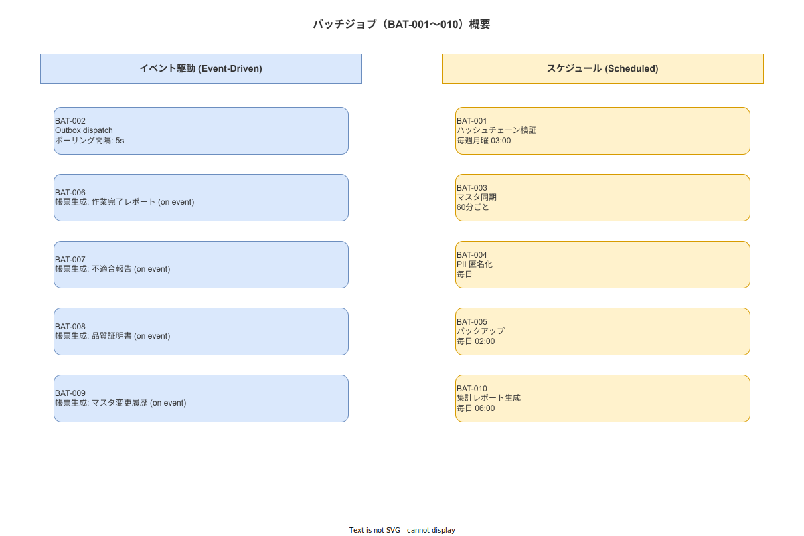

# 06 バッチジョブ処理詳細（BAT-001〜010）

本章は作業ナビゲーションシステムで稼働する 10 本のバッチジョブ（BAT-001〜010）の完全仕様を確定する。各バッチのトリガ・冪等性キー・失敗ハンドリング・リトライポリシー・DLQ 動作を定義する。対応する機能要件は FR-BS-001〜010 である。

> **バックエンド2バイナリ構成との対応**: バッチジョブは専用のスケジューラコンテナを持たない。各 BAT は **wnav_terminal_api**（ポート 8080）または **wnav_master_api**（ポート 8081）バイナリ内の常駐 tokio task として実行される。スケジューラコンテナは廃止済みである。各 BAT の「動作主体バイナリ」は下表および各節に明記する。

---

## 1. バッチジョブ一覧

| BAT-ID | バッチ名 | トリガ | 冪等性保証 | 動作主体バイナリ |
|---|---|---|---|---|
| BAT-001 | Hash Chain Verification | 毎週月曜日 03:00 | 週次 1 回 | **master-api** 内 tokio task |
| BAT-002 | Outbox Dispatcher | 継続・5 秒間隔 | event_id（UUID v7）| **terminal-api** 内 tokio task |
| BAT-003 | Master Sync Puller | 60 分間隔 | sync_version 差分比較 | **terminal-api** 内 tokio task |
| BAT-004 | PII Anonymizer | 毎日 01:00 | user_id × anonymized_at | **master-api** 内 tokio task |
| BAT-005 | PostgreSQL Backup | 毎日 02:00 | date-stamped ファイル名 | **master-api** 内 tokio task |
| BAT-006 | RP-001 SOP 実行記録生成 | 作業完了イベント受信時 | execution_id | **master-api** 内 tokio task |
| BAT-007 | RP-003 不適合記録生成 | 不適合登録イベント受信時 | nonconformity_id | **master-api** 内 tokio task |
| BAT-008 | RP-004 改善記録生成 | 改善承認イベント受信時 | kaizen_id | **terminal-api** 内 tokio task |
| BAT-009 | RP-005 設備点検記録生成 | 点検完了イベント受信時 | inspection_id | **master-api** 内 tokio task |
| BAT-010 | RP-006 集計レポート生成 | 日次 06:00・週次月曜 07:00・月次 1 日 07:00 | date + granularity | **master-api** 内 tokio task |

**図 1: バッチ処理全体概要**



> 原本: [`img/fig_dd_alg_batch_overview.drawio`](img/fig_dd_alg_batch_overview.drawio)

---

## 2. BAT-001: Hash Chain Verification

```
動作主体バイナリ: wnav_master_api 内 tokio task（スケジューラコンテナは廃止済み）
TRIGGER     : 毎週月曜日 03:00（cron: 0 3 * * 1）
IDEMPOTENCY : 同一週の複数実行は最初の 1 回のみ有効（hash_chain_verification_results の週次 unique）
TIMEOUT     : 最大 60 分（NFR-PERF-003: 100 万イベント < 60 秒が目標）

ALGORITHM:
  1. verify_chain() を実行（詳細は 03_ハッシュチェーン章 §5 参照）
  2. 結果を hash_chain_verification_results に INSERT
  3. status = 'FAILED' の場合:
     a. ERR-DB-003 ログ出力
     b. 管理者へアラート通知（webhook または メール）
     c. broken_at_block_id を運用コンソールに表示

RETRY POLICY:
  - 失敗時はリトライしない（週次の定期実行で次回を待つ）
  - ただし、DBエラーによる実行失敗（verify_chain 開始前の障害）は 5 分後に 1 回リトライ

DLQ:
  - 2 回連続 FAILED: 管理者に緊急通知
```

---

## 3. BAT-002: Outbox Dispatcher

```
動作主体バイナリ: wnav_terminal_api 内 tokio task（スケジューラコンテナは廃止済み）
TRIGGER     : 継続実行・5 秒間隔ポーリング（tokio::interval）
IDEMPOTENCY : ref_id（UUID v7）+ X-Idempotency-Key ヘッダで親システム側が保証

ALGORITHM:
  詳細は 04_Outbox章 §2 参照（OutboxConsumer.dispatch_pending）
  - LIMIT 50 件取得・FOR UPDATE SKIP LOCKED
  - 2xx → SENT、非リトライ可能 4xx → DEAD_LETTERED、5xx/network → backoff

RETRY POLICY:
  - attempt_number 1〜5: 指数バックオフ（1s/2s/4s/8s/16s）
  - attempt_number ≥ 5: DEAD_LETTERED

DLQ:
  - DEAD_LETTERED 発生時: ERR-EXT-001 + 管理コンソール DLQ 画面への記録
  - 手動再送信: 管理コンソールの「DLQ 再送信」ボタンで status を PENDING に戻す
```

---

## 4. BAT-003: Master Sync Puller

```
動作主体バイナリ: wnav_terminal_api 内 tokio task（スケジューラコンテナは廃止済み）
TRIGGER     : 60 分間隔（cron: 0 * * * *）
IDEMPOTENCY : sync_version（親システムのバージョン番号）で差分更新

ALGORITHM:
  1. GET /api/v1/sync/master?since={last_sync_version}
  2. レスポンスの各エンティティを UPSERT（ON CONFLICT DO UPDATE）
     対象: sops, steps, operations, equipment, materials, skills
  3. sync_version を local_sync_state に保存
  4. sync_log に成功/失敗を記録

RETRY POLICY:
  - HTTP エラー: 3 分後に 1 回リトライ
  - ネットワーク断: DISCONNECTED/EMERGENCY_MODE 中はスキップ（再接続後に startRecovery で実行）

DLQ:
  - 3 回連続失敗: 管理者アラート
```

---

## 5. BAT-004: PII Anonymizer

```
動作主体バイナリ: wnav_master_api 内 tokio task（スケジューラコンテナは廃止済み）
TRIGGER     : 毎日 01:00（cron: 0 1 * * *）
IDEMPOTENCY : user_id × anonymized_at DATE で判定（同日の二重実行を無視）
SCOPE       : 退職（is_active = FALSE）から 60 日経過したユーザー

ALGORITHM:
  1. 対象ユーザー抽出
     SELECT id FROM users
     WHERE is_active = FALSE
       AND deactivated_at < NOW() - INTERVAL '60 days'
       AND pii_anonymized_at IS NULL

  2. 各ユーザーの PII フィールドを匿名化（SHA-256 置換）
     BEGIN TRANSACTION:
       UPDATE users SET
         display_name     = 'ANONYMIZED_' || LEFT(SHA256(id::text), 8),
         email            = NULL,
         phone            = NULL,
         pii_anonymized_at = NOW()
       WHERE id = target_user_id

       INSERT INTO pii_anonymization_log (
         user_id, anonymized_at, fields_updated
       ) VALUES (target_user_id, NOW(), ARRAY['display_name','email','phone'])
     COMMIT

  3. work_events.resource は UUID のまま保持（トレーサビリティ保持のため変更不可）
     -- ALCOA+ の Attributable 要件（FR-EV-005）に基づく

RETRY POLICY:
  - トランザクション失敗: 5 分後に同一ユーザーを再試行（1 回のみ）
  - 連続失敗: pii_anonymization_errors テーブルに記録し管理者通知

DLQ:
  - 3 日連続で同一ユーザーの匿名化失敗: 緊急アラート
```

---

## 6. BAT-005: PostgreSQL Backup

```
動作主体バイナリ: wnav_master_api 内 tokio task（スケジューラコンテナは廃止済み）
TRIGGER     : 毎日 02:00（cron: 0 2 * * *）
IDEMPOTENCY : ファイル名に日付を含む（wnav_backup_YYYYMMDD.pgdump）

ALGORITHM:
  1. pg_dump --format=custom --compress=9 wnav_db
  2. 出力ファイルを AES-256-GCM で暗号化（鍵は CFG_BACKUP_ENCRYPTION_KEY）
  3. バックアップファイルを /var/backups/wnav/ に保存
  4. 90 日以上前のバックアップを削除
  5. backup_logs テーブルに成功/失敗・ファイルサイズを記録

RETRY POLICY:
  - 失敗時: 30 分後に 1 回リトライ
  - 2 回失敗: 管理者緊急通知（翌 02:00 まで次回実行なし）

DLQ:
  - バックアップなし 48 時間超過: ERR-SYS-003 + 緊急アラート
```

---

## 7. BAT-006: RP-001 SOP 実行記録生成

```
動作主体バイナリ: wnav_master_api 内 tokio task（スケジューラコンテナは廃止済み）
TRIGGER     : work_executions.status が 'COMPLETED' に遷移した時（イベント駆動）
IDEMPOTENCY : execution_id（同一 execution_id での二重生成を idempotency_keys テーブルで防止）

PIPELINE:
  詳細は 07_帳票生成章 §2 参照
  1. データ抽出: work_executions + work_events + steps の全データ
  2. テンプレートレンダリング（RP-001 専用テンプレート）
  3. PDF/A-3 生成 + PKCS#7 デジタル署名
  4. ハッシュチェーンブロック INSERT
  5. reports テーブルに記録 + 通知 webhook

RETRY POLICY:
  - 各ステップ失敗: ERR-SYS-003 + 3 回リトライ（30 秒間隔）
  - 3 回全失敗: DLQ テーブルに INSERT

DLQ:
  - 管理コンソールの帳票生成 DLQ 画面から手動再実行可能
```

---

## 8. BAT-007: RP-003 不適合記録生成

```
動作主体バイナリ: wnav_master_api 内 tokio task（スケジューラコンテナは廃止済み）
TRIGGER     : nonconformity_reports テーブルへの INSERT（イベント駆動）
IDEMPOTENCY : nonconformity_id

PIPELINE:
  1. データ抽出: nonconformity_reports + related work_events
  2. テンプレートレンダリング（RP-003 専用テンプレート）
  3. PDF/A-3 生成 + PKCS#7 署名
  4. ハッシュチェーンブロック INSERT
  5. 担当者への通知（在庫管理・品質管理担当）

RETRY POLICY: BAT-006 と同じ（3 回リトライ → DLQ）
```

---

## 9. BAT-008: RP-004 改善記録生成

```
動作主体バイナリ: wnav_terminal_api 内 tokio task（スケジューラコンテナは廃止済み）
TRIGGER     : kaizen_records.status が 'APPROVED' に遷移した時
IDEMPOTENCY : kaizen_id

PIPELINE:
  1. データ抽出: kaizen_records + related sop_version_history
  2. テンプレートレンダリング（RP-004 専用テンプレート）
  3. PDF/A-3 生成 + PKCS#7 署名
  4. ハッシュチェーンブロック INSERT
  5. 改善担当者・承認者への通知

RETRY POLICY: BAT-006 と同じ（3 回リトライ → DLQ）
```

---

## 10. BAT-009: RP-005 設備点検記録生成

```
動作主体バイナリ: wnav_master_api 内 tokio task（スケジューラコンテナは廃止済み）
TRIGGER     : equipment_inspections.status が 'COMPLETED' に遷移した時
IDEMPOTENCY : inspection_id

PIPELINE:
  1. データ抽出: equipment_inspections + inspection_items + equipment
  2. テンプレートレンダリング（RP-005 専用テンプレート）
  3. PDF/A-3 生成 + PKCS#7 署名
  4. ハッシュチェーンブロック INSERT
  5. 設備管理担当者への通知

RETRY POLICY: BAT-006 と同じ（3 回リトライ → DLQ）
```

---

## 11. BAT-010: RP-006 集計レポート生成

```
動作主体バイナリ: wnav_master_api 内 tokio task（スケジューラコンテナは廃止済み）
TRIGGER:
  - 日次: 毎日 06:00（cron: 0 6 * * *）
  - 週次: 毎週月曜日 07:00（cron: 0 7 * * 1）
  - 月次: 毎月 1 日 07:00（cron: 0 7 1 * *）
IDEMPOTENCY : date + granularity（'DAILY'/'WEEKLY'/'MONTHLY'）の複合キー

ALGORITHM:
  1. mv_daily_work_summary マテリアライズドビューを REFRESH CONCURRENTLY
  2. 集計期間に応じてデータ抽出:
     - 日次: 前日 1 日分
     - 週次: 前週 7 日分
     - 月次: 前月全日分
  3. 個人別ランキングを除外（BR-BUS-029 厳守）
     -- GROUP BY worker_id のクエリは使用禁止
     -- 集計はオペレーション・ライン・工程単位のみ
  4. XLSX レポート生成（openpyxl）
  5. PDF/A-3 レポート生成（WeasyPrint）
  6. reports テーブルに記録 + 管理者への通知

RETRY POLICY:
  - 各ステップ失敗: ERR-SYS-003 + 3 回リトライ（60 秒間隔）
  - 月次レポートの失敗は翌日 06:00 に自動再実行

DLQ:
  - 3 回全失敗: 管理コンソール DLQ 画面に記録 + 管理者通知
```

---

## 12. 共通設計事項

### 12-1. バッチ実行ログテーブル

```sql
-- batch_job_logs（全バッチ共通）
CREATE TABLE batch_job_logs (
    id            UUID         PRIMARY KEY DEFAULT gen_random_uuid(),
    bat_id        TEXT         NOT NULL,  -- 'BAT-001'〜'BAT-010'
    started_at    TIMESTAMPTZ  NOT NULL,
    finished_at   TIMESTAMPTZ,
    status        TEXT         NOT NULL CHECK (status IN ('RUNNING','SUCCEEDED','FAILED','SKIPPED')),
    error_message TEXT,
    metadata      JSONB,
    created_at    TIMESTAMPTZ  NOT NULL DEFAULT NOW()
);
```

### 12-2. DLQ テーブル

```sql
-- batch_dlq（バッチ DLQ 共通）
CREATE TABLE batch_dlq (
    id            UUID         PRIMARY KEY DEFAULT gen_random_uuid(),
    bat_id        TEXT         NOT NULL,
    idempotency_key TEXT       NOT NULL,
    payload       JSONB        NOT NULL,
    error_message TEXT         NOT NULL,
    retry_count   INT          NOT NULL DEFAULT 0,
    created_at    TIMESTAMPTZ  NOT NULL DEFAULT NOW(),
    resolved_at   TIMESTAMPTZ
);
```

---

**本節で確定した方針**
- **BAT-001〜010 の 10 バッチジョブについて、トリガ・冪等性キー・リトライポリシー・DLQ 動作を全て確定した。イベント駆動バッチ（BAT-006〜009）は idempotency_keys テーブルで二重生成を防止する。**
- **各 BAT の動作主体バイナリを確定した。BAT-002（Outbox Dispatcher）・BAT-003（Master Sync Puller）・BAT-008（改善記録生成）は wnav_terminal_api 内の常駐 tokio task として動作する。BAT-001（Hash Chain Verification）・BAT-004（PII 匿名化）・BAT-005（PostgreSQL Backup）・BAT-006/007/009/010（帳票・集計・バックアップ系）は wnav_master_api 内の常駐 tokio task として動作する。専用スケジューラコンテナは廃止済みである。**
- **BAT-004（PII 匿名化）は work_events.resource フィールドを変更しないことを確定した。これは ALCOA+ の Attributable 要件（FR-EV-005）に基づく不変制約である。**
- **BAT-010（集計レポート）は BR-BUS-029（個人別ランキング禁止）を厳守し、GROUP BY worker_id のクエリを使用しないことを確定した。集計はオペレーション・ライン・工程単位のみとする。**

---

## 参照業界分析

### 必須
- [`90_業界分析/06_品質管理とトレーサビリティ.md`](../../90_業界分析/06_品質管理とトレーサビリティ.md)

### 関連
- [`90_業界分析/21_電子記録の法規制とALCOA+.md`](../../90_業界分析/21_電子記録の法規制とALCOA+.md)
