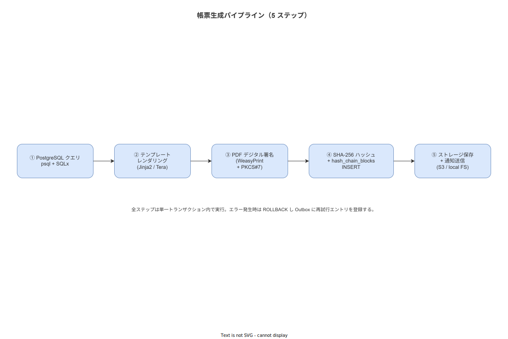

# 07 帳票生成パイプライン詳細

本章は作業ナビゲーションシステムが生成する 5 種類の帳票（RP-001/003/004/005/006）の生成パイプライン（ALG-024）の完全仕様を確定する。データ抽出→テンプレートレンダリング→PDF/A-3 生成→デジタル署名→ハッシュチェーン格納→通知の各ステップを定義する。対応する機能要件は FR-RP-001/003/004/005/006 である。

---

## 1. 帳票種別一覧

| RP-ID | 帳票名 | トリガバッチ | 出力形式 |
|---|---|---|---|
| RP-001 | SOP 実行記録 | BAT-006 | PDF/A-3 + XLSX |
| RP-003 | 不適合記録 | BAT-007 | PDF/A-3 |
| RP-004 | 改善記録 | BAT-008 | PDF/A-3 |
| RP-005 | 設備点検記録 | BAT-009 | PDF/A-3 |
| RP-006 | 集計レポート | BAT-010 | PDF/A-3 + XLSX |

---

## 2. 帳票生成パイプライン（ALG-024）

**図 1: 帳票生成パイプライン概要**



> 原本: [`img/fig_dd_alg_report_pipeline.drawio`](img/fig_dd_alg_report_pipeline.drawio)

```
PIPELINE ReportGenerationPipeline(report_type, source_id):
  INPUT:
    report_type : 'RP-001' | 'RP-003' | 'RP-004' | 'RP-005' | 'RP-006'
    source_id   : UUID  -- execution_id / nonconformity_id / kaizen_id 等

  STEP 1: 冪等性チェック
    IF EXISTS(idempotency_keys WHERE key = '{report_type}:{source_id}'):
      RETURN cached_report_id
    INSERT INTO idempotency_keys (key, created_at) VALUES ('{report_type}:{source_id}', NOW())

  STEP 2: データ抽出（PostgreSQL クエリ）
    report_data ← extract_report_data(report_type, source_id)
    -- RP-001: work_executions + work_events + steps + sops + users
    -- RP-003: nonconformity_reports + work_events + steps
    -- RP-004: kaizen_records + sop_version_history + users
    -- RP-005: equipment_inspections + inspection_items + equipment
    -- RP-006: mv_daily_work_summary（個人別ランキングなし）

  STEP 3: テンプレートレンダリング
    rendered ← render_template(report_type, report_data)
    -- テキスト帳票: Jinja2 テンプレートエンジン
    -- XLSX 帳票 : openpyxl でセル書き込み
    -- PDF/A-3  : WeasyPrint で HTML/CSS → PDF/A-3 変換

  STEP 4: PDF デジタル署名（PKCS#7）
    sign_id ← SELECT sign_id FROM sign_records WHERE source_id = source_id
    pdf_signed ← apply_pkcs7_signature(rendered.pdf, sign_id, cert=CFG_PDF_CERT)
    -- 署名は PDF/A-3 の XMP メタデータに sign_id を埋め込む

  STEP 5: SHA-256 + ハッシュチェーンブロック INSERT
    report_hash ← SHA-256(pdf_signed.bytes)
    INSERT INTO hash_chain_blocks (
        block_id, case_id, content_hash, prev_hash, chain_hash, created_at
    ) VALUES (
        newUuidV7(),
        source_id,
        report_hash,
        getLastChainHash(source_id),
        SHA-256(getLastChainHash(source_id) || report_hash),
        NOW()
    )

  STEP 6: ストレージ保存
    file_path ← '/var/reports/{report_type}/{source_id}/{timestamp}.pdf'
    WRITE(pdf_signed, file_path)
    IF rendered.xlsx IS NOT NULL:
      WRITE(rendered.xlsx, file_path.replace('.pdf', '.xlsx'))

  STEP 7: reports テーブルへの記録
    INSERT INTO reports (
        id, report_type, source_id, file_path, report_hash,
        sign_id, generated_at, status
    ) VALUES (
        newUuidV7(), report_type, source_id, file_path,
        hex(report_hash), sign_id, NOW(), 'COMPLETED'
    )

  STEP 8: 通知 webhook
    POST(
        url     = CFG.report_notification_webhook,
        payload = { report_id, report_type, source_id, file_path },
        headers = { 'X-WNAV-Signature': HMAC-SHA256(payload) }
    )

  RETURN report_id

ERROR HANDLING (いずれかのステップが失敗した場合):
  EMIT ERR-SYS-003 (report_generation_failed, report_type, source_id, step)
  UPDATE reports SET status = 'FAILED', error_message = error WHERE source_id = source_id
  RETRY up to 3 times with 30-second interval
  IF 3 retries all failed:
    INSERT INTO batch_dlq (bat_id, idempotency_key, payload, error_message)
    EMIT alert to admin
```

---

## 3. RP 別データ抽出クエリ仕様

### 3-1. RP-001: SOP 実行記録

```sql
-- RP-001 データ抽出クエリ
SELECT
    we.id              AS execution_id,
    we.sop_id,
    we.primary_worker_id,
    we.started_at,
    we.completed_at,
    we.status,
    s.title            AS sop_title,
    s.version          AS sop_version,
    u.display_name     AS worker_name,
    u.employee_number,
    json_agg(
        json_build_object(
            'event_id',         ev.id,
            'step_number',      st.step_number,
            'step_title',       st.title,
            'activity',         ev.activity,
            'timestamp_client', ev.timestamp_client,
            'timestamp_server', ev.timestamp_server,
            'input',            ev.payload
        ) ORDER BY st.step_number ASC
    ) AS step_events
FROM work_executions we
JOIN sops            s  ON s.id = we.sop_id
JOIN users           u  ON u.id = we.primary_worker_id
JOIN work_events     ev ON ev.case_id = we.id
JOIN steps           st ON st.id = ev.step_id
WHERE we.id = $1  -- execution_id
GROUP BY we.id, s.id, u.id
```

### 3-2. RP-006: 集計レポート（個人別ランキングなし）

```sql
-- RP-006 日次集計クエリ（BR-BUS-029 準拠: GROUP BY worker_id 禁止）
SELECT
    date_trunc('day', we.completed_at)           AS report_date,
    op.id                                         AS operation_id,
    op.name                                       AS operation_name,
    COUNT(we.id)                                  AS total_executions,
    COUNT(CASE WHEN we.status = 'COMPLETED' THEN 1 END) AS completed_count,
    COUNT(CASE WHEN we.status = 'CANCELLED' THEN 1 END) AS cancelled_count,
    ROUND(
        COUNT(CASE WHEN we.status = 'COMPLETED' THEN 1 END)::NUMERIC
        / NULLIF(COUNT(we.id), 0) * 100, 1
    )                                             AS completion_rate_pct,
    AVG(EXTRACT(EPOCH FROM (we.completed_at - we.started_at)) / 60) AS avg_duration_min
FROM work_executions we
JOIN sops s ON s.id = we.sop_id
JOIN operations op ON op.id = s.operation_id
WHERE date_trunc('day', we.completed_at) = $1  -- 対象日
GROUP BY
    date_trunc('day', we.completed_at),
    op.id,
    op.name
ORDER BY op.name ASC
-- 注意: worker_id による GROUP BY は BR-BUS-029 により使用禁止
```

---

## 4. テンプレートレンダリング仕様

### 4-1. PDF/A-3 生成仕様

| 項目 | 仕様 |
|---|---|
| レンダリングエンジン | WeasyPrint（Python ライブラリ、Rust から `std::process::Command` で呼び出し）|
| 入力 | Jinja2 テンプレート（HTML + CSS）|
| 出力 | PDF/A-3b 準拠（ISO 19005-3）|
| フォント | IPA フォント埋め込み（ライセンス確認済み）|
| 用紙サイズ | A4 縦（デフォルト）|
| 解像度 | 300 DPI |
| カラーモード | CMYK（印刷対応）|

### 4-2. XLSX 生成仕様

| 項目 | 仕様 |
|---|---|
| ライブラリ | openpyxl（Python、Rust から呼び出し）|
| シート構成 | RP-001: サマリ/ステップ詳細/証拠一覧 の 3 シート |
| 数値フォーマット | 実測値: "#,##0.00"、パーセント: "0.0%" |
| セル保護 | 記録済みシートはセル保護（パスワードなし・変更禁止のみ）|

---

## 5. PDF デジタル署名仕様（PKCS#7）

```
DIGITAL SIGNATURE SPEC:
  形式       : PKCS#7 / CMS (RFC 5652)
  アルゴリズム: SHA-256 with RSA (PKCS1v15)
  証明書     : 自己署名 X.509 v3（工場内 CA 発行）
  署名者     : システム自動署名（人間の電子署名と区別するため "WNAV-SYSTEM" 属性付与）
  タイムスタンプ: RFC 3161 タイムスタンプトークン（内部 TSA）

PKCS#7 署名 XMP メタデータ埋め込み:
  <rdf:Description rdf:about=""
    xmlns:wnav="https://wnav.example.com/xmp/1.0/">
    <wnav:signId>sign_id_value</wnav:signId>
    <wnav:executionId>execution_id_value</wnav:executionId>
    <wnav:generatedAt>2026-05-17T03:00:00Z</wnav:generatedAt>
  </rdf:Description>
```

---

## 6. 帳票 hash_chain_blocks との連携

帳票ファイルの SHA-256 ハッシュは `work_events` ハッシュチェーンとは独立した帳票専用ブロックとして `hash_chain_blocks` に記録する。`case_id` に帳票 ID（report_id）を設定し、作業イベントチェーンと区別する。

```
帳票ブロックの識別:
  case_id  = report_id  （作業実行 ID とは別の UUID v7）
  activity = 'report_generated'  （work_events の activity に対応）
```

---

**本節で確定した方針**
- **帳票生成パイプライン（ALG-024）は 8 ステップ（冪等性チェック→データ抽出→レンダリング→署名→ハッシュチェーン→ストレージ→records INSERT→webhook通知）で構成し、各ステップの失敗は ERR-SYS-003 + 3 回リトライ → DLQ の順で処理することを確定した。**
- **RP-006 集計レポートは BR-BUS-029 を遵守し GROUP BY worker_id を使用せず、オペレーション・工程単位の集計のみ提供することを確定した。この制約は SQLクエリレベルで強制し、設計上の例外を許可しない。**
- **帳票 PDF は PDF/A-3b（ISO 19005-3）準拠・PKCS#7 署名・IPA フォント埋め込みを必須条件とし、veraPDF による PDF/A-3 適合性検証をテストケース（TST-alcoa-002/008）で確認することを確定した。**

---

## 参照業界分析

### 必須
- [`90_業界分析/06_品質管理とトレーサビリティ.md`](../../90_業界分析/06_品質管理とトレーサビリティ.md)

### 関連
- [`90_業界分析/21_電子記録の法規制とALCOA+.md`](../../90_業界分析/21_電子記録の法規制とALCOA+.md)
