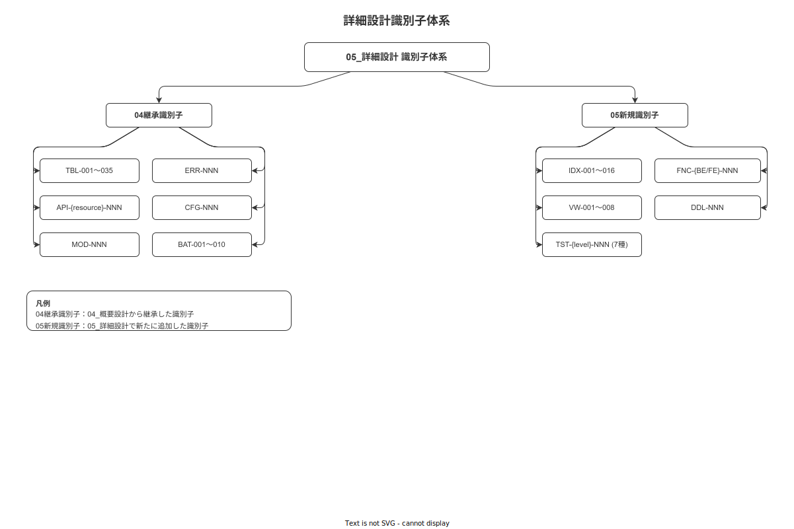

# 01 詳細設計識別子採番台帳

本章は `05_詳細設計` フェーズで採番した全設計識別子（IDX・VW・TST・FNC）の採番状況を一元管理する台帳である。`04_概要設計/付録/99_設計識別子採番台帳.md` で「未採番」とされた識別子を本書で正式採番した結果を記録する。

**図 1: 識別子階層図**

> 原本: [`img/fig_dd_appendix_id_hierarchy.drawio`](img/fig_dd_appendix_id_hierarchy.drawio)

---

## 1. IDX 採番台帳

`01_データベース詳細設計/03_インデックス詳細設計（IDXカタログ）.md` での全採番結果。

次採番値: **IDX-032**

| IDX-ID | テーブル（TBL-NNN）| 対象列 | 種別 | 用途 |
|---|---|---|---|---|
| IDX-001 | TBL-001 work_events | case_id | B-tree | 作業単位イベント検索 |
| IDX-002 | TBL-001 work_events | timestamp_server | B-tree | 時系列範囲検索 |
| IDX-003 | TBL-001 work_events | resource | B-tree（Partial: is_active）| 作業員別検索 |
| IDX-004 | TBL-001 work_events | (case_id, step_id) | B-tree 複合 | ロックステップ確認 |
| IDX-005 | TBL-003 outbox_events | status, created_at | B-tree（Partial: status='PENDING'）| Outbox Consumer |
| IDX-006 | TBL-005 work_executions | primary_worker_id | B-tree | 作業員別作業一覧 |
| IDX-007 | TBL-005 work_executions | status | B-tree（Partial: status != 'COMPLETED'）| 進行中作業 |
| IDX-008 | TBL-007 sops | operation_id, is_active | B-tree 複合 | オペレーション別 SOP |
| IDX-009 | TBL-008 steps | sop_id, step_number | B-tree 複合 | SOP 内ステップ順序 |
| IDX-010 | TBL-009 evidence_files | event_id | B-tree | イベント別証拠 |
| IDX-011 | TBL-016 users | login_id | B-tree UNIQUE | ログイン認証 |
| IDX-012 | TBL-016 users | is_active | B-tree（Partial: is_active=TRUE）| アクティブ検索 |
| IDX-013 | TBL-027 external_key_bindings | external_key | GIN（JSONB）| 外部キー逆引き |
| IDX-014 | TBL-031 hash_chain_blocks | created_at | B-tree | チェーン検証順序 |
| IDX-015 | TBL-032 auth_logs | (user_id, occurred_at DESC) | **B-tree 複合**（旧 BRIN → 変更・指摘6対応）| 認証監査（ユーザー別時系列）|
| IDX-016 | TBL-035 idempotency_keys | idempotency_key | B-tree UNIQUE | 冪等性チェック |
| IDX-017 | TBL-051 case_locks | terminal_id | B-tree | 端末別保有 case 一覧 |
| IDX-018 | TBL-051 case_locks | heartbeat_at（WHERE lock_status='ACTIVE'）| B-tree Partial | Reaper バッチの絞り込み |
| IDX-019 | TBL-009 evidence_files | created_at | BRIN | 時系列アクセス（06_インデックス §1）|
| IDX-020 | TBL-010 measurements | created_at | BRIN | 時系列アクセス（06_インデックス §1）|
| IDX-021 | TBL-038 incoming_inspections | lot_id | B-tree | ロット別入荷検査検索 |
| IDX-022 | TBL-038 incoming_inspections | (supplier_id, qc_status) | B-tree 複合 | 仕入先別 QC ステータス検索 |
| IDX-023 | TBL-040 incoming_inspection_measurements | inspection_id | B-tree | 検査明細取得 |
| IDX-024 | TBL-043 reworks | parent_nonconformity_id | B-tree | 不適合→リワーク参照 |
| IDX-025 | TBL-043 reworks | status（未完了 Partial）| B-tree Partial | 進行中リワーク取得 |
| IDX-026 | TBL-039 sampling_plans | (material_id, supplier_id)（is_active Partial）| B-tree Partial 複合 | AQL 計画引き当て |
| IDX-027 | TBL-024 lots | supplier_id（NOT NULL Partial）| B-tree Partial | 仕入先別 lot 検索 |
| IDX-028 | TBL-024 lots | material_id（NOT NULL Partial）| B-tree Partial | 材料別 lot 検索 |
| IDX-029 | TBL-024 lots | parent_lot_id（NOT NULL Partial）| B-tree Partial | 親子 lot 追跡 |
| IDX-030 | TBL-024 lots | qc_status（未完了 Partial）| B-tree Partial | 後工程ゲート判定 |
| IDX-031 | TBL-040 incoming_inspection_measurements | (qc_case_id, content_hash) | B-tree 複合 | IQC ハッシュチェーン週次検証 |

---

## 2. VW 採番台帳

`01_データベース詳細設計/04_ビュー・マテリアライズドビュー設計（VWカタログ）.md` での全採番結果。

次採番値: **VW-009**

| VW-ID | ビュー名 | 種別 | 用途 |
|---|---|---|---|
| VW-001 | v_active_work_executions | VIEW | 進行中・中断中の作業セッション（status IN ('IN_PROGRESS','SUSPENDED')）|
| VW-002 | v_published_sops | VIEW | 公開中 SOP と最新版 master_version の結合ビュー |
| VW-003 | v_user_skills_full | VIEW | users × user_skills × skills の結合（スキルゲート判定用）|
| VW-004 | v_step_sequence | VIEW | sops × steps を sop_id + step_number 順で結合したビュー |
| VW-005 | v_work_event_xes | VIEW | XES エクスポート形式（case_id / activity / timestamp_server / resource）に変換 |
| VW-006 | mv_daily_work_summary | MATERIALIZED VIEW | 日次作業件数・完了率（RP-006 集計レポート用、毎日 06:00 REFRESH）|
| VW-007 | v_andon_active | VIEW | status = 'ALERTING' のアンドン一覧（管理コンソール用）|
| VW-008 | v_hash_chain_latest | VIEW | hash_chain_blocks の最新ブロック（週次検証起点）|

---

## 3. TST 採番台帳（次採番値）

`08_テストケース詳細設計/` 各章での採番完了結果と、次採番値を確定する。

| テストレベル | 採番 prefix | 採番済み範囲 | 採番元章 | 次採番値 |
|---|---|---|---|---|
| 単体テスト（バックエンド）| `TST-unit-BE-NNN` | TST-unit-BE-001〜030 | 08/01章 | TST-unit-BE-031 |
| 単体テスト（フロントエンド）| `TST-unit-FE-NNN` | TST-unit-FE-001〜020 | 08/02章 | TST-unit-FE-021 |
| 統合テスト | `TST-intg-NNN` | TST-intg-001〜023 | 08/03章 | TST-intg-024 |
| E2E テスト | `TST-e2e-NNN` | TST-e2e-001〜022 | 08/04章 | TST-e2e-023 |
| ALCOA+ 検証テスト | `TST-alcoa-NNN` | TST-alcoa-001〜009 | 08/05章 | TST-alcoa-010 |
| セキュリティテスト | `TST-sec-NNN` | TST-sec-001〜010 | 08/06章 | TST-sec-011 |
| 性能テスト | `TST-perf-NNN` | TST-perf-001〜005 | 08/06章 | TST-perf-006 |

---

## 4. FNC 採番台帳（次採番値）

重要な関数・メソッドシグネチャの採番完了結果と次採番値を確定する。ドメインサービス・ステートマシン遷移・ハッシュチェーン計算の主要トレイトメソッドに限定して採番した。

| 区分 | 採番先 | 採番済み範囲 | 次採番値 |
|---|---|---|---|
| FNC-BE | 02_バックエンド詳細設計 各章 | FNC-BE-001〜020 | FNC-BE-021 |
| FNC-FE | 04_ハンディAPP詳細設計 各章 | FNC-FE-001〜016 | FNC-FE-017 |

---

**本節で確定した方針**
- **IDX-001〜031（次採番値 IDX-032）・VW-001〜008（次採番値 VW-009）を 05_詳細設計 で正式採番し、04_概要設計/付録/99_設計識別子採番台帳.md の「未採番」状態を解消した。**
- **IDX-017（TBL-051 case_locks terminal_id）・IDX-018（TBL-051 case_locks heartbeat_at Partial）は 2026-05-18 採番（High 重大度対応）。**
- **IDX-019（TBL-009 evidence_files created_at BRIN）・IDX-020（TBL-010 measurements created_at BRIN）は 2026-05-18 採番（06_インデックス §1「全 Append-only テーブルは created_at インデックス必須」対応）。**
- **IDX-015 を BRIN → 複合 B-Tree（user_id, occurred_at DESC）に変更・採番台帳で記述修正。IDX カタログ・概要設計 06 章・採番台帳の 3 箇所表記を統一した（指摘6対応 / 2026-05-18）。**
- **IDX-021〜026（IQC テーブル群）は 2026-05-18 採番。DDL インライン CREATE INDEX から IDX カタログへ移植し採番漏れを解消（指摘2対応）。**
- **IDX-027〜030（TBL-024 lots 拡張列）は 2026-05-18 採番。IQC 拡張列（supplier_id / material_id / qc_status / parent_lot_id）の検索インデックスを新規追加（指摘4対応）。**
- **IDX-031（TBL-040 IQC チェーン検証用）は 2026-05-18 採番。ADR-011 ハッシュチェーン週次検証（BAT-001 拡張）のインデックス基盤（指摘5対応）。**
- **FNC-BE-018（compute_content_hash_for_inspection）・FNC-BE-019（compute_content_hash_for_rework）・FNC-BE-020（compute_content_hash_for_disposition）は 2026-05-18 採番（ADR-011 IQC ハッシュチェーン拡張対応）。次採番値を FNC-BE-021 に更新した。**
- **TST-NNN は 7 分類合計 119 件（unit-BE: 30、unit-FE: 20、intg: 23、e2e: 22、alcoa: 9、sec: 10、perf: 5）を採番し、次採番値を各レベル別に本台帳で一元管理する。**
- **TST-intg-021（UUID v7 ラウンドトリップ）・022（TIMESTAMPTZ）・023（JSONB）は 2026-05-18 採番（PG↔SQLite スキーマ同期戦略対応）。**
- **FNC-{BE/FE}-NNN は各レベルを採番し、全関数の網羅は求めない（Rust の pub fn 全件ではなくドメイン境界の主要トレイトメソッドに限定）。**
- **FNC-BE-017（compute_correction_chain_hash）は 2026-05-18 採番（ハッシュチェーン補正継続規則対応）。**

---

## 参照業界分析

### 必須
- [`90_業界分析/06_品質管理とトレーサビリティ.md`](../../90_業界分析/06_品質管理とトレーサビリティ.md)
