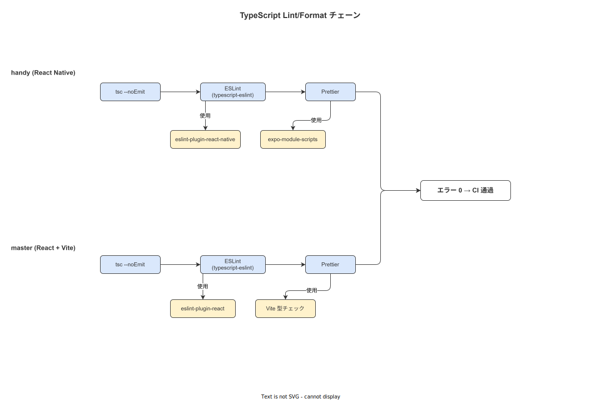

# 03 コーディング規約_TypeScript

## 1. TypeScript strict mode

すべての TypeScript プロジェクト（handy / master）で strict mode を有効にする。以下の `tsconfig.json` を基準とする。

```json
{
  "compilerOptions": {
    "target": "ES2022",
    "module": "ESNext",
    "moduleResolution": "bundler",
    "strict": true,
    "noUncheckedIndexedAccess": true,
    "exactOptionalPropertyTypes": true,
    "noImplicitReturns": true,
    "noFallthroughCasesInSwitch": true,
    "noUncheckedSideEffectImports": true,
    "forceConsistentCasingInFileNames": true,
    "skipLibCheck": false,
    "isolatedModules": true,
    "jsx": "react-native",
    "lib": ["ES2022"],
    "baseUrl": ".",
    "paths": {
      "@/*": ["./src/*"]
    }
  },
  "include": ["src/**/*.ts", "src/**/*.tsx"],
  "exclude": ["node_modules", "dist", "src/api/generated"]
}
```

### 重要フラグの解説

| フラグ | 効果 | なぜ必要か |
|---|---|---|
| `strict: true` | 7 種の strict チェックを一括有効化 | 型安全性の基盤 |
| `noUncheckedIndexedAccess` | 配列アクセスの返り値を `T \| undefined` にする | `array[0]` の null 安全性を強制 |
| `exactOptionalPropertyTypes` | `?` プロパティに `undefined` の明示的代入を要求 | オプショナルと `undefined` の意味を区別 |
| `noImplicitReturns` | すべての関数パスで明示的 return を要求 | 暗黙の `undefined` 返却を防止 |

**本節で確定した方針**
- **`strict: true`・`noUncheckedIndexedAccess: true`・`exactOptionalPropertyTypes: true` を全プロジェクトで必須とする。**
- **`tsconfig.json` を handy/master それぞれのルートに配置し、共通設定は `tsconfig.base.json` から継承する。**
- **`skipLibCheck: false` を設定し、型定義ファイルの型エラーを検出する（生成コードのみ `exclude` に追加）。**

---

## 2. `any` / `unknown` 使用基準

### `any` 全面禁止

`any` 型は TypeScript の型チェックを無効化する。本プロジェクトでは全面禁止とする。ESLint の `@typescript-eslint/no-explicit-any` ルールで自動検出する。

```typescript
// 禁止
const response: any = await fetchEvents();
const data = JSON.parse(text) as any;

// 推奨: unknown を使い、narrowing で型を確定する
const response: unknown = await fetchEvents();
if (isWorkEventArray(response)) {
  // ここで response は WorkEvent[] として扱える
  processEvents(response);
}
```

### `unknown` の使用方法

外部からのデータ（API レスポンス・localStorage・URL パラメータ）は必ず `unknown` として受け取り、型ガードで narrowing する。

```typescript
// API レスポンスのバリデーション例
import { z } from 'zod';

const WorkEventSchema = z.object({
  id: z.string().uuid(),
  caseId: z.string().uuid(),
  activity: z.enum(['start', 'complete', 'skip', 'rollback', 'suspend']),
  clientRecordedAt: z.number().int().positive(),
  serverReceivedAt: z.number().int().positive(),
  hash: z.string().length(64),
});

type WorkEvent = z.infer<typeof WorkEventSchema>;

// 型ガード関数
function parseWorkEvent(unknown: unknown): WorkEvent {
  // バリデーション失敗時は例外をスローする（unknown を素通りさせない）
  return WorkEventSchema.parse(unknown);
}
```

**本節で確定した方針**
- **`any` 型を全面禁止し、ESLint `@typescript-eslint/no-explicit-any` でエラーとして検出する。**
- **外部データは `unknown` で受け取り、zod 等のスキーマバリデーションで narrowing する。**
- **型キャスト（`as T`）は型ガード内でのみ許容し、naked なキャストを禁止する。**

---

## 3. ESLint 設定

**図 1: TS Lint/Format チェーン**



> 原本: [`img/fig_ts_lint_chain.drawio`](img/fig_ts_lint_chain.drawio)

### 設定ファイル（`eslint.config.ts`）

```typescript
import tseslint from 'typescript-eslint';
import reactHooks from 'eslint-plugin-react-hooks';
import jsxA11y from 'eslint-plugin-jsx-a11y';
import simpleImportSort from 'eslint-plugin-simple-import-sort';

export default tseslint.config(
  ...tseslint.configs.strictTypeChecked,
  ...tseslint.configs.stylisticTypeChecked,
  {
    plugins: {
      'react-hooks': reactHooks,
      'jsx-a11y': jsxA11y,
      'simple-import-sort': simpleImportSort,
    },
    rules: {
      // TypeScript
      '@typescript-eslint/no-explicit-any': 'error',
      '@typescript-eslint/no-unsafe-assignment': 'error',
      '@typescript-eslint/no-unsafe-member-access': 'error',
      '@typescript-eslint/no-unsafe-return': 'error',
      '@typescript-eslint/no-non-null-assertion': 'error',
      '@typescript-eslint/explicit-function-return-type': 'warn',

      // React Hooks
      'react-hooks/rules-of-hooks': 'error',
      'react-hooks/exhaustive-deps': 'error',  // 警告ではなくエラー

      // アクセシビリティ
      'jsx-a11y/alt-text': 'error',
      'jsx-a11y/aria-props': 'error',
      'jsx-a11y/aria-role': 'error',
      'jsx-a11y/interactive-supports-focus': 'error',

      // インポート順序
      'simple-import-sort/imports': 'error',
      'simple-import-sort/exports': 'error',
    },
  }
);
```

**本節で確定した方針**
- **`typescript-eslint` の `strictTypeChecked` を使用し、型安全性に関わるルールをエラーとする。**
- **`react-hooks/exhaustive-deps` をエラーレベルに設定し、依存配列の省略を禁止する。**
- **CI で `pnpm eslint --max-warnings=0` を実行し、警告 1 件でもビルドを失敗させる。**

---

## 4. Prettier 設定

```json
{
  "printWidth": 100,
  "tabWidth": 2,
  "useTabs": false,
  "semi": true,
  "singleQuote": true,
  "quoteProps": "as-needed",
  "jsxSingleQuote": false,
  "trailingComma": "all",
  "bracketSpacing": true,
  "bracketSameLine": false,
  "arrowParens": "always",
  "endOfLine": "lf"
}
```

### インポート順序（`eslint-plugin-simple-import-sort`）

```typescript
// グループ 1: Node.js 組み込み
import path from 'node:path';

// グループ 2: 外部パッケージ（アルファベット順）
import { useQuery } from '@tanstack/react-query';
import React, { useCallback, useState } from 'react';

// グループ 3: 内部モジュール（パスエイリアス）
import { AppError } from '@/error';
import { WorkEvent } from '@/types/domain';

// グループ 4: 相対インポート
import { resolveLocale } from '../i18n/utils';
import styles from './StepCard.styles';
```

**本節で確定した方針**
- **`printWidth: 100`・`singleQuote: true`・`semi: true`・`trailingComma: "all"` を全プロジェクトで統一する。**
- **`endOfLine: "lf"` を設定し、Windows/Mac/Linux 間の改行コード差異を排除する。**
- **インポートは `simple-import-sort` で自動整列し、手動ソートを禁止する。**

---

## 5. 命名規約

| 要素 | 規則 | 例 |
|---|---|---|
| コンポーネント | `PascalCase` | `StepNavigationCard`, `WorkOrderList` |
| カスタムフック | `camelCase`（`use` プレフィックス必須） | `useNetworkQuality`, `useOutboxStatus` |
| 関数・変数 | `camelCase` | `fetchWorkEvents`, `currentStep` |
| 定数 | `UPPER_SNAKE_CASE` | `MAX_RETRY_COUNT`, `HASH_GENESIS_VALUE` |
| 型・インターフェース | `PascalCase` | `WorkEvent`, `NetworkQuality` |
| 列挙型 | `PascalCase`（値も `PascalCase`） | `EventActivity.Start` |
| ファイル名（コンポーネント） | `PascalCase.tsx` | `StepNavigationCard.tsx` |
| ファイル名（その他） | `camelCase.ts` | `hashChain.ts`, `networkUtils.ts` |

### boolean の命名

```typescript
// 推奨: is*/has*/can* プレフィックスで意味を明確にする
const isOfflineMode: boolean = networkQuality === 'disconnected';
const hasUnsyncedEvents: boolean = outboxCount > 0;
const canProceedToNextStep: boolean = currentStep.isCompleted;

// 禁止: 動詞なし・意味不明
const offline: boolean = ...;
const flag: boolean = ...;
```

**本節で確定した方針**
- **カスタムフックは `use` プレフィックスを必須とし、フック以外の関数への付与を禁止する。**
- **boolean 変数は `is*/has*/can*` プレフィックスを必須とし、状態の意味を名前で表現する。**
- **ファイル名はコンポーネントを `PascalCase.tsx`、それ以外を `camelCase.ts` で統一する。**

---

## 6. ファイル構成

### 1 ファイル 1 コンポーネント

```
features/step-navigation/
  StepNavigationCard.tsx        # コンポーネント（1 ファイル 1 コンポーネント）
  StepNavigationCard.test.tsx   # テスト（コロケーション）
  StepNavigationCard.styles.ts  # スタイル（コロケーション）
  useStepNavigation.ts          # カスタムフック（コロケーション）
  useStepNavigation.test.ts     # フックのテスト
  index.ts                      # バレルファイル（外部公開 API）
```

### バレルファイル（`index.ts`）

外部から参照する API のみをバレルファイルでエクスポートする。内部実装の詳細を外部に晒さない。

```typescript
// features/step-navigation/index.ts
// StepNavigationCard のみを外部に公開し、内部フックは隠蔽する
export { StepNavigationCard } from './StepNavigationCard';
export type { StepNavigationCardProps } from './StepNavigationCard';
```

### コロケーション

テスト・スタイル・型定義は機能フォルダ内に共置する。`__tests__/` ディレクトリへの分離を禁止する。

**本節で確定した方針**
- **1 ファイルに 1 コンポーネントのみ定義し、複数コンポーネントの同居を禁止する。**
- **テスト・スタイル・カスタムフックは対象コンポーネントと同じフォルダに配置する（コロケーション）。**
- **`index.ts` バレルファイルで外部公開 API を明示し、内部実装の直接インポートを禁止する。**

---

## 7. React 固有規約

### hooks 依存配列

`useEffect`・`useCallback`・`useMemo` の依存配列を省略することを禁止する。ESLint の `react-hooks/exhaustive-deps` でエラーとして検出する。

```typescript
// 禁止: 依存配列の省略
useEffect(() => {
  fetchWorkOrder(workOrderId);
}, []); // workOrderId が依存配列にない

// 推奨: 依存を明示する
useEffect(() => {
  fetchWorkOrder(workOrderId);
}, [workOrderId, fetchWorkOrder]);
```

### `useEffect` 最小化

`useEffect` はサイドエフェクト（DOM 操作・購読・タイマー）にのみ使用し、データ変換・状態の計算には使用しない。

```typescript
// 禁止: useEffect でのデータ変換
useEffect(() => {
  setFilteredEvents(events.filter(e => e.caseId === caseId));
}, [events, caseId]);

// 推奨: useMemo でのデータ変換
const filteredEvents = useMemo(
  () => events.filter(e => e.caseId === caseId),
  [events, caseId]
);
```

### ErrorBoundary

すべての画面コンポーネントを `ErrorBoundary` でラップする。

```typescript
// 画面ルートでの ErrorBoundary 使用
export function WorkOrderScreen() {
  return (
    <ErrorBoundary
      fallback={<ErrorFallback />}
      onError={(error, info) => {
        // エラーを tracing/ログに記録する
        logger.error('画面レベルのエラーが発生した', { error, info });
      }}
    >
      <Suspense fallback={<LoadingSpinner />}>
        <WorkOrderContent />
      </Suspense>
    </ErrorBoundary>
  );
}
```

### メモ化の条件

`React.memo`・`useCallback`・`useMemo` は以下の条件を満たす場合のみ使用する。

- `React.memo`: 親の再レンダリングが頻繁で、子への props が変化しないことが多い場合
- `useCallback`: イベントハンドラを子コンポーネントに渡す場合（参照の安定性が必要な場合）
- `useMemo`: 計算コストが高い（`O(n^2)` 以上）場合、または参照の安定性が必要な場合

**本節で確定した方針**
- **`react-hooks/exhaustive-deps` をエラーレベルに設定し、依存配列の省略をビルド失敗扱いにする。**
- **全画面コンポーネントを `ErrorBoundary` でラップし、未処理例外によるアプリクラッシュを防止する。**
- **`useEffect` をデータ変換に使用することを禁止し、`useMemo` に置き換える。**

---

## 8. React Native 固有規約

### タッチターゲット（72dp）

製造現場では手袋を着用して操作するため、タッチターゲットの最小サイズを **72dp** とする。Material Design 標準の 48dp では不足する。

```typescript
import { StyleSheet, TouchableOpacity } from 'react-native';

const styles = StyleSheet.create({
  // 手袋着用を考慮した最小タッチターゲット
  touchTarget: {
    minWidth: 72,
    minHeight: 72,
    justifyContent: 'center',
    alignItems: 'center',
    padding: 8,
  },
  // インタラクティブ要素間の最小マージン
  touchTargetSpacing: {
    marginBottom: 8,
  },
});
```

### StyleSheet.create()

インラインスタイルを禁止し、必ず `StyleSheet.create()` を使用する。

```typescript
// 禁止: インラインスタイル（パフォーマンス劣化・一貫性なし）
<View style={{ padding: 16, backgroundColor: '#fff' }} />

// 推奨: StyleSheet.create()
const styles = StyleSheet.create({
  container: {
    padding: 16,
    backgroundColor: '#ffffff',
  },
});
<View style={styles.container} />
```

### Platform.OS 分岐

OS 固有のコードは `Platform.OS` で分岐し、ロジックを明確に分離する。

```typescript
import { Platform } from 'react-native';

// プラットフォーム分岐の書き方
const shadowStyle = Platform.select({
  android: {
    elevation: 4,
  },
  ios: {
    shadowColor: '#000',
    shadowOffset: { width: 0, height: 2 },
    shadowOpacity: 0.25,
    shadowRadius: 4,
  },
  windows: {
    // Windows タブレット向け（react-native-windows）
    borderWidth: 1,
    borderColor: '#e0e0e0',
  },
  default: {},
});
```

### Expo Router ファイルベースルーティング

```
app/
  (auth)/
    login.tsx           # /login
  (main)/
    _layout.tsx         # メインレイアウト
    index.tsx           # / （作業一覧）
    work-order/
      [id].tsx          # /work-order/:id
      [id]/
        step/
          [stepId].tsx  # /work-order/:id/step/:stepId
```

### OTA 対象/非対象の境界

| 変更種別 | OTA 配信 | ストア審査 | 注意事項 |
|---|---|---|---|
| TypeScript/JavaScript コード変更 | 対応する | — | OTA の主な用途 |
| UI・ビジネスロジック変更 | 対応する | — | Step エンジンの JSON Logic 変更含む |
| ネイティブモジュール追加 | — | 対応する | `react-native-*` の新規追加 |
| Expo SDK メジャーアップグレード | — | 対応する | SDK バージョンアップ |
| `app.json` / `app.config.js` の変更 | — | 対象外と判断する（変更内容による ADR 確認） | バンドル ID 変更等は審査必須 |

**本節で確定した方針**
- **タッチターゲットの最小サイズを 72dp とし、Material Design の 48dp を採用しない。**
- **インラインスタイルを禁止し、`StyleSheet.create()` に統一する。**
- **OTA 配信の対象をコード変更に限定し、ネイティブモジュール変更はストア審査を経由する。**

---

## 9. 状態管理

### 状態の種類と管理手法

| 状態の種類 | 管理手法 | 使用例 |
|---|---|---|
| クライアント状態（UI 状態） | Zustand | ネットワーク品質・モーダル開閉・フォーム状態 |
| サーバー状態（キャッシュ） | TanStack Query | 作業指示一覧・SOP マスタ・作業者情報 |
| ローカル複雑状態 | `useReducer` | ステップ進行のフロー制御・マルチステップフォーム |
| ローカル単純状態 | `useState` | チェックボックス・テキスト入力 |

### Zustand の設計指針

```typescript
// ネットワーク品質ストアの例
import { create } from 'zustand';
import { subscribeWithSelector } from 'zustand/middleware';

interface NetworkStore {
  quality: NetworkQuality;
  lastSyncedAt: number | null;
  outboxCount: number;
  // アクション（関数型でセッターを定義する）
  setQuality: (quality: NetworkQuality) => void;
  setLastSyncedAt: (timestamp: number) => void;
  incrementOutboxCount: () => void;
  decrementOutboxCount: () => void;
}

export const useNetworkStore = create<NetworkStore>()(
  subscribeWithSelector((set) => ({
    quality: 'high',
    lastSyncedAt: null,
    outboxCount: 0,
    setQuality: (quality) => set({ quality }),
    setLastSyncedAt: (timestamp) => set({ lastSyncedAt: timestamp }),
    incrementOutboxCount: () =>
      set((state) => ({ outboxCount: state.outboxCount + 1 })),
    decrementOutboxCount: () =>
      set((state) => ({ outboxCount: Math.max(0, state.outboxCount - 1) })),
  }))
);
```

### アンチパターン: prop drilling 3 段以上

props のバケツリレーが 3 段以上続く場合は Zustand または TanStack Query への移行を検討する。

**本節で確定した方針**
- **サーバー状態は TanStack Query・クライアント状態は Zustand・ローカル複雑状態は `useReducer` に分類して管理する。**
- **prop drilling が 3 段以上になった時点でリファクタリングを実施し、継続を禁止する。**
- **Zustand のストアはアクションを関数として定義し、直接の状態書き換え（`set(state => state.x = y)`）を禁止する。**

---

## 10. 動的評価禁止

### `eval()` / `new Function()` 禁止

```typescript
// 全面禁止
eval('step.validate(input)');
const fn = new Function('input', 'return input.value > 0');
```

### JSON Logic による宣言的表現

Step エンジンの条件分岐・バリデーションロジックは JSON Logic で宣言的に表現する。

```typescript
import jsonLogic from 'json-logic-js';

// JSON Logic による Step バリデーション（eval 禁止・JSON Logic で宣言的に記述）
const stepValidationRule = {
  "and": [
    { ">=": [{ "var": "temperature" }, 20] },
    { "<=": [{ "var": "temperature" }, 80] },
    { "!=": [{ "var": "operatorId" }, null] }
  ]
};

// Step のバリデーション実行
function validateStepInput(rule: unknown, data: Record<string, unknown>): boolean {
  // json-logic-js は eval を使用しない（AST ベースの評価）
  return Boolean(jsonLogic.apply(rule, data));
}
```

**本節で確定した方針**
- **`eval()` / `new Function()` を全面禁止し、ESLint `no-eval` でエラーとして検出する。**
- **Step エンジンの動的ロジックは JSON Logic で宣言的に表現し、バックエンドの DB に格納する。**
- **JSON Logic の評価は専用ライブラリ（`json-logic-js`）を使用し、自作インタープリタの実装を禁止する。**

---

## 11. TypeORM 規約

### エンティティ定義

```typescript
import {
  Entity,
  PrimaryGeneratedColumn,
  Column,
  CreateDateColumn,
  ManyToOne,
  JoinColumn,
} from 'typeorm';

// work_events エンティティ（Append-only: update/delete メソッドを呼ばない）
@Entity('work_events')
export class WorkEventEntity {
  @PrimaryGeneratedColumn('uuid')
  id!: string;

  @Column({ name: 'case_id', type: 'varchar' })
  caseId!: string;

  @Column({
    name: 'activity',
    type: 'varchar',
    // 列挙型は string で保持し、アプリ層で enum に変換する
  })
  activity!: string;

  @Column({ name: 'client_recorded_at', type: 'integer' })
  clientRecordedAt!: number;

  // server_received_at はサーバーから受信した値を保持する（クライアント生成禁止）
  @Column({ name: 'server_received_at', type: 'integer', nullable: true })
  serverReceivedAt!: number | null;

  @Column({ name: 'hash', type: 'varchar', length: 64 })
  hash!: string;

  @CreateDateColumn({ name: 'created_at' })
  createdAt!: Date;
}
```

### Migration の up/down 必須

```typescript
import { MigrationInterface, QueryRunner } from 'typeorm';

export class CreateWorkEvents1716000000000 implements MigrationInterface {
  public async up(queryRunner: QueryRunner): Promise<void> {
    await queryRunner.query(`
      CREATE TABLE work_events (
        id UUID PRIMARY KEY DEFAULT (lower(hex(randomblob(4))) || '-' || lower(hex(randomblob(2))) || '-4' || substr(lower(hex(randomblob(2))),2) || '-' || substr('89ab',abs(random()) % 4 + 1, 1) || substr(lower(hex(randomblob(2))),2) || '-' || lower(hex(randomblob(6)))),
        case_id VARCHAR NOT NULL,
        activity VARCHAR NOT NULL,
        client_recorded_at INTEGER NOT NULL,
        server_received_at INTEGER,
        hash VARCHAR(64) NOT NULL,
        created_at DATETIME NOT NULL DEFAULT CURRENT_TIMESTAMP
      )
    `);
  }

  public async down(queryRunner: QueryRunner): Promise<void> {
    // ロールバックスクリプトを必ずセットで作成する
    await queryRunner.query(`DROP TABLE work_events`);
  }
}
```

### work_events への update/delete 禁止

```typescript
// 禁止: work_events エンティティへの update/delete
const event = await workEventRepository.findOne({ where: { id } });
await workEventRepository.save({ ...event, activity: 'corrected' }); // 禁止
await workEventRepository.delete({ id }); // 禁止

// 推奨: 修正イベントを追加する（Append-only 原則）
await workEventRepository.save({
  caseId: event.caseId,
  activity: 'correction',  // 修正イベントとして新規追加
  originalEventId: event.id,
  // ...
});
```

**本節で確定した方針**
- **TypeORM Migration の `up`/`down` をセットで作成し、`down` のない Migration を禁止する。**
- **`work_events` テーブルへの `save`（update）/ `delete` 呼び出しをアプリ層でも禁止する。**
- **SQLite と PostgreSQL の論理対応を維持するため、カラム名・型命名を両 DB で統一する。**

---

## 12. アクセシビリティ

### React Native（handy）

```typescript
import { TouchableOpacity, Text, AccessibilityRole } from 'react-native';

// 全インタラクティブ要素に accessibilityLabel と accessibilityRole を必須とする
<TouchableOpacity
  style={styles.startButton}
  onPress={handleStartStep}
  accessibilityLabel={`ステップ${stepNumber}を開始する`}
  accessibilityRole="button"
  accessibilityState={{ disabled: !canStartStep }}
  // 製造現場の騒音環境を考慮してバイブレーションを必ず有効にする
  onPressIn={() => Vibration.vibrate(50)}
>
  <Text style={styles.buttonText}>開始</Text>
</TouchableOpacity>
```

### React SPA（master）

```typescript
// ARIA 属性を全インタラクティブ要素に付与する
<button
  type="button"
  aria-label="作業指示 WO-2026-001 の詳細を表示する"
  aria-expanded={isExpanded}
  aria-controls="work-order-detail-2026-001"
  onClick={toggleExpanded}
>
  詳細
</button>
```

### WCAG 2.1 AA 要件

| 要件 | 基準値 | 適用範囲 |
|---|---|---|
| コントラスト比（通常テキスト） | 4.5:1 以上 | 全テキスト |
| コントラスト比（大テキスト 18pt 以上） | 3:1 以上 | 見出し・大ボタン |
| タッチターゲットサイズ | 72dp × 72dp 以上 | handy（手袋着用前提） |
| キーボードナビゲーション | Tab キーで全操作可能 | master SPA |
| 夜間コントラスト | 輝度最小でも AA 基準以上 | handy（夜間シフト対応） |

**本節で確定した方針**
- **`accessibilityLabel` / `accessibilityRole` を handy の全インタラクティブ要素に必須とする。**
- **`aria-*` 属性を master SPA の全インタラクティブ要素に必須とし、キーボードナビゲーションを保証する。**
- **夜間シフト作業者を考慮し、輝度最小設定でも WCAG 2.1 AA（4.5:1）のコントラスト比を保証する。**

---

## 参照業界分析

### 必須
- [`90_業界分析/18_現場HCIと作業者インターフェース.md`](../../90_業界分析/18_現場HCIと作業者インターフェース.md)

### 関連
- [`90_業界分析/08_人間工学と作業負荷.md`](../../90_業界分析/08_人間工学と作業負荷.md)
- [`90_業界分析/34_多言語化・外国人労働者と読み書き能力差.md`](../../90_業界分析/34_多言語化・外国人労働者と読み書き能力差.md)
- [`90_業界分析/27_オフライン同期とデータ整合性.md`](../../90_業界分析/27_オフライン同期とデータ整合性.md)
