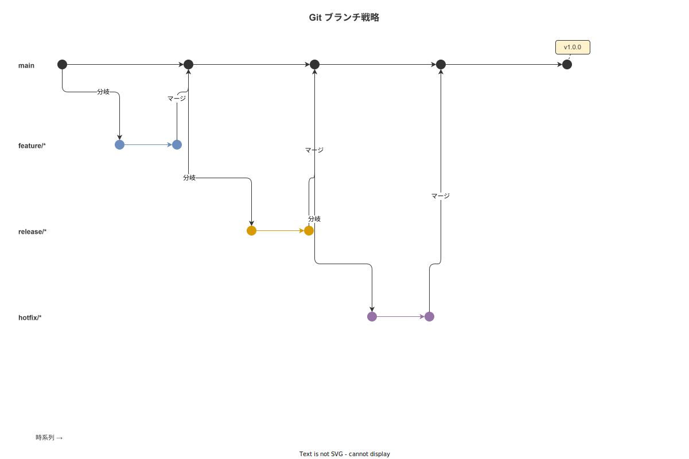
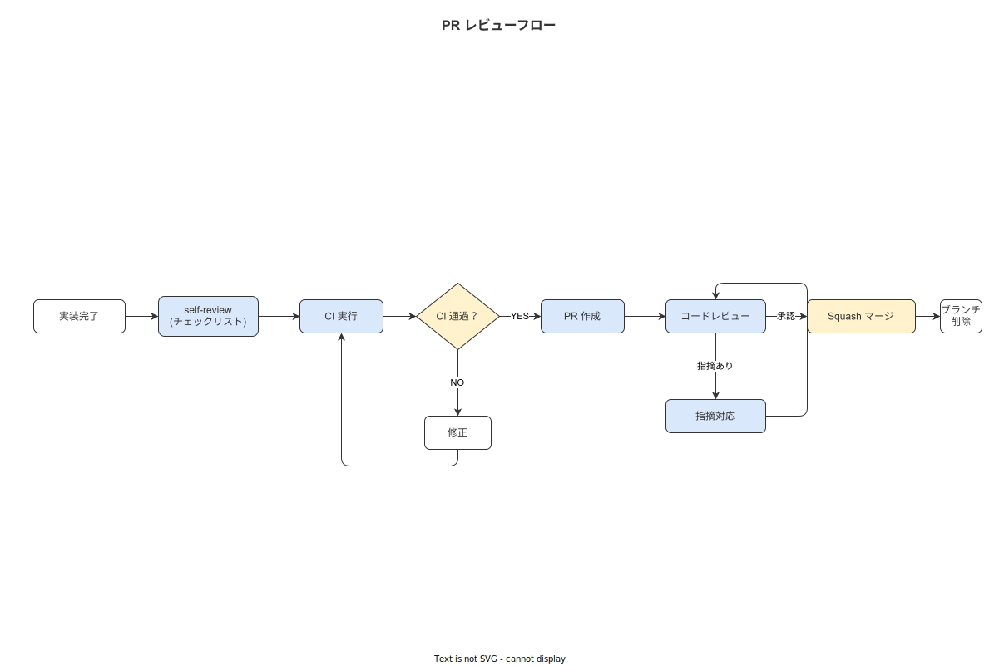

# 07 Git運用とブランチ規約

## 1. ブランチ戦略

本プロジェクトは **GitHub Flow を基盤とした 4 種ブランチ戦略**を採用する。

**図 1: Git ブランチ戦略**



> 原本: [`img/fig_git_branch_strategy.drawio`](img/fig_git_branch_strategy.drawio)

### 4 種ブランチの役割

| ブランチ | 役割 | マージ先 | 保護設定 |
|---|---|---|---|
| `main` | 常に deployable な状態を保つ。リリースタグの打点 | — | ダイレクトプッシュ禁止・PR 必須 |
| `feature/*` | 機能開発・バグ修正・リファクタリングの作業ブランチ | `main` | — |
| `release/*` | リリース候補のバグフィックスと最終確認 | `main` | ダイレクトプッシュ禁止 |
| `hotfix/*` | 本番緊急修正 | `main` | — |

### ブランチの生存期間

| ブランチ | 生存期間 | 削除タイミング |
|---|---|---|
| `main` | 恒久 | 削除しない |
| `feature/*` | PR マージまで | Squash マージ後に即削除 |
| `release/*` | リリース完了まで | タグ打ち・マージ後に削除 |
| `hotfix/*` | 本番修正適用まで | マージ後に即削除 |

**本節で確定した方針**
- **`main` ブランチへのダイレクトプッシュを禁止し、全変更は PR 経由でマージする。**
- **`feature/*` ブランチは Squash マージ後に即削除し、ブランチの増殖を防止する。**
- **`main` は常に deployable な状態を保ち、壊れた状態での commit を禁止する。**

---

## 2. ブランチ命名

### 命名規則

```
<type>/<ID>-<brief-description>
```

| type | 使用場面 | 例 |
|---|---|---|
| `feature` | 新機能・機能改善 | `feature/FR-NV-001-step-engine-core` |
| `fix` | バグ修正（非緊急） | `fix/BUG-042-outbox-duplicate-send` |
| `hotfix` | 本番緊急修正 | `hotfix/PROB-012-outbox-retry-loop` |
| `release` | リリース準備 | `release/v1.0.0` |
| `refactor` | リファクタリング（機能変更なし） | `refactor/MOD-005-hash-chain-module` |
| `docs` | ドキュメント更新 | `docs/06-implementation-guide` |
| `chore` | CI・依存更新・設定変更 | `chore/cargo-audit-fix-2026-05` |

### ブランチ命名ルール一覧表

| ルール | 内容 |
|---|---|
| 文字種 | 英小文字・数字・ハイフン（`-`）のみ。スペース・アンダースコア・スラッシュ 2 個以上を禁止 |
| ID の形式 | FR-NNN（機能要件）/ MOD-NNN（モジュール）/ BUG-NNN（バグ）/ PROB-NNN（問題） |
| 長さ | タイプ + ID + 説明で 60 文字以内 |
| 説明部分 | 英語・ケバブケース。最小限の動詞句 |
| 例外 | `release/vX.X.X` は SemVer 形式のみ（説明部分不要） |

```bash
# 正しい例
git checkout -b feature/FR-NV-001-step-engine-core
git checkout -b hotfix/PROB-012-outbox-retry-loop
git checkout -b release/v1.0.0
git checkout -b fix/BUG-042-outbox-duplicate-send

# 禁止例
git checkout -b Feature/StepEngine      # 大文字・アンダースコア
git checkout -b step_engine_feature     # 種別なし・アンダースコア
git checkout -b wip                     # 意味がない
```

**本節で確定した方針**
- **ブランチ名は `<type>/<ID>-<brief-description>` 形式に統一し、大文字・スペース・アンダースコアを禁止する。**
- **ID（FR-NNN/MOD-NNN 等）をブランチ名に必須とし、追跡可能性を確保する。**
- **`release/vX.X.X` は SemVer 形式のみを許容する。**

---

## 3. Conventional Commits

### コミットメッセージの形式

```
<type>(<scope>): <subject>

<body>（任意）

<footer>（任意）
```

### 使用するタイプ

| type | 使用場面 |
|---|---|
| `feat` | 新機能の追加 |
| `fix` | バグ修正 |
| `docs` | ドキュメントのみの変更 |
| `chore` | ビルドプロセス・ツール・依存関係の変更（テストなし） |
| `test` | テストの追加・修正 |
| `refactor` | バグ修正・機能追加を伴わないコード変更 |
| `perf` | パフォーマンス改善 |
| `style` | フォーマット変更（コードの意味に影響しない） |
| `ci` | CI 設定の変更 |
| `revert` | 過去 commit の取り消し |

### コミットメッセージの例

```
feat(MOD-005): SHA-256 ハッシュチェーンの検証ロジックを実装する

hash_chain モジュールに verify_chain() 関数を追加した。
バックグラウンドジョブから定期的に呼び出し、チェーンの
連続性を自動検証する。チェーン破断時は tracing::error! で
アラートを発し、メトリクスカウンタをインクリメントする。

Resolves: FR-NV-007
Co-Authored-By: Claude Sonnet 4.6 <noreply@anthropic.com>
```

```
fix(MOD-003): Outbox ワーカーの重複送信バグを修正する

FOR UPDATE SKIP LOCKED を使用していなかったため、
複数のワーカーが同じエントリを処理する競合が発生していた。

Fixes: BUG-042
BREAKING CHANGE: outbox テーブルに FOR UPDATE SKIP LOCKED を
使用するため、PostgreSQL 9.5 以前はサポート対象外となる。
```

**本節で確定した方針**
- **コミットメッセージは Conventional Commits 形式（`<type>(<scope>): <subject>`）を必須とする。**
- **`subject` は日本語で記載し、`<body>` には変更の理由・背景を記載する。**
- **破壊的変更は `BREAKING CHANGE:` フッタを付与し、`CHANGELOG.md` で追跡可能にする。**

---

## 4. コミット粒度

### 1 コミット = 論理的変更の定義

1 つの commit には「1 つの論理的変更」を含める。以下の要素を 1 commit で完成させる。

```
1 つの論理的変更 =
  実装コード（Rust/TypeScript/SQL）
  + ユニットテスト（対象機能の単体テスト）
  + ドキュメント更新（関連する CLAUDE.md・ADR 等）
```

### WIP コミットの main 禁止

```bash
# 作業途中の WIP コミットは feature ブランチ内でのみ許容する
git commit -m "wip: ハッシュチェーン実装中"

# main にマージする前に必ず rebase -i で整理する
git rebase -i origin/main

# squash/fixup で WIP コミットをまとめる
# pick a1b2c3d feat(MOD-005): ハッシュチェーン実装
# squash d4e5f6g wip: ハッシュチェーン実装中
# squash g7h8i9j fix: テストの修正
```

### コミット分割の基準

| 状況 | 対応 |
|---|---|
| 機能実装 + バグ修正が混在 | `git add -p` で hunks を分けて 2 commit に分割する |
| リファクタリング + 機能追加が混在 | リファクタリング commit → 機能追加 commit の 2 commit に分割する |
| テストなしの実装 commit | テストを追加するまで commit しない |

**本節で確定した方針**
- **1 commit に「実装 + テスト + ドキュメント更新」を含め、テストなしの実装 commit を禁止する。**
- **WIP commit を `main` に含めることを禁止し、`git rebase -i` で整理してから PR を作成する。**
- **`git add -p`（パッチモード）を使用してコミット粒度を制御する。**

---

## 5. PR テンプレ

`.github/PULL_REQUEST_TEMPLATE.md` を作成する。

```markdown
## 変更概要

<!-- 何を・なぜ変更したかを 3 行以内で記載する -->

## 対応 ID

- FR: <!-- FR-NNN, FR-NNN（対応する機能要件）-->
- MOD: <!-- MOD-NNN（関連モジュール）-->
- IMPL: <!-- IMPL-NNN（実装 ADR）-->
- BUG: <!-- BUG-NNN（修正するバグ）-->

## テスト方法

<!-- レビュアーが動作確認する手順を記載する -->
1. `cargo nextest run` ですべてのテストが通ること
2. `expo start` でハンディ APP を起動して XX を確認する

## 影響範囲

- [ ] データベーススキーマの変更あり（マイグレーション必須）
- [ ] API インターフェースの変更あり（クライアントの更新必要）
- [ ] 環境変数の追加・変更あり（`.env.example` を更新した）
- [ ] 依存クレート/パッケージの変更あり

## セルフレビューチェック

- [ ] `cargo fmt -- --check` が通ること
- [ ] `cargo clippy -- -D warnings` が通ること
- [ ] `pnpm eslint --max-warnings=0` が通ること
- [ ] テストカバレッジが低下していないこと
- [ ] Conventional Commits 形式のコミットメッセージになっていること
- [ ] WIP コミットを `git rebase -i` で整理したこと
- [ ] 機微情報（パスワード・鍵・個人情報）がコードに含まれていないこと
- [ ] OWASP Top 10 の観点でセキュリティチェックを行ったこと
```

**本節で確定した方針**
- **PR テンプレートの全チェックリストを完了してから PR をオープンする。**
- **「対応 ID」に FR-NNN・MOD-NNN・IMPL-NNN を記載し、要件との追跡可能性を確保する。**
- **セルフレビューチェックで機微情報の混入・OWASP Top 10 のセキュリティ観点を確認する。**

---

## 6. PR タイトル

### 形式

```
[<ID>] <変更概要> (<IMPL-NNN>)
```

### 具体例

```
[FR-NV-001] StepEngine コア実装 (IMPL-001)
[MOD-005] SHA-256 ハッシュチェーン検証ロジック追加 (IMPL-002)
[BUG-042] Outbox ワーカー重複送信バグ修正
[TBL-012] work_event テーブルのパーティション設定
```

### ルール

| ルール | 内容 |
|---|---|
| 文字数 | 50 文字以内 |
| 言語 | 日本語（英単語の専門用語は許容） |
| ID | `[FR-NNN]` / `[MOD-NNN]` / `[BUG-NNN]` / `[TBL-NNN]` のいずれかを先頭に付ける |
| IMPL 番号 | 実装 ADR が存在する場合のみ `(IMPL-NNN)` を末尾に付ける |

**本節で確定した方針**
- **PR タイトルは `[<ID>] <変更概要>` 形式・50 文字以内で統一する。**
- **ID（FR-NNN/MOD-NNN 等）を先頭に付け、どの要件に対応するかを一目で判断できるようにする。**
- **タイトルに実装の詳細（ファイル名・関数名）を含めず、変更の目的を記載する。**

---

## 7. レビュー手順

**図 2: PR レビューフロー**



> 原本: [`img/fig_pr_review_flow.drawio`](img/fig_pr_review_flow.drawio)

### PR オープン前の確認

1. セルフレビューチェックリスト（§5）を全項目チェックする。
2. CI の全チェック（fmt/clippy/eslint/test）がグリーンであることを確認する。
3. PR の変更差分を `git diff origin/main...HEAD` で確認する。

### レビューの観点

| 観点 | 確認内容 |
|---|---|
| 機能正確性 | 要件（FR-NNN）を満たしているか |
| 型安全性 | `any` 型・`unwrap()` の使用がないか |
| セキュリティ | OWASP Top 10・シークレットの混入・認可ロジック |
| テスト | 3 層テストが存在するか・境界値テストが含まれるか |
| Append-only | `work_events` への UPDATE/DELETE がないか |
| 倫理ガード | 個人別労務監視機能が含まれていないか |

### コメント解消

レビューコメントはすべて「Resolved」にしてからマージする。「後で対応」は IMPL 番号付きの Issue として起票し、PR コメントにリンクを貼る。

**本節で確定した方針**
- **レビュー前に CI 全グリーンを必須条件とし、赤 CI の PR をレビューしない。**
- **Append-only 原則と倫理ガードの確認を必須レビュー観点として設定する。**
- **レビューコメントを全 Resolved にしてからマージし、「後で対応」の WIP マージを禁止する。**

---

## 8. マージ方式

### feature → main: Squash マージ

`feature/*` ブランチは Squash マージで 1 commit として `main` に統合する。

```bash
# GitHub 上で "Squash and merge" ボタンを使用する
# CLI の場合:
git checkout main
git merge --squash feature/FR-NV-001-step-engine-core
git commit -m "feat(MOD-001): StepEngine コア実装 (FR-NV-001)"
```

### release/hotfix → main: Merge commit（`--no-ff`）

```bash
# リリースブランチのマージ（マージコミットを残す）
git checkout main
git merge --no-ff release/v1.0.0 -m "release: v1.0.0 リリース"

# タグを打つ
git tag -a v1.0.0 -m "Release v1.0.0"
git push origin main --tags
```

### マージ方式の使い分け理由

| ブランチ | マージ方式 | 理由 |
|---|---|---|
| `feature/*` | Squash | WIP commit を整理してクリーンな履歴にするため |
| `release/*` | Merge commit（`--no-ff`） | リリース境界を履歴に明示するため |
| `hotfix/*` | Merge commit（`--no-ff`） | 緊急修正の痕跡を履歴に残すため |

**本節で確定した方針**
- **`feature/*` は Squash マージ・`release/hotfix/*` は Merge commit（`--no-ff`）で統一する。**
- **Squash マージ後に `feature/*` ブランチを即削除し、作業完了したブランチの放置を禁止する。**
- **リリースタグは `--no-ff` マージコミットに打ち、タグが指すコミットを明確にする。**

---

## 9. リリースタグ

### SemVer 形式

```
v<MAJOR>.<MINOR>.<PATCH>
```

| バージョン | 変更内容 |
|---|---|
| MAJOR | 破壊的変更（API 非互換・DB スキーマ非互換） |
| MINOR | 後方互換の機能追加 |
| PATCH | 後方互換のバグ修正 |

```bash
# タグの作成
git tag -a v1.0.0 -m "Release v1.0.0: 初回プロダクションリリース"
git push origin v1.0.0

# タグ一覧の確認
git tag --sort=-version:refname | head -10
```

### CHANGELOG.md 自動生成

```bash
# git-cliff を使用して CHANGELOG.md を自動生成する
cargo install git-cliff

# Conventional Commits から CHANGELOG を生成する
git cliff --output CHANGELOG.md
```

### GitHub Release ノート

```bash
# gh コマンドでリリースノートを作成する
gh release create v1.0.0 \
    --title "v1.0.0 初回プロダクションリリース" \
    --notes-file CHANGELOG.md \
    --verify-tag
```

**本節で確定した方針**
- **リリースタグは SemVer `vX.X.X` 形式で統一し、非 SemVer タグを禁止する。**
- **`git-cliff` で `CHANGELOG.md` を自動生成し、手動編集を禁止する（自動生成が権威）。**
- **GitHub Release は `gh release create --verify-tag` で作成し、タグの署名を検証する。**

---

## 10. 競合解決

### 基本方針

```bash
# feature ブランチを main に追従させる（rebase 推奨）
git fetch origin
git rebase origin/main

# コンフリクトが発生した場合
git status  # コンフリクトファイルを確認する
# ファイルを編集してコンフリクトを解消する
git add <conflicted-files>
git rebase --continue

# rebase 完了後に force push（feature ブランチのみ許可）
git push --force-with-lease origin feature/FR-NV-001-step-engine-core
```

### 共有ブランチでの rebase 禁止

`release/*` と `hotfix/*` は複数の作業が同時進行する可能性があるため、rebase を禁止する。

```bash
# 禁止: 共有ブランチへの rebase
git rebase origin/main  # release/hotfix ブランチでは禁止

# 推奨: merge commit で追従する
git merge origin/main
```

### コンフリクト解消後の検証

```bash
# コンフリクト解消後に差分チェックを実行する
git diff --check  # 空白文字のコンフリクトマーカー残りを検出する

# ビルドとテストが通ることを確認する
cargo build && cargo nextest run
pnpm build && pnpm test
```

**本節で確定した方針**
- **`feature/*` ブランチの `main` への追従は `git rebase origin/main` を推奨する。**
- **`release/*` / `hotfix/*` の shared ブランチでの rebase を禁止し、merge commit で追従する。**
- **コンフリクト解消後は `git diff --check` でコンフリクトマーカーの残留を確認する。**

---

## 参照業界分析

### 必須
- [`90_業界分析/28_不適合と手順改訂のフィードバックループ.md`](../../90_業界分析/28_不適合と手順改訂のフィードバックループ.md)

### 関連
- [`90_業界分析/06_品質管理とトレーサビリティ.md`](../../90_業界分析/06_品質管理とトレーサビリティ.md)
- [`90_業界分析/22_規制別トレーサビリティ要件詳論.md`](../../90_業界分析/22_規制別トレーサビリティ要件詳論.md)
