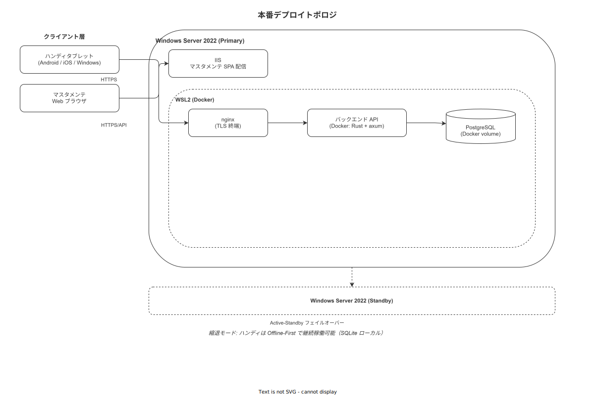
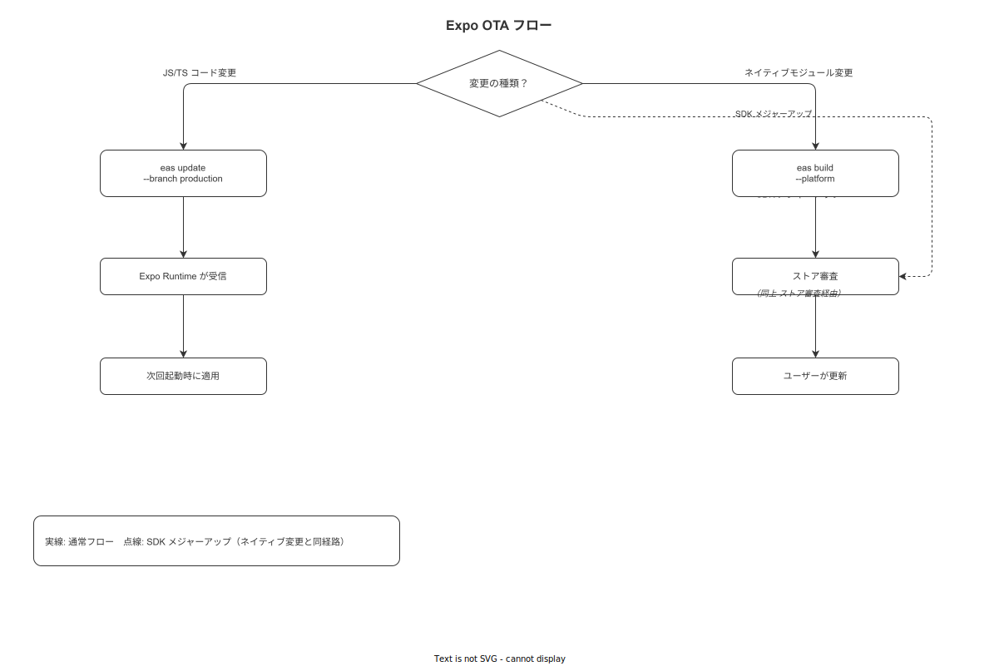

# 10 デプロイ手順

本章は IPA 共通フレーム 2013「2.6 ソフトウェア構築プロセス」のタスク 2.6.3（ソフトウェアの組込み・統合）に対応し、作業ナビゲーション＆トレサビ記録アプリを本番環境へ確実かつ再現可能な手順でリリースするためのデプロイ仕様を定める。

---

## 1. デプロイトポロジ

**図 1: 本番デプロイトポロジ**



> 原本: [`img/fig_deploy_topology_prod.drawio`](img/fig_deploy_topology_prod.drawio)

本システムのデプロイトポロジは以下の構成要素で成立する。

- **フロントエンド（master）**: Windows Server 2022 上の IIS が静的 SPA ファイルを配信
- **バックエンド（terminal-api）**: WSL2 + Docker コンテナで稼働する Rust/axum サーバー（ポート 8080）— ハンディ APP 向け API
- **バックエンド（master-api）**: WSL2 + Docker コンテナで稼働する Rust/axum サーバー（ポート 8081）— マスタメンテナンス向け API
- **ハンディ APP**: Google Play Store / Apple App Store を経由した配布（OTA 更新対応）
- **データベース**: WSL2 コンテナ上の PostgreSQL 17（ポート 5432）
- **リバースプロキシ**: nginx（TLS ターミネーション・upstream ルーティング）

Active-Standby 構成として、本番インスタンスに障害が発生した場合にサービスを継続する縮退モードを定義する。縮退モードでは terminal-api コンテナが停止した状態でも、ハンディ APP は Offline-First 原則に基づきローカル SQLite から手順ナビゲーションを継続し、作業ログを Outbox に蓄積する。terminal-api 復旧後に Outbox が自動同期される。

**本節で確定した方針**
- **Active-Standby 構成を採用する**: terminal-api 停止中もハンディ APP はローカル動作を継続する
- **縮退モードを定義する**: terminal-api 未到達時は Emergency Mode に遷移し、最終同期時刻を常時表示する
- **IIS は静的配信専用とする**: アプリケーションプール再起動なしに master をデプロイ可能にする

---

## 2. 環境分類

| 環境名 | 用途 | デプロイ先 | デプロイ方式 |
|---|---|---|---|
| local | 開発者マシン上での開発・デバッグ | 開発者の WSL2 | 手動（`cargo run` / `pnpm dev`） |
| dev | Docker Compose による完全環境再現・PR 検証 | 開発者マシン Docker | 手動または CI による自動起動 |
| staging | 本番相当の最終検証・リリース前確認 | WSL2 + Docker（本番同構成） | CI 自動デプロイ（タグ push 時） |
| prod | エンドユーザー向け本番稼働 | IIS + Windows Server 2022 / WSL2 + Docker | 手動確認ステップ付き半自動 |

### 環境別設定差異

各環境は `WNAV_PROFILE={local,dev,staging,prod}` と `src/infra/config/config.{profile}.yml` で切り替える（ADR-IMPL-001、詳細は 12 章参照）。  
非機密設定（接続先・ポート・タイムアウト等）は `config.base.yml` + `config.{profile}.yml` で管理し、  
機密（DB パスワード・JWT 鍵・TLS 鍵等）は `secret_ref:` で間接参照して外部 Secret Store から取得する。

| 環境 | YAML 実値ファイル | 機密の取得元 |
|---|---|---|
| local | `config.local.yml`（.gitignore） | `.env` ファイル |
| dev | `config.dev.yml`（.gitignore） | `.env` ファイル |
| staging | `config.staging.yml`（コミット済み） | GitHub Actions Secrets |
| prod | `config.prod.yml`（コミット済み） | Windows DPAPI または Docker secrets |

**本節で確定した方針**
- **4 環境（local / dev / staging / prod）を定義する**: 環境差分は YAML プロファイルで管理し、機密は Secret Store から注入する
- **staging は本番同構成とする**: 本番デプロイ前に staging で検証を必須とする
- **prod への自動デプロイは行わない**: 手動確認ステップを必ず残す
- **`WNAV_PROFILE` を起動コマンドで明示する**: 未設定は起動失敗（exit code 78）とする

---

## 3. backend デプロイ

backend は `wnav_terminal_api`（ポート 8080）と `wnav_master_api`（ポート 8081）の 2 バイナリ構成である。それぞれ独立したコンテナとして管理する。

### 3.1 イメージ取得

```bash
# ghcr.io からリリースイメージを取得する（2 バイナリ分）
docker pull ghcr.io/ryuhei-kiso/wnav-terminal-api:v1.0.0
docker pull ghcr.io/ryuhei-kiso/wnav-master-api:v1.0.0

# タグのダイジェストを確認して改竄がないことを検証する
docker image inspect ghcr.io/ryuhei-kiso/wnav-terminal-api:v1.0.0 \
  --format '{{.RepoDigests}}'
docker image inspect ghcr.io/ryuhei-kiso/wnav-master-api:v1.0.0 \
  --format '{{.RepoDigests}}'
```

### 3.2 コンテナ入れ替え

```bash
# 旧コンテナを停止してから新コンテナを起動する（ダウンタイム目標: 5 分以内）
docker compose down terminal-api master-api

# 環境変数ファイルを指定して新コンテナを起動する
IMAGE_TAG=v1.0.0 docker compose up -d terminal-api master-api

# コンテナが正常起動したことを確認する
docker compose ps terminal-api master-api
```

### 3.3 WSL2 systemd との連携

WSL2 環境では systemd が利用可能な場合、Docker デーモンを systemd unit として管理する。2 バイナリそれぞれに unit ファイルを作成する。

```ini
# /etc/systemd/system/wnav-terminal-api.service
[Unit]
Description=WNAV Terminal API Container
After=docker.service
Requires=docker.service

[Service]
Type=oneshot
RemainAfterExit=yes
WorkingDirectory=/opt/wnav
ExecStart=/usr/bin/docker compose up terminal-api
ExecStop=/usr/bin/docker compose down terminal-api
Restart=on-failure

[Install]
WantedBy=multi-user.target
```

```ini
# /etc/systemd/system/wnav-master-api.service
[Unit]
Description=WNAV Master API Container
After=docker.service
Requires=docker.service

[Service]
Type=oneshot
RemainAfterExit=yes
WorkingDirectory=/opt/wnav
ExecStart=/usr/bin/docker compose up master-api
ExecStop=/usr/bin/docker compose down master-api
Restart=on-failure

[Install]
WantedBy=multi-user.target
```

```bash
# systemd unit を有効化してサービスを起動する
sudo systemctl daemon-reload
sudo systemctl enable wnav-terminal-api.service wnav-master-api.service
sudo systemctl start wnav-terminal-api.service wnav-master-api.service
```

### 3.4 ヘルスチェック確認

```bash
# terminal-api のヘルスチェックエンドポイントを確認する（DB 疎通確認含む）
curl -f http://localhost:8080/healthz

# master-api のヘルスチェックエンドポイントを確認する（DB 疎通確認含む）
curl -f http://localhost:8081/healthz

# 期待するレスポンス例（両バイナリ共通）
# {"status":"ok","db":"connected","version":"1.0.0"}
```

両エンドポイントがともに `200 OK` を返さない場合はデプロイを中断し、ロールバック手順（§ 9 参照）を実行する。

### 3.5 ロールバック

```bash
# 旧バージョンのイメージに戻す（IMAGE_TAG を前バージョンに指定する）
docker compose down terminal-api master-api
IMAGE_TAG=v0.9.0 docker compose up -d terminal-api master-api

# ロールバック後のヘルスチェックを確認する
curl -f http://localhost:8080/healthz
curl -f http://localhost:8081/healthz
```

**本節で確定した方針**
- **ヘルスチェック通過をデプロイ完了条件とする**: `GET /healthz` が両バイナリで `200 OK` を返すまでデプロイ完了と見なさない
- **ロールバックは IMAGE_TAG 指定で即時実行可能とする**: イメージは ghcr.io に 30 日間保持する
- **systemd unit を 2 ファイル（wnav-terminal-api.service / wnav-master-api.service）で定義する**: サーバー再起動時の自動起動を保証する

---

## 4. master デプロイ（静的 SPA → IIS）

master（React SPA）は静的ファイルとして IIS に配信させる。

### 4.1 ビルド

```bash
# master フロントエンドを本番向けにビルドする
cd src/frontend/master
pnpm install --frozen-lockfile
pnpm build

# dist/ ディレクトリに成果物が生成されていることを確認する
ls -la dist/
```

### 4.2 IIS へのコピー

```powershell
# 既存ファイルを新ビルドで完全上書きコピーする
robocopy /MIR dist\ "C:\inetpub\wwwroot\wnav-master\"

# アプリケーションプール再起動は不要（静的ファイルのみのため）
# IIS Manager または appcmd での確認のみ実施する
```

### 4.3 キャッシュ制御

`index.html` のみ `Cache-Control: no-cache` を設定し、ハッシュ付きアセット（JS/CSS）はブラウザキャッシュを利用する。

IIS の `web.config` に以下を設定する。

```xml
<?xml version="1.0" encoding="UTF-8"?>
<configuration>
  <system.webServer>
    <staticContent>
      <!-- index.html のキャッシュを無効化する -->
      <clientCache cacheControlMode="DisableCache" />
    </staticContent>
    <httpProtocol>
      <customHeaders>
        <add name="Cache-Control" value="no-cache" />
      </customHeaders>
    </httpProtocol>
    <rewrite>
      <rules>
        <!-- SPA ルーティングのため全リクエストを index.html にリダイレクトする -->
        <rule name="SPA Fallback" stopProcessing="true">
          <match url=".*" />
          <conditions logicalGrouping="MatchAll">
            <add input="{REQUEST_FILENAME}" matchType="IsFile" negate="true" />
          </conditions>
          <action type="Rewrite" url="/index.html" />
        </rule>
      </rules>
    </rewrite>
  </system.webServer>
</configuration>
```

**本節で確定した方針**
- **IIS アプリケーションプール再起動は不要とする**: 静的ファイル置換のみでデプロイ完了とする
- **index.html のみキャッシュ無効化する**: ハッシュ付きアセットはブラウザキャッシュを活用してパフォーマンスを確保する
- **robocopy /MIR で完全同期する**: 削除されたファイルも IIS から除去されることを保証する

---

## 5. handy デプロイ

ハンディ APP（React Native + Expo）のデプロイ手順を定める。

### 5.1 EAS Build

```bash
# EAS CLI で本番向けビルドを実行する
cd src/frontend/handy
eas build --platform all --profile production

# Android: .aab ファイルを生成する（Google Play 用）
# iOS: .ipa ファイルを生成する（App Store 用）
```

### 5.2 ストア提出

```bash
# Android を Google Play に提出する
eas submit --platform android --latest

# iOS を App Store Connect に提出する
eas submit --platform ios --latest
```

### 5.3 Expo OTA 更新

**図 2: Expo OTA フロー**



> 原本: [`img/fig_ota_flow_expo.drawio`](img/fig_ota_flow_expo.drawio)

JS バンドルのみ変更する場合（ネイティブコード変更なし）は OTA 更新で配信する。

```bash
# production ブランチに OTA 更新を配信する
eas update --branch production --message "v1.0.0 hotfix: xxxxx"

# 更新ステータスを確認する
eas update:list --branch production
```

### 5.4 ストア審査 vs OTA 判定表

| 変更種別 | 例 | 配信方法 |
|---|---|---|
| ネイティブコード変更 | 新しい React Native バージョン・Expo SDK アップグレード・native module 追加 | ストア審査必須 |
| 新しいネイティブ API 権限 | カメラ・位置情報などの Permission 追加 | ストア審査必須 |
| アプリアイコン・スプラッシュ変更 | デザイン刷新 | ストア審査必須 |
| JS バンドルのみの変更 | バグ修正・UI テキスト変更・ロジック改善 | OTA 配信可能 |
| アセット（画像・フォント）変更 | アイコン以外の画像更新 | OTA 配信可能 |

**本節で確定した方針**
- **ストア審査不要な変更は EAS OTA で迅速配信する**: JS バンドルの変更は審査を経ずにユーザーに届ける
- **ネイティブコード変更はストア審査フローに従う**: 審査期間を考慮してリリース計画を立てる
- **EAS submit で提出を自動化する**: 手動アップロードによるミスを排除する

---

## 6. infra デプロイ

インフラ（nginx / TLS / PostgreSQL）の更新手順を定める。

### 6.1 PostgreSQL バックアップ（infra 変更前必須）

```bash
# infra 変更前に必ずバックアップを取得する
pg_dump -h localhost -U wnav_backup -d wnav_prod \
  -Fc -f "/backup/wnav_prod_$(date +%Y%m%d_%H%M%S).dump"

# バックアップファイルのサイズを確認する（0 バイトでないことを確認する）
ls -lh /backup/wnav_prod_*.dump | tail -1
```

### 6.2 nginx 設定変更・リロード

```bash
# nginx 設定の構文チェックを実施する
nginx -t

# 設定が正常な場合のみリロードする（ダウンタイムなし）
nginx -s reload

# リロード後にアクセスログでエラーが発生していないことを確認する
tail -n 50 /var/log/nginx/error.log
```

### 6.3 TLS 証明書ローテーション

```bash
# 証明書の有効期限を確認する（30 日前を更新の目安とする）
openssl x509 -enddate -noout -in /etc/nginx/ssl/wnav.crt

# 新証明書を配置する
cp /tmp/new_wnav.crt /etc/nginx/ssl/wnav.crt
cp /tmp/new_wnav.key /etc/nginx/ssl/wnav.key

# 権限を設定する
chmod 644 /etc/nginx/ssl/wnav.crt
chmod 600 /etc/nginx/ssl/wnav.key

# nginx をリロードして新証明書を適用する
nginx -s reload
```

**本節で確定した方針**
- **infra 変更前に必ず PostgreSQL バックアップを取得する**: バックアップ確認を事前チェックリストに含める
- **nginx は reload でサービス無停止での設定反映を行う**: restart は使用しない
- **TLS 証明書は有効期限 30 日前に更新する**: 期限切れによるサービス停止を防止する

---

## 7. ブルーグリーン/カナリアを採用しない理由

ブルーグリーンデプロイメントおよびカナリアリリースは採用しない。採用しない理由を以下に示す。

| 手法 | 採用しない理由 |
|---|---|
| ブルーグリーン | 個人開発・単一インスタンス構成であり、2 倍のインフラコストを正当化できない |
| カナリア | ユーザー数が少数（初期）のため、段階的ロールアウトの効果が得られない |

代替策として以下を採用する。

- **ダウンタイム目標 5 分以内**: `docker compose down && up` で達成可能
- **ロールバック即時実行**: IMAGE_TAG を前バージョンに切り替えることで 2 分以内にロールバック可能
- **staging での十分な検証**: 本番デプロイ前に本番同構成の staging で全機能を確認する

**本節で確定した方針**
- **ブルーグリーン/カナリアは対象外と判断する**: 個人開発スコープでは停止時間 5 分以内の目標で代替する
- **staging 検証を本番デプロイの必須条件とする**: staging で問題が発見されなかった場合のみ prod にデプロイする
- **ロールバック 2 分以内を目標とする**: IMAGE_TAG 切り替えとヘルスチェックで達成する

---

## 8. デプロイ前チェックリスト

```
[ ] CI パイプライン全ジョブがグリーン（unit / integration / E2E）
[ ] マイグレーション検証完了（sqlx migrate run --dry-run で差分確認）
[ ] staging 環境でのヘルスチェック通過（GET /healthz → 200 OK）
[ ] staging での動作確認完了（主要シナリオ 5 ケース以上）
[ ] PostgreSQL バックアップ取得完了（バックアップファイルサイズ確認）
[ ] WNAV_* 環境変数の設定確認（prod 用の値が正しくセットされている）
[ ] docker pull でイメージのダイジェストを確認済み
[ ] drawio-lint / svg-postcheck ERROR 0 確認（docs 変更がある場合）
[ ] リリースノート作成完了（CHANGELOG.md 更新済み）
[ ] GitHub Releases への draft 作成完了
```

**本節で確定した方針**
- **チェックリストを全件完了するまで prod デプロイを開始しない**: 一部未完了でもデプロイ禁止
- **マイグレーションの dry-run を必須とする**: 意図しないスキーマ変更を本番適用前に検出する
- **バックアップ取得は手動確認を必須とする**: 自動バックアップの成功に依存しない

---

## 9. ロールバック手順

デプロイ後に問題が発見された場合のロールバック手順を定める。

### 9.1 backend ロールバック

```bash
# 現行コンテナを停止して前バージョンのイメージで起動する
docker compose down terminal-api master-api
IMAGE_TAG=v0.9.0 docker compose up -d terminal-api master-api

# ヘルスチェックが通過することを確認する
curl -f http://localhost:8080/healthz
curl -f http://localhost:8081/healthz

# アクセスログでエラーが発生していないことを確認する
docker compose logs --tail=100 terminal-api
docker compose logs --tail=100 master-api
```

### 9.2 DB マイグレーション ロールバック

```bash
# マイグレーションを 1 ステップ戻す（down.sql を実行する）
sqlx migrate revert

# テーブル構造が正しいことを確認する
psql -U wnav_admin -d wnav_prod -c "\d work_events"
```

### 9.3 Outbox 整合確認

ロールバック後、Outbox テーブルに未送信イベントが残っている場合は以下を確認する。

```sql
-- Outbox に未処理メッセージが残っていないか確認する
SELECT COUNT(*) FROM outbox_messages WHERE processed_at IS NULL;

-- 未処理メッセージがある場合、backend 再起動後に自動処理されることを確認する
-- 自動処理されない場合は PROB-NNN として問題ログに記録する
```

### 9.4 master ロールバック

```powershell
# Git から前バージョンのビルドアーティファクトを復元する
# または CI の artifacts から前バージョンの dist/ をダウンロードする
robocopy /MIR "C:\backup\wnav-master-prev\" "C:\inetpub\wwwroot\wnav-master\"
```

**本節で確定した方針**
- **ロールバック手順は本番デプロイ前に必ず把握しておく**: ロールバック手順を知らない状態でのデプロイは禁止
- **DB マイグレーションは down.sql を必ずセットで作成する**: ロールバック不能なマイグレーションは実装禁止
- **Outbox の整合確認をロールバック後の必須チェックとする**: 未処理 Outbox の放置はデータ損失につながる

---

## 10. リリースゲート

| ゲート種別 | 条件 | 確認方法 |
|---|---|---|
| 自動ゲート | CI パイプライン全ジョブ通過 | GitHub Actions のステータスが全て ✓ |
| 自動ゲート | SAST スキャン（cargo audit / pnpm audit）クリティカル 0 | CI ログで確認 |
| 自動ゲート | カバレッジ目標達成（backend ≥ 80% / handy ≥ 75% / master ≥ 75%） | CI カバレッジレポートで確認 |
| 手動ゲート | セルフレビュー完了（14 章 チェックリスト全件） | PR に `self-review: done` ラベル付与 |
| 手動ゲート | staging ドライラン確認（主要シナリオ通過） | staging デプロイログとヘルスチェック結果 |
| 本番ゲート | デプロイ前チェックリスト（§ 8）全件完了 | チェックリストのスクリーンショットを記録 |

リリースゲートのいずれかを通過できない場合、リリースを延期する。回避策やゲート免除は ADR-IMPL-NNN として記録する。

**本節で確定した方針**
- **自動ゲートと手動ゲートを組み合わせて品質を保証する**: CI だけに頼らずセルフレビューを必須とする
- **ゲート免除は ADR-IMPL-NNN に記録する**: 例外の根拠を必ず残す
- **prod への本番ゲートは手動確認を必須とする**: 自動デプロイは prod には適用しない

---

## 参照業界分析

### 必須
- [`90_業界分析/27_オフライン同期とデータ整合性.md`](../../90_業界分析/27_オフライン同期とデータ整合性.md)

### 関連
- [`90_業界分析/38_災害・BCP・緊急時手順と作業継続.md`](../../90_業界分析/38_災害・BCP・緊急時手順と作業継続.md)
- [`90_業界分析/07_スマートファクトリーと作業のデジタル化.md`](../../90_業界分析/07_スマートファクトリーと作業のデジタル化.md)
- [`90_業界分析/29_競合製品と作業ナビ・MES・eBR市場.md`](../../90_業界分析/29_競合製品と作業ナビ・MES・eBR市場.md)
