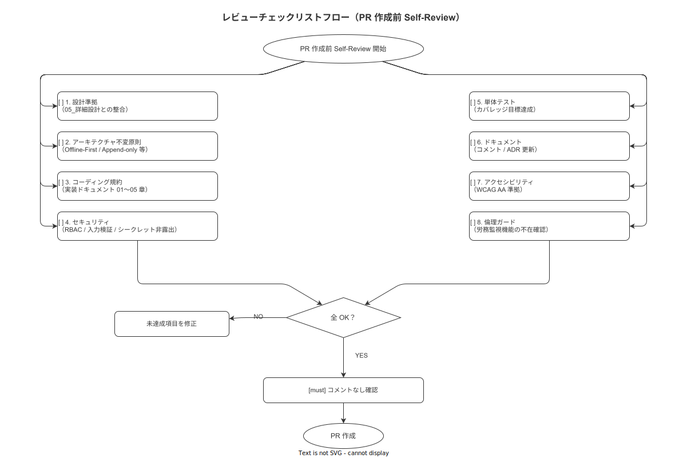

# 14 コードレビュー手順と記録テンプレ

本章はコードレビューの目的・手順・観点・記録テンプレートを定める。個人開発スコープにおいては自己レビューを強化し、品質確保の主要手段として位置づける。

---

## 1. レビュー目的

本プロジェクトのコードレビューは IPA 共通フレーム 2013「支援プロセス 6.6 共同レビュー」に準拠し、以下の目的で実施する。

| 目的 | 内容 | 達成手段 |
|---|---|---|
| 品質向上 | バグ・設計の問題を早期発見する | チェックリストに基づく系統的なレビュー |
| アーキテクチャ整合 | 不変原則からの逸脱を防止する | 観点チェックリストで不変原則を必須確認項目とする |
| 知識統合 | コードの意図と設計判断を記録として残す | レビュー記録（CR-NNN）の作成 |
| 継続改善 | レビューで発見した問題を蓄積する | PROB-NNN として 17 章に連携する |

個人開発においてはピアレビューを実施できないため、セルフレビューの時間と質を向上させることで品質を代替的に確保する。セルフレビューは PR 作成の必須条件とする。

**本節で確定した方針**
- **コードレビューは IPA CF 2013 共同レビューに準拠する**: 個人開発でも形式を維持して品質を確保する
- **セルフレビューを PR 作成の必須条件とする**: チェックリストを完了しない限り PR を作成しない
- **レビューで発見した問題は PROB-NNN として問題ログに記録する**: 改善サイクルを維持する

---

## 2. レビュー観点チェックリスト

**図 1: レビューチェックリストフロー**



> 原本: [`img/fig_review_checklist_flow.drawio`](img/fig_review_checklist_flow.drawio)

コードレビュー時は以下の観点を表形式で確認する。

| 観点 | 確認項目 | 重要度 |
|---|---|---|
| 設計準拠 | 詳細設計（05_詳細設計）の仕様通りに実装されているか | 必須 |
| 設計準拠 | MOD-NNN / API-NNN / TBL-NNN の識別子が正しく参照されているか | 必須 |
| アーキテクチャ不変原則 | Offline-First 原則が守られているか（ローカル動作を優先しているか） | 必須 |
| アーキテクチャ不変原則 | Append-only Event Sourcing が守られているか（UPDATE/DELETE がないか） | 必須 |
| アーキテクチャ不変原則 | Idempotent API が実装されているか（Idempotency-Key の検証があるか） | 必須 |
| アーキテクチャ不変原則 | SHA-256 ハッシュチェーンが正しく連結されているか | 必須 |
| コーディング規約 | Rust: `#![forbid(unsafe_code)]` が明記されているか | 必須 |
| コーディング規約 | TypeScript: `any` が使用されていないか | 必須 |
| コーディング規約 | コメントが「なぜそうするか」を説明しているか | 推奨 |
| コーディング規約 | 命名規約（スネークケース/キャメルケース/パスカルケース）が正しいか | 必須 |
| セキュリティ | JWT 検証が正しく実装されているか | 必須 |
| セキュリティ | RBAC が型で強制されているか（Rust: 型パラメータで認可） | 必須 |
| セキュリティ | SQL インジェクションが防止されているか（sqlx query! マクロの使用） | 必須 |
| セキュリティ | シークレットがコードにハードコードされていないか | 必須 |
| セキュリティ | 倫理ガード: 個人別労務監視機能が実装されていないか | 必須 |
| テスト | 単体テストが追加されているか（新機能・バグ修正には必須） | 必須 |
| テスト | カバレッジ目標を維持できているか | 必須 |
| テスト | テスト命名規約（`should_<expected>_when_<condition>`）に従っているか | 推奨 |
| ドキュメント | ADR が必要な設計変更に ADR-IMPL-NNN が記録されているか | 必須 |
| ドキュメント | コードコメントが最新の実装を反映しているか | 推奨 |
| アクセシビリティ | WCAG 2.1 AA 準拠: 色だけで情報を伝えていないか | 推奨 |
| アクセシビリティ | スクリーンリーダー用 `accessibilityLabel` が付与されているか（handy） | 推奨 |
| パフォーマンス | Glanceable 要件: 現在ステップ表示 200ms / ページ遷移 500ms / QR 認識 1 秒 | 必須 |
| パフォーマンス | 不要な再レンダリングが発生していないか（`useMemo` / `useCallback` の適切な使用） | 推奨 |
| 倫理ガード | XES イベントにスキップステップが記録されているか（Complete 原則） | 必須 |

**本節で確定した方針**
- **必須観点 18 項目を全て確認してからレビュー完了とする**: 推奨観点はベストエフォートで確認する
- **倫理ガードをレビュー観点に含める**: 個人別労務監視機能の混入を技術的に防止する
- **Glanceable 要件達成をレビューで確認する**: 性能要件をコードレビューの段階で担保する

---

## 3. セルフレビュー手順

PR を作成する前に以下の手順でセルフレビューを実施する。

```bash
# 1. main ブランチからの全差分を確認する
git diff main..HEAD

# 2. ファイル一覧を確認して変更範囲を把握する
git diff main..HEAD --name-only

# 3. コミットメッセージを確認して変更意図が伝わるか確認する
git log main..HEAD --oneline

# 4. CI が通過していることを確認する（ローカルで実行する）
cargo nextest run --all-features  # backend
pnpm test                          # handy / master
cargo clippy -- -D warnings       # backend Clippy
```

セルフレビューのステップ:

```
[ ] git diff でコード差分を読む（1 行ずつ確認する）
[ ] チェックリスト（§ 2 の全必須観点）を確認する
[ ] テストが追加または更新されていることを確認する
[ ] コミットメッセージが変更を正確に説明していることを確認する
[ ] 設計変更がある場合は ADR-IMPL-NNN を作成済みであることを確認する
[ ] CI をローカルで実行してグリーンであることを確認する
[ ] PR の説明文を記載する（変更内容・背景・テスト方法）
```

**本節で確定した方針**
- **`git diff main..HEAD` で全差分を確認してからセルフレビューを開始する**: 差分を見ないレビューは無効とする
- **チェックリストを全件確認するまで PR を作成しない**: チェックリストの省略は品質低下につながる
- **CI をローカルで事前実行してグリーンを確認する**: CI 失敗の PR は作成しない

---

## 4. レビュアー指名規約

個人開発のため、セルフレビューを基本とする。外部レビューの取り扱いを以下に定める。

| レビュアー種別 | 指名条件 | レビュー方法 |
|---|---|---|
| 自己（必須） | 全 PR に適用 | GitHub PR のコメント機能 / ローカルでのコード読み込み |
| 外部レビュアー（任意） | セキュリティ影響が高い変更・アーキテクチャ変更 | GitHub の `Request review` 機能で指名 |
| コードレビュー支援ツール（任意） | 複雑なアルゴリズム変更・大規模リファクタリング | コード断片を支援ツールに入力してレビュー観点の洗い出しを補助させる |

コードレビュー支援ツールの活用は任意とする。支援ツールの提案は参考意見として扱い、最終判断は開発者が行う。

**本節で確定した方針**
- **セルフレビューを全 PR の必須条件とする**: ピアレビューがない分、自己レビューの質を高める
- **セキュリティ影響が高い変更は外部レビューを検討する**: 認証・認可・暗号化に関する変更が対象
- **支援ツールの活用を許可するが最終判断は人間が行う**: ツールに依存した判断を禁止する

---

## 5. コメントの粒度

レビューコメントは以下の 4 段階に分類する。

| プレフィックス | 意味 | 対処 |
|---|---|---|
| `[must]` | 必ず修正が必要（バグ・セキュリティ問題・不変原則違反） | マージ前に修正してコミットを追加する |
| `[should]` | 修正を強く推奨（設計改善・可読性向上） | 原則として修正する。修正しない場合は理由をコメントで返す |
| `[nit]` | 細かい好みの問題（スタイル・命名の好み） | 修正しなくてもよい。対話として使用する |
| `[question]` | 疑問・確認（理解のための質問） | 回答または補足コメントを追加する |

```
// PR コメントの例
// [must] app_event_insert ロールで UPDATE を呼び出しています。
//        Append-only 原則違反のため、修正が必要です。
//        PROB-NNN として問題ログに記録してください。

// [should] このメソッドはテーブル駆動テストに変換できます。
//          境界値を明示的にテストすることで品質が向上します。

// [nit] 変数名 `tmp` より `pending_events` の方が意図が伝わります。
//       （修正は任意です）

// [question] このハッシュ計算で prev_hash が None の場合はどう扱いますか？
//            genesis block の扱いを確認させてください。
```

**本節で確定した方針**
- **4 段階のプレフィックス（must / should / nit / question）を全コメントで使用する**: コメントの優先度を明確にする
- **`[must]` コメントはマージ前に全件解消する**: 解消せずにマージすることを禁止する
- **`[nit]` は強制しない**: スタイルの好みで実装を制限しない

---

## 6. コードレビュー記録テンプレ

セルフレビューの記録は以下のテンプレートで作成し、`docs/06_実装/レビュー記録/` に保存する。

```markdown
# CR-NNN: レビュー記録

日付: YYYY-MM-DD
対象 PR: #NNN
変更概要: （変更の概要を 1〜2 文で記述する）
対応 IMPL-ID: IMPL-NNN（複数の場合はカンマ区切り）
所要時間: N 分
レビュアー: RyuheiKiso（セルフレビュー）

## 検出した問題

| ID | 観点 | 箇所（ファイル:行） | 内容 | 深刻度 | 対処 |
|---|---|---|---|---|---|
| CR-NNN-001 | セキュリティ | src/backend/src/auth.rs:42 | JWT 有効期限の検証が欠落 | [must] | commit abc123 で修正 |
| CR-NNN-002 | テスト | src/backend/src/domain/hash_chain.rs | ブランチカバレッジが 68%（目標 70%） | [should] | 境界値テストを追加 |

## 確定事項

- （レビューを通じて確定した設計・実装上の決定事項を記述する）

## 指摘未対応（次回持越し）

- （今回のレビューで対処しなかった指摘とその理由を記述する）

## チェックリスト完了確認

- [ ] 必須観点 18 項目を全て確認した
- [ ] `[must]` コメントを全件解消した
- [ ] CI がグリーンであることを確認した
```

**本節で確定した方針**
- **CR-NNN の採番は付録/99_採番台帳で管理する**: 欠番禁止ルールを遵守する
- **レビュー記録は `docs/06_実装/レビュー記録/` に保存する**: 後から検索可能な形で残す
- **検出した問題の全件を記録する**: 対処済みの問題も記録し、品質改善のトレンドを追跡する

---

## 7. レビュー所要時間目標

| 変更規模 | 目標時間 | 超過時の対処 |
|---|---|---|
| 変更 100 行以下 | 20 分以内 | — |
| 変更 100〜500 行 | 30〜60 分 | 60 分を超える場合は PR を分割する |
| 変更 500 行超 | 60 分以内（PR を分割する） | PR を機能・レイヤ単位で分割して個別にレビューする |

```bash
# 変更行数を確認する
git diff main..HEAD --stat | tail -1
# 例: 15 files changed, 423 insertions(+), 89 deletions(-)
```

PR の分割基準:
- 1 PR = 1 機能または 1 バグ修正
- リファクタリングと機能追加は別 PR に分ける
- データベーススキーマ変更は必ず独立した PR とする

**本節で確定した方針**
- **変更 500 行超の PR は分割する**: 大規模な PR はレビュー品質が低下するリスクがある
- **1 PR = 1 つの変更目的を原則とする**: 複数の変更目的を混在させない
- **DB スキーマ変更は独立した PR とする**: マイグレーションの安全性確保のため

---

## 8. 問題管理ログ連携

コードレビューで発見した問題は重要度に応じて問題管理ログ（17 章）に連携する。

| 深刻度 | 連携条件 | 登録方法 |
|---|---|---|
| Critical / High | 発見と同時に PROB-NNN として即時登録する | 17 章のテンプレートに記録 |
| Medium | レビュー完了後に PROB-NNN として登録する | CR-NNN の「検出した問題」から転記 |
| Low / nit | PR のコメントのみで管理する（PROB-NNN 不要） | — |

```markdown
# PROB-NNN のレビュー連携記録例

日付: 2026-05-17
種別: BUG
Severity: High
検出フェーズ: コードレビュー（CR-005）
対象 PR: #42

## 現象
app_event_insert ロールで work_events に UPDATE を呼び出すコードが混入した。

## 発見経緯
CR-005 のセルフレビュー中にアーキテクチャ不変原則確認で発見した。

## 対処
IMPL-023 を修正。sqlx::query! マクロで event_insert_pool 専用の INSERT のみ使用するよう変更した。
```

**本節で確定した方針**
- **Critical/High はレビューと同時に PROB-NNN に登録する**: 放置リスクを排除する
- **PROB-NNN には発見時のレビュー記録（CR-NNN）への参照を含める**: 問題のコンテキストを保持する
- **Low/nit は PR コメントのみで管理する**: 問題ログを軽微な指摘で肥大化させない

---

## 9. ペアプロ/モブプロの位置づけ

個人開発のため、ペアプログラミング（ペアプロ）およびモブプログラミング（モブプロ）は **対象外と判断する**。代替手段として以下を実施する。

| 手法 | 採用しない理由 | 代替手段 |
|---|---|---|
| ペアプロ | 個人開発であり、常時ペアとなる相手がいない | セルフレビュー時間の増加（60 分/PR） |
| モブプロ | 個人開発であり、チームがない | コードレビュー支援ツールをレビュー補助として活用（任意） |

セルフレビューの質を高めるための実践として、「コードを書いてから 24 時間以上置いてからレビューする」「コードを音読してレビューする」などの手法を採用する。

**本節で確定した方針**
- **ペアプロ・モブプロは対象外と判断する**: 個人開発スコープでは適用しない
- **セルフレビュー時間を増加させて品質を代替確保する**: 1 PR あたり 60 分以上のレビューを目標とする
- **コードレビュー支援ツールは任意の品質向上手段として位置づける**: 必須要件ではなく任意の補助手段

---

## 参照業界分析

### 必須
- [`90_業界分析/19_電子チェックリストと手順遵守の科学.md`](../../90_業界分析/19_電子チェックリストと手順遵守の科学.md)

### 関連
- [`90_業界分析/04_ヒューマンエラーと安全工学.md`](../../90_業界分析/04_ヒューマンエラーと安全工学.md)
- [`90_業界分析/28_不適合と手順改訂のフィードバックループ.md`](../../90_業界分析/28_不適合と手順改訂のフィードバックループ.md)
- [`90_業界分析/39_QCサークル・Kaizen Teianとボトムアップ品質活動.md`](../../90_業界分析/39_QCサークル・Kaizen Teianとボトムアップ品質活動.md)
