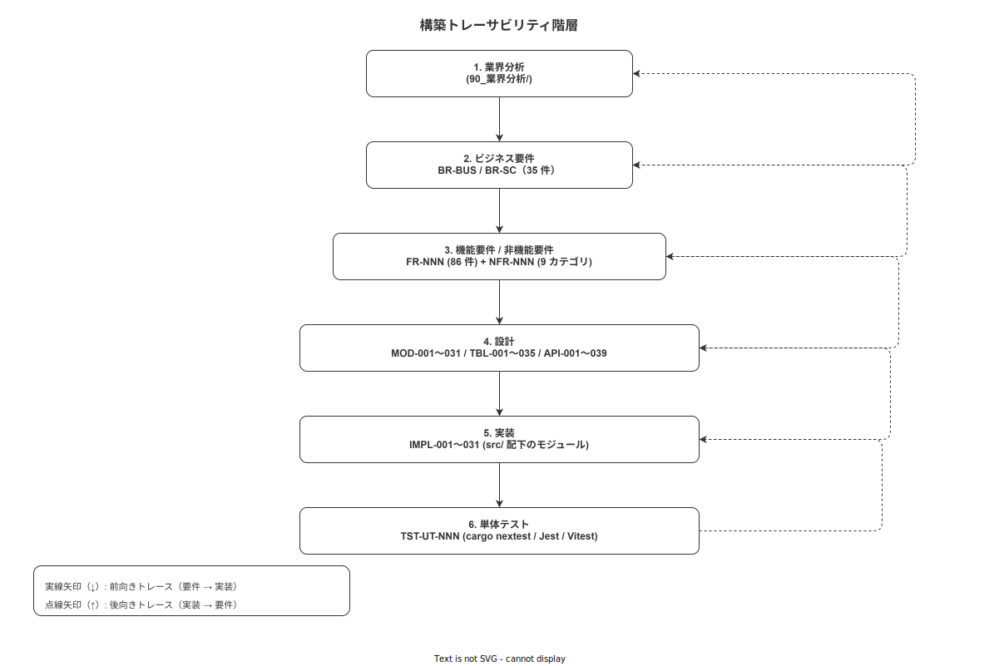

# 15 構築トレーサビリティ

本章は上流要件から実装モジュール・テストまでの 6 段トレーサビリティを定義し、実装フェーズでの追跡可能性を確保する。

---

## 1. 6 段トレーサビリティ

**図 1: 構築トレーサビリティ階層**



> 原本: [`img/fig_construction_trace_hierarchy.drawio`](img/fig_construction_trace_hierarchy.drawio)

本システムのトレーサビリティは以下の 6 層で構成される。

| 層 | 識別子体系 | 件数 | 権威ドキュメント |
|---|---|---|---|
| 業界分析 | 90_業界分析/NN_*.md | 39 件 | docs/90_業界分析/ |
| ビジネス要件 (BR) | BR-NNN | 35 件 | docs/02_企画/要件管理/ |
| 機能要件 / 非機能要件 | FR-NNN / NFR-NNN | 86 + 9 件 | docs/03_要件定義/ |
| 設計 | MOD-NNN / TBL-NNN / API-NNN | 31 / 35 / 39 件 | docs/04_概要設計/ / docs/05_詳細設計/ |
| 実装モジュール | IMPL-NNN | 実装フェーズで採番 | 本章 / docs/06_実装/付録/ |
| テストケース | TST-NNN | テストフェーズで採番 | docs/07_テスト/ |

前向きトレーサビリティ（FR → 設計 → IMPL → TST）と後向きトレーサビリティ（IMPL → FR → BR）の双方向を本章で管理する。

**本節で確定した方針**
- **6 段トレーサビリティを本システムの品質管理基盤とする**: 要件から実装まで一本線で追跡できることを保証する
- **IMPL-NNN は実装着手時に採番する**: 設計フェーズでの先行採番は行わない
- **TST-NNN は docs/07_テスト/ が権威とする**: 本章はサマリのみ管理する

---

## 2. 詳細設計 → 実装モジュール対応表

詳細設計（05_詳細設計）の設計 ID と実装モジュール（IMPL-NNN）の対応を管理する。

| 詳細設計サブ | 設計 ID | IMPL-ID | 主担当ファイル（src/ 配下） | ステータス |
|---|---|---|---|---|
| 02_バックエンド | MOD-001 | IMPL-001 | src/backend/src/domain/hash_chain/ | 未着手 |
| 02_バックエンド | MOD-002 | IMPL-002 | src/backend/src/domain/event/ | 未着手 |
| 02_バックエンド | MOD-003 | IMPL-003 | src/backend/src/domain/outbox/ | 未着手 |
| 02_バックエンド | MOD-004 | IMPL-004 | src/backend/src/auth/ | 未着手 |
| 02_バックエンド | MOD-005 | IMPL-005 | src/backend/src/middleware/idempotency.rs | 未着手 |
| 02_バックエンド | MOD-006 | IMPL-006 | src/backend/src/middleware/rate_limit.rs | 未着手 |
| 02_バックエンド | MOD-007 | IMPL-007 | src/backend/src/webhook/ | 未着手 |
| 03_API | API-001〜039 | IMPL-008 | src/backend/src/api/ | 未着手 |
| 01_データベース | TBL-001〜035 | IMPL-009 | src/backend/migrations/ | 未着手 |
| 04_ハンディAPP | MOD-010 | IMPL-010 | src/frontend/handy/src/engine/ | 未着手 |
| 04_ハンディAPP | MOD-011 | IMPL-011 | src/frontend/handy/src/network/ | 未着手 |
| 04_ハンディAPP | MOD-012 | IMPL-012 | src/frontend/handy/src/outbox/ | 未着手 |
| 04_ハンディAPP | MOD-013 | IMPL-013 | src/frontend/handy/src/db/ | 未着手 |
| 04_ハンディAPP | MOD-014 | IMPL-014 | src/frontend/handy/src/auth/ | 未着手 |
| 04_ハンディAPP | MOD-015 | IMPL-015 | src/frontend/handy/src/screens/Navigation/ | 未着手 |
| 04_ハンディAPP | MOD-016 | IMPL-016 | src/frontend/handy/src/screens/WorkRecord/ | 未着手 |
| 04_ハンディAPP | MOD-017 | IMPL-017 | src/frontend/handy/src/screens/QRScan/ | 未着手 |
| 04_ハンディAPP | MOD-018 | IMPL-018 | src/frontend/handy/src/screens/Signature/ | 未着手 |
| 04_ハンディAPP | MOD-019 | IMPL-019 | src/frontend/handy/src/screens/EmergencyMode/ | 未着手 |
| 05_WebAPP | MOD-020 | IMPL-020 | src/frontend/master/src/pages/ProcedureEdit/ | 未着手 |
| 05_WebAPP | MOD-021 | IMPL-021 | src/frontend/master/src/pages/WorkerManage/ | 未着手 |
| 05_WebAPP | MOD-022 | IMPL-022 | src/frontend/master/src/pages/AuditTrail/ | 未着手 |
| 05_WebAPP | MOD-023 | IMPL-023 | src/frontend/master/src/pages/WorkOrderManage/ | 未着手 |
| 05_WebAPP | MOD-024 | IMPL-024 | src/frontend/master/src/api/ | 未着手 |
| 05_WebAPP | MOD-025 | IMPL-025 | src/frontend/master/src/auth/ | 未着手 |
| 07_アルゴリズム | MOD-026 | IMPL-026 | src/backend/src/domain/step_engine/ | 未着手 |
| 07_アルゴリズム | MOD-027 | IMPL-027 | src/backend/src/domain/json_logic/ | 未着手 |
| 07_アルゴリズム | MOD-028 | IMPL-028 | src/backend/src/domain/hash_chain/verifier.rs | 未着手 |
| 02_バックエンド | MOD-029 | IMPL-029 | src/backend/src/db/ | 未着手 |
| 02_バックエンド | MOD-030 | IMPL-030 | src/backend/src/error.rs | 未着手 |
| 02_バックエンド | MOD-031 | IMPL-031 | src/backend/src/main.rs | 未着手 |

実装着手時に IMPL-NNN のステータスを「着手中」に、完了時に「完了」に更新する。

**本節で確定した方針**
- **全 31 MOD に IMPL-NNN を割り当てる**: MOD なしの実装は IMPL-NNN として登録してから着手する
- **主担当ファイルは src/ 相対パスで記録する**: 実装着手時に実際のパスに更新する
- **ステータスは未着手 / 着手中 / 完了 の 3 段階で管理する**: 実装進捗をこの表で一元把握する

---

## 3. 実装モジュール → 単体テスト ID 対応表

IMPL-NNN と対応する単体テスト（TST-NNN）の関係を管理する。

| IMPL-ID | モジュール名 | TST-ID | テストファイルパス（src/ 配下） | カバレッジステータス |
|---|---|---|---|---|
| IMPL-001 | hash_chain domain | TST-001〜TST-010 | src/backend/src/domain/hash_chain/mod.rs の #[cfg(test)] | 未計測 |
| IMPL-002 | event domain | TST-011〜TST-020 | src/backend/src/domain/event/mod.rs の #[cfg(test)] | 未計測 |
| IMPL-003 | outbox domain | TST-021〜TST-030 | src/backend/src/domain/outbox/mod.rs の #[cfg(test)] | 未計測 |
| IMPL-004 | auth | TST-031〜TST-040 | src/backend/src/auth/mod.rs の #[cfg(test)] | 未計測 |
| IMPL-005 | idempotency middleware | TST-041〜TST-050 | src/backend/src/middleware/idempotency.rs の #[cfg(test)] | 未計測 |
| IMPL-009 | DB migrations | TST-051〜TST-060 | src/backend/tests/integration/ | 未計測 |
| IMPL-010 | step engine (handy) | TST-061〜TST-080 | src/frontend/handy/src/engine/__tests__/ | 未計測 |
| IMPL-011 | network state (handy) | TST-081〜TST-090 | src/frontend/handy/src/network/__tests__/ | 未計測 |
| IMPL-012 | outbox (handy) | TST-091〜TST-100 | src/frontend/handy/src/outbox/__tests__/ | 未計測 |

テスト実装完了時に TST-NNN を確定し、このテーブルを更新する。

**本節で確定した方針**
- **全 IMPL-NNN に TST-NNN を最低 1 件以上対応させる**: TST が 0 件の IMPL-NNN は未完成とみなす
- **テストファイルパスを具体的に記録する**: テストが正しい場所に存在することを確認可能にする
- **カバレッジステータスは CI 計測後に更新する**: 未計測のまま長期放置しない

---

## 4. 双方向トレーサビリティ

### 4.1 前向きトレーサビリティ（FR → TST）

機能要件から実装・テストへの前向きトレースの例を示す。

```
FR-045（ステップ完了記録）
  ↓ 実現する設計
  MOD-002（EventDomain）, API-012（POST /api/v1/work-events）, TBL-010（work_events）
  ↓ 実装する
  IMPL-002（src/backend/src/domain/event/）
  IMPL-008（src/backend/src/api/work_events.rs）
  IMPL-009（src/backend/migrations/005_work_events.sql）
  ↓ テストする
  TST-011（should_create_work_event_with_valid_payload）
  TST-012（should_append_hash_to_event_chain）
  TST-051（should_reject_update_on_work_events）
```

### 4.2 後向きトレーサビリティ（IMPL → BR）

実装から要件への後向きトレースの例を示す。

```
IMPL-001（hash_chain domain）
  ↑ 設計 ID
  MOD-001（HashChainDomain）
  ↑ 設計 ID からの逆引き
  FR-001（作業記録の改竄防止）, FR-002（SHA-256 ハッシュチェーン連結）
  ↑ FR からの逆引き
  BR-003（トレーサビリティ完全性保証）
  ↑ BR からの逆引き
  90_業界分析/06_品質管理とトレーサビリティ.md（業界知見）
```

**本節で確定した方針**
- **前向き・後向きトレーサビリティを双方向で維持する**: 実装変更時に影響する上流要件を特定できる
- **FR → TST のパスが途切れないことを CI で確認する**: カバレッジ計測で間接的に保証する
- **IMPL の追加・変更時は影響する FR と BR を確認する**: 要件との整合を実装段階で維持する

---

## 5. ITM（実装トレーサビリティマトリクス）管理ポリシー

| 管理対象 | 権威ドキュメント | 更新頻度 |
|---|---|---|
| FR ↔ MOD/API/TBL マトリクス | docs/05_詳細設計/付録/ | 設計変更時 |
| MOD ↔ IMPL マトリクス（詳細） | docs/06_実装/付録/01_実装トレーサビリティマトリクス.md | 実装着手・完了時 |
| IMPL ↔ TST マトリクス | docs/07_テスト/ | テスト追加時 |
| 本章（サマリ） | 本章 § 2, § 3 | 月次または設計変更時 |

本章は付録/01 の実装トレーサビリティマトリクスから最新状態を定期的に転記してサマリを維持する。付録/01 が権威であり、本章とのズレは付録/01 を正とする。

**本節で確定した方針**
- **付録/01 を実装 ITM の権威とする**: 本章はサマリ目的であり付録/01 の代替ではない
- **月次または設計変更時に本章を更新する**: 最新状態との乖離を 1 ヶ月以内に解消する
- **本章と付録/01 に矛盾が発生した場合は付録/01 を正とする**: 権威の所在を明確にする

---

## 6. 更新トリガー

本章（および付録/01 の実装 ITM）を更新するタイミングを定める。

| トリガー | 更新内容 |
|---|---|
| 実装着手時 | § 2 の対象行のステータスを「未着手」→「着手中」に変更し、主担当ファイルパスを確定する |
| 実装完了時 | § 2 のステータスを「着手中」→「完了」に変更する |
| テスト追加時 | § 3 に TST-NNN を追加してカバレッジステータスを更新する |
| 設計変更時 | ADR-IMPL-NNN を記録後、影響する行を更新する |
| CI カバレッジ計測後 | § 3 のカバレッジステータスを「計測済み・N%」に更新する |
| 月次見直し | § 2 / § 3 の全行をスキャンして最新状態に同期する |

```bash
# 月次見直しの手順（例）
# 1. git log --oneline で直近のコミットを確認する
git log --oneline --since="1 month ago"

# 2. 変更されたファイルを確認する
git diff --name-only HEAD~30..HEAD

# 3. src/ 配下の変更に対応する IMPL-NNN が本章に反映されているか確認する
grep -r "IMPL-" docs/06_実装/15_構築トレーサビリティ.md
```

**本節で確定した方針**
- **実装着手と同時に本章を更新する**: 後から一括更新せず、実施と記録を同時に行う
- **月次見直しを必須とする**: 定期的な棚卸しで実態と記録の乖離を解消する
- **トリガーを明示してうっかり更新漏れを防止する**: チェックリストとして機能させる

---

## 7. カバレッジ判定

実装フェーズの品質保証として、以下の条件を全て満たした場合にのみ「実装フェーズ完了」と判定する。

```
✓ 全 IMPL-NNN のステータスが「完了」
✓ 全 IMPL-NNN に対応する TST-NNN が最低 1 件存在する
✓ CI の全ジョブがグリーン（lint / unit-test / integration-test / build / security-scan）
✓ カバレッジ目標を全コンポーネントで達成している
  - backend: ライン ≥ 80%, ブランチ ≥ 70%
  - handy: ライン ≥ 75%, ブランチ ≥ 65%
  - master: ライン ≥ 75%, ブランチ ≥ 65%
✓ drawio-lint / svg-postcheck ERROR 0（docs 変更がある場合）
```

カバレッジが目標未達の場合、不足している IMPL-NNN と TST-NNN を特定して追加テストを実装する。未達の状態で次フェーズ（07_テスト）に移行しない。

**本節で確定した方針**
- **全 IMPL-NNN に TST-NNN ≥ 1 件の対応を実装完了の必須条件とする**: TST のない IMPL は完成とみなさない
- **カバレッジ目標未達での次フェーズ移行を禁止する**: 品質基準を妥協しない
- **カバレッジ判定は CI で自動化する**: 手動確認に依存しない判定体制を維持する

---

## 参照業界分析

### 必須
- [`90_業界分析/06_品質管理とトレーサビリティ.md`](../../90_業界分析/06_品質管理とトレーサビリティ.md)

### 関連
- [`90_業界分析/22_規制別トレーサビリティ要件詳論.md`](../../90_業界分析/22_規制別トレーサビリティ要件詳論.md)
- [`90_業界分析/21_作業ログ分析とプロセスマイニング.md`](../../90_業界分析/21_作業ログ分析とプロセスマイニング.md)
- [`90_業界分析/28_不適合と手順改訂のフィードバックループ.md`](../../90_業界分析/28_不適合と手順改訂のフィードバックループ.md)
