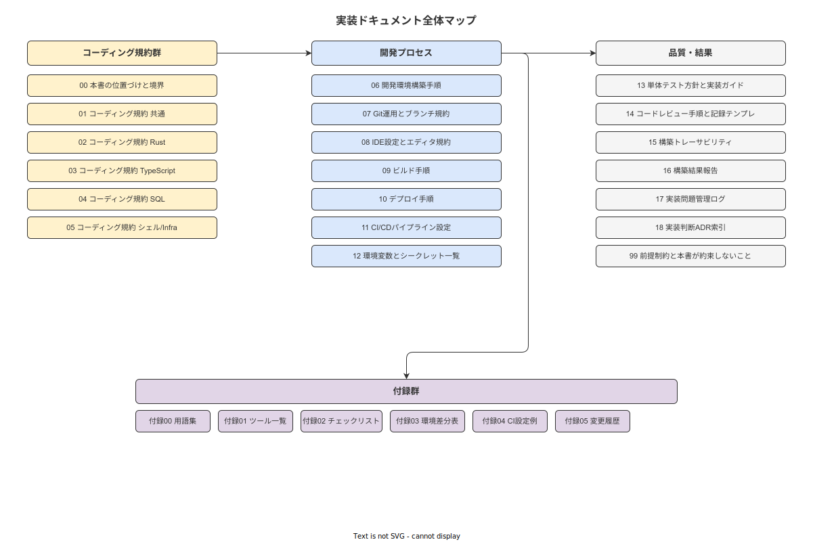

# 06 実装

IPA 共通フレーム 2013「**6.3.6 ソフトウェア構築プロセス**」に準拠した実装フェーズの標準文書群。
実装コード本体は `src/` に配置し、本書は実装を支える方針・手順・記録を定義する。

---

## §1 位置づけ

| 軸 | 内容 |
|---|---|
| **準拠プロセス** | SLCP-JCF2013 6.3.6 ソフトウェア構築プロセス（全タスク → [付録/02](付録/02_IPA共通フレームソフトウェア構築プロセスカバレッジマトリクス.md) でカバレッジ確認）|
| **上流文書** | [`../05_詳細設計/`](../05_詳細設計/README.md)（31 MOD / 35 TBL / 39 API / 86 FR を継承、変更しない）|
| **下流文書** | [`../07_テスト/`](../07_テスト/README.md)（テスト仕様書・実施結果・カバレッジレポート）|
| **実装コード** | `src/backend/`、`src/frontend/handy/`、`src/frontend/master/`、`src/infra/` |
| **src との関係** | `src/CLAUDE.md` の暫定規約を [01〜05 章](01_コーディング規約_共通.md) が権威化。src 側からは本書へのリンクで参照する。|

---

## §2 章別索引

**図 1: 実装ドキュメント全体マップ**



> 原本: [`img/fig_impl_doc_map.drawio`](img/fig_impl_doc_map.drawio)

| ファイル | IPA 6.3.6 タスク対応 | 主な成果物 |
|---|---|---|
| [00_本書の位置づけと境界](00_本書の位置づけと境界.md) | — | 位置づけ・上流継承・分担表・src との関係 |
| [01_コーディング規約_共通](01_コーディング規約_共通.md) | 構築タスク 1: 実装方針策定 | 横断命名・コメント・ログ・セキュリティ・倫理ガード |
| [02_コーディング規約_Rust](02_コーディング規約_Rust.md) | 構築タスク 1 | Rust Edition 2024・clippy/rustfmt・sqlx・RBAC 型強制 |
| [03_コーディング規約_TypeScript](03_コーディング規約_TypeScript.md) | 構築タスク 1 | strict mode・React/RN・TypeORM Append-only・WCAG AA |
| [04_コーディング規約_SQL](04_コーディング規約_SQL.md) | 構築タスク 1 | PostgreSQL 17 DDL・IDX・パーティション・Append-only 物理保証 |
| [05_コーディング規約_シェルInfra](05_コーディング規約_シェルInfra.md) | 構築タスク 1 | Bash/PS/Docker/IIS/nginx・シークレット取扱 |
| [06_開発環境構築手順](06_開発環境構築手順.md) | 環境準備 | WSL2・Rust toolchain・Node・Expo・PostgreSQL ロール・Git Hooks |
| [07_Git運用とブランチ規約](07_Git運用とブランチ規約.md) | 構成管理（支援プロセス）| ブランチ戦略・Conventional Commits・PR テンプレ |
| [08_IDE設定とエディタ規約](08_IDE設定とエディタ規約.md) | 環境準備 | VS Code 17 拡張・EditorConfig・.gitattributes・launch.json |
| [09_ビルド手順](09_ビルド手順.md) | 構築タスク 2: コーディング・ビルド | 4 サブシステムビルド・SBOM・cosign 署名 |
| [10_デプロイ手順](10_デプロイ手順.md) | 構築タスク 2 | 4 環境デプロイ・ロールバック・Expo OTA |
| [11_CICDパイプライン設定](11_CICDパイプライン設定.md) | 構成管理・品質保証（支援プロセス）| GitHub Actions・品質ゲート・リリースワークフロー |
| [12_環境変数とシークレット一覧](12_環境変数とシークレット一覧.md) | 構成管理 | ENV 台帳（35 件以上）・シークレット管理・緊急失効手順 |
| [13_単体テスト方針と実装ガイド](13_単体テスト方針と実装ガイド.md) | 構築タスク 3: 単体検証 | テストピラミッド・カバレッジ目標・言語別実装ガイド |
| [14_コードレビュー手順と記録テンプレ](14_コードレビュー手順と記録テンプレ.md) | 共同レビュー（支援プロセス）| CR-NNN テンプレ・18 観点チェックリスト |
| [15_構築トレーサビリティ](15_構築トレーサビリティ.md) | 検証・妥当性確認（支援プロセス）| 6 段 FR→IMPL→TST 対応表・31 MOD 全件 |
| [16_構築結果報告](16_構築結果報告.md) | 構築タスク 4: 構築結果評価 | 完了判定基準・Glanceable 計測・07_テストへのハンドオフ |
| [17_実装問題管理ログ](17_実装問題管理ログ.md) | 問題解決（支援プロセス）| PROB-NNN テンプレ・5 分類・4 Severity |
| [18_実装判断ADR索引](18_実装判断ADR索引.md) | 文書化（支援プロセス）| ADR-IMPL-NNN テンプレ・7 日クーリング・索引表 |
| [99_前提制約と本書が約束しないこと](99_前提制約と本書が約束しないこと.md) | — | 範囲外・規制関係・AI/ML 方針・自己監査チェックリスト |
| **[付録/](付録/README.md)** | — | 識別子規約・ITM・IPA カバレッジ・変更管理 |
| [付録/00_実装識別子規約と採番規約](付録/00_実装識別子規約と採番規約.md) | — | IMPL/CR/QA/PROB/ADR-IMPL/ENV の 6 プレフィックス定義 |
| [付録/01_実装トレーサビリティマトリクス（ITM）](付録/01_実装トレーサビリティマトリクス（ITM）.md) | — | 86 FR 全行・6 段トレーサビリティ |
| [付録/02_IPA共通フレームソフトウェア構築プロセスカバレッジマトリクス](付録/02_IPA共通フレームソフトウェア構築プロセスカバレッジマトリクス.md) | — | 6.3.6 全タスク × 章番号対応 |
| [付録/03_05詳細設計との対応一覧](付録/03_05詳細設計との対応一覧.md) | — | 05_詳細設計 8 サブ全章 → 06 章対応 |
| [付録/04_変更管理と版数規約](付録/04_変更管理と版数規約.md) | — | SemVer・Changelog・緊急変更手順 |
| [付録/05_実装ADR索引](付録/05_実装ADR索引.md) | — | ADR-IMPL-NNN サマリ表 |
| [付録/99_実装識別子採番台帳](付録/99_実装識別子採番台帳.md) | — | IMPL-001〜031・ENV-001〜025 初期台帳 |

---

## §3 ステークホルダー別読み順

| 対象者 | 推奨読み順 |
|---|---|
| **開発者（実装着手時）** | `00` → `01` → `02〜05`（担当言語）→ `06` → `07` → `08` → `09` |
| **デプロイ担当（リリース前）** | `00` → `09` → `10` → `11` → `12` → `16` |
| **品質確認（セルフレビュー）** | `00` → `13` → `14` → `15` → `16` → `付録/01〜02` |
| **設計逸脱・変更調査** | `00` → `15` → `18` → `付録/03` |
| **問題対応（実装フェーズ）** | `17` → `18` → `付録/99` |
| **監査・規約確認** | `付録/00` → `付録/02` → `00` → `99` |

---

## §4 疑念軸別読み順

| 疑念 | 参照先 |
|---|---|
| コードの品質は保証されているか？ | `01〜05` + `13` + `14` + `付録/02` |
| デプロイは安全に行えるか？ | `09` → `10` → `11` → `12` |
| 要件はすべて実装されているか？ | `15` + `付録/01`（ITM）|
| 設計から逸脱した判断は記録されているか？ | `18` + `付録/05` + `付録/03` |
| IPA 共通フレーム 2013 に準拠しているか？ | `付録/02` + `00` |
| シークレットは適切に管理されているか？ | `05` §8 + `12` |
| アーキテクチャ不変原則は実装されているか？ | `01` §8 + `02` §1・§14 + `03` §10〜11 + `04` §10 |
| 倫理ガードは機能しているか？ | `01` §9 + `02` §12 + `03` §12（RBAC 6 ロール制御）|

---

## §5 引用規約

```
上流文書（02_企画以降）:
  [`../02_企画/システム化計画/05_アーキテクチャ原則.md`](../02_企画/システム化計画/05_アーキテクチャ原則.md)

詳細設計参照（バックエンド 2バイナリ構成）:
  terminal-api（8080）:
  [`../05_詳細設計/02_バックエンド詳細設計/01_wnav_terminal_api詳細設計.md`](../05_詳細設計/02_バックエンド詳細設計/01_wnav_terminal_api詳細設計.md)

  master-api（8081）:
  [`../05_詳細設計/02_バックエンド詳細設計/02_wnav_master_api詳細設計.md`](../05_詳細設計/02_バックエンド詳細設計/02_wnav_master_api詳細設計.md)

付録内参照:
  [`付録/00_実装識別子規約と採番規約.md`](付録/00_実装識別子規約と採番規約.md)

業界分析参照:
  [`../90_業界分析/XX_タイトル.md`](../90_業界分析/XX_タイトル.md)

src 参照（読み取り専用参照のみ許可）:
  [`../../src/CLAUDE.md`](../../src/CLAUDE.md)
```

**参照逆流禁止**: 下流（07_テスト以降）への参照は禁止。上流 → 本書 → src の方向のみ許可。

---

## §6 規制表記三段階

本書および `06_実装/` 配下の全文書で使用可能な規制表記は以下の **3 種のみ**。

| 表記 | 意味 |
|---|---|
| **準拠する** | 要件として取り込み、設計・実装・テストで確認する |
| **対応する** | ガイドラインとして採用し、合理的な範囲で実装する |
| **対象外と判断する** | 適用除外の根拠を明示したうえで適用しない |

**全章使用禁止表現**: 「考慮する」「参考にする」「検討する」「目指す」「努める」「可能性がある」「場合がある」「依存する場合」

---

## §7 図の管理規約

すべての図は `docs/CLAUDE.md` の規約に準拠する。

| 規約項目 | 内容 |
|---|---|
| **作成ツール** | `drawio-authoring` スキルで `.drawio` ファイルを作成し SVG をエクスポート |
| **配置** | ルート図: `img/fig_<意味語>.drawio` + `.svg` のペア。付録図: `付録/img/` |
| **参照形式** | Markdown 画像構文（`` 形式）を**必須**とする（HTML `` タグによる埋め込みは禁止）|
| **検証** | `drawio-lint` + `svg-postcheck` の両方で ERROR 0 を完成条件とする |
| **ASCII 代替禁止** | ASCII アートによる図の代替は全面禁止 |

### 図一覧（22 図ペア）

| # | 図 ID | 配置先 | 参照章 | 主題 |
|---|---|---|---|---|
| 1 | `fig_impl_doc_map` | `img/` | README §2 | 実装ドキュメント全体マップ |
| 2 | `fig_coding_quality_pipeline` | `img/` | 01 §1 | コード品質ゲートフロー |
| 3 | `fig_rust_toolchain` | `img/` | 02 §2 | Rust toolchain と依存解決 |
| 4 | `fig_ts_lint_chain` | `img/` | 03 §3 | TS Lint/Format チェーン |
| 5 | `fig_sql_role_separation` | `img/` | 04 §9 | DB ロール 3 分離図 |
| 6 | `fig_dev_env_topology` | `img/` | 06 §1 | 開発環境構成 |
| 7 | `fig_git_branch_strategy` | `img/` | 07 §1 | Git ブランチ戦略 |
| 8 | `fig_pr_review_flow` | `img/` | 07 §7 | PR レビューフロー |
| 9 | `fig_build_pipeline_overall` | `img/` | 09 §1 | ビルドパイプライン全体 |
| 10 | `fig_build_pipeline_rust` | `img/` | 09 §2 | Rust ビルド詳細 |
| 11 | `fig_build_pipeline_handy` | `img/` | 09 §3 | Expo EAS ビルド |
| 12 | `fig_build_pipeline_master` | `img/` | 09 §4 | Vite ビルド |
| 13 | `fig_deploy_topology_prod` | `img/` | 10 §1 | 本番デプロイトポロジ |
| 14 | `fig_ota_flow_expo` | `img/` | 10 §5 | Expo OTA フロー |
| 15 | `fig_cicd_workflow_main` | `img/` | 11 §1 | メイン CI/CD ワークフロー |
| 16 | `fig_cicd_workflow_release` | `img/` | 11 §8 | リリースワークフロー |
| 17 | `fig_quality_gate` | `img/` | 11 §3 | 品質ゲート判定フロー |
| 18 | `fig_secret_management` | `img/` | 12 §3 | シークレット管理フロー |
| 19 | `fig_unit_test_pyramid` | `img/` | 13 §1 | 単体テストピラミッド |
| 20 | `fig_review_checklist_flow` | `img/` | 14 §2 | レビューチェックリストフロー |
| 21 | `fig_construction_trace_hierarchy` | `img/` | 15 §1 | 構築トレーサビリティ階層 |
| 22 | `fig_impl_identifier_hierarchy` | `付録/img/` | 付録/00 §8 | 識別子階層 |

---

## §8 約束しないこと

- `src/` 配下の実装コードの自動生成・実行（本書は文書のみ）
- テスト仕様書・テスト実施結果（`07_テスト/` の責務）
- 本番環境へのデプロイ実行（手動確認ステップは必ず残す）
- SLA / SLO の確約（07_テスト フェーズ完了後に確認）
- 第三者によるコードレビューの提供（個人開発スコープ、自己レビュー強化で代替）
- 複数名の承認フロー（個人開発のため 7 日クーリング期間による自己承認）

---

## §9 自己監査チェックリスト

### 文書構造

- [ ] 全 md ファイルの H1 が `# NN 主題` 形式である
- [ ] 全 H2 末尾に「本節で確定した方針」がある（付録・README 除く）
- [ ] 全章末に「参照業界分析」節（必須/関連）がある（付録・README 除く）

### 規約準拠

- [ ] 曖昧表現（考慮する / 参考にする / 場合がある 等）が使われていない
- [ ] 規制表記が三段階（準拠する/対応する/対象外と判断する）のみ使用されている
- [ ] AI/ML 言及が `99_前提制約` §3 のみに限定されている
- [ ] 参照逆流（下流 → 上流）がない

### 図管理

- [ ] 22 図すべてで `.drawio` + `.svg` のペアが揃っている
- [ ] `drawio-lint` 全 22 図 ERROR 0
- [ ] `svg-postcheck` 全 22 SVG ERROR 0
- [ ] 図参照が Markdown 画像構文（`` 形式）のみ（HTML `` タグ禁止）

### トレーサビリティ

- [ ] 付録/01 ITM で 86 FR 全件に IMPL スロットがある
- [ ] 付録/02 IPA カバレッジで 6.3.6 全タスクが章に対応している
- [ ] 付録/00 の識別子プレフィックスに欠番がない

### 上流整合

- [ ] 05_詳細設計 で確定した固定値（31 MOD / 35 TBL / 39 API / 86 FR）を変更していない
- [ ] `src/CLAUDE.md` との矛盾がない（アーキテクチャ不変原則・倫理品質）

---

## バージョン履歴

| 版 | 日付 | 変更者 | 変更内容 |
|---|---|---|---|
| 0.1.0 | 2026-05-17 | RyuheiKiso | 初版（31 md + 22 図ペア構成確定・全章フル執筆完了）|
| 0.2.0 | 2026-05-18 | RyuheiKiso | バックエンド 2バイナリ分割（`wnav_terminal_api`/8080・`wnav_master_api`/8081）を 05・06・08 章および §5 引用規約に反映 |
