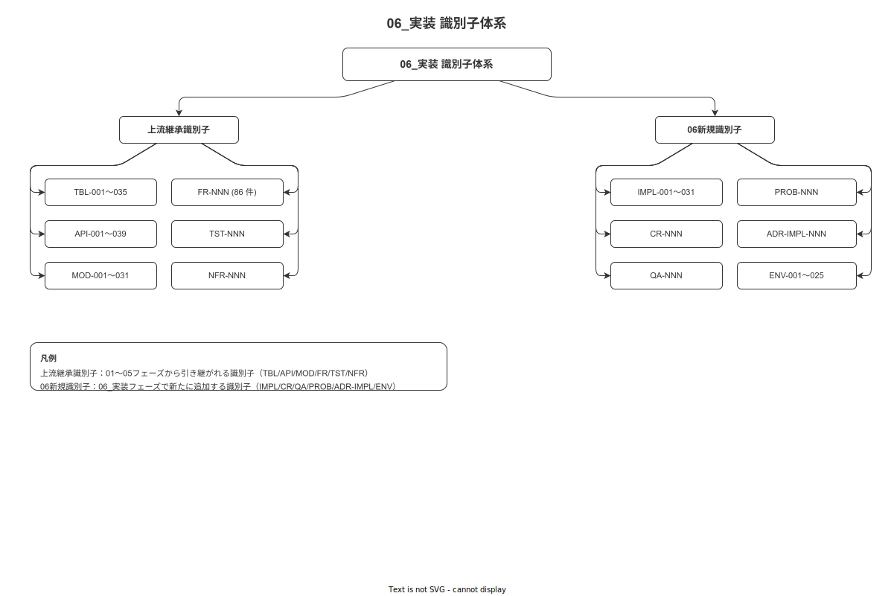

# 付録

本付録は `06_実装` フェーズで採番・確定した実装識別子の台帳・IPA CF カバレッジ・トレーサビリティ・変更管理規約・ADR 索引を一元管理する。

---

## §1 位置づけ

`06_実装/付録` は以下の 6+1 ファイルで構成される。

- **識別子規約 (00)**: 06_実装 フェーズ固有の識別子プレフィックスを定義する権威文書。
- **ITM (01)**: 業界分析 → BR → FR/NFR → 設計識別子 → IMPL-NNN → TST-NNN の 6 段トレーサビリティを提供する。
- **IPA CF カバレッジ (02)**: SLCP-JCF2013 6.3.6 ソフトウェア構築プロセスの全タスクに対する 06_実装 章の対応を確認する。
- **詳細設計対応一覧 (03)**: 05_詳細設計 の各章から 06_実装 の各章への継承関係を一覧化する。
- **変更管理規約 (04)**: 実装フェーズの版数体系・変更プロセス・緊急変更手順を確定する。
- **ADR 索引 (05)**: 実装判断記録（ADR-IMPL-NNN）のサマリ一覧。詳細は `../18_実装判断ADR索引.md` を参照。
- **採番台帳 (99)**: IMPL/CR/QA/PROB/ADR-IMPL/ENV の全 6 種別の権威台帳。

本付録の各ファイルは実装フェーズ中の更新を前提とし、コードと同一 Git コミットで更新する（ドキュメント先行原則）。

---

## §2 章別索引

| ファイル名 | 主題 | 概要 |
|---|---|---|
| `00_実装識別子規約と採番規約.md` | 識別子規約 | 6 種プレフィックス（IMPL/CR/QA/PROB/ADR-IMPL/ENV）の命名規則・ライフサイクル・上流継承識別子との対応を定義する |
| `01_実装トレーサビリティマトリクス（ITM）.md` | ITM | 業界分析→BR→FR/NFR→MOD/TBL/API→IMPL-NNN→TST-NNN の 6 段マッピング。86 FR 全行を網羅する |
| `02_IPA共通フレームソフトウェア構築プロセスカバレッジマトリクス.md` | IPA CF カバレッジ | SLCP-JCF2013 6.3.6 全タスクと 06_実装 各章の対応確認。横断支援プロセスを含む |
| `03_05詳細設計との対応一覧.md` | 詳細設計対応 | 05_詳細設計 8 サブ + 付録から 06_実装 各章への継承種別（完全実装/部分実装/方針参照）を一覧化 |
| `04_変更管理と版数規約.md` | 変更管理 | SemVer・Conventional Commits・変更プロセス・hotfix 手順・版数履歴テンプレを確定する |
| `05_実装ADR索引.md` | ADR 索引 | ADR-IMPL-NNN のサマリ一覧（現時点は空テーブル）。新規判断記録を採番時に追記する |
| `99_実装識別子採番台帳.md` | 採番台帳 | IMPL/CR/QA/PROB/ADR-IMPL/ENV 6 種の権威採番台帳。欠番禁止 |

---

## §3 引用規約

他章から本付録を引用する場合は以下の形式を使用する。

```
[../付録/00_実装識別子規約と採番規約.md](../付録/00_実装識別子規約と採番規約.md)
[../付録/99_実装識別子採番台帳.md](../付録/99_実装識別子採番台帳.md)
```

- パスは **相対パス** で記述する（絶対パス禁止）。
- 識別子を本文中で参照する場合は `IMPL-NNN`・`ENV-NNN` 等の形式で記述し、カッコ書きで採番台帳へのリンクを添える。
- 採番台帳（付録/99）が識別子の権威である。本文中の識別子と台帳の不整合が生じた場合は台帳を正とし、本文を修正する。

---

## §4 識別子階層

**図 1: 識別子階層**



> 原本: [`img/fig_impl_identifier_hierarchy.drawio`](img/fig_impl_identifier_hierarchy.drawio)

本図は上流識別子（BR/FR/NFR/MOD/TBL/API）と 06_実装 固有識別子（IMPL/CR/QA/PROB/ADR-IMPL/ENV）の階層・参照方向を示す。図の詳細定義は `00_実装識別子規約と採番規約.md` §5 を参照。

---

## §5 約束しないこと

- **コードの完全性保証**: 本付録はドキュメントのトレーサビリティを管理する。ソースコードの動作正確性は別途テスト（TST-NNN）で保証する。
- **自動同期**: 付録の各ファイルは手動更新を前提とする。ツールによる自動生成は行わない。
- **上流識別子の再定義**: MOD-001〜031・TBL-001〜035・API-001〜039・FR-NNN・NFR-NNN・SCR-NNN の識別子本体は 04/05 フェーズが権威であり、本付録は参照のみ行う。
- **実装の詳細仕様**: コーディング規約・フレームワーク使用方法等の実装詳細は `06_実装` 本章の各 md ファイルが担い、付録は扱わない。

---

## 版数履歴

| 版 | 日付 | 変更者 | 変更内容 |
|---|---|---|---|
| 0.1.0 | 2026-05-17 | RyuheiKiso | 初版（付録 7 ファイル構成確定）|
