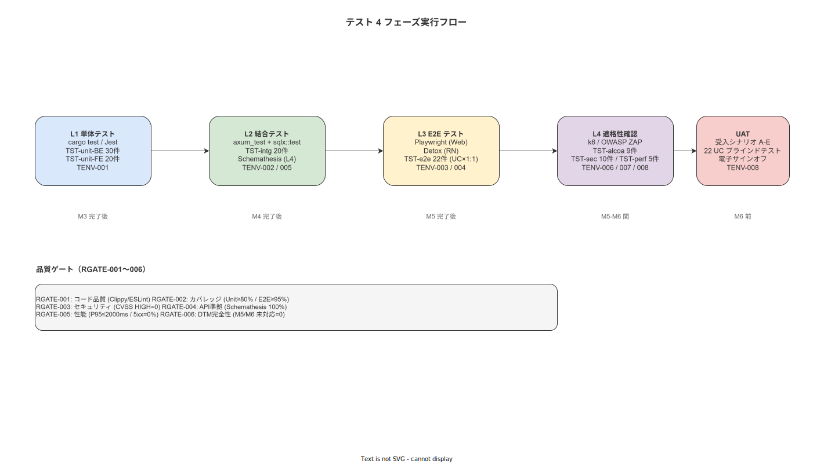

# 01 全体テスト計画と方針

本章は ver1.0.0 リリースに向けた全体テスト計画を確定する。テストピラミッド 4 レベル・戦略原則・実行シーケンス・各テストレベルの目的とツール・マスタープランを IPA 6.4.1 §1 に従い一元的に定める。

---

## 1. テストピラミッド 4 レベル

テストピラミッドは L1（ユニット）→ L2（統合）→ L3（E2E）→ L4（契約）の 4 レベルで構成する。
上位レベルへの昇格条件は下位レベルの全テスト PASS である。

<!-- TODO: fig_test_plan_pyramid.svg 作成後に Markdown 画像構文で埋め込む -->

| レベル | 識別子 | ツール | 件数 | カバレッジ目標 |
|---|---|---|---|---|
| L1 ユニット | TST-unit-BE-001〜030 / TST-unit-FE-001〜020 | cargo test / Jest | 50 件 | Rust ≥80%（ドメイン層 ≥90%）/ TS ≥80% |
| L2 統合 | TST-intg-001〜020 | axum_test + sqlx::test | 20 件 | API ≥60% / BR-BUS 100% |
| L3 E2E | TST-e2e-001〜022 + TST-alcoa-001〜009 + TST-sec-001〜010 + TST-perf-001〜005 | Playwright / Detox / k6 / ZAP | 46 件 | UC ≥95%（重要 6 件 100%）|
| L4 契約 | TENV-005（Schemathesis） | Schemathesis | — | OpenAPI 準拠 100% |

**本節で確定した方針**
- **テストピラミッドを L1〜L4 の 4 レベルで構成し、全 116 件の TST-NNN を各レベルに割付けることを確定する。**
- **上位レベルへの昇格条件を下位 PASS とし、スキップを禁止する。**

---

## 2. テスト戦略原則

本プロジェクトのテスト戦略原則を以下の 4 原則に確定する。

| 原則 | 内容 |
|---|---|
| 自動化優先 | UAT（L4 UAT）以外の全テストを自動化する。マニュアル操作によるテスト結果は証跡として認めない |
| CI 必須 | すべての自動テストは GitHub Actions CI パイプラインまたはローカル `scripts/test-all.sh` で実行する |
| 本番データ禁止 | テスト環境に本番データを持ち込まない（BR-BUS-029・NFR-SEC-020 根拠）|
| 7 日クーリング | UAT 合格後 7 日間はリリースを凍結し、遅延欠陥を検出する期間とする |

**本節で確定した方針**
- **UAT 以外の全テストを自動化することを確定し、マニュアルのみの証跡をリリース根拠として認めない。**
- **本番データ禁止を戦略原則に格上げし、シード SQL・ファクトリ以外のデータをテスト環境に投入することを禁止する。**

---

## 3. テストフェーズ実行シーケンス

テストフェーズは実装マイルストーン（M3〜M6）に連動する。

**図 2: テスト 4 フェーズ実行フロー**



> 原本: [`../img/fig_test_phase_flow.drawio`](../img/fig_test_phase_flow.drawio)

```
M3 完了
 └─ L1 単体テスト（TST-unit-BE-001〜030 / TST-unit-FE-001〜020）
 └─ L2 統合テスト（TST-intg-001〜020）
 └─ L4 契約テスト（Schemathesis）
     ↓ 全 PASS
M4 完了
 └─ L3 E2E テスト 初回（TST-e2e-001〜022）
     ↓ 全 PASS
M5 完了
 └─ 非機能テスト（TST-alcoa-001〜009 / TST-sec-001〜010 / TST-perf-001〜005）
     ↓ 全 PASS
M6 完了
 └─ UAT（最大 5 営業日）
     ↓ TST-001〜007 全 PASS
 └─ 7 日クーリング
     ↓
 ver1.0.0 リリース判定
```

**本節で確定した方針**
- **L1・L2・L4 を M3 完了後に実施し、L3 を M4 完了後に実施し、非機能テストを M5 完了後に実施し、UAT を M6 完了後に実施する順序を確定する。**
- **順序の変更は ADR-TEST-NNN を経てのみ認める。**

---

## 4. 各テストレベルの目的とツール

| レベル | 目的 | ツール | 担当章（詳細設計）|
|---|---|---|---|
| L1 ユニット | ドメインロジック・ERR ハンドリングの単体検証 | cargo test / Jest + RTL | `05_詳細設計/08/01` / `02` |
| L2 統合 | API エンドポイント・DB 操作・Outbox 結合検証 | axum_test + sqlx::test | `05_詳細設計/08/03` |
| L3 E2E | UC ゴールデンパスの端末エンド検証 | Playwright / Detox | `05_詳細設計/08/04` |
| L4 契約 | OpenAPI 3.1 スキーマ準拠の連続検証 | Schemathesis | `04_概要設計/10/02` |
| ALCOA+ | ALCOA+ 9 原則の自動化検証 | sqlx::test + cargo test | `05_詳細設計/08/05` |
| セキュリティ | RBAC・JWT・OWASP ZAP DAST | ZAP + cargo audit | `05_詳細設計/08/06` |
| 性能 | P95 ≤ 2000ms・50 同時ユーザー | k6 | `05_詳細設計/08/06` |

**本節で確定した方針**
- **各テストレベルの目的・ツール・上流詳細設計章を確定し、この表を実行計画の基準とする。**

---

## 5. マスタープラン（TST-PLAN-001〜010）

| TST-PLAN-ID | 計画項目 | 内容概要 | 対応章 |
|---|---|---|---|
| TST-PLAN-001 | テストスコープ確定 | 116 件の TST-NNN を全テストレベルに割付け | 本章 |
| TST-PLAN-002 | テスト環境構築 | TENV-001〜008 の Docker Compose 設定完了 | `03_テスト環境定義` |
| TST-PLAN-003 | テストデータ準備 | シード SQL 4 ファイル・ファクトリ実装完了 | `04_テストデータ管理計画` |
| TST-PLAN-004 | L1 単体テスト実施 | M3 完了後。PASS 率 100% を達成してから L2 へ昇格 | `07_テスト/単体テスト` |
| TST-PLAN-005 | L2 統合テスト実施 | M3 完了後。BR-BUS 100% カバレッジ確認 | `07_テスト/結合テスト` |
| TST-PLAN-006 | L4 契約テスト実施 | M3 完了後。Schemathesis 100% 準拠確認 | `07_テスト/結合テスト` |
| TST-PLAN-007 | L3 E2E テスト実施 | M4 完了後。UC-003/009/011/016/019/020 優先 | `07_テスト/適格性確認テスト` |
| TST-PLAN-008 | 非機能テスト実施 | M5 完了後。ALCOA+・セキュリティ・性能 | `07_テスト/適格性確認テスト` |
| TST-PLAN-009 | UAT 実施 | M6 完了後。最大 5 営業日。TST-001〜007 判定 | `07_テスト/テスト計画/08` |
| TST-PLAN-010 | リリース判定 | RGATE-001〜006 全通過・7 日クーリング経過後 | `07_テスト/テスト計画/05` |

**本節で確定した方針**
- **TST-PLAN-001〜010 をマスタープランの固定 10 件とし、実行時に TST-EXEC-YYYYMMDD-NNN で記録することを確定する。**

---

## 参照業界分析

### 必須
- [`../../../90_業界分析/06_品質管理とトレーサビリティ.md`](../../../90_業界分析/06_品質管理とトレーサビリティ.md)

### 関連
- [`../../../90_業界分析/21_電子チェックリストと手順遵守の科学.md`](../../../90_業界分析/21_電子チェックリストと手順遵守の科学.md)
- [`../../../90_業界分析/22_規制別トレーサビリティ要件詳論.md`](../../../90_業界分析/22_規制別トレーサビリティ要件詳論.md)

---

## 版数履歴

| 版 | 日付 | 変更者 | 変更内容 |
|---|---|---|---|
| 0.1.0 | 2026-05-18 | RyuheiKiso | 初版 |
