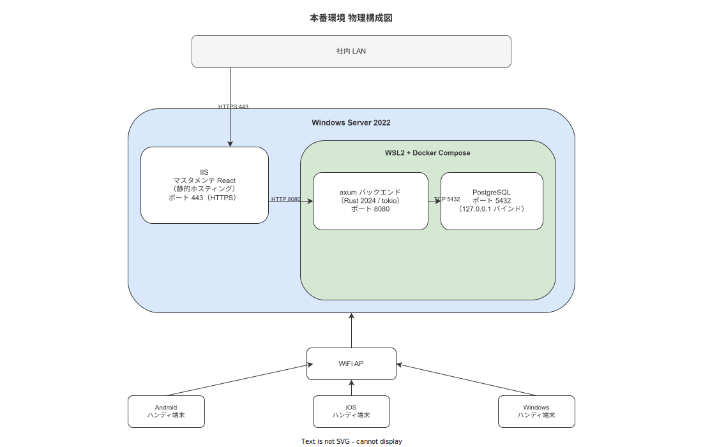
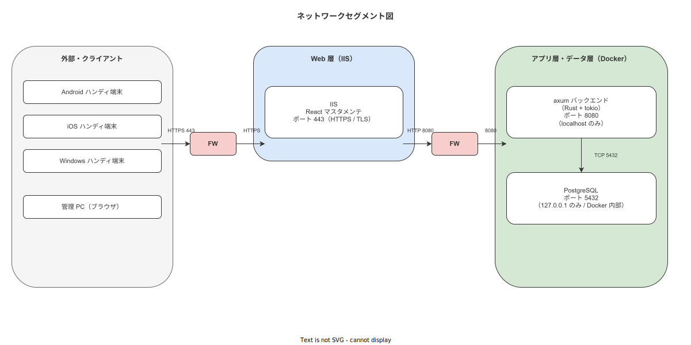

# 01 本番環境構築手順

本章の責務は、INST-A4-a（本番環境構築）に基づき、作業ナビゲーション・トレサビシステムを本番稼働させるために必要なサーバー・OS・ミドルウェアの全構成要素を、GAMP 5 IQ（Installation Qualification）要件を満たす形で確実かつ再現可能な手順で確立することである。MIG-T-008（本番環境構築完了確認）および MIG-T-009（IQ 完了判定書作成）に対応し、構築後の全構成要素を `versions.lock` に記録する。

---

## 1 本章の責務と規制対応

### 1-1. INST-A4-a との対応関係

本章は IPA 共通フレーム 2013 の「3.2 導入プロセス」タスク INST-A4-a に対応する本番環境構築手順書である。MIG-T-008（本番環境構築完了確認）および MIG-T-009（IQ 完了判定書作成）の両チェックポイントを本章の手順完了により消込する。

**MIG-X-106**: 本章に記載された全手順を順番通りに実施し、§6 に定める IQ 完了判定書に実施者署名を付与した時点をもって INST-A4-a 完了と判定する。（DES-MIG-001 対応）

### 1-2. GAMP 5 IQ 対応

GAMP 5（Good Automated Manufacturing Practice）の Installation Qualification（IQ）要件として、以下の事項を本章の手順実施により証跡する。

| IQ 要件項目 | 本章での対応箇所 |
|---|---|
| 機器・ソフトウェアの仕様と実態の一致確認 | §2（ハードウェア仕様確認・MIG-CK-069〜070） |
| インストール記録の残存 | §6（versions.lock 作成） |
| 設定パラメータの記録 | §6（環境構成記録） |
| セキュリティ設定の確認 | §3（ファイアウォール設定）・§5（SSL 設定） |
| 担当者署名 | §6（IQ 完了判定書テンプレート） |

---

**本節で確定した方針**
- 本章の手順は INST-A4-a の唯一の実施根拠文書として管理することを確定する。
- IQ 完了判定書への実施者署名完了をもって GAMP 5 IQ 要件に対応することを確定する。
- MIG-T-008・MIG-T-009 は本章の §6 完了により消込することを確定する。

---

## 2 本番環境の前提確認

### 2-1. サーバー仕様の確認

**MIG-X-107**: 本番環境サーバーは以下の最低要件を全て満たすことを調達・搬入前に仕様書で確認し、搬入後に現物照合する。（DES-MIG-008 対応）

| 構成要素 | 最低要件 | 推奨要件 | 確認方法 |
|---|---|---|---|
| CPU | 4 コア（2.0 GHz 以上） | 8 コア（3.0 GHz 以上） | システム情報（msinfo32） |
| RAM | 16 GB | 32 GB | システム情報（msinfo32） |
| ストレージ（OS） | SSD 500 GB | SSD 1 TB NVMe | ディスク管理 |
| ストレージ（データ） | SSD 500 GB（専用パーティション） | SSD 2 TB NVMe | ディスク管理 |
| NIC | 1 Gbps | 10 Gbps | デバイスマネージャー |
| OS | Windows Server 2022 Standard 以上 | Windows Server 2022 Datacenter | winver |
| UPS | 5 分以上の保持容量 | 30 分以上の保持容量 | UPS 仕様書確認 |

最低要件を 1 項目でも満たさない場合は、調達部門への差し戻しを実施してから本章の手順を開始する。

**図 1: 本番環境構成図**



> 原本: [`img/fig_mig_env_prod.drawio`](img/fig_mig_env_prod.drawio)

### 2-2. ネットワーク構成の確認

**MIG-X-106**: 本番ネットワーク構成は以下の機器配置で構成する。搬入後の物理結線が設計図と一致していることを実機で確認する。（DES-MIG-007 対応）

| 機器種別 | 配置位置 | 接続先 | 確認項目 |
|---|---|---|---|
| WiFi アクセスポイント（AP） | 作業フロア天井 | L2 スイッチ | SSID・周波数帯（2.4/5 GHz）・セキュリティ方式（WPA2-Enterprise） |
| L2 スイッチ | サーバーラック上段 | AP・サーバー・上流ルーター | VLAN 設定・ポート速度（1 Gbps） |
| 本番サーバー | サーバーラック | L2 スイッチ | IPアドレス固定割当・デフォルトゲートウェイ |
| ハンディ端末 | 作業フロア（モバイル） | WiFi AP 経由 | IP 自動割当（DHCP）・サーバーへの疎通 |

**図 2: 本番ネットワーク構成図**



> 原本: [`img/fig_mig_env_network.drawio`](img/fig_mig_env_network.drawio)

### 2-3. 納品物検収

**MIG-CK-069**: ハンディ端末・サーバー・ネットワーク機器の納品物を以下のチェックリストで検収し、記録票に署名する。

| 検収項目 | 確認内容 | 合否判定基準 |
|---|---|---|
| ハンディ端末（Android/iOS/Windows） | 台数・機種・OS バージョン | 発注書と一致 |
| サーバー本体 | 型番・CPU/RAM/ストレージ仕様 | §2-1 の最低要件を満たす |
| L2 スイッチ | 型番・ポート数 | 発注書と一致 |
| WiFi AP | 台数・型番・周波数対応 | 発注書と一致 |
| UPS | 容量・入出力電圧 | §2-1 の UPS 最低要件を満たす |
| ケーブル類 | LANケーブル（CAT6 以上）本数・電源ケーブル | 発注書と一致 |

**MIG-CK-070**: ハンディ端末の動作確認として、起動・WiFi 接続・ブラウザ疎通を 1 台ごとに実施し、全台が疎通確認済みであることを記録する。

---

**本節で確定した方針**
- サーバー仕様の最低要件（CPU 4 コア・RAM 16 GB・SSD 500 GB）を 1 項目でも満たさない場合は調達差し戻しを実施することを確定する。
- 納品物検収（MIG-CK-069〜070）は実施者が記録票に署名することを確定する。
- ネットワーク構成は設計図（fig_mig_env_network）との物理結線一致確認を実施することを確定する。

---

## 3 Windows Server 2022 セットアップ

### 3-1. 役割の追加

**MIG-X-108**: Windows Server 2022 に以下の役割・機能を「役割と機能の追加ウィザード」または PowerShell にて追加する。（DES-MIG-009 対応）

以下の PowerShell コマンドを管理者権限のコマンドプロンプトから実行する。

```powershell
# Web サーバー（IIS）と必要な機能を追加する
Install-WindowsFeature -Name Web-Server, Web-Mgmt-Tools, Web-Static-Content, `
    Web-Http-Redirect, Web-Http-Errors, Web-Common-Http, `
    Web-Asp-Net45, Web-ISAPI-Ext, Web-ISAPI-Filter, `
    Web-Url-Auth, Web-Windows-Auth -IncludeManagementTools

# Windows Subsystem for Linux（WSL）を有効化する
Enable-WindowsOptionalFeature -Online -FeatureName Microsoft-Windows-Subsystem-Linux -NoRestart

# 仮想マシン プラットフォームを有効化する（WSL2 の前提）
Enable-WindowsOptionalFeature -Online -FeatureName VirtualMachinePlatform -NoRestart

# 再起動する
Restart-Computer -Force
```

再起動後、以下のコマンドで役割が正しく追加されたことを確認する。

```powershell
# インストール済み役割の確認
Get-WindowsFeature | Where-Object { $_.InstallState -eq "Installed" } | Select-Object Name, DisplayName
```

### 3-2. 累積更新プログラムの適用

**MIG-X-109**: Windows Server 2022 の累積的な更新プログラム（KB）を Windows Update から全件適用する。適用後に以下を記録する。（DES-MIG-009 対応）

```powershell
# インストール済み更新プログラムの一覧を取得して記録する
Get-HotFix | Sort-Object InstalledOn -Descending | Export-Csv -Path "C:\wnav-install\windows_updates.csv" -Encoding UTF8

# セキュリティ更新が全て適用済みであることを確認する
Get-WindowsUpdateLog
```

### 3-3. ファイアウォール設定

ファイアウォールに以下の受信規則を追加する。本番環境では不要なポートを全て閉じ、以下のポートのみを開放する。

```powershell
# HTTPS（React マスタメンテ・IIS 経由）
New-NetFirewallRule -Name "WNAV-HTTPS" -DisplayName "WNAV HTTPS" `
    -Direction Inbound -Protocol TCP -LocalPort 443 -Action Allow

# バックエンド API（axum・内部向け）
New-NetFirewallRule -Name "WNAV-API" -DisplayName "WNAV Backend API" `
    -Direction Inbound -Protocol TCP -LocalPort 8080 -Action Allow

# PostgreSQL（WSL2 内部からのアクセスのみ許可）
New-NetFirewallRule -Name "WNAV-PostgreSQL" -DisplayName "WNAV PostgreSQL" `
    -Direction Inbound -Protocol TCP -LocalPort 5432 `
    -RemoteAddress 127.0.0.1 -Action Allow

# 開発者アクセス用（マスタメンテ開発ポート）
New-NetFirewallRule -Name "WNAV-Master-Dev" -DisplayName "WNAV Master Dev" `
    -Direction Inbound -Protocol TCP -LocalPort 3000 `
    -RemoteAddress <管理者PC IPアドレス> -Action Allow
```

設定完了後、以下のコマンドで規則が正しく追加されたことを確認する。

```powershell
Get-NetFirewallRule | Where-Object { $_.Name -like "WNAV-*" } | Format-Table Name, Enabled, Direction
```

---

**本節で確定した方針**
- IIS・WSL 役割の追加は PowerShell スクリプトで実施し、実行ログを記録することを確定する。
- 累積更新プログラムは全件適用し、適用済み KB 一覧を CSV に記録することを確定する。
- ファイアウォールは `WNAV-*` 名前空間の規則のみ追加し、それ以外の開放は対象外と判断する。

---

## 4 WSL2 + Docker 環境構築

### 4-1. WSL2 の有効化と Ubuntu LTS のインストール

**MIG-X-110**: 再起動後、WSL2 を既定バージョンとして設定し、Ubuntu 24.04 LTS をインストールする。（DES-MIG-010 対応）

```powershell
# WSL2 を規定バージョンに設定する
wsl --set-default-version 2

# Ubuntu 24.04 LTS をインストールする
wsl --install -d Ubuntu-24.04

# インストール完了後、バージョンを確認する
wsl --list --verbose
```

Ubuntu の初回起動時に UNIX ユーザー名とパスワードを設定する。ユーザー名は `wnav` とする。

```bash
# WSL2 Ubuntu 内で以下を実行する
# パッケージリストを更新する
sudo apt update && sudo apt upgrade -y

# 必要なツールをインストールする
sudo apt install -y curl wget gnupg2 ca-certificates lsb-release apt-transport-https
```

### 4-2. Docker Engine のインストール

**MIG-X-111**: Docker Engine を WSL2 Ubuntu 内にインストールする。Docker Desktop は Windows Server 2022 では使用不可のため、Docker Engine を直接インストールする。（DES-MIG-010 対応）

```bash
# Docker の公式 GPG キーを追加する
curl -fsSL https://download.docker.com/linux/ubuntu/gpg | sudo gpg --dearmor -o /etc/apt/keyrings/docker.gpg

# Docker リポジトリを追加する
echo "deb [arch=$(dpkg --print-architecture) signed-by=/etc/apt/keyrings/docker.gpg] \
  https://download.docker.com/linux/ubuntu \
  $(lsb_release -cs) stable" | sudo tee /etc/apt/sources.list.d/docker.list > /dev/null

# Docker Engine をインストールする
sudo apt update
sudo apt install -y docker-ce docker-ce-cli containerd.io

# docker グループに wnav ユーザーを追加する（sudo なしで docker コマンドを使用可能にする）
sudo usermod -aG docker wnav

# Docker のバージョンを確認する
docker --version
```

### 4-3. Docker Compose v2 のインストール

**MIG-X-112**: Docker Compose プラグイン（v2）をインストールする。（DES-MIG-010 対応）

```bash
# Docker Compose プラグインをインストールする
sudo apt install -y docker-compose-plugin

# バージョンを確認する（v2.x.x が表示されることを確認する）
docker compose version
```

### 4-4. WSL2 の Windows 起動時自動開始設定

Windows Server 再起動後に WSL2 と Docker が自動起動するよう設定する。Windows Server 2022 では WSL2 の自動起動に追加設定が必要である。

```powershell
# WSL2 自動起動用のタスクスケジューラタスクを作成する
$action = New-ScheduledTaskAction -Execute "wsl" -Argument "-d Ubuntu-24.04 -e sudo service docker start"
$trigger = New-ScheduledTaskTrigger -AtStartup
$principal = New-ScheduledTaskPrincipal -UserId "SYSTEM" -RunLevel Highest
Register-ScheduledTask -TaskName "WNAV-WSL2-AutoStart" -Action $action -Trigger $trigger -Principal $principal
```

```bash
# WSL2 Ubuntu 内で Docker サービスを systemd で管理する場合
# /etc/wsl.conf に以下を記載する
sudo tee /etc/wsl.conf << 'EOF'
[boot]
systemd=true

[automount]
enabled=true
root=/mnt/
EOF
```

設定完了後、サーバーを再起動して WSL2 と Docker が自動起動することを確認する。

```bash
# 再起動後の確認
wsl -d Ubuntu-24.04 -- docker ps
```

---

**本節で確定した方針**
- WSL2 Ubuntu のユーザー名は `wnav` で統一することを確定する。
- Docker Engine を WSL2 内に直接インストールし、Docker Desktop は対象外と判断する。
- WSL2 の Windows 起動時自動開始はタスクスケジューラで対応することを確定する。

---

## 5 IIS のセットアップ

### 5-1. サイトの作成

**MIG-X-113**: React マスタメンテ SPA を静的ホスティングする IIS サイトを以下の仕様で作成する。（DES-MIG-011 対応）

```powershell
# 既定のサイト（Default Web Site）を停止する
Stop-WebSite -Name "Default Web Site"

# WNAV マスタメンテ用のサイトを作成する（HTTP は HTTPS リダイレクト専用）
New-WebSite -Name "wnav-master" `
    -Port 80 `
    -PhysicalPath "C:\inetpub\wwwroot\wnav-master" `
    -ApplicationPool "wnav-master-pool"

# アプリケーションプールを作成する（.NET CLR なし・統合モード）
New-WebAppPool -Name "wnav-master-pool"
Set-ItemProperty IIS:\AppPools\wnav-master-pool -Name managedRuntimeVersion -Value ""

# 物理パスのディレクトリを作成する
New-Item -ItemType Directory -Path "C:\inetpub\wwwroot\wnav-master" -Force

# デフォルトドキュメントに index.html を追加する
Add-WebConfigurationProperty `
    -PSPath "IIS:\Sites\wnav-master" `
    -Filter "system.webServer/defaultDocument/files" `
    -Name "." `
    -Value @{value="index.html"}
```

SPA ルーティング対応のため `web.config` を以下の内容で作成する。

```xml
<?xml version="1.0" encoding="UTF-8"?>
<configuration>
  <system.webServer>
    <staticContent>
      <clientCache cacheControlMode="DisableCache" />
    </staticContent>
    <httpProtocol>
      <customHeaders>
        <add name="Cache-Control" value="no-cache" />
        <add name="X-Content-Type-Options" value="nosniff" />
        <add name="X-Frame-Options" value="DENY" />
      </customHeaders>
    </httpProtocol>
    <rewrite>
      <rules>
        <rule name="SPA Fallback" stopProcessing="true">
          <match url=".*" />
          <conditions logicalGrouping="MatchAll">
            <add input="{REQUEST_FILENAME}" matchType="IsFile" negate="true" />
          </conditions>
          <action type="Rewrite" url="/index.html" />
        </rule>
      </rules>
    </rewrite>
  </system.webServer>
</configuration>
```

### 5-2. SSL 証明書の配置とバインディング

**MIG-X-114**: SSL/TLS 証明書を Windows 証明書ストアにインポートし、IIS サイトに HTTPS バインディングを設定する。（DES-MIG-011 対応）

```powershell
# PFX 形式の証明書をインポートする
$cert = Import-PfxCertificate `
    -FilePath "C:\wnav-install\certs\wnav-server.pfx" `
    -CertStoreLocation Cert:\LocalMachine\My `
    -Password (ConvertTo-SecureString -String "<証明書パスワード>" -AsPlainText -Force)

# 証明書のサムプリントを取得する
$thumbprint = $cert.Thumbprint
Write-Host "Certificate Thumbprint: $thumbprint"

# HTTPS バインディングを追加する（ポート 443）
New-WebBinding -Name "wnav-master" -IPAddress "*" -Port 443 -Protocol "https"

# 証明書をバインディングに割り当てる
$binding = Get-WebBinding -Name "wnav-master" -Protocol "https"
$binding.AddSslCertificate($thumbprint, "my")
```

証明書の有効期限を確認し、`versions.lock` に記録する。

```powershell
# 証明書の有効期限を確認する
Get-ChildItem Cert:\LocalMachine\My | Where-Object { $_.Subject -like "*wnav*" } |
    Select-Object Subject, NotAfter, Thumbprint
```

### 5-3. リバースプロキシ設定

axum バックエンド（ポート 8080）へのリバースプロキシを IIS の URL Rewrite + Application Request Routing（ARR）で構成する。

IIS Manager から「Application Request Routing Cache」→「Server Proxy Settings」→「Enable proxy」を有効化する。

```powershell
# URL Rewrite モジュールがインストール済みであることを確認する
Get-WebConfigurationProperty -PSPath "IIS:\" -Filter "system.webServer/rewrite" -Name "."

# ARR プロキシルールを追加する（/api/* を axum バックエンドに転送）
Add-WebConfigurationProperty `
    -PSPath "IIS:\Sites\wnav-master" `
    -Filter "system.webServer/rewrite/rules" `
    -Name "." `
    -Value @{name="API Proxy"; stopProcessing="True"}

Set-WebConfigurationProperty `
    -PSPath "IIS:\Sites\wnav-master" `
    -Filter "system.webServer/rewrite/rules/rule[@name='API Proxy']/match" `
    -Name "url" -Value "^api/(.*)"

Set-WebConfigurationProperty `
    -PSPath "IIS:\Sites\wnav-master" `
    -Filter "system.webServer/rewrite/rules/rule[@name='API Proxy']/action" `
    -Name "type" -Value "Rewrite"

Set-WebConfigurationProperty `
    -PSPath "IIS:\Sites\wnav-master" `
    -Filter "system.webServer/rewrite/rules/rule[@name='API Proxy']/action" `
    -Name "url" -Value "http://localhost:8080/api/{R:1}"
```

---

**本節で確定した方針**
- IIS サイトは `wnav-master` の名称で作成し、既定サイトは停止することを確定する。
- SSL 証明書は Windows 証明書ストアにインポートし、IIS バインディングに割り当てることを確定する。
- `/api/*` パスは ARR リバースプロキシで axum バックエンドに転送することを確定する。

---

## 6 構築結果記録と確認

### 6-1. 環境構成記録（versions.lock）の作成

**MIG-X-115**: 構築完了後、全コンポーネントのバージョン情報を `versions.lock` ファイルに記録する。本ファイルはバージョン管理対象として Git にコミットする。（DES-MIG-014 対応）

以下のスクリプトを実行して `versions.lock` を生成する。

```powershell
# versions.lock 出力先を準備する
New-Item -ItemType Directory -Path "C:\wnav-install\records" -Force

$timestamp = Get-Date -Format "yyyy-MM-dd HH:mm:ss"
$output = @"
# WNAV 本番環境構成記録（versions.lock）
# 記録日時: $timestamp
# 記録者: <実施者氏名>

## OS
Windows Server 2022: $(([System.Environment]::OSVersion).Version)
Build: $((Get-ItemProperty 'HKLM:\SOFTWARE\Microsoft\Windows NT\CurrentVersion').CurrentBuildNumber)

## IIS
$(Get-WindowsFeature Web-Server | Select-Object -ExpandProperty DisplayName): $(Get-WindowsFeature Web-Server | Select-Object -ExpandProperty InstallState)

## WSL2
$(wsl --version 2>&1 | Select-Object -First 1)

## Docker
$(docker --version 2>&1)
$(docker compose version 2>&1)

## SSL 証明書
$(Get-ChildItem Cert:\LocalMachine\My | Where-Object { $_.Subject -like "*wnav*" } | ForEach-Object { "$($_.Subject) NotAfter: $($_.NotAfter)" })
"@

$output | Out-File -FilePath "C:\wnav-install\records\versions.lock" -Encoding UTF8
Write-Host "versions.lock を作成しました: C:\wnav-install\records\versions.lock"
```

### 6-2. セットアップ完了確認手順

**MIG-CK-071**: 以下の疎通確認を実施し、全項目が合格であることを確認する。

| 確認項目 | コマンド / 操作 | 合格基準 |
|---|---|---|
| サーバー内部 ping | `ping localhost` | 応答あり |
| IIS 起動確認 | `iisreset /status` | World Wide Web Publishing Service: Running |
| HTTPS 疎通 | ブラウザで `https://<サーバーIP>` を開く | 200 OK・index.html が表示 |
| WSL2 起動確認 | `wsl -d Ubuntu-24.04 -- uname -r` | Linux カーネルバージョンが表示 |
| Docker 起動確認 | `wsl -d Ubuntu-24.04 -- docker ps` | コマンドが正常終了 |
| ポート 443 開放確認 | `Test-NetConnection -ComputerName <サーバーIP> -Port 443` | TcpTestSucceeded: True |
| ポート 8080 開放確認 | `Test-NetConnection -ComputerName localhost -Port 8080` | TcpTestSucceeded: True（axum 起動後） |
| ファイアウォール規則確認 | `Get-NetFirewallRule` | WNAV-* ルールが全件 Enabled |

**MIG-CK-072**: 疎通確認の全項目が合格であることを確認した後、MIG-CK-072 チェックシートに実施者・確認日時・結果を記録する。

### 6-3. IQ 完了判定書テンプレート

```
===============================================================
 GAMP 5 IQ（Installation Qualification）完了判定書
===============================================================
システム名    : 作業ナビゲーション・トレサビシステム
ドキュメント番号 : WNAV-IQ-PROD-001
版数         : 1.0
===============================================================

1. 対象環境
   環境名: 本番（Production）
   サーバー型番: <型番>
   IPアドレス: <IPアドレス>

2. 実施内容
   [ ] §2 本番環境前提確認（MIG-CK-069〜070）完了
   [ ] §3 Windows Server 2022 セットアップ完了
   [ ] §4 WSL2 + Docker 環境構築完了
   [ ] §5 IIS セットアップ完了
   [ ] §6-1 versions.lock 作成完了
   [ ] §6-2 疎通確認（MIG-CK-071〜072）全件合格

3. 発見された逸脱事項
   （なし / <逸脱内容と対処>）

4. IQ 判定
   [ ] 合格（全チェック項目をクリアし、本番環境として承認する）
   [ ] 条件付き合格（逸脱事項あり・対処方針を記録する）
   [ ] 不合格（再構築が必要）

5. 実施者署名
   氏名: ___________________
   日付: ___________________
   署名: ___________________
===============================================================
```

---

**本節で確定した方針**
- `versions.lock` はスクリプトで自動生成し、Git にコミットすることを確定する。
- MIG-CK-071 の疎通確認は全 8 項目が合格であることを IQ 合格の必要条件とすることを確定する。
- IQ 完了判定書への実施者署名をもって INST-A4-a の完了と判定することを確定する。

---

## 参照業界分析

### 必須
- [`../../90_業界分析/07_スマートファクトリーと作業のデジタル化.md`](../../90_業界分析/07_スマートファクトリーと作業のデジタル化.md)

### 関連
- [`../../90_業界分析/22_規制別トレーサビリティ要件詳論.md`](../../90_業界分析/22_規制別トレーサビリティ要件詳論.md)
- [`../../90_業界分析/27_オフライン同期とデータ整合性.md`](../../90_業界分析/27_オフライン同期とデータ整合性.md)

---

## 更新履歴

| バージョン | 日付 | 変更内容 | 担当者 |
|---|---|---|---|
| 0.1.0 | 2026-05-18 | 初版 | RyuheiKiso |
