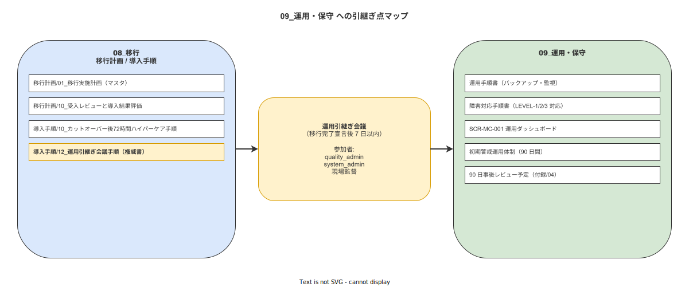

# 12 運用引継ぎ会議手順

本章の責務は、IPA 共通フレーム 2013 の「3.1.3 ソフトウェア運用プロセス」への引継ぎ（INST-A5-c）として、移行完了宣言後の運用体制を確立し、運用責任者・障害対応窓口の任命・成果物の引継ぎ・ハイパーケア後の初期警戒運用体制移行を確定することである。

---

## 1 本章の責務（IPA 3.1.3 への引継ぎ / INST-A5-c）

### 1-1. INST-A5-c との対応関係

本章は IPA 共通フレーム 2013 の「3.2 導入プロセス」タスク INST-A5-c（運用引継ぎ）に対応する実施手順書である。`10_カットオーバー後72時間ハイパーケア手順.md` §6-2 の MIG-REP-022（移行完了宣言）完了後、本章の手順を移行完了宣言後 7 日以内に開始する。

本章の完了により、システムの管理権限が「移行チーム（system_admin）」から「運用チーム（IPA 3.1.3 ソフトウェア運用プロセス担当）」に正式に移管される。

---

**本節で確定した方針**
- 本章の手順は移行完了宣言後 7 日以内に開始することを確定する。
- 本章の完了をもって移行チームから運用チームへの管理権限移管が完了することを確定する。
- IPA 3.1.3 ソフトウェア運用プロセスへの完全移行を本章の最終目標とすることを確定する。

---

## 2 運用引継ぎ会議の招集タイミング

### 2-1. 会議の開催タイミングと参加者

**MIG-REP-011**: 運用引継ぎ会議は移行完了宣言後 7 日以内に開催する。以下の参加者全員の出席を必須とする。

| 参加者 | 役割 | 出席必須理由 |
|---|---|---|
| quality_admin | 会議主催者・引継ぎ責任者 | 移行完了宣言の権限者として引継ぎ内容に責任を持つ |
| system_admin | 技術担当者・引継ぎ元 | 運用手順・監視設定・障害対応手順の説明責任者 |
| 現場監督 | 業務担当者 | 現場運用上の課題・要望を引継ぎ時に確認する |

会議の所要時間は 2〜3 時間を目安とする。事前に引継ぎ対象成果物一覧（§3 参照）を参加者全員に配布し、確認時間を確保する。

---

**本節で確定した方針**
- 運用引継ぎ会議を移行完了宣言後 7 日以内に開催することを確定する。
- quality_admin・system_admin・現場監督の 3 名全員の出席を必須とすることを確定する。
- 引継ぎ対象成果物一覧の事前配布を会議開催の前提条件とすることを確定する。

---

## 3 引継ぎ対象成果物一覧

### 3-1. 運用手順書への接続点

**MIG-REP-012**: 運用引継ぎ会議では以下の 11 項目の成果物を順番に確認し、引継ぎ完了をサインで記録する。

| 番号 | 成果物 | 引継ぎ先 | 確認内容 |
|---|---|---|---|
| 1 | 日次監視手順書 | `09_運用・保守/運用手順/01_日次監視手順.md` | エラーログ確認・ヘルスチェック手順の習熟確認 |
| 2 | バックアップ・復元手順書 | `09_運用・保守/運用手順/02_バックアップ復元手順.md` | PostgreSQL バックアップスケジュール・復元手順の確認 |
| 3 | 障害対応手順書 | `09_運用・保守/運用手順/03_障害対応手順.md` | 縮退レベル判定・エスカレーション手順の確認 |
| 4 | ユーザー管理手順書 | `09_運用・保守/運用手順/04_ユーザー管理手順.md` | アカウント作成・RBAC 設定手順の確認 |
| 5 | デバイス管理手順書 | `09_運用・保守/運用手順/05_デバイス管理手順.md` | デバイス登録・削除・トラブルシュート手順の確認 |
| 6 | マスタメンテナンス手順書 | `09_運用・保守/運用手順/06_マスタメンテ手順.md` | SOP・工程・ユーザーマスタの更新手順の確認 |
| 7 | 定期メンテナンス手順書 | `09_運用・保守/運用手順/07_定期メンテ手順.md` | Docker・OS・PostgreSQL の定期更新手順の確認 |
| 8 | 証跡記録確認手順書 | `09_運用・保守/運用手順/08_証跡記録確認手順.md` | ALCOA+ 検証・ハッシュチェーン確認手順の確認 |
| 9 | 監視設定ドキュメント | `09_運用・保守/監視設定/monitoring_config.md` | アラート閾値・通知設定の確認 |
| 10 | セキュリティ設定ドキュメント | `09_運用・保守/セキュリティ/security_config.md` | RBAC 設定・アクセスログ確認手順の確認 |
| 11 | SLA・KPI 定義書 | `09_運用・保守/SLA_KPI.md` | 可用性目標・障害対応 SLA の確認 |

### 3-2. 監視設定・バックアップ設定・障害対応手順書の確認

各成果物の確認では、system_admin が実際の設定画面・設定ファイルを画面共有して説明し、受取り側が操作を実際に行って習熟を確認する。説明のみで終わらず、受取り側が操作可能な状態になることを引継ぎ完了条件とする。

### 3-3. SCR-MC-001（運用ダッシュボード）の操作確認

SCR-MC-001（運用ダッシュボード）の操作確認では、以下の機能を受取り側が実際に操作して確認する。

| 機能 | 確認内容 |
|---|---|
| 証跡記録件数グラフ | 日次・週次の記録件数推移の閲覧方法 |
| エラーレートグラフ | API エラーレートの確認方法 |
| アクティブユーザー表示 | 現在ログイン中のユーザー一覧の確認方法 |
| アラート通知設定 | 閾値超過時のアラート通知先の確認・変更方法 |

---

**本節で確定した方針**
- 引継ぎ対象 11 成果物の全確認を運用引継ぎ会議の完了条件とすることを確定する。
- 説明だけでなく受取り側による操作確認を引継ぎ完了の基準とすることを確定する。
- SCR-MC-001（運用ダッシュボード）の操作習熟確認を必須とすることを確定する。

---

## 4 運用責任者・障害対応一次窓口の任命

### 4-1. 正式任命記録と役割定義

**MIG-REP-013**: 運用引継ぎ会議において、以下の役割を正式に任命し、任命記録に quality_admin の署名を付与する。

| 役割 | 担当者（任命候補） | 役割定義 |
|---|---|---|
| 運用責任者 | system_admin（または指名する担当者） | システム全体の運用品質に責任を持つ。月次レポートを quality_admin に提出する。 |
| 障害対応一次窓口 | system_admin（または指名する担当者） | 障害発生時の最初の受付・初期対応・エスカレーションを担当する。 |
| 品質記録管理者 | quality_admin（または指名する担当者） | ALCOA+ 証跡記録の監査・保全・規制対応の報告を担当する。 |

正式任命記録は以下の項目で構成する。

| 記録項目 | 内容 |
|---|---|
| 任命日時 | 年月日・時刻 |
| 任命者 | quality_admin の氏名 |
| 被任命者 | 氏名・役割・担当範囲 |
| 任命承認署名 | 被任命者の電子署名 |
| 会議記録番号 | MIG-REP-015 議事録番号との紐付け |

---

**本節で確定した方針**
- 運用責任者・障害対応一次窓口・品質記録管理者の 3 役割を運用引継ぎ会議で正式に任命することを確定する。
- 任命記録への quality_admin 署名および被任命者の承認署名を任命の必須要件とすることを確定する。
- 任命記録を移行記録文書として 3 年間保存することを確定する。

---

## 5 ハイパーケア期間体制の引継ぎ

### 5-1. カットオーバー後 90 日間の初期警戒運用体制

**MIG-REP-014**: 移行完了宣言後 90 日間は、通常運用体制に加えて以下の初期警戒運用体制を維持する。

**図 1: 運用引継ぎ後の初期警戒運用体制**

> 原本: [`img/fig_mig_handover_to_ops.drawio`](img/fig_mig_handover_to_ops.drawio)

| 期間 | 監視体制 | 対応内容 |
|---|---|---|
| 1〜30 日（ハイパーケア終了後） | 週 2 回（月・木）の定期確認 | エラーレート・証跡完全性・ハッシュチェーン整合性の確認 |
| 31〜60 日 | 週 1 回（金曜日）の定期確認 | 週次集計レポートの作成と quality_admin への提出 |
| 61〜90 日 | 週 1 回（金曜日）の定期確認 + 月次レポート | 90 日事後レビュー（§6 参照）に向けた集計 |

初期警戒運用体制期間中の以下のエスカレーション基準を定める。

| エスカレーション条件 | 対応 |
|---|---|
| API エラーレートが 5% 以上に達した場合 | system_admin が即時 quality_admin に報告し、`03_障害対応手順.md` に従って対処する |
| 証跡記録完全性が 100% を下回った場合 | quality_admin が即時調査を指示し、欠損記録の補完または is_retroactive=true での後入力を実施する |
| ハッシュチェーン検証エラーが発生した場合 | quality_admin + system_admin が 24 時間以内に原因を特定し対処する |

---

**本節で確定した方針**
- カットオーバー後 90 日間の 3 段階初期警戒運用体制への移行を確定する。
- 90 日間はエラーレート・証跡完全性・ハッシュチェーン整合性のエスカレーション基準を維持することを確定する。
- 90 日事後レビュー向けの月次集計を 61〜90 日期間に実施することを確定する。

---

## 6 引継ぎ会議議事録テンプレートと 90 日事後レビュー予定確定

### 6-1. 引継ぎ会議議事録テンプレートと 90 日事後レビュー予定の確定

**MIG-REP-015**: 運用引継ぎ会議の議事録は以下のテンプレートで記録し、quality_admin が電子署名を付与して移行記録文書として保存する。

引継ぎ会議議事録テンプレートの構成を以下に定める。

| 記録区分 | 記録項目 |
|---|---|
| 会議基本情報 | 開催日時・場所・参加者・会議主催者 |
| 引継ぎ成果物確認結果 | MIG-REP-012 の 11 成果物の確認完了サイン（11 名分） |
| 正式任命記録 | MIG-REP-013 の任命情報 |
| 引継ぎ時の課題・懸念事項 | 引継ぎ時に確認された課題・対応予定 |
| 90 日事後レビュー予定 | 事後レビュー開催日時・参加者・アジェンダ概要 |
| 電子署名 | quality_admin・system_admin・現場監督の電子署名と署名日時 |

90 日事後レビューは、カットオーバー後 90 日時点での運用状況を総括し、改善事項を `09_運用・保守` の関連手順書に反映するための会議である。開催日時は運用引継ぎ会議の議事録に明記して確定する。

---

**本節で確定した方針**
- 引継ぎ会議議事録への 3 者（quality_admin・system_admin・現場監督）電子署名を議事録完了条件とすることを確定する。
- 90 日事後レビューの開催日時を運用引継ぎ会議の議事録で確定することを確定する。
- 議事録を移行記録文書として 3 年間保存することを確定する。

---

### 参照業界分析

#### 必須

- [06_品質管理とトレーサビリティ.md](../../90_業界分析/06_品質管理とトレーサビリティ.md) — 運用移管後の証跡管理体制維持と ALCOA+ 継続確保の根拠

#### 関連

- [22_規制別トレーサビリティ要件詳論.md](../../90_業界分析/22_規制別トレーサビリティ要件詳論.md) — 運用引継ぎ記録の規制文書管理要件の根拠
- [23_作業訓練設計とインストラクショナルデザイン.md](../../90_業界分析/23_作業訓練設計とインストラクショナルデザイン.md) — 運用担当者への引継ぎ訓練設計の根拠
- [07_スマートファクトリーと作業のデジタル化.md](../../90_業界分析/07_スマートファクトリーと作業のデジタル化.md) — 長期安定運用に向けた運用体制移管フレームワークの根拠

---

| バージョン | 日付 | 変更内容 | 作成者 |
|---|---|---|---|
| 0.1.0 | 2026-05-18 | 初版 | RyuheiKiso |
