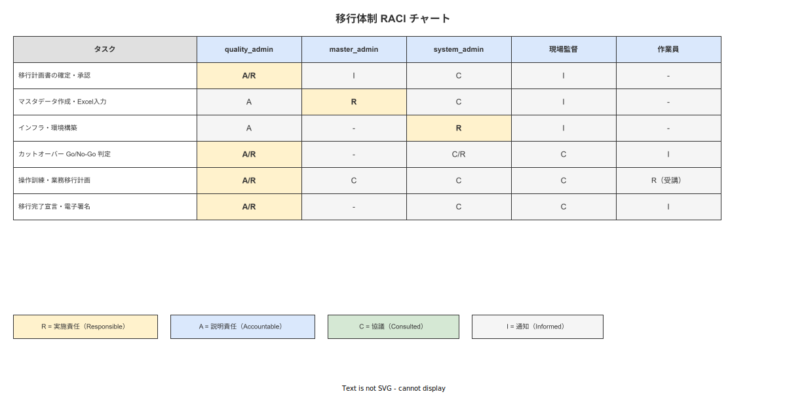
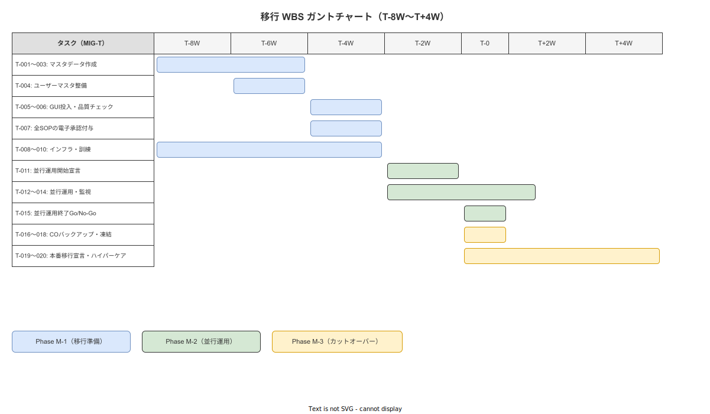

# 01 移行実施計画（マスタ）

本章の責務は、紙・Excel ベースの作業指示運用から本システムへの移行を実施計画レベルで確定することである。04_概要設計/09_移行方式設計/01_移行戦略の概要設計版.md（DES-MIG-001〜020）を上流参照とし、移行体制・フェーズ定義・スケジュール・リスク管理・KPI・完了報告書・ALCOA+/GAMP 5 準拠・コミュニケーション計画・下位計画書索引を確定する。本章は移行計画/02〜11 の親計画書として機能し、下位計画書はすべて本章を上位参照として読むこと。

---

## 1. 本章の責務と IPA 対応

### 1-1. IPA 共通フレーム 2013 との対応

本章は IPA 共通フレーム 2013 の以下のプロセスに対応する。

| IPA プロセス | 本章との対応 |
|---|---|
| INST-A1（移行の準備） | §2（体制・RACI）・§3（移行戦略・フェーズ定義）・§4（スケジュール） |
| INST-A2（移行の実施） | §3（フェーズ定義）・§5（リスク管理）・§6（KPI と成功判定）・§9（コミュニケーション計画） |

INST-A1 は移行を実施するための準備（体制確立・計画書確定・スコープ確定）に対応し、INST-A2 は実際の移行実施（フェーズ管理・リスク監視・品質確認・完了判定）に対応する。

### 1-2. 本章が確定する命題（MIG-X-001〜020）

本章では以下の 20 命題を確定する。各命題は断定文として記述し、「確定する」「準拠する」「対応する」「対象外と判断する」のいずれかで終止する。

| 命題 ID | 命題要旨 | 記述節 |
|---|---|---|
| MIG-X-001 | 移行責任者（quality_admin）と移行判定権限者を正式に任命する | §2 |
| MIG-X-002 | 移行体制の RACI チャートを確定する | §2 |
| MIG-X-003 | Phase M-1 の実施期間をカットオーバー予定日の 8〜4 週前と確定する | §3 |
| MIG-X-004 | Phase M-2 の実施期間を 2〜4 週間と確定する | §3 |
| MIG-X-005 | Phase M-3 の実施所要時間を 2〜4 時間と確定する | §3 |
| MIG-X-006 | 移行成功 KPI「マスタ投入完了率 100%」を確定する | §6 |
| MIG-X-007 | 移行成功 KPI「並行運用期間中 95% 以上のシステム作業完了率」を確定する | §6 |
| MIG-X-008 | 移行成功 KPI「カットオーバー後 72 時間の重大バグゼロ」を確定する | §6 |
| MIG-X-009 | 移行スケジュールを WBS ガントチャート（T-8W〜T+4W）で管理することを確定する | §4 |
| MIG-X-010 | 移行コミュニケーション計画を確定する | §9 |
| MIG-X-011 | RISK-MIG-001 への対策実施計画を確定する | §5 |
| MIG-X-012 | RISK-MIG-002 への対策実施計画を確定する | §5 |
| MIG-X-013 | RISK-MIG-003 への対策実施計画を確定する | §5 |
| MIG-X-014 | 移行完了の 4 条件を確定する | §6 |
| MIG-X-015 | 移行完了報告書の 6 必須項目を確定する | §7 |
| MIG-X-016 | 移行完了報告書の電子署名手順を確定する | §7 |
| MIG-X-017 | ALCOA+ 通底観点を確定する | §8 |
| MIG-X-018 | GAMP 5 IQ/OQ/PQ の対応章を確定する | §8 |
| MIG-X-019 | 移行成果物一覧 16 件を確定する | §7 |
| MIG-X-020 | 下位計画書（移行計画/02〜11）の責務と相互参照索引を確定する | §10 |

---

**本節で確定した方針**
- 本章が INST-A1 と INST-A2 の 2 プロセスをカバーし、IPA 共通フレーム 2013 に準拠することを確定する。
- MIG-X-001〜020 の 20 命題を本章で確定し、下位計画書（移行計画/02〜11）の上位親計画書として機能することを確定する。
- 移行計画/99_前提制約.md（CON-MIG-X-001〜010）の制約全件が本章にも適用されることを確定する。

---

## 2. 移行体制と権限

本節では移行責任者の任命および RACI チャートを確定する。（MIG-X-001〜002 対応）

**図 1: 移行体制 RACI チャート**

> 原本: [`img/fig_mig_org_raci.drawio`](img/fig_mig_org_raci.drawio)

### 2-1. 移行責任者と移行判定権限者の任命

**MIG-X-001**: 移行責任者（quality_admin）と移行判定権限者を正式に任命する。

| 役割 | 担当者区分 | 任命の根拠 | 権限範囲 |
|---|---|---|---|
| 移行責任者 | quality_admin | 本システムの品質・記録の完全性に最も責任を持つロールであり、移行の品質判断・カットオーバー Go/No-Go 宣言・ロールバック宣言の権限を保有する | Phase M-1〜M-3 の全フェーズにわたる品質判断・完了判定・報告書の電子署名 |
| 移行判定権限者 | quality_admin（同一人物が兼務） | 個人開発プロジェクトの規模において、quality_admin が移行責任者と判定権限者を兼務することを確定する | カットオーバー Go/No-Go 判定・ロールバック発動判断・移行完了宣言 |
| 技術実施責任者 | system_admin | インフラ・DB・デバイス管理の技術的責任を担うロール。移行判定権限はなく、quality_admin の判断に基づいて技術作業を実施する | MIG-T-001〜020 の技術タスク実施・エラーログ監視・バックアップ取得 |
| マスタ作成責任者 | master_admin | マスタデータ（工程・作業・製品・SOP）の Excel テンプレート作成・投入実行を担うロール | MIG-T-002〜007 のデータ投入タスク実施 |

### 2-2. 移行体制の 5 ロール定義

**MIG-X-002**: 移行体制の RACI チャートを確定する。（DES-MIG-002 対応）

移行体制の 5 ロールを以下の通り確定する。

| ロール | 役割定義 | 人数の前提 |
|---|---|---|
| quality_admin | 移行の品質判断・完了判定・カットオーバー宣言・ロールバック宣言・全報告書の電子署名 | 1 名（移行責任者 + 移行判定権限者を兼務） |
| master_admin | マスタデータの Excel テンプレート作成・GUI ウィザード操作・投入後目視確認 | 1〜2 名（quality_admin が兼務する場合もある） |
| system_admin | インフラ設計・デバイス管理・DB バックアップ・エラーログ監視・技術的問題の一次対応 | 1 名（個人開発前提では quality_admin が兼務する場合がある） |
| 現場監督 | 作業員への訓練実施補助・並行運用中の現場問題の quality_admin へのエスカレーション・カットオーバーアナウンスの現場展開 | 工程ごとに 1 名（工程数に応じて複数名） |
| 作業員 | 並行運用期間中のシステム操作実施・紙記録との照合・操作問題の現場監督へのエスカレーション | 全移行対象作業員（CON-MIG-X-006 の前提：50 名以下） |

### 2-3. RACI チャート

| タスク | quality_admin | master_admin | system_admin | 現場監督 | 作業員 |
|---|---|---|---|---|---|
| 移行計画書の確定・承認（MIG-T-001） | A/R | C | C | I | — |
| マスタ Excel テンプレート作成（MIG-T-002〜003） | A | R | C | — | — |
| ユーザーマスタ整備（MIG-T-004） | A | R | C | C | — |
| GUI ウィザードによるマスタ投入（MIG-T-005） | A | R | C | — | — |
| 投入後品質チェック（MIG-T-006） | A/R | C | C | — | — |
| 全 SOP 電子承認付与（MIG-T-007） | A/R | C | — | — | — |
| WiFi 設置・疎通確認（MIG-T-008） | A | — | R | — | — |
| ハンディ端末登録（MIG-T-009） | A | — | R | — | — |
| 操作訓練（MIG-T-010） | A | C | C | R | C |
| 並行運用開始宣言（MIG-T-011） | A/R | — | C | I | I |
| エラーログ確認（MIG-T-012） | A | — | R | — | — |
| 週次完了率・エラー率集計（MIG-T-013） | A/R | — | C | C | — |
| ロールバック判断（MIG-T-014） | A/R | — | C | I | I |
| Go/No-Go 判断（MIG-T-015） | A/R | — | C | C | — |
| カットオーバー前バックアップ（MIG-T-016） | A | — | R | — | — |
| ハッシュチェーン初期ブロック生成（MIG-T-017） | A | — | R | — | — |
| 旧運用凍結宣言（MIG-T-018） | A/R | — | C | I | I |
| 全作業員への本番移行アナウンス（MIG-T-019） | A | — | — | R | — |
| 本番移行宣言（MIG-T-020） | A/R | — | C | I | I |

（凡例: R = 実施責任, A = 説明責任, C = 協議対象, I = 情報共有先）

### 2-4. 3 者合意制

カットオーバーの実施判断（Go/No-Go 宣言）は quality_admin・現場監督・system_admin の 3 者合意を必須とする。3 者のうち 1 者でも No-Go を宣言した場合はカットオーバーを延期し、No-Go 理由を移行記録に記録する。

| 合意者 | 合意内容 | 確認方法 |
|---|---|---|
| quality_admin | カットオーバーチェックリスト CL-001〜009 の全確認完了・品質 KPI 充足 | Go 宣言の電子署名（CL-010） |
| 現場監督 | 全作業員への通知完了・現場の準備完了（紙運用凍結の現場周知） | 口頭確認 + 移行記録への記録 |
| system_admin | 技術インフラ（WiFi・デバイス・DB・バックアップ）の全チェック完了 | CL-001〜007 の確認記録 |

---

**本節で確定した方針**
- quality_admin を移行責任者および移行判定権限者として任命し、カットオーバー Go/No-Go 宣言・ロールバック発動判断の権限を quality_admin に帰属させることを確定する（MIG-X-001 対応）。
- quality_admin・master_admin・system_admin・現場監督・作業員の 5 ロールによる RACI チャートを確定する（MIG-X-002 対応）。
- カットオーバーの実施判断に quality_admin・現場監督・system_admin の 3 者合意を必須とすることを確定する。

---

## 3. 移行戦略

本節では移行方式と 3 フェーズ定義を確定する。（MIG-X-003〜005 対応）

**図 2: 移行フェーズ概要（M-1〜M-3）**

> 原本: [`img/fig_mig_phase_overview.drawio`](img/fig_mig_phase_overview.drawio)

### 3-1. 並行運用→カットオーバー方式の再確認

**MIG-X-003〜005**: Phase M-1〜M-3 の実施期間を確定する。（DES-MIG-002 対応）

採用方式「並行運用（Phase M-2: 2〜4 週間）→ カットオーバー（Phase M-3）」を移行戦略として確定する。一斉切替（ビッグバン）方式および段階切替（機能単位）方式は採用しない。（DES-MIG-002 継承）

| 方式 | 採否 | 理由 |
|---|---|---|
| 並行運用方式（採用） | 採用する | 業務継続リスクが低い（紙運用を保持）。ロールバック容易性が高い（紙運用に即時復帰可能）。単一工場に適合する |
| 一斉切替（ビッグバン）方式（不採用） | 採用しない | 切替失敗時の業務停止リスクが高く、製造業の安全要件と相容れない |
| 段階切替（機能単位）方式（不採用） | 採用しない | 単一工場向けシステムに対して複雑すぎる方式であり、管理コストが費用対効果を上回る |

### 3-2. Phase M-1（移行準備）の定義

**MIG-X-003**: Phase M-1（移行準備）の実施期間をカットオーバー予定日の 8〜4 週前と確定する。（DES-MIG-004 対応）

| 属性 | 内容 |
|---|---|
| フェーズ名 | Phase M-1：移行準備 |
| 実施期間 | カットオーバー予定日の 8〜4 週前 |
| 主要タスク | マスタデータ Excel テンプレート作成・GUI ウィザード投入・自動バリデーション・目視サンプリング・全 SOP 電子承認・WiFi 疎通確認・ハンディ端末登録・操作訓練 |
| 完了条件 | MIG-T-001〜010 の全タスク完了・quality_admin による書面承認 |
| 主担当者 | quality_admin（全体統括・SOP 承認）・master_admin（データ投入）・system_admin（インフラ・デバイス） |

Phase M-1 タスク一覧（DES-MIG-004 継承・実施計画版）:

| タスク ID | タスク名 | 担当者 | 完了基準 | 目標完了時期 |
|---|---|---|---|---|
| MIG-T-001 | 移行計画書の確定（quality_admin 承認） | quality_admin | 本章（移行実施計画マスタ）の電子署名承認完了 | T-8W |
| MIG-T-002 | 工程・作業マスタの Excel テンプレート作成 | master_admin | テンプレートの quality_admin レビュー完了 | T-7W |
| MIG-T-003 | 製品・SOP マスタの Excel テンプレート作成 | master_admin | テンプレートの quality_admin レビュー完了 | T-7W |
| MIG-T-004 | ユーザーマスタ・ロール/スキル情報の整備 | master_admin | 全作業員のユーザー情報入力完了・quality_admin 確認 | T-6W |
| MIG-T-005 | GUI ウィザードによる全マスタの投入実行 | master_admin | 全マスタの GUI 投入完了・自動バリデーション通過 | T-5W |
| MIG-T-006 | 投入後品質チェック（自動 + 目視サンプリング） | quality_admin | 自動バリデーションエラー 0 件・目視サンプリング 100% 完了（SOP 100 件以下の場合は全件確認） | T-5W〜T-4W |
| MIG-T-007 | quality_admin による全 SOP の電子承認付与 | quality_admin | 全 SOP のステータスが「公開（published）」に変更完了 | T-4W |
| MIG-T-008 | WiFi AP 設置・ネットワーク疎通確認 | system_admin | 全生産エリアで -70 dBm 以上の電波強度確認完了 | T-6W（CON-MIG-X-003 前提） |
| MIG-T-009 | ハンディ端末・管理 PC のシステム登録 | system_admin | 全デバイスのシステム登録完了・初回ログイン確認 | T-5W |
| MIG-T-010 | 操作訓練（quality_admin・現場監督・作業員） | quality_admin + 現場監督 | 全作業員の初回ログイン完了・訓練完了記録の作成 | T-4W |

### 3-3. Phase M-2（並行運用）の定義

**MIG-X-004**: Phase M-2（並行運用）の実施期間を 2〜4 週間と確定する。（DES-MIG-003・DES-MIG-004 対応）

| 属性 | 内容 |
|---|---|
| フェーズ名 | Phase M-2：並行運用 |
| 実施期間 | 最短 2 週間・最長 4 週間（DES-MIG-003 の完了条件充足まで） |
| 主要タスク | 紙運用とシステム運用の同時実施・毎日のエラーログ確認・週次完了率集計・問題収集・Go/No-Go 判断 |
| 完了条件（3 条件すべて充足） | 1. システム側の作業完了率が全作業件数の 95% 以上 / 2. システム操作エラー率（スキップ・強制終了）が全作業件数の 2% 未満 / 3. 未解決の重大バグが 0 件 |
| 主担当者 | system_admin（監視・問題対応）・quality_admin（品質判断・週次レポート確認） |

Phase M-2 タスク一覧（DES-MIG-004 継承・実施計画版）:

| タスク ID | タスク名 | 担当者 | 完了基準 | 実施頻度 |
|---|---|---|---|---|
| MIG-T-011 | 並行運用開始宣言（quality_admin 署名） | quality_admin | 電子署名付き宣言書の作成・全作業員への通知 | 1 回（Phase M-2 開始時） |
| MIG-T-012 | 毎日のエラーログ確認（system_admin） | system_admin | エラーログ確認記録の作成（異常なし or 問題報告） | 毎日（平日） |
| MIG-T-013 | 週次の作業完了率・エラー率の集計と報告 | system_admin + quality_admin | 週次レポートの作成・quality_admin への報告 | 毎週（週末） |
| MIG-T-014 | 問題発生時のロールバック判断（quality_admin） | quality_admin | 問題内容・判断記録・対応記録の作成 | 問題発生時 |
| MIG-T-015 | 並行運用終了条件の確認と Go/No-Go 判断 | quality_admin | DES-MIG-003 の 3 条件充足確認・Go 宣言の電子署名 | 1 回（Phase M-2 終了時） |

### 3-4. Phase M-3（カットオーバー）の定義

**MIG-X-005**: Phase M-3（カットオーバー）の実施所要時間を 2〜4 時間と確定する。（DES-MIG-004・DES-MIG-052 対応）

| 属性 | 内容 |
|---|---|
| フェーズ名 | Phase M-3：カットオーバー |
| 実施タイミング | 週末（土曜日）または計画停止時間中（CON-MIG-X-009 準拠） |
| 実施所要時間 | 2〜4 時間 |
| 主要タスク | カットオーバー前バックアップ取得・ハッシュチェーン初期ブロック生成・旧運用凍結宣言・全作業員への本番移行アナウンス・本番移行宣言 |
| 完了条件 | カットオーバーチェックリスト全 10 項目の確認完了・quality_admin の本番移行宣言（電子署名付き） |
| 主担当者 | quality_admin（Go/No-Go 判断・宣言）・system_admin（技術作業）・現場監督（アナウンス展開） |

Phase M-3 タスク一覧（DES-MIG-004 継承・実施計画版）:

| タスク ID | タスク名 | 担当者 | 完了基準 | 実施タイミング |
|---|---|---|---|---|
| MIG-T-016 | カットオーバー前バックアップの取得 | system_admin | PostgreSQL フルバックアップ完了・リストア疎通確認完了（CL-007 準拠） | T-0（カットオーバー開始） |
| MIG-T-017 | ハッシュチェーン初期ブロックの生成 | system_admin | audit_logs 初期ブロック生成完了・整合性チェック正常（CL-006 準拠） | T-0 + 30 分 |
| MIG-T-018 | 旧運用（紙）の凍結宣言（quality_admin 署名） | quality_admin | 紙記録用紙の配布停止・Excel ファイルの読み取り専用設定完了（CL-008 準拠）・電子署名付き宣言書作成 | T-0 + 60 分 |
| MIG-T-019 | 全作業員への本番移行アナウンス | 現場監督 | 全作業員への口頭 + 掲示アナウンス完了（CL-009 準拠） | T-0 + 90 分 |
| MIG-T-020 | 本番移行宣言（quality_admin 署名） | quality_admin | 本番移行宣言書の電子署名作成・全作業員への周知完了 | T-0 + 120〜240 分 |

---

**本節で確定した方針**
- 移行方式を「並行運用（Phase M-2: 2〜4 週間）→ カットオーバー」とし、一斉切替方式は採用しないことを確定する（DES-MIG-002 対応）。
- Phase M-1 の実施期間をカットオーバー予定日の 8〜4 週前（MIG-X-003）・Phase M-2 を 2〜4 週間（MIG-X-004）・Phase M-3 を 2〜4 時間（MIG-X-005）と確定する（DES-MIG-004 対応）。
- Phase M-1〜M-3 の各タスク（MIG-T-001〜020）に担当者・完了基準・目標時期を割り当て、管理することを確定する。

---

## 4. 移行スケジュール

本節では WBS ガントチャートによるスケジュール管理を確定する。（MIG-X-009 対応）

**図 3: 移行 WBS ガントチャート（T-8W〜T+4W）**

> 原本: [`img/fig_mig_gantt.drawio`](img/fig_mig_gantt.drawio)

### 4-1. スケジュール管理の基本方針

**MIG-X-009**: 移行スケジュールを WBS ガントチャート（T-8W〜T+4W）で管理することを確定する。（DES-MIG-004 対応）

スケジュール管理の基準時点 T-0 をカットオーバー実施日と定義し、T-8W（カットオーバー 8 週前）から T+4W（カットオーバー 4 週後）までの 12 週間のスケジュールを管理する。

### 4-2. WBS ガントチャート（MIG-T-001〜020 タスク管理表）

| 週 | マイルストーン | 主要タスク | 担当者 |
|---|---|---|---|
| T-8W | Phase M-1 開始 | MIG-T-001（移行計画書確定・quality_admin 承認） | quality_admin |
| T-7W | マスタテンプレート完成 | MIG-T-002・MIG-T-003（Excel テンプレート作成） | master_admin |
| T-6W | インフラ完成・ユーザー情報整備 | MIG-T-004（ユーザーマスタ整備）・MIG-T-008（WiFi 設置）※CON-MIG-X-003 前提 | master_admin・system_admin |
| T-5W | マスタ投入開始・デバイス登録 | MIG-T-005（GUI ウィザード投入）・MIG-T-009（デバイス登録） | master_admin・system_admin |
| T-4W | Phase M-1 完了・リハーサル実施 | MIG-T-006（品質チェック）・MIG-T-007（SOP 電子承認）・MIG-T-010（操作訓練）・リハーサル実施（移行計画/03） | quality_admin・master_admin |
| T-3W | Phase M-2 開始 | MIG-T-011（並行運用開始宣言） | quality_admin |
| T-3W〜T-1W | 並行運用期間 | MIG-T-012（日次エラーログ）・MIG-T-013（週次集計）・MIG-T-014（問題対応） | system_admin・quality_admin |
| T-1W | Phase M-2 終了判断 | MIG-T-015（Go/No-Go 判断）・Phase M-2 完了条件確認 | quality_admin |
| T-0 | Phase M-3（カットオーバー） | MIG-T-016〜020（カットオーバー実施） | quality_admin・system_admin・現場監督 |
| T+1W〜T+2W | 72h ハイパーケア・安定化監視 | 移行計画/06 §7 連携・日次監視 | system_admin |
| T+3W〜T+4W | 移行完了報告 | 移行完了報告書の作成・電子署名・提出 | quality_admin |

### 4-3. スケジュール変更管理

スケジュールの変更が必要になった場合は以下の手順で管理する。

| 変更類型 | 対応手順 |
|---|---|
| Phase M-1 の延長（マスタ投入の遅延等） | quality_admin がカットオーバー予定日を後ろにシフトし、全関係者に通知する |
| Phase M-2 の延長（完了条件未充足） | quality_admin が延長週数（最大 4 週まで）を判断し、週次レポートに記録する |
| Phase M-2 の短縮（完了条件早期充足） | quality_admin が MIG-T-015 の Go 判断を行い、カットオーバーを前倒しで実施する |
| Phase M-3 の延期（No-Go 発動） | quality_admin が延期理由を移行記録に記録し、次回カットオーバー候補日を設定する |

---

**本節で確定した方針**
- 移行スケジュールを WBS ガントチャート（T-8W〜T+4W の 12 週間）で管理することを確定する（MIG-X-009 対応）。
- スケジュールの基準時点 T-0 をカットオーバー実施日と定義し、MIG-T-001〜020 を T-8W〜T-0 に配置することを確定する。
- スケジュール変更時は quality_admin が全関係者に通知し、変更記録を作成することを確定する。

---

## 5. 移行リスク管理

本節では RISK-MIG-001〜003 への実施版対策を確定する。（MIG-X-011〜013 対応）

### 5-1. リスク管理の前提

DES-MIG-005 が確定した 3 大リスクを移行計画の最優先管理対象として、実施計画版の対策内容・担当者・期限を確定する。（DES-MIG-005 対応）

### 5-2. RISK-MIG-001: SOP 電子化の品質不足への対策実施計画

**MIG-X-011**: RISK-MIG-001（SOP 電子化品質不足）への対策実施計画を確定する。

| 項目 | 内容 |
|---|---|
| リスク内容 | master_admin のスキル・経験に依存した SOP 入力品質のばらつき。OCR 変換誤字・Step 順序の誤り・管理値の転記ミス |
| 影響度 | 高（SOP 品質不足は現場作業の誤実施・ALCOA+ 違反に直結） |
| 対策 1: 投入前品質チェック（MIG-T-006） | 自動バリデーション（FK 整合性・NULL・重複・型不整合）を実施し、エラー 0 件を確認してから次工程に進む。実施担当: system_admin |
| 対策 2: quality_admin 全 SOP 目視確認（MIG-T-006） | SOP 総数 100 件以下の場合は全件、101 件以上の場合は 20% 以上のサンプリングで目視確認を実施する。実施担当: quality_admin |
| 対策 3: プレビュー確認必須化 | GUI ウィザード上でのプレビュー確認を MIG-T-005 の完了条件に含め、プレビュー確認なしの本番投入を禁止する |
| 対策 4: 電子承認（MIG-T-007） | quality_admin による全 SOP の電子承認付与を Phase M-1 完了条件に含め、未承認 SOP の公開を禁止する |
| 残存リスク | 目視確認で発見できない論理的誤り（Step 内容が業務実態と異なる等）は並行運用期間（Phase M-2）での現場フィードバックで発見する |
| 担当者 | quality_admin（全体統括・承認）・master_admin（投入・修正） |
| 期限 | MIG-T-007 完了（T-4W）まで |

### 5-3. RISK-MIG-002: デバイス調達遅延への対策実施計画

**MIG-X-012**: RISK-MIG-002（デバイス調達遅延）への対策実施計画を確定する。

| 項目 | 内容 |
|---|---|
| リスク内容 | ハンディ端末・WiFi AP の調達リードタイム超過による Phase M-1 のスケジュール遅延 |
| 影響度 | 高（デバイス未登録・WiFi 未設置のままカットオーバーを実施するとシステム運用が不可能） |
| 対策 1: Phase M-1 開始と同時の発注 | ハンディ端末および WiFi AP の発注を MIG-T-001（移行計画書確定: T-8W）と同時に実施する。発注承認は quality_admin が実施する |
| 対策 2: 調達ステータスの週次モニタリング | system_admin が調達ステータスを週次確認し、遅延兆候を発見した際は quality_admin にエスカレーションする |
| 対策 3: 代替デバイスの事前準備 | 一次調達品の遅延に備え、代替品（同等スペックの別機種）を発注候補リストとして事前に選定する |
| 対策 4: WiFi 設置工事の早期完了 | WiFi 設置工事を T-6W 完了を目標として実施し、MIG-T-009（デバイス登録: T-5W）の前提条件を確保する |
| 残存リスク | 代替品でも調達困難な場合は Phase M-1 を延長し、カットオーバー予定日を後ろにシフトする |
| 担当者 | system_admin（調達実施・モニタリング）・quality_admin（調達承認・スケジュール判断） |
| 期限 | MIG-T-009 完了（T-5W）まで |

### 5-4. RISK-MIG-003: 並行期オペレーター混乱への対策実施計画

**MIG-X-013**: RISK-MIG-003（並行期オペレーター混乱）への対策実施計画を確定する。

| 項目 | 内容 |
|---|---|
| リスク内容 | Phase M-2 中の紙記録とシステム記録の二重実施による作業員の負荷増大・操作誤り・記録漏れ |
| 影響度 | 中（操作エラー率 2% 超過は Phase M-2 の完了条件未達となり、並行期が延長される） |
| 対策 1: 並行期間の最長 4 週間への制限（DES-MIG-003） | 二重記録の負荷期間を最長 4 週間に制限し、4 週経過後は完了条件未充足でも質担当判断でカットオーバーを実施する選択肢を確保する |
| 対策 2: 操作訓練の並行開始前完了（MIG-T-010） | MIG-T-010（操作訓練）を Phase M-2 開始前（T-4W）に完了させ、未訓練作業員が並行運用に参加しない状態を確保する |
| 対策 3: 現場監督によるサポート体制 | Phase M-2 中は現場監督が各工程に配置され、作業員の操作問題に即時対応する体制を確立する |
| 対策 4: 操作問題の集約・フィードバック | system_admin が日次エラーログ（MIG-T-012）を確認し、繰り返し発生する操作問題は翌日朝のブリーフィングで全作業員に周知する |
| 残存リスク | 高齢作業員・IT リテラシーの低い作業員への個別支援が必要な場合は、現場監督が 1 対 1 サポートを実施する |
| 担当者 | 現場監督（現場サポート）・system_admin（ログ監視）・quality_admin（全体統括） |
| 期限 | Phase M-2 全期間中 |

---

**本節で確定した方針**
- RISK-MIG-001（SOP 品質不足）に対して自動バリデーション + 目視確認 + 電子承認の 3 段階対策を Phase M-1 完了条件として確定する（MIG-X-011 対応）。
- RISK-MIG-002（デバイス調達遅延）に対してデバイス発注を T-8W と同時着手し、system_admin が週次モニタリングを実施することを確定する（MIG-X-012 対応）。
- RISK-MIG-003（並行期混乱）に対して操作訓練を Phase M-2 開始前完了とし、現場監督による即時サポート体制を Phase M-2 全期間中確立することを確定する（MIG-X-013 対応）。

---

## 6. 移行 KPI と成功判定

本節では移行成功 KPI・移行完了の 4 条件を確定する。（MIG-X-006〜008・014 対応）

### 6-1. 移行成功 KPI の確定

**MIG-X-006**: 移行成功 KPI「マスタ投入完了率 100%」を確定する。

| KPI ID | KPI 名 | 測定方法 | 合格基準 | 測定タイミング |
|---|---|---|---|---|
| KPI-MIG-001 | マスタ投入完了率 | システム上の全マスタレコード件数 ÷ 計画投入件数 × 100 | 100%（1 件の未投入も許容しない） | MIG-T-006 完了時（T-4W〜T-5W） |

**MIG-X-007**: 移行成功 KPI「並行運用期間中 95% 以上のシステム作業完了率」を確定する。

| KPI ID | KPI 名 | 測定方法 | 合格基準 | 測定タイミング |
|---|---|---|---|---|
| KPI-MIG-002 | システム作業完了率 | システムで完了した作業件数 ÷ 並行期間中の全作業件数 × 100 | 95% 以上 | Phase M-2 の週次集計（MIG-T-013） |
| KPI-MIG-003 | システム操作エラー率 | スキップ・強制終了件数 ÷ 全作業件数 × 100 | 2% 未満 | Phase M-2 の週次集計（MIG-T-013） |
| KPI-MIG-004 | 未解決重大バグ件数 | Severity: Critical / High の未解決バグ件数 | 0 件 | Phase M-2 の週次集計（MIG-T-013） |

**MIG-X-008**: 移行成功 KPI「カットオーバー後 72 時間の重大バグゼロ」を確定する。

| KPI ID | KPI 名 | 測定方法 | 合格基準 | 測定タイミング |
|---|---|---|---|---|
| KPI-MIG-005 | カットオーバー後 72h 重大バグ件数 | Severity: Critical / High の新規発生バグ件数（T+0〜T+72h） | 0 件 | T+72h 時点（ハイパーケア終了時） |
| KPI-MIG-006 | 証跡記録生成率 | work_events 生成件数 ÷ カットオーバー後の全作業件数 × 100 | 100% | T+72h 時点 |
| KPI-MIG-007 | ハッシュチェーン整合性 | 整合性チェックバッチのエラー件数 | 0 件 | T+72h 時点 |
| KPI-MIG-008 | 旧記録（紙）使用件数 | カットオーバー後に記入された紙記録票件数 | 0 件 | T+72h 時点 |

### 6-2. 移行完了の 4 条件

**MIG-X-014**: 移行完了の 4 条件を確定する。（DES-MIG-060 対応）

| 完了条件番号 | 完了条件 | 判定基準 | 確認者 |
|---|---|---|---|
| 完了条件 1 | 証跡記録の完全性 | work_events の生成率 = 100%（全作業件数に対して） | system_admin |
| 完了条件 2 | ハッシュチェーン整合性 | 整合性チェックバッチのエラー = 0 件 | system_admin |
| 完了条件 3 | 旧運用の完全停止 | 紙記録票の使用件数 = 0 件（カットオーバー後 72 時間以内） | quality_admin |
| 完了条件 4 | 重大バグ発生件数 | Severity: Critical / High の新規バグ = 0 件（カットオーバー後 72 時間以内） | system_admin |

上記 4 条件がすべて充足された時点で quality_admin が移行完了宣言を行い、移行完了報告書を作成する。

---

**本節で確定した方針**
- 移行成功 KPI「マスタ投入完了率 100%」（MIG-X-006）・「並行期システム作業完了率 95% 以上」（MIG-X-007）・「カットオーバー後 72h 重大バグゼロ」（MIG-X-008）を確定する。
- 移行完了の 4 条件（証跡完全性・ハッシュチェーン整合性・旧運用停止・重大バグゼロ）を確定する（MIG-X-014 対応）。
- 4 条件すべての充足をもって quality_admin が移行完了宣言を行うことを確定する。

---

## 7. 移行完了報告書テンプレート

本節では移行完了報告書の必須項目・電子署名手順・保存期間を確定する。（MIG-X-015〜016・019 対応）

### 7-1. 移行完了報告書の 6 必須項目

**MIG-X-015**: 移行完了報告書の 6 必須項目を確定する。（DES-MIG-060 対応）

| 項番 | 必須項目 | 記載内容 |
|---|---|---|
| 1 | 移行完了日時 | quality_admin が移行完了宣言を行った日時（タイムスタンプ付き） |
| 2 | 移行完了 KPI 結果 | KPI-MIG-001〜008 の測定結果一覧（全合格の確認） |
| 3 | 移行完了 4 条件の確認結果 | 完了条件 1〜4 の確認記録（測定値・確認者・確認日時） |
| 4 | 発生した問題とその対応記録 | Phase M-1〜M-3 で発生した問題・バグ・リスク顕在化事象の一覧（問題内容・対応内容・解決確認日時） |
| 5 | 残課題一覧 | 移行完了時点で未解決のサポート課題・軽微なバグの一覧（Severity: Low 以下の未解決事象） |
| 6 | 移行成果物一覧（16 件）と保管場所 | 移行成果物 16 件の保管場所（システム上・ファイルサーバー等）と保存期間の確認 |

### 7-2. 移行完了報告書の電子署名手順

**MIG-X-016**: 移行完了報告書の電子署名手順を確定する。

| ステップ | 手順 | 担当者 |
|---|---|---|
| 1. 報告書草稿作成 | quality_admin が移行完了報告書の草稿を作成する（移行完了 4 条件の充足確認後、T+3W〜T+4W 以内に作成） | quality_admin |
| 2. 内容確認 | system_admin が技術項目（KPI 測定値・ハッシュチェーン整合性結果）の正確性を確認する | system_admin |
| 3. 電子署名付与 | quality_admin がシステム上の電子署名機能を使用して報告書に署名する（署名日時・署名者 ID が自動記録される） | quality_admin |
| 4. 保存 | 電子署名付き報告書をシステムの `migration_reports` テーブル（または文書管理ストレージ）に保存する | system_admin |

### 7-3. 移行成果物一覧（16 件）

**MIG-X-019**: 移行成果物一覧 16 件を確定する。

| 番号 | 成果物名 | 種別 | 保存期間 | 担当者 |
|---|---|---|---|---|
| 1 | 移行実施計画（マスタ）（本章） | 計画書 | 7 年以上 | quality_admin |
| 2 | 移行計画/02 訓練計画 | 計画書 | 7 年以上 | quality_admin |
| 3 | 移行計画/03 リハーサル計画 | 計画書 | 7 年以上 | quality_admin |
| 4 | 移行計画/04 マスタデータ移行計画 | 計画書 | 7 年以上 | quality_admin |
| 5 | 移行計画/05 マスタデータ品質計画 | 計画書 | 7 年以上 | quality_admin |
| 6 | 移行計画/06 カットオーバー実施計画 | 計画書 | 7 年以上 | quality_admin |
| 7 | 移行計画/07 ロールバック実施計画 | 計画書 | 7 年以上 | quality_admin |
| 8 | 並行運用開始宣言書（MIG-T-011） | 記録 | 7 年以上 | quality_admin |
| 9 | 週次完了率・エラー率レポート（全週分） | 記録 | 7 年以上 | quality_admin |
| 10 | 投入後品質チェック記録（MIG-T-006） | 記録 | 7 年以上 | quality_admin |
| 11 | リハーサル結果報告書 | 記録 | 7 年以上 | quality_admin |
| 12 | カットオーバー実施記録（チェックリスト） | 記録 | 7 年以上 | quality_admin |
| 13 | 旧運用凍結宣言書（MIG-T-018） | 記録 | 7 年以上 | quality_admin |
| 14 | 本番移行宣言書（MIG-T-020） | 記録 | 7 年以上 | quality_admin |
| 15 | 移行完了報告書 | 報告書 | 7 年以上 | quality_admin |
| 16 | 訓練完了記録（全作業員分） | 記録 | 7 年以上 | quality_admin |

### 7-4. 移行成果物の保存期間

すべての移行成果物は作成日から 7 年以上保存する。この保存期間の根拠は以下の通りである。

| 根拠 | 内容 |
|---|---|
| ISO 9001 要求 | 品質記録の保存期間の最低要件に準拠する |
| 製造業の一般的な実務慣行 | 製品・工程の移行記録は最低 7 年保存が業界標準 |
| ALCOA+ の Contemporaneous 原則への準拠 | 移行時点の記録の完全性を長期にわたり保証するため |

---

**本節で確定した方針**
- 移行完了報告書の 6 必須項目（完了日時・KPI 結果・4 条件確認・問題対応記録・残課題・成果物一覧）を確定する（MIG-X-015 対応）。
- 移行完了報告書の電子署名を quality_admin が実施し、システム上で署名日時・署名者 ID が自動記録されることを確定する（MIG-X-016 対応）。
- 移行成果物 16 件を確定し、すべて 7 年以上保存することを確定する（MIG-X-019 対応）。

---

## 8. ALCOA+/GAMP 5 通底

本節では ALCOA+ 通底観点と GAMP 5 IQ/OQ/PQ の対応を確定する。（MIG-X-017〜018 対応）

### 8-1. ALCOA+ 通底観点の確定

**MIG-X-017**: ALCOA+ 通底観点（記録完全性率 100%・変更管理証跡）を確定する。

移行の全フェーズにわたり、以下の ALCOA+ 原則を通底させる。

| ALCOA+ 原則 | 移行での適用内容 | 確認方法 |
|---|---|---|
| Attributable（帰属可能性） | すべての移行作業記録に実施者 ID・実施日時を自動記録する | audit_logs テーブルの実施者 ID フィールドを確認する |
| Legible（判読可能性） | 移行成果物（計画書・記録・報告書）は電子形式で作成し、PDF/システム上で保管する | 保存後の表示確認を実施する |
| Contemporaneous（同時性） | 移行作業を実施したその場で記録を作成し、後日遡及入力を禁止する（ただしロールバック後の is_retroactive=true フラグ付き後入力は例外として認める） | 記録の作成日時を実施日時と照合する |
| Original（原本性） | 電子署名付きの原本記録を改変禁止の状態で保管する | 電子署名の有効性を確認する |
| Accurate（正確性） | quality_admin による全 SOP 目視確認（MIG-T-006〜007）で転記誤りを排除する | 目視確認記録と電子承認記録の存在を確認する |
| Complete（完全性） | 記録完全性率（KPI-MIG-006: work_events 生成率 100%）を必須 KPI として管理する | KPI-MIG-006 の測定値を確認する |
| Consistent（整合性） | ハッシュチェーン整合性（KPI-MIG-007: エラー 0 件）を必須 KPI として管理する | 整合性チェックバッチの結果を確認する |
| Enduring（永続性） | 移行成果物の保存期間を 7 年以上と確定し、長期保管を保証する | 保存期間設定を定期確認する |
| Available（可用性） | 移行成果物を audit_logs・文書管理ストレージに保管し、監査時に即時参照可能とする | 保管場所からの取り出し疎通確認を実施する |

変更管理証跡: 移行フリーズ期間（D-MIG-X-010 参照）中の本番システム変更はすべて audit_logs に記録し、変更者 ID・変更内容・承認者 ID を自動記録する。

### 8-2. GAMP 5 IQ/OQ/PQ の対応章

**MIG-X-018**: GAMP 5 IQ/OQ/PQ の対応章を確定する。

| GAMP 5 検証段階 | 定義 | 本システムの対応章 |
|---|---|---|
| IQ（Installation Qualification: 据付時適格性確認） | ハードウェア・ソフトウェア・インフラが設計仕様通りに設置・設定されていることを確認する | 移行計画/03（リハーサル計画）のステージング環境確認・MIG-T-008〜009（WiFi 設置・デバイス登録）・CON-MIG-X-010（ステージング同等環境） |
| OQ（Operational Qualification: 稼動時適格性確認） | システムが設計仕様通りに動作することを確認する | 移行計画/03（リハーサル計画）のカットオーバーチェックリスト CL-001〜010 実行・MIG-T-005〜006（マスタ投入・品質チェック） |
| PQ（Performance Qualification: 性能適格性確認） | システムが実際の業務環境で継続的に性能を発揮することを確認する | Phase M-2（並行運用）全期間・KPI-MIG-002〜004 の週次測定・移行計画/06 §4（Go/No-Go 判定） |

GAMP 5 各段階の合格基準と対応計画書のマッピングを移行計画/03 に詳細記述する。

---

**本節で確定した方針**
- ALCOA+ の 9 原則（A/L/C/O/A/C/C/E/A）すべてを移行の全フェーズに通底させ、記録完全性率 100% と変更管理証跡の維持を確定する（MIG-X-017 対応）。
- GAMP 5 の IQ（インフラ設置確認）・OQ（動作確認）・PQ（業務環境での性能確認）に対応する章を移行計画/03・MIG-T-005〜006・Phase M-2 にそれぞれ対応させることを確定する（MIG-X-018 対応）。
- 移行フリーズ期間中の本番システム変更に変更管理証跡（audit_logs への自動記録）を必須とすることを確定する。

---

## 9. コミュニケーション計画

本節では移行期間中のコミュニケーション体制を確定する。（MIG-X-010 対応）

### 9-1. コミュニケーション計画の構成

**MIG-X-010**: 移行コミュニケーション計画（週次レポート・日次スタンドアップ・エスカレーション経路）を確定する。

| コミュニケーション種別 | 実施タイミング | 実施者 | 対象者 | 内容 |
|---|---|---|---|---|
| 週次移行ステータスレポート | 毎週末（Phase M-1〜M-3） | quality_admin | 全関係者（RACI の I 対象） | 移行進捗・KPI 測定値・問題事象・次週予定を記載した書面レポート |
| 日次スタンドアップ（Phase M-2 中） | 毎朝 15 分（Phase M-2 期間中） | system_admin + quality_admin | 現場監督・master_admin | 前日のエラーログ・問題・当日の注意事項の共有 |
| カットオーバー前日ブリーフィング | カットオーバー前日 | quality_admin | 全作業員・現場監督・system_admin | カットオーバー当日の手順・注意事項・緊急連絡先の周知 |
| ハイパーケア状況報告 | T+24h・T+48h・T+72h | system_admin | quality_admin | KPI 測定値・問題発生有無・対応状況の報告 |

### 9-2. エスカレーション経路

| 問題レベル | 判断基準 | エスカレーション先 | 対応時間 |
|---|---|---|---|
| Level 1（情報共有） | 軽微なエラー（Severity: Low）・作業員の操作ミス（自己解決可能） | 現場監督 → 翌日の日次スタンドアップで報告 | 24 時間以内に報告 |
| Level 2（問題対応） | エラー率上昇（1%〜2%未満）・Severity: Medium のバグ発生 | 現場監督 → system_admin → quality_admin | 4 時間以内に quality_admin へ報告 |
| Level 3（緊急対応） | エラー率 2% 超過・Severity: High/Critical のバグ発生・カットオーバーチェックリスト失敗 | system_admin → quality_admin（即時） | 1 時間以内に quality_admin へ報告・ロールバック判断 |

### 9-3. 緊急連絡体制

Phase M-3（カットオーバー当日）は以下の緊急連絡体制を確立する。

| 役割 | 連絡手段 | 待機場所 |
|---|---|---|
| quality_admin | 携帯電話（24 時間対応）・システム上のメッセージ機能 | カットオーバー当日はサーバールームまたは管理室に常駐 |
| system_admin | 携帯電話・システム管理端末 | カットオーバー当日はサーバールームまたは管理室に常駐 |
| 現場監督 | 無線機（トランシーバー）または携帯電話 | 各工程の現場に配置 |

---

**本節で確定した方針**
- 週次移行ステータスレポート・Phase M-2 中の日次スタンドアップ・エスカレーション経路（Level 1〜3）・緊急連絡体制を確定する（MIG-X-010 対応）。
- Level 3 エスカレーション（エラー率 2% 超過・重大バグ発生）は 1 時間以内に quality_admin へ報告し、ロールバック判断に繋げることを確定する。
- Phase M-3 当日に quality_admin と system_admin が管理室に常駐する緊急連絡体制を確定する。

---

## 10. 下位計画書索引

本節では移行計画/02〜11 の責務と相互参照を確定する。（MIG-X-020 対応）

### 10-1. 下位計画書の責務一覧

**MIG-X-020**: 下位計画書（移行計画/02〜11）の責務と相互参照索引を確定する。

| 計画書 | 責務 | 本章との参照関係 | 主要な IPA 対応 |
|---|---|---|---|
| 移行計画/02 訓練計画 | 全作業員・現場監督・管理者への操作訓練の計画・実施・記録（MIG-T-010・成果物 16） | 本章 §2（RACI）・§3（Phase M-1）・§4（T-4W） | INST-A1 |
| 移行計画/03 リハーサル計画 | カットオーバーリハーサルの実施仕様・判定基準・問題対応・GAMP 5 IQ/OQ 対応（D-MIG-X-007） | 本章 §3（Phase M-1〜M-2）・§8（GAMP 5 IQ/OQ） | INST-A1/A2 |
| 移行計画/04 マスタデータ移行計画 | マスタデータの移行スコープ・投入手順・既存番号体系の引継ぎ・is_legacy フラグ運用（DES-MIG-001 対応） | 本章 §3（Phase M-1 タスク MIG-T-002〜007） | INST-A1 |
| 移行計画/05 マスタデータ品質計画 | 自動バリデーション基準・目視サンプリング手順・ALCOA+ Accurate 原則への準拠（RISK-MIG-001 対策） | 本章 §5（RISK-MIG-001）・§8（ALCOA+） | INST-A1 |
| 移行計画/06 カットオーバー実施計画 | カットオーバー実施日時・前提条件・チェックリスト・Go/No-Go 判定・3 段階実施（DES-MIG-051〜055 対応） | 本章 §3（Phase M-3）・§6（KPI・完了条件） | INST-A2 |
| 移行計画/07 ロールバック実施計画 | ロールバック発動条件・実施手順・後処理・再移行計画（DES-MIG-055〜056 対応） | 本章 §3（Phase M-3）・§5（RISK 対応） | INST-A2/A4 |
| 移行計画/08 運用引継ぎ計画 | 移行完了後の 09_運用・保守への引継ぎ手順・残課題の移管 | 本章 §7（移行完了報告書）・D-MIG-X-005 | INST-A2 |
| 移行計画/09 並行運用管理計画 | Phase M-2 の詳細管理手順・週次レポートテンプレート・エスカレーション判断基準の詳細化 | 本章 §3（Phase M-2）・§9（コミュニケーション計画） | INST-A2 |
| 移行計画/10 ユーザー受入テスト（UAT）計画 | 並行運用期間中の作業員による受入テスト仕様・合否判定・テスト記録 | 本章 §3（Phase M-2 完了条件）・§6（KPI-MIG-002〜004） | INST-A2 |
| 移行計画/11 移行完了検収計画 | 移行完了 4 条件の検収手順・移行完了報告書のレビュー・GAMP 5 PQ 対応 | 本章 §6（移行完了 4 条件）・§7（完了報告書）・§8（GAMP 5 PQ） | INST-A2 |
| 移行計画/99 前提制約 | 移行計画サブ固有の対象外宣言（D-MIG-X-006〜010）・前提制約（CON-MIG-X-006〜010） | 全章 | — |

### 10-2. 上位参照インデックス

本章（移行計画/01 マスタ）が参照する上流文書の一覧を確定する。

| 上流文書 | 参照内容 | 本章での参照節 |
|---|---|---|
| 04_概要設計/09_移行方式設計/01_移行戦略の概要設計版.md | DES-MIG-001〜005（移行スコープ・方式・フェーズ・リスク）の継承 | §3・§4・§5 |
| 04_概要設計/09_移行方式設計/04_カットオーバー手順とリハーサル設計.md | DES-MIG-051〜060（カットオーバー前提条件・チェックリスト・完了条件）の継承 | §6・§7・§8 |
| 08_移行/99_前提制約と本書が約束しないこと.md | D-MIG-X-001〜005・CON-MIG-X-001〜005 の適用 | 全節 |
| 移行計画/99_前提制約.md | D-MIG-X-006〜010・CON-MIG-X-006〜010 の適用 | 全節 |
| 02_企画/システム化計画/13_データ移行とマスタ初期投入戦略.md | SOP 取込手順・ロット番号体系引継ぎ・is_legacy フラグ設計の根拠 | §3（Phase M-1 タスク） |

---

**本節で確定した方針**
- 移行計画/02〜11 の責務・本章との参照関係・IPA 対応を確定し、下位計画書が本章を上位参照として一貫した設計を行うことを確定する（MIG-X-020 対応）。
- 上流参照インデックス（04_概要設計・08_移行/99・移行計画/99・02_企画）を確定し、各設計命題の継承関係を明示することを確定する。
- 移行計画/99 の CON-MIG-X-001〜010 全件が移行計画/01〜11 の全章に適用されることを確定する。

---

## 参照業界分析

### 必須

| ドキュメント | 参照理由 |
|---|---|
| [../../90_業界分析/06_品質管理とトレーサビリティ.md](../../90_業界分析/06_品質管理とトレーサビリティ.md) | ALCOA+ 通底観点（MIG-X-017）の根拠・並行運用期間中の証跡完全性確保の根拠 |

### 関連

| ドキュメント | 参照理由 |
|---|---|
| [../../90_業界分析/25_作業指示書とSOPの構造化・表現論.md](../../90_業界分析/25_作業指示書とSOPの構造化・表現論.md) | RISK-MIG-001（SOP 電子化品質不足）の対策設計の根拠・SOP 品質基準 |
| [../../90_業界分析/22_規制別トレーサビリティ要件詳論.md](../../90_業界分析/22_規制別トレーサビリティ要件詳論.md) | 移行成果物 7 年保存の根拠・GAMP 5 IQ/OQ/PQ 適用の根拠 |
| [../../90_業界分析/19_電子チェックリストと手順遵守の科学.md](../../90_業界分析/19_電子チェックリストと手順遵守の科学.md) | カットオーバーチェックリスト 10 項目の設計の根拠・Go/No-Go 判定プロセスの根拠 |
| [../../90_業界分析/23_作業訓練設計とインストラクショナルデザイン.md](../../90_業界分析/23_作業訓練設計とインストラクショナルデザイン.md) | MIG-X-013（並行期混乱対策）の訓練設計の根拠・RISK-MIG-003 対策の根拠 |

---

| バージョン | 日付 | 変更内容 | 作成者 |
|---|---|---|---|
| 0.1.0 | 2026-05-18 | 初版 | RyuheiKiso |
