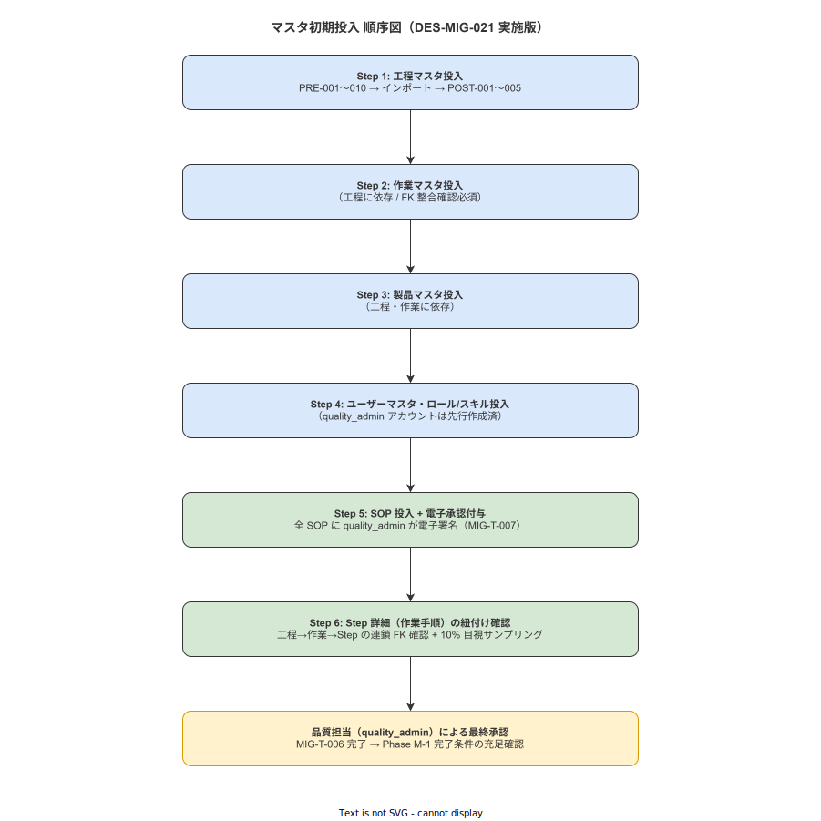

# 02 マスタ初期投入実施計画

本章の責務は、本システムを導入初日から業務利用可能な状態にするために必要なマスタデータの初期投入を実施計画として確定することである。概要設計（DES-MIG-021〜040）が確定した GUI ウィザード方式・Excel テンプレート仕様・バリデーション規則・トランザクション設計を、実施手順・担当者・完了判定・失敗時対応の粒度まで具体化する。上流要件 INST-A2-f および MIG-014〜033 に対応する。

---

## 1. 本章の責務（INST-A2-f / MIG-014〜033 対応）

本節は、マスタ初期投入実施計画の適用範囲・前提条件・完了定義を確定する。

### 1-1. 適用範囲

本計画は以下の全エンティティのマスタ初期投入を対象とする。

| エンティティ | テーブル名 | 投入必須/任意 |
|---|---|---|
| 工程マスタ | processes | 必須 |
| 作業マスタ | operations | 必須 |
| 製品マスタ | products | 必須 |
| ユーザーマスタ | users | 必須 |
| ロール/スキルマスタ | user_roles / user_skills | 必須 |
| 設備・治具マスタ | equipments | 必須（FR-EV-013 に基づくポカヨケ運用の前提） |
| SOP マスタ | sops / sop_steps | 必須 |
| SOP ステップ詳細 | step_params | 必須 |

### 1-2. 前提条件

本計画の実施前に以下をすべて充足していること。

| 前提 ID | 内容 | 確認者 |
|---|---|---|
| PRE-PLAN-001 | 移行計画書（MIG-T-001）の quality_admin 承認が完了していること | quality_admin |
| PRE-PLAN-002 | PostgreSQL サーバーおよび master-api（ポート 8081）が稼働状態にあること（マスタ初期投入は master-api のみ稼働していれば実行可能であり、terminal-api の稼働は不要） | system_admin |
| PRE-PLAN-003 | GUI ウィザード（SCR-SET-001）のインストール・動作確認が完了していること | system_admin |
| PRE-PLAN-004 | master_admin アカウントの初回ログインが完了していること | system_admin |
| PRE-PLAN-005 | Excel テンプレートの配布が master_admin に完了していること | system_admin |

### 1-3. 完了定義

本計画は以下の全条件を充足した時点で完了と判定する。

| 完了条件 ID | 内容 | 確認者 |
|---|---|---|
| DONE-001 | 全 8 エンティティの GUI ウィザード投入が完了していること | master_admin |
| DONE-002 | PRE-001〜010 の自動バリデーションがクリティカルエラー 0 件であること | system_admin |
| DONE-003 | POST-001〜005 の投入後チェックが全件合格であること | system_admin |
| DONE-004 | 10% ランダムサンプリング目視確認（POST-003）が完了していること | quality_admin |
| DONE-005 | quality_admin の最終承認署名が取得されていること | quality_admin |
| DONE-006 | audit_logs テーブルへの投入完了ログが記録されていること | system_admin |

---

**本節で確定した方針**
- 本計画の適用範囲を工程・作業・製品・ユーザー・ロール/スキル・設備・SOP・ステップ詳細の 8 エンティティとすることを確定する。
- 本計画の完了判定は DONE-001〜006 の全 6 条件の充足を必要条件とすることを確定する。
- 前提条件 PRE-PLAN-001〜005 の充足なしに実施を開始することを対象外と判断する。

---

## 2. マスタ投入対象と投入順序（MIG-X-021〜022）

本節は、マスタデータの投入対象エンティティおよび投入順序を確定する。外部キー制約の依存関係を根拠として順序を強制する。

### 2-1. 投入順序の確定

**MIG-X-021**: マスタ初期投入は GUI 初期構築ウィザードのステップ強制進行型フローに従い、外部キー制約の依存関係順に実施する。（DES-MIG-021 対応）

投入順序は以下の通り確定する。

| 投入順序 | ステップ | 対象エンティティ | 依存する先行ステップ |
|---|---|---|---|
| 1 | Step 1 | 工程マスタ（processes） | なし（最上位エンティティ） |
| 2 | Step 2 | 作業マスタ（operations） | Step 1（process_id 参照） |
| 3 | Step 3 | 製品マスタ（products） | なし（工程と並列可） |
| 4 | Step 4 | ユーザーマスタ（users） | なし |
| 5 | Step 5 | ロール/スキルマスタ（user_roles / user_skills） | Step 4（user_id 参照） |
| 6 | Step 6 | 設備・治具マスタ（equipments） | なし（工程と並列可） |
| 7 | Step 7 | SOP マスタ（sops / sop_steps） | Step 1・Step 2・Step 6 |
| 8 | Step 8 | SOP ステップ詳細（step_params） | Step 7（sop_step_id 参照）・Step 6（required_scans の ref_id 解決） |

前ステップが未完了の状態で次ステップへの遷移を GUI ウィザードがシステム的に禁止する。ステップの順序変更・スキップは対象外と判断する。

**図 1: マスタ初期投入シーケンス（Step 1〜8）**

> 原本: [`img/fig_mig_master_loading_sequence.drawio`](img/fig_mig_master_loading_sequence.drawio)

### 2-2. 各マスタのデータソースと件数見積

**MIG-X-022**: 各マスタのデータソースおよび件数見積を以下の通り確定する。（DES-MIG-022 対応）

| ステップ | エンティティ | データソース | 標準件数見積 | 備考 |
|---|---|---|---|---|
| Step 1 | 工程マスタ | Excel テンプレート（本システム提供） | 5〜20 件 | 工場の工程数に依存 |
| Step 2 | 作業マスタ | Excel テンプレート（本システム提供） | 20〜100 件 | 1 工程あたり 3〜10 作業 |
| Step 3 | 製品マスタ | Excel テンプレート（旧 Excel 台帳からコピー可） | 10〜200 件 | 製品ラインナップ数に依存 |
| Step 4 | ユーザーマスタ | Excel テンプレート（人事名簿から転記） | 5〜100 名 | 全従業員（オペレーター含む）数に依存 |
| Step 5 | ロール/スキルマスタ | Excel テンプレート（スキルマップから転記） | ユーザー数 × 平均スキル数 | スキル登録は必須ではない工場もある |
| Step 6 | 設備・治具マスタ | Excel テンプレート（設備台帳から転記） | 10〜500 件 | scan_code / calibration_due_date 含む |
| Step 7 | SOP マスタ | Excel テンプレート（紙 SOP から電子化） | 10〜200 件 | 電子化工数が最大 |
| Step 8 | SOP ステップ詳細 | Excel テンプレート（SOP ステップ単位で記述） | SOP 件数 × 平均ステップ数 | 1 SOP あたり 3〜30 ステップ |

件数が 50,000 行を超える場合は、PRE-010 に基づき分割投入の手順を適用する。

---

**本節で確定した方針**
- 投入順序を外部キー依存関係に従い工程→作業→製品→ユーザー→ロール/スキル→設備→SOP→ステップ詳細の 8 ステップとすることを確定する。
- GUI ウィザードによるステップ強制進行型フローを採用し、前ステップ未完了時の次ステップ遷移を禁止することを確定する。
- 各マスタのデータソースを Excel テンプレートまたは旧システム CSV エクスポートとし、件数見積を本節の表の通り対応することを確定する。

---

## 3. Excel テンプレートの準備手順（MIG-X-023〜025）

本節は、マスタ初期投入に使用する Excel テンプレートの仕様・配布方法・記入規約を確定する。

### 3-1. Excel テンプレートの仕様

**MIG-X-023**: 各エンティティに対応する Excel テンプレート（.xlsx 形式）の仕様を以下の通り確定する。（DES-MIG-022 対応）

各テンプレートは以下の共通構成を持つ。

| シート名 | 内容 |
|---|---|
| データ入力シート | 1 行目：日本語ラベル（印刷用）、2 行目：システムフィールド名（グレー背景・変更禁止）、3 行目以降：入力データ行 |
| 記入例シート | 3〜5 件のサンプルデータ（削除不可、参照専用） |
| 注意事項シート | 必須項目一覧・禁止事項・文字コード・日付形式規定 |

テンプレートのファイル命名規則を以下の通り確定する。

| ステップ | ファイル名 |
|---|---|
| Step 1 | master_template_processes_v1.0.xlsx |
| Step 2 | master_template_operations_v1.0.xlsx |
| Step 3 | master_template_products_v1.0.xlsx |
| Step 4 | master_template_users_v1.0.xlsx |
| Step 5 | master_template_skills_v1.0.xlsx |
| Step 6 | master_template_equipments_v1.0.xlsx |
| Step 7 | master_template_sops_v1.0.xlsx |
| Step 8 | master_template_step_params_v1.0.xlsx |

Excel セルには以下のバリデーションルールを設定する。

| フィールド種別 | Excel バリデーション設定 |
|---|---|
| ロール列（users.role） | ドロップダウンリスト（operator / master_admin / quality_admin / system_admin / viewer / line_leader） |
| 日付列 | セル書式を日付型（YYYY-MM-DD）に固定 |
| 文字数制限列 | データ入力規則で最大文字数を設定 |
| 必須列 | セル背景を黄色に設定し必須であることを視覚的に示す |

### 3-2. テンプレート配布方法

**MIG-X-024**: Excel テンプレートの配布方法を以下の通り確定する。

| 配布先 | 配布方法 | 配布担当者 |
|---|---|---|
| master_admin | system_admin が直接ファイル転送（USB または社内ファイルサーバー共有フォルダ） | system_admin |
| quality_admin | system_admin が直接ファイル転送（同上） | system_admin |

配布時は以下を合わせて実施する。

1. テンプレートのバージョン番号（ファイル名に含む）を口頭で確認する。
2. 配布後にチェックサム（SHA-256）をテンプレート受領確認書に記録する。
3. テンプレートに不明点がある場合の問い合わせ先を system_admin の連絡先として明示する。

テンプレートのバージョン変更（仕様変更）が発生した場合、旧バージョンのテンプレートを使用したデータは受け付けない。system_admin は新バージョンのテンプレートを master_admin に再配布し、受領確認書を更新する。

### 3-3. 記入規約

**MIG-X-025**: Excel テンプレートの記入規約を以下の通り確定する。

**共通規約**

| 規約項目 | 規約内容 |
|---|---|
| 文字コード | UTF-8（BOM 付き可。BOM なし UTF-8 も可） |
| 日付形式 | YYYY-MM-DD 形式のみ使用（スラッシュ区切り等は警告対象） |
| 空欄の扱い | 必須列に空欄を設けることを禁止する。任意列は空欄可 |
| 改行文字 | 単一セル内に改行文字を含めることを禁止する（システムフィールドの破壊を招くため） |
| 先頭末尾空白 | 自動 trim されるが、記入者側でも除去を徹底する |
| 禁止文字 | カラム区切りに使用する可能性があるタブ文字・バックスラッシュのエスケープ文字の直接記入を禁止する |

**フィールド別制約（主要項目）**

| フィールド | 型 | 最大文字数 | 備考 |
|---|---|---|---|
| process_no | TEXT | 50 | 英数字・ハイフン・アンダースコアのみ。重複不可 |
| process_name | TEXT | 100 | 日本語可 |
| operation_no | TEXT | 50 | 工程内で重複不可 |
| operation_name | TEXT | 100 | 日本語可 |
| username | TEXT | 50 | 英数字・アンダースコアのみ。システム全体で重複不可 |
| display_name | TEXT | 100 | 日本語可 |
| hire_date | DATE | - | YYYY-MM-DD 形式必須 |
| sop_code | TEXT | 50 | 英数字・ハイフンのみ。重複不可 |
| sop_title | TEXT | 200 | 日本語可 |
| version | TEXT | 20 | セマンティックバージョン形式（例：1.0.0）必須 |
| equipment_code | TEXT | 50 | 英数字・ハイフンのみ。重複不可 |
| scan_code | TEXT | 100 | 重複不可。空欄時は照合対象外 |
| calibration_due_date | DATE | - | YYYY-MM-DD 形式必須 |

---

**本節で確定した方針**
- Excel テンプレートはデータ入力シート・記入例シート・注意事項シートの 3 シート構成とし、8 エンティティそれぞれにバージョン管理付きのテンプレートを提供することを確定する。
- テンプレートの配布は system_admin が master_admin・quality_admin に直接行い、配布時のチェックサム記録と受領確認書の取得を義務付けることを確定する。
- 必須列への空欄・改行文字の埋め込み・禁止文字の記入を禁止事項として確定する。

---

## 4. GUI 初期構築ウィザード操作手順（MIG-X-026〜030）

本節は、GUI 初期構築ウィザード（SCR-SET-001）の操作手順・各ステップの担当者・前提条件・完了判定を確定する。

### 4-1. ウィザード起動前の確認事項

**MIG-X-026**: ウィザード起動前に以下を system_admin が確認する。（DES-MIG-021 対応）

| 確認項目 | 内容 |
|---|---|
| DB 接続確認 | PostgreSQL への接続が正常であること |
| master-api 稼働確認 | `docker compose up -d master-api` で master-api（ポート 8081）が起動済みであり、ヘルスチェック（`GET http://localhost:8081/healthz`）が HTTP 200 を返すこと |
| バックアップ | ウィザード起動直前に PostgreSQL の空 DB スナップショットを取得していること |
| 実行環境 | master_admin ロールを持つアカウントでログイン済みであること |

### 4-2. Step 1: 接続設定

**MIG-X-027**: ウィザードの Step 1（接続設定）は以下の通り実施する。（DES-MIG-023 対応）

| 属性 | 内容 |
|---|---|
| 担当者 | system_admin |
| 操作内容 | PostgreSQL 接続設定（ホスト・ポート・データベース名・接続ユーザー・パスワード）の入力 |
| 前提条件 | PostgreSQL サーバーが起動済みであること |
| 完了判定 | 接続テストボタン押下後に「接続成功」メッセージが表示されること |
| 失敗時対応 | 接続失敗の場合は PostgreSQL サーバーの稼働状態・ファイアウォール設定・接続文字列を確認し、system_admin が修正する |

### 4-3. Step 2: 疎通確認

**MIG-X-028**: ウィザードの Step 2（疎通確認）は以下の通り実施する。（DES-MIG-024 対応）

| 属性 | 内容 |
|---|---|
| 担当者 | system_admin |
| 操作内容 | DB スキーマバージョン確認・必要テーブルの存在確認・書き込み権限の確認 |
| 前提条件 | Step 1 が完了済みであること |
| 完了判定 | スキーマバージョンチェック・テーブル存在確認・書き込みテストがすべて「OK」であること |
| 失敗時対応 | スキーマ不一致の場合はマイグレーションスクリプトを再実行する。権限不足の場合は PostgreSQL のロール設定を修正する |

### 4-4. Step 3〜8: フルシンク（各マスタ投入）

**MIG-X-029**: ウィザードの Step 3〜8（フルシンク）は各エンティティに対して以下の共通手順で実施する。（DES-MIG-025 対応）

| 手順番号 | 操作 | 担当者 |
|---|---|---|
| 手順 1 | Excel テンプレートを CSV 形式でエクスポートするか、そのまま .xlsx ファイルをアップロードする | master_admin |
| 手順 2 | ウィザードの「プレビュー」ボタンを押下し、バリデーション結果を確認する | master_admin |
| 手順 3 | クリティカルエラーが存在する場合は Excel テンプレートを修正して手順 1 から再実施する | master_admin |
| 手順 4 | 警告のみの場合は自動修正内容を確認し、問題なければ「インポート実行」ボタンを押下する | master_admin |
| 手順 5 | 投入完了メッセージを確認し、投入件数が期待値と一致することを確認する | master_admin |

各ステップの完了判定は以下の通り確定する。

| ステップ | 完了判定基準 |
|---|---|
| Step 3: フルシンク（工程マスタ） | processes テーブルの件数がテンプレートのデータ行数と一致すること |
| Step 4: フルシンク（作業マスタ） | operations テーブルの件数がテンプレートのデータ行数と一致すること |
| Step 5: フルシンク（製品マスタ） | products テーブルの件数がテンプレートのデータ行数と一致すること |
| Step 6: フルシンク（ユーザーマスタ） | users テーブルの件数がテンプレートのデータ行数と一致すること |
| Step 7: フルシンク（SOP マスタ） | sops / sop_steps テーブルの件数がテンプレートのデータ行数と一致すること |
| Step 8: フルシンク（設備マスタ） | equipments テーブルの件数がテンプレートのデータ行数と一致すること |

### 4-5. マスタ投入 API の確認（master-api 経由）

各マスタデータの投入は master-api（ポート 8081）の `/api/v1/master/*` エンドポイント経由で行う。GUI ウィザードはこれらのエンドポイントを内部的に呼び出す。terminal-api（ポート 8080）はマスタ投入 API を持たないため、投入作業中に terminal-api を起動している必要はない。

| 投入エンティティ | 使用エンドポイント（参考） |
|---|---|
| 工程マスタ | `POST /api/v1/master/processes` |
| 作業マスタ | `POST /api/v1/master/operations` |
| 製品マスタ | `POST /api/v1/master/products` |
| ユーザーマスタ | `POST /api/v1/master/users` |
| ロール/スキルマスタ | `POST /api/v1/master/user-roles`、`POST /api/v1/master/user-skills` |
| 設備・治具マスタ | `POST /api/v1/master/equipments` |
| SOP マスタ | `POST /api/v1/master/sops` |
| SOP ステップ詳細 | `POST /api/v1/master/step-params` |

### 4-6. Step 7: マッピング設定

**MIG-X-030**: ウィザードの Step 7（マッピング設定）は以下の通り実施する。（DES-MIG-028 対応）

マッピング設定は SOP ステップと設備・スキル要件の紐付けを GUI 上で視覚的に確認・修正するステップである。

| 属性 | 内容 |
|---|---|
| 担当者 | quality_admin（マッピング内容の確認・承認）・master_admin（システム操作） |
| 操作内容 | SOP ステップ一覧を画面に表示し、各ステップの required_scans（設備スキャン要件）・required_skills（スキル要件）の紐付けを確認する |
| 前提条件 | Step 3〜8 の全フルシンクが完了済みであること |
| 完了判定 | quality_admin が全 SOP のマッピング内容を確認し、「マッピング確認完了」ボタンを押下すること |

---

**本節で確定した方針**
- GUI ウィザードは Step 1（接続設定）→ Step 2（疎通確認）→ Step 3〜8（フルシンク）→ Step 7（マッピング設定）の順序で進行し、前ステップ未完了時の次ステップ遷移をシステム的に禁止することを確定する。
- 各フルシンクステップはプレビュー→クリティカルエラー確認→インポート実行の 3 段階フローに準拠することを確定する。
- マッピング設定ステップは quality_admin による目視確認と「マッピング確認完了」ボタン押下を必要条件として確定する。

---

## 5. 投入品質チェック手順（MIG-X-031〜033）

本節は、マスタ投入後に実施する品質チェックの手順・実施者・合否基準を確定する。

### 5-1. 自動バリデーション（PRE-001〜010）の実施

**MIG-X-031**: 投入前の自動バリデーション（PRE-001〜010）は以下の手順で実施する。（DES-MIG-032 対応）

PRE チェックは GUI ウィザードのプレビューフェーズで自動実行される。手動でのスキップは禁止する。

| チェック ID | チェック項目 | 判定種別 | 合否基準 |
|---|---|---|---|
| PRE-001 | ファイルエンコーディング確認（UTF-8） | クリティカル | UTF-8 以外のエンコーディングが 0 件であること |
| PRE-002 | 必須フィールド非 NULL | クリティカル | 必須列に空値が 0 件であること |
| PRE-003 | 外部キー参照整合性 | クリティカル | 参照先に存在しない FK 値が 0 件であること |
| PRE-004 | 重複キー検出（ファイル内） | クリティカル | ファイル内に重複キーが 0 件であること |
| PRE-005 | 重複キー検出（既存 DB との照合） | クリティカル | 既存 DB と重複するキーが 0 件であること |
| PRE-006 | 日付形式の妥当性 | クリティカル | YYYY-MM-DD 形式以外の日付値が 0 件であること |
| PRE-007 | ロール値の妥当性 | クリティカル | 規定ロール値以外のロール値が 0 件であること |
| PRE-008 | 文字数制限 | 警告 | 自動 trim 後に文字数超過 0 件であること |
| PRE-009 | 末尾空白・全角スペース | 警告 | 自動修正後に警告ログを記録すること |
| PRE-010 | ファイル行数の上限確認（50,000 行以下） | 警告 | 50,000 行超過時は分割手順に移行すること |

PRE-001〜007 のクリティカルエラーが 1 件でも存在する場合、GUI ウィザードは「インポート実行」ボタンを無効化し、master_admin に修正を要求する。

### 5-2. 投入後品質チェックの実施

**MIG-X-032**: 投入後品質チェック（POST-001〜005）は以下の手順で実施する。（DES-MIG-033 対応）

全フルシンクステップ完了後、system_admin が以下のバッチを手動で実行する。バッチコマンドは master-api のバッチ機能または管理 CLI を通じて実行する（terminal-api の稼働は不要）。

| チェック ID | チェック項目 | 実施方式 | 担当者 |
|---|---|---|---|
| POST-001 | 行数一致確認 | 自動（Rust バッチ） | system_admin |
| POST-002 | SOP ステップ数一致確認 | 自動（Rust バッチ） | system_admin |
| POST-003 | 10% ランダムサンプリング目視確認 | 自動生成リストを目視で確認 | quality_admin |
| POST-004 | ハッシュチェーン整合性確認 | 自動（Rust バッチ） | system_admin |
| POST-005 | 電子署名付与確認 | 自動（Rust バッチ） | system_admin |

POST-003 の実施手順を以下の通り確定する。

1. system_admin が「サンプリングリスト生成」バッチを実行し、全件の 10%（最低 5 件・最大 50 件）を PDF でダウンロードする。
2. quality_admin がサンプリングリストに記載された各マスタデータを画面上で確認し、Excel テンプレートの原本と突き合わせる。
3. 突き合わせ結果（確認件数・不一致件数）を確認記録フォームに入力する。
4. 不一致が 1 件でも発見された場合は、全件再確認に移行する（MIG-X-031 の全件再バリデーションを実施した後、再投入する）。

### 5-3. 品質担当の最終承認

**MIG-X-033**: 投入後品質チェックの全合格後、quality_admin が以下の手順で最終承認を行う。（DES-MIG-039 対応）

| 手順 | 内容 |
|---|---|
| 手順 1 | system_admin が POST-001〜005 の合格証明書（品質ゲート判定書）を quality_admin に提出する |
| 手順 2 | quality_admin が POST-003 の目視確認記録および品質ゲート判定書を確認する |
| 手順 3 | quality_admin がウィザード最終画面の「品質承認」ボタンを押下し、電子署名付きで承認を記録する |
| 手順 4 | 承認記録は audit_logs テーブルに action='MASTER_IMPORT_APPROVED' として格納される |

承認が取得できない場合は、マスタ投入を完了として扱わない。system_admin は不合格内容を修正し、全チェックを再実施する。

---

**本節で確定した方針**
- PRE-001〜007 のクリティカルエラーが 1 件でも存在する場合にインポート実行ボタンを無効化することを確定する。
- POST-003 の 10% サンプリング目視確認を必須工程として確定し、不一致 1 件でも全件再確認に移行することを確定する。
- quality_admin の電子署名付き最終承認なしにマスタ投入を完了として扱わないことを確定する。

---

## 6. 投入失敗時の対応（MIG-X-034〜035）

本節は、GUI ウィザードのいずれかのステップで投入失敗が発生した場合の対応手順を確定する。

### 6-1. クリティカルエラー発生時の再投入手順

**MIG-X-034**: クリティカルエラー（PRE-001〜007 のいずれか）が発生した場合の再投入手順を以下の通り確定する。

| 手順 | 内容 | 担当者 |
|---|---|---|
| 手順 1 | GUI ウィザードがエラー明細 CSV を自動生成する。エラー明細には行番号・列名・エラー内容・期待値が記載される | system_admin（確認） |
| 手順 2 | master_admin がエラー明細 CSV を参照し、Excel テンプレートの該当行を修正する | master_admin |
| 手順 3 | system_admin がエラー修正内容を確認する（修正が正しいことの確認） | system_admin |
| 手順 4 | 修正済み Excel テンプレートを使用して、失敗したステップから再実施する | master_admin |
| 手順 5 | 再実施後に PRE チェックが全件合格したことを確認する | system_admin |

再投入は最大 3 回まで実施する。3 回連続で失敗した場合は system_admin・quality_admin・master_admin の三者で原因調査会議を開催し、対策を講じてから再実施する。

トランザクションのロールバックにより部分投入は発生しない。ロールバック後は失敗した当該ステップのデータが 0 件の状態に戻ることを確認してから再投入を開始する。

### 6-2. ロールバック起動条件

**MIG-X-035**: 以下の条件を満たす場合、system_admin は即座にロールバックを実施する。

| ロールバック起動条件 | 内容 |
|---|---|
| RB-COND-001 | GUI ウィザードのコミットフェーズでシステムエラーが発生し、DB の状態が不整合になった場合 |
| RB-COND-002 | POST-001 の行数一致確認でファイルの有効行数と DB の INSERT 件数が不一致の場合 |
| RB-COND-003 | POST-004 のハッシュチェーン整合性チェックでエラーが検出された場合 |
| RB-COND-004 | POST-003 の目視確認で不一致が発見され、全件再確認を実施した結果もなお不一致が解消しない場合 |

ロールバックの具体的な実施手順は移行計画/07（ロールバック手順）を参照する。

ロールバック実施後は以下を記録する。

| 記録項目 | 記録先 |
|---|---|
| ロールバック実施日時 | audit_logs（action='MASTER_IMPORT_ROLLBACK'） |
| ロールバック実施者 | audit_logs（executed_by フィールド） |
| ロールバック起動条件 | 移行問題票（MIG-ISSUE-NNN 形式） |
| 次回再実施予定 | 移行問題票（resolution フィールド） |

---

**本節で確定した方針**
- クリティカルエラー発生時はエラー明細 CSV の参照による修正→再投入の手順を適用し、最大 3 回連続失敗時は三者会議を開催することを確定する。
- トランザクションロールバックにより部分投入が発生しないことを確定し、ロールバック後は当該ステップのデータ 0 件状態を確認してから再投入を開始することを確定する。
- RB-COND-001〜004 のいずれかに該当する場合は即座にロールバックを実施し、audit_logs への記録を義務付けることを確定する。

---

### 必須

| ドキュメント | 参照理由 |
|---|---|
| [../../90_業界分析/25_作業指示書とSOPの構造化・表現論.md](../../90_業界分析/25_作業指示書とSOPの構造化・表現論.md) | SOP マスタの必須フィールド定義・電子化品質基準の根拠 |
| [../../90_業界分析/06_品質管理とトレーサビリティ.md](../../90_業界分析/06_品質管理とトレーサビリティ.md) | マスタ投入後の ALCOA+ 整合性確保・監査証跡の根拠 |

### 関連

| ドキュメント | 参照理由 |
|---|---|
| [../../90_業界分析/19_電子チェックリストと手順遵守の科学.md](../../90_業界分析/19_電子チェックリストと手順遵守の科学.md) | GUI ウィザードのチェックリスト設計・手順強制進行の根拠 |
| [../../90_業界分析/22_規制別トレーサビリティ要件詳論.md](../../90_業界分析/22_規制別トレーサビリティ要件詳論.md) | 規制要件に基づくマスタデータ完全性確保の根拠 |

---

## 更新履歴

| バージョン | 日付 | 変更内容 | 担当者 |
|---|---|---|---|
| 0.1.0 | 2026-05-18 | 初版 | RyuheiKiso |
| 0.2.0 | 2026-05-18 | バックエンド2バイナリ分割対応：PRE-PLAN-002 を master-api 限定に更新、master-api 起動確認手順・投入 API エンドポイント一覧を追加 | RyuheiKiso |
