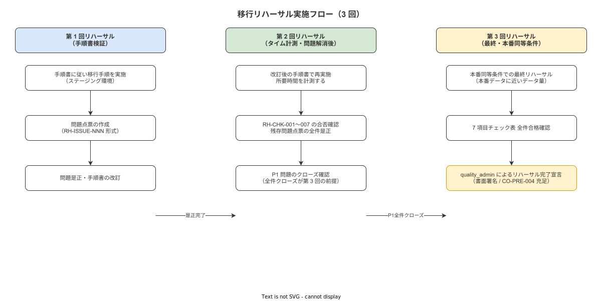

# 04 移行リハーサル実施計画

本章の責務は、本番カットオーバーを安全かつ確実に実行するための移行リハーサルを実施計画として確定することである。概要設計（DES-MIG-057〜058）が確定したリハーサルの位置づけ・実施仕様・合否判定基準を受けて、3 回実施のリハーサルシナリオ・合否基準・問題点票運用・完了宣言手続きを確定する。上流要件 INST-A2.5 および MIG-043〜046 に対応する。

---

## 1. 本章の責務（INST-A2.5 / MIG-043〜046 対応）

本節は、移行リハーサル実施計画の適用範囲・前提条件・完了定義を確定する。

### 1-1. 適用範囲

本計画は以下の実施活動を対象とする。

| 活動 | 内容 |
|---|---|
| リハーサル第 1 回 | 手順書通りの実施・問題点票作成 |
| リハーサル第 2 回 | 問題点票解消後の再実施・タイム計測 |
| リハーサル第 3 回 | 最終リハーサル（本番同等条件） |
| リハーサル合否判定 | 7 項目チェック表に基づく合否判定 |
| 問題点票運用 | 問題点票の作成・クローズ管理 |
| リハーサル完了宣言 | quality_admin による書面承認 |

### 1-2. 前提条件

本計画の実施前に以下をすべて充足していること。

| 前提 ID | 内容 | 確認者 |
|---|---|---|
| PRE-RH-001 | 移行計画/02（マスタ初期投入）が完了済みで quality_admin の承認を取得していること | quality_admin |
| PRE-RH-002 | 移行計画/03（ロット履歴引継ぎ）の選択（ケース A/B）が quality_admin により確定していること | quality_admin |
| PRE-RH-003 | カットオーバーチェックリスト（CL-001〜010）の書式が確定済みであること | system_admin |
| PRE-RH-004 | リハーサル参加オペレーター（各工程代表者 3〜5 名）が特定済みであること | quality_admin |
| PRE-RH-005 | リハーサル対象 SOP（3 件）が選定済みで「公開（published）」ステータスになっていること | quality_admin |
| PRE-RH-006 | リハーサル用テスト環境（本番 DB を使用しないステージング環境）が準備済みであること | system_admin |

### 1-3. リハーサル実施タイムライン

| イベント | 時期 |
|---|---|
| リハーサル第 1 回 | 本番カットオーバー予定日の 4 週間前（Phase M-2 開始の 2 週間前） |
| リハーサル第 2 回 | 第 1 回から 1 週間後 |
| リハーサル第 3 回 | 本番カットオーバー予定日の 2 週間前（Phase M-2 開始直前）（DES-MIG-057 対応） |
| リハーサル完了宣言 | 第 3 回合格後、同日中 |

### 1-4. 完了定義

| 完了条件 ID | 内容 | 確認者 |
|---|---|---|
| DONE-RH-001 | 第 3 回リハーサルが 7 項目チェック表の全件合格で完了していること | quality_admin |
| DONE-RH-002 | 全問題点票（P1 必須対処）がクローズ済みであること | system_admin |
| DONE-RH-003 | quality_admin が「リハーサル完了宣言書」に署名済みであること | quality_admin |
| DONE-RH-004 | リハーサル結果報告書が移行計画書（MIG-T-001）に添付済みであること | quality_admin |

---

**本節で確定した方針**
- 本計画の対象を 3 回のリハーサル実施・合否判定・問題点票運用・完了宣言の 4 活動とすることを確定する。
- 第 3 回リハーサルは本番カットオーバー予定日の 2 週間前に実施することを確定する。
- 前提条件 PRE-RH-001〜006 の充足なしに第 1 回リハーサルを開始することを対象外と判断する。

---

## 2. リハーサルの位置づけと GAMP 5 OQ 対応（MIG-RH-001〜003）

本節は、本リハーサルの目的・GAMP 5 OQ との対応関係・3 回実施の根拠を確定する。

### 2-1. リハーサルの目的

**MIG-RH-001**: 移行リハーサルの目的を以下の通り確定する。（DES-MIG-057 対応）

| 目的 | 詳細 |
|---|---|
| 移行手順の検証 | カットオーバーチェックリスト（CL-001〜010）の全 10 項目を手順通りに実行し、手順書の誤記・漏れ・曖昧さを洗い出す |
| 所要時間計測 | 各チェック項目の実施時間・全体所要時間を計測し、本番の実施可能性を検証する |
| 問題点票の洗い出しと解消 | 発見した問題を問題点票に記録し、本番カットオーバーまでに全 P1 問題を解消する |
| 担当者の技能確認 | system_admin・quality_admin・参加オペレーターが各自の役割を正確に実施できることを確認する |

### 2-2. GAMP 5 OQ との対応関係

**MIG-RH-002**: 本リハーサルは GAMP 5（Good Automated Manufacturing Practice）の OQ（Operational Qualification：運用適格性確認）に相当する実施活動として位置づける。

| GAMP 5 OQ の概念 | 本リハーサルでの対応 |
|---|---|
| 運用仕様書（OS）の実証 | カットオーバーチェックリスト（CL-001〜010）をリハーサルシナリオとして使用する |
| テスト実行と記録 | リハーサル実施記録（実施時刻・担当者・判定結果）を紙または電子フォームで記録する |
| 逸脱の記録と対処 | 発見された問題を問題点票として記録し、対策・完了確認を管理する |
| 適格性確認の承認 | quality_admin による第 3 回リハーサルの書面承認をもって OQ 相当の適格性確認とする |

製造 IT システムの導入においては OQ 相当の検証を実施することが GMP（Good Manufacturing Practice）準拠の推奨事項である。本リハーサルはその推奨事項に準拠した活動として設計する。

### 2-3. 3 回実施の根拠

**MIG-RH-003**: リハーサルを 3 回実施する根拠を以下の通り確定する。

| 回次 | 目的 | 根拠 |
|---|---|---|
| 第 1 回 | 初回実施による問題点の洗い出し | 手順書通りに実施するだけでは発見できない手順間の依存関係の問題・担当者間の連携の問題が第 1 回で露見する |
| 第 2 回 | 問題点票解消後の改善確認 | 第 1 回で発見した P1 問題を解消した手順書を使い、改善効果と所要時間の短縮を計測する |
| 第 3 回 | 本番同等条件での最終確認 | 本番と同等の条件（参加者・対象 SOP・環境）で実施し、品質合格基準を全件達成することを確認する |

1 回のみのリハーサルでは問題発見→解消→確認のサイクルを経ないため、本番での手順失敗リスクが残存する。2 回では第 2 回の改善確認後に追加問題が発生した場合に対処する機会がない。3 回の構成が問題発見・解消・最終確認のサイクルを完結させる最小回数として確定する。

---

**本節で確定した方針**
- リハーサルの目的を移行手順の検証・所要時間計測・問題点票解消の 3 点として確定する。
- リハーサルを GAMP 5 OQ 相当の実施活動として位置づけ、quality_admin の書面承認で適格性確認とすることを確定する。
- 3 回実施を問題発見・解消・最終確認サイクルを完結させる最小回数として確定する。

---

## 3. リハーサルシナリオ（MIG-RH-004〜012）

本節は、第 1 回・第 2 回・第 3 回リハーサルのシナリオ・参加者・実施手順・記録方法を確定する。

**図 1: リハーサル実施フロー（第 1〜3 回）**

> 原本: [`img/fig_mig_rehearsal_flow.drawio`](img/fig_mig_rehearsal_flow.drawio)

### 3-1. リハーサル共通設定

リハーサルの共通設定を以下の通り確定する。

| 属性 | 設定値 |
|---|---|
| 実施環境 | ステージング環境（本番 DB を使用しない。本番と同一の Rust/axum バックエンド・PostgreSQL 構成） |
| 対象 SOP | 最もよく使用される SOP 3 件（quality_admin が選定・事前に公開済み） |
| 参加オペレーター | 各工程代表者 3〜5 名（全工程からそれぞれ 1 名） |
| 参加管理者 | quality_admin・system_admin（必須参加） |
| 記録方法 | リハーサル実施記録フォーム（紙）に、各チェック項目の開始時刻・終了時刻・判定結果・担当者サインを記入する |
| タイム計測 | system_admin がストップウォッチで全体所要時間を計測する |

### 3-2. 第 1 回リハーサル: 手順書通りの実施・問題点票作成

**MIG-RH-004**: 第 1 回リハーサルの目的・実施手順を以下の通り確定する。

目的: カットオーバーチェックリスト（CL-001〜010）の全項目を手順書通りに実施し、問題点を洗い出す。所要時間の計測は行うが、合否判定は実施しない。

| 手順 | 内容 | 担当者 |
|---|---|---|
| RH1-001 | 参加者全員にリハーサルシナリオ説明会を実施する（所要 30 分） | quality_admin |
| RH1-002 | ステージング環境のデータを初期化する（マスタデータは本番相当のデータを使用） | system_admin |
| RH1-003 | CL-001〜CL-010 の各チェック項目を順番に実施し、実施記録フォームに記入する | 各担当者 |
| RH1-004 | 各チェック項目の実施時刻（開始・終了）を記録し、全体所要時間を計測する | system_admin |
| RH1-005 | 手順通りに進められなかった項目・疑問点・改善提案を問題点票に記録する | 全参加者 |
| RH1-006 | 終了後に参加者全員でブリーフィングを実施し、問題点票を集約する（所要 30 分） | quality_admin |

**MIG-RH-005**: 第 1 回リハーサルの完了判定を以下の通り確定する。

| 完了条件 | 内容 |
|---|---|
| RH1-DONE-001 | CL-001〜010 の全 10 項目について実施記録フォームが記入済みであること |
| RH1-DONE-002 | 問題点票が集約・番号付けされていること |
| RH1-DONE-003 | 全問題点票に P1/P2/P3 の優先度が付与されていること |

**MIG-RH-006**: 第 1 回リハーサル後の対応を以下の通り確定する。

| 優先度 | 問題の種類 | 対処期限 |
|---|---|---|
| P1（必須対処） | 重大バグ・手順の不備・チェック項目の不達成 | 第 2 回リハーサルまでに必ず解消する |
| P2（推奨対処） | 操作の不便さ・所要時間の超過（軽微） | 第 2 回リハーサルまでに解消することを目指す |
| P3（記録のみ） | 軽微な UI の改善提案 | 詳細設計フェーズの改善候補として記録する |

P1 問題の件数と内容を system_admin が quality_admin に報告し、解消計画を確定する。

### 3-3. 第 2 回リハーサル: 問題点票解消後の再実施・タイム計測

**MIG-RH-007**: 第 2 回リハーサルの目的・実施手順を以下の通り確定する。

目的: 第 1 回で発見した P1・P2 問題の解消を確認し、改善後の手順書で所要時間を計測する。合否判定チェック表（7 項目）を初めて適用する。

| 手順 | 内順 | 担当者 |
|---|---|---|
| RH2-001 | P1 問題が全件解消済みであることを system_admin が確認する | system_admin |
| RH2-002 | 改善後の手順書・チェックリストを参加者に配布する | quality_admin |
| RH2-003 | ステージング環境のデータを初期化する | system_admin |
| RH2-004 | CL-001〜CL-010 の各チェック項目を順番に実施し、実施記録フォームに記入する | 各担当者 |
| RH2-005 | 全体所要時間を計測する（目標: 2 時間以内） | system_admin |
| RH2-006 | 合否判定チェック表（7 項目）に基づき合否を判定する | quality_admin |
| RH2-007 | 新たに発見された問題を問題点票に追加する | 全参加者 |

**MIG-RH-008**: 第 2 回リハーサルの完了判定を以下の通り確定する。

| 完了条件 | 内容 |
|---|---|
| RH2-DONE-001 | 第 1 回からの P1 問題が全件クローズ済みであること |
| RH2-DONE-002 | CL-001〜010 の全 10 項目について実施記録フォームが記入済みであること |
| RH2-DONE-003 | 合否判定チェック表（7 項目）への回答が完了していること |

**MIG-RH-009**: 第 2 回リハーサルの合否結果に応じた対応を以下の通り確定する。

| 合否結果 | 対応 |
|---|---|
| 7 項目全件合格 | 第 3 回リハーサルへ進む |
| 1 項目以上不合格 | 不合格項目の問題を P1 として問題点票に追加し、解消後に第 3 回へ進む |
| 所要時間が 2 時間超過 | 超過要因を問題点票（P1）に記録し、手順の効率化を図った上で第 3 回へ進む |

### 3-4. 第 3 回リハーサル: 最終リハーサル（本番同等条件）

**MIG-RH-010**: 第 3 回リハーサルの目的・実施手順を以下の通り確定する。

目的: 本番カットオーバーと同等の条件（参加者・対象 SOP・環境・手順書）でリハーサルを実施し、合否判定チェック表（7 項目）を全件達成することを確認する。第 3 回の合格をもってリハーサル完了とする。

| 手順 | 内容 | 担当者 |
|---|---|---|
| RH3-001 | 全問題点票（P1）がクローズ済みであることを system_admin が確認する | system_admin |
| RH3-002 | 最終確定版の手順書・チェックリストを参加者に配布する | quality_admin |
| RH3-003 | ステージング環境のデータを本番相当の最新マスタデータで初期化する | system_admin |
| RH3-004 | 本番カットオーバーと同一の時間帯（土曜日の午前中等）にリハーサルを開始する | quality_admin |
| RH3-005 | CL-001〜CL-010 の各チェック項目を順番に実施し、実施記録フォームに記入する | 各担当者 |
| RH3-006 | 全体所要時間を計測する（目標: 2 時間以内） | system_admin |
| RH3-007 | 合否判定チェック表（7 項目）に基づき合否を判定する | quality_admin |
| RH3-008 | 全件合格の場合は MIG-RH-020 のリハーサル完了宣言を実施する | quality_admin |
| RH3-009 | 不合格項目がある場合は問題点票に記録し、対策後に quality_admin が追加リハーサルを判断する | quality_admin |

**MIG-RH-011**: 第 3 回リハーサルにおける本番同等条件の定義を以下の通り確定する。

| 条件項目 | 本番同等の条件 |
|---|---|
| 参加者 | 本番カットオーバーに参加する全担当者（quality_admin・system_admin・オペレーター代表者）が全員参加 |
| 対象 SOP | 本番カットオーバーの移行対象と同一の SOP（最終確定版） |
| 手順書 | 本番カットオーバーで使用する最終確定版の手順書・チェックリスト |
| 環境 | ステージング環境（DB スキーマ・設定は本番相当） |
| 時間帯 | 本番カットオーバーと同一の時間帯での実施 |
| バックアップ | カットオーバー前バックアップの取得手順を含む |

**MIG-RH-012**: 第 3 回リハーサルが不合格となった場合の対応を以下の通り確定する。

| 不合格要因 | 対応 |
|---|---|
| チェック項目の未達成 | 不合格項目の問題を P1 として問題点票に記録し、解消後に quality_admin が追加リハーサルの実施を判断する |
| 所要時間超過（2 時間超） | 超過要因の問題を P1 として記録し、手順の効率化を行った上で追加リハーサルを実施する |
| 参加者の役割不明確 | 担当者への追加訓練を実施した上で追加リハーサルを実施する |

追加リハーサルの実施回数は quality_admin が判断する。追加リハーサルでも不合格が継続する場合は、本番カットオーバーを延期し、system_admin・quality_admin が根本原因分析を実施する。

---

**本節で確定した方針**
- 第 1 回・第 2 回・第 3 回の各リハーサルシナリオを本節の手順通りに実施することを確定する。
- 第 3 回リハーサルは本番同等条件（参加者・SOP・手順書・環境・時間帯）で実施することを確定する。
- 第 3 回リハーサル不合格時は追加リハーサルを実施し、本番カットオーバーの延期を quality_admin が判断することを確定する。

---

## 4. リハーサル合否基準（MIG-RH-013〜016）

本節は、リハーサルの合否を判定する 7 項目チェック表・全件合格条件・判定記録方法を確定する。

### 4-1. 7 項目チェック表

**MIG-RH-013**: リハーサルの合否を判定する 7 項目チェック表を以下の通り確定する。（DES-MIG-058 対応）

| チェック ID | チェック項目 | 合格基準 | 確認者 |
|---|---|---|---|
| RH-CHK-001 | 所要時間 | CL-001〜010 の全項目を 2 時間以内に完了すること | system_admin（タイム計測） |
| RH-CHK-002 | エラー率 | リハーサル中のシステム操作エラー（スキップ・強制終了・入力ミス）が全操作件数の 2% 未満であること | system_admin（エラーログ確認） |
| RH-CHK-003 | 担当者役割の確認 | CL-001〜010 の全項目について、規定担当者が規定操作を実施できることを確認していること | quality_admin |
| RH-CHK-004 | バックアップ確認 | CL-007（バックアップ取得確認）の手順を正常に完了し、リストア手順の疎通確認が成功していること | system_admin |
| RH-CHK-005 | テスト作業実行確認 | CL-005（テスト作業実行確認）において、テスト用ロットで 1 件の作業をエンドツーエンドで実行し、証跡記録が正常に生成されていること | quality_admin + system_admin |
| RH-CHK-006 | チェックリスト全項目完了 | CL-001〜010 の全 10 項目について合格判定（「確認済」チェック）が得られていること | quality_admin |
| RH-CHK-007 | P1 問題点票ゼロ | リハーサル中に新たな P1 問題点票が発生していないこと（または発生した P1 がリハーサル当日中にクローズされていること） | system_admin |

**MIG-RH-014**: 7 項目チェック表の記録形式を以下の通り確定する。

| 記録フィールド | 内容 |
|---|---|
| リハーサル回次 | 第 1 回 / 第 2 回 / 第 3 回 |
| 実施日時 | YYYY-MM-DD HH:MM〜HH:MM |
| 参加者一覧 | 全参加者の氏名・役割 |
| 各 RH-CHK-001〜007 の判定結果 | 合格 / 不合格 |
| 不合格項目の問題内容 | 具体的な問題点（不合格の場合のみ） |
| 全体所要時間 | HH:MM |
| 判定者署名 | quality_admin の署名 |
| 判定日時 | YYYY-MM-DD HH:MM |

### 4-2. 全件合格が第 3 回完了条件

**MIG-RH-015**: リハーサルの最終合格条件を以下の通り確定する。

| 条件 | 内容 |
|---|---|
| 必要条件 | RH-CHK-001〜007 の全 7 項目が「合格」であること |
| 充足タイミング | 第 3 回リハーサルの実施完了時 |
| 例外 | 例外なし。7 項目中 1 項目でも不合格の場合は第 3 回を合格とはみなさない |

第 2 回リハーサルで 7 項目全件合格を達成した場合であっても、第 3 回リハーサルの実施を省略することを禁止する。第 3 回は本番同等条件での最終確認として必須の実施活動である。

### 4-3. 合否判定の記録と保管

**MIG-RH-016**: リハーサル合否判定の記録・保管を以下の通り確定する。

| 記録 | 保管先 | 保管者 |
|---|---|---|
| 第 1 回〜第 3 回のリハーサル実施記録フォーム（紙） | 移行計画書（MIG-T-001）の付属書として綴じ込む | quality_admin |
| 7 項目チェック表（電子版） | 移行計画ドキュメント管理フォルダに格納する | quality_admin |
| 問題点票一覧（Excel） | 移行計画ドキュメント管理フォルダに格納する | system_admin |
| リハーサル結果報告書（PDF） | 移行計画書（MIG-T-001）の付属書として綴じ込む | quality_admin |

---

**本節で確定した方針**
- リハーサル合否判定に使用する 7 項目チェック表（RH-CHK-001〜007）の内容を本節の表の通り確定する。
- RH-CHK-001〜007 の全 7 項目合格を第 3 回リハーサル完了条件として確定する。
- 第 2 回で全件合格を達成した場合でも第 3 回の実施省略を禁止することを確定する。

---

## 5. リハーサル問題点票の運用（MIG-RH-017〜019）

本節は、リハーサルで発見された問題の記録・管理・クローズ手続きを確定する。

### 5-1. 問題点票テンプレート

**MIG-RH-017**: リハーサル問題点票のテンプレートを以下の通り確定する。

| フィールド | 内容 |
|---|---|
| 問題点票 ID | RH-ISSUE-NNN 形式（NNN は通し番号。リハーサル全 3 回を通じた通し番号） |
| 発見リハーサル回次 | 第 1 回 / 第 2 回 / 第 3 回 |
| 発見日時 | YYYY-MM-DD HH:MM |
| 現象 | 発生した問題の具体的な事象（例：「CL-003 で SOP 公開ステータスの確認手順が不明確だった」） |
| 発生ステップ | 該当するカットオーバーチェックリストの項目 ID（例：CL-003） |
| 優先度 | P1（必須対処）/ P2（推奨対処）/ P3（記録のみ） |
| 原因 | 現象の根本原因（手順書の記述不足・システムバグ・担当者スキル不足等） |
| 対策 | 対策の具体的な内容 |
| 担当者 | 対策実施者の username |
| 対処期限 | YYYY-MM-DD |
| クローズ確認者 | 対策完了を確認した者の username |
| クローズ日時 | YYYY-MM-DD HH:MM |
| ステータス | Open / In Progress / Closed |

問題点票は Excel ファイル（RH_ISSUES.xlsx）で管理する。system_admin が管理責任者として最新状態を維持する。

### 5-2. 問題点票の起票・クローズ手続き

**MIG-RH-018**: 問題点票の起票・クローズ手続きを以下の通り確定する。

**起票手続き**

1. 問題を発見した参加者（quality_admin / system_admin / オペレーター）がリハーサル中または終了後のブリーフィング中に問題の内容を quality_admin に口頭で報告する。
2. quality_admin が問題の内容・優先度・対策案を問題点票に記入する。
3. 対処担当者・対処期限を確定し、担当者に通知する。
4. system_admin が RH_ISSUES.xlsx に問題点票を追加する。

**クローズ手続き**

1. 対処担当者が対策を実施し、実施内容を問題点票に記入する。
2. system_admin が対策内容を確認し、問題が解消されていることを確認する（技術確認）。
3. quality_admin が問題の解消を最終確認し、問題点票のステータスを「Closed」に変更する。
4. クローズ確認者として quality_admin の username を問題点票に記入する。

### 5-3. 全件クローズが本番移行の前提条件

**MIG-RH-019**: P1 問題点票の全件クローズを本番カットオーバーの前提条件として以下の通り確定する。

| 前提条件 | 内容 |
|---|---|
| 本番カットオーバー開始前の必須要件 | RH-ISSUE のうち優先度 P1 に分類される全問題点票がステータス「Closed」になっていること |
| 確認者 | system_admin が一覧の全件クローズを確認し、quality_admin に報告する |
| 記録 | P1 全件クローズの確認記録を「問題点票クローズ確認書」として移行計画書に添付する |

P2 問題点票については本番カットオーバーまでのクローズを目指すが、未解消であっても本番カットオーバーの実施を禁止しない。P2 未解消のまま本番カットオーバーを実施する場合は、quality_admin が未解消 P2 の内容と影響評価を移行計画書に記録する。

P3 問題点票については本番カットオーバーの判断に影響しない。詳細設計フェーズの改善候補として管理する。

---

**本節で確定した方針**
- 問題点票を RH-ISSUE-NNN 形式で管理し、RH_ISSUES.xlsx で system_admin が管理責任を持つことを確定する。
- P1 問題点票の全件クローズを本番カットオーバー開始の前提条件として確定する。
- P2 問題点票未解消での本番カットオーバー実施を許容するが、quality_admin による影響評価の記録を義務付けることを確定する。

---

## 6. リハーサル完了宣言（MIG-RH-020）

本節は、リハーサル完了宣言の手続き・書面の形式・宣言後の次工程への接続を確定する。

### 6-1. quality_admin による書面承認

**MIG-RH-020**: リハーサル完了宣言の手続きを以下の通り確定する。

**完了宣言の前提条件確認**

quality_admin は以下を全件確認してから完了宣言書に署名する。

| 確認項目 | 内容 |
|---|---|
| 確認-001 | 第 3 回リハーサルの 7 項目チェック表（RH-CHK-001〜007）が全件合格であること |
| 確認-002 | P1 問題点票が全件クローズ済みであること |
| 確認-003 | リハーサル実施記録フォーム（第 1 回〜第 3 回）が全件記入済みであること |
| 確認-004 | リハーサル結果報告書の内容が事実と相違ないこと |

**リハーサル完了宣言書の形式**

| フィールド | 内容 |
|---|---|
| 宣言書タイトル | 「移行リハーサル完了宣言書」 |
| リハーサル実施期間 | 第 1 回〜第 3 回の実施日時 |
| 第 3 回リハーサル合否 | 「合格（7 項目全件合格）」と記載 |
| 全体所要時間（第 3 回） | 実測値（HH:MM） |
| P1 問題点票のクローズ状況 | 「全 N 件クローズ済み」 |
| 次工程への接続 | 「本宣言をもって Phase M-2（並行運用）の開始条件を満たす」旨の記載 |
| 署名欄 | quality_admin の氏名・署名・日付 |
| 承認欄 | system_admin の確認署名・日付 |

**宣言後の次工程接続**

リハーサル完了宣言書の署名完了をもって、Phase M-2（並行運用）の開始条件「CO-PRE-004 カットオーバーリハーサルが完了済みであること」を充足したものとして扱う。移行計画/05（並行運用実施計画）の§2（並行運用の開始条件）に接続する。

リハーサル完了宣言書は移行計画書（MIG-T-001）の付属書として綴じ込む。電子ファイルは移行計画ドキュメント管理フォルダに PDF 形式で保管する。

---

**本節で確定した方針**
- リハーサル完了宣言は quality_admin による「移行リハーサル完了宣言書」への署名をもって成立することを確定する。
- リハーサル完了宣言をもって Phase M-2（並行運用）開始条件の CO-PRE-004 を充足したものと扱うことを確定する。
- 完了宣言書は移行計画書の付属書として紙・電子の両形式で保管することを確定する。

---

### 必須

| ドキュメント | 参照理由 |
|---|---|
| [../../90_業界分析/19_電子チェックリストと手順遵守の科学.md](../../90_業界分析/19_電子チェックリストと手順遵守の科学.md) | リハーサルチェックリスト設計・手順遵守確認の根拠 |
| [../../90_業界分析/23_作業訓練設計とインストラクショナルデザイン.md](../../90_業界分析/23_作業訓練設計とインストラクショナルデザイン.md) | リハーサル参加者の役割訓練・スキル確認設計の根拠 |

### 関連

| ドキュメント | 参照理由 |
|---|---|
| [../../90_業界分析/06_品質管理とトレーサビリティ.md](../../90_業界分析/06_品質管理とトレーサビリティ.md) | GAMP 5 OQ 相当の検証記録・証跡完全性の根拠 |
| [../../90_業界分析/28_不適合と手順改訂のフィードバックループ.md](../../90_業界分析/28_不適合と手順改訂のフィードバックループ.md) | 問題点票管理と手順改訂フィードバックループの根拠 |

---

## 更新履歴

| バージョン | 日付 | 変更内容 | 担当者 |
|---|---|---|---|
| 0.1.0 | 2026-05-18 | 初版 | RyuheiKiso |
