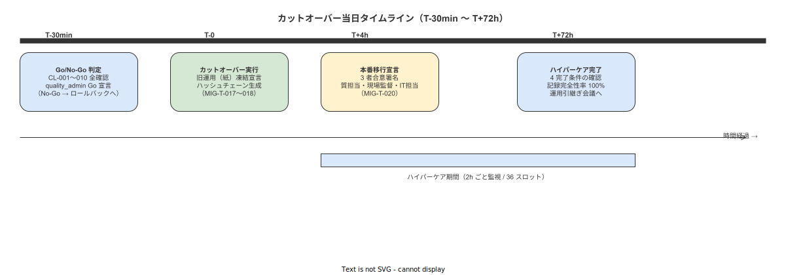

# 06 カットオーバー実施計画

本章の責務は、Phase M-3（カットオーバー）を安全かつ確実に実行するための実施計画を確定することである。04_概要設計/09_移行方式設計/04_カットオーバー手順とリハーサル設計.md の DES-MIG-051〜055 を実施計画版に展開し、カットオーバー実施日時の決定・前提条件・チェックリスト・Go/No-Go 判定プロセス・3 段階実施・72h ハイパーケア連携・ロールバック参照を確定する。本章で確定する命題（MIG-X-066〜072）は IPA 共通フレーム 2013 の INST-A2-d（移行実施）および INST-A4-i（検収）に対応する。

---

## 1. 本章の責務

### 1-1. IPA 共通フレーム 2013 との対応

| IPA プロセス | 本章との対応 |
|---|---|
| INST-A2-d（移行実施） | §3（カットオーバー前提条件）・§4（チェックリスト）・§5（Go/No-Go 判定）・§6（3 段階実施） |
| INST-A4-i（検収） | §6（移行完了 4 条件の確認）・§7（72h ハイパーケア連携）・§9（カットオーバー実施記録） |

### 1-2. 本章で確定する命題

| 命題 ID | 命題要旨 | 記述節 |
|---|---|---|
| MIG-X-066 | カットオーバー実施日時の決定基準を確定する | §2 |
| MIG-X-067 | カットオーバー前提条件（CO-PRE-001〜005）を確定する | §3 |
| MIG-X-068 | カットオーバーチェックリスト 10 項目（CL-001〜010）を実施計画版として確定する | §4 |
| MIG-X-069 | T-30 分 Go/No-Go 判定プロセスを確定する | §5 |
| MIG-X-070 | 3 段階カットオーバー実施（Phase M-2→M-3 移行・旧運用凍結・ハッシュチェーン生成）を確定する | §6 |
| MIG-X-071 | 本番移行宣言手順を確定する | §6 |
| MIG-X-072 | 72h ハイパーケアとの連携手順を確定する | §7 |

---

**本節で確定した方針**
- 本章が IPA INST-A2-d（移行実施）と INST-A4-i（検収）をカバーし、DES-MIG-051〜055 を実施計画版に展開することを確定する。
- MIG-X-066〜072 の 7 命題を確定し、カットオーバー実施の全プロセスを本章で権威的に管理することを確定する。
- 本章は移行計画/01 §3 の Phase M-3 定義を下位展開したものとして機能し、移行計画/07（ロールバック）および導入手順/10（ハイパーケア）と連携することを確定する。

---

## 2. カットオーバー実施日時の決定

本節ではカットオーバー実施日時の決定基準と所要時間見積もりを確定する。（MIG-X-066 対応）

### 2-1. 実施日の選定基準

**MIG-X-066**: カットオーバー実施日時の決定基準を確定する。（DES-MIG-052 対応・CON-MIG-X-009 準拠）

| 選定区分 | 内容 | 推奨順位 |
|---|---|---|
| 第 1 推奨：週末（土曜日） | 生産ラインが停止しており、カットオーバー所要時間 2〜4 時間への余裕がある。週明け月曜日の生産開始前に本番稼働の安定を確認できる | 最優先 |
| 第 2 推奨：計画停止日（設備メンテナンス日・工場休暇日） | 事前に生産停止が確定しているため、カットオーバー実施の予測可能性が高い | 次点 |
| 禁止：平日（生産中） | 生産ラインが稼働中のカットオーバー実施は禁止する。CON-MIG-X-009 および D-MIG-X-010 の規定に従い、移行フリーズ期間中の平日カットオーバーは対象外と判断する | 実施禁止 |

実施日は quality_admin が Phase M-2 開始時（MIG-T-011 直後）に確定し、全作業員への事前通知（CO-PRE-005: 24 時間前通知）のスケジュールを設定する。

### 2-2. 所要時間見積もり

**MIG-X-066（続）**: カットオーバー所要時間を 2〜4 時間と確定する。（DES-MIG-052 対応）

| 工程 | 所要時間（目安） | 担当者 |
|---|---|---|
| T-30 分：Go/No-Go 判定（§5 参照） | 30 分 | quality_admin・system_admin・現場監督 |
| T-0〜T+30 分：バックアップ取得（MIG-T-016） | 30 分 | system_admin |
| T+30〜T+60 分：ハッシュチェーン初期ブロック生成（MIG-T-017） | 30 分 | system_admin |
| T+60〜T+90 分：旧運用凍結宣言（MIG-T-018） | 30 分 | quality_admin |
| T+90〜T+120 分：全作業員アナウンス・本番移行宣言（MIG-T-019〜020） | 30〜90 分（アナウンス展開時間を含む） | 現場監督・quality_admin |
| 合計 | 2〜4 時間 | — |

所要時間が 4 時間を超過する場合は system_admin が quality_admin に報告し、翌日以降への延期判断を実施する。

### 2-3. カットオーバー実施日の決定フロー

カットオーバー実施日の確定は以下のプロセスで実施する。

| ステップ | 実施者 | タイミング |
|---|---|---|
| 1. 候補日の抽出 | quality_admin | Phase M-2 開始時（MIG-T-011 直後） |
| 2. 工場カレンダーとの照合 | quality_admin + 現場監督 | Phase M-2 開始後 1 週間以内 |
| 3. インフラ作業スケジュールとの調整 | quality_admin + system_admin | Phase M-2 開始後 1 週間以内 |
| 4. 実施日の確定・全作業員への通知 | quality_admin | Phase M-2 開始後 1 週間以内 |
| 5. 前日ブリーフィングの実施 | quality_admin | カットオーバー前日 |

---

**本節で確定した方針**
- カットオーバー実施日を週末（土曜日）または計画停止日に限定し、平日生産中の実施を禁止することを確定する（MIG-X-066 対応）。
- 所要時間見積もりを 2〜4 時間と確定し、4 時間超過時は quality_admin が延期判断を実施することを確定する。
- 実施日の確定は Phase M-2 開始後 1 週間以内に完了させることを確定する。

---

## 3. カットオーバー前提条件

本節ではカットオーバーを実施するための前提条件 5 件を確定する。（MIG-X-067 対応）

**MIG-X-067**: カットオーバー前提条件（CO-PRE-001〜005）を確定する。（DES-MIG-051 対応）

CO-PRE-001〜005 のいずれか 1 件でも未充足の場合はカットオーバーを即座に延期する。延期理由を移行記録に記録し、未充足条件の解消後に再度実施日を設定する。

| 条件番号 | 前提条件 | 確認方法 | 確認者 |
|---|---|---|---|
| CO-PRE-001 | Phase M-1（移行準備）の全タスク（MIG-T-001〜010）が完了済みであること | 移行計画/01 の Phase M-1 完了確認チェックリストの全項目に品質担当の署名があることを確認する | system_admin |
| CO-PRE-002 | Phase M-2（並行運用）の完了条件（DES-MIG-003 の 3 条件）を充足していること | MIG-T-015（Go/No-Go 判断）の結果記録に quality_admin の Go 署名があることを確認する | quality_admin |
| CO-PRE-003 | 未解決の重大バグ（Severity: Critical / High）が 0 件であること | バグ管理システムまたは移行記録の「未解決バグ一覧」を確認し、Critical / High の件数が 0 件であることを確認する | system_admin |
| CO-PRE-004 | カットオーバーリハーサルが完了済みであること | 移行計画/03 のリハーサル結果報告書が quality_admin の電子署名付きで存在することを確認する | quality_admin |
| CO-PRE-005 | カットオーバー実施日の 24 時間前に全作業員への事前通知が完了していること | 全作業員への通知記録（口頭確認の現場監督署名または掲示記録の写真）が存在することを確認する | quality_admin |

### 3-1. 前提条件未充足時の対応

| 未充足条件 | 対応手順 |
|---|---|
| CO-PRE-001 未充足（Phase M-1 未完了） | 未完了タスクを特定し、完了目標日を設定する。カットオーバー予定日を後ろにシフトする |
| CO-PRE-002 未充足（Phase M-2 完了条件未達） | 並行運用を継続し、週次レポートで進捗を確認する（最長 4 週間 = CON-MIG-X-007 の制約） |
| CO-PRE-003 未充足（重大バグ残存） | バグ修正を最優先で実施し、修正確認後に再度前提条件チェックを実施する |
| CO-PRE-004 未充足（リハーサル未完了） | リハーサルをカットオーバー予定日の 2 週前以前に実施し直す（移行計画/03 参照） |
| CO-PRE-005 未充足（事前通知未完了） | 即座に全作業員への通知を実施し、通知完了から 24 時間後以降にカットオーバー実施日を再設定する |

---

**本節で確定した方針**
- CO-PRE-001〜005 の 5 前提条件のいずれか 1 件でも未充足の場合はカットオーバーを即座に延期することを確定する（MIG-X-067 対応）。
- 前提条件の確認者を system_admin と quality_admin に割り当て、カットオーバー当日の T-30 分時点での確認完了を必須とすることを確定する（DES-MIG-051 対応）。
- 未充足条件ごとの対応手順を確定し、延期後の再実施手順を明確にすることを確定する。

---

## 4. カットオーバーチェックリスト 10 項目

本節ではカットオーバー実施時の 10 項目チェックリストを実施計画版として確定する。（MIG-X-068 対応）

**MIG-X-068**: カットオーバーチェックリスト 10 項目（CL-001〜010）を実施計画版として確定する。（DES-MIG-053 対応）

各チェック項目の確認完了は system_admin または quality_admin が確認記録（担当者 ID・確認日時・確認結果）として移行記録に記録する。

### 4-1. チェックリスト詳細

| チェック番号 | チェック項目 | 確認内容 | 担当者 | 合否基準 | 合否判定記録欄 |
|---|---|---|---|---|---|
| CL-001 | WiFi AP 設置確認 | 全生産エリアで WiFi 電波強度が -70 dBm 以上であること | system_admin | -70 dBm 以上 = 合格 / -71 dBm 以下 = 不合格（No-Go） | 担当者署名: _____ 確認日時: _____ 結果: 合格/不合格 |
| CL-002 | デバイス登録確認 | 全ハンディ端末がシステムにデバイス登録済みであること（MIG-T-009 の完了確認） | system_admin | 全台数のデバイス登録済み = 合格 / 1 台でも未登録 = 不合格 | 担当者署名: _____ 確認日時: _____ 結果: 合格/不合格 |
| CL-003 | 全 SOP 公開確認 | 移行対象の全 SOP が「公開（published）」ステータスになっていること（MIG-T-007 の完了確認） | quality_admin | 全 SOP が「公開」 = 合格 / 1 件でも「未公開/草稿」 = 不合格 | 担当者署名: _____ 確認日時: _____ 結果: 合格/不合格 |
| CL-004 | ユーザーアカウント作成確認 | 全作業員のユーザーアカウントが作成済みで初回ログインが完了していること（MIG-T-010 の完了確認） | system_admin | 全員のアカウント作成済み・初回ログイン完了 = 合格 / 1 名でも未完了 = 不合格 | 担当者署名: _____ 確認日時: _____ 結果: 合格/不合格 |
| CL-005 | テスト作業実行確認 | テスト用ロットで 1 件の作業をエンドツーエンドで実行し、work_events の証跡記録が正常に生成されることを確認済みであること | quality_admin + system_admin | 証跡記録が正常生成 = 合格 / エラー発生 = 不合格（No-Go） | 担当者署名（双方）: _____ 確認日時: _____ 結果: 合格/不合格 |
| CL-006 | ハッシュチェーン初期ブロック確認 | audit_logs の初期ブロックが生成済みで整合性チェックが正常であること（MIG-T-017 完了後確認） | system_admin | 整合性チェックバッチ結果「エラー 0 件」 = 合格 / エラーあり = 不合格 | 担当者署名: _____ 確認日時: _____ 結果: 合格/不合格 |
| CL-007 | バックアップ取得確認 | カットオーバー直前の PostgreSQL フルバックアップが完了し、リストア手順の疎通確認が済んでいること（MIG-T-016 完了後確認） | system_admin | バックアップファイル存在確認 + リストア疎通確認完了 = 合格 / いずれか未完了 = 不合格 | 担当者署名: _____ 確認日時: _____ 結果: 合格/不合格 |
| CL-008 | 旧システム凍結確認 | 紙記録用紙の配布停止・Excel ファイルの読み取り専用設定が完了していること（MIG-T-018 完了後確認） | quality_admin | 紙記録票配布停止完了 + Excel 読み取り専用設定完了 = 合格 / いずれか未完了 = 不合格 | 担当者署名: _____ 確認日時: _____ 結果: 合格/不合格 |
| CL-009 | 作業員へのアナウンス確認 | 本日のカットオーバー実施を全作業員に口頭・掲示で通知済みであること（MIG-T-019 完了後確認） | quality_admin | 全作業員への通知完了記録あり = 合格 / 通知記録なし = 不合格 | 担当者署名: _____ 確認日時: _____ 結果: 合格/不合格 |
| CL-010 | Go/No-Go 最終決定 | quality_admin が CL-001〜CL-009 の確認記録を確認の上、Go を宣言すること（3 者合意制: 移行計画/01 §2-4） | quality_admin | 3 者（quality_admin・現場監督・system_admin）全員の Go 確認 = Go / 1 者でも No-Go = 延期 | quality_admin 署名: _____ 現場監督確認: _____ system_admin 確認: _____ 日時: _____ |

### 4-2. チェックリスト実施上の注意事項

チェックリストは CL-001 から CL-010 の順序通りに実施する。順序を飛ばした場合、または前のチェック項目が「不合格」のまま次に進んだ場合は、チェックリスト全体を無効として最初から実施し直す。

| 注意事項 | 内容 |
|---|---|
| 順序厳守 | CL-001〜CL-010 を必ず記載順に確認する。順序の入れ替えは認めない |
| 記録の即時作成 | 各チェック項目の確認完了後、その場で担当者 ID・確認日時・結果を移行記録に記入する。後日遡及入力は認めない（ALCOA+ Contemporaneous 原則） |
| 合否判定基準の厳守 | 「合格に近い不合格」は認めない。合否基準は上表の通り二値（合格/不合格）で判定する |
| 不合格時の即時報告 | いずれかの項目が不合格となった場合は即座に quality_admin に報告し、No-Go 判断を仰ぐ |

---

**本節で確定した方針**
- カットオーバーチェックリスト CL-001〜010 を実施計画版として確定し、各項目に担当者・確認内容・合否基準・記録欄を付与することを確定する（MIG-X-068 対応、DES-MIG-053 対応）。
- チェックリストは CL-001〜010 の順序通りに実施し、不合格時は即座に quality_admin へ報告することを確定する。
- 各チェック項目の記録はその場で作成し、後日遡及入力を禁止することを確定する（ALCOA+ Contemporaneous 原則への準拠）。

---

## 5. T-30 分 Go/No-Go 判定プロセス

本節では Go/No-Go 判定のプロセスを確定する。（MIG-X-069 対応）

**図 1: カットオーバータイムライン（T-30 分〜T+72h）**



> 原本: [`img/fig_mig_cutover_timeline.drawio`](img/fig_mig_cutover_timeline.drawio)

**MIG-X-069**: T-30 分 Go/No-Go 判定プロセスを確定する。（DES-MIG-054〜055 対応）

### 5-1. Go/No-Go 判定のタイミングと手順

Go/No-Go 判定は、カットオーバー作業開始予定時刻の T-30 分（30 分前）に実施する。CL-001〜CL-009 の確認が完了した状態で quality_admin が最終判断を行う。

| 時刻 | 実施事項 | 実施者 |
|---|---|---|
| T-60 分 | CO-PRE-001〜005 の最終確認を開始する | system_admin・quality_admin |
| T-45 分 | CL-001〜009 の確認を開始する | system_admin・quality_admin |
| T-30 分 | CL-001〜009 の確認完了・Go/No-Go 判定実施（CL-010）・3 者合意の確認 | quality_admin（主判定）・現場監督・system_admin（合意確認） |
| T-0 | Go の場合：カットオーバー作業開始（MIG-T-016〜020 の実施） | system_admin・quality_admin・現場監督 |
| T-0 | No-Go の場合：延期宣言・延期理由の記録・次回カットオーバー候補日の設定 | quality_admin |

### 5-2. No-Go 発動条件（DES-MIG-055 対応）

以下のいずれかの状況が T-30 分時点で発覚した場合は No-Go（延期）とする。

| No-Go 条件 | 対応 |
|---|---|
| CL-001〜CL-009 のいずれかが未確認・不合格 | カットオーバーを延期し、不合格条件を解消した後に次回実施日を設定する |
| テスト作業（CL-005）で証跡記録エラーが発生 | カットオーバーを延期し、バグを解消した後に次回実施日を設定する |
| T-30 分時点でシステム障害・DB 接続エラーが発生 | カットオーバーを延期し、障害を解消した後に次回実施日を設定する |
| 未解決の Severity: High/Critical バグが 1 件以上発覚 | カットオーバーを延期し、バグを解消した後に次回実施日を設定する |
| quality_admin が業務判断で延期を宣言 | カットオーバーを延期し、延期理由を移行記録に残す |

### 5-3. quality_admin の Go 宣言手順

quality_admin の Go 宣言は以下の手順で実施する。

| ステップ | 手順 |
|---|---|
| 1. CL-001〜009 の確認記録の確認 | quality_admin が CL-001〜009 の確認記録（担当者 ID・確認日時・結果）をすべて確認し、全項目が「合格」であることを確認する |
| 2. 3 者の口頭確認 | quality_admin が現場監督と system_admin の 2 者に Go の確認を求める。いずれかが No-Go を表明した場合は延期とする |
| 3. Go 宣言の電子署名 | quality_admin がシステム上の Go 宣言機能（または移行記録への記録）に電子署名を付与する。署名日時が自動記録される |
| 4. Go 宣言の即時展開 | quality_admin が現場監督および system_admin に Go 宣言を口頭で通知し、MIG-T-016（バックアップ取得）の開始を指示する |

---

**本節で確定した方針**
- Go/No-Go 判定を T-30 分に実施し、CL-001〜009 の全確認完了を Go 宣言の前提条件とすることを確定する（MIG-X-069 対応、DES-MIG-054 対応）。
- No-Go 条件（CL 不合格・証跡エラー・DB 障害・重大バグ・quality_admin 判断）のいずれかで即座に延期とすることを確定する（DES-MIG-055 対応）。
- Go 宣言は 3 者合意（quality_admin・現場監督・system_admin）の電子署名で確定し、移行記録に日時自動記録することを確定する。

---

## 6. 3 段階カットオーバー実施

本節では Phase M-2→M-3 移行の 3 段階実施手順を確定する。（MIG-X-070〜071 対応）

**MIG-X-070**: 3 段階カットオーバー実施（Phase M-2→M-3 移行・旧運用凍結・ハッシュチェーン生成）を確定する。

**MIG-X-071**: 本番移行宣言手順を確定する。

### 6-1. Phase M-2→M-3 移行の 3 者合意

Phase M-2（並行運用）から Phase M-3（カットオーバー）への移行は、移行計画/01 §2-4 の 3 者合意制に従い実施する。

| 合意確認内容 | 合意者 | 確認方法 |
|---|---|---|
| Phase M-2 完了条件の充足確認（MIG-T-015） | quality_admin | Go 宣言の電子署名（MIG-T-015 完了記録） |
| Phase M-3 実施の技術的準備完了 | system_admin | CL-007（バックアップ）・CL-006（ハッシュチェーン準備）の確認記録 |
| Phase M-3 実施の現場準備完了 | 現場監督 | CL-009（作業員アナウンス）・CL-008（旧運用凍結現場周知）の確認記録 |

### 6-2. 旧運用凍結宣言（MIG-T-018）

旧運用（紙）の凍結宣言は Go 宣言後 60〜90 分以内に quality_admin が実施する。（DES-MIG-053 CL-008 対応）

| 凍結手順 | 実施内容 | 担当者 |
|---|---|---|
| 1. 紙記録用紙の配布停止 | 全工程の紙記録票保管場所に「凍結済み・システム移行完了」の表示を貼付する。現場監督が各工程で実施する | 現場監督 |
| 2. Excel ファイルの読み取り専用設定 | 全共有フォルダ上の SOP・記録 Excel ファイルを読み取り専用（編集禁止）に設定する | system_admin |
| 3. 凍結宣言書の電子署名 | quality_admin が旧運用凍結宣言書（成果物 13）に電子署名を付与する | quality_admin |
| 4. 凍結完了の確認 | system_admin が Excel ファイルの読み取り専用設定を確認し、quality_admin に報告する | system_admin |

### 6-3. ハッシュチェーン初期ブロック生成（MIG-T-017）

ハッシュチェーンの初期ブロック生成はカットオーバー作業開始（T-0）から 30〜60 分以内に system_admin が実施する。（DES-MIG-053 CL-006 対応）

| 実施手順 | 内容 | 担当者 |
|---|---|---|
| 1. 初期ブロック生成コマンドの実行 | Rust バックエンドの移行 CLI ツールまたは管理画面から `init_hash_chain` 相当のコマンドを実行する | system_admin |
| 2. 初期ブロックの整合性確認 | audit_logs テーブルの最初のレコードが正常に生成されており、前ブロックハッシュが `000...0` であることを確認する | system_admin |
| 3. 整合性チェックバッチの実行 | 整合性チェックバッチを手動実行し、「エラー 0 件」であることを確認する | system_admin |
| 4. quality_admin への確認報告 | system_admin が初期ブロック生成完了と整合性チェック結果を quality_admin に報告する | system_admin → quality_admin |

ハッシュチェーンの初期ブロック生成が失敗した場合は即座に quality_admin に報告し、No-Go 判断（ロールバックまたはカットオーバー延期）を仰ぐ。

### 6-4. 本番移行宣言（MIG-T-020）

**MIG-X-071**: 本番移行宣言手順を確定する。

本番移行宣言は旧運用凍結・ハッシュチェーン生成・全作業員アナウンス（MIG-T-018〜019）の完了後、quality_admin が実施する。

| 宣言手順 | 内容 | 担当者 |
|---|---|---|
| 1. MIG-T-016〜019 の完了確認 | バックアップ・ハッシュチェーン・旧運用凍結・アナウンスの 4 タスク完了を確認する | quality_admin |
| 2. カットオーバーチェックリスト CL-010 の完了確認 | CL-010（Go/No-Go 最終決定）の記録が存在し、3 者の Go 確認が記録されていることを確認する | quality_admin |
| 3. 本番移行宣言書の作成 | 本番移行宣言書（成果物 14）を作成し、移行完了日時・移行実施者・宣言内容を記録する | quality_admin |
| 4. 電子署名の付与 | quality_admin がシステム上の電子署名機能で本番移行宣言書に署名する（署名日時が自動記録される） | quality_admin |
| 5. 全作業員への宣言展開 | 現場監督が「本日より本システムで正式運用開始」を口頭・掲示で全作業員に通知する | 現場監督 |

本番移行宣言をもって Phase M-3（カットオーバー）は完了し、Phase M-4（カットオーバー後監視・ハイパーケア）に移行する。

---

**本節で確定した方針**
- Phase M-2→M-3 移行を 3 者合意制で実施し、quality_admin・system_admin・現場監督の全員合意を必須とすることを確定する（MIG-X-070 対応）。
- 旧運用凍結（MIG-T-018）・ハッシュチェーン初期ブロック生成（MIG-T-017）・本番移行宣言（MIG-T-020）を順序通りに実施し、各タスクの電子署名記録を作成することを確定する（MIG-X-070〜071 対応）。
- 本番移行宣言をもって Phase M-3 が完了し、導入手順/10（72h ハイパーケア）に移行することを確定する。

---

## 7. 72h ハイパーケア連携

本節では本番移行宣言後の 72h ハイパーケアとの連携手順を確定する。（MIG-X-072 対応）

**MIG-X-072**: 72h ハイパーケア連携手順を確定する。（DES-MIG-059 対応）

### 7-1. ハイパーケアへの移行

本番移行宣言（MIG-T-020）完了直後、system_admin は導入手順/10_カットオーバー後72時間ハイパーケア手順.md の手順に従いハイパーケア監視を開始する。

| 連携タイミング | 実施事項 | 担当者 |
|---|---|---|
| 本番移行宣言後 0〜30 分 | system_admin がハイパーケア監視ダッシュボードを起動し、監視を開始する | system_admin |
| 本番移行宣言後 30〜60 分 | quality_admin が KPI-MIG-006（work_events 生成率）の初期値を確認する | quality_admin |
| T+2h | 第 1 回ハイパーケア状況報告を system_admin から quality_admin へ実施する（KPI 測定値・問題有無） | system_admin → quality_admin |
| T+24h | 第 2 回ハイパーケア状況報告 | system_admin → quality_admin |
| T+48h | 第 3 回ハイパーケア状況報告 | system_admin → quality_admin |
| T+72h | 第 4 回ハイパーケア状況報告・移行完了 4 条件の最終確認 | system_admin → quality_admin |

### 7-2. ハイパーケア期間中の監視内容（DES-MIG-059 対応）

| 監視対象 | 監視頻度 | 担当者 | 合否基準 |
|---|---|---|---|
| work_events の正常生成（KPI-MIG-006） | 2 時間ごと（T+0〜T+72h） | system_admin | 生成率 100% 維持 |
| ハッシュチェーン整合性（KPI-MIG-007） | 2 時間ごと（T+0〜T+72h） | system_admin | エラー 0 件維持 |
| エラーログ（Severity: Critical / High） | 2 時間ごと（T+0〜T+72h） | system_admin | 0 件維持 |
| 旧記録（紙）使用件数（KPI-MIG-008） | 毎日 1 回（朝） | quality_admin | 0 件維持 |
| デバイス接続状態（全ハンディ端末） | 2 時間ごと（T+0〜T+72h） | system_admin | 全台数接続維持 |

### 7-3. ハイパーケア期間中の問題発生時の対応

| 問題レベル | 判断基準 | 対応手順 |
|---|---|---|
| Level 3（ロールバック検討） | Severity: Critical / High バグ発生・証跡記録生成率が 100% を下回る状態の継続 | system_admin が即時 quality_admin に報告し、ロールバック判断を仰ぐ（移行計画/07 参照） |
| Level 2（緊急対応） | Severity: Medium バグ発生・エラーログが急増 | system_admin が quality_admin に報告し、4 時間以内に対応策を確定する |
| Level 1（通常対応） | Severity: Low バグ発生・軽微な操作問題 | system_admin が対応し、次回ハイパーケア状況報告で quality_admin に報告する |

---

**本節で確定した方針**
- 本番移行宣言後 30 分以内にハイパーケア監視を開始し、T+2h・T+24h・T+48h・T+72h の 4 時点で状況報告を実施することを確定する（MIG-X-072 対応、DES-MIG-059 対応）。
- ハイパーケア期間中の監視対象（work_events 生成率・ハッシュチェーン整合性・エラーログ・旧記録使用件数・デバイス接続）を 2 時間ごとに監視することを確定する。
- Level 3 問題（重大バグ・証跡記録率低下）が発生した場合は即座に quality_admin に報告し、移行計画/07（ロールバック実施計画）に従いロールバック判断を実施することを確定する。

---

## 8. ロールバック発動条件

本節ではロールバック実施計画への参照を確定する。

ロールバックの発動条件・実施手順・後処理・再移行計画の詳細は移行計画/07_ロールバック実施計画.md に委任する。

本章との連携ポイントを以下に示す。

| 本章との連携ポイント | 移行計画/07 の対応節 |
|---|---|
| T-30 分 No-Go 判定（§5-2）によるカットオーバー延期 | 移行計画/07 §2 ロールバック発動条件（T-0〜T+2h の発動条件） |
| Phase M-3 中の重大バグ発生（§7-3 Level 3） | 移行計画/07 §2 ロールバック発動条件（T+2h〜T+24h） |
| 72h ハイパーケア中の証跡記録率低下（§7-3 Level 3） | 移行計画/07 §2 ロールバック発動条件（T+24h〜並行運用期間終了） |
| CL-007（バックアップ）からの PostgreSQL リストア | 移行計画/07 §3 RB-002（PostgreSQL バックアップからの復元） |

---

**本節で確定した方針**
- ロールバック発動条件・実施手順の詳細を移行計画/07 に委任し、本章との連携ポイントを参照形式で確定する。
- No-Go 判定・Phase M-3 中の重大バグ・ハイパーケア中の証跡率低下の 3 経路でロールバック検討が発動することを確定する。
- CL-007（バックアップ取得）が移行計画/07 の RB-002（PostgreSQL リストア）の前提条件であることを確定する。

---

## 9. カットオーバー実施記録テンプレート

本節ではカットオーバー実施記録テンプレートを確定する。

### 9-1. カットオーバー実施記録テンプレート

本テンプレートをカットオーバー当日に移行記録として作成し、quality_admin の電子署名を付与して 7 年以上保存する（移行成果物 12）。

```
カットオーバー実施記録

■ 基本情報
実施日時: _____ 年 _____ 月 _____ 日（_____ 曜日）_____ 時 _____ 分 開始
実施完了日時: _____ 年 _____ 月 _____ 日 _____ 時 _____ 分
実施場所: _____

■ 実施担当者
quality_admin（実施責任者）: _____
system_admin（技術担当）: _____
現場監督: _____

■ カットオーバー前提条件確認結果
CO-PRE-001（Phase M-1 完了）: 合格 / 不合格
CO-PRE-002（Phase M-2 完了）: 合格 / 不合格
CO-PRE-003（重大バグ 0 件）: 合格 / 不合格
CO-PRE-004（リハーサル完了）: 合格 / 不合格
CO-PRE-005（事前通知完了）: 合格 / 不合格

■ チェックリスト確認結果
CL-001（WiFi 設置）: 合格 / 不合格
CL-002（デバイス登録）: 合格 / 不合格
CL-003（全 SOP 公開）: 合格 / 不合格
CL-004（アカウント作成）: 合格 / 不合格
CL-005（テスト作業）: 合格 / 不合格
CL-006（ハッシュチェーン）: 合格 / 不合格
CL-007（バックアップ）: 合格 / 不合格
CL-008（旧システム凍結）: 合格 / 不合格
CL-009（作業員アナウンス）: 合格 / 不合格
CL-010（Go/No-Go 最終決定）: Go / No-Go

■ T-30 分 Go/No-Go 判定
Go/No-Go 判定結果: Go / No-Go
No-Go の場合の理由: _____
次回カットオーバー候補日（No-Go の場合）: _____

■ カットオーバー実施サマリ
MIG-T-016（バックアップ取得）完了時刻: _____
MIG-T-017（ハッシュチェーン生成）完了時刻: _____
MIG-T-018（旧運用凍結宣言）完了時刻: _____
MIG-T-019（全作業員アナウンス）完了時刻: _____
MIG-T-020（本番移行宣言）完了時刻: _____

■ 発生した問題
問題内容: _____（なし の場合は「なし」と記入）
対応内容: _____
解決確認日時: _____

■ 電子署名
quality_admin 署名: _____ 署名日時: _____ （システムが自動記録）
```

---

**本節で確定した方針**
- カットオーバー実施記録テンプレートを確定し、当日の実施直後に作成・quality_admin の電子署名を付与することを確定する。
- 実施記録には基本情報・担当者・前提条件確認・チェックリスト結果・Go/No-Go 判定・実施サマリ・問題記録・電子署名の 8 項目を必須記載事項として確定する。
- 実施記録は成果物 12 として 7 年以上保存することを確定する。

---

## 参照業界分析

### 必須

| ドキュメント | 参照理由 |
|---|---|
| [../../90_業界分析/19_電子チェックリストと手順遵守の科学.md](../../90_業界分析/19_電子チェックリストと手順遵守の科学.md) | カットオーバーチェックリスト 10 項目の設計根拠・順序遵守の重要性の根拠 |

### 関連

| ドキュメント | 参照理由 |
|---|---|
| [../../90_業界分析/06_品質管理とトレーサビリティ.md](../../90_業界分析/06_品質管理とトレーサビリティ.md) | ALCOA+ Contemporaneous 原則のカットオーバー記録への適用根拠 |
| [../../90_業界分析/22_規制別トレーサビリティ要件詳論.md](../../90_業界分析/22_規制別トレーサビリティ要件詳論.md) | ハッシュチェーン初期ブロック生成・証跡完全性確保の規制根拠 |
| [../../90_業界分析/28_不適合と手順改訂のフィードバックループ.md](../../90_業界分析/28_不適合と手順改訂のフィードバックループ.md) | カットオーバー後ハイパーケア期間中の問題発生時フィードバックループの根拠 |

---

| バージョン | 日付 | 変更内容 | 作成者 |
|---|---|---|---|
| 0.1.0 | 2026-05-18 | 初版 | RyuheiKiso |
