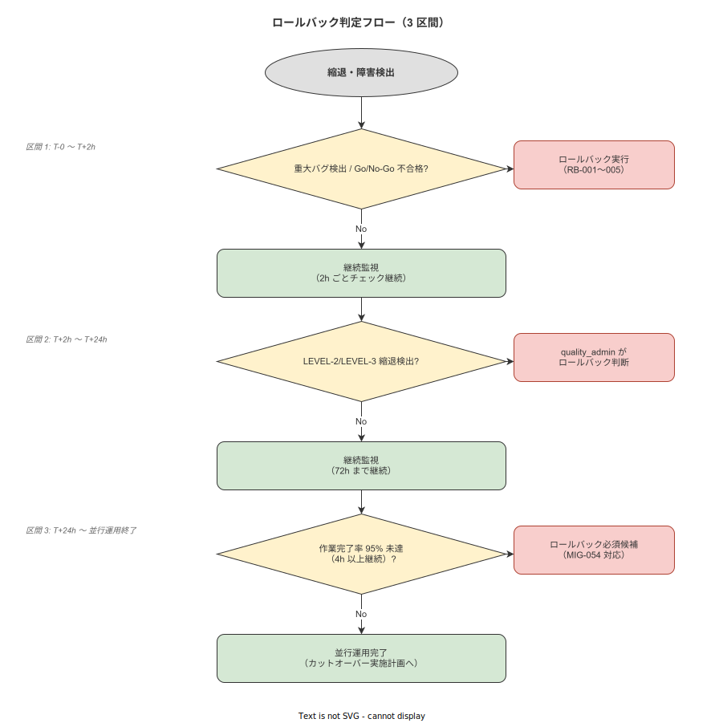

# 07 ロールバック実施計画

本章の責務は、カットオーバー後にシステム障害・重大バグ・品質基準未達が発生した場合に、旧運用（紙）への安全な復帰を確実に実行するためのロールバック実施計画を確定することである。04_概要設計/09_移行方式設計/04_カットオーバー手順とリハーサル設計.md の DES-MIG-055〜056 を実施計画版に展開し、発動条件・実施手順・後処理・再移行計画を確定する。本章で確定する命題（MIG-RB-001〜015）は IPA 共通フレーム 2013 の INST-A4-k（移行の廃棄・中止）に派生して対応する。

---

## 1. 本章の責務

### 1-1. IPA 共通フレーム 2013 との対応

| IPA プロセス | 本章との対応 |
|---|---|
| INST-A4-k（移行の廃棄・中止）派生 | §2（ロールバック発動条件）・§3（実施手順）・§4（後処理）・§5（再移行計画） |
| INST-A2-d（移行実施）との連携 | §2（移行計画/06 との発動条件連携）・§3（RB-001〜005 の手順） |

### 1-2. ロールバック計画の設計方針

ロールバックは「失敗の管理」ではなく「安全復帰の確立」である。並行運用方式（DES-MIG-002）の採用によりロールバックの実行可能性を設計に組み込んでいる。CON-MIG-X-005（カットオーバー後も紙原本を物理保管継続）がロールバック実施の根本的な前提であり、紙原本が廃棄されている場合はロールバックが不可能となる。

| 設計方針 | 内容 |
|---|---|
| ロールバック実行可能期間 | カットオーバー後 72 時間（ハイパーケア期間中）が主要な発動ウィンドウ。ただし並行運用期間終了まで（最長 T+4W）は発動条件 5 が適用される |
| ロールバック後の業務継続 | 旧運用（紙）への即時復帰により、現場作業を停止させない |
| RPO（目標復旧ポイント）| PostgreSQL バックアップからの復元により、カットオーバー直前状態に復旧する（RPO: 15 分以内） |
| RTO（目標復旧時間） | ロールバック宣言から旧運用復帰まで 2 時間以内を目標とする |

### 1-3. 本章で確定する命題（MIG-RB-001〜015）

| 命題 ID | 命題要旨 | 記述節 |
|---|---|---|
| MIG-RB-001 | T-0〜T+2h のロールバック発動条件を確定する | §2 |
| MIG-RB-002 | T+2h〜T+24h のロールバック発動条件を確定する | §2 |
| MIG-RB-003 | T+24h〜T+72h のロールバック発動条件を確定する | §2 |
| MIG-RB-004 | T+72h〜並行運用期間終了のロールバック発動条件を確定する | §2 |
| MIG-RB-005 | ロールバック判断フローを確定する | §2 |
| MIG-RB-006 | RB-001（旧運用即時再開宣言）の手順を確定する | §3 |
| MIG-RB-007 | RB-002（PostgreSQL バックアップからの復元・RPO 15 分以内）の手順を確定する | §3 |
| MIG-RB-008 | RB-003（ハッシュチェーンの巻戻し確認）の手順を確定する | §3 |
| MIG-RB-009 | RB-004（ハンディ端末の接続先リセット）の手順を確定する | §3 |
| MIG-RB-010 | RB-005（全作業員への紙運用復帰アナウンス）の手順を確定する | §3 |
| MIG-RB-011 | is_retroactive=true フラグ運用（MIG-056 対応）を確定する | §4 |
| MIG-RB-012 | ロールバック報告書テンプレートを確定する | §4 |
| MIG-RB-013 | ロールバック報告書の電子署名手順を確定する | §4 |
| MIG-RB-014 | 再移行の問題分析・再リハーサル必須化を確定する | §5 |
| MIG-RB-015 | 再移行承認プロセスを確定する | §5 |

---

**本節で確定した方針**
- 本章が IPA INST-A4-k（移行廃棄・中止）の派生として機能し、DES-MIG-055〜056 を実施計画版に展開することを確定する。
- MIG-RB-001〜015 の 15 命題を確定し、ロールバック実施の全プロセス（発動条件・実施手順・後処理・再移行）を本章で権威的に管理することを確定する。
- CON-MIG-X-005（紙原本保管継続）がロールバック実施の根本前提であり、紙原本廃棄後はロールバックが不可能であることを確定する。

---

## 2. ロールバック発動条件

本節では時間帯別のロールバック発動条件 5 事象とロールバック判断フローを確定する。（MIG-RB-001〜005 対応）

**図 1: ロールバック判断フロー**



> 原本: [`img/fig_mig_rollback_decision.drawio`](img/fig_mig_rollback_decision.drawio)

### 2-1. T-0〜T+2h のロールバック発動条件

**MIG-RB-001**: T-0〜T+2h のロールバック発動条件を確定する。（DES-MIG-055 対応）

カットオーバー作業開始（T-0）から 2 時間以内に以下の事象が発生した場合は即座にロールバックを発動する。

| 発動事象 | 具体的な発動基準 | 発見者 | 報告先 |
|---|---|---|---|
| RB-TRIGGER-001: カットオーバーチェックリスト不合格 | CL-001〜CL-009 のいずれかが不合格であり、T-30 分の No-Go 判定後もカットオーバー作業を継続した場合（通常は延期となるが、作業中に問題が発覚した場合に適用） | system_admin | quality_admin |
| RB-TRIGGER-002: 重大バグ検出（Severity: Critical） | カットオーバー作業中に Severity: Critical のバグが新規発生し、現場作業が停止または証跡記録が生成できない状態が発生した場合 | system_admin | quality_admin |
| RB-TRIGGER-003: DB 接続障害 | PostgreSQL への接続が 15 分以上継続して失敗し、system_admin による復旧が不可能な場合 | system_admin | quality_admin |
| RB-TRIGGER-004: ハッシュチェーン生成失敗 | MIG-T-017（ハッシュチェーン初期ブロック生成）が失敗し、再試行でも解消しない場合 | system_admin | quality_admin |

この時間帯はカットオーバー作業の最中であり、作業員はまだ紙運用と並行している（MIG-T-018 の旧運用凍結宣言前の場合）か、旧運用凍結宣言直後の状態である。ロールバック発動時は旧運用凍結を即座に解除し、紙記録用紙の再配布を実施する。

### 2-2. T+2h〜T+24h のロールバック発動条件

**MIG-RB-002**: T+2h〜T+24h のロールバック発動条件を確定する。

本番移行宣言（MIG-T-020）完了後 2 時間から 24 時間の間に以下の縮退状態が検出された場合にロールバックを発動する。

| 発動事象 | 具体的な発動基準 | 発見者 | 報告先 |
|---|---|---|---|
| RB-TRIGGER-005: LEVEL-2 縮退検出 | 証跡記録生成率が 95% 以下に低下し、system_admin による 1 時間以内の復旧が不可能な場合 | system_admin | quality_admin |
| RB-TRIGGER-006: LEVEL-3 縮退検出 | 証跡記録生成率が 80% 以下に低下した場合、またはハッシュチェーン整合性エラーが 1 件以上発生した場合 | system_admin | quality_admin |
| RB-TRIGGER-007: 重大バグ継続発生 | Severity: High バグが 3 件以上発生し、いずれも 4 時間以内に解消しない場合 | system_admin | quality_admin |

縮退レベルの定義:
- LEVEL-1（軽微）: 証跡記録生成率 99%〜100%・エラーは軽微（即時対応不要）
- LEVEL-2（警告）: 証跡記録生成率 95%〜98%・エラーが散発的に発生（対応必要）
- LEVEL-3（重大）: 証跡記録生成率 80%〜94% またはハッシュチェーンエラー発生（ロールバック検討）

### 2-3. T+24h〜T+72h のロールバック発動条件

**MIG-RB-003**: T+24h〜T+72h のロールバック発動条件を確定する。

| 発動事象 | 具体的な発動基準 | 発見者 | 報告先 |
|---|---|---|---|
| RB-TRIGGER-008: 証跡記録完全性の継続低下 | 証跡記録生成率（KPI-MIG-006）が 100% を下回る状態が 24 時間以上継続した場合 | system_admin | quality_admin |
| RB-TRIGGER-009: 旧記録使用の継続発生 | 紙記録票の使用件数（KPI-MIG-008）が 1 件以上発生し、旧運用への自然復帰が観測された場合 | quality_admin | — |
| RB-TRIGGER-010: 重大バグ未解決継続 | Severity: Critical バグが T+24h を超えて未解決の場合 | system_admin | quality_admin |

### 2-4. T+72h〜並行運用期間終了のロールバック発動条件

**MIG-RB-004**: T+72h〜並行運用期間終了のロールバック発動条件を確定する。

| 発動事象 | 具体的な発動基準 | 発見者 | 報告先 |
|---|---|---|---|
| RB-TRIGGER-011: 作業完了率 95% 未達継続 | Phase M-2 の完了条件（KPI-MIG-002: 95% 以上）を、カットオーバー後も継続して下回る状態が 1 週間以上続く場合 | system_admin + quality_admin | — |
| RB-TRIGGER-012: 規制違反リスクの発覚 | 証跡記録の品質問題（ALCOA+ 違反）が監査指摘事項となるリスクが quality_admin の判断で確認された場合 | quality_admin | — |

### 2-5. ロールバック判断フロー

**MIG-RB-005**: ロールバック判断フローを確定する。

ロールバックの発動判断は quality_admin の専権事項とし、以下のフローに従って実施する。

| ステップ | 実施者 | 内容 |
|---|---|---|
| 1. 発動事象の検知 | system_admin または quality_admin | RB-TRIGGER-001〜012 のいずれかを検知した場合、即座に記録する |
| 2. 即時報告 | system_admin → quality_admin | Level 3 問題（RB-TRIGGER-003・004・006・007・010）は 30 分以内に quality_admin へ報告する。Level 2 問題は 1 時間以内に報告する |
| 3. 問題の評価 | quality_admin + system_admin | 問題の影響範囲・復旧見込み時間・旧運用への影響を評価する（所要時間: 30 分以内） |
| 4. ロールバック判断 | quality_admin（専権事項） | 評価結果に基づき quality_admin がロールバック実施 or 継続監視を判断する。「継続監視」を選択した場合は次回の判断タイミングを設定する |
| 5. ロールバック宣言 | quality_admin | ロールバック実施を判断した場合、quality_admin がロールバック宣言（電子署名付き）を作成し、system_admin・現場監督に通知する |
| 6. ロールバック実施 | system_admin・quality_admin・現場監督 | §3 のロールバック実施手順 5 ステップ（RB-001〜005）を実施する |

| ロールバック判断の基準 | 継続監視を選択する場合 | ロールバックを実施する場合 |
|---|---|---|
| 証跡記録生成率 | 95%〜99%（LEVEL-2）かつ 1 時間以内に復旧見込みあり | 80% 未満（LEVEL-3）またはLEVEL-2 が 4 時間以上継続 |
| バグ発生状況 | Severity: Medium のバグで 4 時間以内に解消見込みあり | Severity: Critical / High が発生し 4 時間以内の解消見込みなし |
| 業務影響 | 現場作業が継続できており、作業員の混乱が限定的 | 現場作業が停止または大幅な遅延が発生している |

---

**本節で確定した方針**
- T-0〜T+2h（MIG-RB-001）・T+2h〜T+24h（MIG-RB-002）・T+24h〜T+72h（MIG-RB-003）・T+72h〜並行期終了（MIG-RB-004）の 4 時間帯別発動条件（RB-TRIGGER-001〜012）を確定する。
- ロールバック判断は quality_admin の専権事項とし、5 ステップの判断フローを確定する（MIG-RB-005 対応）。
- LEVEL-3 問題発生時は 30 分以内に quality_admin へ報告し、ロールバック判断を仰ぐことを確定する。

---

## 3. ロールバック実施手順 5 ステップ

本節ではロールバックの実施手順を確定する。（MIG-RB-006〜010 対応）

**MIG-RB-006〜010**: ロールバック実施手順 RB-001〜005 を確定する。（DES-MIG-056 対応）

ロールバックは RB-001 から RB-005 の順序通りに実施する。手順の順序入れ替えは認めない。各ステップの完了を system_admin または quality_admin が移行記録に即時記録する（ALCOA+ Contemporaneous 原則）。

### 3-1. RB-001: 旧運用（紙）の即時再開宣言

**MIG-RB-006**: RB-001（旧運用即時再開宣言）の手順を確定する。

ロールバック宣言（§2-5 ステップ 5）完了後、quality_admin が旧運用の即時再開を宣言する。この手順はロールバック宣言後 15 分以内に完了させる。

| 実施手順 | 実施者 | 所要時間目安 |
|---|---|---|
| 1. 現場監督への緊急通知 | quality_admin | 5 分以内 |
| 2. 現場監督が各工程に「ロールバック実施・紙記録再開」を口頭で通知 | 現場監督 | 10 分以内 |
| 3. 旧運用（紙）即時再開宣言書の作成（電子署名付き） | quality_admin | 5 分以内 |
| 4. 全作業員への紙記録用紙再配布の開始指示（RB-005 と並行実施） | 現場監督 | 10 分以内 |

旧運用再開宣言後、作業員は即座に紙記録票での作業記録を再開する。システムでの記録入力は RB-002〜004 の完了まで一時停止する。

### 3-2. RB-002: PostgreSQL バックアップからの復元（RPO 15 分以内）

**MIG-RB-007**: RB-002（PostgreSQL バックアップからの復元・RPO 15 分以内）の手順を確定する。

RB-001 完了後（旧運用再開後）に system_admin が PostgreSQL の復元作業を実施する。現場作業は紙で継続しているため、system_admin はロールバック宣言後すぐに復元作業を開始できる。

| 実施手順 | コマンドまたは操作 | 担当者 | 所要時間目安 |
|---|---|---|---|
| 1. 現在の DB 状態のスナップショット保存 | `pg_dump -Fc <db_name> > /backup/rollback_snapshot_$(date +%Y%m%d%H%M%S).dump` | system_admin | 5〜10 分 |
| 2. カットオーバー前バックアップの確認 | CL-007 で取得したバックアップファイルの存在・整合性を確認する | system_admin | 2 分 |
| 3. サービスの一時停止 | Rust バックエンドサービスを停止する（Docker Compose 経由） | system_admin | 2 分 |
| 4. PostgreSQL フルリストアの実行 | `pg_restore -d <db_name> /backup/cutover_pre_<timestamp>.dump` | system_admin | 10〜20 分 |
| 5. リストア完了の確認 | 主要テーブルのレコード件数・最新更新日時を確認し、カットオーバー前状態に戻っていることを確認する | system_admin | 5 分 |
| 6. quality_admin への報告 | リストア完了・復旧ポイント（バックアップ取得日時）を報告する | system_admin → quality_admin | 2 分 |

RPO 15 分以内の達成基準: カットオーバー前バックアップ（CL-007）の取得日時とリストア完了時点の差分が 15 分以内であること。バックアップ取得日時と現在時刻の差分ではないことに注意する。

### 3-3. RB-003: ハッシュチェーンの巻戻し確認

**MIG-RB-008**: RB-003（ハッシュチェーンの巻戻し確認）の手順を確定する。

PostgreSQL リストア（RB-002）完了後、audit_logs テーブルのハッシュチェーンがカットオーバー前の状態に正しく巻き戻っていることを確認する。

| 実施手順 | 確認内容 | 担当者 |
|---|---|---|
| 1. audit_logs テーブルの最終レコード確認 | audit_logs の最新レコードのタイムスタンプがカットオーバー前（MIG-T-016 のバックアップ取得前）であることを確認する | system_admin |
| 2. ハッシュチェーン整合性チェックバッチの実行 | 整合性チェックバッチを手動実行し「エラー 0 件」であることを確認する | system_admin |
| 3. カットオーバー後に生成された audit_logs レコードの扱い | カットオーバー後（T-0〜ロールバック宣言まで）に生成された audit_logs レコードはロールバック後のシステムには存在しない（リストアにより削除される）。この事実を移行記録に明示的に記録する | system_admin + quality_admin |
| 4. quality_admin への確認報告 | ハッシュチェーン整合性確認完了を quality_admin に報告する | system_admin → quality_admin |

カットオーバー後に生成された audit_logs レコードが失われることは、RPO 15 分以内のロールバック設計において許容される。ただしロールバック後処理（§4 の is_retroactive=true フラグ運用）で、紙記録からの後入力として改めて記録することが必要となる場合がある。

### 3-4. RB-004: ハンディ端末の接続先リセット

**MIG-RB-009**: RB-004（ハンディ端末の接続先リセット）の手順を確定する。

PostgreSQL リストアとハッシュチェーン確認（RB-002〜003）完了後、Rust バックエンドサービスを再起動し、ハンディ端末がロールバック後のシステムに正しく接続できることを確認する。

| 実施手順 | 実施内容 | 担当者 |
|---|---|---|
| 1. Rust バックエンドサービスの再起動 | Docker Compose で Rust バックエンドを起動する（RB-002 で停止したサービスの再起動） | system_admin |
| 2. API 接続確認 | バックエンドの API ヘルスチェックエンドポイントにアクセスし、正常応答（HTTP 200）を確認する | system_admin |
| 3. ハンディ端末のキャッシュクリア | 全ハンディ端末のアプリキャッシュをクリアし、接続先設定を確認する | system_admin（現場監督の補助あり） |
| 4. 代表端末による接続テスト | 代表端末 1 台でシステムにログインし、SOP 表示が正常であることを確認する | system_admin |
| 5. 全端末の接続確認 | 全ハンディ端末で接続確認（ログイン確認）を実施する（または現場監督が担当工程の端末を確認する） | system_admin + 現場監督 |

ハンディ端末の接続先リセットが完了した後も、RB-005（全作業員への紙運用復帰アナウンス）が完了するまでは作業員に「システムでの作業再開」の指示を出してはいけない。

### 3-5. RB-005: 全作業員への紙運用復帰アナウンス

**MIG-RB-010**: RB-005（全作業員への紙運用復帰アナウンス）の手順を確定する。

RB-001〜004 の全手順完了後、quality_admin が全作業員への正式アナウンスを実施する。このアナウンスをもってロールバックの実施が完了する。

| 実施手順 | 実施内容 | 担当者 |
|---|---|---|
| 1. アナウンス準備 | 全工程への掲示（「ロールバック実施済み・引き続き紙記録を継続してください」）と口頭アナウンスの準備 | quality_admin |
| 2. 現場監督への一斉連絡 | 全現場監督に「RB-001〜004 完了・全工程へのアナウンスを実施してください」を通知する | quality_admin |
| 3. 各工程への掲示 | 現場監督が各工程の作業員への掲示を設置する | 現場監督 |
| 4. 口頭アナウンス | 現場監督が各工程の作業員に「ロールバック完了・紙記録を継続」を口頭で伝達する | 現場監督 |
| 5. アナウンス完了の確認 | quality_admin が全工程への掲示設置・口頭アナウンス完了を確認する（現場監督からの確認報告を収集） | quality_admin |
| 6. ロールバック完了記録の作成 | quality_admin がロールバック完了日時・完了確認者・全手順（RB-001〜005）の完了確認を移行記録に記録する | quality_admin |

ロールバック開始（RB-001 の旧運用再開宣言）からロールバック完了（RB-005 のアナウンス完了）までの目標所要時間は 2 時間以内とする。

---

**本節で確定した方針**
- ロールバック実施手順 RB-001〜005 を確定し、RB-001（旧運用再開宣言）→ RB-002（PostgreSQL リストア・RPO 15 分以内）→ RB-003（ハッシュチェーン確認）→ RB-004（端末リセット）→ RB-005（全作業員アナウンス）の順序通りに実施することを確定する（MIG-RB-006〜010 対応）。
- PostgreSQL リストアの RPO を 15 分以内と確定し、CL-007 のバックアップ取得がその前提条件であることを確定する（MIG-RB-007 対応）。
- ロールバック開始から完了までの目標所要時間を 2 時間以内と確定する。

---

## 4. ロールバック後処理

本節ではロールバック後の処理手順を確定する。（MIG-RB-011〜013 対応）

### 4-1. is_retroactive=true フラグ運用

**MIG-RB-011**: is_retroactive=true フラグ運用（DES-MIG-056 対応）を確定する。

カットオーバーから RB-005（ロールバック完了）までの間に作業員がシステムで記録した作業データは、ロールバック後のシステムには存在しない（RB-002 のリストアにより削除される）。この期間に実施した作業の証跡は紙記録票として残っているため、以下の手順で後入力を実施する。

| 状況 | 対応方針 |
|---|---|
| カットオーバー後〜ロールバック完了までの作業記録 | 紙記録票の内容をシステムに後入力する。後入力レコードには `is_retroactive: true` フラグを付与する |
| is_retroactive=true フラグの意味 | 後入力によるレコードであり、元の記録時刻の ALCOA+ Contemporaneous 原則は厳密には充足しない。ただし規制監査時には後入力であることを明示した上で、紙原本と照合して証跡の完全性を担保する |
| 後入力の担当者 | quality_admin が後入力の実施を承認し、master_admin または system_admin が実際の入力を担当する |
| 後入力の期限 | ロールバック完了から 5 営業日以内に実施する |

is_retroactive=true フラグの付与手順:

| フィールド | 設定値 | 説明 |
|---|---|---|
| is_retroactive | true | 後入力レコードであることを示す |
| retroactive_entry_date | 後入力を実施した日時（現在日時） | 後入力の実施日時を記録する |
| retroactive_entered_by | 後入力を実施したユーザー ID | ALCOA+ Attributable 原則への対応 |
| source_document_type | "paper_record_rollback" | 後入力の出典が紙記録票（ロールバック後の後入力）であることを示す |

### 4-2. ロールバック報告書テンプレート

**MIG-RB-012**: ロールバック報告書テンプレートを確定する。

ロールバック完了後、quality_admin がロールバック報告書を作成する（目標: ロールバック完了から 2 営業日以内）。

```
ロールバック報告書

■ 基本情報
ロールバック発動日時: _____ 年 _____ 月 _____ 日 _____ 時 _____ 分
ロールバック完了日時: _____ 年 _____ 月 _____ 日 _____ 時 _____ 分
発動者（ロールバック宣言者）: quality_admin _____
報告書作成日: _____

■ ロールバック発動事象
発動トリガー（RB-TRIGGER-001〜012 のいずれか）: RB-TRIGGER-_____
事象の詳細: _____
発見者: _____
発見日時: _____

■ ロールバック実施記録
RB-001（旧運用再開宣言）完了日時: _____
RB-002（PostgreSQL リストア完了）完了日時: _____　RPO 達成確認: 達成 / 未達成
RB-003（ハッシュチェーン巻戻し確認）完了日時: _____　整合性チェック結果: 正常 / 異常
RB-004（ハンディ端末接続リセット）完了日時: _____
RB-005（全作業員アナウンス）完了日時: _____

■ 影響分析
ロールバック対象期間中のシステム作業件数（推定）: _____ 件
is_retroactive=true フラグ付き後入力が必要なレコード件数: _____ 件
現場作業への影響（停止・遅延等）: _____

■ 根本原因分析（RCA: Root Cause Analysis）
発動事象の根本原因: _____
根本原因の分類:
  □ システム設計上の不備（Rust バックエンド / PostgreSQL / React Native）
  □ インフラ設定の問題（WiFi / Docker / IIS）
  □ マスタデータの品質問題
  □ 移行計画の不備
  □ 外部要因（ハードウェア障害 / 電源障害等）
  □ その他: _____

■ 再発防止策
再発防止策の内容: _____
実施担当者: _____
実施期限: _____

■ 再移行計画
再移行実施の予定: _____（具体的な日程は§5 の再移行承認プロセス完了後に確定）
再リハーサルの実施予定: _____

■ 電子署名
quality_admin 署名: _____ 署名日時: _____ （システムが自動記録）
```

### 4-3. ロールバック報告書の電子署名手順

**MIG-RB-013**: ロールバック報告書の電子署名手順を確定する。

| ステップ | 手順 | 担当者 |
|---|---|---|
| 1. 報告書草稿作成 | quality_admin がロールバック完了から 2 営業日以内に報告書草稿を作成する | quality_admin |
| 2. 技術項目の確認 | system_admin が RCA・技術的影響分析・再発防止策の妥当性を確認する | system_admin |
| 3. 電子署名付与 | quality_admin がシステム上の電子署名機能で報告書に署名する（署名日時が自動記録） | quality_admin |
| 4. 保存 | 電子署名付き報告書をシステムの `migration_reports` テーブルまたは文書管理ストレージに保存する（保存期間: 7 年以上） | system_admin |
| 5. 関係者への展開 | quality_admin が電子署名付き報告書を全関係者（system_admin・現場監督）に展開する | quality_admin |

---

**本節で確定した方針**
- is_retroactive=true フラグ（フィールド: is_retroactive / retroactive_entry_date / retroactive_entered_by / source_document_type）を用いて、カットオーバー〜ロールバック間の後入力レコードを管理することを確定する（MIG-RB-011 対応、DES-MIG-056 対応）。
- ロールバック報告書（原因・実施内容・再移行計画・RCA・再発防止策）を quality_admin 電子署名付きで作成し 7 年以上保存することを確定する（MIG-RB-012〜013 対応）。
- ロールバック報告書の作成期限をロールバック完了から 2 営業日以内と確定する。

---

## 5. 再移行計画

本節では再移行に必要な問題分析・再リハーサル・承認プロセスを確定する。（MIG-RB-014〜015 対応）

### 5-1. 問題分析と再リハーサル必須化

**MIG-RB-014**: 再移行の問題分析・再リハーサル必須化を確定する。

ロールバック報告書（§4-2）の電子署名完了後、quality_admin と system_admin は再移行に向けた問題分析を実施する。再移行は問題分析と再リハーサルの完了なしに実施することを禁止する。

| 再移行前提条件 | 内容 | 担当者 |
|---|---|---|
| 問題分析（RCA）の完了 | ロールバック報告書の RCA（Root Cause Analysis）セクションで根本原因を特定し、再発防止策を確定する | quality_admin + system_admin |
| 再発防止策の実施確認 | RCA で確定した再発防止策が実施済みであることを確認する（修正コード・設定変更・手順改訂等） | system_admin（技術対策）・quality_admin（手順対策） |
| 修正版でのステージング環境での検証 | 再発防止策を適用した修正版システムをステージング環境で動作確認する（CON-MIG-X-010 準拠） | system_admin |
| 再リハーサルの実施 | 修正版システムで移行計画/03 のリハーサル計画に従い再リハーサルを実施する。1 回目のロールバック後は第 2 回リハーサルが必須。2 回目以降のロールバック後は quality_admin の判断で追加リハーサル回数を決定する | quality_admin（計画）・system_admin・master_admin（実施） |

再リハーサルの実施スコープは以下の通りとする。

| 再リハーサルスコープ | ロールバック原因による使い分け |
|---|---|
| フルリハーサル（CL-001〜010 の全項目を実施） | ロールバック原因がシステム全体に関わる場合（DB 障害・バックエンドバグ・インフラ障害） |
| 部分リハーサル（影響を受けた機能のみ） | ロールバック原因が特定機能に限定される場合（特定 SOP の表示バグ・特定工程の証跡記録エラー） |

### 5-2. 再移行承認プロセス

**MIG-RB-015**: 再移行承認プロセスを確定する。

再移行を実施するためには以下の承認プロセスを経ることを必須とする。

| 承認ステップ | 内容 | 担当者 | タイミング |
|---|---|---|---|
| 1. 再移行計画書の作成 | ロールバック報告書を上位参照として、再移行のカットオーバー予定日・対策内容・再リハーサル結果を記載した再移行計画書を作成する | quality_admin | 再リハーサル完了後 |
| 2. 再移行計画書のレビュー | system_admin が技術的実現可能性・再発防止策の有効性を確認する | system_admin | 再移行計画書作成後 3 営業日以内 |
| 3. 再移行承認 | quality_admin が再移行計画書に電子署名を付与し、再移行を正式承認する | quality_admin | レビュー完了後 |
| 4. カットオーバー実施日の再設定 | quality_admin が再移行のカットオーバー実施日を確定し、CON-MIG-X-009（週末または計画停止日）に従い設定する | quality_admin | 承認完了後 |
| 5. 全作業員への再移行通知 | 再移行の実施日・手順変更点を全作業員に通知する（DES-MIG-051 CO-PRE-005: 24 時間前通知） | quality_admin + 現場監督 | カットオーバー 24 時間前 |

再移行のカットオーバーは移行計画/06 の全手順（§2〜§9）を再実施する。ただし再移行計画書に記載した変更点（チェックリスト項目の追加・手順の修正等）については移行計画/06 を必要に応じて改版した上で実施する。

### 5-3. 再移行後の強化監視

再移行後は通常の 72h ハイパーケア（移行計画/06 §7）に加えて以下の強化監視を実施する。

| 強化監視項目 | 監視頻度 | 担当者 | 監視期間 |
|---|---|---|---|
| RCA で特定された再発事象の監視 | 1 時間ごと（T+0〜T+24h） | system_admin | T+0〜T+24h |
| quality_admin への報告頻度の増加 | 1 時間ごと（T+0〜T+24h）→ 2 時間ごと（T+24〜T+72h） | system_admin → quality_admin | T+0〜T+72h |
| 旧記録使用件数の厳格監視 | 4 時間ごと | quality_admin | T+0〜T+72h |

2 回目以降のロールバックが発生した場合は、quality_admin が移行計画全体（移行計画/01〜11）の再検討を実施し、移行方式（DES-MIG-002）の変更可否を判断する。

---

**本節で確定した方針**
- 再移行は問題分析（RCA）・再発防止策の実施確認・ステージング環境検証・再リハーサルの 4 条件をすべて充足した後にのみ実施することを確定する（MIG-RB-014 対応）。
- 再移行承認を quality_admin の電子署名で確定し、承認なしの再移行実施を禁止することを確定する（MIG-RB-015 対応）。
- 2 回目以降のロールバックが発生した場合は移行計画全体の再検討を実施し、移行方式の変更可否を質担当が判断することを確定する。

---

## 参照業界分析

### 必須

| ドキュメント | 参照理由 |
|---|---|
| [../../90_業界分析/06_品質管理とトレーサビリティ.md](../../90_業界分析/06_品質管理とトレーサビリティ.md) | is_retroactive=true フラグ運用（ALCOA+ 非適合記録の管理）の根拠・ロールバック後の証跡完全性確保の根拠 |

### 関連

| ドキュメント | 参照理由 |
|---|---|
| [../../90_業界分析/22_規制別トレーサビリティ要件詳論.md](../../90_業界分析/22_規制別トレーサビリティ要件詳論.md) | ロールバック後の後入力記録（is_retroactive=true）が規制監査でどのように扱われるかの根拠 |
| [../../90_業界分析/13_安全文化と安全管理システム.md](../../90_業界分析/13_安全文化と安全管理システム.md) | ロールバックを「失敗」ではなく「安全復帰の確立」として設計することの根拠・RCA 文化の根拠 |
| [../../90_業界分析/28_不適合と手順改訂のフィードバックループ.md](../../90_業界分析/28_不適合と手順改訂のフィードバックループ.md) | MIG-RB-014（問題分析・再リハーサル必須化）の根拠・RCA から再移行計画へのフィードバックループの根拠 |

---

| バージョン | 日付 | 変更内容 | 作成者 |
|---|---|---|---|
| 0.1.0 | 2026-05-18 | 初版 | RyuheiKiso |
