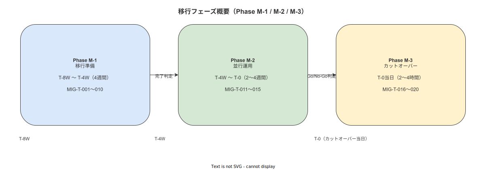

# 09 利用者教育・移行通知計画

本章の責務は、IPA 共通フレーム 2013「INST-A3 移行通知・利用者教育・業務移行計画の周知」に対応し、紙・Excel 運用からシステム運用への移行に際して必要な利用者教育計画・移行通知手順・訓練完了確認手順を確定することである。移行要件 MIG-T-010（操作訓練）および教育要件（INST-A3）との連携を明示し、Phase M-2 開始の前提条件を訓練完了とすることを確定する。

---

## 1. 本章の責務（INST-A3 / 教育要件連携）

### 1-1. INST-A3 カバレッジ

本章は IPA 共通フレーム 2013 INST-A3「移行通知・利用者教育・業務移行計画の周知」の以下の実施命題をすべてカバーする。

| INST-A3 要素 | 本章での対応節 |
|---|---|
| 移行通知の計画・実施 | §4（移行通知計画） |
| 利用者教育計画の策定 | §3（利用者教育計画） |
| 業務移行計画の周知 | §2（業務移行計画） |
| 訓練完了確認 | §5（訓練完了確認手順） |

### 1-2. 上流要件との連携

本章の内容は以下の上流要件・設計命題と連動する。

| 上流識別子 | 内容 | 連動先 |
|---|---|---|
| MIG-T-010 | 操作訓練（quality_admin・IT 担当・現場監督・作業員） | §3・§5 |
| DES-MIG-003 | 並行運用開始条件（訓練完了が前提） | §5 |
| DES-MIG-004 | Phase M-1 完了条件（操作訓練完了を含む） | §3・§5 |
| RISK-MIG-003 | オペレーター混乱リスク（操作訓練で緩和） | §3 |

**図 1: 移行フェーズ概要（M-1〜M-3）**

> 原本: [`img/fig_mig_phase_overview.drawio`](img/fig_mig_phase_overview.drawio)

---

**本節で確定した方針**
- INST-A3 の全要素（移行通知・利用者教育・業務移行周知・訓練完了確認）を本章でカバーすることを確定する。
- MIG-T-010 の実施手順を §3 で確定し、訓練完了を Phase M-2 開始の前提条件として §5 で確定する。
- RISK-MIG-003（オペレーター混乱リスク）の緩和策を訓練計画によって制度的に担保することを確定する。

---

## 2. 業務移行計画（紙運用→並行→完全移行）

### 2-1. 移行の業務的意味の作業員への周知手順

**MIG-X-073**: 作業員への移行説明会を Phase M-1 期間（カットオーバー予定日の 8〜4 週前）に 1 回以上開催し、移行の業務的意味を以下の 4 点で説明することを確定する。（MIG-T-010 対応）

| 説明項目 | 内容 |
|---|---|
| なぜ移行するか | 紙記録の検索困難・版管理欠如・証跡完全性の不足を解消し、ALCOA+ 準拠の電子証跡を実現するため |
| 何が変わるか | 作業指示書の参照方法（紙→ハンディ端末）・作業証跡の記録方法（紙記録票→電子記録）が変わる |
| 何が変わらないか | 作業手順の内容・安全基準・承認フロー（電子サインへの移行後も承認者・承認権限は不変） |
| 作業員に求める行動 | 訓練への参加・並行運用期間中の二重記録・疑問点の即時報告 |

**MIG-X-074**: 移行説明会の実施記録（日時・参加者一覧・質疑応答概要）を quality_admin が保管し、後日の訓練完了確認と照合することを確定する。

### 2-2. 段階別の業務変化の周知内容

**MIG-X-075**: Phase M-1・M-2・M-3 の各段階で作業員に周知する業務変化内容を以下のとおり確定する。

| フェーズ | 周知タイミング | 作業員への周知内容 |
|---|---|---|
| Phase M-1（移行準備） | 訓練開始時 | ハンディ端末の操作方法・作業ナビゲーション画面の読み方・クリティカルステップの電子サイン方法 |
| Phase M-2（並行運用） | 並行開始宣言時 | 「紙とシステムの両方に記録する義務」・エラー発生時の報告先（system_admin）・中断時のロールバック対応 |
| Phase M-3（カットオーバー） | カットオーバー当日 | 「本日より紙記録は廃止・システムのみが正式記録」・フォールバック手順の案内（§11 章参照） |

**MIG-X-076**: 段階別周知の実施後、quality_admin は周知内容の受領確認を作業員単位で記録し、未受領者への個別フォローを 24 時間以内に実施することを確定する。

---

**本節で確定した方針**
- 作業員への移行説明会（MIG-X-073）を Phase M-1 期間中に必須開催として確定し、実施記録の保管義務を quality_admin に帰属させることを確定する。
- Phase M-1・M-2・M-3 の各段階における作業員周知内容（MIG-X-075）を確定し、フェーズ移行時に必ず周知を実施することを確定する。
- 周知受領確認を作業員単位で管理し、未受領者への 24 時間以内フォロー（MIG-X-076）を義務として確定する。

---

## 3. 利用者教育計画

### 3-1. 対象者別教育内容マトリクス

**MIG-X-077**: 利用者教育の対象者を以下の 4 ロールに分類し、各ロールの教育内容・教育方法・教育時間を確定する。

| 対象ロール | 教育内容 | 教育方法 | 必要時間目安 |
|---|---|---|---|
| quality_admin | マスタ管理・SOP 電子承認・移行完了判定手順・受入レビュー実施手順・報告書作成 | 集合訓練 + 個別 OJT | 8 時間（4h + 4h） |
| master_admin | GUI ウィザード操作・Excel テンプレート作成・SOP 登録・バージョン管理・ドラフト管理 | 集合訓練 + 実機練習 | 6 時間（3h + 3h） |
| 現場監督 | 作業進捗モニタリング画面・アンドン受信・エラー報告受領・ロールバック発動判断 | 集合訓練 + ロールプレイ | 4 時間（2h + 2h） |
| 作業員 | ハンディ端末操作・ナビゲーション画面読み取り・クリティカルステップ電子サイン・オフライン時の同期確認 | 集合訓練 + 現場実機練習 | 3 時間（1h + 2h） |

### 3-2. 操作マニュアルの配布方法

**MIG-X-078**: 操作マニュアルは以下の 3 形式で整備し、訓練開始の 3 日前までに対象者全員に配布することを確定する。

| 形式 | 配布方法 | 用途 |
|---|---|---|
| PDF（A4 印刷版） | 各ロール別にホチキス綴じで物理配布 | 訓練中の参照・現場掲示用 |
| PDF（スマホ表示最適化版） | メール添付・または共有フォルダへのパス通知 | ハンディ端末からの参照用 |
| 紙ポスター（A3） | 作業現場の見やすい位置に掲示（テープ固定） | 作業員の日常参照用（操作手順の概要版） |

**MIG-X-079**: 配布記録（配布日時・対象者氏名・形式）を quality_admin が管理する配布台帳に記録し、訓練完了確認（§5）と照合することを確定する。

### 3-3. 教育の実施スケジュール

**MIG-X-080**: 利用者教育を以下の 3 段階スケジュールで実施することを確定する。T はカットオーバー予定日を基点とする。

| スケジュール | 実施内容 | 対象者 | 実施責任者 |
|---|---|---|---|
| T-2 週：集合訓練 | 全ロール向け操作訓練（§3-1 の教育内容全量） | quality_admin・master_admin・現場監督・作業員 | quality_admin（主催）・system_admin（技術説明） |
| T-1 週：個別フォロー | 訓練評価で未達の作業員・監督者への補講・個別実機練習 | T-2 週の訓練評価で未達者のみ | quality_admin（個別対応） |
| T+0：直前リマインダー | カットオーバー当日朝の 5 分口頭確認（操作手順の最終リマインダー・エスカレーション先の再確認） | 全作業員・監督者 | 現場監督（各ライン担当） |

**MIG-X-081**: T-2 週の集合訓練では、以下の演習シナリオを実機で実施し、各参加者が演習を完了したことを訓練記録に記録することを確定する。

| 演習シナリオ | 対象ロール | 合格基準 |
|---|---|---|
| 作業ナビゲーション開始〜完了（クリティカルステップ電子サイン含む） | 作業員・現場監督 | 補助なしで 1 回完了 |
| オフライン状態での作業実施・Wi-Fi 復旧後の同期確認 | 作業員 | 補助なしで同期確認画面を確認 |
| SOP の新規登録・バージョン更新・電子承認 | master_admin・quality_admin | 補助なしで承認フロー完了 |
| マスタ投入ウィザードの操作（工程・製品・ユーザー） | master_admin | 補助なしで投入完了 |
| 並行運用中のエラー報告画面・アンドン発報 | 現場監督 | 補助なしで発報確認 |

### 3-4. MIG-T-010（操作訓練）の実施方法

**MIG-X-082**: MIG-T-010「操作訓練」の実施方法として、§3-3 の 3 段階スケジュール（T-2 週集合・T-1 週個別フォロー・T+0 直前リマインダー）を採用することを確定する。（MIG-T-010 対応）

**MIG-X-083**: MIG-T-010 の完了判定は、全対象者の訓練完了記録（§5 の要件による）が揃った時点で quality_admin が行い、完了判定を書面で宣言することを確定する。この完了宣言なしに Phase M-2 を開始しないことを確定する。

---

**本節で確定した方針**
- 対象者別教育内容マトリクス（MIG-X-077）を確定し、quality_admin・master_admin・現場監督・作業員の 4 ロールに対して異なる教育内容・時間を割り当てることを確定する。
- 操作マニュアルを PDF（A4）・PDF（スマホ版）・紙ポスター（A3）の 3 形式で整備し、訓練開始 3 日前までに配布する義務（MIG-X-078）を確定する。
- T-2 週集合訓練・T-1 週個別フォロー・T+0 直前リマインダーの 3 段階スケジュール（MIG-X-080）を確定し、MIG-T-010 の完了宣言を Phase M-2 開始の前提条件として確定する。

---

## 4. 移行通知計画

### 4-1. 3 段階通知の手順

**MIG-X-084**: 移行通知をカットオーバー前後の以下の 5 時点で実施することを確定する。T はカットオーバー予定日・時刻を基点とする。

| 通知タイミング | 通知方法 | 通知内容 | 通知者 |
|---|---|---|---|
| T-7 日 | メール + 工場内掲示板 | カットオーバー予定日時・並行運用終了日・訓練スケジュール案内 | quality_admin |
| T-3 日 | メール + 口頭確認（朝礼） | カットオーバー確定のアナウンス・最終訓練日時・フォールバック手順の概要 | quality_admin + 現場監督 |
| T-1 日 | メール + 掲示板更新 | 翌日のカットオーバー最終確認・当日の連絡先・ロールバック判断基準 | quality_admin |
| T+0（当日） | 口頭（朝礼） | 本番移行宣言・「本日より紙記録廃止」宣言・困ったときの相談先 | quality_admin + 現場監督 |
| T+3 日 | メール + 掲示板更新 | カットオーバー後の運用状況・未解決問題の共有・次回フォロー日時 | system_admin |

**MIG-X-085**: 各通知の実施後、quality_admin は通知記録（通知日時・通知方法・通知者・受領確認状況）を保管台帳に記録することを確定する。

### 4-2. 通知文書テンプレート

**MIG-X-086**: 以下の通知文書テンプレートを移行前に quality_admin が準備し、各タイミングで内容を確認のうえ発出することを確定する。

**T-7 日メールテンプレート（件名例）**: 【作業ナビゲーションシステム移行】カットオーバー予定のお知らせ

内容骨格:
- カットオーバー予定日時（〇〇年〇〇月〇〇日 〇〇:〇〇）
- 並行運用終了予定日
- 操作訓練の日時・場所・対象者
- 問い合わせ先（quality_admin 氏名・連絡先）

**T-3 日メールテンプレート（件名例）**: 【確定版】〇〇月〇〇日 カットオーバー実施のご連絡

内容骨格:
- カットオーバー確定の告知
- 移行当日の作業員への依頼事項（端末の充電・ID/パスワードの確認）
- フォールバック発動時の報告先
- 最終訓練補講の案内（対象者のみ別途連絡）

**T+0 口頭スクリプト（朝礼 2 分版）**:

「本日〇〇時より、作業ナビゲーションシステムの本番稼働を開始します。本日以降、作業記録はハンディ端末への入力のみが正式記録となり、紙の記録票は使用しません。操作で困ったことがあれば現場監督または〇〇（system_admin 名）に声をかけてください。ロールバックが必要な場合は quality_admin（〇〇）が判断します。よろしくお願いします。」

**T+3 日メールテンプレート（件名例）**: 【移行後状況報告】カットオーバー後 3 日目のご報告

内容骨格:
- 現在の運用状況（作業完了率・エラー件数）
- 解決済み問題の一覧
- 未解決問題と対応予定
- 次回の状況報告日時

### 4-3. 通知記録の保存

**MIG-X-087**: 通知記録の保存要件を以下のとおり確定する。

| 保存項目 | 内容 |
|---|---|
| 通知日時 | ISO 8601 形式（YYYY-MM-DDTHH:MM:SS+09:00） |
| 通知方法 | メール / 掲示板 / 口頭 の区分 |
| 通知者氏名 | 実施者を特定できる氏名または ID |
| 受領確認方法 | メール開封確認 / 署名受領 / 出席記録 の区分 |
| 受領確認済み人数 | 通知対象総人数に対する確認済み人数 |

**MIG-X-088**: 通知記録は quality_admin が保管する移行記録台帳（Excel または電子ファイル）に格納し、カットオーバー完了後 3 年以上保管することを確定する。

**MIG-X-089**: T+0 の口頭通知（朝礼）については、現場監督が出席記録（参加者氏名・日時）を作成し quality_admin に提出することを確定する。口頭通知の受領確認は出席記録の提出をもって代替することを確定する。

---

**本節で確定した方針**
- 移行通知を T-7 日・T-3 日・T-1 日・T+0・T+3 日の 5 時点で実施し（MIG-X-084）、各タイミングの通知方法・内容・通知者を確定する。
- 通知文書テンプレート（MIG-X-086）を事前に準備することを義務として確定し、アドリブによる通知内容の不統一を排除することを確定する。
- 全通知の実施記録（MIG-X-087）を保管台帳に格納し、カットオーバー後 3 年以上保管することを確定する。

---

## 5. 訓練完了確認手順

### 5-1. 全作業員の訓練完了記録登録

訓練完了確認は、Phase M-2（並行運用フェーズ）開始の前提条件である。本節は MIG-T-010 の完了判定手順を確定する。

訓練完了確認の流れは以下のとおりとする。

1. 訓練実施後、実施責任者（quality_admin または system_admin）が対象者ごとに演習完了を確認する
2. 演習を補助なしで完了した対象者の訓練完了を「合格」として記録する
3. 演習を補助ありで完了した、またはエラーなしで完了できなかった対象者を「要フォロー」として記録する
4. 「要フォロー」対象者は T-1 週の個別フォロー訓練を実施し、再評価する
5. 全対象者が「合格」になった時点で MIG-T-010 完了を宣言する

訓練完了記録に含める項目は以下のとおりとする。

| 記録項目 | 形式 |
|---|---|
| 対象者氏名 | 氏名または社員 ID |
| 対象ロール | quality_admin / master_admin / 現場監督 / 作業員 |
| 訓練実施日時 | YYYY-MM-DDTHH:MM 形式 |
| 演習シナリオ番号 | §3-1 の演習シナリオ番号（1〜5） |
| 合否判定 | 合格 / 要フォロー |
| フォロー実施日時 | 要フォローの場合のみ記入 |
| 最終合否 | 合格（最終確認者氏名付き） |

### 5-2. 訓練完了が Phase M-2 開始の前提条件

訓練完了が Phase M-2 開始の前提条件であることは、DES-MIG-003 の条件（全作業員の訓練完了）および RISK-MIG-003 の緩和策（並行期間開始前の訓練完了）に由来する。

Phase M-2 の開始判断会議（quality_admin・system_admin 出席）において、訓練完了記録の提示が必須となる。訓練完了記録に未合格者が 1 名でも存在する状態での Phase M-2 開始は認めない。

訓練完了確認の最終責任者は quality_admin とし、quality_admin が書面（または電子記録）で「MIG-T-010 完了」を宣言した時点をもって訓練完了の公式認定とする。（MIG-T-010 対応）

---

**本節で確定した方針**
- 全対象者の訓練完了記録を quality_admin が管理する台帳に登録し、全員合格の確認をもって MIG-T-010 完了を宣言することを確定する。
- 訓練完了記録に未合格者が 1 名でも存在する状態での Phase M-2 開始を禁止することを確定する。
- MIG-T-010 完了宣言の最終責任者を quality_admin とし、書面または電子記録による宣言を Phase M-2 開始の前提条件として確定する。

---

## 参照業界分析

### 必須

- [`../../90_業界分析/23_作業訓練設計とインストラクショナルデザイン.md`](../../90_業界分析/23_作業訓練設計とインストラクショナルデザイン.md) — 対象者別教育計画・演習シナリオ設計・訓練効果測定の業界根拠

### 関連

- [`../../90_業界分析/25_作業指示書とSOPの構造化・表現論.md`](../../90_業界分析/25_作業指示書とSOPの構造化・表現論.md) — 操作マニュアルの構造化・表現形式の設計根拠
- [`../../90_業界分析/06_品質管理とトレーサビリティ.md`](../../90_業界分析/06_品質管理とトレーサビリティ.md) — 訓練完了確認記録の証跡完全性確保の業界根拠
- [`../../90_業界分析/28_不適合と手順改訂のフィードバックループ.md`](../../90_業界分析/28_不適合と手順改訂のフィードバックループ.md) — 並行運用期間中のオペレーターエラーの収集・改訂フィードバックの根拠

---

## 更新履歴

| 版数 | 更新日 | 更新内容 | 変更者 |
|---|---|---|---|
| 0.1.0 | 2026-05-18 | 初版（INST-A3 対応・MIG-X-073〜089 採番・利用者教育計画・移行通知計画・訓練完了確認手順を確定） | RyuheiKiso |
