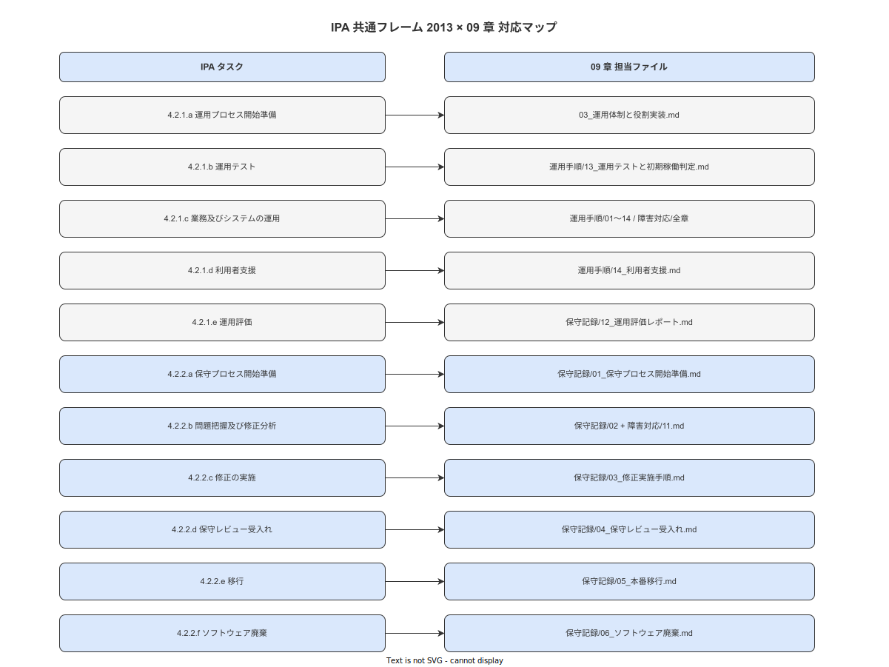
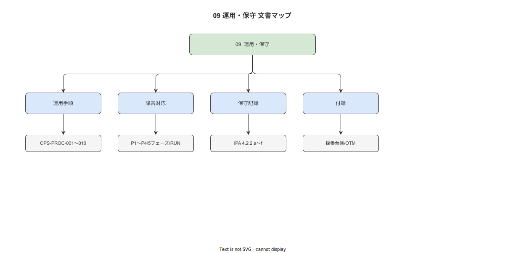

# 09 運用・保守

IPA 共通フレーム 2013「**4.2.1 運用プロセス**」および「**4.2.2 保守プロセス**」に準拠した運用保守フェーズの標準文書群。
システムを継続的に稼働させ、品質を維持するための方針・手順・記録・トレーサビリティを確定する。

---

## §1 位置づけ

| 軸 | 内容 |
|---|---|
| **準拠プロセス** | SLCP-JCF2013 4.2.1 運用プロセス（5 タスク）+ 4.2.2 保守プロセス（6 タスク）+ 6.5.1 構成管理 + 6.5.8 問題解決（全タスク → [付録/02](付録/02_IPA共通フレーム運用保守プロセスカバレッジマトリクス.md) でカバレッジ確認）|
| **上流文書** | [`../03_要件定義/`](../03_要件定義/README.md)（NFR-OPS/AVL/SEC/DQ・OPS-*/MNT-* を継承）、[`../04_概要設計/`](../04_概要設計/README.md)（OPS-PROC-001〜010・BAT/JOB/LOG/MET/ALERT/ERR を継承）、[`../08_移行/`](../08_移行/README.md)（本番稼働開始条件を継承）|
| **下流文書** | なし（本書が最終フェーズ）|
| **実行コード** | `src/infra/` および `docs/ポストモーテム/` |
| **src との関係** | 本書の OPS-PROC・RUN 手順は `src/infra/` の設定値を参照する。src 側からは本書へのリンクで参照する |
| **版情報** | 0.1.0 / 2026-05-18 / RyuheiKiso（初版）|

**図 1: IPA 運用ライフサイクル概要**



> 原本: [`img/fig_ops_lifecycle_ipa.drawio`](img/fig_ops_lifecycle_ipa.drawio)

---

## §2 章別索引

### ルート直下

| ファイル | IPA タスク対応 | 主な成果物 |
|---|---|---|
| [00_本書の位置づけと識別子規約](00_本書の位置づけと識別子規約.md) | — | 位置づけ・IPA カバレッジ表・7 種プレフィックス定義・分担境界 |
| [01_運用保守の前提継承と上流リンケージ](01_運用保守の前提継承と上流リンケージ.md) | — | 上流継承一覧（表形式）・継承/新規の境界宣言 |
| [02_用語集・略語・参照規約](02_用語集・略語・参照規約.md) | — | 運用固有用語集 50 語以上・引用表記規約 |
| [03_運用体制と役割実装](03_運用体制と役割実装.md) | 4.2.1.a 運用プロセス開始準備 | 役割定義・権限マトリクス・エスカレーション経路・夜間対応ポリシー |
| [04_運用保守トレーサビリティ枠組み](04_運用保守トレーサビリティ枠組み.md) | — | 5 段縦串マッピング・接続規則・RTM 連携方針 |
| [99_前提制約と本書が約束しないこと](99_前提制約と本書が約束しないこと.md) | — | 対象外宣言・スコープ境界・自己監査チェックリスト |

**図 2: 運用保守ドキュメント全体マップ**



> 原本: [`img/fig_ops_doc_map.drawio`](img/fig_ops_doc_map.drawio)

### 運用手順サブ（17 ファイル）

| ファイル | IPA タスク対応 | 主な成果物 |
|---|---|---|
| 運用手順/README.md | — | 運用手順サブ索引 |
| 運用手順/00_運用手順識別子規約.md | — | OPS-PROC 採番規約 |
| 運用手順/01_日次起動・停止確認手順.md | 4.2.1.c 業務及びシステムの運用 | OPS-PROC-001 |
| 運用手順/02_週次定期作業手順.md | 4.2.1.c | OPS-PROC-002 |
| 運用手順/03_月次定期作業手順.md | 4.2.1.c | OPS-PROC-003 |
| 運用手順/04_月次SLOレポート手順.md | 4.2.1.e 運用評価 | OPS-PROC-004 |
| 運用手順/05_バックアップ実施手順.md | 4.2.1.c | OPS-PROC-005 |
| 運用手順/06_リストア手順.md | 4.2.1.c | OPS-PROC-006 |
| 運用手順/07_監視設定変更手順.md | 4.2.1.c | OPS-PROC-007 |
| 運用手順/08_ログ収集・アーカイブ手順.md | 4.2.1.c | OPS-PROC-008 |
| 運用手順/09_緊急パッチ適用手順.md | 4.2.2.c 修正の実施 | OPS-PROC-009 |
| 運用手順/10_定期メンテナンス停止手順.md | 4.2.1.c | OPS-PROC-010 |
| 運用手順/11_DB運用管理手順.md | 4.2.1.c | — |
| 運用手順/12_証明書更新手順.md | 4.2.1.c | — |
| 運用手順/13_運用テストと初期稼働判定.md | 4.2.1.b 運用テスト | — |
| 運用手順/14_利用者支援とサポート受付手順.md | 4.2.1.d 利用者支援 | — |
| 運用手順/99_運用手順前提制約.md | — | — |

### 障害対応サブ（16 ファイル）

| ファイル | IPA タスク対応 | 主な成果物 |
|---|---|---|
| 障害対応/README.md | — | 障害対応サブ索引 |
| 障害対応/00_障害対応識別子規約.md | — | INC/RUN 採番規約 |
| 障害対応/01_P1障害対応手順.md | 4.2.1.c / 6.5.8 | RTO 1h 達成手順 |
| 障害対応/02_P2障害対応手順.md | 4.2.1.c | — |
| 障害対応/03_P3障害対応手順.md | 4.2.1.c | — |
| 障害対応/04_P4障害対応手順.md | 4.2.1.c | — |
| 障害対応/05_切り分けフロー.md | 4.2.2.b 問題把握及び修正分析 | — |
| 障害対応/06_DBフェイルオーバー手順.md | 4.2.1.c | — |
| 障害対応/07_コンテナ再起動手順.md | 4.2.1.c | — |
| 障害対応/08_ロールバック手順.md | 4.2.1.c | — |
| 障害対応/09_縮退運用手順.md | 4.2.1.c | — |
| 障害対応/10_障害記録テンプレート.md | 6.5.8 | INC-YYYY-NNN テンプレ |
| 障害対応/11_ポストモーテム手順とテンプレート.md | 6.5.8 | PM-YYYY-NNN テンプレ・Just Culture 手順 |
| 障害対応/12_アラート対応マトリクス.md | 4.2.1.c | — |
| 障害対応/13_ランブック索引.md | 4.2.1.c | RUN-001〜029 索引 |
| 障害対応/99_障害対応前提制約.md | — | — |

### 保守記録サブ（15 ファイル）

| ファイル | IPA タスク対応 | 主な成果物 |
|---|---|---|
| 保守記録/README.md | — | 保守記録サブ索引 |
| 保守記録/00_保守記録識別子規約.md | — | REC/CR-OPS 採番規約 |
| 保守記録/01_保守プロセス開始準備.md | 4.2.2.a 保守プロセス開始準備 | — |
| 保守記録/02_問題把握分析手順.md | 4.2.2.b 問題把握及び修正分析 | — |
| 保守記録/03_修正実施手順.md | 4.2.2.c 修正の実施 | — |
| 保守記録/04_保守レビュー受入れ.md | 4.2.2.d 保守レビュー及び/又は受入れ | — |
| 保守記録/05_本番移行.md | 4.2.2.e 移行 | — |
| 保守記録/06_ソフトウェア廃棄.md | 4.2.2.f ソフトウェア廃棄 | — |
| 保守記録/07_依存ライブラリ更新手順.md | 4.2.2.c | — |
| 保守記録/08_DB保守手順.md | 4.2.2.c | — |
| 保守記録/09_設定変更管理.md | 6.5.1 構成管理 | — |
| 保守記録/10_スキーマ変更手順.md | 4.2.2.c | — |
| 保守記録/11_セキュリティパッチ管理.md | 4.2.2.c | — |
| 保守記録/12_保守評価レポート.md | 4.2.1.e 運用評価 | — |
| 保守記録/99_保守記録前提制約.md | — | — |

### 付録サブ（8 ファイル）

| ファイル | 役割 |
|---|---|
| [付録/README.md](付録/README.md) | 付録サブ索引 |
| [付録/00_運用保守識別子規約と採番規約.md](付録/00_運用保守識別子規約と採番規約.md) | 7 種プレフィックス定義・命名規則 |
| [付録/01_運用トレーサビリティマトリクス（OTM）.md](付録/01_運用トレーサビリティマトリクス（OTM）.md) | NFR × OPS-PROC / RUN / CHK 全件対応表 |
| [付録/02_IPA共通フレーム運用保守プロセスカバレッジマトリクス.md](付録/02_IPA共通フレーム運用保守プロセスカバレッジマトリクス.md) | IPA 4.2.1+4.2.2 全タスク × 09 章対応 |
| [付録/03_上流文書との対応一覧.md](付録/03_上流文書との対応一覧.md) | 03〜08 章 → 09 章対応一覧 |
| [付録/04_変更管理と版数規約.md](付録/04_変更管理と版数規約.md) | SemVer・Changelog・緊急変更手順 |
| [付録/05_運用判断ADR索引（ADR-OPS-NNN）.md](付録/05_運用判断ADR索引（ADR-OPS-NNN）.md) | ADR-OPS-NNN テンプレ・索引 |
| [付録/99_運用保守識別子採番台帳.md](付録/99_運用保守識別子採番台帳.md) | CHK/RUN/INC/PM/REC/CR-OPS/ADR-OPS 初期台帳 |

---

## §3 ステークホルダー別読み順

| 対象者 | 推奨読み順 |
|---|---|
| **運用担当（初回着任）** | `00` → `01` → `02` → `03` → `04` → `運用手順/00` → `運用手順/01〜03` |
| **障害対応（インシデント発生時）** | `03` §2（エスカレーション） → `障害対応/01〜05` → `障害対応/13`（RUN 索引）|
| **保守担当（定期保守時）** | `03` → `保守記録/01` → `保守記録/02〜06` → `付録/01`（OTM）|
| **監査・規約確認** | `付録/00` → `付録/02`（IPA カバレッジ）→ `00` → `99` |
| **SLO 確認・月次レポート** | `04` → `運用手順/04` → `付録/01`（OTM）→ `保守記録/12` |
| **変更要求・手順改訂** | `付録/04` → `付録/05`（ADR-OPS）→ `保守記録/09` |

---

## §4 疑念軸別読み順

| 疑念 | 参照先 |
|---|---|
| 稼働率 99.5% は達成できているか？ | `04` + `付録/01`（OTM NFR-AVL）+ `運用手順/04` |
| 障害発生時に 1 時間で復旧できるか？ | `03` §3（P1 対応） + `障害対応/01` + `障害対応/06〜08` |
| IPA 共通フレーム 2013 に準拠しているか？ | `付録/02` + `00` §1 |
| バックアップは確実に取れているか？ | `運用手順/05` + `運用手順/06` + `付録/01`（NFR-OPS 対応）|
| ポストモーテムの根本原因分析は行われているか？ | `障害対応/11` + `付録/05`（ADR-OPS）|
| 夜間・休日に障害が起きたらどうなるか？ | `03` §4 + `障害対応/01` §3 |
| 運用手順の識別子体系は整合しているか？ | `付録/00` + `付録/99` + `00` §2 |

---

## §5 引用規約

```
上流文書（03_要件定義以降）:
  [`../03_要件定義/付録/01_要件トレーサビリティマトリクス（RTM）.md`](../03_要件定義/付録/01_要件トレーサビリティマトリクス（RTM）.md)

概要設計参照:
  [`../04_概要設計/08_運用方式設計/01_運用概要設計.md`](../04_概要設計/08_運用方式設計/01_運用概要設計.md)

付録内参照:
  [`付録/00_運用保守識別子規約と採番規約.md`](付録/00_運用保守識別子規約と採番規約.md)

業界分析参照:
  [`../90_業界分析/XX_タイトル.md`](../90_業界分析/XX_タイトル.md)

ポストモーテム参照（物理配置は docs/ポストモーテム/）:
  [`../../ポストモーテム/YYYY-MM-DD_PX_<slug>.md`](../../ポストモーテム/)
```

**参照逆流禁止**: 下流文書はないが、上流（03〜08）を変更する参照禁止。観察・参照のみ許可。

---

## §6 規制表記三段階

本書および `09_運用・保守/` 配下の全文書で使用可能な規制表記は以下の **3 種のみ**。

| 表記 | 意味 |
|---|---|
| **準拠する** | 要件として取り込み、手順・記録・確認で担保する |
| **対応する** | ガイドラインとして採用し、合理的な範囲で実施する |
| **対象外と判断する** | 適用除外の根拠を明示したうえで適用しない |

**全章使用禁止表現**: 「考慮する」「参考にする」「検討する」「目指す」「努める」「可能性がある」「場合がある」「依存する場合」

---

## §7 図の管理規約

すべての図は `docs/CLAUDE.md` の規約に準拠する。

| 規約項目 | 内容 |
|---|---|
| **作成ツール** | `drawio-authoring` スキルで `.drawio` ファイルを作成し SVG をエクスポート |
| **配置** | ルート図: `img/fig_<意味語>.drawio` + `.svg` のペア。付録図: `付録/img/` |
| **参照形式** | Markdown 画像構文（`` 形式）を**必須**とする。HTML `` タグによる埋め込みは禁止。|
| **検証** | `drawio-lint` + `svg-postcheck` の両方で ERROR 0 を完成条件とする |
| **ASCII 代替禁止** | ASCII アートによる図の代替は全面禁止 |

### 図一覧（19 図ペア）

| # | 図 ID | 配置先 | 参照章 | 主題 |
|---|---|---|---|---|
| 1 | `fig_ops_doc_map` | `img/` | README §2 | 運用保守ドキュメント全体マップ |
| 2 | `fig_ops_escalation_flow` | `img/` | 03 §3 | エスカレーションフロー |
| 3 | `fig_ops_weekly_checklist` | `img/` | 運用手順/02 §1 | 週次作業フロー |
| 4 | `fig_ops_backup_flow` | `img/` | 運用手順/05 §1 | バックアップフロー |
| 5 | `fig_ops_restore_flow` | `img/` | 運用手順/06 §1 | リストアフロー |
| 6 | `fig_ops_incident_triage` | `img/` | 障害対応/05 §1 | 切り分けトリアージ |
| 7 | `fig_ops_p1_response` | `img/` | 障害対応/01 §1 | P1 障害対応タイムライン |
| 8 | `fig_ops_db_failover` | `img/` | 障害対応/06 §1 | DB フェイルオーバーシーケンス |
| 9 | `fig_ops_rollback_flow` | `img/` | 障害対応/08 §1 | ロールバックフロー |
| 10 | `fig_ops_postmortem_flow` | `img/` | 障害対応/11 §1 | ポストモーテム実施フロー |
| 11 | `fig_ops_trace_hierarchy` | `img/` | 04 §1 | 5 段トレーサビリティ階層 |
| 12 | `fig_ops_slo_monitor` | `img/` | 運用手順/04 §1 | SLO モニタリングダッシュボード概念図 |
| 13 | `fig_ops_patch_flow` | `img/` | 運用手順/09 §1 | 緊急パッチ適用フロー |
| 14 | `fig_ops_maintenance_scope` | `img/` | 保守記録/01 §1 | 保守プロセス開始準備スコープ |
| 15 | `fig_ops_change_flow` | `img/` | 保守記録/09 §1 | 設定変更管理フロー |
| 16 | `fig_ops_schema_change` | `img/` | 保守記録/10 §1 | スキーマ変更手順フロー |
| 17 | `fig_ops_degraded_operation` | `img/` | 障害対応/09 §1 | 縮退運用切替フロー |
| 18 | `fig_ops_container_restart` | `img/` | 障害対応/07 §1 | コンテナ再起動判断フロー |
| 19 | `fig_ops_identifier_hierarchy` | `付録/img/` | 付録/00 §8 | 運用保守識別子階層 |

---

## §8 約束しないこと

- 地理冗長 DR の実装（単一工場制約・クローズド LAN のため対象外と判断する）
- 24 時間有人監視（個人開発・1 名体制のため対象外と判断する）
- 自動アラート SaaS 連携（クローズド LAN のため対象外と判断する）
- AI/ML 自動診断・予知保全（ver 1.0.0 フェーズでは対象外と判断する）
- 多拠点クラスタ構成（単一 IIS + WSL2 構成のため対象外と判断する）
- テスト仕様書・品質保証記録（`07_テスト/` の責務）
- 設計変更の権限（上流設計変更は 04/05/08 章の責務、本書は実行可能な手順のみ定める）

---

## §9 自己監査チェックリスト

### 文書構造

- [ ] 全 md ファイルの H1 が `# NN 主題` 形式である
- [ ] 全 H2 末尾に「本節で確定した方針」がある（付録・README 除く）
- [ ] 全章末に「参照業界分析」節（必須/関連）がある（付録・README 除く）

### 規約準拠

- [ ] 曖昧表現（考慮する / 参考にする / 場合がある 等）が使われていない
- [ ] 規制表記が三段階（準拠する/対応する/対象外と判断する）のみ使用されている
- [ ] AI/ML 言及が `99_前提制約` §3 のみに限定されている
- [ ] 参照逆流（上流文書を変更する参照）がない

### 図管理

- [ ] 19 図すべてで `.drawio` + `.svg` のペアが揃っている
- [ ] `drawio-lint` 全 19 図 ERROR 0
- [ ] `svg-postcheck` 全 19 SVG ERROR 0
- [ ] 図参照が Markdown 画像構文（`` 形式）のみ（HTML `` タグ禁止）

### トレーサビリティ

- [ ] 付録/01 OTM で NFR-OPS-001〜053 全件に OPS-PROC スロットがある
- [ ] 付録/02 IPA カバレッジで 4.2.1+4.2.2 全タスクが章に対応している
- [ ] 付録/00 の識別子プレフィックスに欠番がない

### 上流整合

- [ ] 03_要件定義 が確定した NFR-OPS/AVL 値（稼働率 99.5%・RTO 1h・RPO 15min）を変更していない
- [ ] 04_概要設計 が確定した OPS-PROC-001〜010 定義と整合している

---

## バージョン履歴

| 版 | 日付 | 変更者 | 変更内容 |
|---|---|---|---|
| 0.1.0 | 2026-05-18 | RyuheiKiso | 初版（15 md 構成確定・全基盤文書フル執筆完了）|
