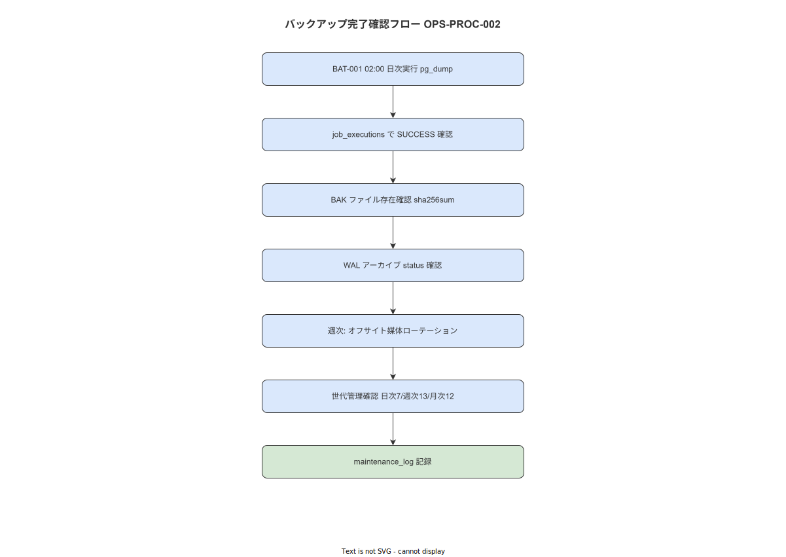

# 02 バックアップ運用と完了確認（OPS-PROC-002）

本手順書の責務はバックアップの完了状態・世代管理・媒体ローテーションを確定することである。上流要件 NFR-OPS-030〜033/045（`docs/04_概要設計/08_運用方式設計/07_アカウント・変更管理と運用手順.md`）を手順に具体化する。IPA 共通フレーム 2013「4.2.1.c 業務及びシステムの運用」に準拠する。

---

**図 1: バックアップ運用フロー**



> 原本: [`img/fig_ops_backup_flow.drawio`](img/fig_ops_backup_flow.drawio)

## 1. 目的と上流要件

| 属性 | 内容 |
|---|---|
| **手順 ID** | OPS-PROC-002 |
| **頻度** | 毎日（完了確認）/ 週次（媒体ローテーション・月 4 回） |
| **想定所要時間** | 日次確認 P50: 5 分 / P95: 15 分 / 週次媒体移動 P50: 20 分 / P95: 40 分 |
| **実施権限** | system_admin（必須） |

上流要件:
- NFR-OPS-030: 日次 02:00 に PostgreSQL pg_dump を AES-256-GCM で暗号化して実行すること（BAT-001）
- NFR-OPS-031: WAL アーカイブを 5 分間隔で継続すること（BAT-002）
- NFR-OPS-032: 日次 7 世代・週次 13 世代・月次 12 世代の世代管理を維持すること
- NFR-OPS-033: 暗号化鍵はバックアップファイルと分離して管理すること
- NFR-OPS-045: バックアップ専用ストレージの使用率を 85% 以下に維持すること

**本節で確定した方針**
- 日次バックアップ完了確認を毎日実施することを確定する。
- 週次媒体ローテーションを毎週月曜（週次ヘルスチェック OPS-PROC-001 実施後）に実施することを確定する。
- バックアップファイルの暗号化鍵は別途 KEY-002 で管理し、バックアップファイルと同一ディレクトリに置かないことを確定する。

---

## 2. 前提条件チェックリスト

以下をすべて確認してから手順を開始する。1 つでも NG なら手順を開始しない。

- [ ] system_admin として認証済みのターミナルセッションが確立されている
- [ ] `/backup/db/` ディレクトリが存在しマウントされている
- [ ] `docker compose exec postgres` コマンドが使用可能である
- [ ] KEY-002（バックアップ暗号化鍵）の参照先パスが利用可能である
- [ ] 週次媒体ローテーション実施時はオフサイト媒体（外付け HDD）が接続されている

**本節で確定した方針**
- 前提条件チェックリストに 1 つでも NG がある場合は手順を開始しないことを確定する。

---

## 3. 事前準備

- [CMD]
  ```bash
  export WNAV_BACKUP_DATE=$(date +%Y-%m-%d)
  echo "=== Backup Confirmation: ${WNAV_BACKUP_DATE} ==="
  # バックアップディレクトリの確認
  ls -lh /backup/db/ | tail -20
  ```

- [CHECK] `/backup/db/` に当日付のファイルが存在することを事前に確認する。

**本節で確定した方針**
- 事前にバックアップディレクトリの存在と最新ファイルの有無を確認することを確定する。

---

## 4. 実施手順

以下の操作タグを使用する。
- `[CMD]` シェルコマンド（WSL2 + bash）
- `[SQL]` PostgreSQL クエリ（psql 経由）
- `[PS]` PowerShell（IIS / Windows Server 操作）
- `[GUI]` ブラウザ / Grafana / 管理 UI 操作
- `[CHECK]` 確認・検証操作

### 4.1 ステップ 1: CHK-007 — BAT-001 完了確認（日次 pg_dump）

- [SQL]
  ```sql
  SELECT job_id, status, started_at, finished_at, error_detail,
         EXTRACT(EPOCH FROM (finished_at - started_at)) AS duration_sec
  FROM job_executions
  WHERE job_id = 'BAT-001'
  ORDER BY started_at DESC
  LIMIT 3;
  ```

- [CHECK] 最新行の `status = 'SUCCESS'` かつ `error_detail IS NULL` であること。
  `finished_at` が前日 02:00〜03:00 の範囲内であること。

### 4.2 ステップ 2: バックアップファイルの物理存在確認

- [CMD]
  ```bash
  # 最新バックアップファイル一覧
  ls -lh /backup/db/*.dump.gz.enc | tail -10

  # 最新ファイルの SHA256 チェック
  LATEST=$(ls -t /backup/db/*.dump.gz.enc | head -1)
  echo "Latest: ${LATEST}"
  sha256sum "${LATEST}"

  # SHA256 チェックファイルと照合
  sha256sum -c /backup/db/latest.sha256 && echo "SHA256: OK" || echo "SHA256: MISMATCH"
  ```

- [CHECK] exit 0 かつ SHA256 が一致すること。ファイルサイズが前回比 50% 以下または 200% 以上の場合は異常として記録する。

### 4.3 ステップ 3: CHK-008 — WAL アーカイブ確認（BAT-002）

- [SQL]
  ```sql
  -- WAL アーカイブ最新確認
  SELECT job_id, status, started_at, finished_at
  FROM job_executions
  WHERE job_id = 'BAT-002'
  ORDER BY started_at DESC
  LIMIT 5;
  ```

- [CMD]
  ```bash
  # archive_status ディレクトリ確認（Docker 内部）
  docker compose -f /opt/wnav/docker-compose.yml exec postgres \
    bash -c "ls -lt /var/lib/postgresql/data/pg_wal/archive_status/ | head -10"
  ```

- [CHECK] BAT-002 の最新実行が `SUCCESS` かつ 10 分以内に完了していること。
  `archive_status/` に `.ready` ファイルが残留していないこと（残留は未アーカイブを示す）。

### 4.4 ステップ 4: 世代管理確認

- [CMD]
  ```bash
  # 日次（7 世代: 過去 7 日分）
  echo "=== Daily backups (expect: 7) ==="
  ls /backup/db/daily/*.dump.gz.enc 2>/dev/null | wc -l

  # 週次（13 世代: 過去 13 週分）
  echo "=== Weekly backups (expect: 13) ==="
  ls /backup/db/weekly/*.dump.gz.enc 2>/dev/null | wc -l

  # 月次（12 世代: 過去 12 ヶ月分）
  echo "=== Monthly backups (expect: 12) ==="
  ls /backup/db/monthly/*.dump.gz.enc 2>/dev/null | wc -l
  ```

- [CHECK] 日次 ≤ 7、週次 ≤ 13、月次 ≤ 12 の世代数であること。
  超過している場合は古い世代を削除する（§4.5 参照）。

### 4.5 ステップ 5: 古い世代の削除（超過時のみ）

- [CMD]
  ```bash
  # 日次: 8 日以上前のファイルを削除
  find /backup/db/daily -name "*.dump.gz.enc" -mtime +7 -exec rm -v {} \;

  # 週次: 14 週以上前のファイルを削除
  find /backup/db/weekly -name "*.dump.gz.enc" -mtime +91 -exec rm -v {} \;

  # 月次: 13 ヶ月以上前のファイルを削除
  find /backup/db/monthly -name "*.dump.gz.enc" -mtime +365 -exec rm -v {} \;
  ```

- [CHECK] 削除後の世代数が上限以内であることを再確認する。

### 4.6 ステップ 6: 週次オフサイト媒体ローテーション（週次実施時のみ）

- [CMD]
  ```bash
  # マウント確認
  ls /mnt/offsite/ || { echo "Offsite media not mounted"; exit 1; }

  # 週次バックアップをオフサイト媒体にコピー
  WEEKLY_BACKUP=$(ls -t /backup/db/weekly/*.dump.gz.enc | head -1)
  echo "Copying: ${WEEKLY_BACKUP}"
  cp -v "${WEEKLY_BACKUP}" /mnt/offsite/wnav/
  sha256sum "${WEEKLY_BACKUP}" > /mnt/offsite/wnav/$(basename "${WEEKLY_BACKUP}").sha256
  sync
  ```

- [CHECK] コピー後に SHA256 を照合し、オフサイト側で一致することを確認する。

  ```bash
  sha256sum -c /mnt/offsite/wnav/$(basename "${WEEKLY_BACKUP}").sha256
  ```

- [CMD] オフサイト媒体の安全な取り外し
  ```bash
  umount /mnt/offsite/
  echo "Offsite media unmounted. Please physically remove and store securely."
  ```

**本節で確定した方針**
- CHK-007/008 の両方が合格でなければバックアップ確認完了と見なさないことを確定する。
- オフサイト媒体は SHA256 照合後に取り外し、施錠保管することを確定する。

---

## 5. 合格基準

| CHK-ID | 基準 | 合否 |
|---|---|---|
| CHK-007 | BAT-001 最新実行が `SUCCESS` かつ `error_detail IS NULL` かつ 25h 以内 | ☐ |
| CHK-008 | BAT-002 最新実行が `SUCCESS` かつ 10 分以内 かつ `.ready` ファイル残留なし | ☐ |
| CHK-009 | SHA256 チェックが一致 かつ 世代数が上限以内 | ☐ |

全 CHK が合格でバックアップ確認完了とする。

**本節で確定した方針**
- SHA256 チェックが不一致の場合は即時に system_admin に通知しバックアップの再実行を即時に実施することを確定する。

---

## 6. 異常時の判断

| 事象 | 打ち切り条件 | 通知先 | 代替手順 |
|---|---|---|---|
| BAT-001 が FAILED | 即時打ち切り | system_admin | 手動 pg_dump を即時実行（§6.1 参照） |
| SHA256 ミスマッチ | 即時打ち切り | system_admin | バックアップファイルを隔離し再 dump を実施 |
| WAL アーカイブ遅延（.ready 残留） | 継続（記録必須） | system_admin | PostgreSQL archive_command を手動実行 |
| ディスク使用率 > 85% | 継続（記録必須） | system_admin | §4.5 の古い世代削除を優先実施 |
| オフサイト媒体が認識されない | 週次手順を打ち切り | system_admin | 翌日に媒体接続を再試行 |

**§6.1 手動 pg_dump（緊急時）**

- [CMD]
  ```bash
  DUMP_FILE="/backup/db/daily/wnav-emergency-$(date +%Y%m%d%H%M%S).dump.gz"
  docker compose -f /opt/wnav/docker-compose.yml exec postgres \
    pg_dump -U work_nav -Fc work_navigation \
    | gzip > "${DUMP_FILE}"

  # 暗号化
  openssl enc -aes-256-gcm -salt \
    -kfile /etc/wnav/keys/backup-key.bin \
    -in "${DUMP_FILE}" \
    -out "${DUMP_FILE}.enc"
  sha256sum "${DUMP_FILE}.enc" > "${DUMP_FILE}.enc.sha256"
  rm "${DUMP_FILE}"  # 非暗号化ファイルを削除
  echo "Emergency dump: ${DUMP_FILE}.enc"
  ```

**本節で確定した方針**
- BAT-001 が FAILED の場合は手動 pg_dump を 4 時間以内に実施することを確定する。

---

## 7. 終了条件と記録

- [SQL] maintenance_log への INSERT
  ```sql
  INSERT INTO maintenance_log (log_type, executed_at, executed_by, detail)
  VALUES (
    'backup_confirmation',
    NOW(),
    'system_admin',
    '{"result": "pass", "chk_007": "pass", "chk_008": "pass", "chk_009": "pass", "offsite_rotation": false}'
  );
  ```

  週次媒体ローテーション実施時は `"offsite_rotation": true` に変更する。

**本節で確定した方針**
- `maintenance_log` への記録なしにバックアップ確認完了と見なさないことを確定する。

---

## 8. ロールバック / 代替手順

バックアップ完了確認手順はロールバック不要の読み取り専用操作が大半である。
手動 pg_dump（§6.1）は元の BAT-001 ジョブを上書きしない独立ファイルとして出力するため、ロールバックは不要である。

**本節で確定した方針**
- 手動 pg_dump は既存バックアップを上書きしない独立ファイル名を使用することを確定する。

---

## 9. 関連識別子・改訂履歴

| 属性 | 内容 |
|---|---|
| **関連 BAT** | BAT-001（日次 pg_dump）、BAT-002（WAL アーカイブ） |
| **関連 ALERT** | ALERT-003（バックアップ失敗）、ALERT-005（ディスク使用率超過） |
| **関連 ERR** | — |
| **関連 KEY** | KEY-002（バックアップ暗号化鍵） |
| **関連 ADR-IMPL** | — |
| **初版** | 2026-05-18 RyuheiKiso |

---

## 参照業界分析

### 必須
- IPA 共通フレーム 2013 SLCP-JCF2013 4.2.1.c（業務及びシステムの運用）

### 関連
- PostgreSQL 公式ドキュメント「25. Backup and Restore」（WAL アーカイブ・PITR）
- NIST SP 800-34 Rev.1「Contingency Planning Guide for Federal Information Systems」§3.4（バックアップ戦略）
- IPA「クラウドサービス安全利用の手引き」バックアップ管理編
- NFR-OPS-030〜033、NFR-OPS-045（本プロジェクト要件定義）
