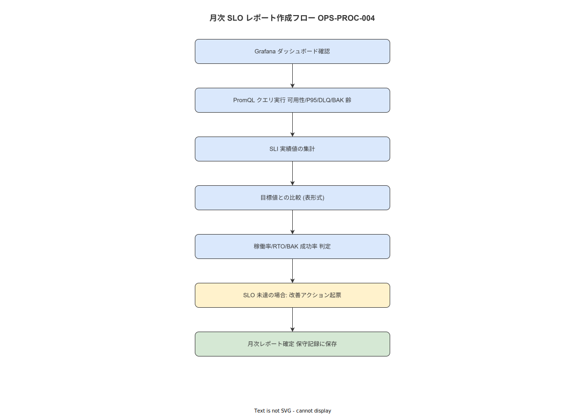

# 04 月次 SLO レポート作成手順（OPS-PROC-004）

本手順書の責務は月次 SLO 達成状況を計測・報告し SLO 評価を確定することである。上流要件 NFR-OPS-053・NFR-AVL-001/008/009（`docs/04_概要設計/08_運用方式設計/07_アカウント・変更管理と運用手順.md`）を手順に具体化する。IPA 共通フレーム 2013「4.2.1.c 業務及びシステムの運用」に準拠する。

---

**図 1: SLO レポート作成フロー**



> 原本: [`img/fig_ops_slo_report.drawio`](img/fig_ops_slo_report.drawio)

## 1. 目的と上流要件

| 属性 | 内容 |
|---|---|
| **手順 ID** | OPS-PROC-004 |
| **頻度** | 月次（月末最終営業日） |
| **想定所要時間** | P50: 20 分 / P95: 45 分 |
| **実施権限** | system_admin（必須）/ quality_admin（SLO 判定の独立確認） |

上流要件:
- NFR-OPS-053: 月次で SLO 達成状況を計測・記録・報告すること
- NFR-AVL-001: API エンドポイントの可用性 ≥ 99.5%（計画停止除外）を保証すること
- NFR-AVL-008: Step 完了イベント POST の P95 レイテンシ ≤ 200ms を保証すること
- NFR-AVL-009: Outbox イベント配信遅延 ≤ 5 分を保証すること

**本節で確定した方針**
- 月次 SLO レポートは月末最終営業日に実施することを確定する。
- SLO 未達の場合は翌月の改善アクション計画を同日中に作成することを確定する。
- quality_admin がレポートの独立確認を実施することを確定する。

---

## 2. 前提条件チェックリスト

以下をすべて確認してから手順を開始する。1 つでも NG なら手順を開始しない。

- [ ] Prometheus（http://localhost:9090）にアクセス可能である
- [ ] Grafana（http://localhost:3000）にアクセス可能である
- [ ] 直近 30 日分の Prometheus メトリクスが保持されている（`storage.tsdb.retention.time ≥ 30d`）
- [ ] psql コマンドが使用可能である
- [ ] 前月の `maintenance_log` にリストア検証・週次ヘルスチェック記録が存在する

**本節で確定した方針**
- 前提条件チェックリストに 1 つでも NG がある場合は手順を開始しないことを確定する。

---

## 3. 事前準備

- [CMD]
  ```bash
  export SLO_MONTH=$(date -d "$(date +%Y-%m-01) -1 day" '+%Y-%m')
  export SLO_REPORT_DIR="/opt/wnav/reports/slo"
  mkdir -p "${SLO_REPORT_DIR}"
  export SLO_REPORT_FILE="${SLO_REPORT_DIR}/slo-report-${SLO_MONTH}.md"
  echo "SLO Report for: ${SLO_MONTH}"
  echo "Output: ${SLO_REPORT_FILE}"
  ```

- [CMD] Prometheus の保持期間確認
  ```bash
  curl -s http://localhost:9090/api/v1/status/tsdb | jq '.data.headStats'
  ```

**本節で確定した方針**
- SLO 計測対象月は前月（YYYY-MM 形式）とすることを確定する。

---

## 4. 実施手順

以下の操作タグを使用する。
- `[CMD]` シェルコマンド（WSL2 + bash）
- `[SQL]` PostgreSQL クエリ（psql 経由）
- `[PS]` PowerShell（IIS / Windows Server 操作）
- `[GUI]` ブラウザ / Grafana / 管理 UI 操作
- `[CHECK]` 確認・検証操作

### 4.1 ステップ 1: SLI-1 — API 可用性計測（PromQL）

Prometheus Query API を使用して計測する。

- [CMD]
  ```bash
  # 可用性クエリ（計画停止を除外）
  AVAIL=$(curl -sG http://localhost:9090/api/v1/query \
    --data-urlencode 'query=(sum_over_time(up{job="api"}[30d]) - sum_over_time(ALERTS{alertname="planned_maintenance",alertstate="firing"}[30d])) / count_over_time(up{job="api"}[30d]) * 100' \
    | jq -r '.data.result[0].value[1]' 2>/dev/null || echo "N/A")
  echo "SLI-1 Availability: ${AVAIL}%"
  ```

- [GUI] Grafana → Work Navigation Overview ダッシュボード → 「Availability (30d)」パネルで視覚的に確認する。

- [CHECK] 取得した可用性値が実績として適切な範囲（0〜100%）であることを確認する。

### 4.2 ステップ 2: SLI-2 — Step 完了 P95 レイテンシ計測（PromQL）

- [CMD]
  ```bash
  LATENCY_P95=$(curl -sG http://localhost:9090/api/v1/query \
    --data-urlencode 'query=histogram_quantile(0.95, sum by (le) (rate(api_step_event_post_duration_bucket[30d]))) * 1000' \
    | jq -r '.data.result[0].value[1]' 2>/dev/null || echo "N/A")
  echo "SLI-2 Step P95 Latency: ${LATENCY_P95}ms"
  ```

- [CHECK] 値が数値として取得できていること。

### 4.3 ステップ 3: SLI-3 — Outbox 遅延最大値計測（PromQL）

- [CMD]
  ```bash
  OUTBOX_MAX=$(curl -sG http://localhost:9090/api/v1/query \
    --data-urlencode 'query=max_over_time(outbox_delay_minutes[30d])' \
    | jq -r '.data.result[0].value[1]' 2>/dev/null || echo "N/A")
  echo "SLI-3 Outbox Max Delay: ${OUTBOX_MAX}min"
  ```

- [SQL]
  ```sql
  -- 補助: DB から Outbox 滞留の最大値を確認
  SELECT max(EXTRACT(EPOCH FROM (NOW() - created_at)) / 60) AS max_delay_min
  FROM outbox_events
  WHERE status IN ('pending', 'processing')
    AND created_at >= NOW() - INTERVAL '30 days';
  ```

### 4.4 ステップ 4: SLI-4 — バックアップ齢最大値計測（PromQL）

- [CMD]
  ```bash
  BACKUP_AGE=$(curl -sG http://localhost:9090/api/v1/query \
    --data-urlencode 'query=max_over_time(backup_age_hours[30d])' \
    | jq -r '.data.result[0].value[1]' 2>/dev/null || echo "N/A")
  echo "SLI-4 Backup Max Age: ${BACKUP_AGE}h"
  ```

- [SQL]
  ```sql
  -- 補助: maintenance_log から月次バックアップ確認記録を集計
  SELECT count(*) AS confirmed_days,
         min(executed_at) AS first_check,
         max(executed_at) AS last_check
  FROM maintenance_log
  WHERE log_type = 'backup_confirmation'
    AND executed_at >= date_trunc('month', NOW() - INTERVAL '1 month')
    AND executed_at < date_trunc('month', NOW());
  ```

- [CHECK] `confirmed_days` が月の営業日数と一致することを確認する（未確認日がある場合は記録）。

### 4.5 ステップ 5: SLO レポート作成

- [CMD] レポートファイルを生成する
  ```bash
  cat > "${SLO_REPORT_FILE}" << EOF
# SLO 月次レポート: ${SLO_MONTH}

作成日: $(date '+%Y-%m-%d')
作成者: system_admin

## SLO 達成状況

| SLI | 目標 | 実績 | 判定 |
|---|---|---|---|
| 可用性（計画停止除外） | ≥ 99.5% | ${AVAIL}% | $(awk "BEGIN {print (${AVAIL:-0} >= 99.5) ? \"PASS\" : \"FAIL\"}") |
| Step 完了 P95 レイテンシ | ≤ 200ms | ${LATENCY_P95}ms | $(awk "BEGIN {print (${LATENCY_P95:-9999} <= 200) ? \"PASS\" : \"FAIL\"}") |
| Outbox 遅延最大値 | ≤ 5min | ${OUTBOX_MAX}min | $(awk "BEGIN {print (${OUTBOX_MAX:-9999} <= 5) ? \"PASS\" : \"FAIL\"}") |
| バックアップ齢最大値 | ≤ 25h | ${BACKUP_AGE}h | $(awk "BEGIN {print (${BACKUP_AGE:-9999} <= 25) ? \"PASS\" : \"FAIL\"}") |

## 週次ヘルスチェック実施記録

EOF

  # maintenance_log から週次チェック記録を取得して追記
  psql -U work_nav -d work_navigation -t -c \
    "SELECT executed_at, detail FROM maintenance_log WHERE log_type = 'weekly_health_check' AND executed_at >= date_trunc('month', NOW() - INTERVAL '1 month') AND executed_at < date_trunc('month', NOW()) ORDER BY executed_at;" \
    >> "${SLO_REPORT_FILE}"

  echo "Report saved: ${SLO_REPORT_FILE}"
  ```

### 4.6 ステップ 6: SLO 未達時のアクション計画（SLO 未達時のみ）

いずれかの SLI が目標未達の場合、以下を実施する。

- [CMD]
  ```bash
  cat >> "${SLO_REPORT_FILE}" << EOF

## 改善アクション計画（未達 SLI 分）

| SLI | 未達原因 | 改善アクション | 期限 |
|---|---|---|---|
| （未達 SLI を記入） | （原因を記入） | （アクションを記入） | （翌月末） |
EOF
  ```

**本節で確定した方針**
- PromQL クエリは §4.1〜4.4 の順序で実施することを確定する。
- SLO 未達の場合は即日アクション計画を作成することを確定する。

---

## 5. 合格基準

| CHK-ID | 基準 | 合否 |
|---|---|---|
| SLO-1 | 可用性 ≥ 99.5% | ☐ |
| SLO-2 | Step 完了 P95 ≤ 200ms | ☐ |
| SLO-3 | Outbox 遅延最大値 ≤ 5 分 | ☐ |
| SLO-4 | バックアップ齢最大値 ≤ 25 時間 | ☐ |
| SLO-5 | SLO レポートファイルが生成・保存されている | ☐ |

**本節で確定した方針**
- SLO-5（レポートファイル生成）は必須とし、SLO-1〜4 は実績値を記録することを確定する。

---

## 6. 異常時の判断

| 事象 | 打ち切り条件 | 通知先 | 代替手順 |
|---|---|---|---|
| Prometheus が応答しない | 継続（DB クエリで代替計測） | system_admin | SQL による代替計測（§4.3/4.4 の SQL クエリを使用） |
| 可用性 < 99.0% | 打ち切りなし（FAIL 記録・アクション計画必須） | system_admin・quality_admin | 可用性低下原因を OPS-PROC-001 ログから特定 |
| メトリクスデータ欠損（>1 時間） | 継続（欠損期間を明記） | system_admin | 欠損期間を UNKNOWN として記録 |

**本節で確定した方針**
- Prometheus 障害時は SQL による代替計測で SLO レポートを完成させることを確定する。

---

## 7. 終了条件と記録

- [SQL] maintenance_log への INSERT
  ```sql
  INSERT INTO maintenance_log (log_type, executed_at, executed_by, detail)
  VALUES (
    'slo_report',
    NOW(),
    'system_admin',
    '{"result": "pass", "month": "2026-04", "availability": 99.8, "latency_p95_ms": 145, "outbox_max_delay_min": 2, "backup_age_max_h": 23, "report_path": "/opt/wnav/reports/slo/slo-report-2026-04.md"}'
  );
  ```

**本節で確定した方針**
- `maintenance_log` への記録なしに月次 SLO レポート完了と見なさないことを確定する。

---

## 8. ロールバック / 代替手順

本手順書は計測・報告（読み取り専用）であるためロールバックは発生しない。

**本節で確定した方針**
- 月次 SLO レポート作成はロールバック不要の計測・報告手順であることを確定する。

---

## 9. 関連識別子・改訂履歴

| 属性 | 内容 |
|---|---|
| **関連 BAT** | BAT-001（日次バックアップ齢メトリクスの根拠） |
| **関連 ALERT** | ALERT-001〜005（月次集計対象） |
| **関連 ERR** | — |
| **関連 KEY** | — |
| **関連 ADR-IMPL** | — |
| **初版** | 2026-05-18 RyuheiKiso |

---

## 参照業界分析

### 必須
- IPA 共通フレーム 2013 SLCP-JCF2013 4.2.1.c（業務及びシステムの運用）

### 関連
- Google SRE Book「Chapter 4: Service Level Objectives」（SLO/SLI/Error Budget 概念）
- Prometheus 公式ドキュメント「Querying / Functions」（PromQL histogram_quantile）
- NFR-OPS-053、NFR-AVL-001/008/009（本プロジェクト要件定義）
