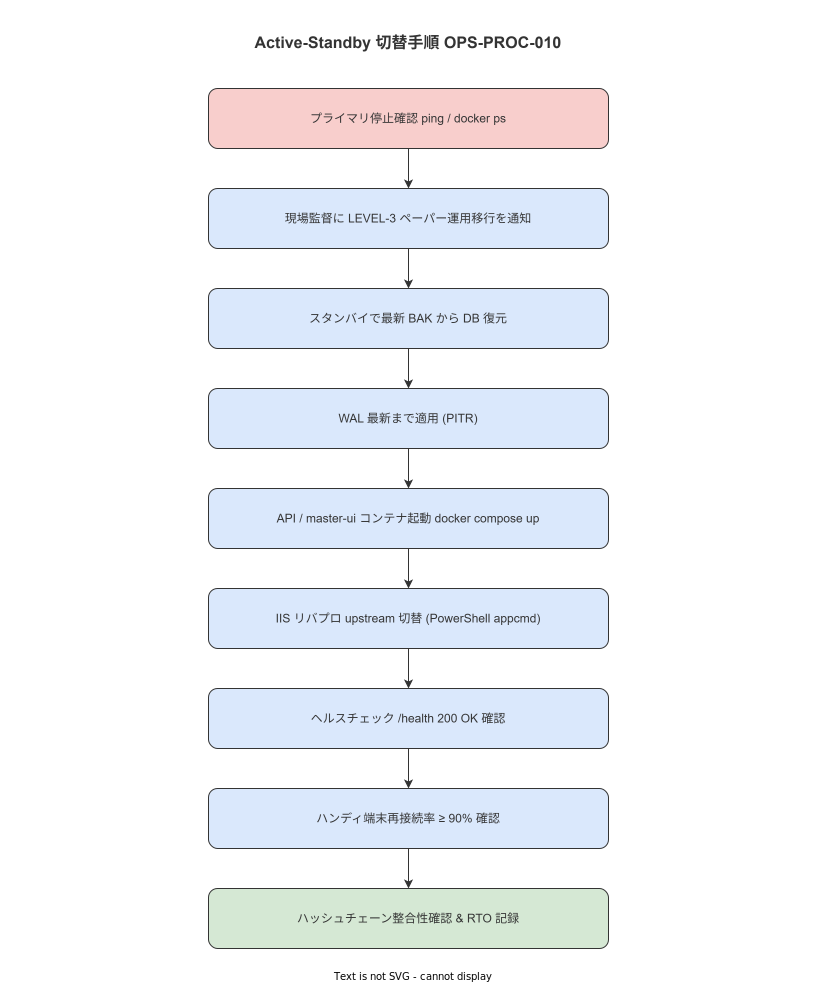

# 10 Active-Standby 切替手順（OPS-PROC-010）

本手順書の責務はプライマリ障害発生時に Standby 環境への切替を完了し RTO を確定することである。上流要件 NFR-OPS-049・NFR-AVL-002/011（`docs/04_概要設計/08_運用方式設計/07_アカウント・変更管理と運用手順.md`）を手順に具体化する。IPA 共通フレーム 2013「4.2.1.c 業務及びシステムの運用」に準拠する。

---

**図 1: Active-Standby フェイルオーバーフロー**



> 原本: [`img/fig_ops_failover.drawio`](img/fig_ops_failover.drawio)

## 1. 目的と上流要件

| 属性 | 内容 |
|---|---|
| **手順 ID** | OPS-PROC-010 |
| **頻度** | イベント駆動（プライマリ障害発生時） |
| **想定所要時間** | P50: 40 分 / P95: 60 分（RTO 上限） |
| **実施権限** | system_admin（必須） |

上流要件:
- NFR-OPS-049: Active-Standby 構成への切替手順を整備し RTO ≤ 60 分を保証すること
- NFR-AVL-002: システム全体の RTO ≤ 60 分を保証すること
- NFR-AVL-011: Standby 切替後のデータ整合性（ハッシュチェーン連続性）を確認すること

**本節で確定した方針**
- Standby 切替の RTO は T0（プライマリ停止確認）から T1（Standby ヘルスチェック合格）までを計測することを確定する。
- RTO > 60 分は未達として `maintenance_log` に記録し翌日に原因調査を実施することを確定する。
- ハッシュチェーン整合性確認が合格しなければ業務開始を許可しないことを確定する。

---

## 2. 前提条件チェックリスト

以下をすべて確認してから手順を開始する。1 つでも NG なら手順を開始しない。

- [ ] プライマリの停止が確認されている（`ping` 失敗 + Docker ps が全停止）
- [ ] Standby ホストの電源が入っており SSH / WSL2 でアクセス可能である
- [ ] Standby ホストに `/backup/db/` がマウントされ最新バックアップが存在する
- [ ] KEY-002（バックアップ復号鍵）が Standby ホストの `/etc/wnav/keys/` に存在する
- [ ] Standby ホストのポート 8080/5432/9090/3000 が未使用である

**本節で確定した方針**
- 前提条件チェックリストに 1 つでも NG がある場合は手順を開始しないことを確定する。

---

## 3. 事前準備

- [CMD]
  ```bash
  T0=$(date +%s)
  echo "FAILOVER_START=$(date -d @${T0} '+%Y-%m-%d %H:%M:%S')" | tee /tmp/failover-$(date +%Y%m%d%H%M).log

  # Standby ホストでの作業
  export STANDBY_HOST="wnav-standby"
  export WNAV_RESTORE_DIR="/tmp/failover-$(date +%Y%m%d)"
  mkdir -p "${WNAV_RESTORE_DIR}"
  ```

- [CHECK] プライマリの完全停止を確認する。
  ```bash
  # プライマリ停止確認
  ping -c 3 wnav-primary 2>&1 | grep -E 'packets transmitted|timeout' | tee -a /tmp/failover-$(date +%Y%m%d%H%M).log
  ```

**本節で確定した方針**
- T0 のタイムスタンプをログに記録してから切替手順を開始することを確定する。

---

## 4. 実施手順

以下の操作タグを使用する。
- `[CMD]` シェルコマンド（WSL2 + bash）
- `[SQL]` PostgreSQL クエリ（psql 経由）
- `[PS]` PowerShell（IIS / Windows Server 操作）
- `[GUI]` ブラウザ / Grafana / 管理 UI 操作
- `[CHECK]` 確認・検証操作

### 4.1 ステップ 1: プライマリ停止確認

- [CMD]
  ```bash
  # ping による到達確認
  ping -c 5 wnav-primary > /dev/null 2>&1 && echo "PRIMARY: UP (abort)" || echo "PRIMARY: DOWN (proceed)"

  # Docker Desktop / WSL2 プロセス確認（Windows ホスト側）
  ```

- [PS]
  ```powershell
  # プライマリ Windows ホストへのリモート確認（WMI）
  Test-NetConnection -ComputerName wnav-primary -Port 8080 |
    Select-Object ComputerName, RemotePort, TcpTestSucceeded
  ```

- [CHECK] `TcpTestSucceeded = False` であること。True の場合は切替を中断しプライマリ復旧を優先する。

### 4.2 ステップ 2: 最新バックアップから DB 復元

OPS-PROC-003 §4.2〜4.4 と同一の手順で Standby に DB を復元する。

- [CMD]
  ```bash
  # 最新バックアップの確認
  BACKUP_ENC=$(ls -t /backup/db/daily/*.dump.gz.enc | head -1)
  echo "Restoring from: ${BACKUP_ENC}"
  sha256sum -c /backup/db/latest.sha256 && echo "SHA256: OK"

  # AES-256-GCM 復号
  openssl enc -d -aes-256-gcm \
    -kfile /etc/wnav/keys/backup-key.bin \
    -in "${BACKUP_ENC}" \
    -out "${WNAV_RESTORE_DIR}/restore.dump.gz"
  gunzip -c "${WNAV_RESTORE_DIR}/restore.dump.gz" > "${WNAV_RESTORE_DIR}/restore.dump"
  ```

- [CMD] PostgreSQL を Standby で起動して復元
  ```bash
  cd /opt/wnav
  docker compose up -d postgres
  for i in $(seq 1 12); do
    pg_isready -h localhost -p 5432 -U work_nav && break
    sleep 5
  done

  # データベース作成とリストア
  docker compose exec postgres psql -U work_nav -c "CREATE DATABASE work_navigation;"
  docker compose exec -T postgres \
    pg_restore -U work_nav -d work_navigation --no-owner --no-acl \
    < "${WNAV_RESTORE_DIR}/restore.dump"
  ```

- [CHECK] `pg_restore` が exit 0 かつ error なしで完了すること。

### 4.3 ステップ 3: WAL 最新まで適用（PITR）

- [CMD]
  ```bash
  # WAL アーカイブをコピー（オフサイト媒体または NAS から）
  cp -r /backup/wal/ "${WNAV_RESTORE_DIR}/wal/"

  # PITR 設定
  docker compose exec postgres bash -c "
    cat > /var/lib/postgresql/data/recovery.conf << 'EOF'
restore_command = 'cp /wal/%f %p'
recovery_target_action = 'promote'
EOF
  "
  docker compose restart postgres
  sleep 30
  pg_isready -h localhost -p 5432 -U work_nav
  ```

- [CHECK] `pg_isready` が `accepting connections` を返すこと。

### 4.4 ステップ 4: API / master-ui / 監視コンテナ起動

- [CMD]
  ```bash
  cd /opt/wnav
  docker compose up -d api master-ui prometheus grafana
  sleep 20

  # 全コンテナの起動確認
  docker compose ps
  curl -fsS http://localhost:8080/health | jq .
  ```

- [CHECK] 全コンテナが `running` / `Up` であること。
  API が `{"status":"ok"}` を返すこと。

### 4.5 ステップ 5: IIS リバプロ upstream 切替

- [PS]
  ```powershell
  Import-Module WebAdministration

  # upstream を Standby の API に切替
  Set-WebConfigurationProperty `
    -PSPath 'IIS:\Sites\wnav' `
    -Filter "/system.webServer/proxy/upstreams/upstream[@name='backend']" `
    -Name 'address' `
    -Value 'http://wnav-standby:8080'

  # IIS を再起動（graceful）
  iisreset /noforce

  Write-Host "IIS upstream switched to Standby"
  ```

- [CHECK] `http://wnav-standby/health` が IIS 経由で 200 を返すこと。

### 4.6 ステップ 6: ハンディ端末再接続確認

- [SQL]
  ```sql
  -- ハンディ端末が Standby に接続し Outbox イベントを送信しているか確認
  SELECT count(*) AS recent_events
  FROM outbox_events
  WHERE created_at >= NOW() - INTERVAL '5 minutes';
  ```

- [CHECK] 現場のハンディ端末 1 台以上が接続されており `recent_events > 0` であること。
  接続されていない場合は端末側の API エンドポイント設定を手動で更新する。

### 4.7 ステップ 7: Outbox フラッシュ完了確認

- [SQL]
  ```sql
  SELECT count(*) AS pending FROM outbox_events WHERE status = 'pending';
  SELECT count(*) AS dlq FROM outbox_dlq;
  ```

- [CHECK] `pending` が安定（増減していない場合は処理中）であること。
  `dlq = 0` であること。

### 4.8 ステップ 8: ハッシュチェーン整合性確認

- [SQL]
  ```sql
  SELECT
    sum(CASE WHEN NOT hash_chain_valid THEN 1 ELSE 0 END) AS invalid_count,
    count(*) AS total_count
  FROM (
    SELECT
      (prev_hash = LAG(content_hash) OVER (PARTITION BY entity_type ORDER BY created_at)
       OR LAG(content_hash) OVER (PARTITION BY entity_type ORDER BY created_at) IS NULL) AS hash_chain_valid
    FROM audit_logs
  ) sub;
  ```

- [CHECK] `invalid_count = 0` であること。0 でない場合は業務開始を許可せず調査を優先する。

### 4.9 ステップ 9: RTO 計測終了と業務再開宣言

- [CMD]
  ```bash
  T1=$(date +%s)
  RTO_SEC=$((T1 - T0))
  RTO_MIN=$(echo "scale=1; ${RTO_SEC}/60" | bc)
  echo "FAILOVER_END=$(date -d @${T1} '+%Y-%m-%d %H:%M:%S')" | tee -a /tmp/failover-$(date +%Y%m%d%H%M).log
  echo "RTO_SEC=${RTO_SEC}" | tee -a /tmp/failover-$(date +%Y%m%d%H%M).log
  echo "RTO_RESULT=$([ ${RTO_SEC} -le 3600 ] && echo PASS || echo FAIL)" | tee -a /tmp/failover-$(date +%Y%m%d%H%M).log
  ```

- [CMD] 業務再開通知
  ```bash
  /opt/wnav/bin/notify-maintenance \
    --type "failover_complete" \
    --message "Standby 切替が完了しました。業務を再開してください。RTO: ${RTO_MIN}分"
  ```

**本節で確定した方針**
- ステップ 8（ハッシュチェーン整合性）が合格するまで業務再開宣言を行わないことを確定する。
- RTO 計測結果は PASS/FAIL を問わず `maintenance_log` に記録することを確定する。

---

## 5. 合格基準

| CHK-ID | 基準 | 合否 |
|---|---|---|
| FAIL-1 | プライマリが完全停止確認（ping 失敗・TCP 失敗） | ☐ |
| FAIL-2 | Standby で `pg_restore` が error なしで完了 | ☐ |
| FAIL-3 | API ヘルスチェックが 200 OK を返す | ☐ |
| FAIL-4 | IIS upstream が Standby に切り替わっている | ☐ |
| FAIL-5 | ハンディ端末が接続し `recent_events > 0` | ☐ |
| FAIL-6 | `outbox_dlq = 0` | ☐ |
| FAIL-7 | ハッシュチェーン `invalid_count = 0` | ☐ |
| FAIL-8 | RTO ≤ 3600 秒（60 分） | ☐ |

全 CHK が合格で Active-Standby 切替完了とする。

**本節で確定した方針**
- FAIL-7（ハッシュチェーン）が FAIL の場合は業務再開を保留することを確定する。

---

## 6. 異常時の判断

| 事象 | 打ち切り条件 | 通知先 | 代替手順 |
|---|---|---|---|
| SHA256 ミスマッチ | 即時打ち切り | system_admin | 別世代バックアップで再試行 |
| pg_restore エラー | 即時打ち切り | system_admin | 前日バックアップで再試行 |
| ハッシュチェーン不整合 | 業務保留（調査優先） | system_admin・quality_admin | 監査ログ調査開始 |
| RTO > 3600 秒 | 打ち切りなし（FAIL 記録） | system_admin | 翌日に RTO 超過原因分析 |
| IIS 切替が失敗 | 継続 | system_admin | nginx リバプロを代替として起動 |

**本節で確定した方針**
- SHA256 ミスマッチ・pg_restore エラーは即時打ち切りとすることを確定する。

---

## 7. 終了条件と記録

- [SQL] maintenance_log への INSERT
  ```sql
  INSERT INTO maintenance_log (log_type, executed_at, executed_by, detail)
  VALUES (
    'active_standby_failover',
    NOW(),
    'system_admin',
    '{"result": "pass", "rto_sec": 2400, "backup_date": "2026-05-18", "hash_chain": "valid", "outbox_dlq": 0, "iis_switched": true}'
  );
  ```

**本節で確定した方針**
- `maintenance_log` への記録なしに切替完了と見なさないことを確定する。

---

## 8. ロールバック / 代替手順

Standby への切替は原則としてロールバックしない（プライマリが停止中のため）。
プライマリが復旧した場合は以下の手順で再切替（Standby → Primary）を実施する。

- [PS]
  ```powershell
  # プライマリ復旧後の IIS 切り戻し
  Set-WebConfigurationProperty `
    -PSPath 'IIS:\Sites\wnav' `
    -Filter "/system.webServer/proxy/upstreams/upstream[@name='backend']" `
    -Name 'address' `
    -Value 'http://wnav-primary:8080'
  iisreset /noforce
  ```

- [SQL] データ同期が必要な場合は Standby で発生したトランザクションを Primary に反映する。
  反映方法は `docs/09_運用・保守/障害対応/` の「データ同期手順」を参照する。

**本節で確定した方針**
- Standby からプライマリへの切り戻し後は OPS-PROC-001 の週次ヘルスチェックを即時実施することを確定する。

---

## 9. 関連識別子・改訂履歴

| 属性 | 内容 |
|---|---|
| **関連 BAT** | BAT-001（切替前の最新バックアップ確認） |
| **関連 ALERT** | ALERT-001（API ダウン：切替トリガー） |
| **関連 ERR** | — |
| **関連 KEY** | KEY-002（バックアップ復号鍵） |
| **関連 ADR-IMPL** | — |
| **初版** | 2026-05-18 RyuheiKiso |

---

## 参照業界分析

### 必須
- IPA 共通フレーム 2013 SLCP-JCF2013 4.2.1.c（業務及びシステムの運用）

### 関連
- IPA「システム高信頼化対策ガイド」第 2 版 §4.3（フェイルオーバー設計）
- Microsoft IIS Application Request Routing 公式ドキュメント（upstream 切替）
- PostgreSQL 公式ドキュメント「26.3. Failover」
- NFR-OPS-049、NFR-AVL-002/011（本プロジェクト要件定義）
