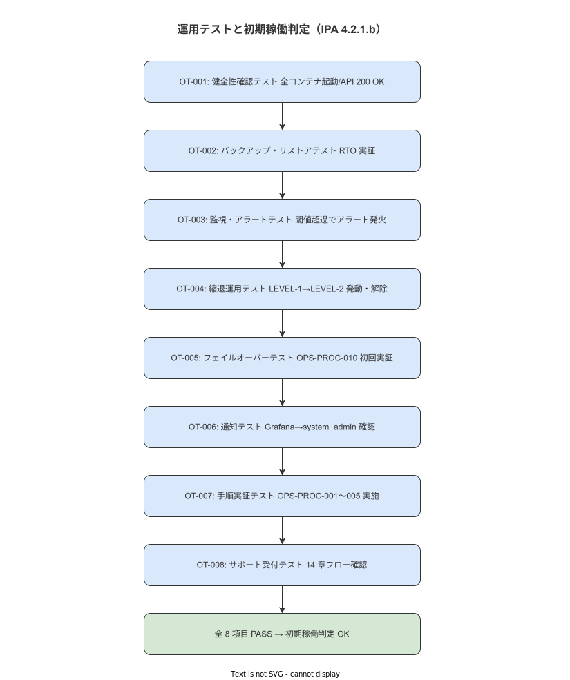

# 13 運用テストと初期稼働判定（IPA 運用テスト）

本文書の責務は初期稼働前の運用テストを実施し稼働判定を確定することである。
IPA 共通フレーム 2013 SLCP-JCF2013「4.2.1.b 運用テスト」に対応する成果物である。

---

**図 1: 運用テスト・初期稼働判定フロー**



> 原本: [`img/fig_ops_acceptance_test.drawio`](img/fig_ops_acceptance_test.drawio)

## 1. 目的と位置づけ

| 属性 | 内容 |
|---|---|
| **対応 IPA タスク** | 4.2.1.b（運用テスト） |
| **実施タイミング** | 本番稼働前（ver 1.0.0 リリース前） |
| **想定所要時間** | P50: 4 時間 / P95: 8 時間（1 日以内） |
| **実施権限** | system_admin（実施）・quality_admin（判定） |

本手順書は 8 項目の運用テストを定義する。
全 8 項目が PASS になった時点で「初期稼働判定 OK」とし、本番稼働（ver 1.0.0 リリース）を許可する。
いずれか 1 項目でも FAIL の場合は稼働を保留し原因解消後に再テストを実施する。

**本節で確定した方針**
- 全 8 項目 PASS を初期稼働判定の唯一の合格基準とすることを確定する。
- quality_admin による独立判定なしに稼働許可を出さないことを確定する。

---

## 2. 前提条件チェックリスト

以下をすべて確認してから運用テストを開始する。1 つでも NG なら開始しない。

- [ ] 全コンテナがステージング環境で起動している
- [ ] ハンディ端末（Android / iOS / Windows）が各 1 台以上接続されている
- [ ] Prometheus / Grafana が稼働しアラートルールが設定されている
- [ ] `maintenance_log` テーブルが存在する
- [ ] OPS-PROC-001〜005 の手順書が完成している
- [ ] quality_admin が当日の判定に参加することを確認している

**本節で確定した方針**
- 前提条件チェックリストに 1 つでも NG がある場合は運用テストを開始しないことを確定する。

---

## 3. 運用テスト項目一覧

| テスト ID | テスト名 | 対応 OPS-PROC | 合否 |
|---|---|---|---|
| OT-001 | 健全性確認テスト | OPS-PROC-001 | ☐ |
| OT-002 | バックアップ・リストアテスト | OPS-PROC-003 | ☐ |
| OT-003 | 監視・アラートテスト | — | ☐ |
| OT-004 | 縮退運用テスト | — | ☐ |
| OT-005 | フェイルオーバーテスト | OPS-PROC-010 | ☐ |
| OT-006 | 通知テスト | — | ☐ |
| OT-007 | 手順実証テスト | OPS-PROC-001〜005 | ☐ |
| OT-008 | サポート受付テスト | 14 章フロー | ☐ |

---

## 4. 各テストの実施手順

### 4.1 OT-001: 健全性確認テスト

**目的:** システム全体が正常起動し OPS-PROC-001 が実施できることを確認する。

- [CMD]
  ```bash
  # 全コンテナ起動確認
  docker compose ps | grep -v "Up" | grep -v "NAME" && echo "WARN: some containers not running"

  # API ヘルスチェック
  curl -fsS http://localhost:8080/health | jq .

  # PostgreSQL 接続
  pg_isready -h localhost -p 5432 -U work_nav

  # Grafana アクセス確認
  curl -fsS http://localhost:3000/api/health | jq .
  ```

- [CHECK] 全コンテナが `Up`、API が `{"status":"ok"}`、PostgreSQL が `accepting connections`、Grafana が `{"database":"ok"}` を返すこと。

**判定: PASS / FAIL**

---

### 4.2 OT-002: バックアップ・リストアテスト

**目的:** OPS-PROC-003（月次リストア検証手順）の初回実証を行い RTO ≤ 60 分を確認する。

OPS-PROC-003 の §4.1〜§4.9 を全ステップ実施する。

- [CHECK] CHK-010〜014 の全項目が PASS であること。
  RTO が 3600 秒（60 分）以内であること。

**判定: PASS / FAIL**

---

### 4.3 OT-003: 監視・アラートテスト

**目的:** Prometheus アラートが正しく発火し Grafana に通知されることを確認する。

- [CMD]（意図的な API 停止によるアラートテスト）
  ```bash
  # API コンテナを一時停止
  docker compose stop api
  echo "API stopped at $(date)"
  sleep 120  # 2 分待機（Prometheus スクレイプ + アラート評価）
  ```

- [GUI] Grafana → Alerting → Alert Rules → `APIDown` アラートが `Firing` になっていることを確認する。
  Grafana の Notification Policy で system_admin への通知が設定されていることを確認する。

- [CMD]（API を再起動してアラート解除を確認）
  ```bash
  docker compose up -d api
  sleep 60
  curl -fsS http://localhost:8080/health | jq .
  ```

- [GUI] Grafana でアラートが `Resolved` に戻ることを確認する。

- [SQL]（意図的なディスク閾値超過シミュレーション）
  ```sql
  -- Prometheus の disk_usage メトリクスを手動で閾値超過にする（テスト用）
  -- 実際の環境では /tmp に大量ファイルを作成してシミュレーション
  ```

**判定: PASS / FAIL**

---

### 4.4 OT-004: 縮退運用テスト

**目的:** LEVEL-2 縮退運用（Offline-First モード）の発動・解除が正常に動作することを確認する。

- [CMD]（縮退運用モード発動）
  ```bash
  # API を停止してオフライン状態をシミュレーション
  docker compose stop api

  # ハンディ端末が LEVEL-2（SQLite ローカルのみ）で動作することを確認
  echo "Manual check: Handy device should show offline mode indicator"
  ```

- [CHECK] ハンディ端末が「オフラインモード」で動作し Step 完了イベントがローカル SQLite に書き込まれることを目視確認する。

- [CMD]（縮退解除）
  ```bash
  docker compose up -d api
  sleep 30
  # Outbox イベントのフラッシュを確認
  ```

- [SQL]
  ```sql
  -- Outbox でオフライン中のイベントが配信されているか確認
  SELECT count(*) AS flushed_events
  FROM outbox_events
  WHERE status = 'delivered'
    AND created_at >= NOW() - INTERVAL '10 minutes';
  ```

- [CHECK] `flushed_events > 0` であること（オフライン中のイベントが正常に同期されている）。

**判定: PASS / FAIL**

---

### 4.5 OT-005: フェイルオーバーテスト

**目的:** OPS-PROC-010（Active-Standby 切替手順）の初回実証を行い RTO ≤ 60 分を確認する。

OPS-PROC-010 の §4.1〜§4.9 を全ステップ実施する（プライマリ停止シミュレーション）。

- [CHECK] FAIL-1〜FAIL-8 の全項目が PASS であること。
  RTO が 3600 秒（60 分）以内であること。
  ハッシュチェーン整合性が `invalid_count = 0` であること。

**判定: PASS / FAIL**

---

### 4.6 OT-006: 通知テスト

**目的:** Grafana アラートが system_admin に届くことを確認する。

- [GUI] Grafana → Alerting → Contact Points → `system_admin` → 「Send test notification」を実行する。

- [CHECK] system_admin がテスト通知を受信できること（email / Slack / webhook 等の設定通知先で確認）。

- [PS]（Windows Event Log への nxlog 記録確認）
  ```powershell
  Get-WinEvent -LogName Application -MaxEvents 10 |
    Where-Object { $_.Source -like "*wnav*" -or $_.Source -like "*nxlog*" } |
    Select-Object TimeCreated, Message |
    Format-Table -AutoSize
  ```

- [CHECK] nxlog が Windows Event Log にイベントを記録していることを確認する。

**判定: PASS / FAIL**

---

### 4.7 OT-007: 手順実証テスト

**目的:** OPS-PROC-001〜005 を一通り実施し手順書通りに動作することを確認する。

各手順書の §4（実施手順）と §5（合格基準）を実施する。

| 手順書 | 実施確認 | CHK 合格 |
|---|---|---|
| OPS-PROC-001（週次ヘルスチェック） | ☐ | CHK-001〜006: ☐ |
| OPS-PROC-002（バックアップ確認） | ☐ | CHK-007〜009: ☐ |
| OPS-PROC-003（月次リストア） | ☐（OT-002 と兼用） | CHK-010〜014: ☐ |
| OPS-PROC-004（月次 SLO レポート） | ☐ | SLO-1〜5: ☐ |
| OPS-PROC-005（アカウント管理） | ☐（テスト用作業者で実施） | 入職-1〜3 / 退職-1〜4: ☐ |

**判定: PASS（全手順が手順書通りに完了）/ FAIL**

---

### 4.8 OT-008: サポート受付テスト

**目的:** 14 章のサポート受付フローに沿って問い合わせが処理されることを確認する。

`14_利用者支援とサポート受付手順.md` の問い合わせ受付フロー（§4.1）を以下のシナリオでテストする。

シナリオ 1: 現場監督からのハンディ端末不具合報告
1. 現場監督（ロールプレイ）が「ハンディが固まった」と口頭報告する
2. system_admin が 14 章 §4.3（ハンディ端末一次対応）に従い再起動を指示する
3. 問い合わせを `support_requests` テーブルに記録する

- [SQL]
  ```sql
  INSERT INTO support_requests (
    reported_by, reported_at, category, description, status
  )
  VALUES (
    '現場監督テスト', NOW(), 'handy_malfunction',
    '[テスト] ハンディ端末が応答しない', 'resolved'
  );
  ```

- [CHECK] 問い合わせが登録され解決フローが完了していること。

**判定: PASS / FAIL**

---

## 5. 初期稼働判定

### 5.1 判定基準

| OT-ID | テスト名 | 合否 |
|---|---|---|
| OT-001 | 健全性確認テスト | ☐ |
| OT-002 | バックアップ・リストアテスト | ☐ |
| OT-003 | 監視・アラートテスト | ☐ |
| OT-004 | 縮退運用テスト | ☐ |
| OT-005 | フェイルオーバーテスト | ☐ |
| OT-006 | 通知テスト | ☐ |
| OT-007 | 手順実証テスト | ☐ |
| OT-008 | サポート受付テスト | ☐ |

**全 8 項目 PASS → 初期稼働判定 OK**
**1 項目以上 FAIL → 初期稼働保留（FAIL 項目解消後に再テスト）**

### 5.2 判定書

- [SQL]
  ```sql
  INSERT INTO maintenance_log (log_type, executed_at, executed_by, detail)
  VALUES (
    'initial_operation_approval',
    NOW(),
    'quality_admin',
    '{"result": "approved", "all_tests": 8, "passed": 8, "failed": 0, "approved_by": "quality_admin", "version": "1.0.0"}'
  );
  ```

**本節で確定した方針**
- 全 8 項目 PASS の場合のみ `initial_operation_approval` を `maintenance_log` に INSERT することを確定する。
- quality_admin が INSERT を実施することを確定する。

---

## 6. 異常時の判断

| 事象 | 対応 |
|---|---|
| OT-002/OT-005 で RTO 超過 | RTO 超過原因を調査し解消してから再テスト |
| OT-003 でアラートが発火しない | Prometheus アラートルール・Grafana Notification Policy の設定を修正してから再テスト |
| OT-004 で Outbox フラッシュが起動しない | Outbox フラッシュバッチ（BAT-003）の設定を修正してから再テスト |

**本節で確定した方針**
- FAIL 項目は原因解消後に当該テストのみを再実施することを確定する。

---

## 7. 終了条件と記録

全 8 項目 PASS 後に quality_admin が判定書（§5.2）を `maintenance_log` に INSERT する。
ver 1.0.0 リリースタグを Git に付与することで初期稼働を記録する。

**本節で確定した方針**
- `maintenance_log` への記録と Git リリースタグの付与の両方をもって初期稼働完了とすることを確定する。

---

## 参照業界分析

### 必須
- IPA 共通フレーム 2013 SLCP-JCF2013 4.2.1.b（運用テスト）

### 関連
- IPA「システム運用管理の標準化事例」§4（運用テスト計画）
- ITIL 4「Service Validation and Testing」
- ISO/IEC 25010:2023（SQuaRE）移植性・信頼性特性

---

## 改訂履歴

| バージョン | 日付 | 変更者 | 概要 |
|---|---|---|---|
| 1.0.0 | 2026-05-18 | RyuheiKiso | 初版作成 |
