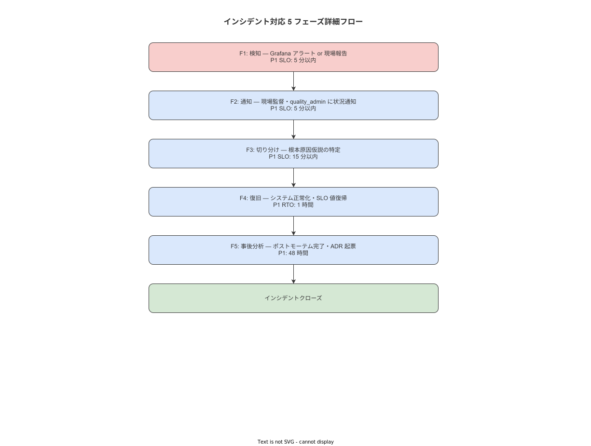

# 02 5フェーズ対応フロー総則

最終更新: 2026-05-18 | 管理者: system_admin | 根拠要件: OPS-056 / OPS-057

---

## 1 Just Culture 宣言（OPS-065）

本ドキュメントおよびすべての障害対応・ポストモーテムにおいて Just Culture 原則を適用する。

1. 個人への非難は禁止する
2. システム・プロセスの視点でのみ原因を分析する
3. ポストモーテムの内容を人事評価に使用することを禁止する（OPS-066）

障害対応中に個人を責める発言が記録された場合、その記録はポストモーテムから除外する。

---

## 2 5 フェーズ対応フロー概要（OPS-056）

**図 1: 5 フェーズ対応フロー全体**



> 原本: [`img/fig_inc_5phase_flow.drawio`](img/fig_inc_5phase_flow.drawio)

| フェーズ | 名称 | 入力 | 出力 |
|---|---|---|---|
| F1 | 検知 | アラート / 現場報告 | 検知記録（INC 仮登録） |
| F2 | 通知 | 検知記録 | 通知文書（OPS-058 準拠） |
| F3 | 切り分け | 通知文書 | SitRep（状況報告書）|
| F4 | 復旧 | SitRep | RCA 速報・復旧完了通知 |
| F5 | 事後分析 | RCA 速報 | ポストモーテム（PM-YYYY-NNN）|

---

## 3 フェーズ別詳細（OPS-056）

### 3.1 F1 検知

| 項目 | 内容 |
|---|---|
| P1 SLO | 5 分以内 |
| P2 SLO | 15 分以内 |
| 検知手段 | Grafana アラート（自動）/ 現場からの電話・口頭報告 |
| 入力チャネル | RUN-001（Grafana）/ RUN-002（現場報告） |
| 必須アクション | INC-YYYY-NNN の仮登録。P 分類の初期判定 |

**F1 判定 SQL（DB 疎通確認）**

```sql
-- PostgreSQL 疎通確認
SELECT version();
-- 実行可能 → DB 稼働中
```

```bash
# API 疎通確認
curl -fsS http://localhost:8080/health
# 200 OK → API 稼働中
```

**本節で確定した方針**
- **F1 は SLO を超過した場合、超過した事実と原因を INC 記録に明記する。**
- **自動アラートと現場報告が競合した場合、先着を正式な検知時刻とする。**
- **F1 完了条件: INC 仮登録完了 + P 分類決定。**

---

### 3.2 F2 通知

| 項目 | 内容 |
|---|---|
| P1 SLO | 5 分以内（F1 完了から） |
| P2 SLO | 15 分以内（F1 完了から） |
| 通知先 | system_admin（P1/P2 即時）/ 現場監督（P1 即時・P2 30 分以内） |
| 通知手段 | RUN-003（通知文書テンプレート）準拠 |
| 必須成果物 | 通知文書（3 要素 OPS-058 を含む） |

**通知 3 要素（OPS-058）**

1. 何が起きているか（事実のみ・仮説を含まない）
2. 影響範囲（どのシステム・工程・ユーザーが影響を受けているか）
3. 現在の対応状況と次のアクション（担当・予定時刻）

**本節で確定した方針**
- **通知文書には仮説・推測を含めない。確認できた事実のみを記載する。**
- **F2 完了条件: 通知文書の送信・記録完了。**
- **通知先が応答しない場合は 5 分後に再通知し、記録に残す。**

---

### 3.3 F3 切り分け

| 項目 | 内容 |
|---|---|
| P1 SLO | 15 分以内（F2 完了から） |
| P2 SLO | 30 分以内（F2 完了から） |
| 手順 | 04 章 RUN-010〜019（症状別） |
| 必須成果物 | SitRep（状況報告書）— 原因仮説 + 影響範囲確定 |

**SitRep フォーマット**

```
SitRep #N - INC-YYYY-NNN
時刻（JST）: YYYY-MM-DD HH:MM
フェーズ: F3 切り分け中
状況:
- 確認済み事実: ...
- 現在の仮説: ...
- 影響範囲: ...
次のアクション: ... (担当: system_admin, 予定: HH:MM)
```

**本節で確定した方針**
- **F3 は RUN-010〜019 の該当手順を使用し、手順外の即興診断は記録に残す。**
- **F3 完了条件: 原因仮説が 1 つに絞られ、復旧手順（F4）の選択が完了している状態。**
- **F3 SLO を超過した場合は SitRep に理由を明記し、縮退運用（06 章）の発動を評価する。**

---

### 3.4 F4 復旧

| 項目 | 内容 |
|---|---|
| P1 SLO | 1 時間以内（RTO、F1 完了から） |
| P2 SLO | 4 時間以内（RTO、F1 完了から） |
| 手順 | 05 章 RUN-020〜029（症状別） |
| 必須成果物 | RCA 速報（復旧直後 15 分以内）・復旧完了通知 |

**RCA 速報フォーマット**

```
RCA 速報 - INC-YYYY-NNN
復旧時刻（JST）: YYYY-MM-DD HH:MM
復旧手順: RUN-XXX（〇〇の実施）
推定根本原因（速報）: ...
恒久対策の必要性: あり / なし（理由: ...）
ポストモーテム: 必要 / 不要
```

**RTO 超過時の対応**

RTO を超過した場合は以下を必ず実施する。

1. 超過の事実を INC 記録に記録する
2. 縮退運用（06 章）の継続または昇格を評価する
3. 復旧完了後に RTO 超過の根本原因を F5 ポストモーテムに含める

**本節で確定した方針**
- **F4 は必ず RUN-020〜029 の標準手順を使用し、手順外の操作は事前に記録する。**
- **RTO 超過は必ず根本原因分析をポストモーテムに含める（OPS-057）。**
- **F4 完了条件: サービス正常性確認（health check 200 OK + 作業記録の書き込み確認）。**

---

### 3.5 F5 事後分析

| 項目 | 内容 |
|---|---|
| P1 SLO | 48 時間以内（OPS-057） |
| P2 SLO | 72 時間以内（OPS-057） |
| 手順 | 11 章（ポストモーテム手順とテンプレート） |
| 必須成果物 | ポストモーテム（PM-YYYY-NNN）・ADR（必要な場合） |
| 配置先 | `docs/ポストモーテム/YYYY-MM-DD_PX_<slug>.md`（OPS-064） |

**本節で確定した方針**
- **F5 は Just Culture 原則に従い、システム・プロセスの観点で実施する（OPS-065）。**
- **F5 完了条件: ポストモーテムの SMART アクション項目が全件 owner と期日を持つ状態。**
- **SLO 超過時の再評価: 超過した SLO はポストモーテムのアクション項目に改善策を含める。**

---

## 4 SLO 一覧（OPS-057）

| フェーズ | P1 SLO | P2 SLO | SLO 超過時の対応 |
|---|---|---|---|
| F1 検知 | 5 分以内 | 15 分以内 | INC 記録に超過理由を記載 |
| F2 通知 | 5 分以内 | 15 分以内 | INC 記録に超過理由を記載 |
| F3 切り分け | 15 分以内 | 30 分以内 | 縮退運用発動を評価 |
| F4 復旧（RTO） | 1 時間以内 | 4 時間以内 | ポストモーテムに RTO 超過分析を含める |
| F5 事後分析 | 48 時間以内 | 72 時間以内 | system_admin が期限延長を記録 |

---

## 5 必須成果物チェックリスト

```
CHK-002: 5 フェーズ必須成果物確認
□ F1: INC-YYYY-NNN 仮登録 + P 分類決定
□ F2: 通知文書（3 要素）送信・記録
□ F3: SitRep 作成（原因仮説・影響範囲確定）
□ F4: RCA 速報作成・復旧完了通知送信
□ F5: ポストモーテム（PM-YYYY-NNN）作成・docs/ポストモーテム/ 格納
□ F5: アクション項目（SMART）全件 owner + 期日設定
```

---

## 参照業界分析

### 必須
- Google SRE Book Chapter 14 "Managing Incidents" — F1〜F5 フェーズ構造と SLO 設定の参考
- IPA「システム管理基準」4.2.1.c — インシデントライフサイクル管理の要件根拠
- Google Blameless Postmortem — Just Culture 宣言の実践根拠

### 関連
- ITIL v4 Incident Management — フェーズ別成果物定義の参考
- AWS Well-Architected Framework（Reliability Pillar）— RTO/RPO 設定の業界参考値
