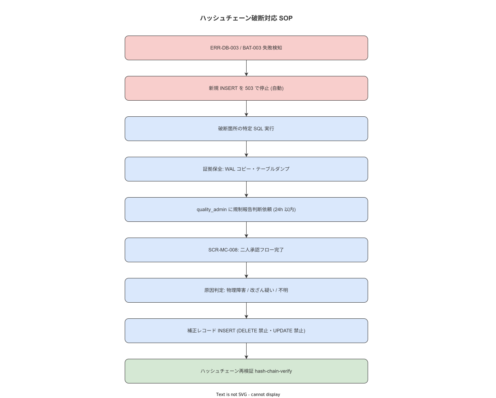

# 08 ハッシュチェーン破断対応

最終更新: 2026-05-18（Unit-14: 2バイナリ分割対応） | 管理者: system_admin | 根拠要件: ERR-DB-003 / MET-006 / OPS-062

---

## 1 概要

**図 1: ハッシュチェーン破断対応フロー**



> 原本: [`img/fig_inc_hash_chain_break.drawio`](img/fig_inc_hash_chain_break.drawio)

ハッシュチェーン破断は ALCOA+ Original 不変性（既存レコードの変更・削除の禁止）への直接的な脅威であり、P1 インシデントとして扱う。本章は ERR-DB-003 発生時の全手順を定義する。

**ALCOA+ Original 不変性の宣言**

本システムにおける作業記録・検査記録・不適合記録は一度書き込まれたレコードの変更・削除を禁止する。誤記の補正は新規レコードの追加によってのみ実施する。この制約はシステム停止中（LEVEL-3）・緊急対応中を問わず維持する。

---

## 2 発動トリガー

**担当バイナリ**: HashChainVerifier は **master-api** 内の tokio task として動作する。ハッシュチェーン検証ログは `docker compose logs master-api` で確認する。

以下のいずれかを検知した場合に本章の手順を開始する。

| トリガー | 確認方法 | 発生元バイナリ |
|---|---|---|
| ERR-DB-003 が API ログに出現 | `docker compose logs master-api \| grep ERR-DB-003` | master-api |
| MET-006（hash_chain_error_total）> 0 | Prometheus クエリ: `hash_chain_error_total > 0`（1 件以上で system_admin + quality_admin に通知）| master-api（メトリクス発信元）|
| BAT-003（ハッシュチェーン検証）が失敗 | `batch_job_status.last_status = 'FAILED' WHERE job_id='BAT-003'` | master-api（BAT-003 実行元）|

---

## 3 Step 1: 処理範囲の自動停止確認

ハッシュチェーン破断検知と同時に、システムは以下を自動停止する。

| 停止対象 | 期待動作 |
|---|---|
| 新規 INSERT（step_results / inspection_results / nonconformance_reports） | 503 Service Unavailable を返す |
| BAT-002（Outbox 処理） | 自動停止 |
| BAT-006〜009（各種集計バッチ） | 自動停止 |

```bash
# 自動停止の確認
# API が 503 を返しているか確認
curl -fsS http://localhost:8080/api/v1/step-results \
  -H "Authorization: Bearer ${SYSTEM_ADMIN_JWT}" \
  -d '{"test": true}' 2>&1
# 期待値: HTTP 503

# 停止しているバッチ確認
psql -U postgres -d work_nav \
  -c "SELECT job_id, last_status, stopped_at FROM batch_job_status WHERE job_id IN ('BAT-002','BAT-006','BAT-007','BAT-008','BAT-009');"
```

**本節で確定した方針**
- **自動停止が機能していない場合は system_admin が手動でバッチを停止し、API を LEVEL-1 縮退（読み取り専用）に切り替える。**
- **停止確認前に新規 INSERT が継続する状態は許容しない。**
- **停止状態であっても読み取り系 API は継続して応答する。**

---

## 4 Step 2: 停止状態の確認 SQL

```sql
-- 影響を受けているテーブルの状態確認
SELECT
  'step_results' AS table_name,
  count(*) AS total_records,
  max(created_at) AS latest_record,
  count(*) FILTER (WHERE hash_verified = false) AS unverified_count
FROM step_results
UNION ALL
SELECT
  'inspection_results',
  count(*),
  max(created_at),
  count(*) FILTER (WHERE hash_verified = false)
FROM inspection_results
UNION ALL
SELECT
  'nonconformance_reports',
  count(*),
  max(created_at),
  count(*) FILTER (WHERE hash_verified = false)
FROM nonconformance_reports;

-- ハッシュチェーンエラーの詳細
SELECT
  id,
  table_name,
  record_id,
  expected_hash,
  actual_hash,
  detected_at,
  error_type
FROM hash_chain_errors
WHERE resolved_at IS NULL
ORDER BY detected_at DESC;
```

**本節で確定した方針**
- **unverified_count > 0 のテーブルを対象として Step 3 以降の調査を実施する。**
- **確認 SQL の実行結果を全件 INC 記録に添付する（証拠保全）。**
- **SQL の実行は READ ONLY セッションで実施し、意図しない更新を防ぐ。**

---

## 5 Step 3: 破断箇所の特定 SQL

```sql
-- 破断箇所の特定（step_results の例）
WITH chain_check AS (
  SELECT
    id,
    hash_value,
    LAG(hash_value) OVER (ORDER BY id) AS prev_hash_value,
    expected_prev_hash,
    created_at
  FROM step_results
  ORDER BY id
)
SELECT
  id,
  created_at,
  prev_hash_value,
  expected_prev_hash,
  CASE
    WHEN prev_hash_value != expected_prev_hash THEN '破断あり'
    ELSE '正常'
  END AS chain_status
FROM chain_check
WHERE prev_hash_value != expected_prev_hash
   OR expected_prev_hash IS NULL AND id != (SELECT MIN(id) FROM step_results)
ORDER BY id;

-- 最初の破断レコードを特定
SELECT MIN(id) AS first_broken_id, MIN(created_at) AS first_broken_at
FROM (
  SELECT id, created_at,
    LAG(hash_value) OVER (ORDER BY id) AS prev_hash,
    expected_prev_hash
  FROM step_results
) t
WHERE prev_hash != expected_prev_hash;
```

**本節で確定した方針**
- **最初の破断レコード（first_broken_id）以降のレコードが調査対象となる。**
- **破断箇所の特定結果を「破断開始 ID・テーブル名・発生時刻」として INC 記録に記録する。**
- **複数テーブルで破断が確認された場合は最も早い発生時刻のものを根本破断点とする。**

---

## 6 Step 4: 証拠保全

```bash
# WAL アーカイブのコピー（破断発生時刻周辺）
BROKEN_AT="2026-05-18T14:30:00"  # 破断発生時刻
WAL_BACKUP_DIR="/secure_backup/hash_chain_break_$(date +%Y%m%d_%H%M%S)"
mkdir -p ${WAL_BACKUP_DIR}
cp -rp {WAL_ARCHIVE_PATH}/ ${WAL_BACKUP_DIR}/wal/

# 対象テーブルのダンプ（現状の完全コピー）
pg_dump -U postgres -d work_nav \
  -t step_results -t inspection_results -t nonconformance_reports \
  -t hash_chain_errors \
  --no-owner -F c \
  -f ${WAL_BACKUP_DIR}/affected_tables_$(date +%Y%m%d_%H%M%S).dump

# API ログの保全（ハッシュチェーン検証は master-api が担当）
docker compose logs master-api --since 24h > ${WAL_BACKUP_DIR}/master_api_log_$(date +%Y%m%d_%H%M%S).log
docker compose logs terminal-api --since 24h > ${WAL_BACKUP_DIR}/terminal_api_log_$(date +%Y%m%d_%H%M%S).log
docker compose logs postgres --since 24h > ${WAL_BACKUP_DIR}/postgres_log_$(date +%Y%m%d_%H%M%S).log

# 保全ファイルの確認
ls -lh ${WAL_BACKUP_DIR}/
```

**本節で確定した方針**
- **証拠保全は Step 3（特定）完了後 30 分以内に実施する。**
- **保全先（WAL_BACKUP_DIR）はメインの PostgreSQL データ領域とは別のディスク・パスに保存する。**
- **保全したファイルのチェックサム（sha256sum）を取得し INC 記録に記録する。**

---

## 7 Step 5: quality_admin への規制報告判断依頼

```
quality_admin への連絡テンプレート:
「INC-YYYY-NNN: ハッシュチェーン破断を検知しました。
破断箇所: {テーブル名} ID={first_broken_id}（{first_broken_at} 付近）
影響レコード数（概算）: {N} 件
証拠保全: 完了（{WAL_BACKUP_DIR}）
現在の状態: 新規 INSERT 停止中（READ ONLY）

判断が必要な事項:
1. 外部規制機関への報告要否（21 CFR Part 11 / 社内品質規程）
2. 原因調査の進め方（物理障害 vs 改ざん疑い）
3. 二人承認（SCR-MC-008）による承認フローの開始要否」
```

---

## 8 Step 6: 二人承認（SCR-MC-008）手順

ハッシュチェーン破断に対する補正処理は必ず二人承認（system_admin + quality_admin）を経て実施する。

承認フローは管理系機能のため **master-api（8081）** 経由で操作する。

```bash
# SCR-MC-008 承認フローの開始（管理 API は master-api で提供）
curl -fsX POST http://localhost:8081/api/v1/change-requests \
  -H "Content-Type: application/json" \
  -H "Authorization: Bearer ${SYSTEM_ADMIN_JWT}" \
  -d '{
    "type": "hash_chain_correction",
    "incident_id": "INC-YYYY-NNN",
    "target_table": "{TABLE_NAME}",
    "first_broken_id": {BROKEN_ID},
    "correction_type": "new_record_append",
    "reason": "ハッシュチェーン破断 ERR-DB-003。補正レコード追加による修正。",
    "requester": "system_admin"
  }' | jq .

# 承認確認
curl -fsS "http://localhost:8081/api/v1/change-requests/{CR_ID}" \
  -H "Authorization: Bearer ${SYSTEM_ADMIN_JWT}" | jq '.approval_status'
# 期待値: quality_admin の承認待ち → 承認後 "approved"
```

**本節で確定した方針**
- **二人承認が完了するまで補正処理は実施しない。**
- **SCR-MC-008 の承認記録は INC 記録に添付する。**
- **quality_admin が不在の場合は復旧を保留し BCP（07 章）を継続する。**

---

## 9 禁止事項（ALCOA+ Original 不変性維持）

以下の操作は緊急時・承認があっても禁止する:

| 禁止操作 | 理由 |
|---|---|
| `DELETE FROM step_results WHERE ...` | Original 不変性の違反 |
| `UPDATE step_results SET ... WHERE ...` | Original 不変性の違反 |
| `TRUNCATE TABLE step_results` | 全件削除による Original 不変性の違反 |
| hash_value の直接更新 | ハッシュチェーン改ざんと区別できない |

補正が必要な場合は「補正レコード（correction_record）の新規追加」のみを実施する。

```sql
-- 補正レコードの追加例（DELETE/UPDATE ではなく新規 INSERT）
-- 事前準備: 破断ブロック（broken_at_block_id）の chain_hash を取得する
SELECT chain_hash FROM hash_chain_blocks WHERE block_id = '{BROKEN_AT_BLOCK_ID}';
-- → compute_correction_chain_hash（FNC-BE-017）で補正ブロックの prev_hash を計算する:
--   prev_hash = 破断ブロック（broken_at_block_id）の chain_hash を compute_correction_chain_hash で計算した値
--   chain_hash = SHA-256(prev_hash || correction_content_hash)

INSERT INTO work_events (
  event_id, case_id, activity, timestamp_client, timestamp_server,
  resource, step_id, payload,
  prev_hash, content_hash, chain_hash,
  is_correction, broken_at_block_id, original_record_id, correction_reason,
  approver_primary, approver_secondary
)
VALUES (
  gen_random_uuid(), '{CASE_ID}', 'correction_record', NOW(), NOW(),
  '{OPERATOR_ID}', '{STEP_ID}',
  '{"approver_primary":"{APPROVER_PRIMARY}","approver_secondary":"{APPROVER_SECONDARY}","correction_reason":"ハッシュチェーン破断後の補正: INC-YYYY-NNN","is_correction":true,"original_record_id":"{ORIGINAL_ID}"}',
  '{PREV_HASH_COMPUTED_BY_FNC_BE_017}',   -- 破断ブロックの chain_hash を compute_correction_chain_hash で計算した値（D2 / ADR-008）
  '{CONTENT_HASH}',                       -- compute_content_hash（FNC-BE-009）で計算した値
  '{CHAIN_HASH}',                         -- compute_correction_chain_hash（FNC-BE-017）で計算した値
  TRUE, '{BROKEN_AT_BLOCK_ID}', '{ORIGINAL_ID}', 'ハッシュチェーン破断後の補正: INC-YYYY-NNN',
  '{APPROVER_PRIMARY_USER_ID}', '{APPROVER_SECONDARY_USER_ID}'
);
```

**補正レコード INSERT 時の prev_hash 計算手順（D2 / ADR-008）**

1. `broken_at_block_id`（破断が検知されたブロック ID）を Step 3 で特定する
2. `SELECT chain_hash FROM hash_chain_blocks WHERE block_id = '{BROKEN_AT_BLOCK_ID}'` で破断ブロックの chain_hash を取得する
3. 補正ブロックの content_hash を `compute_content_hash`（FNC-BE-009）で計算する
4. `compute_correction_chain_hash`（FNC-BE-017）: `SHA-256(broken_block_chain_hash || correction_content_hash)` で補正ブロックの chain_hash を計算する
5. 補正ブロックの `prev_hash` = 破断ブロックの `chain_hash`（フォーク禁止 / ADR-008）

**本節で確定した方針**
- **DELETE・UPDATE は禁止する。補正は新規レコード追加のみで実施する（ALCOA+ Original）。**
- **補正レコードには is_correction=TRUE・broken_at_block_id・original_record_id・correction_reason・approver_primary・approver_secondary の必須項目を設定する。**
- **補正レコードの prev_hash は破断ブロック（broken_at_block_id）の chain_hash を FNC-BE-017 で計算した値を使用する（D2 / ADR-008）。独立した genesis（[0u8;32]）を割り当てるフォークは禁止する。**
- **補正レコードの追加も二人承認（SCR-MC-008）が完了した後にのみ実施する。**

---

## 10 規制報告フロー

| 原因判定 | 報告要否 | 報告先 |
|---|---|---|
| 物理障害（ハードウェア障害・ビット反転等）| 社内品質記録に記録。外部報告は不要 | 社内品質管理部門 |
| 改ざん疑い（アクセスログに不審な操作）| 外部規制機関への報告を quality_admin が判断 | quality_admin → 規制機関 |
| 原因不明 | 調査継続。quality_admin が報告要否を判断 | quality_admin |

---

## 11 復旧基準

以下のすべてを満たした場合に「復旧完了」と宣言する。

```
CHK-009: ハッシュチェーン破断復旧確認
□ BAT-003（ハッシュチェーン検証）がエラー 0 件で完了した
□ hash_chain_errors テーブルの未解決件数 = 0
□ hash_chain_verification_results の最新行 status が 'CORRECTED' または 'PASSED' であること
□ quality_admin が補正内容を承認した
□ 規制報告の要否を quality_admin が判断・記録した
□ INC 記録に「復旧完了・ポストモーテム必要」を記録した
□ 新規 INSERT の 503 停止を解除した
□ 停止していたバッチ（BAT-002/006〜009）を再開した
```

```sql
-- 復旧確認クエリ: 最新の検証結果を確認する
SELECT status, verified_at, correction_block_ids
FROM hash_chain_verification_results
ORDER BY verified_at DESC
LIMIT 1;
-- 期待値: status IN ('CORRECTED', 'PASSED')
```

---

## 参照業界分析

### 必須
- 21 CFR Part 11（FDA 電子記録）— 電子記録の不変性・改ざん検出の規制要件
- ALCOA+（Attributable / Legible / Contemporaneous / Original / Accurate + Complete / Consistent / Enduring / Available）— 補正レコード追加のみという制約の根拠

### 関連
- NIST SP 800-57（鍵管理）— ハッシュチェーン設計の暗号基盤参考
- ISO/IEC 27001（情報セキュリティ）— 改ざん疑いインシデントの対応フレームの参考
